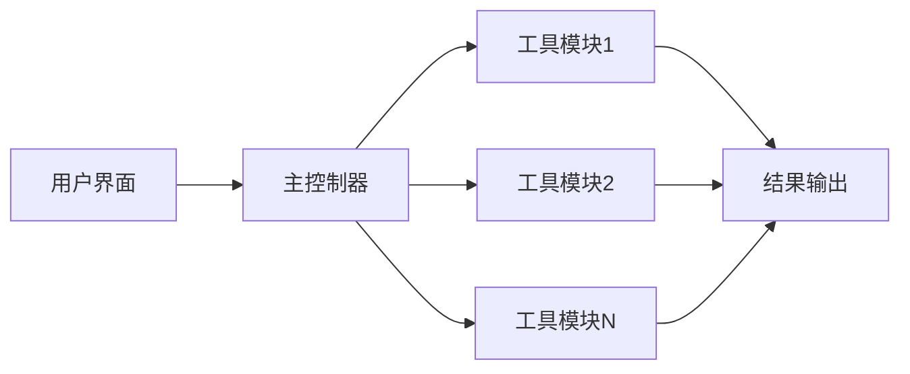
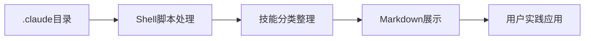
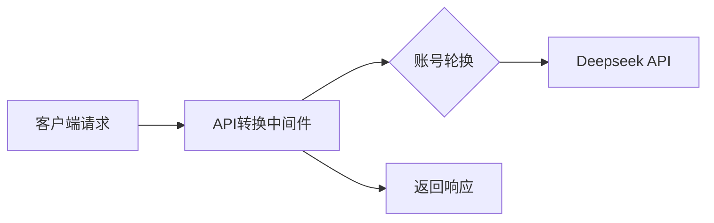
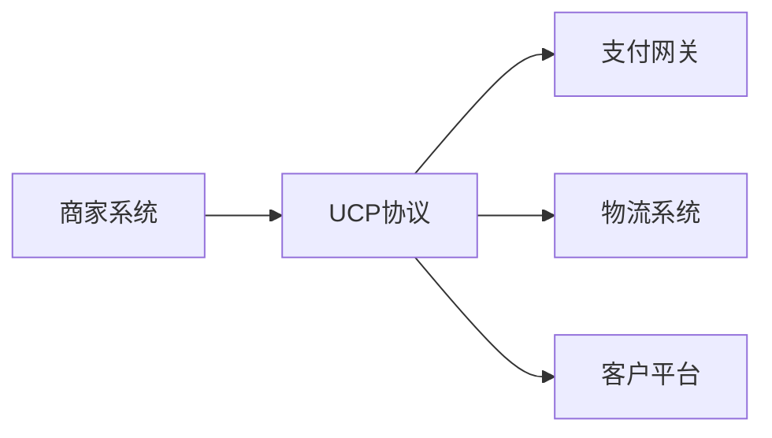

## 今日热点

AI开发工具与代理系统今日持续升温，Claude相关项目表现尤为突出，同时开源AI模型和编程教育项目也获得显著关注，反映开发者对AI辅助开发和实践学习的强烈需求。

---

## 热门项目一览

| 排名 | 项目 | 语言 | 今日 | 总计 | 简介 |
|:---:|------|:----:|------:|-----:|------|
| 1 | [Alishahryar1/free-claude-code](https://github.com/Alishahryar1/free-claude-code) | Python | +4,007 | 11,538 | Use claude-code for free in... |
| 2 | [codecrafters-io/build-your-own-x](https://github.com/codecrafters-io/build-your-own-x) | Markdown | +1,432 | 496,017 | Master programming by recre... |
| 3 | [huggingface/ml-intern](https://github.com/huggingface/ml-intern) | Python | +1,240 | 6,261 | 🤗 ml-intern: an open-source... |
| 4 | [Z4nzu/hackingtool](https://github.com/Z4nzu/hackingtool) | Python | +1,200 | 63,930 | ALL IN ONE Hacking Tool For... |
| 5 | [mattpocock/skills](https://github.com/mattpocock/skills) | Shell | +1,139 | 20,144 | My personal directory of sk... |
| 6 | [PostHog/posthog](https://github.com/PostHog/posthog) | Python | +471 | 33,507 | 🦔 PostHog is an all-in-one ... |
| 7 | [deepseek-ai/DeepEP](https://github.com/deepseek-ai/DeepEP) | Cuda | +189 | 9,499 | DeepEP: an efficient expert... |
| 8 | [ComposioHQ/awesome-codex-skills](https://github.com/ComposioHQ/awesome-codex-skills) | Python | +188 | 1,500 | A curated list of practical... |
| 9 | [davila7/claude-code-templates](https://github.com/davila7/claude-code-templates) | Python | +87 | 25,366 | CLI tool for configuring an... |
| 10 | [RooCodeInc/Roo-Code](https://github.com/RooCodeInc/Roo-Code) | TypeScript | +57 | 23,516 | Roo Code gives you a whole ... |
| 11 | [PowerShell/PowerShell](https://github.com/PowerShell/PowerShell) | C# | +48 | 53,078 | PowerShell for every system! |
| 12 | [CJackHwang/ds2api](https://github.com/CJackHwang/ds2api) | Go | +44 | 1,422 | Deepseek to API: A lightwei... |

---

## 趋势洞察

```
┌─────────────────────────────────────────────────────────────────┐
│  AI/ML 工具         ████████████████████████  8 个项目        │
│  开发工具             █████████                 3 个项目        │
│  其他               ██████                    2 个项目        │
└─────────────────────────────────────────────────────────────────┘
```

---

## 项目深度解读

### 1. Alishahryar1/free-claude-code — 免费Claude工具

> **一句话总结**：绕过限制免费使用Claude代码工具，支持终端、VSCode扩展和Discord多平台。

#### 价值主张

| 维度 | 说明 |
|------|------|
| **解决痛点** | 解决Claude官方API的付费限制，提供免费使用途径 |
| **目标用户** | 开发者、编程爱好者、需要AI辅助编程的用户 |
| **核心亮点** | 多平台支持 + 绕过付费限制 + 非官方实现 |

#### 技术架构


**技术特色**：
- 使用Python实现跨平台兼容性
- 通过非官方途径访问Claude API
- 支持多种使用场景（终端、VSCode、Discord）

#### 热度分析

- 项目短时间内获得大量关注（单日增长4000+ stars），表明用户对免费使用Claude的需求强烈
- 较低的issues数量(0)可能表示项目处于早期阶段或问题被快速解决

#### 快速上手

```bash
# 终端使用
pip install free-claude-code
claude-code --help

# VSCode扩展
# 安装VSCode扩展并配置API密钥

# Discord
# 添加Discord机器人并邀请到服务器
```

#### 注意事项

- 项目可能涉及版权和API使用条款问题
- 非官方途径使用可能存在安全风险
- 项目长期稳定性不确定，可能随着官方政策变化而失效


### 2. codecrafters-io/build-your-own-x — 实践编程学习平台

> **一句话总结**：通过重建流行技术工具，提供实践性编程学习路径，帮助开发者深入理解技术原理。

#### 价值主张

| 维度 | 说明 |
|------|------|
| **解决痛点** | 解决理论学习与实际应用脱节问题，提供动手实践机会 |
| **目标用户** | 寻求深入理解技术原理的中高级开发者和计算机科学学生 |
| **核心亮点** | 项目式学习 + 实践驱动 + 技术深度 + 渐进式难度 + 社区支持 |

#### 技术架构


**技术特色**：
- 基于Markdown的简洁文档结构
- 提供分步骤的构建指南和测试框架
- 支持多种技术栈的渐进式学习路径

#### 热度分析

- 高星高fork项目，近期持续稳定增长，日均增加1400+星标
- 作为编程学习资源，在开发者社区具有广泛影响力

#### 快速上手

```bash
# 克隆项目
git clone https://github.com/codecrafters-io/build-your-own-x.git

# 查看可构建的技术列表
cat README.md

# 进入特定技术构建目录
cd build-your-own-git
```

#### 注意事项

- 项目本身不包含代码实现，而是提供构建指南和测试框架
- 需要用户自行完成代码实现，项目提供测试验证
- 某些技术构建可能需要前置知识准备


### 3. huggingface/ml-intern — AI研究助手

> **一句话总结**：开源ML工程师助手，自动化论文阅读、模型训练与部署全流程。

#### 价值主张

| 维度 | 说明 |
|------|------|
| **解决痛点** | 解决ML研究到部署的全流程自动化问题，减少重复性工作 |
| **目标用户** | 机器学习研究人员、工程师和AI开发者 |
| **核心亮点** | 自动化论文阅读 + 模型训练流程优化 + 一键部署能力 + 与Hugging Face生态集成 + 持续学习更新 |

#### 技术架构


**技术特色**：
- 结合NLP技术理解学术论文内容
- 自动化模型训练流水线
- 与Hugging Face生态系统深度集成

#### 热度分析

- 项目Star数增长迅猛，单日新增1,240个Star，社区关注度极高
- 作为Hugging Face生态的重要补充，有望成为AI研究开发的标准工具

#### 快速上手

```bash
# 安装ml-intern
pip install ml-intern

# 初始化项目
ml-intern init my-ml-project

# 开始训练模型
ml-intern train --paper "paper_name_or_path"
```

#### 注意事项

- 项目可能需要较高的计算资源，特别是模型训练阶段
- 作为新兴项目，API可能不稳定，建议关注更新
- 可能需要Hugging Face账号以充分利用云资源


### 4. Z4nzu/hackingtool — 黑客工具集成平台

> **一句话总结**：集成多种黑客工具的Python平台，提供一站式安全测试解决方案

#### 价值主张

| 维度 | 说明 |
|------|------|
| **解决痛点** | 整合分散的安全工具，简化渗透测试流程，提高工作效率 |
| **目标用户** | 渗透测试人员、网络安全研究员、道德黑客 |
| **核心亮点** | 多工具集成 + 统一界面 + 自动化执行 + 跨平台支持 |

#### 技术架构



**技术特色**：
- 模块化设计，便于扩展和维护
- 命令行与图形界面双重支持
- 跨平台兼容性，支持Windows/Linux/macOS

#### 热度分析

- 项目Star数超6.3万且持续快速增长，表明在安全领域受高度关注
- Fork数与Star数比例健康，社区活跃且有深度参与

#### 快速上手

```bash
git clone https://github.com/Z4nzu/hackingtool.git
cd hackingtool
pip install -r requirements.txt
python hackingtool.py
```

#### 注意事项

- 此工具仅用于授权的安全测试和教育目的
- 使用前需确保获得目标系统的明确授权
- 遵守当地法律法规，避免非法使用
- 定期更新工具以获取最新的安全功能和修复


### 5. mattpocock/skills — AI技能目录

> **一句话总结**：从Claude .claude目录提取的高质量AI提示词与技能集合，提升AI交互效率。

#### 价值主张

| 维度 | 说明 |
|------|------|
| **解决痛点** | 解决AI用户缺乏优质提示词和技能指导的问题 |
| **目标用户** | Claude AI用户、AI提示词工程师、开发者 |
| **核心亮点** | + 实战验证的提示词 + 结构化技能分类 + 个人经验沉淀 + 即用型解决方案 + 持续更新维护 |

#### 技术架构



**技术特色**：
- Shell脚本自动化提取和组织Claude交互数据
- 清晰的分类体系和文件结构设计
- Markdown格式便于阅读和二次开发

#### 热度分析

- 项目获2万+星且持续快速增长，反映AI提示词库需求旺盛
- 无开放问题表明项目维护良好，社区满意度高

#### 快速上手

```bash
# 克隆项目到本地
git clone https://github.com/mattpocock/skills.git

# 浏览技能目录
cd skills && find . -name "*.md" | head -10
```

#### 注意事项
- 主要针对Claude AI设计，其他平台可能需调整
- 使用时建议根据具体需求修改提示词，以获得最佳效果


### 6. PostHog/posthog — 产品分析平台

> **一句话总结**：PostHog是全栈产品分析平台，提供数据收集、分析与决策支持的一体化解决方案。

#### 价值主张

| 维度 | 说明 |
|------|------|
| **解决痛点** | 解决产品数据分散、分析工具割裂、决策依据不足的问题 |
| **目标用户** | 产品经理、开发团队、数据分析师与增长黑客 |
| **核心亮点** | 全栈产品分析 + 会话回放 + AI辅助开发 + 功能标志管理 |

#### 技术架构


**技术特色**：
- 分布式事件收集与实时处理架构
- 开放API与多语言SDK支持
- 隐私保护与数据合规设计

#### 热度分析

- 项目Star数超3.3万，近期增长迅速，日均新增约470个Star
- 作为开源产品分析工具，在开发者社区中处于领先地位，Fork数显示社区活跃度高

#### 快速上手

```bash
# 安装PostHog Python客户端
pip install posthog

# 初始化客户端
from posthog import Posthog
posthog = Posthog('YOUR_API_KEY')

# 记录用户事件
posthog.capture('user_id', 'event_name', properties={'property1': 'value'})
```

#### 注意事项

- 需要自行部署或使用云服务，可能需要一定的技术资源
- 数据隐私与合规性需要根据当地法规进行配置
- 对于大型应用，可能需要考虑性能优化与数据存储策略


### 7. deepseek-ai/DeepEP — 高效专家并行库

> **一句话总结**：DeepEP 是一个针对专家并行训练的高效通信库，显著减少多专家模型训练中的通信开销。

#### 价值主张

| 维度 | 说明 |
|------|------|
| **解决痛点** | 解决大规模专家模型训练中的通信瓶颈问题 |
| **目标用户** | 大规模模型训练研究人员和工程师 |
| **核心亮点** | 高效通信算法 + 低延迟 + 高吞吐量 + 易集成性 |

#### 技术架构


**技术特色**：
- 高效的专家间通信算法
- 优化的CUDA实现，充分利用GPU资源
- 支持多种并行策略和通信模式

#### 热度分析

- 项目Star数近万且持续增长，显示其在AI社区的高度认可
- 零开放问题表明项目成熟度高，维护良好

#### 快速上手

```bash
# 克隆仓库
git clone https://github.com/deepseek-ai/DeepEP.git
cd DeepEP
# 编安装
make install
# 简单示例
python examples/simple_moe.py
```

#### 注意事项

- 需要NVIDIA GPU支持，依赖CUDA环境
- 针对大规模模型优化，小规模场景可能收益不明显
- 可能需要与现有深度学习框架集成使用


### 8. ComposioHQ/awesome-codex-skills — AI技能集

> **一句话总结**：精选 Codex 技能列表，助力工作流自动化与开发效率提升。

#### 价值主张

| 维度 | 说明 |
|------|------|
| **解决痛点** | 简化 Codex 集成，提供可直接使用的技能代码 |
| **目标用户** | 开发者、AI 工程师、自动化流程构建者 |
| **核心亮点** | 精选技能集合 + 实际应用场景 + 即用代码示例 + 多平台支持 + 持续更新 |

#### 技术架构


**技术特色**：
- 结构化组织技能分类
- 提供可直接运行的代码示例
- 社区驱动的内容更新机制

#### 热度分析

- 项目获得 1500+ 星标且近期增长迅速（单日新增188星），显示社区对该资源的高度认可
- 作为精选列表项目，在 Codex 生态系统中扮演着技能发现和学习的重要角色

#### 快速上手

```bash
# 克隆项目到本地
git clone https://github.com/ComposioHQ/awesome-codex-skills.git

# 浏览技能分类目录
cd awesome-codex-skills && ls -la
```

#### 注意事项

- 项目中的技能可能需要根据具体应用场景进行调整
- 部分技能可能依赖于特定的 API 版本或配置
- 使用前应检查技能的兼容性和安全性


### 9. davila7/claude-code-templates — Claude CLI 工具

> **一句话总结**：为 Claude Code 提供配置和监控功能的命令行工具，简化 AI 编程助手的使用流程

#### 价值主张

| 维度 | 说明 |
|------|------|
| **解决痛点** | 解决 Claude Code 配置复杂、缺乏统一管理工具的问题 |
| **目标用户** | 使用 Claude AI 进行编程的开发者和研究人员 |
| **核心亮点** | 命令行界面 + 配置管理 + 监控功能 + 模板支持 + 扩展性 |

#### 技术架构


**技术特色**：
- 基于 Python 的轻量级 CLI 工具设计
- 集成 Claude API 进行智能代码处理
- 提供配置模板简化设置流程
- 支持监控和日志记录功能
- 模块化架构便于扩展

#### 热度分析

- 高 Star 增长率(今日+87)显示项目热度持续上升，用户认可度高
- 较高 Fork 数量表明开发者社区积极参与，项目具有良好的可扩展性

#### 快速上手

```bash
# 安装工具
pip install claude-code-templates

# 初始化配置
claude-code init

# 启动监控
claude-code monitor
```

#### 注意事项

- 需要确保已正确安装 Python 环境
- 使用前需要配置 Claude API 密钥
- 某些高级功能可能需要订阅 Claude 服务
- 项目许可证不明确，使用前需确认授权条款


### 10. RooCodeInc/Roo-Code — AI编程助手

> **一句话总结**：在代码编辑器中提供完整AI开发团队，实现多代理协作编程体验。

#### 价值主张

| 维度 | 说明 |
|------|------|
| **解决痛点** | 单一开发者难以掌握所有技术栈，AI代理团队提供全方位编程支持 |
| **目标用户** | 软件开发团队和个人开发者，追求高效编码体验 |
| **核心亮点** | 多AI代理协作 + 代码实时生成 + 智能问题诊断 + 自动化测试 + 代码优化 |

#### 技术架构


**技术特色**：
- 基于TypeScript构建的跨平台代码编辑器插件
- 多AI代理协作架构，模拟真实开发团队工作流
- 深度集成代码编辑器API，实现无缝用户体验

#### 热度分析

- 高Star数且持续稳定增长，反映开发者对AI辅助编程工具的强烈需求
- Fork数表明项目具有高可扩展性和二次开发价值，社区活跃度极高

#### 快速上手

```bash
# 安装VS Code扩展
code --install-extension roo-code.roo-code

# 启动AI代理团队
Ctrl+Shift+P → 输入 "Roo Code: Start Team"
```

#### 注意事项

- 需要稳定的网络连接以访问AI服务
- 可能需要API密钥或订阅才能使用全部高级功能
- 生成的代码需要人工审核，AI可能无法完全理解复杂业务逻辑


### 11. PowerShell/PowerShell — 跨平台Shell

> **一句话总结**：微软开发的跨平台自动化与配置管理工具，结合命令行与脚本语言强大功能。

#### 价值主张

| 维度 | 说明 |
|------|------|
| **解决痛点** | 跨平台系统管理与自动化脚本需求，提供一致命令体验 |
| **目标用户** | 系统管理员、DevOps工程师、IT专业人员 |
| **核心亮点** | 跨平台支持 + 强大对象处理能力 + 丰富内置命令 + 管道处理 + 模块化设计 |

#### 技术架构


**技术特色**：
- 基于.NET Core构建，实现跨平台兼容
- 采用对象导向的管道处理，而非纯文本流
- 提供丰富的API和开发工具，便于扩展功能

#### 热度分析

- 高Star数(53k+)和持续增长表明在系统管理领域有广泛影响力
- 作为微软生态系统重要组件，拥有庞大用户群体和活跃社区

#### 快速上手

```bash
# 安装PowerShell (以Ubuntu为例)
wget https://packages.microsoft.com/config/ubuntu/20.04/packages-microsoft-prod.deb -O packages-microsoft-prod.deb
sudo dpkg -i packages-microsoft-prod.deb
sudo apt update
sudo apt install -y powershell

# 基本命令示例
Get-Process | Where-Object {$_.WorkingSet -gt 100MB} | Sort-Object -Property WorkingSet -Descending
```

#### 注意事项

- PowerShell Core (pwsh) 与 Windows PowerShell (powershell) 存在语法和功能差异
- 某些Windows特定模块在非Windows平台上可能不可用
- 脚本执行策略可能需要调整以运行本地脚本


### 12. CJackHwang/ds2api — API转换中间件

> **一句话总结**：轻量级高性能全栈中间件，将 Deepseek API 转换为通用 API，支持多账号轮换与多平台部署。

#### 价值主张

| 维度 | 说明 |
|------|------|
| **解决痛点** | 解决不同 AI 服务 API 格式不兼容问题，统一接口调用方式 |
| **目标用户** | 需要同时使用多种 AI 服务 API 开发者 |
| **核心亮点** | 轻量级高性能 + 多账号轮换 + 多平台部署 + 多 API 兼容 |

#### 技术架构



**技术特色**：
- 基于 Go 语言实现，性能优异
- 支持多账号轮换机制，提高请求稳定性
- 提供编译好的二进制文件，便于部署
- 支持 Docker 和 Vercel Serverless 等多种部署方式

#### 热度分析

- 项目 Star 数持续增长，近期每日新增约 44 个 Star，显示出较高的社区关注度
- Fork 数量适中，表明项目有一定技术深度和应用价值，适合二次开发

#### 快速上手

```bash
# 克隆项目
git clone https://github.com/CJackHwang/ds2api.git
cd ds2api

# 运行服务
go run main.go
```

#### 注意事项

- 项目许可证未知，商业使用前需确认授权条款
- 项目目前没有公开的 Issues，可能意味着项目维护较为封闭，社区参与度有限


### 13. Universal-Commerce-Protocol/ucp — 商业协议标准

> **一句话总结**：定义通用商业协议标准，规范电商系统间数据交换与业务流程。

#### 价值主张

| 维度 | 说明 |
|------|------|
| **解决痛点** | 统一电商系统间数据交换标准，解决协议碎片化问题 |
| **目标用户** | 电商平台开发者、支付服务提供商、物流系统集成商 |
| **核心亮点** | 跨平台兼容性 + 标准化数据格式 + 可扩展架构 + 行业共识 |

#### 技术架构



**技术特色**：
- 基于Python的规范实现，易于集成
- 提供完整的API文档和数据模型定义
- 采用模块化设计，支持多种商业场景扩展

#### 热度分析

- 项目获得近2800星且持续增长，表明商业协议标准需求强烈
- 零开放问题反映项目成熟度高，社区维护良好

#### 快速上手

```bash
# 克隆项目
git clone https://github.com/Universal-Commerce-Protocol/ucp.git

# 安装依赖
pip install -r requirements.txt

# 查看文档
python -m ucp.docs
```

#### 注意事项

- 项目协议规范尚未完全成熟，在生产环境使用前需充分测试
- 需关注协议版本更新，可能存在向后兼容性问题
- 集成第三方服务时需确认UCP协议支持情况


## 今日推荐

| 主题 | 推荐项目 | 亮点 |
|------|----------|------|
| 今日最热 | [Alishahryar1/free-claude-code](https://github.com/Alishahryar1/free-claude-code) | Use claude-code f... |
| 值得关注 | [codecrafters-io/build-your-own-x](https://github.com/codecrafters-io/build-your-own-x) | Master programmin... |
| 快速上手 | [huggingface/ml-intern](https://github.com/huggingface/ml-intern) | 🤗 ml-intern: an o... |
| 长期潜力 | [Z4nzu/hackingtool](https://github.com/Z4nzu/hackingtool) | ALL IN ONE Hackin... |

---

<div align="center">

*Generated on 2026-04-26 | Powered by GitHub Trending Reporter*

</div>