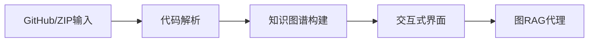
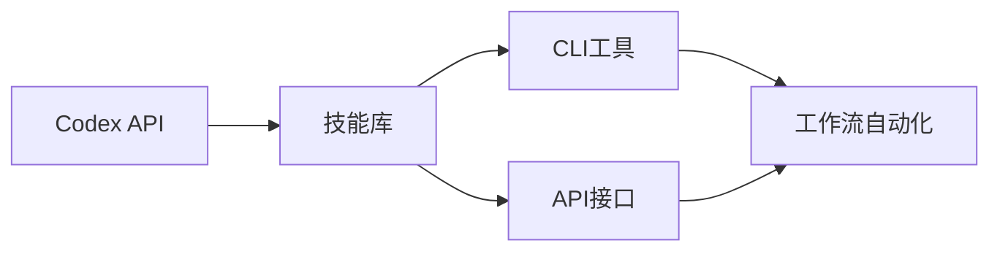
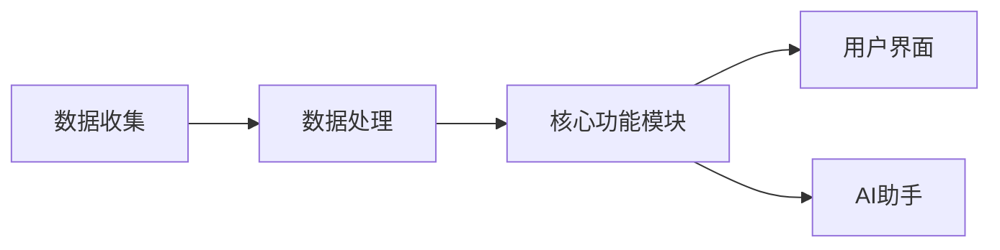
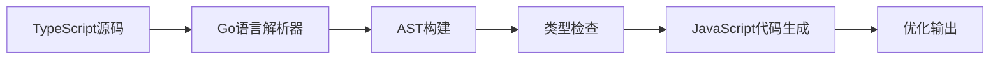

## 今日热点

今日GitHub热榜主要聚焦AI代理工具的爆发式增长，尤其是Claude相关工具和个人AI助手，同时代码智能与分析工具也呈现出强劲发展势头，反映出开发者对AI辅助编程和代码理解的迫切需求。

---

## 热门项目一览

| 排名 | 项目 | 语言 | 今日 | 总计 | 简介 |
|:---:|------|:----:|------:|-----:|------|
| 1 | [mattpocock/skills](https://github.com/mattpocock/skills) | Shell | +2,519 | 24,012 | Agent Skills for real engin... |
| 2 | [Z4nzu/hackingtool](https://github.com/Z4nzu/hackingtool) | Python | +1,720 | 65,586 | ALL IN ONE Hacking Tool For... |
| 3 | [Alishahryar1/free-claude-code](https://github.com/Alishahryar1/free-claude-code) | Python | +1,701 | 13,768 | Use claude-code for free in... |
| 4 | [codecrafters-io/build-your-own-x](https://github.com/codecrafters-io/build-your-own-x) | Markdown | +1,075 | 496,844 | Master programming by recre... |
| 5 | [abhigyanpatwari/GitNexus](https://github.com/abhigyanpatwari/GitNexus) | TypeScript | +700 | 30,228 | GitNexus: The Zero-Server C... |
| 6 | [openclaw/openclaw](https://github.com/openclaw/openclaw) | TypeScript | +627 | 364,670 | Your own personal AI assist... |
| 7 | [ComposioHQ/awesome-codex-skills](https://github.com/ComposioHQ/awesome-codex-skills) | Python | +517 | 2,036 | A curated list of practical... |
| 8 | [PostHog/posthog](https://github.com/PostHog/posthog) | Python | +337 | 33,859 | 🦔 PostHog is an all-in-one ... |
| 9 | [trycua/cua](https://github.com/trycua/cua) | HTML | +182 | 14,420 | Open-source infrastructure ... |
| 10 | [gastownhall/beads](https://github.com/gastownhall/beads) | Go | +152 | 21,708 | Beads - A memory upgrade fo... |
| 11 | [home-assistant/core](https://github.com/home-assistant/core) | Python | +73 | 86,547 | 🏡 Open source home automati... |
| 12 | [curl/curl](https://github.com/curl/curl) | C | +30 | 41,551 | A command line tool and lib... |

---

## 趋势洞察

```
┌─────────────────────────────────────────────────────────────────┐
│  AI/ML 工具         ████████████████████████  7 个项目        │
│  开发工具             ██████████                3 个项目        │
│  其他               ██████                    2 个项目        │
│  智能家居             ███                       1 个项目        │
└─────────────────────────────────────────────────────────────────┘
```

---

## 项目深度解读

### 1. mattpocock/skills — AI工程技能库

> **一句话总结**：为工程师提供Claude AI助手的实战技能集合，源自真实开发场景的经验积累。

#### 价值主张

| 维度 | 说明 |
|------|------|
| **解决痛点** | 工程师在使用AI助手时缺乏专业领域定制技能 |
| **目标用户** | 需要提高AI助手工作效率的开发者和系统工程师 |
| **核心亮点** | 实战验证 + 即插即用 + 模块化设计 + 持续更新 |

#### 技术架构


**技术特色**：
- 基于Shell实现的轻量级技能加载系统
- 直接集成到Claude AI工作流中
- 模块化设计便于扩展和维护

#### 热度分析

- 项目近期爆发式增长，单日增长超2500星，反映开发者对AI辅助工具的强烈需求
- 高星低fork比例表明项目内容价值高，用户倾向于直接使用而非二次开发

#### 快速上手

```bash
# 克隆项目到本地
git clone https://github.com/mattpocock/skills.git

# 集成到Claude配置目录
cp -r skills ~/.claude/
```

#### 注意事项

- 需确保与使用的Claude版本兼容
- 使用前应检查脚本安全性和适用性
- 可能需根据个人开发环境进行配置调整


### 2. Z4nzu/hackingtool — 黑客工具集成平台

> **一句话总结**：集成多种渗透测试工具的Python平台，为安全研究人员提供一站式黑客工具集。

#### 价值主张

| 维度 | 说明 |
|------|------|
| **解决痛点** | 解决安全人员需安装配置多种工具的繁琐问题，提供统一工具平台 |
| **目标用户** | 网络安全研究员、渗透测试人员、道德黑客和安全工程师 |
| **核心亮点** | 多工具集成 + Python实现 + 命令行界面 + 跨平台支持 + 自动化脚本执行 |

#### 技术架构


**技术特色**：
- 使用Python实现，确保跨平台兼容性
- 模块化设计，便于添加新工具和功能
- 命令行界面友好，支持参数化调用

#### 热度分析

- 项目Star数超6.5万，日均增长约1700，显示极高关注度和活跃度
- 在渗透测试领域占据重要生态位置，成为安全从业者常用工具集

#### 快速上手

```bash
# 克隆项目
git clone https://github.com/Z4nzu/hackingtool.git
# 进入目录
cd hackingtool
# 运行工具
python3 hackingtool.py
```

#### 注意事项

- 该工具仅用于合法的安全测试和教育目的，未经授权使用可能违法
- 使用前应确保获得目标系统的明确授权
- 工具可能包含需要额外安装的依赖项
- 在某些国家/地区，拥有和使用此类工具可能受到法律限制


### 3. Alishahryar1/free-claude-code — 免费Claude访问

> **一句话总结**：提供免费终端、VSCode和Discord方式使用Claude Code的开源替代方案。

#### 价值主张

| 维度 | 说明 |
|------|------|
| **解决痛点** | 绕过Claude Code付费限制，提供免费访问途径 |
| **目标用户** | 需使用Claude Code但不愿付费的开发者和AI爱好者 |
| **核心亮点** | 多平台支持 + 完全免费 + 开源实现 + 即用即得 |

#### 技术架构


**技术特色**：
- 通过本地代理实现免费访问Claude Code
- 支持终端、VSCode扩展和Discord多平台集成
- 可能利用Claude API的非官方访问途径

#### 热度分析

- 项目Star数达13,768且单日增长1,701，显示极高的用户需求
- 0个Open Issues表明项目维护良好或问题被快速解决

#### 快速上手

```bash
# 克隆项目
git clone https://github.com/Alishahryar1/free-claude-code.git
cd free-claude-code
# 安装依赖并运行
pip install -r requirements.txt && python app.py
```

#### 注意事项

- 项目可能违反Claude的服务条款，存在账号风险
- 免费服务可能不稳定或有使用限制
- 长期可持续性存在不确定性
- 使用前应了解相关法律和道德问题


### 4. codecrafters-io/build-your-own-x — 编程实践指南

> **一句话总结**：通过亲手重建热门技术，掌握编程核心原理与实践技能。

#### 价值主张

| 维度 | 说明 |
|------|------|
| **解决痛点** | 理论与实践脱节，难以通过实际项目掌握编程本质 |
| **目标用户** | 有一定基础想深入理解技术原理的开发者 |
| **核心亮点** | 动手实践 + 真实技术复现 + 分步骤指导 |

#### 技术架构

**技术特色**：
- 以重建知名技术为核心教学方式
- 提供分步骤的实践指导
- 结合理论与实践，加深理解

#### 热度分析

- 项目获得近50万星，每日新增千星，表明学习需求旺盛
- 作为编程学习资源，在开发者社区中具有极高认可度和影响力

#### 快速上手

```bash
# 克隆项目到本地
git clone https://github.com/codecrafters-io/build-your-own-x.git

# 浏览项目目录，选择感兴趣的技术开始实践
cd build-your-own-x
ls
```

#### 注意事项

- 项目主要提供学习路径和指导，需要自行完成代码实现
- 某些技术重建可能需要一定的前置知识基础
- 建议按照项目难度逐步学习，从简单技术开始


### 5. abhigyanpatwari/GitNexus — 浏览器端代码分析

> **一句话总结**：零服务器代码智能引擎，在浏览器中创建交互式知识图谱，无需后端即可深度分析代码库。

#### 价值主张

| 维度 | 说明 |
|------|------|
| **解决痛点** | 消除传统代码分析工具的服务器依赖，实现完全客户端的代码理解与探索 |
| **目标用户** | 开发者、代码审查人员、研究人员等需要深入理解代码库结构的人群 |
| **核心亮点** | 完全客户端运行 + 交互式知识图谱可视化 + 内置图RAG智能代理 |

#### 技术架构



**技术特色**：
- 基于TypeScript开发，提供强类型安全保障
- 完全客户端架构，无服务器依赖，保护代码隐私
- 知识图谱与RAG技术结合，增强代码理解能力

#### 热度分析

- 项目星标数超3万，单日新增700+，增长迅猛，受到开发者高度关注
- 3489个fork表明社区参与度高，项目具有良好可扩展性和贡献潜力

#### 快速上手

```bash
# 访问GitNexus网页应用
# 拖入GitHub仓库URL或ZIP文件
# 即可在浏览器中生成交互式代码知识图谱
```

#### 注意事项

- 大型代码库可能导致浏览器性能下降，建议使用现代高性能浏览器
- 所有处理均在客户端完成，不会上传代码到服务器，隐私性高


### 6. openclaw/openclaw — 跨平台AI助手

> **一句话总结**：一个支持所有操作系统的个人AI助手，提供统一的跨平台智能体验。

#### 价值主张

| 维度 | 说明 |
|------|------|
| **解决痛点** | 打破操作系统限制，提供一致的AI助手体验 |
| **目标用户** | 需要跨设备一致AI体验的开发者和科技爱好者 |
| **核心亮点** | 跨平台兼容 + 开源定制 + 龙虾主题界面 |

#### 技术架构


**技术特色**：
- 基于TypeScript开发，保证类型安全
- 跨平台兼容，支持Windows/macOS/Linux
- 开源可定制，满足个性化需求

#### 热度分析

- 项目拥有36万+ star，表明受到广泛关注和认可
- 高star增长率显示社区活跃度持续上升

#### 快速上手

```bash
# 克隆仓库
git clone https://github.com/openclaw/openclaw.git
# 安装依赖
npm install
# 启动应用
npm start
```

#### 注意事项

- 项目可能需要OpenAI API或其他AI服务支持
- 需要Node.js环境运行TypeScript代码
- 可能需要配置API密钥以使用AI功能


### 7. ComposioHQ/awesome-codex-skills — Codex技能库

> **一句话总结**：精选Codex实用技能集，提供CLI和API双模式工作流自动化解决方案。

#### 价值主张

| 维度 | 说明 |
|------|------|
| **解决痛点** | 解决开发者难以高效整合Codex功能到实际工作流程的问题 |
| **目标用户** | 需要使用Codex进行自动化的开发者和AI应用构建者 |
| **核心亮点** | 实用技能精选+CLI/API双模式支持+工作流自动化+可扩展性强 |

#### 技术架构



**技术特色**：
- 基于Python构建，易于集成和扩展
- 提供标准化的技能接口，简化开发流程
- 支持多种工作流场景，适应不同应用需求

#### 热度分析

- 项目Star数快速增长(+517/天)，表明开发者社区对Codex自动化解决方案的高度关注
- 作为Codex生态的重要组成部分，具有广阔的应用前景和社区潜力

#### 快速上手

```bash
# 安装Composio CLI
pip install composio

# 初始化项目
composio init

# 应用技能
composio apply <skill-name>
```

#### 注意事项

- 需要确保已正确配置OpenAI API密钥
- 部分高级功能可能需要额外付费订阅


### 8. PostHog/posthog — 产品分析平台

> **一句话总结**：全栈开发者平台，提供产品分析、会话回放、错误跟踪等功能，助力构建成功产品。

#### 价值主张

| 维度 | 说明 |
|------|------|
| **解决痛点** | 解决产品数据分散、分析工具割裂问题，提供一体化产品洞察方案 |
| **目标用户** | 产品经理、开发团队和数据分析师，需要全方位产品洞察的用户 |
| **核心亮点** | 全栈产品分析 + 会话回放功能 + AI辅助调试 + 集成数据仓库 + 实验功能 |

#### 技术架构



**技术特色**：
- 全栈产品分析解决方案
- 实时数据处理和可视化
- 开箱即用的功能组件集成

#### 热度分析

- PostHog拥有33,859个Star，日增约337个，处于快速增长阶段
- 作为开源产品分析工具，在开发者社区已建立显著影响力，与Segment等商业产品形成竞争

#### 快速上手

```bash
# 安装PostHog Python客户端
pip install posthog

# 初始化PostHog客户端
from posthog import Posthog
posthog = Posthog('YOUR_API_KEY')
```

#### 注意事项

- 项目许可证未知，商业使用前需确认许可条款
- 作为全栈解决方案，部署和维护可能需要较多资源
- 数据隐私和安全需要特别关注，特别是处理用户会话数据时


### 9. trycua/cua — AI桌面代理框架

> **一句话总结**：开源桌面AI代理基础设施，提供跨平台沙箱环境、SDK和基准测试工具。

#### 价值主张

| 维度 | 说明 |
|------|------|
| **解决痛点** | AI缺乏与真实桌面环境交互的能力和评估标准 |
| **目标用户** | AI研究人员、开发者及需要桌面自动化解决方案的组织 |
| **核心亮点** | 跨平台支持+沙箱环境+标准化SDK+性能基准测试 |

#### 技术架构


**技术特色**：
- 支持全功能桌面环境模拟(Windows, macOS, Linux)
- 安全隔离沙箱确保测试环境可控且安全
- 标准化API简化AI代理开发与集成流程

#### 热度分析

- 项目获14,420个Star，近期增长迅速(+182 today)，社区关注度极高
- 作为AI代理基础设施，处于AI应用与桌面自动化交叉领域前沿位置

#### 快速上手

```bash
# 克隆仓库
git clone https://github.com/trycua/cua.git

# 安装依赖
cd cua && npm install

# 启动沙箱环境
npm run sandbox
```

#### 注意事项

- 需要确保系统满足硬件和软件要求，特别是GPU资源
- 沙箱环境可能需要额外的系统权限配置
- 项目文档可能需要进一步完善以降低使用门槛


### 10. gastownhall/beads — AI编程记忆

> **一句话总结**：为AI编程代理提供持久化记忆能力，实现跨会话的上下文连贯性。

#### 价值主张

| 维度 | 说明 |
|------|------|
| **解决痛点** | AI编程助手缺乏长期记忆，无法在多次交互中保持上下文连贯 |
| **目标用户** | 使用AI编程工具的开发者和AI编程助手构建者 |
| **核心亮点** | 持久化记忆存储 + 上下文关联 + 自动化管理 + 跨会话记忆保留 |

#### 技术架构


**技术特色**：
- 基于Go语言开发的高效内存管理系统
- 提供非结构化数据的智能索引和检索
- 支持跨会话的长期记忆保留和上下文重建

#### 热度分析

- 项目获得21k+星且持续增长，表明开发者社区对AI编程记忆增强有强烈需求
- Fork数量适中，说明项目更多被用作参考而非大规模分叉，处于早期成熟阶段

#### 快速上手

```bash
# 安装Beads
go get github.com/gastownhall/beads

# 初始化Beads记忆系统
beads init

# 将Beads集成到你的AI编程代理中
beads integrate --agent=your_agent_name
```

#### 注意事项

- 项目许可证未知，商业使用前需确认授权条款
- 作为AI辅助工具，可能存在隐私和数据安全问题，需谨慎处理敏感代码
- 项目仍处于早期阶段，API可能会有较大变化


### 11. home-assistant/core — 智能家居中枢

> **一句话总结**：开源家庭自动化平台，优先本地控制与隐私保护，提供全面的智能家居解决方案。

#### 价值主张

| 维度 | 说明 |
|------|------|
| **解决痛点** | 打破设备厂商锁定，实现本地化智能家居控制，保护用户隐私数据 |
| **目标用户** | 技术爱好者、隐私注重者、DIY智能家居构建者 |
| **核心亮点** | 完全本地运行 + 支持数千种设备 + 高度可定制自动化 + 活跃开源社区 |

#### 技术架构


**技术特色**：
- 基于Python构建，模块化设计便于扩展
- 事件驱动架构，高效处理设备状态变化
- RESTful API与WebSocket结合，实现实时通信
- 本地优先设计，确保隐私和安全
- 插件化架构支持数千种设备集成

#### 热度分析

- 超过86,000个星标，持续稳定增长，彰显智能家居领域领先地位
- 作为开源家庭自动化核心项目，拥有庞大社区和丰富的第三方生态支持

#### 快速上手

```bash
# 使用Docker快速安装Home Assistant
docker run -d --name home-assistant \
  --restart=unless-stopped \
  -v /homeassistant/config:/config \
  -v /etc/localtime:/etc/localtime:ro \
  --net=host \
  homeassistant/home-assistant:latest
```

#### 注意事项

- 需要一定的技术背景进行配置和故障排除
- 设备集成可能需要参考开发者文档
- 定期更新以获得新功能和安全性改进


### 12. curl/curl — 全能网络传输

> **一句话总结**：curl是支持30+协议的命令行工具与库，提供统一接口进行高效网络数据传输。

#### 价值主张

| 维度 | 说明 |
|------|------|
| **解决痛点** | 统一多种网络协议传输接口，简化跨协议数据交换 |
| **目标用户** | 开发者、系统管理员、网络测试工程师 |
| **核心亮点** | 支持广泛协议 + 高度可配置 + 跨平台 + 安全性 + 高性能 |

#### 技术架构


**技术特色**：
- 模块化设计，支持动态协议扩展
- 灵活的选项系统，实现精细化控制
- 高效的内存管理和资源利用
- 强大的错误处理与重试机制

#### 热度分析

- 项目Star数超4.1万，持续稳定增长，位居网络工具类项目前列
- 作为互联网基础设施组件，被广泛集成于各类操作系统和软件生态

#### 快速上手

```bash
# 基本HTTP请求
curl https://example.com

# 下载文件
curl -O https://example.com/file.zip

# 发送POST请求
curl -X POST -d "data=example" https://api.example.com
```

#### 注意事项

- 注意不同协议的安全配置，特别是HTTPS相关证书验证
- 大文件传输时使用断点续传功能(-C -参数)提高可靠性
- 在脚本中使用时注意处理curl的返回值和错误情况
- 注意代理设置和认证参数的正确配置


### 13. microsoft/typescript-go — TypeScript Go化

> **一句话总结**：TypeScript编译器的Go语言原生实现，带来跨平台高性能编译体验。

#### 价值主张

| 维度 | 说明 |
|------|------|
| **解决痛点** | TypeScript编译器性能受限且依赖Node.js，Go实现提供更好的跨平台能力 |
| **目标用户** | TypeScript开发者、编译器开发者、需要高性能编译工具的团队 |
| **核心亮点** | 原生Go实现 + 无Node.js依赖 + 更快编译速度 + 完全兼容TypeScript |

#### 技术架构



**技术特色**：
- Go语言重写，提供原生编译体验
- 保持与官方TypeScript的语法和类型系统兼容
- 利用Go的并发特性提升编译性能

#### 热度分析

- 项目获得超过25K星标，显示社区对TypeScript Go实现的强烈关注
- 作为微软官方项目，具有极高的技术可信度和生态影响力

#### 快速上手

```bash
# 克隆仓库
git clone https://github.com/microsoft/typescript-go.git
# 进入目录
cd typescript-go
# 构建项目
go build
```

#### 注意事项

- 项目目前处于开发阶段(staging repo)，可能不完全稳定
- 需要Go环境才能编译和运行
- 与官方TypeScript可能存在一些兼容性差异


## 今日推荐

| 主题 | 推荐项目 | 亮点 |
|------|----------|------|
| 今日最热 | [mattpocock/skills](https://github.com/mattpocock/skills) | Agent Skills for ... |
| 值得关注 | [Z4nzu/hackingtool](https://github.com/Z4nzu/hackingtool) | ALL IN ONE Hackin... |
| 快速上手 | [Alishahryar1/free-claude-code](https://github.com/Alishahryar1/free-claude-code) | Use claude-code f... |
| 长期潜力 | [codecrafters-io/build-your-own-x](https://github.com/codecrafters-io/build-your-own-x) | Master programmin... |

---

<div align="center">

*Generated on 2026-04-27 | Powered by GitHub Trending Reporter*

</div>