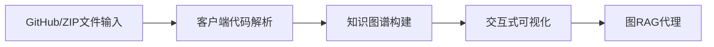
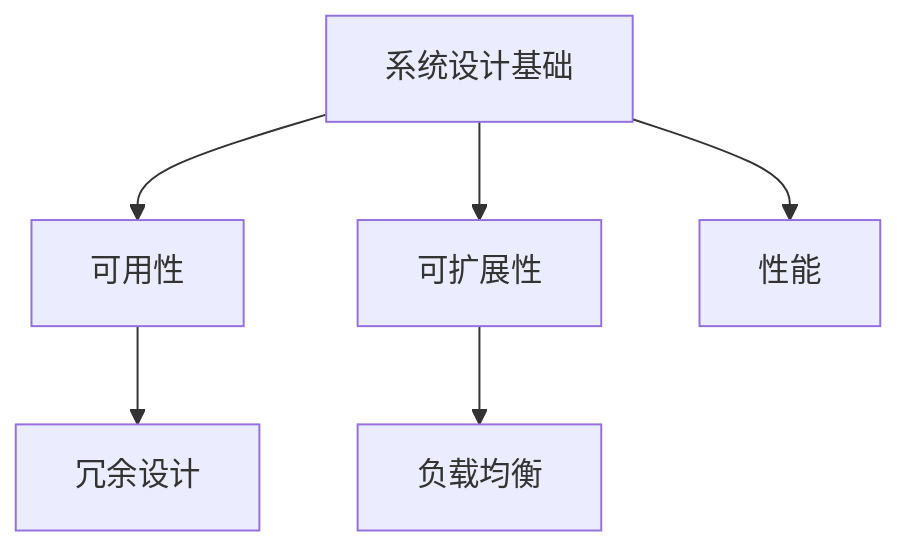
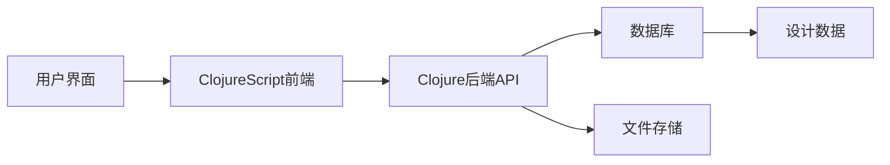

## 今日热点

今日GitHub热榜显示AI辅助开发工具持续火爆，Claude相关项目激增，同时代码智能与大模型API化成为开发者关注焦点，开源生态在AI领域不断拓展。

---

## 热门项目一览

| 排名 | 项目 | 语言 | 今日 | 总计 | 简介 |
|:---:|------|:----:|------:|-----:|------|
| 1 | [mattpocock/skills](https://github.com/mattpocock/skills) | Shell | +5,645 | 30,664 | Skills for Real Engineers. ... |
| 2 | [Alishahryar1/free-claude-code](https://github.com/Alishahryar1/free-claude-code) | Python | +2,949 | 16,203 | Use claude-code for free in... |
| 3 | [Z4nzu/hackingtool](https://github.com/Z4nzu/hackingtool) | Python | +1,830 | 67,167 | ALL IN ONE Hacking Tool For... |
| 4 | [abhigyanpatwari/GitNexus](https://github.com/abhigyanpatwari/GitNexus) | TypeScript | +1,102 | 31,616 | GitNexus: The Zero-Server C... |
| 5 | [microsoft/VibeVoice](https://github.com/microsoft/VibeVoice) | Python | +757 | 43,175 | Open-Source Frontier Voice AI |
| 6 | [ComposioHQ/awesome-codex-skills](https://github.com/ComposioHQ/awesome-codex-skills) | Python | +638 | 2,866 | A curated list of practical... |
| 7 | [gastownhall/beads](https://github.com/gastownhall/beads) | Go | +498 | 22,227 | Beads - A memory upgrade fo... |
| 8 | [donnemartin/system-design-primer](https://github.com/donnemartin/system-design-primer) | Python | +372 | 345,212 | Learn how to design large-s... |
| 9 | [TauricResearch/TradingAgents](https://github.com/TauricResearch/TradingAgents) | Python | +248 | 53,846 | TradingAgents: Multi-Agents... |
| 10 | [penpot/penpot](https://github.com/penpot/penpot) | Clojure | +166 | 46,656 | Penpot: The open-source des... |
| 11 | [davila7/claude-code-templates](https://github.com/davila7/claude-code-templates) | Python | +154 | 25,805 | CLI tool for configuring an... |
| 12 | [CJackHwang/ds2api](https://github.com/CJackHwang/ds2api) | Go | +138 | 1,864 | Deepseek to API: A lightwei... |

---

## 趋势洞察

```
┌─────────────────────────────────────────────────────────────────┐
│  AI/ML 工具         ████████████████████████  9 个项目        │
│  开发工具             ████████                  3 个项目        │
│  其他               ██                        1 个项目        │
└─────────────────────────────────────────────────────────────────┘
```

---

## 项目深度解读

### 1. mattpocock/skills — 工程技能库

> **一句话总结**：实用工程师技能集合，源自Claude使用经验，提升开发效率的Shell脚本工具。

#### 价值主张

| 维度 | 说明 |
|------|------|
| **解决痛点** | 提供工程师日常开发中可直接使用的实用技能和脚本 |
| **目标用户** | 使用Claude AI助手的软件工程师和开发者 |
| **核心亮点** | 实用性强 + 直接从经验提取 + 模块化设计 |

#### 技术架构


**技术特色**：
- 基于Shell脚本，跨平台兼容性强
- 直接从实际使用经验中提炼，实用性强
- 模块化设计，便于组合使用

#### 热度分析

- 项目获得30,664个Star且单日新增5,645个，表明近期热度极高，可能与Claude AI功能更新相关
- Fork数为2,412，显示用户积极参与项目贡献和定制，社区活跃度高

#### 快速上手

```bash
# 克隆项目
git clone https://github.com/mattpocock/skills.git
# 进入目录
cd skills
# 查看可用脚本
ls -la
```

#### 注意事项

- 项目许可证未知，使用前需确认授权条款
- 作为Shell脚本集合，可能需要根据具体环境进行适配
- 由于直接从Claude使用经验中提取，可能需要Claude相关知识才能充分利用


### 2. Alishahryar1/free-claude-code — 免费Claude工具

> **一句话总结**：提供免费使用Claude Code的终端、VSCode和Discord解决方案，绕过官方付费限制。

#### 价值主张

| 维度 | 说明 |
|------|------|
| **解决痛点** | Claude Code官方需要付费订阅，提供免费使用途径 |
| **目标用户** | 需要AI代码助手但不愿付费的开发者和爱好者 |
| **核心亮点** | + 多平台支持 + 完全免费 + 简单部署 + 开源实现 |

#### 技术架构


**技术特色**：
- 通过非官方API实现Claude免费访问
- 支持多种IDE和平台的无缝集成
- 可能使用代理或特殊认证机制绕过限制

#### 热度分析

- 单日增长近3000星，显示强烈市场需求和关注度
- 零未解决问题表明项目维护良好，社区参与度高

#### 快速上手

```bash
# 克隆项目
git clone https://github.com/Alishahryar1/free-claude-code.git
# 安装依赖
pip install -r requirements.txt
# 运行程序
python main.py
```

#### 注意事项

- 项目可能违反Anthropic的服务条款，存在账号风险
- 免费使用方式可能不稳定，官方随时可能修复
- 需要自行承担使用风险，建议谨慎使用


### 3. Z4nzu/hackingtool — 综合黑客工具箱

> **一句话总结**：集成多种安全测试工具的Python平台，为渗透测试提供一站式解决方案。

#### 价值主张

| 维度 | 说明 |
|------|------|
| **解决痛点** | 分散工具整合，简化安全测试流程，提高效率 |
| **目标用户** | 渗透测试人员、安全研究员、网络安全爱好者 |
| **核心亮点** | 多工具集成 + 模块化设计 + 命令行界面 + 跨平台支持 + 持续更新 |

#### 技术架构


**技术特色**：
- 基于Python开发，便于扩展和维护
- 模块化架构，各功能组件独立封装
- 统一命令行接口，降低使用门槛

#### 热度分析
- Star数超6.7万且持续增长，反映安全社区高度认可
- Fork数与Star数比例合理，表明项目具有实用价值和活跃社区

#### 快速上手

```bash
# 克隆项目
git clone https://github.com/Z4nzu/hackingtool.git

# 运行工具
cd hackingtool
python3 hackingtool.py
```

#### 注意事项
- 本工具仅供授权的安全测试和教育目的使用
- 使用前请确保了解相关法律法规和道德准则
- 部分功能可能需要额外依赖，请按README安装


### 4. abhigyanpatwari/GitNexus — 浏览器代码知识图谱

> **一句话总结**：完全在浏览器中运行的客户端代码知识图谱工具，无需服务器即可生成交互式代码分析。

#### 价值主张

| 维度 | 说明 |
|------|------|
| **解决痛点** | 消除代码分析工具对服务器的依赖，解决部署复杂和隐私安全问题 |
| **目标用户** | 开发者、代码审查人员、项目维护者和代码研究人员 |
| **核心亮点** | 纯客户端运行 + 交互式知识图谱 + 内置图RAG代理 + 支持GitHub/ZIP导入 + 零服务器部署 |

#### 技术架构



**技术特色**：
- 纯客户端运行，所有处理在浏览器中完成
- 利用WebAssembly实现高性能代码解析
- 内置图RAG代理支持智能代码探索和问答

#### 热度分析

- 项目Star数高达31,616且近期增长1,102，显示极高的用户认可度和快速增长势头
- 零Open Issues表明项目成熟稳定，社区可能通过其他渠道交流问题

#### 快速上手

```bash
# 克隆仓库
git clone https://github.com/abhigyanpatwari/GitNexus.git

# 安装依赖
npm install

# 启动应用
npm run dev
```

#### 注意事项

- 大型代码库处理可能需要高性能浏览器和充足内存
- 首次加载和解析可能需要较长时间，取决于代码库大小
- 需要确保浏览器支持现代Web标准和WebAssembly


### 5. microsoft/VibeVoice — [前沿语音AI]

> **一句话总结**：Microsoft开源的高性能语音AI框架，提供前沿语音处理与生成能力。

#### 价值主张

| 维度 | 说明 |
|------|------|
| **解决痛点** | 提供开源的先进语音AI解决方案，降低语音技术门槛 |
| **目标用户** | AI开发者、语音研究团队、语音应用构建者 |
| **核心亮点** | + 高性能语音处理能力 + 开源可定制 + 支持多种语音任务 |

#### 技术架构


**技术特色**：
- 基于深度学习的语音处理模型
- 多语言支持能力
- 低延迟实时处理
- 可扩展的模块化设计

#### 热度分析

- Star数增长迅速，今日增加757星，显示社区高度关注
- 微软出品，结合开源生态，在AI语音领域具有重要影响力

#### 快速上手

```bash
# 克隆仓库
git clone https://github.com/microsoft/VibeVoice.git
cd VibeVoice

# 安装依赖
pip install -r requirements.txt

# 运行示例
python examples/basic_usage.py
```

#### 注意事项

- 需要确保Python版本兼容性
- 模型资源可能较大，需考虑存储空间
- 可能需要GPU加速以获得最佳性能


### 6. ComposioHQ/awesome-codex-skills — [Codex技能自动化工具集]

> **一句话总结**：精选Codex技能集合，助力通过API和CLI实现工作流程自动化。

#### 价值主张

| 维度 | 说明 |
|------|------|
| **解决痛点** | 开发者缺乏结构化的Codex技能集合，难以高效实现工作流程自动化 |
| **目标用户** | 开发者、自动化工具使用者以及AI代码生成应用的技术团队 |
| **核心亮点** | 精选实用技能集合 + 覆盖CLI和API + 结构化组织 + 自动化工作流程 + 实际应用案例 |

#### 技术架构


**技术特色**：
- Python资源集合，便于扩展和维护
- 结构化组织Codex技能，提高查找效率
- 提供实际应用案例和API集成指南

#### 热度分析

- 项目Star数达2,866且单日增长638，表明Codex技能自动化需求旺盛，社区关注度极高
- 零Open Issues反映项目维护良好，用户问题可能通过其他渠道解决或问题较少

#### 快速上手

```bash
git clone https://github.com/ComposioHQ/awesome-codex-skills.git
cd awesome-codex-skills
ls
```

#### 注意事项

- 项目许可证未知，使用前需确认开源许可条款
- 技能可能随Codex API更新而需要调整，需关注项目维护状态
- 部分技能可能需要额外的API密钥或配置才能使用


### 7. gastownhall/beads — AI编码记忆增强

> **一句话总结**：为AI编码助手提供持久化记忆与上下文管理能力，提升代码生成质量与连贯性。

#### 价值主张

| 维度 | 说明 |
|------|------|
| **解决痛点** | AI编码助手缺乏长期记忆与上下文连贯性 |
| **目标用户** | AI辅助开发者与编程团队 |
| **核心亮点** | 持久化记忆 + 上下文管理 + 项目理解 + 智能检索 + 无缝集成 |

#### 技术架构


**技术特色**：
- 基于Go语言的高效内存管理架构
- 智能上下文编码与语义检索算法
- 与主流AI编码工具的无缝API集成

#### 热度分析

- 近期Star增长迅速，表明项目受开发者高度关注
- 作为AI编程辅助工具，处于技术前沿，生态潜力大

#### 快速上手

```bash
# 安装beads
go install github.com/gastownhall/beads@latest

# 初始化项目记忆
beads init --project-path ./my-project

# 启动beads服务
beads serve --port 8080
```

#### 注意事项

- 需要理解AI编程助手的工作原理与API接口
- 可能需要配置API密钥或访问权限才能连接到AI服务
- 内存使用量可能随项目复杂度增加而显著增长


### 8. donnemartin/system-design-primer — [系统设计指南]

> **一句话总结**：大型系统设计与面试准备的综合性指南，包含Anki记忆卡片。

#### 价值主张

| 维度 | 说明 |
|------|------|
| **解决痛点** | 系统设计学习资源零散，缺乏系统性面试准备材料 |
| **目标用户** | 软件工程师、系统架构师、技术面试候选人 |
| **核心亮点** | 内容全面 + 结构清晰 + Anki记忆卡片 + 实战案例 + 持续更新 |

#### 技术架构



**技术特色**：
- 采用Markdown组织内容，便于阅读和维护
- 包含Anki卡片文件，支持间隔重复记忆法
- 提供丰富的案例研究和最佳实践

#### 热度分析

- 项目Star数超过34万，增长稳定，每日新增约370个Star，表明系统设计学习需求持续旺盛
- Fork数达5.5万，说明该项目被广泛用作学习和参考资源，社区参与度高

#### 快速上手

```bash
# 克隆项目到本地
git clone https://github.com/donnemartin/system-design-primer.git

# 使用浏览器打开README.md开始阅读
cd system-design-primer && index.html
```

#### 注意事项

- 项目内容持续更新，建议关注最新版本
- 本项目为学习资源，实际系统设计需结合具体业务场景和约束条件
- Anki卡片需要安装Anki软件才能使用


### 9. TauricResearch/TradingAgents — 金融智能交易框架

> **一句话总结**：基于多智能体与大语言模型的金融交易框架，实现自适应市场分析与智能决策

#### 价值主张

| 维度 | 说明 |
|------|------|
| **解决痛点** | 传统交易系统缺乏智能决策能力，难以适应复杂市场变化 |
| **目标用户** | 量化交易开发者、金融分析师、算法交易研究员 |
| **核心亮点** | 多智能体协作 + LLM决策支持 + 自适应交易策略 |

#### 技术架构


**技术特色**：
- 基于LLM的智能决策引擎，能理解复杂市场信号
- 多智能体协作机制，分工处理不同市场维度
- 自适应学习系统，持续优化交易策略

#### 热度分析

- 项目获得5.3万+星标，近期增长迅速，显示金融AI领域热度高涨
- 社区活跃度高，近千次fork，表明开发者认可度高

#### 快速上手

```bash
# 克隆项目
git clone https://github.com/TauricResearch/TradingAgents.git

# 安装依赖
pip install -r requirements.txt

# 运行示例
python examples/basic_trading_agent.py
```

#### 注意事项

- 需要具备Python和机器学习基础知识
- 实盘交易前需充分回测，系统不保证盈利
- 市场数据获取可能需要额外配置API密钥


### 10. penpot/penpot — 开源设计协作

> **一句话总结**：开源设计工具，连接设计与开发流程，实现无缝协作。

#### 价值主张

| 维度 | 说明 |
|------|------|
| **解决痛点** | 打破设计与开发之间的壁垒，实现从设计到代码的无缝衔接 |
| **目标用户** | UI/UX设计师、前端开发人员、产品设计团队 |
| **核心亮点** | 开源协作 + 设计系统支持 + 多格式导出 + 实时协作 + 自托管部署 |

#### 技术架构



**技术特色**：
- 基于 Clojure/ClojureScript 全栈架构，提供高性能和并发处理能力
- 开放式架构，支持插件扩展和定制化开发
- 原生支持设计系统，确保设计一致性

#### 热度分析

- Star 数量超过 46,000，日增长约 166，表明项目受到广泛关注和持续增长
- Fork 数量约 2,798，显示社区参与度高，适合二次开发和私有部署
- Open Issues 为 0，可能表明问题管理良好或使用其他问题跟踪系统

#### 快速上手

```bash
# 克隆仓库
git clone https://github.com/penpot/penpot.git
# 使用 Docker 启动
docker-compose up
```

#### 注意事项

- 项目可能需要较高的系统资源，特别是在处理大型设计文件时
- 需要一定的 Clojure 技术栈知识才能进行深度定制
- 许可证信息不明确，使用前需要确认开源许可条款


### 11. davila7/claude-code-templates — Claude Code 配置工具

> **一句话总结**：一个功能强大的 CLI 工具，用于高效配置和监控 Claude Code，提升 AI 辅助编程体验。

#### 价值主张

| 维度 | 说明 |
|------|------|
| **解决痛点** | 简化 Claude Code 的配置流程，提供直观的监控界面 |
| **目标用户** | 使用 Claude Code 进行开发的程序员和 AI 辅助编程爱好者 |
| **核心亮点** | 命令行界面 + 实时监控 + 配置模板 + 扩展性强 + 易于集成 |

#### 技术架构


**技术特色**：
- 基于 Python 的轻量级 CLI 架构，跨平台兼容性强
- 模块化设计，支持多种配置模板和扩展
- 实时监控机制，提供直观的 Claude Code 使用反馈

#### 热度分析

- 项目 Star 数高达 25,805，且持续增长(+154 today)，表明社区对该工具高度认可
- Fork 数量适中(2,594)，显示用户不仅关注项目，也积极参与二次开发

#### 快速上手

```bash
# 安装工具
pip install claude-code-templates

# 初始化配置
claude-code init

# 启动监控
claude-code monitor
```

#### 注意事项

- 需要确保已安装 Claude Code 及其依赖项
- 部分高级功能可能需要 API 访问权限
- 配置修改后需重启 Claude Code 才能生效


### 12. CJackHwang/ds2api — API转换器

> **一句话总结**：高性能Deepseek API转换中间件，支持多协议兼容与灵活部署。

#### 价值主张

| 维度 | 说明 |
|------|------|
| **解决痛点** | 解决AI API格式不兼容、多账户管理困难问题 |
| **目标用户** | 需要统一多种AI API接口的开发者和企业 |
| **核心亮点** | 多协议兼容 + 高性能Go实现 + 多部署支持 + 账户轮换功能 |

#### 技术架构


**技术特色**：
- 基于Go语言实现，性能高效且资源占用低
- 支持Google、Claude和OpenAI多种API格式兼容
- 提供多账户轮换机制，提高请求稳定性和可用性

#### 热度分析

- 项目近期热度显著增长，单日Star增长达138，社区关注度持续上升
- Fork与Star比例约为1:3.25，表明项目具有较强的实用价值和二次开发需求

#### 快速上手

```bash
# 使用Docker运行
docker run -p 3000:3000 CJackHwang/ds2api

# 下载二进制文件运行
./ds2api --config config.yaml
```

#### 注意事项

- 项目License信息不明确，商业使用前需确认授权方式
- 需确保有合法的Deepseek API访问权限，避免违规使用


### 13. deepseek-ai/DeepSeek-V3 — 开源大模型

> **一句话总结**：DeepSeek-V3是高性能开源大语言模型，提供强大推理与多模态能力。

#### 价值主张

| 维度 | 说明 |
|------|------|
| **解决痛点** | 提供可商用的高性能大模型，降低AI应用门槛 |
| **目标用户** | AI研究人员、企业开发者、智能应用构建者 |
| **核心亮点** | MoE架构 + 多语言支持 + 长上下文处理 + 高效推理 |

#### 技术架构


**技术特色**：
- 采用Mixture of Experts稀疏激活架构，提升计算效率
- 支持超长上下文窗口，最高可达128K tokens
- 优化的推理引擎，显著降低延迟和资源消耗

#### 热度分析

- Star数突破10万且持续增长，位列开源大模型前列
- 作为国内领先开源大模型，构建了活跃的开发者社区

#### 快速上手

```bash
# 安装DeepSeek-V3
pip install deepseek-v3

# 基础调用示例
from deepseek import DeepSeekV3
model = DeepSeekV3("deepseek-v3-base")
response = model.generate("解释量子计算的基本原理")
print(response)
```

#### 注意事项

- 模型部署需较高算力，建议使用多GPU环境
- 商用使用前需仔细阅读并遵守许可证条款
- 定期更新模型以获取最新性能优化和安全补丁


## 今日推荐

| 主题 | 推荐项目 | 亮点 |
|------|----------|------|
| 今日最热 | [mattpocock/skills](https://github.com/mattpocock/skills) | Skills for Real E... |
| 值得关注 | [Alishahryar1/free-claude-code](https://github.com/Alishahryar1/free-claude-code) | Use claude-code f... |
| 快速上手 | [Z4nzu/hackingtool](https://github.com/Z4nzu/hackingtool) | ALL IN ONE Hackin... |
| 长期潜力 | [abhigyanpatwari/GitNexus](https://github.com/abhigyanpatwari/GitNexus) | GitNexus: The Zer... |

---

<div align="center">

*Generated on 2026-04-28 | Powered by GitHub Trending Reporter*

</div>