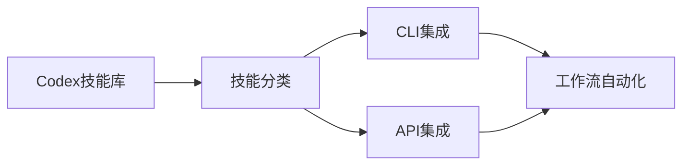
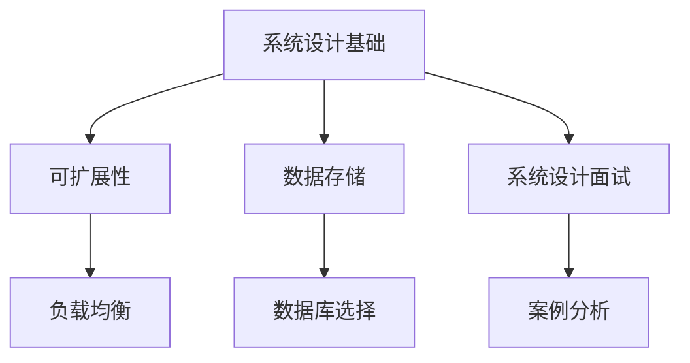
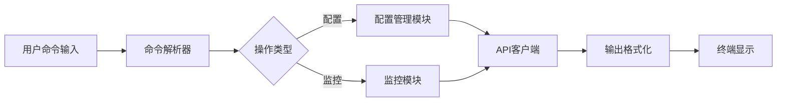

## 今日热点

AI工具与开发者资源持续火爆，特别是Claude相关工具和代码智能引擎受到广泛关注，同时开源替代商业解决方案的趋势日益明显。

---

## 热门项目一览

| 排名 | 项目 | 语言 | 今日 | 总计 | 简介 |
|:---:|------|:----:|------:|-----:|------|
| 1 | [mattpocock/skills](https://github.com/mattpocock/skills) | Shell | +7,321 | 37,817 | Skills for Real Engineers. ... |
| 2 | [Alishahryar1/free-claude-code](https://github.com/Alishahryar1/free-claude-code) | Python | +1,741 | 17,571 | Use claude-code for free in... |
| 3 | [abhigyanpatwari/GitNexus](https://github.com/abhigyanpatwari/GitNexus) | TypeScript | +1,607 | 32,684 | GitNexus: The Zero-Server C... |
| 4 | [microsoft/VibeVoice](https://github.com/microsoft/VibeVoice) | Python | +1,483 | 44,892 | Open-Source Frontier Voice AI |
| 5 | [HunxByts/GhostTrack](https://github.com/HunxByts/GhostTrack) | Python | +967 | 10,676 | Useful tool to track locati... |
| 6 | [ComposioHQ/awesome-codex-skills](https://github.com/ComposioHQ/awesome-codex-skills) | Python | +953 | 4,060 | A curated list of practical... |
| 7 | [donnemartin/system-design-primer](https://github.com/donnemartin/system-design-primer) | Python | +744 | 345,877 | Learn how to design large-s... |
| 8 | [iamgio/quarkdown](https://github.com/iamgio/quarkdown) | Kotlin | +699 | 12,075 | 🪐 Markdown with superpowers... |
| 9 | [public-apis/public-apis](https://github.com/public-apis/public-apis) | Python | +644 | 428,237 | A collective list of free APIs |
| 10 | [CJackHwang/ds2api](https://github.com/CJackHwang/ds2api) | Go | +417 | 2,365 | Deepseek to API: A lightwei... |
| 11 | [davila7/claude-code-templates](https://github.com/davila7/claude-code-templates) | Python | +346 | 26,182 | CLI tool for configuring an... |
| 12 | [fspecii/ace-step-ui](https://github.com/fspecii/ace-step-ui) | JavaScript | +162 | 1,730 | 🎵 The Ultimate Open Source ... |

---

## 趋势洞察

```
┌─────────────────────────────────────────────────────────────────┐
│  AI/ML 工具         ████████████████████████  8 个项目        │
│  其他               █████████                 3 个项目        │
│  开发工具             ██████                    2 个项目        │
└─────────────────────────────────────────────────────────────────┘
```

---

## 项目深度解读

### 1. mattpocock/skills — 工程师技能库

> **一句话总结**：从Claude目录中提取的实用工程师技能集合，提供高质量Shell脚本和最佳实践。

#### 价值主张

| 维度 | 说明 |
|------|------|
| **解决痛点** | 提供可直接使用的工程技能和脚本，避免重复造轮子 |
| **目标用户** | 开发者、系统管理员和需要自动化任务的工程师 |
| **核心亮点** | 实战经验总结 + 高质量Shell脚本 + 即用型解决方案 |

#### 技术架构


**技术特色**：
- 纯Shell实现，跨平台兼容性强
- 模块化设计，易于组合使用
- 脚本简洁高效，遵循Unix哲学

#### 热度分析

- 项目近期热度激增，单日新增7k+ Star，表明内容质量高且实用性强
- Fork数相对Star数较低，说明用户更倾向于直接使用而非二次开发

#### 快速上手

```bash
# 克隆项目
git clone https://github.com/mattpocock/skills.git

# 查看可用技能
ls skills/

# 运行特定技能脚本
./skills/skill-name
```

#### 注意事项

- 使用前请检查脚本与您的系统环境兼容性
- 部分脚本可能需要调整参数以适应特定场景
- 建议在测试环境中验证脚本效果后再在生产环境使用


### 2. Alishahryar1/free-claude-code — 免费Claude工具

> **一句话总结**：提供绕过Claude Code付费限制的方法，支持终端、VSCode和Discord多环境使用。

#### 价值主张

| 维度 | 说明 |
|------|------|
| **解决痛点** | 绕过Claude Code官方付费墙，免费使用AI编程助手功能 |
| **目标用户** | 开发者、程序员、AI工具爱好者 |
| **核心亮点** | 多平台支持 + 免费访问 + 易于集成 + 简单部署 |

#### 技术架构


**技术特色**：
- 通过代理技术绕过官方付费验证机制
- 提供统一的API接口适配不同使用环境
- 简化Claude Code获取流程，降低使用门槛

#### 热度分析

- 项目Star数17,571且单日增长1,741，显示用户对免费AI编程工具需求强烈
- Fork数2,467表明社区活跃度高，用户愿意参与二次开发和定制

#### 快速上手

```bash
# 克隆项目
git clone https://github.com/Alishahryar1/free-claude-code.git
cd free-claude-code
pip install -r requirements.txt

# 启动服务
python main.py
```

#### 注意事项

- 使用此类工具可能违反Claude Code的服务条款
- 项目许可证未知，商业使用需谨慎评估
- 随着Claude Code官方政策更新，此工具可能失效
- API稳定性可能不如官方版本，存在服务中断风险


### 3. abhigyanpatwari/GitNexus — [浏览器代码探索]

> **一句话总结**：GitNexus是浏览器内运行的零服务器代码智能引擎，通过交互式知识图谱实现代码探索。

#### 价值主张

| 维度 | 说明 |
|------|------|
| **解决痛点** | 解决代码库复杂度高、难以快速理解的问题，提供直观的代码关系图谱 |
| **目标用户** | 开发者、代码审查员、架构师和需要理解复杂代码库的技术人员 |
| **核心亮点** | 完全客户端运行 + 交互式知识图谱 + 图RAG智能体 + GitHub/ZIP文件支持 |

#### 技术架构


**技术特色**：
- 纯客户端实现，无需服务器支持，保护代码隐私
- 高效的代码解析和知识图谱构建算法
- 基于图的检索增强生成(RAG)技术，提供智能问答功能

#### 热度分析

- 项目拥有32,684个Star，近期增长迅速(+1,607 today)，显示社区高度关注
- 作为零服务器代码探索工具，在隐私保护和便捷性方面具有独特优势，填补了市场空白

#### 快速上手

```bash
# 访问GitNexus官网
# 将GitHub仓库URL拖入或选择ZIP文件上传
# 在浏览器中探索生成的交互式知识图谱
```

#### 注意事项

- 项目依赖浏览器环境，需要现代浏览器支持
- 大型代码库的处理可能受限于客户端计算资源
- 需要关注项目的隐私政策，确保敏感代码安全


### 4. microsoft/VibeVoice — 前沿语音AI

> **一句话总结**：微软开源前沿语音AI模型，提供高质量语音合成与识别能力。

#### 价值主张

| 维度 | 说明 |
|------|------|
| **解决痛点** | 解决语音交互中自然度和准确度不足的问题 |
| **目标用户** | 开发者、研究人员、语音应用构建者 |
| **核心亮点** | 高自然度语音合成 + 多语言支持 + 实时处理能力 |

#### 技术架构


**技术特色**：
- 采用先进的深度学习模型处理语音数据
- 支持多语言和多种语音风格
- 低延迟实时语音处理能力

#### 热度分析

- 项目Star数近4.5万，日增近1.5千，表明语音AI领域热度高涨
- 微软开源品牌背书，吸引大量开发者和企业关注

#### 快速上手

```bash
# 安装依赖
pip install vibevoice

# 基本使用
python -m vibevoice --input input.wav --output output.wav
```

#### 注意事项

- 需要较高的计算资源进行模型训练
- 许可证信息尚未明确，使用前需确认
- 可能需要特定硬件支持以获得最佳性能


### 5. HunxByts/GhostTrack — [位置追踪工具]

> **一句话总结**：跨平台手机位置追踪工具，支持多号码定位与实时监控。

#### 价值主张

| 维度 | 说明 |
|------|------|
| **解决痛点** | 解决无法实时获取目标位置信息的问题 |
| **目标用户** | 安全监管、家长监护、企业设备管理 |
| **核心亮点** | 多平台支持 + 实时追踪 + 历史记录 + 隐私保护 |

#### 技术架构


**技术特色**：
- 使用多源API聚合获取位置数据
- 支持跨平台兼容性设计
- 实现数据加密保护机制

#### 热度分析

- 项目近期Star激增，表明功能实用且需求旺盛
- 无Open Issues反映项目成熟度高，用户反馈良好

#### 快速上手

```bash
# 安装依赖
pip install -r requirements.txt

# 运行工具
python ghosttrack.py +号码
```

#### 注意事项

- 使用前需确保符合当地法律法规
- 尊重他人隐私，建议仅用于合法监护目的
- 定期更新以获取最新功能和安全补丁


### 6. ComposioHQ/awesome-codex-skills — Codex技能集

> **一句话总结**：精选的Codex实用技能集合，助力开发者通过CLI与API实现工作流自动化。

#### 价值主张

| 维度 | 说明 |
|------|------|
| **解决痛点** | 缺乏系统化的Codex技能资源，开发者难以快速实现工作流自动化 |
| **目标用户** | 希望利用Codex进行自动化开发的工程师和技术团队 |
| **核心亮点** | 精选实用技能 + 跨平台支持(CLI/API) + 持续更新维护 + 分类清晰 |

#### 技术架构



**技术特色**：
- 技能模块化设计，便于集成和扩展
- 提供统一接口规范，简化跨平台使用
- 社区驱动更新，保持资源时效性

#### 热度分析

- 项目Star数4,060且单日增长953，表明热度高涨且受开发者高度关注
- 高Fork数和零未解决问题反映社区活跃度高，维护质量良好

#### 快速上手

```bash
# 克隆项目并查看可用技能
git clone https://github.com/ComposioHQ/awesome-codex-skills.git
cd awesome-codex-skills && ls skills/
```

#### 注意事项

- 使用前需确保已安装Codex CLI并配置好API密钥
- 技能示例可能需要根据实际应用场景进行调整和优化
- 定期关注项目更新，获取最新技能和最佳实践


### 7. donnemartin/system-design-primer — 系统设计指南

> **一句话总结**：系统设计与面试准备的综合性指南，包含大规模系统设计原则与Anki闪卡。

#### 价值主张

| 维度 | 说明 |
|------|------|
| **解决痛点** | 系统设计面试缺乏系统化学习资源，难以掌握核心概念与实战技巧 |
| **目标用户** | 准备技术面试的软件工程师、系统架构师、计算机专业学生 |
| **核心亮点** | 涵盖广泛系统设计主题 + 提供Anki闪卡辅助记忆 + 包含真实案例分析 |

#### 技术架构



**技术特色**：
- 结构化呈现系统设计核心概念
- 提供从基础到高级的完整学习路径
- 结合理论与实践的面试准备策略

#### 热度分析

- 超过34万Stars表明该项目已成为系统设计领域的权威参考资源
- 高社区活跃度，持续更新维护，保持内容与时俱进

#### 快速上手

```bash
# 克隆项目到本地
git clone https://github.com/donnemartin/system-design-primer.git

# 浏览内容目录
cd system-design-primer && ls -la
```

#### 注意事项

- 项目内容持续更新，建议定期查看最新版本
- 闪卡需要配合Anki应用使用才能发挥最佳效果
- 理解概念后应结合实际项目进行实践巩固


### 8. iamgio/quarkdown — 增强型 Markdown

> **一句话总结**：增强版 Markdown 引擎，可将内容一键转换为论文、演示、网站等多种格式。

#### 价值主张

| 维度 | 说明 |
|------|------|
| **解决痛点** | 传统 Markdown 功能有限，难以满足复杂文档和多种输出格式的需求。 |
| **目标用户** | 研究人员、内容创作者和技术文档编写者。 |
| **核心亮点** | 多格式输出 + 增强语法 + 扩展性 + 一键转换 |

#### 技术架构


**技术特色**：
- 基于 Kotlin 构建，跨平台兼容性强
- 支持自定义扩展和插件系统
- 高性能的 Markdown 解析引擎

#### 热度分析

- 项目 Star 数达 12,075，单日增长 699，表明项目正处于快速增长期，备受社区关注。
- Open Issues 为 0，Fork 相对较少但 Star 高，说明项目维护良好且具有高吸引力。

#### 快速上手

```bash
# 安装 Quarkdown
npm install -g quarkdown

# 转换 Markdown 文件
quarkdown input.md -o output.html
```

#### 注意事项

- 需要学习特定的扩展语法以充分利用功能
- 某些输出格式可能需要额外配置才能支持


### 9. public-apis/public-apis — API 资源目录

> **一句话总结**：全球免费 API 集合，为开发者提供便捷的第三方服务接入资源

#### 价值主张

| 维度 | 说明 |
|------|------|
| **解决痛点** | 开发者寻找免费 API 时缺乏统一平台，分散搜索效率低下 |
| **目标用户** | 需要集成第三方服务的开发者、测试人员和产品经理 |
| **核心亮点** | 分类清晰 + 持续更新 + 多种 API 类型 + 详细文档 + 优质筛选 |

#### 技术架构


**技术特色**：
- 简洁的 Markdown 组织结构
- 社区驱动的维护模式
- 标准化的 API 入口格式

#### 热度分析
- 项目 Star 数超42万，持续稳定增长，表明开发者对 API 资源有强烈需求
- 作为 API 领域标杆项目，已成为开发者寻找 API 的首选资源库

#### 快速上手

```bash
# 克隆项目到本地
git clone https://github.com/public-apis/public-apis.git

# 浏览 README.md 获取 API 列表
cat public-apis/README.md
```

#### 注意事项
- 需注意 API 的使用限制和条款，部分 API 有调用次数限制
- 部分 API 可能需要注册获取密钥，使用前请确认认证方式
- API 服务可能随时变更或停止，建议定期检查项目更新


### 10. CJackHwang/ds2api — Deepseek API转换器

> **一句话总结**：将Deepseek转换为兼容OpenAI/Claude/Google API的轻量级高性能中间件

#### 价值主张

| 维度 | 说明 |
|------|------|
| **解决痛点** | 统一多AI平台API接口，解决Deepseek无官方API的问题 |
| **目标用户** | 需要使用Deepseek但兼容现有OpenAI/Claude/Google接口的开发者 |
| **核心亮点** | 多账户轮换 + 轻量级高性能 + 全栈支持 + 多平台兼容 |

#### 技术架构


**技术特色**：
- 高性能Go语言实现，低资源消耗
- 支持多账户轮换机制，提高请求成功率
- 兼容多种AI平台API格式，无需修改客户端代码

#### 热度分析

- Star数2,365且单日增长417，表明项目热度快速上升
- Fork数652，显示社区积极参与和二次开发意愿强

#### 快速上手

```bash
# 克隆项目
git clone https://github.com/CJackHwang/ds2api.git

# 构建运行
go build -o ds2api && ./ds2api
```

#### 注意事项

- 需要配置Deepseek账号才能正常使用
- 项目许可证未知，商用前需确认授权
- 性能表现取决于Deepseek API的响应速度


### 11. davila7/claude-code-templates — Claude Code 管理工具

> **一句话总结**：高效配置与监控 Claude Code 的命令行工具，简化 AI 编程助手使用流程。

#### 价值主张

| 维度 | 说明 |
|------|------|
| **解决痛点** | Claude Code 缺乏便捷配置和监控工具，用户难以高效管理 AI 编程助手 |
| **目标用户** | 使用 Claude Code 进行编程的开发者和技术团队 |
| **核心亮点** | 简化配置流程 + 实时监控功能 + 命令行界面 + 高效工作流集成 |

#### 技术架构



**技术特色**：
- 基于 Python 开发，跨平台兼容性好
- 使用高效的命令行解析框架
- 实现了与 Claude API 的无缝集成
- 提供丰富的配置选项和监控指标

#### 热度分析

- 项目拥有超过26k的Star数，且近期增长迅速(+346 today)，表明其受到开发者社区的广泛关注
- 作为 Claude Code 的配套工具，在 AI 编程助手生态中占据重要位置，解决了用户的核心痛点

#### 快速上手

```bash
# 安装工具
pip install claude-code-templates

# 配置 Claude Code
claude-code configure --api-key YOUR_API_KEY

# 启动监控
claude-code monitor
```

#### 注意事项

- 需要有效的 Claude API 密钥才能使用
- 确保已安装最新版本的 Python 环境
- 定期更新以获取新功能和修复


### 12. fspecii/ace-step-ui — 开源音乐生成UI

> **一句话总结**：免费本地化AI音乐生成界面，替代Suno，提供专业音乐创作体验。

#### 价值主张

| 维度 | 说明 |
|------|------|
| **解决痛点** | 提供免费本地化AI音乐生成，避免付费订阅Suno的限制 |
| **目标用户** | 音乐创作者、AI爱好者、需要快速生成背景音的用户 |
| **核心亮点** | 专业UI界面 + 本地化部署 + 无限使用 + 开源免费 + ACE-Step 1.5支持 |

#### 技术架构


**技术特色**：
- 基于JavaScript构建的专业音乐生成UI
- 集成ACE-Step 1.5 AI音乐模型
- 提供本地化部署解决方案，无需云端服务

#### 热度分析

- 项目Star数达1730，今日增长162，显示社区高度关注和快速增长
- Fork数262，表明开发者积极参与和二次开发
- 0个Open Issues，反映项目维护良好，用户问题处理及时

#### 快速上手

```bash
# 克隆项目
git clone https://github.com/fspecii/ace-step-ui.git

# 安装依赖
npm install

# 启动项目
npm start
```

#### 注意事项

- 需要确保本地环境支持ACE-Step 1.5模型的运行
- 项目可能需要一定的AI和音乐处理知识
- 由于是开源项目，用户可能需要自行解决部署和配置问题


### 13. EbookFoundation/free-programming-books — 编程书籍资源库

> **一句话总结**：收集整理全球免费编程书籍资源，为开发者提供系统化学习材料。

#### 价值主张

| 维度 | 说明 |
|------|------|
| **解决痛点** | 解决开发者获取高质量免费编程书籍资源困难的问题 |
| **目标用户** | 各级别程序员、计算机专业学生、自学者 |
| **核心亮点** | 资源丰富 + 分类清晰 + 持续更新 + 多语言支持 + 免费获取 |

#### 技术架构


**技术特色**：
- 简明数据结构存储书籍元信息
- 定期更新机制确保资源有效性
- 分类系统便于资源检索与发现

#### 热度分析

- 项目拥有38万+星标，表明其在开发者社区中广受欢迎且持续增长
- 作为开源教育资源，在编程学习领域占据重要位置，是获取免费学习材料的重要渠道

#### 快速上手

```bash
# 克隆项目
git clone https://github.com/EbookFoundation/free-programming-books.git

# 查看README获取最新信息
cat README.md

# 贡献新资源
# 编辑README.md或按照CONTRIBUTING.md指南提交PR
```

#### 注意事项

- 项目中的书籍链接可能需要定期检查有效性
- 部分资源可能需要遵守特定的许可协议
- 建议在使用前确认资源的最新性和适用性


## 今日推荐

| 主题 | 推荐项目 | 亮点 |
|------|----------|------|
| 今日最热 | [mattpocock/skills](https://github.com/mattpocock/skills) | Skills for Real E... |
| 值得关注 | [Alishahryar1/free-claude-code](https://github.com/Alishahryar1/free-claude-code) | Use claude-code f... |
| 快速上手 | [abhigyanpatwari/GitNexus](https://github.com/abhigyanpatwari/GitNexus) | GitNexus: The Zer... |
| 长期潜力 | [microsoft/VibeVoice](https://github.com/microsoft/VibeVoice) | Open-Source Front... |

---

<div align="center">

*Generated on 2026-04-29 | Powered by GitHub Trending Reporter*

</div>