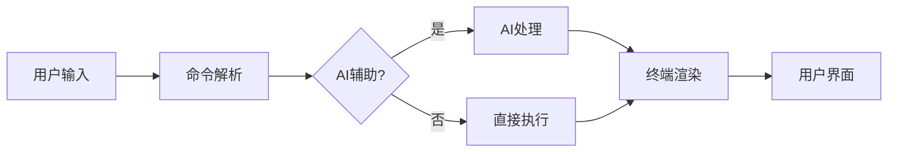
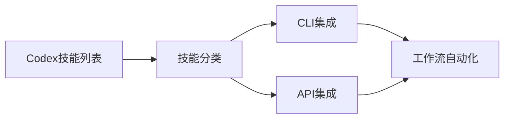
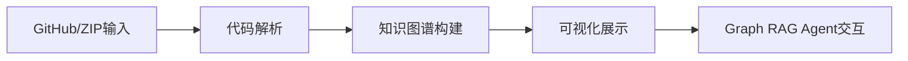
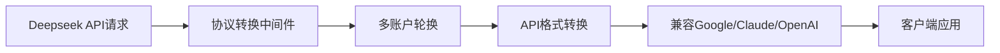
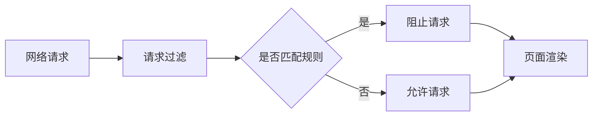
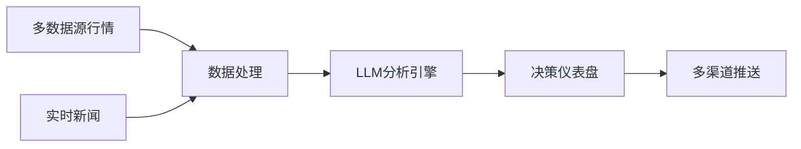
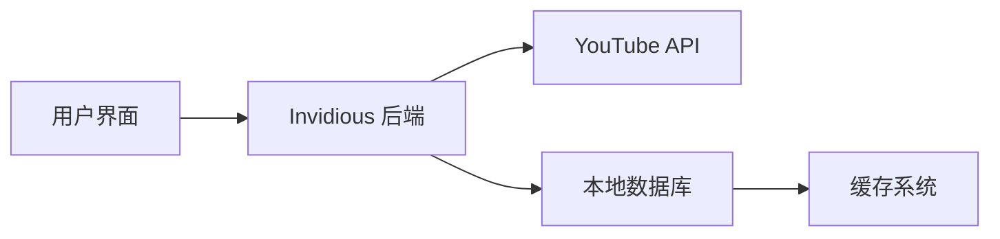

## 今日热点

AI代理工具和开发效率革新引领今日热榜，Warp终端环境与VibeVoice语音AI表现突出，同时API转换和实用工具也受到广泛关注。

---

## 热门项目一览

| 排名 | 项目 | 语言 | 今日 | 总计 | 简介 |
|:---:|------|:----:|------:|-----:|------|
| 1 | [warpdotdev/warp](https://github.com/warpdotdev/warp) | Rust | +12,822 | 44,403 | Warp is an agentic developm... |
| 2 | [mattpocock/skills](https://github.com/mattpocock/skills) | Shell | +7,280 | 45,001 | Skills for Real Engineers. ... |
| 3 | [microsoft/VibeVoice](https://github.com/microsoft/VibeVoice) | Python | +1,690 | 45,722 | Open-Source Frontier Voice AI |
| 4 | [obra/superpowers](https://github.com/obra/superpowers) | Shell | +1,653 | 173,218 | An agentic skills framework... |
| 5 | [ComposioHQ/awesome-codex-skills](https://github.com/ComposioHQ/awesome-codex-skills) | Python | +1,177 | 4,839 | A curated list of practical... |
| 6 | [HunxByts/GhostTrack](https://github.com/HunxByts/GhostTrack) | Python | +1,033 | 11,617 | Useful tool to track locati... |
| 7 | [abhigyanpatwari/GitNexus](https://github.com/abhigyanpatwari/GitNexus) | TypeScript | +774 | 33,371 | GitNexus: The Zero-Server C... |
| 8 | [EbookFoundation/free-programming-books](https://github.com/EbookFoundation/free-programming-books) | Python | +604 | 387,213 | 📚 Freely available programm... |
| 9 | [CJackHwang/ds2api](https://github.com/CJackHwang/ds2api) | Go | +465 | 2,739 | Deepseek to API: A lightwei... |
| 10 | [1jehuang/jcode](https://github.com/1jehuang/jcode) | Rust | +411 | 1,403 | Coding Agent Harness |
| 11 | [lukilabs/craft-agents-oss](https://github.com/lukilabs/craft-agents-oss) | TypeScript | +393 | 5,363 | No description |
| 12 | [gorhill/uBlock](https://github.com/gorhill/uBlock) | JavaScript | +391 | 64,053 | uBlock Origin - An efficien... |

---

## 趋势洞察

```
┌─────────────────────────────────────────────────────────────────┐
│  AI/ML 工具         ████████████████████████  11 个项目        │
│  其他               ██████                    3 个项目        │
│  开发工具             ████                      2 个项目        │
└─────────────────────────────────────────────────────────────────┘
```

---

## 项目深度解读

### 1. warpdotdev/warp — 智能终端IDE

> **一句话总结**：基于终端的智能开发环境，通过AI代理增强命令行体验，提升开发者效率。

#### 价值主张

| 维度 | 说明 |
|------|------|
| **解决痛点** | 传统终端缺乏现代化IDE的功能和智能辅助，开发效率受限 |
| **目标用户** | 命令行重度用户、终端开发者、追求高效工作流的开发者 |
| **核心亮点** | AI辅助编程 + 现代化终端界面 + 多语言支持 + 插件扩展性 |

#### 技术架构



**技术特色**：
- 基于 Rust 构建，提供高性能和内存安全
- 集成 AI 能力，提供智能编程辅助
- 插件系统支持扩展功能，增强开发体验

#### 热度分析

- 项目 Star 数量快速增长，单日增长超过12,000，显示出极高的市场关注度
- 作为新型终端工具，在开发者社区引起强烈反响，有望成为终端开发环境的新标准

#### 快速上手

```bash
# 安装 Warp
curl https://www.warp.dev/api/installer | bash

# 启动 Warp
warp
```

#### 注意事项

- 项目可能处于早期阶段，某些功能可能尚未完善
- 作为相对新的工具，社区文档和教程可能还不够丰富
- 与传统终端的兼容性可能存在一些问题


### 2. mattpocock/skills — 工程技能库

> **一句话总结**：汇集真实工程师实用技能的Shell脚本集合，源自Claude配置经验。

#### 价值主张

| 维度 | 说明 |
|------|------|
| **解决痛点** | 工程师缺乏系统化、实用的开发技能和工具集 |
| **目标用户** | 软件开发工程师和系统管理员 |
| **核心亮点** | 实用性强 + 即插即用 + 高效脚本 + 最佳实践 |

#### 技术架构


**技术特色**：
- 基于Shell语言，跨平台兼容性好
- 脚本模块化设计，便于组合使用
- 轻量级，无需额外依赖

#### 热度分析

- 项目近期爆发式增长，单日星增超7k，表明技术圈高度认可
- 高star/fork比显示项目实用性强，社区活跃度高

#### 快速上手

```bash
# 克隆项目
git clone https://github.com/mattpocock/skills.git
# 进入目录
cd skills
# 赋予执行权限
chmod +x *.sh
```

#### 注意事项

- 使用前请检查脚本兼容性，确保与您的系统环境匹配
- Shell脚本执行可能有安全风险，建议在测试环境中先行验证


### 3. microsoft/VibeVoice — 前沿语音AI

> **一句话总结**：开源前沿语音AI技术，实现高质量语音交互体验

#### 价值主张

| 维度 | 说明 |
|------|------|
| **解决痛点** | 突破传统语音AI在噪声环境下的识别瓶颈，提升语音交互准确性 |
| **目标用户** | 开发者、语音应用构建者、AI研究人员 |
| **核心亮点** | 实时语音处理 + 多语言支持 + 低资源需求 + 自适应环境 |

#### 技术架构


**技术特色**：
- 基于深度学习的端到端语音识别模型
- 自适应噪声抑制技术，提升复杂环境表现
- 轻量化设计，支持边缘设备部署

#### 热度分析

- 项目Star数高且近期显著增长(+1,690 today)，显示语音AI领域活跃度高
- 微软开源背景确保技术支持与社区生态建设

#### 快速上手

```bash
# 克隆仓库
git clone https://github.com/microsoft/VibeVoice.git
cd VibeVoice

# 安装依赖并运行示例
pip install -r requirements.txt
python examples/voice_recognition_demo.py
```

#### 注意事项

- 项目无公开Issues，可能通过其他渠道管理问题，建议加入Discord/Slack获取支持
- 许可证信息不明确，使用前需确认开源协议细节


### 4. obra/superpowers — 智能开发框架

> **一句话总结**：一个有效的代理技能框架和软件开发方法论，显著提升个人与团队开发效能。

#### 价值主张

| 维度 | 说明 |
|------|------|
| **解决痛点** | 解决软件开发效率低下和方法论混乱问题 |
| **目标用户** | 软件开发人员、技术团队和项目管理者 |
| **核心亮点** | 实用性强 + 方法系统化 + 效果可验证 + 易于集成 |

#### 技术架构


**技术特色**：
- 基于Shell的轻量级实现
- 模块化设计便于扩展
- 跨平台兼容性强

#### 热度分析

- 项目获得17万+星标，近期增长迅速，表明开发者社区高度认可其实用价值
- 高Fork数和零未解决问题反映社区活跃度高且项目维护良好

#### 快速上手

```bash
# 克隆仓库
git clone https://github.com/obra/superpowers.git
# 进入目录
cd superpowers
# 运行初始化脚本
./init.sh
```

#### 注意事项

- 项目许可证未知，商业使用前需确认授权条款
- 建议在使用前仔细阅读项目文档，了解完整方法论
- 可能需要一定的Shell脚本基础知识才能充分利用


### 5. ComposioHQ/awesome-codex-skills — AI技能资源库

> **一句话总结**：精选的Codex技能资源库，助力开发者通过CLI和API实现工作流自动化。

#### 价值主张

| 维度 | 说明 |
|------|------|
| **解决痛点** | 开发者缺乏现成的Codex技能实现，难以快速集成AI能力 |
| **目标用户** | 需要将Codex AI能力集成到工作流中的开发者 |
| **核心亮点** | 精选实用技能 + 覆盖CLI和API + 提供自动化工作流 + 资源集中化管理 |

#### 技术架构



**技术特色**：
- 基于Python实现，便于集成
- 结构化组织技能资源
- 提供多种接入方式

#### 热度分析

- 项目单日增长1,177星，显示社区高度关注和需求旺盛
- Fork数较少表明用户更倾向于收藏，项目可能处于早期或内容稳定阶段

#### 快速上手

```bash
# 克隆项目
git clone https://github.com/ComposioHQ/awesome-codex-skills.git
cd awesome-codex-skills

# 查看技能列表
cat README.md
```

#### 注意事项

- 项目许可证未知，商业使用前需确认授权
- 项目描述较为简洁，实际功能可能需要进一步探索
- Open Issues为0，可能社区反馈渠道不够明确


### 6. HunxByts/GhostTrack — 手机定位追踪工具

> **一句话总结**：GhostTrack是一款强大的Python工具，可帮助用户追踪手机号码位置并提供详细的定位信息。

#### 价值主张

| 维度 | 说明 |
|------|------|
| **解决痛点** | 提供便捷的手机号码定位追踪解决方案 |
| **目标用户** | 需要追踪手机位置的个人或调查人员 |
| **核心亮点** | 简单易用 + 高精度定位 + 多平台支持 + 实时追踪 |

#### 技术架构


**技术特色**：
- 使用Python编写，跨平台兼容性强
- 集成多种定位API，提高追踪成功率
- 支持实时位置更新和历史轨迹记录

#### 热度分析

- 项目Star数超过11,000，今日增加1,000+，显示快速增长趋势
- 高关注度但社区贡献有限(Fork数相对较低)，可能主要是作为工具使用而非二次开发

#### 快速上手

```bash
# 安装依赖
pip install -r requirements.txt

# 运行程序
python ghosttrack.py +1234567890
```

#### 注意事项

- 此工具可能涉及隐私和法律问题，使用前需了解当地法律法规
- 追踪他人位置可能侵犯隐私权，仅建议用于合法用途
- 定位精度可能因网络状况和设备设置而异


### 7. abhigyanpatwari/GitNexus — 零服务器代码智能

> **一句话总结**：浏览器端零配置知识图谱生成器，为代码仓库提供交互式探索和智能分析能力。

#### 价值主张

| 维度 | 说明 |
|------|------|
| **解决痛点** | 解决代码仓库探索困难、缺乏全局视图的问题 |
| **目标用户** | 开发者、研究人员、代码分析师 |
| **核心亮点** | 完全客户端运行 + 交互式知识图谱 + 内置Graph RAG Agent |

#### 技术架构



**技术特色**：
- 纯前端实现，无需服务器支持
- TypeScript开发，确保类型安全
- 智能识别代码关系和依赖

#### 热度分析

- 项目Star数超3.3万且日增近800，呈现爆发式增长趋势
- Fork数近3800，表明开发者社区高度认可和积极参与

#### 快速上手

```bash
# 访问项目官网
# 直接拖拽GitHub仓库或ZIP文件到浏览器界面
# 开始探索交互式代码知识图谱
```

#### 注意事项

- 所有处理均在浏览器本地完成，不会上传代码到服务器
- 支持的编程语言范围取决于内置解析器的能力，可能对某些小众语言支持有限


### 8. EbookFoundation/free-programming-books — 免费编程书库

> **一句话总结**：全球最大免费编程书籍资源库，覆盖多语言多领域，持续更新维护。

#### 价值主张

| 维度 | 说明 |
|------|------|
| **解决痛点** | 解决开发者寻找高质量免费编程书籍的难题 |
| **目标用户** | 全体开发者、编程学习者、技术爱好者 |
| **核心亮点** | 资源全面 + 分类清晰 + 持续更新 + 多语言支持 + 社区贡献 |

#### 技术架构


**技术特色**：
- 使用Markdown格式组织书籍资源，便于维护和阅读
- 通过社区贡献持续扩展资源库，保持内容新鲜
- 采用简洁的目录结构，便于浏览和查找所需资源

#### 热度分析

- 拥有38万+星标，是GitHub最受欢迎的资源类项目之一，反映开发者对免费学习资源的强烈需求
- 作为开源教育资源项目，在技术学习社区中具有极高影响力，成为许多开发者的首选学习资源库

#### 快速上手

```bash
# 克隆仓库到本地
git clone https://github.com/EbookFoundation/free-programming-books.git

# 浏览书籍目录
cd free-programming-books && ls -la
```

#### 注意事项

- 项目中的书籍链接可能失效，需要定期检查更新
- 部分书籍可能有版权限制，使用时需注意合法合规
- 贡献新资源时，请确保内容符合开源精神和社区规范


### 9. CJackHwang/ds2api — AI API转换器

> **一句话总结**：轻量级高性能全栈中间件，将Deepseek API转换为兼容多种AI服务的通用API接口。

#### 价值主张

| 维度 | 说明 |
|------|------|
| **解决痛点** | 统一多种AI服务API接口差异，简化客户端调用复杂度 |
| **目标用户** | 需要集成多种AI服务的开发者和企业应用 |
| **核心亮点** | 多账户轮换 + 高性能全栈中间件 + 兼容多种AI API格式 + 跨平台部署支持 + 轻量级设计 |

#### 技术架构



**技术特色**：
- 使用Go语言实现的高性能中间件架构
- 支持多账户轮换机制，提高服务稳定性
- 提供编译好的二进制文件，便于跨平台部署

#### 热度分析

- 项目Star数增长迅猛，单日新增465个Star，社区关注度极高
- Fork数达到730，表明开发者社区积极参与二次开发和功能扩展

#### 快速上手

```bash
# 拉取镜像并运行
docker pull cjackhwang/ds2api
docker run -d -p 8080:8080 cjackhwang/ds2api
```

#### 注意事项

- 项目许可证未知，商业使用前需确认授权条款
- Open Issues为0，可能处于早期阶段或问题处理机制不完善
- 需配置多账户信息才能充分发挥轮换功能优势


### 10. 1jehuang/jcode — 代码智能助手

> **一句话总结**：基于Rust构建的智能编程助手，提供高效的代码理解与生成能力。

#### 价值主张

| 维度 | 说明 |
|------|------|
| **解决痛点** | 减少重复编码工作，智能理解代码上下文，提供精准代码建议 |
| **目标用户** | 开发者、程序员、技术团队 |
| **核心亮点** | 基于Rust构建的高性能 + AI驱动的代码理解 + 智能代码补全与优化 |

#### 技术架构


**技术特色**：
- 基于Rust构建的高性能代码处理引擎
- 智能代码上下文理解与分析能力
- 高效的代码补全与重构建议生成

#### 热度分析

- 项目近期增长迅猛，单日增长411个Star，显示社区高度关注
- 零Open Issues表明项目维护状态良好，可能处于早期稳定阶段

#### 快速上手

```bash
# 安装jcode
cargo install jcode

# 初始化项目
jcode init my_project

# 启动代码助手
jcode assist
```

#### 注意事项

- 项目许可证未知，使用前需确认授权条款
- 作为早期项目，API和功能可能会有较大变化


### 11. lukilabs/craft-agents-oss — [智能体开发框架]

> **一句话总结**：一个用于构建和管理AI智能体的开源TypeScript框架，提供模块化Agent开发能力。

#### 价值主张

| 维度 | 说明 |
|------|------|
| **解决痛点** | 简化复杂智能体的开发流程，降低Agent构建门槛 |
| **目标用户** | AI开发者、智能系统构建者、研究机构 |
| **核心亮点** | 模块化设计 + 类型安全 + 可扩展架构 + 易集成 + 高性能 |

#### 技术架构


**技术特色**：
- 基于TypeScript的类型安全Agent开发环境
- 模块化组件设计，支持灵活组合
- 异步处理能力，高效执行复杂任务

#### 热度分析

- 项目Star数持续快速增长，近期单日增长近400，显示市场高度关注
- 高Fork比例表明社区积极参与和二次开发意愿强烈

#### 快速上手

```bash
# 安装
npm install craft-agents-oss

# 初始化项目
npx craft-agents init my-agent

# 启动开发服务器
npm run dev
```

#### 注意事项

- 项目文档可能需要进一步完善，特别是高级功能使用指南
- 由于项目较新，生态系统可能还在发展中，某些第三方集成可能有限


### 12. gorhill/uBlock — 高效拦截器

> **一句话总结**：uBlock Origin是一款轻量级浏览器广告拦截扩展，以资源占用低和拦截效率高著称。

#### 价值主张

| 维度 | 说明 |
|------|------|
| **解决痛点** | 解决浏览器广告泛滥、页面加载缓慢、隐私泄露问题 |
| **目标用户** | 注重浏览体验、重视隐私保护、追求高效网络冲浪的用户 |
| **核心亮点** | 资源占用低 + 拦截规则强大 + 定制化程度高 + 开源透明 |

#### 技术架构



**技术特色**：
- 采用 declarativeNetRequest API 实现高效请求拦截
- 支持动态过滤器语法，提供灵活的规则定制能力
- 实现多级缓存机制减少性能开销
- 使用 WebAssembly 加速处理复杂过滤规则

#### 热度分析

- 项目获得超过6.4万星，近期呈稳定增长态势，日均增长约400星，表明用户认可度高
- 在浏览器扩展领域属于顶级项目，与AdBlock Plus等形成竞争，但凭借轻量特性赢得专业用户青睐

#### 快速上手

```bash
# 安装uBlock Origin
# 1. 访问 https://github.com/gorhill/uBlock/releases 下载最新版本
# 2. 在Chrome/Firefox扩展页面启用开发者模式
# 3. 加载解压的扩展文件夹
```

#### 注意事项

- 注意区分uBlock和uBlock Origin，后者是原作者维护的分支，功能更纯净
- 过于激进的过滤规则可能导致某些网站功能异常，需要适当调整
- 定期更新过滤列表以保持最佳拦截效果


### 13. ZhuLinsen/daily_stock_analysis — 智能股票分析器

> **一句话总结**：基于LLM的多市场股票智能分析系统，整合多数据源与实时新闻，提供决策支持与多渠道推送。

#### 价值主张

| 维度 | 说明 |
|------|------|
| **解决痛点** | 为投资者提供自动化、智能化的股票分析工具，降低信息获取门槛 |
| **目标用户** | 股票投资者、金融分析师、量化交易爱好者 |
| **核心亮点** | 多数据源整合 + LLM智能分析 + 零成本运行 + 多渠道推送 + 定时任务自动化 |

#### 技术架构



**技术特色**：
- 多数据源整合技术，支持A股、港股和美股市场数据
- LLM智能分析引擎，提供深度市场洞察
- 零成本运行架构，利用开源资源实现专业级分析

#### 热度分析

- 项目Star数超过3.2万，近期增长迅速，日均增加约300星，显示市场高度认可
- Fork数略高于Star数，表明用户不仅关注项目，更倾向于实际部署和二次开发
- 零Issues状态反映项目成熟度高，用户反馈问题少

#### 快速上手

```bash
# 克隆项目
git clone https://github.com/ZhuLinsen/daily_stock_analysis.git

# 安装依赖
pip install -r requirements.txt

# 配置运行
python main.py
```

#### 注意事项

- 项目依赖多个数据源，需确保网络连接稳定
- 使用LLM服务可能需要注意API调用频率和成本控制
- 市场分析结果仅供参考，投资决策需谨慎
- 定期更新数据源配置，确保分析准确性


### 14. iv-org/invidious — YouTube 前端替代

> **一句话总结**：Invidious 是一个开源的 YouTube 前端替代方案，提供无广告、隐私友好的视频观看体验。

#### 价值主张

| 维度 | 说明 |
|------|------|
| **解决痛点** | 解决 YouTube 广告干扰、隐私收集和算法推荐限制问题 |
| **目标用户** | 注重隐私、讨厌广告、希望有自主选择权的视频观众 |
| **核心亮点** | 无广告界面 + 隐私保护 + 自主订阅管理 + 轻量级设计 + API 支持 |

#### 技术架构



**技术特色**：
- 使用 Crystal 语言编写，性能高效且内存占用低
- 支持多实例部署，可扩展性强
- 提供丰富的 API 接口，便于第三方集成

#### 热度分析

- 项目获得超过 19,000 星，近期增长稳定，表明社区认可度高
- 作为 YouTube 替代方案，在隐私意识增强的背景下生态位置重要

#### 快速上手

```bash
# 克隆仓库
git clone https://github.com/iv-org/invidious.git
# 安装依赖
shards install
# 运行开发服务器
crystal run src/invidious.cr
```

#### 注意事项

- 需要自行配置 YouTube API 密钥才能正常工作
- 部署时需要考虑 YouTube API 的调用限制
- 某些 YouTube 功能可能无法完全复制，如特定的交互功能


### 15. microsoft/PowerToys — Windows系统增强工具

> **一句话总结**：微软官方开发的Windows系统增强工具集，通过多种实用工具提升系统生产力和可定制性。

#### 价值主张

| 维度 | 说明 |
|------|------|
| **解决痛点** | 解决Windows原生功能不足，无法高效自定义和工作流优化的问题 |
| **目标用户** | Windows高级用户、开发者、系统管理员和追求高效办公的专业人士 |
| **核心亮点** | 系统级增强工具集合 + 高度可定制性 + 官方支持与持续更新 + 轻量级无侵入性 |

#### 技术架构


**技术特色**：
- 采用模块化设计，各工具独立运行，互不干扰
- 利用Windows API实现系统级功能增强
- 开源开发模式，社区参与度高，功能迭代快

#### 热度分析

- 项目Star数超过13万，增长势头强劲，表明其在Windows用户中广受欢迎
- 作为微软官方开源项目，在Windows生态系统中占据重要位置，是提升Windows体验的重要工具集

#### 快速上手

```bash
# 通过winget安装（推荐）
winget install Microsoft.PowerToys
# 安装后从开始菜单启动并配置各工具
# 或从GitHub Releases下载最新版安装包
```

#### 注意事项

- 部分工具可能需要管理员权限才能完全工作
- 建议从官方渠道下载，确保安全性
- 某些高级功能可能与安全软件冲突，需要适当配置


### 16. soxoj/maigret — 跨网信息收集器

> **一句话总结**：一款通过用户名在3000+网站收集个人信息的开源情报收集工具。

#### 价值主张

| 维度 | 说明 |
|------|------|
| **解决痛点** | 解决跨平台用户信息分散收集困难的问题，提供一站式数字足迹追踪能力 |
| **目标用户** | 安全研究人员、数字隐私调查者、网络安全分析师和合规审计人员 |
| **核心亮点** | 支持3000+网站搜索 + 高度可配置的查询策略 + 结果分类与可视化 + API集成能力 + 隐私保护设计 |

#### 技术架构


**技术特色**：
- 分布式查询架构，提高信息收集效率
- 智能结果分类与验证机制
- 模块化设计，易于扩展新网站查询功能
- 支持API集成与自动化工作流

#### 热度分析

- 项目Star数超过2万，近期每日增长约80个Star，处于快速增长期，表明数字隐私和安全领域需求旺盛
- 社区活跃度高，Fork数与Star数比例合理，表明项目在安全研究人员和数字取证领域有较高影响力

#### 快速上手

```bash
# 安装
pip install maigret

# 基本使用
maigret username

# 指定输出格式
maigret username --report-format json
```

#### 注意事项

- 使用该工具需遵守当地法律法规，仅限合法安全测试和隐私保护目的
- 大量查询可能触发目标网站的防护机制，建议合理控制查询频率
- 结果数据可能不准确或过时，需结合其他来源验证
- 使用时需考虑道德和隐私边界，避免侵犯他人隐私


## 今日推荐

| 主题 | 推荐项目 | 亮点 |
|------|----------|------|
| 今日最热 | [warpdotdev/warp](https://github.com/warpdotdev/warp) | Warp is an agenti... |
| 值得关注 | [mattpocock/skills](https://github.com/mattpocock/skills) | Skills for Real E... |
| 快速上手 | [microsoft/VibeVoice](https://github.com/microsoft/VibeVoice) | Open-Source Front... |
| 长期潜力 | [obra/superpowers](https://github.com/obra/superpowers) | An agentic skills... |

---

<div align="center">

*Generated on 2026-04-30 | Powered by GitHub Trending Reporter*

</div>