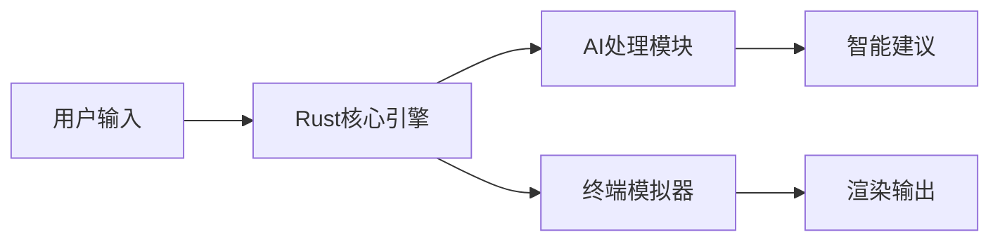
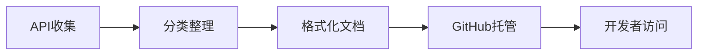
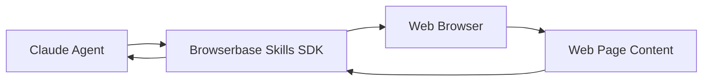

## 今日热点

智能体(Agent)技术与终端工具成为今日GitHub热榜主流，开发者积极探索AI增强的开发环境与高效工具链。

---

## 热门项目一览

| 排名 | 项目 | 语言 | 今日 | 总计 | 简介 |
|:---:|------|:----:|------:|-----:|------|
| 1 | [warpdotdev/warp](https://github.com/warpdotdev/warp) | Rust | +8,399 | 49,342 | Warp is an agentic developm... |
| 2 | [mattpocock/skills](https://github.com/mattpocock/skills) | Shell | +6,187 | 49,630 | Skills for Real Engineers. ... |
| 3 | [TauricResearch/TradingAgents](https://github.com/TauricResearch/TradingAgents) | Python | +2,023 | 57,834 | TradingAgents: Multi-Agents... |
| 4 | [obra/superpowers](https://github.com/obra/superpowers) | Shell | +1,632 | 174,639 | An agentic skills framework... |
| 5 | [HunxByts/GhostTrack](https://github.com/HunxByts/GhostTrack) | Python | +841 | 12,191 | Useful tool to track locati... |
| 6 | [soxoj/maigret](https://github.com/soxoj/maigret) | Python | +730 | 20,864 | 🕵️‍♂️ Collect a dossier on ... |
| 7 | [1jehuang/jcode](https://github.com/1jehuang/jcode) | Rust | +675 | 1,906 | Coding Agent Harness |
| 8 | [ghostty-org/ghostty](https://github.com/ghostty-org/ghostty) | Zig | +341 | 52,889 | 👻 Ghostty is a fast, featur... |
| 9 | [public-apis/public-apis](https://github.com/public-apis/public-apis) | Python | +322 | 429,563 | A collective list of free APIs |
| 10 | [lukilabs/craft-agents-oss](https://github.com/lukilabs/craft-agents-oss) | TypeScript | +319 | 5,585 | No description |
| 11 | [iamgio/quarkdown](https://github.com/iamgio/quarkdown) | Kotlin | +177 | 13,096 | 🪐 Markdown with superpowers... |
| 12 | [ForrestKnight/open-source-cs](https://github.com/ForrestKnight/open-source-cs) | Unknown | +140 | 22,387 | Video discussing this curri... |

---

## 趋势洞察

```
┌─────────────────────────────────────────────────────────────────┐
│  AI/ML 工具         ████████████████████████  8 个项目        │
│  开发工具             ██████                    2 个项目        │
│  其他               ██████                    2 个项目        │
│  多媒体应用            ███                       1 个项目        │
└─────────────────────────────────────────────────────────────────┘
```

---

## 项目深度解读

### 1. warpdotdev/warp — 智能终端开发环境

> **一句话总结**：Warp 是一个融合AI能力的现代化终端开发环境，提升命令行交互体验和效率。

#### 价值主张

| 维度 | 说明 |
|------|------|
| **解决痛点** | 传统终端缺乏现代化UI和AI辅助，开发效率受限 |
| **目标用户** | 终端重度使用者、开发者、DevOps工程师 |
| **核心亮点** | AI辅助命令 + 现代化UI界面 + 多标签支持 + 主题定制 + 性能优化 |

#### 技术架构



**技术特色**：
- 基于 Rust 语言构建，确保高性能和内存安全
- 集成AI能力，提供智能命令建议和自动补全
- 采用现代化渲染技术，支持主题和自定义界面
- 异步架构设计，提升响应速度和多任务处理能力

#### 热度分析

- 项目Star数近5万，单日增长超过8千，呈现爆发式增长态势
- 作为新兴终端工具，正迅速在开发者社区获得认可，可能成为终端工具的新标准

#### 快速上手

```bash
# macOS
brew install --cask warp

# Linux
# 下载deb/rpm包后执行
sudo dpkg -i warp_latest_amd64.deb

# Windows
# 下载msi安装包并运行
```

#### 注意事项

- 需要了解基本终端操作才能充分利用Warp功能
- AI功能可能需要联网使用，涉及隐私考虑
- 作为较新项目，某些功能可能仍在开发中，稳定性有待验证


### 2. mattpocock/skills — 工程师技能集

> **一句话总结**：从Claude目录提取的实用Shell脚本集合，提升工程师工作效率。

#### 价值主张

| 维度 | 说明 |
|------|------|
| **解决痛点** | 提供经过验证的实用脚本，解决日常工程任务 |
| **目标用户** | 开发者、系统管理员、DevOps工程师 |
| **核心亮点** | 精选实用脚本 + 即插即用 + 高效工作流 |

#### 技术架构


**技术特色**：
- 纯Shell脚本实现，跨平台兼容性好
- 模块化设计，每个脚本专注单一功能
- 简单直接的命令行接口

#### 热度分析

- 项目近期热度飙升，今日新增6,187 stars，表明技术社区高度认可
- 高star与fork比例，说明项目实用性强，社区参与度高

#### 快速上手

```bash
# 克隆仓库
git clone https://github.com/mattpocock/skills.git

# 进入目录并查看可用脚本
cd skills && ls
```

#### 注意事项

- 部分脚本可能需要特定环境或依赖
- 使用前建议查看每个脚本的具体说明和适用场景


### 3. TauricResearch/TradingAgents — 金融智能交易

> **一句话总结**：基于多智能体与大语言模型的金融交易框架，实现自动化交易策略与风险管理。

#### 价值主张

| 维度 | 说明 |
|------|------|
| **解决痛点** | 解决传统交易系统智能化不足与市场适应性差的问题 |
| **目标用户** | 量化交易者、金融分析师与AI交易爱好者 |
| **核心亮点** | 多智能体协同 + LLM决策引擎 + 实时风险监控 + 自动化策略生成 |

#### 技术架构


**技术特色**：
- 基于大语言模型的交易决策系统
- 多智能体协同工作机制
- 实时风险监控与调整机制

#### 热度分析

- 项目获57K+ Star，近期增长迅猛(+2K today)，显示金融AI领域高度关注
- 10K+ Fork表明项目具较强实用价值和二次开发潜力

#### 快速上手

```bash
# 安装依赖
pip install -r requirements.txt

# 运行示例
python examples/basic_trading.py
```

#### 注意事项

- 由于涉及金融交易，需谨慎使用，特别是在真实市场环境中
- 项目依赖可能较多，确保Python环境兼容
- 需要理解金融市场和交易的基本知识才能有效使用


### 4. obra/superpowers — 高效开发框架

> **一句话总结**：Superpowers是一个基于Shell的代理技能框架，通过结构化方法提升软件开发的效率和效果。

#### 价值主张

| 维度 | 说明 |
|------|------|
| **解决痛点** | 解决软件开发中缺乏系统性方法论和技能整合的问题 |
| **目标用户** | 软件开发人员、技术团队、效率提升追求者 |
| **核心亮点** | 轻量级Shell实现 + 结构化技能框架 + 实用方法论 + 高度可定制 |

#### 技术架构


**技术特色**：
- 基于Shell的跨平台兼容性
- 模块化的技能框架设计
- 实践驱动的软件开发方法论

#### 热度分析

- 项目获得17万+ Star且持续增长，表明其在开发者社区中具有高认可度
- Fork数量与Star比例合理，反映项目具有较高实用价值和可扩展性

#### 快速上手

```bash
git clone https://github.com/obra/superpowers.git
cd superpowers
chmod +x install.sh && ./install.sh
```

#### 注意事项

- 项目许可证未知，在使用前需要确认许可条款
- 作为Shell脚本集合，需要确保在目标系统上有相应的Shell环境
- 可能需要额外的依赖项才能正常运行所有功能


### 5. HunxByts/GhostTrack — 位置追踪工具

> **一句话总结**：一款功能强大的Python工具，可追踪手机位置和号码信息。

#### 价值主张

| 维度 | 说明 |
|------|------|
| **解决痛点** | 提供便捷的手机位置和号码追踪解决方案 |
| **目标用户** | 安全研究人员、家长、调查人员等需要位置追踪功能的用户 |
| **核心亮点** | 跨平台支持 + 实时位置追踪 + 多种追踪方式 + 隐私保护 + 易于集成 |

#### 技术架构

**技术特色**：
- 基于Python开发，跨平台兼容性强
- 采用模块化设计，支持多种追踪方法
- 集成了多种API和数据库，提高数据准确性

#### 热度分析

- 项目近期关注度激增，单日新增stars超过800，显示其功能实用性和市场认可度高
- 相对较高的fork比例(13.4%)表明用户不仅关注项目，还积极参与二次开发和功能定制

#### 快速上手

```bash
# 克隆项目
git clone https://github.com/HunxByts/GhostTrack.git

# 安装依赖
pip install -r requirements.txt

# 运行工具
python ghosttrack.py -n <phone_number>
```

#### 注意事项

- 使用本工具需遵守当地法律法规，未经授权追踪他人位置可能侵犯隐私
- 工具仅用于合法合规的目的，如寻找丢失设备或家人安全监控
- 部分功能可能需要付费API支持，开发者应考虑使用成本


### 6. soxoj/maigret — [用户名情报收集]

> **一句话总结**：跨平台用户名搜索工具，可在3000+网站收集目标用户的公开信息。

#### 价值主张

| 维度 | 说明 |
|------|------|
| **解决痛点** | 解决了在多个社交平台分散搜索用户信息的低效问题 |
| **目标用户** | 安全研究人员、数字取证专家、普通用户 |
| **核心亮点** | 覆盖网站广泛 + 搜索结果集中展示 + 支持多种输出格式 |

#### 技术架构


**技术特色**：
- 使用异步IO提高多网站搜索效率
- 采用模块化设计便于扩展新的网站支持
- 实现了智能的结果去重和优先级排序

#### 热度分析

- 项目Star数超过2万且近期增长迅速，表明其功能实用且受欢迎度高
- Fork数相对适中，说明项目更多被作为工具使用而非二次开发基础

#### 快速上手

```bash
# 安装项目
pip install maigret

# 基本使用
maigret username

# 高级选项
maigret username --verbose --report-file output.json
```

#### 注意事项

- 本工具仅适用于合法的信息收集，使用时需遵守相关法律法规和网站服务条款
- 收集到的信息可能包含隐私内容，请谨慎处理并尊重他人隐私
- 项目许可证未知，商业使用前需确认授权情况


### 7. 1jehuang/jcode — 智能编程助手

> **一句话总结**：基于 Rust 的智能编程助手，提供高效的代码生成与辅助功能。

#### 价值主张

| 维度 | 说明 |
|------|------|
| **解决痛点** | 提升编程效率，减少重复编码工作，优化开发流程 |
| **目标用户** | Rust 开发者、需要提高编码效率的软件工程师 |
| **核心亮点** | AI 驱动的代码生成 + Rust 高性能实现 + 开发流程优化 |

#### 技术架构


**技术特色**：
- 基于 Rust 的高性能实现
- AI 驱动的智能代码生成
- 与开发环境的无缝集成

#### 热度分析

- 项目近期增长迅猛，单日新增 675 个 Star，表明其技术价值和实用性强
- 相比 Fork 数量，Star 数量显著更高，说明项目更偏向于实用工具而非基础库

#### 快速上手

```bash
# 安装 jcode
cargo install jcode

# 使用 jcode 生成代码
jcode generate "创建一个简单的 HTTP 服务器"
```

#### 注意事项

- 项目许可证未知，商业使用前需确认授权条款
- 作为较新项目，API 和功能可能仍处于快速迭代阶段


### 8. ghostty-org/ghostty — 高性能终端模拟器

> **一句话总结**：Ghostty是采用Zig开发、GPU加速的跨平台终端模拟器，提供快速响应和原生UI体验。

#### 价值主张

| 维度 | 说明 |
|------|------|
| **解决痛点** | 传统终端性能不足、跨平台体验不一致、功能有限问题 |
| **目标用户** | 开发者、系统管理员、终端重度用户 |
| **核心亮点** | GPU加速渲染 + 跨平台兼容 + 原生UI集成 + 高性能 + Zig语言开发 |

#### 技术架构


**技术特色**：
- 采用Zig语言编写，提供内存安全和编译时优化
- 使用GPU加速渲染，大幅提升文本和图形渲染性能
- 跨平台架构设计，保持各平台原生体验一致性

#### 热度分析

- Star数超52,000且持续快速增长，表明项目活跃度高且获得社区广泛认可
- 作为新兴终端模拟器，正逐渐成为Alacritty等传统工具的有力竞争者

#### 快速上手

```bash
# 克隆仓库
git clone https://github.com/ghostty-org/ghostty
# 构建项目
cd ghostty && make
# 安装
sudo make install
```

#### 注意事项

- 项目使用Zig语言开发，需要Zig工具链环境
- 配置文件采用YAML格式，需要一定的学习成本
- 作为较新的项目，某些高级功能可能仍在开发中


### 9. public-apis/public-apis — 免费API资源库

> **一句话总结**：收录全球各类免费API，为开发者提供一站式第三方服务接入点。

#### 价值主张

| 维度 | 说明 |
|------|------|
| **解决痛点** | 开发者寻找免费API资源困难，缺乏统一的API查找平台 |
| **目标用户** | 需要集成第三方服务的开发者、学习API使用的初学者 |
| **核心亮点** | 覆盖领域广泛 + 分类清晰 + 持续更新 + API质量有保障 |

#### 技术架构



**技术特色**：
- 使用Markdown结构化呈现API信息
- 社区驱动的API收集与维护机制
- 简洁明了的API分类与检索系统

#### 热度分析

- 项目获得42万+星，日均增长300+星，表明开发者社区对此类资源有强烈需求
- 作为API生态中的基础资源项目，处于开发者工具链的关键位置，被广泛引用

#### 快速上手

```bash
# 克隆项目到本地
git clone https://github.com/public-apis/public-apis.git

# 浏览README.md了解分类和API列表
cat public-apis/README.md

# 搜索特定领域的API
grep -i "animals" public-apis/README.md
```

#### 注意事项

- API可能有使用频率限制或需要注册获取密钥
- 部分API可能已经停止服务或变更地址，使用前需验证
- 商业使用前需确认API的使用条款和许可协议


### 10. lukilabs/craft-agents-oss — AI代理框架

> **一句话总结**：基于TypeScript构建的开源AI智能代理开发框架，提供模块化代理构建能力。

#### 价值主张

| 维度 | 说明 |
|------|------|
| **解决痛点** | 简化复杂AI代理系统开发流程，降低AI应用构建门槛 |
| **目标用户** | AI应用开发者、企业AI解决方案构建者 |
| **核心亮点** | 模块化设计 + TypeScript类型安全 + 可扩展架构 |

#### 技术架构


**技术特色**：
- 基于TypeScript的全类型安全代理开发环境
- 提供丰富的中间件生态系统
- 支持多种AI模型无缝集成与切换

#### 热度分析

- 项目增长迅速，今日新增319个Star，社区认可度高
- 在AI代理开发领域具有显著影响力，TypeScript生态热门项目

#### 快速上手

```bash
# 安装项目
npm install craft-agents

# 初始化代理项目
npx craft-agents init my-agent

# 启动开发服务器
npm run dev
```

#### 注意事项
- 项目依赖较新的Node.js版本，确保环境兼容性
- 自定义代理需要理解TypeScript和异步编程概念


### 11. iamgio/quarkdown — 多功能Markdown转换器

> **一句话总结**：基于Kotlin的增强型Markdown工具，支持一键转换为多种专业文档格式。

#### 价值主张

| 维度 | 说明 |
|------|------|
| **解决痛点** | 传统Markdown功能有限，无法直接转换为论文、演示等专业文档 |
| **目标用户** | 需要高效处理文档格式的研究人员、开发者和内容创作者 |
| **核心亮点** | 多格式输出 + 增强语法 + 一键转换 + 可扩展架构 + 跨平台支持 |

#### 技术架构


**技术特色**：
- 基于Kotlin构建，利用其类型安全和协程特性
- 支持自定义语法扩展，增强Markdown表达能力
- 模块化设计，易于添加新的输出格式

#### 热度分析

- 项目Star数超过13K，近期增长稳定，表明社区认可度高
- Fork数相对较少，可能表明项目维护良好，用户更倾向于直接使用而非派生

#### 快速上手

```bash
# 安装Quarkdown
pip install quarkdown

# 基本使用
quarkdown input.md -o output.html
```

#### 注意事项

- 需要确认是否需要额外依赖才能支持某些输出格式
- 自定义语法的兼容性和学习曲线可能需要考虑


### 12. ForrestKnight/open-source-cs — CS课程资源

> **一句话总结**：提供完整的计算机科学自学课程体系，覆盖核心理论与技术实践。

#### 价值主张

| 维度 | 说明 |
|------|------|
| **解决痛点** | 提供系统化学习路径，解决CS知识零散、无序问题 |
| **目标用户** | 自学计算机科学的学生、转行者和IT技能提升者 |
| **核心亮点** | + 完整课程体系 + 精选资源 + 实践导向 + 免费开源 |

#### 技术架构


**技术特色**：
- 按CS知识领域组织的学习模块，循序渐进
- 集成多种学习资源，平衡理论与实践
- 提供明确的学习路线图和进度指导

#### 热度分析

- 项目获得2.2万+星标，表明高质量CS学习资源需求旺盛
- 社区参与度高，fork数达3千+，反映用户积极扩展资源库

#### 快速上手

```bash
# 克隆项目到本地
git clone https://github.com/ForrestKnight/open-source-cs.git

# 查看学习路径文档
cat README.md | grep -A 5 "学习路径"
```

#### 注意事项

- 部分推荐资源可能需要额外访问权限或订阅
- 建议按照项目推荐顺序学习，避免知识断层
- 定期关注项目更新，获取最新学习资源与课程调整


### 13. browserbase/skills — Claude网页交互SDK

> **一句话总结**：为Claude Agent提供结构化网页浏览能力，实现自动化网页交互与信息提取

#### 价值主张

| 维度 | 说明 |
|------|------|
| **解决痛点** | 为AI代理提供标准化网页浏览能力，解决AI无法直接操作网页的问题 |
| **目标用户** | 需要构建AI网页自动化应用的开发者和研究人员 |
| **核心亮点** | Claude专用SDK + 结构化网页交互 + 自动化数据提取 |

#### 技术架构



**技术特色**：
- 基于JavaScript的轻量级SDK实现
- 提供结构化的网页交互API
- 支持Claude Agent的网页浏览能力扩展

#### 热度分析

- 项目获得853个Star，近期增长较快(+69 today)，表明社区对其功能认可度高
- 虽然Issues为0，但Fork数量较少，可能项目处于早期阶段或专注于核心功能

#### 快速上手

```bash
# 安装Browserbase Skills SDK
npm install @browserbase/skills

# 初始化Claude Agent与Browserbase的连接
import { Browserbase } from '@browserbase/skills';
const browser = new Browserbase();
```

#### 注意事项

- 项目License未知，使用前需确认授权条款
- 作为Claude专用SDK，可能不适用于其他AI平台
- 需要配合Browserbase服务使用，可能涉及额外费用


## 今日推荐

| 主题 | 推荐项目 | 亮点 |
|------|----------|------|
| 今日最热 | [warpdotdev/warp](https://github.com/warpdotdev/warp) | Warp is an agenti... |
| 值得关注 | [mattpocock/skills](https://github.com/mattpocock/skills) | Skills for Real E... |
| 快速上手 | [TauricResearch/TradingAgents](https://github.com/TauricResearch/TradingAgents) | TradingAgents: Mu... |
| 长期潜力 | [obra/superpowers](https://github.com/obra/superpowers) | An agentic skills... |

---

<div align="center">

*Generated on 2026-05-01 | Powered by GitHub Trending Reporter*

</div>