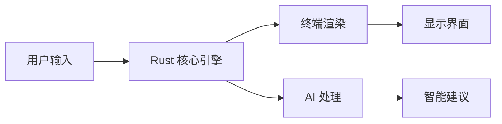

## 今日热点

AI智能体框架与开发工具成为今日GitHub热点，多智能体金融交易系统和智能终端环境获得广泛关注，开发者正积极构建AI辅助开发生态。

---

## 热门项目一览

| 排名 | 项目 | 语言 | 今日 | 总计 | 简介 |
|:---:|------|:----:|------:|-----:|------|
| 1 | [mattpocock/skills](https://github.com/mattpocock/skills) | Shell | +3,645 | 52,635 | Skills for Real Engineers. ... |
| 2 | [warpdotdev/warp](https://github.com/warpdotdev/warp) | Rust | +3,401 | 51,525 | Warp is an agentic developm... |
| 3 | [TauricResearch/TradingAgents](https://github.com/TauricResearch/TradingAgents) | Python | +2,112 | 59,959 | TradingAgents: Multi-Agents... |
| 4 | [obra/superpowers](https://github.com/obra/superpowers) | Shell | +1,096 | 175,658 | An agentic skills framework... |
| 5 | [soxoj/maigret](https://github.com/soxoj/maigret) | Python | +535 | 21,705 | 🕵️‍♂️ Collect a dossier on ... |
| 6 | [1jehuang/jcode](https://github.com/1jehuang/jcode) | Rust | +403 | 2,380 | Coding Agent Harness |
| 7 | [browserbase/skills](https://github.com/browserbase/skills) | JavaScript | +334 | 1,198 | Claude Agent SDK with a web... |
| 8 | [Flowseal/zapret-discord-youtube](https://github.com/Flowseal/zapret-discord-youtube) | Batchfile | +145 | 26,976 | No description |
| 9 | [simstudioai/sim](https://github.com/simstudioai/sim) | TypeScript | +56 | 28,165 | Build, deploy, and orchestr... |

---

## 趋势洞察

```
┌─────────────────────────────────────────────────────────────────┐
│  AI/ML 工具         ████████████████████████  8 个项目        │
│  其他               ███                       1 个项目        │
└─────────────────────────────────────────────────────────────────┘
```

---

## 项目深度解读

### 1. mattpocock/skills — 工程师技能库

> **一句话总结**：一个收集真实工程师实用Shell脚本的技能库，直接来源于作者日常开发经验。

#### 价值主张

| 维度 | 说明 |
|------|------|
| **解决痛点** | 提供可直接使用的工程化Shell脚本，解决重复开发问题 |
| **目标用户** | 开发者、系统管理员、DevOps工程师 |
| **核心亮点** | 实战导向 + 直接可用 + 持续更新 + 精选技能 |

#### 技术架构


**技术特色**：
- 纯Shell实现，跨平台兼容性强
- 脚本模块化设计，便于组合使用
- 注重实用性和效率，避免过度复杂

#### 热度分析

- 项目近期Star激增，表明开发者对实用工程脚本有强烈需求
- 高Fork数显示社区积极参与和二次开发

#### 快速上手

```bash
# 克隆仓库
git clone https://github.com/mattpocock/skills.git

# 查看可用脚本
cd skills && ls -la

# 使用特定脚本（示例）
./script-name.sh
```

#### 注意事项

- 使用前请检查脚本兼容性，确保适合您的系统环境
- 部分脚本可能需要根据具体环境进行调整
- 建议在使用前先在测试环境中验证


### 2. warpdotdev/warp — 智能终端环境

> **一句话总结**：Warp 是一个基于 Rust 开发的现代化智能终端，提供 AI 辅助和增强的开发体验。

#### 价值主张

| 维度 | 说明 |
|------|------|
| **解决痛点** | 传统终端功能有限，缺乏智能辅助和现代化UI体验 |
| **目标用户** | 开发者、系统管理员和终端重度用户 |
| **核心亮点** | AI 智能辅助 + 现代化界面 + 高度可定制 + 插件生态 |

#### 技术架构



**技术特色**：
- 基于 Rust 异步编程模型实现高性能终端处理
- 内置 AI 模型提供智能代码补全和命令建议
- 采用插件架构实现功能扩展和工具集成

#### 热度分析

- 项目 Star 数达 5 万+，单日增长超 3000，显示极强的社区吸引力
- Open Issues 为 0，表明项目维护质量高，问题响应及时

#### 快速上手

```bash
# macOS 安装
brew install --cask warp

# Linux 安装
curl https://get.warp.dev | sh

# Windows 安装
winget install --id WarpTerminal.Warp
```

#### 注意事项
- 项目许可证信息不明确，商业使用前需确认授权条款
- 作为较新的项目，部分功能可能仍在实验阶段，生产环境使用需谨慎
- 依赖 AI 服务，可能需要网络连接才能获得完整功能


### 3. TauricResearch/TradingAgents — 金融交易智能体

> **一句话总结**：基于多智能体与大语言模型的金融交易框架，实现自动化交易策略执行。

#### 价值主张

| 维度 | 说明 |
|------|------|
| **解决痛点** | 将大语言模型与多智能体技术结合，实现复杂金融交易策略自动化 |
| **目标用户** | 量化交易开发者、金融科技研究者和专业交易员 |
| **核心亮点** | 多智能体协作 + LLM驱动决策 + 策略自动化 + 实时分析 + 风险控制 |

#### 技术架构


**技术特色**：
- 多智能体协同决策机制，实现复杂策略分解
- 大语言模型集成，提供市场分析与预测能力
- 自适应交易执行系统，动态调整交易参数
- 完整的风险控制与回测框架
- 模块化设计，支持自定义智能体扩展

#### 热度分析

- 项目近6万Star，单日增长超2000，显示金融AI领域高度关注
- 高Fork/Star比值(约0.19)，表明项目有较强实用价值和二次开发需求

#### 快速上手

```bash
# 克隆项目
git clone https://github.com/TauricResearch/TradingAgents.git

# 安装依赖
pip install -r requirements.txt

# 运行示例
python examples/basic_trading_agent.py
```

#### 注意事项

- 项目需要金融市场数据和API密钥才能正常运行
- 实际交易前需在模拟环境中充分测试策略
- 注意合规性，不同地区对算法交易有不同监管要求
- 需要一定的Python编程和金融市场知识才能充分利用项目功能


### 4. obra/superpowers — 高效开发框架

> **一句话总结**：一个实用的代理技能框架和软件开发方法论，提升团队协作与开发效率。

#### 价值主张

| 维度 | 说明 |
|------|------|
| **解决痛点** | 解决软件开发中效率低下、方法论缺失的问题 |
| **目标用户** | 软件开发团队和独立开发者 |
| **核心亮点** | 技能框架 + 方法论 + 实用性 + 代理化 + 高效协作 |

#### 技术架构


**技术特色**：
- 基于Shell的轻量级实现
- 模块化的技能框架设计
- 实用主义的方法论体系

#### 热度分析

- 项目获得17.5万+星标，日增1千+，表明其广受欢迎且持续增长
- 高star与fork比例(11:1)显示项目社区参与度高，有实用价值

#### 快速上手

```bash
git clone https://github.com/obra/superpowers.git
cd superpowers
./superpowers-init
```

#### 注意事项

- 项目许可证未知，使用前需确认授权条款
- 作为方法论框架，可能需要团队协作才能发挥最大效用


### 5. soxoj/maigret — 用户信息收集器

> **一句话总结**：通过用户名在3000+网站收集个人信息，生成结构化报告的开源情报工具。

#### 价值主张

| 维度 | 说明 |
|------|------|
| **解决痛点** | 解决跨平台用户信息分散收集难题，实现一站式信息汇总 |
| **目标用户** | 安全研究人员、数字调查员、隐私保护人士 |
| **核心亮点** | 支持3000+网站搜索 + 结果结构化输出 + 可扩展架构 |

#### 技术架构


**技术特色**：
- 使用异步请求提高搜索效率
- 模块化设计支持网站列表扩展
- 结果结构化输出便于后续分析

#### 热度分析

- 项目获得2万+星标，近期增长迅速，显示OSINT工具需求旺盛
- Fork数相对较低，表明项目成熟度高，用户多为直接使用而非二次开发

#### 快速上手

```bash
# 安装maigret
pip install maigret

# 基本使用
maigret username

# 指定输出格式
maigret username -o json
```

#### 注意事项

- 使用时需遵守相关法律法规和网站使用条款
- 工具可能被用于侵犯隐私，应负责任地使用
- 部分网站可能有反爬虫机制，需要适当处理


### 6. 1jehuang/jcode — 代码智能助手

> **一句话总结**：基于 Rust 构建的智能编程代理工具，提供代码生成与优化支持。

#### 价值主张

| 维度 | 说明 |
|------|------|
| **解决痛点** | 提升编程效率，减少重复编码工作 |
| **目标用户** | 开发者、编程学习者、自动化测试人员 |
| **核心亮点** | AI 驱动代码生成 + Rust 高性能 + 智能代码优化 |

#### 技术架构


**技术特色**：
- 基于 Rust 的高性能代码处理引擎
- AI 驱动的代码分析与生成
- 模块化架构支持多种编程语言
- 实时代码质量评估系统

#### 热度分析

- 项目近期 Star 增长迅速，单日增长 403，表明社区关注度极高
- Fork 数相对较少，可能处于早期阶段，工具仍在快速迭代中

#### 快速上手

```bash
# 安装 jcode
cargo install jcode

# 使用 jcode 生成代码
jcode --prompt "创建一个简单的 HTTP 服务器"
```

#### 注意事项

- 项目仍在快速迭代中，API 可能会有变化
- 依赖 AI 服务，需要稳定的网络连接
- 生成的代码需要开发者审查，不能完全依赖自动生成


### 7. browserbase/skills — AI浏览工具

> **一句话总结**：为Claude Agent提供网页浏览能力的SDK，扩展AI在互联网环境中的应用范围。

#### 价值主张

| 维度 | 说明 |
|------|------|
| **解决痛点** | 解决Claude等AI助手无法直接浏览网页获取实时信息的问题 |
| **目标用户** | 需要AI进行网络数据采集、分析和自动化的开发者 |
| **核心亮点** | 无头浏览器集成 + 实时网页交互 + 结构化数据提取 + AI代理增强 |

#### 技术架构


**技术特色**：
- 基于JavaScript构建，易于集成到现有Web应用
- 提供Claude Agent与网页的无缝交互能力
- 支持复杂的网页操作和数据提取任务

#### 热度分析

- 项目Star数一日内激增334，显示社区对该技术的高度关注和需求
- 作为AI与网页交互的新兴解决方案，处于AI应用生态的前沿位置

#### 快速上手

```bash
# 安装Browserbase SDK
npm install @browserbase/browserbase

# 初始化Claude Agent与浏览器连接
const browserbase = require('@browserbase/browserbase');
```

#### 注意事项

- 需要确保遵守目标网站的robots.txt和使用条款
- 注意API调用频率和成本，避免过度使用导致服务限制
- 项目许可证未知，使用前需确认开源协议


### 8. Flowseal/zapret-discord-youtube — 网络访问工具

> **一句话总结**：批处理脚本集合，帮助用户绕过Discord和YouTube的网络限制。

#### 价值主张

| 维度 | 说明 |
|------|------|
| **解决痛点** | 解决无法正常访问Discord和YouTube的网络限制问题 |
| **目标用户** | 面临网络访问限制的用户，特别是在特定地区 |
| **核心亮点** | 简单易用 + 无需安装 + 多平台支持 |

#### 技术架构


**技术特色**：
- 基于Windows批处理脚本实现网络配置修改
- 提供多种代理方案选择以适应不同网络环境
- 通过系统级代理设置实现应用层网络绕过

#### 热度分析

- 高星项目(26,976 stars)反映网络访问限制问题的普遍性
- 稳定增长趋势(今日+145 stars)表明持续需求和社区认可

#### 快速上手

```bash
# 下载批处理文件到本地
# 以管理员权限运行
# 按照提示选择适合的代理配置
```

#### 注意事项

- 使用此类工具可能违反某些地区的网络使用政策
- 执行未知批处理脚本可能存在安全风险，建议从可信来源获取
- 网络访问限制政策可能随时间变化，工具有效性可能受到影响


### 9. simstudioai/sim — AI工作编排平台

> **一句话总结**：构建、部署和编排AI代理的综合平台，作为企业AI工作流的中央智能层。

#### 价值主张

| 维度 | 说明 |
|------|------|
| **解决痛点** | 企业AI代理分散、难以协同和管理的挑战 |
| **目标用户** | 需要构建和管理多个AI代理的企业开发团队 |
| **核心亮点** | 统一编排平台 + 多代理协同 + 企业级部署 + API集成 + 可扩展架构 |

#### 技术架构


**技术特色**：
- 基于TypeScript的企业级AI代理编排框架
- 提供统一的API接口管理多个AI代理
- 支持企业级部署和扩展能力

#### 热度分析

- 项目获得超过2.8万星，近期增长稳定，表明市场认可度高
- Fork数与Star数比例合理，显示项目有良好的社区参与度和技术深度

#### 快速上手

```bash
# 安装Sim CLI
npm install -g @simstudioai/sim

# 初始化项目
sim init my-ai-workspace

# 启动AI代理编排服务
sim start
```

#### 注意事项

- 项目许可证信息不明确，商业使用前需确认
- 由于Open Issues为0，可能表明问题管理流程严格或社区反馈渠道不完善


## 今日推荐

| 主题 | 推荐项目 | 亮点 |
|------|----------|------|
| 今日最热 | [mattpocock/skills](https://github.com/mattpocock/skills) | Skills for Real E... |
| 值得关注 | [warpdotdev/warp](https://github.com/warpdotdev/warp) | Warp is an agenti... |
| 快速上手 | [TauricResearch/TradingAgents](https://github.com/TauricResearch/TradingAgents) | TradingAgents: Mu... |
| 长期潜力 | [obra/superpowers](https://github.com/obra/superpowers) | An agentic skills... |

---

<div align="center">

*Generated on 2026-05-02 | Powered by GitHub Trending Reporter*

</div>