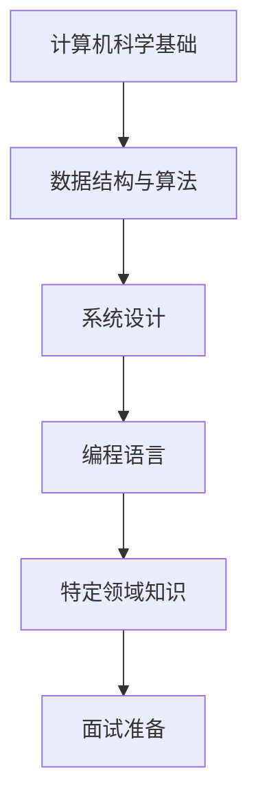

## 今日热点

AI智能体技术引领今日热榜，金融交易与AI结合项目获得大量关注，多智能体框架和Claude编排平台成为开发焦点。

---

## 热门项目一览

| 排名 | 项目 | 语言 | 今日 | 总计 | 简介 |
|:---:|------|:----:|------:|-----:|------|
| 1 | [TauricResearch/TradingAgents](https://github.com/TauricResearch/TradingAgents) | Python | +2,225 | 62,822 | TradingAgents: Multi-Agents... |
| 2 | [ruvnet/ruflo](https://github.com/ruvnet/ruflo) | TypeScript | +1,299 | 36,877 | 🌊 The leading agent orchest... |
| 3 | [soxoj/maigret](https://github.com/soxoj/maigret) | Python | +1,064 | 22,765 | 🕵️‍♂️ Collect a dossier on ... |
| 4 | [jwasham/coding-interview-university](https://github.com/jwasham/coding-interview-university) | Unknown | +694 | 344,600 | A complete computer science... |
| 5 | [1jehuang/jcode](https://github.com/1jehuang/jcode) | Rust | +482 | 2,870 | Coding Agent Harness |
| 6 | [browserbase/skills](https://github.com/browserbase/skills) | JavaScript | +346 | 1,534 | Claude Agent SDK with a web... |
| 7 | [Flowseal/zapret-discord-youtube](https://github.com/Flowseal/zapret-discord-youtube) | Batchfile | +181 | 27,122 | No description |
| 8 | [ShareX/ShareX](https://github.com/ShareX/ShareX) | C# | +152 | 36,833 | ShareX is a free and open-s... |

---

## 趋势洞察

```
┌─────────────────────────────────────────────────────────────────┐
│  AI/ML 工具         ████████████████████████  5 个项目        │
│  其他               █████████                 2 个项目        │
│  多媒体应用            ████                      1 个项目        │
└─────────────────────────────────────────────────────────────────┘
```

---

## 项目深度解读

### 1. TauricResearch/TradingAgents — 多智能体交易框架

> **一句话总结**：基于LLM的多智能体协同金融交易系统，实现自动化市场分析与策略执行。

#### 价值主张

| 维度 | 说明 |
|------|------|
| **解决痛点** | 传统交易系统缺乏市场理解能力，难以应对复杂多变的金融环境 |
| **目标用户** | 量化交易者、金融分析师、对冲基金、加密货币交易者 |
| **核心亮点** | 多智能体协作 + 大语言模型理解 + 自适应交易策略 + 实时市场分析 |

#### 技术架构


**技术特色**：
- 基于LLM的智能体理解金融市场动态
- 多智能体协作实现复杂交易策略
- 自适应学习优化交易决策

#### 热度分析

- 项目Star数超6万，单日增长超2200，显示极高市场关注度和社区活跃度
- 在量化交易与AI结合领域处于领先地位，吸引大量金融科技从业者

#### 快速上手

```bash
# 安装依赖
pip install -r requirements.txt

# 配置API密钥
cp config.example.yaml config.yaml

# 启动交易系统
python main.py --mode backtest --config config.yaml
```

#### 注意事项

- 需要配置有效的API密钥才能连接到金融市场数据源
- 建议在实盘交易前进行充分的回测和模拟交易
- 系统需要稳定的高速网络连接以获取实时市场数据
- 交易风险较高，建议仅使用闲置资金进行交易


### 2. ruvnet/ruflo — Claude智能体编排

> **一句话总结**：企业级Claude智能体编排平台，支持多智能体协同与自主工作流构建。

#### 价值主张

| 维度 | 说明 |
|------|------|
| **解决痛点** | 解决多智能体系统协调与复杂AI工作流管理难题 |
| **目标用户** | 企业级AI应用开发者和对话式AI系统构建者 |
| **核心亮点** | 多智能体集群编排 + 分布式群体智能 + RAG集成 + 企业级架构 + 原生Claude集成 |

#### 技术架构


**技术特色**：
- 基于TypeScript构建，提供类型安全和开发效率
- 支持分布式智能体协同工作流，实现复杂任务分解
- 原生集成Claude Code/Codex，强化代码生成与执行能力

#### 热度分析

- 项目Star数超36k，单日增长1.2k+，显示社区高度认可与快速采用
- 在Claude生态系统中占据核心地位，引领AI智能体编排领域发展

#### 快速上手

```bash
# 安装ruflo
npm install @ruvnet/ruflo

# 初始化项目
ruflo init my-agent-project

# 启动开发服务器
ruflo dev
```

#### 注意事项

- 项目许可证未知，商业使用前需确认授权条款
- 作为Claude专用平台，与其他AI模型兼容性可能有限
- 项目无开放问题，表明可能已成熟或社区反馈渠道不明确


### 3. soxoj/maigret — 数字足迹追踪

> **一句话总结**：通过用户名在3000+网站收集个人信息的数字足迹追踪工具。

#### 价值主张

| 维度 | 说明 |
|------|------|
| **解决痛点** | 跨平台追踪用户数字足迹，集中收集分散在各平台的个人信息 |
| **目标用户** | 安全研究员、数字隐私分析师、网络调查人员 |
| **核心亮点** | 覆盖3000+网站 + 支持多种输出格式 + 可定制化查询 |

#### 技术架构


**技术特色**：
- 基于Python的跨平台兼容性
- 模块化网站查询架构
- 异步查询提高效率
- 可扩展的网站检测机制

#### 热度分析

- 项目星标数超2.2万，单日增长千余，呈现爆发式增长趋势
- 零开放问题表明项目维护良好，社区活跃度高

#### 快速上手

```bash
# 安装
pip install maigret

# 基本使用
maigret username
```

#### 注意事项

- 工具涉及隐私问题，使用时需遵守相关法律法规
- 仅可用于合法的安全研究和隐私检查目的
- 查询大量网站可能触发反爬虫机制，建议合理使用


### 4. jwasham/coding-interview-university — 计算机科学学习指南

> **一句话总结**：完整的计算机科学学习路径，助你系统提升编程面试技能与计算机科学基础。

#### 价值主张

| 维度 | 说明 |
|------|------|
| **解决痛点** | 非计算机专业转行或应届生缺乏系统学习路径，面试准备零散 |
| **目标用户** | 求职软件工程师的转行者、应届生及希望提升技能的开发者 |
| **核心亮点** | 全面系统 + 精选资源 + 实战导向 + 社区支持 + 持续更新 |

#### 技术架构



**技术特色**：
- 结构化学习路径，从基础到进阶
- 精选优质学习资源，避免信息过载
- 实战项目与练习相结合，理论与实践并重

#### 热度分析

- 高达34万+星标，增长率稳定，表明在求职者群体中广泛认可
- Fork数量高，表明被大量学习者实际使用和二次开发

#### 快速上手

```bash
# 克隆项目到本地
git clone https://github.com/jwasham/coding-interview-university.git

# 查看项目结构
cd coding-interview-university && ls -la
```

#### 注意事项

- 本项目是学习指南而非代码库，需要结合实际编程练习
- 学习周期较长，建议按个人情况调整学习进度
- 需要结合实际编程项目和面试练习巩固知识


### 5. 1jehuang/jcode — AI编程工具集

> **一句话总结**：基于Rust的高效AI编程助手工具集，提供代码生成与优化功能。

#### 价值主张

| 维度 | 说明 |
|------|------|
| **解决痛点** | 解决AI辅助编程中的效率与质量问题，提供结构化代码生成支持 |
| **目标用户** | 软件开发者、AI研究人员、代码审查人员 |
| **核心亮点** | 基于Rust高性能实现 + 支持多种AI模型 + 代码结构优化 + 可扩展架构 |

#### 技术架构


**技术特色**：
- 基于Rust的高性能实现，确保处理速度
- 模块化设计，支持多种AI模型集成
- 智能代码结构优化与格式化

#### 热度分析

- 项目近期Star增长迅速(+482 today)，表明社区关注度正在快速提升
- 虽然Issues数量为0，但Fork数量相对较少，可能处于早期发展阶段

#### 快速上手

```bash
# 克隆仓库
git clone https://github.com/1jehuang/jcode.git

# 构建项目
cargo build --release
```

#### 注意事项

- 项目许可证未知，商业使用前需确认授权
- 目前Issues为0，可能缺乏社区反馈机制
- 作为新兴项目，API和功能可能不稳定


### 6. browserbase/skills — AI 浏览工具

> **一句话总结**：为 Claude AI 智能体提供强大的网页浏览能力，实现自动化网络交互与数据获取。

#### 价值主张

| 维度 | 说明 |
|------|------|
| **解决痛点** | 突破 AI 模型无法直接访问互联网的局限，实现真实网页交互 |
| **目标用户** | AI 应用开发者、自动化测试工程师、智能体构建者 |
| **核心亮点** | 基于 Claude Agent + 真实浏览器环境 + 网页交互能力 + 数据提取工具 |

#### 技术架构


**技术特色**：
- 基于 JavaScript 构建的轻量级 SDK
- 提供真实的浏览器环境模拟
- 简化网页交互与数据获取流程

#### 热度分析

- 单日增长346个Star，显示技术热度迅速攀升
- 作为 AI 浏览工具领域新兴项目，在 AI 自动化生态中占据重要位置

#### 快速上手

```bash
# 安装 Browserbase SDK
npm install @browserbase/browserbase

# 初始化浏览器实例
const browserbase = require('@browserbase/browserbase');
const bb = new browserbase.Browserbase();
const browser = await bb.connect();
```

#### 注意事项

- 需确保遵守目标网站的 robots.txt 和使用条款
- 使用时需注意网络请求频率限制，避免对目标网站造成过大负担
- 可能需要 Browserbase 服务的 API 密钥才能正常使用


### 7. Flowseal/zapret-discord-youtube — 网络访问工具

> **一句话总结**：批处理脚本实现绕过Discord和YouTube访问限制的解决方案。

#### 价值主张

| 维度 | 说明 |
|------|------|
| **解决痛点** | 解决特定地区对Discord和YouTube的访问限制问题 |
| **目标用户** | 需要访问被限制社交和视频平台的用户 |
| **核心亮点** | 批处理实现 + 无需安装 + 配置简单 + 绕过限制 |

#### 技术架构


**技术特色**：
- 利用Windows批处理脚本实现网络配置修改
- 通过修改路由表和DNS设置绕过访问限制
- 简单易用，无需复杂安装步骤

#### 热度分析

- 高Star数表明项目解决的实际需求强烈，近期增长稳定
- 无公开Issues可能意味着问题通过其他渠道解决或项目维护良好

#### 快速上手

```bash
# 项目可能包含的批处理命令示例
@echo off
echo 正在配置网络访问...
route add [目标IP] mask [子网掩码] [网关]
ipconfig /flushdns
echo 配置完成！
```

#### 注意事项

- 此类工具可能违反某些地区的网络使用政策
- 批处理脚本可能需要管理员权限才能正常运行
- 网络环境变化可能导致脚本需要调整
- 使用前应了解相关法律法规限制


### 8. ShareX/ShareX — 屏幕捕获工具

> **一句话总结**：ShareX是一款免费开源的屏幕捕获工具，支持截图、录屏并一键上传至多平台。

#### 价值主张

| 维度 | 说明 |
|------|------|
| **解决痛点** | 解决用户快速捕获屏幕内容并便捷分享的需求 |
| **目标用户** | 需要频繁截图、录屏并分享的普通用户和开发者 |
| **核心亮点** | 自定义快捷键 + 多种捕获模式 + 丰富的上传目的地 + 强大的编辑功能 + 开源免费 |

#### 技术架构


**技术特色**：
- 基于.NET框架构建，跨平台兼容性好
- 支持插件扩展系统，功能高度可定制
- 采用异步处理技术，确保捕获和上传过程流畅

#### 热度分析

- 项目Star数超过3.6万，近30天增长稳定，表明用户认可度高且社区活跃
- 作为屏幕捕获领域的开源标杆，拥有完善的插件生态和丰富的自定义选项

#### 快速上手

```bash
# 下载并安装ShareX
# https://getsharex.com/

# 设置快捷键
# 打开ShareX > 设置 > 热键 > 自定义截图快捷键

# 截图并上传
# 按自定义快捷键 > 选择捕获区域 > 自动上传至配置的目标
```

#### 注意事项

- 首次使用需要配置上传目标，可能需要API密钥或账户信息
- 某些高级功能可能需要额外的插件支持
- 由于项目许可证未知，商业使用前建议确认授权条款


## 今日推荐

| 主题 | 推荐项目 | 亮点 |
|------|----------|------|
| 今日最热 | [TauricResearch/TradingAgents](https://github.com/TauricResearch/TradingAgents) | TradingAgents: Mu... |
| 值得关注 | [ruvnet/ruflo](https://github.com/ruvnet/ruflo) | 🌊 The leading age... |
| 快速上手 | [soxoj/maigret](https://github.com/soxoj/maigret) | 🕵️‍♂️ Collect a d... |
| 长期潜力 | [jwasham/coding-interview-university](https://github.com/jwasham/coding-interview-university) | A complete comput... |

---

<div align="center">

*Generated on 2026-05-03 | Powered by GitHub Trending Reporter*

</div>