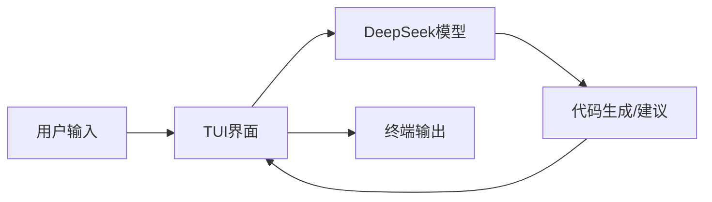

## 今日热点

多智能体系统与AI代理工具引领今日热榜，Claude生态相关项目表现突出，垂直领域AI应用与工具集成成为主要趋势。

---

## 热门项目一览

| 排名 | 项目 | 语言 | 今日 | 总计 | 简介 |
|:---:|------|:----:|------:|-----:|------|
| 1 | [TauricResearch/TradingAgents](https://github.com/TauricResearch/TradingAgents) | Python | +3,313 | 65,388 | TradingAgents: Multi-Agents... |
| 2 | [ruvnet/ruflo](https://github.com/ruvnet/ruflo) | TypeScript | +1,840 | 39,100 | 🌊 The leading agent orchest... |
| 3 | [soxoj/maigret](https://github.com/soxoj/maigret) | Python | +1,119 | 23,867 | 🕵️‍♂️ Collect a dossier on ... |
| 4 | [1jehuang/jcode](https://github.com/1jehuang/jcode) | Rust | +591 | 3,454 | Coding Agent Harness |
| 5 | [AIDC-AI/Pixelle-Video](https://github.com/AIDC-AI/Pixelle-Video) | Python | +497 | 10,031 | 🚀 AI 全自动短视频引擎 | AI Fully Au... |
| 6 | [Hmbown/DeepSeek-TUI](https://github.com/Hmbown/DeepSeek-TUI) | Rust | +343 | 2,211 | Coding agent for DeepSeek m... |
| 7 | [browserbase/skills](https://github.com/browserbase/skills) | JavaScript | +322 | 1,841 | Claude Agent SDK with a web... |
| 8 | [czlonkowski/n8n-mcp](https://github.com/czlonkowski/n8n-mcp) | TypeScript | +282 | 19,541 | A MCP for Claude Desktop / ... |
| 9 | [openwrt/openwrt](https://github.com/openwrt/openwrt) | C | +26 | 26,626 | This repository is a mirror... |

---

## 趋势洞察

```
┌─────────────────────────────────────────────────────────────────┐
│  AI/ML 工具         ████████████████████████  8 个项目        │
│  其他               ███                       1 个项目        │
└─────────────────────────────────────────────────────────────────┘
```

---

## 项目深度解读

### 1. TauricResearch/TradingAgents — AI交易框架

> **一句话总结**：基于多智能体和大语言模型的金融交易框架，支持自动化交易策略开发与执行。

#### 价值主张

| 维度 | 说明 |
|------|------|
| **解决痛点** | 传统交易策略开发复杂，AI决策与执行流程割裂问题 |
| **目标用户** | 量化交易者、金融分析师、AI研究人员 |
| **核心亮点** | 多智能体协同 + LLM决策引擎 + 完整交易生命周期管理 |

#### 技术架构


**技术特色**：
- 多智能体协同工作架构，实现复杂交易策略
- 大语言模型集成，提供市场分析和决策支持
- 模块化设计，支持多种交易算法和策略

#### 热度分析

- 项目Star数高达65,388，单日增长3,313，显示AI金融领域关注度极高
- Fork数12,651表明社区活跃，二次开发潜力大

#### 快速上手

```bash
# 克隆项目
git clone https://github.com/TauricResearch/TradingAgents.git
cd TradingAgents

# 安装依赖
pip install -r requirements.txt

# 运行示例
python examples/basic_trading_agent.py
```

#### 注意事项

- 项目未明确许可证，使用时需注意版权和许可问题
- 金融交易存在风险，建议先在模拟环境充分测试策略效果
- 系统可能需要配置金融数据API访问权限，可能需要额外订阅


### 2. ruvnet/ruflo — AI代理编排平台

> **一句话总结**：Claude智能代理编排平台，支持多代理协作与自主工作流构建。

#### 价值主张

| 维度 | 说明 |
|------|------|
| **解决痛点** | 解决多AI代理协同工作流程复杂、效率低下的问题 |
| **目标用户** | 企业AI开发者、对话式AI系统构建者、智能工作流设计师 |
| **核心亮点** | 企业级架构 + 自学习群体智能 + RAG集成 + 原生Claude Code支持 |

#### 技术架构


**技术特色**：
- 分布式代理架构，支持大规模并发处理
- 自学习群体智能算法，提升代理协作效率
- 原生Claude Code集成，提供代码级交互能力

#### 热度分析

- 项目近期增长迅猛，单日增长近2000星，表明市场对该技术高度认可
- 在AI代理编排领域处于领先地位，生态影响力迅速扩大

#### 快速上手

```bash
# 安装ruflo
npm install -g ruflo

# 初始化项目
ruflo init my-agent-project

# 启动代理编排服务
ruflo start --port 8080
```

#### 注意事项

- 许可证信息不明确，商业使用前需确认授权条款
- 项目依赖Claude API，需确保API访问权限和配额充足
- 企业级部署可能需要额外的配置和安全措施


### 3. soxoj/maigret — 跨平台信息收集

> **一句话总结**：跨平台用户名信息收集工具，可从3000+网站检索目标用户公开信息，构建数字档案。

#### 价值主张

| 维度 | 说明 |
|------|------|
| **解决痛点** | 解决分散在各平台的用户信息整合难题，提供一站式数字足迹追踪能力 |
| **目标用户** | 数字调查人员、安全研究员、隐私保护倡导者、背景调查从业者 |
| **核心亮点** | 支持3000+网站 + 多种查询模式 + 结果可视化 + API接口 + 隐私保护 |

#### 技术架构


**技术特色**：
- 分布式查询架构，提高信息收集效率
- 模块化设计，便于扩展新网站支持
- 智能过滤机制，减少噪音信息

#### 热度分析

- 项目热度持续攀升，近一个月新增超1000星，表明数字隐私调查需求增长
- 在安全工具生态中占据重要位置，成为数字足迹分析的首选工具之一

#### 快速上手

```bash
# 安装项目
pip install maigret

# 运行信息收集
maigret username
```

#### 注意事项

- 使用时需遵守目标网站的服务条款，避免违反隐私法规
- 收集的信息可能包含不准确或过时数据，需交叉验证
- 工具仅可用于合法目的，禁止用于恶意追踪或侵犯他人隐私


### 4. 1jehuang/jcode — 代码智能助手

> **一句话总结**：基于 Rust 开发的高性能代码智能助手，通过 AI 技术提升开发者编码效率和质量。

#### 价值主张

| 维度 | 说明 |
|------|------|
| **解决痛点** | 解决开发者重复编码和低效问题，提升代码质量 |
| **目标用户** | 专业开发者和需要高效编码支持的开发团队 |
| **核心亮点** | AI 驱动 + 高性能 Rust 实现 + 代码智能补全 + 多语言支持 |

#### 技术架构


**技术特色**：
- 基于 Rust 的高性能实现，确保处理速度和内存效率
- 集成大型语言模型进行智能代码生成和优化
- 支持多种编程语言的无缝切换和智能补全

#### 热度分析

- 项目近期获得显著关注，Star 数激增，显示其技术价值受到开发者认可
- Issues 为零表明项目稳定性良好，但 Fork 数相对较少，可能处于早期发展阶段

#### 快速上手

```bash
# 安装 jcode
cargo install jcode

# 使用 jcode 生成代码
jcode --prompt "创建一个快速排序函数"
```

#### 注意事项

- 项目目前没有明确的许可证信息，使用前需确认
- 由于项目处于早期阶段，API 和功能可能会有较大变化


### 5. AIDC-AI/Pixelle-Video — AI视频生成引擎

> **一句话总结**：基于AI的全自动短视频生成引擎，简化内容创作流程。

#### 价值主张

| 维度 | 说明 |
|------|------|
| **解决痛点** | 解决短视频制作专业门槛高、耗时长的痛点 |
| **目标用户** | 内容创作者、营销团队、自媒体运营者 |
| **核心亮点** | AI自动化生成 + 多格式支持 + 高效产出 |

#### 技术架构


**技术特色**：
- 基于深度学习的视频生成算法
- 自动化内容编排与转场效果
- 多模态内容融合技术
- 高效渲染与压缩优化

#### 热度分析

- 项目Star数过万且近期增长迅速，表明AI视频生成领域热度高
- 社区活跃度高，Fork数与Star数比例合理，显示良好的参与度

#### 快速上手

```bash
# 克隆项目
git clone https://github.com/AIDC-AI/Pixelle-Video.git

# 安装依赖
cd Pixelle-Video
pip install -r requirements.txt

# 运行示例
python examples/basic_demo.py
```

#### 注意事项

- 项目许可证未知，使用前需确认授权方式
- 可能需要较高的计算资源，特别是处理长视频时
- AI生成内容可能涉及版权问题，需注意使用场景


### 6. Hmbown/DeepSeek-TUI — 终端AI编程助手

> **一句话总结**：基于DeepSeek模型的终端内编程助手，提供实时代码生成与智能补全功能

#### 价值主张

| 维度 | 说明 |
|------|------|
| **解决痛点** | 将AI编程助手集成到终端环境，无需切换应用即可获得代码建议 |
| **目标用户** | 终端开发者、系统管理员和需要高效编程辅助的技术人员 |
| **核心亮点** | 基于DeepSeek大模型 + 终端内直接运行 + 实时代码生成 + 多语言支持 + 轻量级 |

#### 技术架构



**技术特色**：
- 使用Rust构建高性能TUI应用，资源占用低
- 集成DeepSeek大语言模型提供智能编程辅助
- 支持实时交互式代码生成和补全功能

#### 热度分析

- 项目Star数快速增长，单日增长超过300，表明社区对该工具高度认可
- 虽然Issues为0，但Fork数相对较低，说明项目可能处于早期阶段，尚未形成广泛生态

#### 快速上手

```bash
# 安装
cargo install deepseek-tui

# 使用
deepseek-tui
```

#### 注意事项

- 需要DeepSeek API密钥才能使用
- 可能需要稳定的网络连接访问DeepSeek服务
- 目前项目License未知，使用前需确认授权条款


### 7. browserbase/skills — Claude网页浏览SDK

> **一句话总结**：为Claude Agent提供网页浏览能力的JavaScript SDK，增强AI在网页环境中的交互能力。

#### 价值主张

| 维度 | 说明 |
|------|------|
| **解决痛点** | 解决Claude Agent无法直接浏览网页和与网页交互的问题 |
| **目标用户** | 需要Claude Agent进行网页自动化任务的开发者和研究人员 |
| **核心亮点** | 提供网页浏览API接口 + 支持JavaScript执行 + 集成Claude Agent能力 + 可扩展工具系统 |

#### 技术架构

**技术特色**：
- 基于JavaScript构建，易于与现有Web集成
- 提供底层浏览器操作API，支持复杂网页交互
- 采用模块化设计，便于扩展自定义工具

#### 热度分析

- 项目近期增长迅速，今日新增322个Star，显示出社区对该项目的高度关注
- 虽然Open Issues为0，但Fork数量相对较少，可能表明项目处于早期发展阶段

#### 快速上手

```bash
# 安装依赖
npm install browserbase/skills

# 初始化浏览器会话
const { Browserbase } = require('@browserbase/skills');
const browser = new Browserbase();

# 执行网页浏览任务
await browser.navigate('https://example.com');
const content = await browser.getPageContent();
```

#### 注意事项

- 项目许可证未知，使用前需确认授权条款
- 作为Claude Agent的扩展工具，需先具备Claude Agent的基础环境
- 项目处于早期阶段，API可能会有较大变化


### 8. czlonkowski/n8n-mcp — [n8n工作流构建工具]

> **一句话总结**：为Claude系列AI助手提供n8n工作流构建能力的MCP协议实现，实现AI与自动化工作流的深度集成。

#### 价值主张

| 维度 | 说明 |
|------|------|
| **解决痛点** | 为Claude AI助手提供构建n8n工作流的能力，弥合AI与自动化工具之间的鸿沟 |
| **目标用户** | 使用Claude Desktop/CODE/Windsurf/Cursor的开发者和自动化流程设计者 |
| **核心亮点** | 作为MCP协议实现 + 无缝集成Claude生态 + 简化n8n工作流构建 + 提升AI辅助自动化能力 |

#### 技术架构


**技术特色**：
- 基于TypeScript开发，提供类型安全和良好的开发体验
- 实现MCP协议标准，确保与Claude生态系统的兼容性
- 提供n8n工作流构建能力，扩展Claude的自动化功能

#### 热度分析

- 项目Star数接近2万，近期增长迅速（单日新增282星），表明社区高度关注和认可
- 作为MCP生态中的重要组件，连接AI助手与自动化工具，处于AI赋能自动化的前沿位置

#### 快速上手

```bash
# 安装n8n-mcp
npm install -g czlonkowski/n8n-mcp

# 配置Claude Desktop
# 在配置文件中添加n8n-mcp作为MCP服务器

# 启动Claude Desktop并使用工作流构建功能
```

#### 注意事项

- 需要确保已安装n8n工作流引擎
- 配置MCP协议时需正确设置API端点和认证信息
- 可能需要根据n8n版本兼容性进行相应调整


### 9. openwrt/openwrt — 嵌入式路由系统

> **一句话总结**：高度模块化的Linux嵌入式操作系统，专为路由器和网络设备提供强大可定制性

#### 价值主张

| 维度 | 说明 |
|------|------|
| **解决痛点** | 突破厂商路由器固件限制，提供完全自主可控的网络环境 |
| **目标用户** | 网络开发者、网络爱好者、需要高级网络功能的用户 |
| **核心亮点** | 模块化设计 + 丰富的软件包生态 + 强大的路由功能 + 跨平台支持 + 活跃社区 |

#### 技术架构


**技术特色**：
- 基于Linux的完整嵌入式操作系统
- 采用opkg包管理系统实现动态软件管理
- 提供LuCI Web界面简化配置流程
- 支持多种网络协议和高级路由功能
- 轻量级设计，资源占用小

#### 热度分析

- 高Star数持续增长，表明项目在网络设备领域有广泛影响力
- 虽为镜像仓库，但社区活跃度高，PR提交频繁

#### 快速上手

```bash
# 登入OpenWRT系统
ssh root@192.168.1.1

# 更新软件包列表
opkg update
```

#### 注意事项

- 此为官方镜像仓库，实际开发发生在git.openwrt.org
- 刷入OpenWRT固件有风险，可能导致设备变砖
- 需要一定的Linux和网络知识才能充分利用OpenWRT功能


## 今日推荐

| 主题 | 推荐项目 | 亮点 |
|------|----------|------|
| 今日最热 | [TauricResearch/TradingAgents](https://github.com/TauricResearch/TradingAgents) | TradingAgents: Mu... |
| 值得关注 | [ruvnet/ruflo](https://github.com/ruvnet/ruflo) | 🌊 The leading age... |
| 快速上手 | [soxoj/maigret](https://github.com/soxoj/maigret) | 🕵️‍♂️ Collect a d... |
| 长期潜力 | [1jehuang/jcode](https://github.com/1jehuang/jcode) | Coding Agent Harness |

---

<div align="center">

*Generated on 2026-05-04 | Powered by GitHub Trending Reporter*

</div>