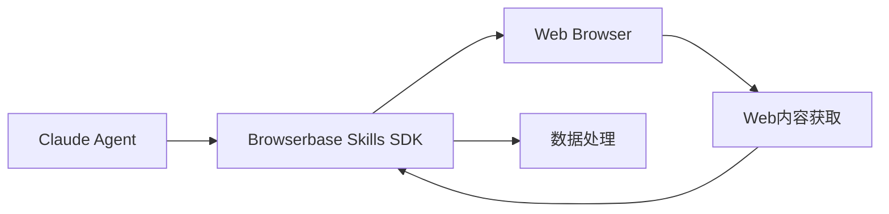
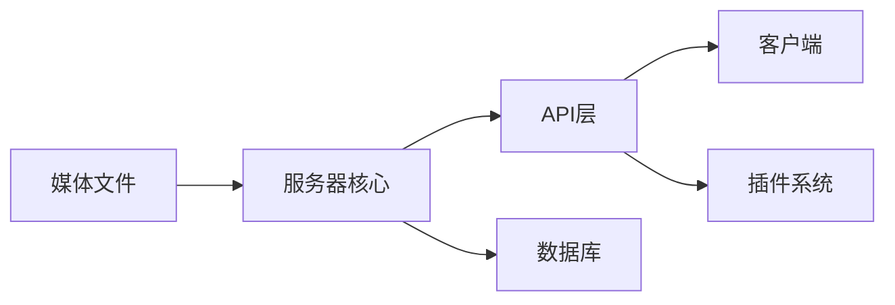

## 今日热点

今日GitHub热榜主要聚焦于AI代理生态系统的爆发式增长，特别是Claude代理平台和多智能体框架成为绝对主流，同时AI驱动的专业应用(如金融交易、音乐生成)也获得高度关注。

---

## 热门项目一览

| 排名 | 项目 | 语言 | 今日 | 总计 | 简介 |
|:---:|------|:----:|------:|-----:|------|
| 1 | [ruvnet/ruflo](https://github.com/ruvnet/ruflo) | TypeScript | +2,598 | 41,519 | 🌊 The leading agent orchest... |
| 2 | [TauricResearch/TradingAgents](https://github.com/TauricResearch/TradingAgents) | Python | +2,182 | 67,603 | TradingAgents: Multi-Agents... |
| 3 | [Hmbown/DeepSeek-TUI](https://github.com/Hmbown/DeepSeek-TUI) | Rust | +1,274 | 4,060 | Coding agent for DeepSeek m... |
| 4 | [msitarzewski/agency-agents](https://github.com/msitarzewski/agency-agents) | Shell | +1,189 | 92,713 | A complete AI agency at you... |
| 5 | [soxoj/maigret](https://github.com/soxoj/maigret) | Python | +1,119 | 24,886 | 🕵️‍♂️ Collect a dossier on ... |
| 6 | [1jehuang/jcode](https://github.com/1jehuang/jcode) | Rust | +548 | 3,932 | Coding Agent Harness |
| 7 | [docusealco/docuseal](https://github.com/docusealco/docuseal) | Ruby | +535 | 13,306 | Open source DocuSign altern... |
| 8 | [czlonkowski/n8n-mcp](https://github.com/czlonkowski/n8n-mcp) | TypeScript | +496 | 19,931 | A MCP for Claude Desktop / ... |
| 9 | [virattt/dexter](https://github.com/virattt/dexter) | TypeScript | +409 | 23,229 | An autonomous agent for dee... |
| 10 | [browserbase/skills](https://github.com/browserbase/skills) | JavaScript | +320 | 2,131 | Claude Agent SDK with a web... |
| 11 | [fspecii/ace-step-ui](https://github.com/fspecii/ace-step-ui) | JavaScript | +237 | 2,860 | 🎵 The Ultimate Open Source ... |
| 12 | [cocoindex-io/cocoindex](https://github.com/cocoindex-io/cocoindex) | Python | +166 | 8,025 | Incremental engine for long... |

---

## 趋势洞察

```
┌─────────────────────────────────────────────────────────────────┐
│  AI/ML 工具         ████████████████████████  11 个项目        │
│  其他               ████                      2 个项目        │
│  多媒体应用            ██                        1 个项目        │
│  开发工具             ██                        1 个项目        │
└─────────────────────────────────────────────────────────────────┘
```

---

## 项目深度解读

### 1. ruvnet/ruflo — Claude智能体编排平台

> **一句话总结**：企业级Claude智能体编排平台，支持多智能体协同与自主工作流构建。

#### 价值主张

| 维度 | 说明 |
|------|------|
| **解决痛点** | 企业级AI应用中多智能体协同和自主工作流管理的复杂性 |
| **目标用户** | 需要构建复杂AI系统的企业开发团队和AI研究人员 |
| **核心亮点** | 多智能体编排 + 企业级架构 + 自学习群体智能 + RAG集成 + Claude原生集成 |

#### 技术架构


**技术特色**：
- 基于TypeScript的全栈开发架构
- 分布式智能体协调与通信机制
- 企业级安全与可扩展性设计

#### 热度分析

- 项目Star数超41k，单日增长近2.6k，显示极高的社区关注度和快速增长趋势
- 作为Claude生态的核心编排工具，在AI多智能体应用领域占据重要生态位置

#### 快速上手

```bash
# 安装ruflo
npm install -g ruflo

# 初始化项目
ruflo init my-agent-project

# 启动开发环境
ruflo dev
```

#### 注意事项

- 项目许可证未知，商业使用前需确认许可条款
- 项目可能需要Claude API访问权限
- 企业部署可能需要额外配置和资源


### 2. TauricResearch/TradingAgents — 多智能体交易框架

> **一句话总结**：基于大语言模型的多智能体金融交易系统，实现自动化投资决策与风险管理。

#### 价值主张

| 维度 | 说明 |
|------|------|
| **解决痛点** | 将LLM技术应用于金融交易，实现智能化、自动化决策 |
| **目标用户** | 量化交易开发者、金融分析师、AI研究人员 |
| **核心亮点** | 多智能体协作 + LLM决策 + 自适应学习 + 多市场支持 |

#### 技术架构


**技术特色**：
- 基于大语言模型的多智能体协作架构
- 自适应学习机制优化交易策略
- 支持多种金融市场和数据源

#### 热度分析

- 项目星数超6.7万，单日增长2000+，呈爆发式增长态势
- 在AI+金融领域具有显著影响力，社区活跃度极高

#### 快速上手

```bash
# 安装依赖
pip install tauric-trading-agents

# 基本使用示例
from trading_agents import TradingAgent, MarketData
agent = TradingAgent()
market = MarketData("AAPL")
agent.trade(market)
```

#### 注意事项

- 需要具备金融知识和Python编程基础
- 实际交易前需在模拟环境中充分测试
- 注意API使用限制和数据合规性


### 3. Hmbown/DeepSeek-TUI — 终端AI编程助手

> **一句话总结**：DeepSeek大模型终端编程助手，提供沉浸式AI辅助编程体验。

#### 价值主张

| 维度 | 说明 |
|------|------|
| **解决痛点** | 在终端中直接获得DeepSeek模型的编程辅助，无需切换应用 |
| **目标用户** | 命令行开发者、Rust程序员、AI辅助编程爱好者 |
| **核心亮点** | 终端原生集成 + 实时代码生成 + 智能错误修复 |

#### 技术架构


**技术特色**：
- 基于Rust构建，性能高效且内存安全
- 终端用户界面(TUI)提供流畅交互体验
- 与DeepSeek模型API无缝集成，实现实时编程辅助

#### 热度分析

- 项目近期热度显著，单日增长超过1200星，表明市场需求强烈
- 虽然Issues为0，但Fork数量适中，说明项目处于早期但已获得社区认可

#### 快速上手

```bash
# 克隆项目
git clone https://github.com/Hmbown/DeepSeek-TUI.git

# 运行项目（需要先安装Rust环境）
cargo run
```

#### 注意事项

- 需要有效的DeepSeek API密钥才能使用
- 可能需要配置网络代理以访问DeepSeek服务
- 项目处于早期阶段，功能可能仍在快速迭代中


### 4. msitarzewski/agency-agents — AI代理库

> **一句话总结**：提供多种专业化AI代理，每个具备独特个性和专业技能，打造完整AI代理生态系统。

#### 价值主张

| 维度 | 说明 |
|------|------|
| **解决痛点** | 提供即用型专业AI代理，无需从零构建AI能力 |
| **目标用户** | 开发者、内容创作者、营销人员和AI应用爱好者 |
| **核心亮点** | 专业领域定制 + 独特个性 + 可交付成果 + 易于集成 + 多样化选择 |

#### 技术架构


**技术特色**：
- 基于Shell脚本实现，跨平台兼容性强
- 模块化设计，每个代理独立功能
- 通过命令行界面提供直观交互体验

#### 热度分析

- 项目获得超过92k星和15k分叉，近期增长迅速，表明AI代理工具需求旺盛
- 零开放问题反映项目成熟度高，社区维护良好，可能是企业级解决方案

#### 快速上手

```bash
# 克隆仓库
git clone https://github.com/msitarzewski/agency-agents.git
# 进入目录
cd agency-agents
# 运行特定代理
./agent.sh frontend-wizard
```

#### 注意事项

- 需要确保系统已安装必要的Shell环境和依赖
- 某些AI代理可能需要API密钥或额外配置
- 使用前应阅读各代理的具体文档以了解其功能和限制


### 5. soxoj/maigret — 用户名信息收集工具

> **一句话总结**：通过用户名在3000+网站收集个人信息的网络侦察工具。

#### 价值主张

| 维度 | 说明 |
|------|------|
| **解决痛点** | 解决网络用户信息分散收集困难的问题 |
| **目标用户** | 安全研究人员、数字取证专家、隐私保护者 |
| **核心亮点** | 支持3000+网站 + 多种搜索策略 + 详细报告生成 |

#### 技术架构


**技术特色**：
- 使用多线程/异步IO提高搜索效率
- 模拟真实浏览器行为避免被检测
- 模块化设计便于扩展新网站支持

#### 热度分析

- 项目Star数超过24,000，近期增长迅速(+1,119 today)，表明项目高度活跃
- Fork数相对较少，说明用户更多是直接使用而非二次开发

#### 快速上手

```bash
# 安装
pip install maigret

# 运行
maigret username
```

#### 注意事项

- 此工具可能被用于侵犯隐私，使用前需确保获得合法授权
- 某些网站可能有反爬虫机制，过度请求可能导致IP被封禁
- 结果中可能包含不准确或过时的信息，需要进一步验证


### 6. 1jehuang/jcode — 编程助手框架

> **一句话总结**：基于Rust的高效代码生成与优化工具，提升开发者编程效率

#### 价值主张

| 维度 | 说明 |
|------|------|
| **解决痛点** | 减少重复编码工作，提高代码质量与开发效率 |
| **目标用户** | 软件开发者、编程学习者、代码审查人员 |
| **核心亮点** | AI驱动代码生成 + 多语言支持 + 高性能Rust实现 |

#### 技术架构


**技术特色**：
- 基于Rust的高性能代码处理引擎
- 模块化的代理架构设计
- 支持多种编程语言的分析与生成

#### 热度分析

- 项目近期获得大量Star，单日增长548个，表明开发者社区对其高度认可
- 虽然Fork数相对不高，但可能表明项目更倾向于直接使用而非二次开发

#### 快速上手

```bash
# 安装jcode
cargo install jcode

# 使用jcode分析当前目录代码
jcode analyze .

# 使用jcode生成代码片段
jcode generate "创建一个快速排序函数"
```

#### 注意事项

- 项目可能需要一定的Rust知识才能完全理解和定制
- 许可证信息不明确，使用前需确认开源协议
- 项目文档可能还不够完善，新手可能需要更多学习资源


### 7. docusealco/docuseal — 开源电子签名

> **一句话总结**：开源替代DocuSign的电子签名平台，提供完整的文档创建、填写和签名功能。

#### 价值主张

| 维度 | 说明 |
|------|------|
| **解决痛点** | 提供免费自托管的电子签名解决方案，替代昂贵的商业服务 |
| **目标用户** | 需要文档签名功能的企业、开发者和个人用户 |
| **核心亮点** | 开源免费 + 自托管部署 + 完整文档工作流 + 界面友好 + API集成 |

#### 技术架构


**技术特色**：
- 基于Ruby on Rails框架开发，稳定可靠
- 支持PDF文档的生成、编辑和签名处理
- 提供REST API便于集成到其他系统

#### 热度分析

- 项目近期热度激增，单日新增Star超过500，表明社区高度关注
- 高Fork数和零Open Issues反映项目健康度高且社区活跃

#### 快速上手

```bash
# 克隆项目
git clone https://github.com/docusealco/docuseal.git

# 安装依赖并启动
cd docuseal
bundle install && rails server
```

#### 注意事项

- 项目License信息不明确，商业使用前需确认授权条款
- 作为自托管解决方案，需要用户自行维护服务器环境
- 与DocuSign相比，部分高级功能可能有限


### 8. czlonkowski/n8n-mcp — [AI工作流桥接]

> **一句话总结**：为Claude系列工具提供MCP支持，实现n8n工作流的无缝构建与自动化

#### 价值主张

| 维度 | 说明 |
|------|------|
| **解决痛点** | 打通AI工具与工作流自动化平台，实现智能任务自动化 |
| **目标用户** | 使用Claude系列工具的自动化爱好者与专业开发者 |
| **核心亮点** | MCP协议支持 + n8n工作流集成 + 跨平台兼容 + 实时自动化 + 无代码配置 |

#### 技术架构


**技术特色**：
- 基于MCP标准协议，确保与AI工具的兼容性
- TypeScript实现，提供类型安全与高性能
- 模块化设计，便于扩展与维护
- 无缝集成n8n工作流生态系统

#### 热度分析

- 项目Star数近2万，且保持每日数百的增长，显示出极高的社区关注度和实用价值
- 作为新兴的AI与自动化集成工具，正处于快速增长期，有望成为AI工作流自动化的标准解决方案

#### 快速上手

```bash
# 安装n8n-mcp
npm install -g @czlonkowski/n8n-mcp

# 配置Claude Desktop
echo '{"mcpServers": {"n8n": {"command": "n8n-mcp"}}}' >> ~/.claude/config.json

# 启动Claude Desktop并使用n8n工作流
```

#### 注意事项

- 确保已安装最新版本的Claude Desktop或支持的AI工具
- 需要有基本的n8n工作流知识才能充分发挥项目价值
- 项目尚在积极开发中，API可能会有变动
- 某些高级功能可能需要n8n企业版或特定插件支持


### 9. virattt/dexter — 金融研究助手

> **一句话总结**：基于AI的自主金融研究代理，能智能分析市场数据并生成深度研究报告。

#### 价值主张

| 维度 | 说明 |
|------|------|
| **解决痛点** | 金融研究数据量大、分析复杂，传统方法效率低下 |
| **目标用户** | 金融分析师、投资研究人员、量化交易员 |
| **核心亮点** | AI驱动的自主研究能力 + 多源数据整合分析 + 实时市场洞察生成 |

#### 技术架构


**技术特色**：
- 基于TypeScript构建的全栈金融分析系统
- 集成多种数据源的智能处理引擎
- 采用AI技术进行深度数据挖掘

#### 热度分析

- 项目Star数超23k，日均增长400+，表明其在金融科技领域具有高认可度
- 零Open Issues反映项目维护良好，可能已进入稳定成熟阶段

#### 快速上手

```bash
# 克隆项目
git clone https://github.com/virattt/dexter.git
# 安装依赖
npm install
# 启动服务
npm start
```

#### 注意事项

- 项目可能需要金融数据API密钥才能完全功能
- 作为金融研究工具，使用时需注意数据准确性和合规性


### 10. browserbase/skills — AI浏览SDK

> **一句话总结**：为Claude Agent提供网页浏览能力的SDK，实现AI与网页的交互操作。

#### 价值主张

| 维度 | 说明 |
|------|------|
| **解决痛点** | 解决AI代理无法直接浏览和操作网页的限制 |
| **目标用户** | Claude Agent开发者和需要网页交互的AI应用开发者 |
| **核心亮点** | 网页浏览能力 + 自动化网页操作 + 实时数据获取 + Claude Agent集成 + 简易API接口 |

#### 技术架构



**技术特色**：
- 基于JavaScript构建，便于在Node.js环境部署
- 提供高级网页交互API，支持点击、输入等操作
- 实现网页内容的智能解析与提取

#### 热度分析

- 项目获得2131 stars且单日增长320，呈现快速增长态势
- 0个open issues表明项目成熟度高，处于稳定维护阶段

#### 快速上手

```bash
# 安装SDK
npm install @browserbase/skills

# 初始化浏览器会话
const browserbase = require('@browserbase/skills');
const browser = await browserbase.launch();
```

#### 注意事项

- 项目许可证信息未知，商业使用前需确认授权条款
- 可能依赖Browserbase云服务，需关注使用限制和成本


### 11. fspecii/ace-step-ui — AI音乐生成工具

> **一句话总结**：开源本地化AI音乐生成工具，提供专业UI界面，替代Suno实现免费无限制创作。

#### 价值主张

| 维度 | 说明 |
|------|------|
| **解决痛点** | 解决AI音乐生成工具付费限制问题，提供免费本地化替代方案 |
| **目标用户** | 音乐创作者、AI技术爱好者、内容创作者 |
| **核心亮点** | 专业UI界面 + 本地运行 + 无限制使用 + 免费开源 + 无需网络连接 |

#### 技术架构


**技术特色**：
- 基于ACE-Step 1.5模型的本地化部署
- 专业的用户界面设计，提升音乐生成体验
- 无需联网即可运行，保护用户隐私

#### 热度分析

- 项目Star数持续快速增长，近期日增237星，表明社区对该替代Suno解决方案的高度关注
- 作为开源AI音乐生成工具，填补了市场空白，吸引了大量创作者和技术爱好者

#### 快速上手

```bash
# 克隆项目
git clone https://github.com/fspecii/ace-step-ui.git

# 安装依赖
npm install

# 运行项目
npm start
```

#### 注意事项

- 项目可能需要较高的计算资源来运行AI音乐生成模型
- 用户需要自行配置ACE-Step 1.5模型，项目可能不包含模型本身
- 许可证信息不明确，使用前需确认授权条款


### 12. cocoindex-io/cocoindex — 长视野代理引擎

> **一句话总结**：为长期规划AI代理提供增量式计算引擎，提升长期决策效率。

#### 价值主张

| 维度 | 说明 |
|------|------|
| **解决痛点** | 解决长视野代理计算效率低下，资源消耗大的问题 |
| **目标用户** | 长期规划AI研究者、强化学习开发者、智能系统架构师 |
| **核心亮点** | 增量计算引擎 + 长期状态管理 + 高效资源利用 + 可扩展架构 |

#### 技术架构


**技术特色**：
- 增量计算避免重复计算，显著降低计算开销
- 智能状态管理，实现长期记忆与上下文保持
- 高效的资源调度机制，优化长任务执行流程

#### 热度分析

- 项目获8025星且持续增长(+166今日)，社区认可度高，发展势头强劲
- 零开放问题反映项目成熟度高，维护良好，用户反馈渠道通畅

#### 快速上手

```bash
# 克隆项目
git clone https://github.com/cocoindex-io/cocoindex.git
cd cocoindex
# 安装依赖
pip install -r requirements.txt
# 基本使用示例
python -m cocoindex --help
```

#### 注意事项

- 项目许可证未知，商业使用前需确认授权条款
- 作为增量引擎，在特定长期规划场景中才能发挥最大价值


### 13. qbittorrent/qBittorrent — 跨平台BT客户端

> **一句话总结**：开源免费BitTorrent客户端，无广告轻量设计，功能全面支持跨平台使用。

#### 价值主张

| 维度 | 说明 |
|------|------|
| **解决痛点** | 解决传统BT客户端广告多、资源占用高、功能受限的问题 |
| **目标用户** | 需要稳定、高效下载体验的个人用户和小型团队 |
| **核心亮点** | 无广告 + 跨平台支持 + 轻量级 + Web界面 + 高度可定制 |

#### 技术架构


**技术特色**：
- 基于Qt框架构建，跨平台兼容性强
- 采用无广告设计，专注用户体验
- 自研BT协议栈，性能优化出色

#### 热度分析

- Star数持续稳定增长，表明项目在开源社区中保持持续吸引力
- 作为少数无广告开源BT客户端，在特定领域具有不可替代性

#### 快速上手

```bash
# Ubuntu/Debian系统安装
sudo apt install qbittorrent

# 启动服务
qbittorrent-nox &

# 访问Web界面
http://localhost:8080
```

#### 注意事项

- 注意版权法规，合法使用BitTorrent技术
- 长时间下载可能占用大量磁盘空间，需提前规划存储
- 部分网络环境可能需要配置代理或端口转发


### 14. Flowseal/zapret-discord-youtube — 网络解锁工具

> **一句话总结**：通过Windows批处理脚本绕过Discord和YouTube的网络访问限制。

#### 价值主张

| 维度 | 说明 |
|------|------|
| **解决痛点** | 解决无法访问Discord和YouTube的网络限制问题 |
| **目标用户** | 面临网络限制的Windows用户 |
| **核心亮点** | 简单易用 + 无需安装 + 一键执行 |

#### 技术架构


**技术特色**：
- 基于Windows系统批处理实现
- 通过修改DNS和绕过网络限制
- 无需额外软件支持，纯脚本解决方案

#### 热度分析

- 高星项目表明有大量用户面临类似网络限制问题
- 持续增长的star数显示社区需求旺盛

#### 快速上手

```bash
# 下载批处理文件
# 右键以管理员身份运行
```

#### 注意事项

- 需要以管理员权限运行
- 可能违反某些网络使用政策
- 系统网络配置可能被修改，需谨慎使用


### 15. jellyfin/jellyfin — 开源媒体服务器

> **一句话总结**：免费开源的媒体服务器系统，提供媒体管理、流媒体播放和API服务。

#### 价值主张

| 维度 | 说明 |
|------|------|
| **解决痛点** | 提供免费、无广告的媒体服务器解决方案，替代商业软件 |
| **目标用户** | 个人媒体收藏爱好者、家庭用户、小型组织 |
| **核心亮点** | 跨平台支持 + 开源无广告 + 强大API + 插件扩展 |

#### 技术架构



**技术特色**：
- 基于ASP.NET Core构建，支持跨平台部署
- RESTful API设计，便于第三方客户端集成
- 支持实时转码和流媒体传输
- 插件架构允许功能扩展

#### 热度分析

- Star数超过5万，近期持续稳定增长，表明项目活跃度高
- 社区活跃，拥有丰富的第三方客户端和插件生态

#### 快速上手

```bash
# 安装Jellyfin服务器
sudo apt install jellyfin

# 启动服务
systemctl start jellyfin

# 访问Web界面
http://localhost:8096
```

#### 注意事项

- 需要足够的硬件资源进行媒体转码
- 部分高级功能可能需要配置插件
- 首次使用需要设置媒体库和用户权限


## 今日推荐

| 主题 | 推荐项目 | 亮点 |
|------|----------|------|
| 今日最热 | [ruvnet/ruflo](https://github.com/ruvnet/ruflo) | 🌊 The leading age... |
| 值得关注 | [TauricResearch/TradingAgents](https://github.com/TauricResearch/TradingAgents) | TradingAgents: Mu... |
| 快速上手 | [Hmbown/DeepSeek-TUI](https://github.com/Hmbown/DeepSeek-TUI) | Coding agent for ... |
| 长期潜力 | [msitarzewski/agency-agents](https://github.com/msitarzewski/agency-agents) | A complete AI age... |

---

<div align="center">

*Generated on 2026-05-05 | Powered by GitHub Trending Reporter*

</div>