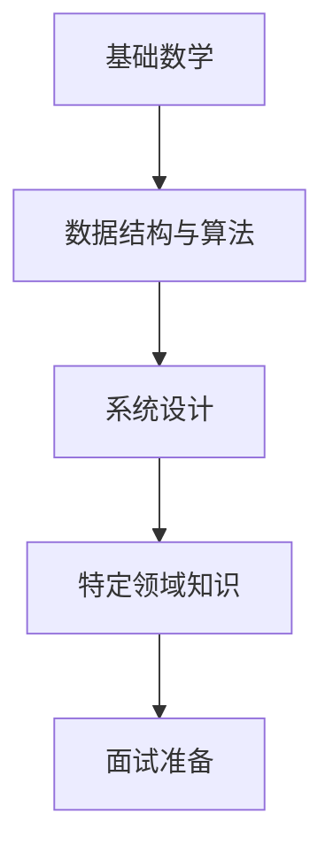
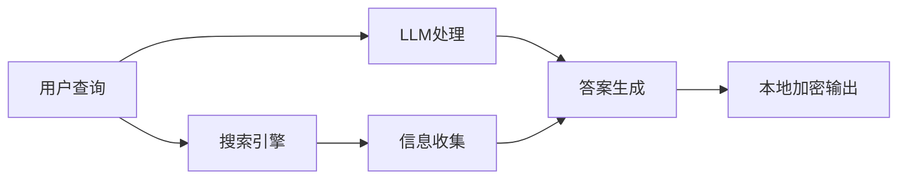

## 今日热点

今日GitHub热榜展现AI智能体与应用的深度融合，从多平台协调到垂直领域专业化，同时本地化部署和工具增强成为技术关注焦点。

---

## 热门项目一览

| 排名 | 项目 | 语言 | 今日 | 总计 | 简介 |
|:---:|------|:----:|------:|-----:|------|
| 1 | [Hmbown/DeepSeek-TUI](https://github.com/Hmbown/DeepSeek-TUI) | Rust | +2,434 | 7,914 | Coding agent for DeepSeek m... |
| 2 | [ruvnet/ruflo](https://github.com/ruvnet/ruflo) | TypeScript | +2,432 | 43,761 | 🌊 The leading agent orchest... |
| 3 | [forrestchang/andrej-karpathy-skills](https://github.com/forrestchang/andrej-karpathy-skills) | Unknown | +2,409 | 114,107 | A single CLAUDE.md file to ... |
| 4 | [msitarzewski/agency-agents](https://github.com/msitarzewski/agency-agents) | Shell | +1,218 | 93,688 | A complete AI agency at you... |
| 5 | [docusealco/docuseal](https://github.com/docusealco/docuseal) | Ruby | +927 | 14,043 | Open source DocuSign altern... |
| 6 | [AIDC-AI/Pixelle-Video](https://github.com/AIDC-AI/Pixelle-Video) | Python | +691 | 11,789 | 🚀 AI 全自动短视频引擎 | AI Fully Au... |
| 7 | [virattt/dexter](https://github.com/virattt/dexter) | TypeScript | +659 | 23,819 | An autonomous agent for dee... |
| 8 | [cocoindex-io/cocoindex](https://github.com/cocoindex-io/cocoindex) | Python | +438 | 8,411 | Incremental engine for long... |
| 9 | [jwasham/coding-interview-university](https://github.com/jwasham/coding-interview-university) | Unknown | +366 | 345,841 | A complete computer science... |
| 10 | [bwya77/vscode-dark-islands](https://github.com/bwya77/vscode-dark-islands) | PowerShell | +321 | 7,889 | VSCode theme based off the ... |
| 11 | [browserbase/skills](https://github.com/browserbase/skills) | JavaScript | +311 | 2,396 | Claude Agent SDK with a web... |
| 12 | [mksglu/context-mode](https://github.com/mksglu/context-mode) | TypeScript | +276 | 13,081 | Context window optimization... |

---

## 趋势洞察

```
┌─────────────────────────────────────────────────────────────────┐
│  AI/ML 工具         ████████████████████████  12 个项目        │
│  其他               ████                      2 个项目        │
│  数据分析             ██                        1 个项目        │
└─────────────────────────────────────────────────────────────────┘
```

---

## 项目深度解读

### 1. Hmbown/DeepSeek-TUI — 终端编程助手

> **一句话总结**：在终端内直接使用 DeepSeek 模型进行编程辅助，提升开发者代码生成效率

#### 价值主张

| 维度 | 说明 |
|------|------|
| **解决痛点** | 终端内直接集成 AI 编程助手，无需切换上下文 |
| **目标用户** | 终端开发者、命令行爱好者、AI 辅助编程用户 |
| **核心亮点** | Rust 高性能实现 + 终端原生集成 + 实时代码生成 + DeepSeek 模型支持 |

#### 技术架构


**技术特色**：
- Rust 高性能实现，保证低资源消耗
- 终端原生集成，无缝融入开发工作流
- 实时代码生成与交互，提升开发效率

#### 热度分析

- 单日增长 2,434 stars，表明项目解决开发者迫切需求，热度飙升
- Fork 数相对较少，可能因为项目处于早期阶段，用户更多在体验而非二次开发

#### 快速上手

```bash
# 安装
cargo install deepseek-tui

# 运行
deepseek-tui
```

#### 注意事项

- 需要确保有可用的 DeepSeek API 访问权限
- 项目许可证未知，商业使用前需确认授权情况
- 建议在使用前检查 API 调用频率限制，避免超额费用


### 2. ruvnet/ruflo — Claude 编排平台

> **一句话总结**：企业级 Claude 智能体编排平台，支持多智能体集群部署与自主工作流协调。

#### 价值主张

| 维度 | 说明 |
|------|------|
| **解决痛点** | 解决多智能体协同工作流的编排与管理难题 |
| **目标用户** | 企业级 AI 应用开发者与对话式系统构建者 |
| **核心亮点** | 企业级架构 + 自学习集群智能 + RAG集成 + Claude原生代码集成 |

#### 技术架构


**技术特色**：
- 基于TypeScript构建，确保类型安全与开发效率
- 支持企业级部署架构，具备高可扩展性
- 集成RAG技术，增强智能体知识获取能力

#### 热度分析

- 项目Star数近4.4万，单日新增超2400，增长势头迅猛
- 作为Claude生态的核心编排工具，在AI智能体领域具有重要生态地位

#### 快速上手

```bash
# 安装ruflo
npm install @ruvnet/ruflo

# 初始化项目
ruflo init

# 启动编排平台
ruflo start
```

#### 注意事项

- 项目许可证信息未知，商业使用前需确认授权条款
- 作为Claude专用平台，与其他AI模型的兼容性可能有限
- Open Issues为0，可能意味着项目使用了不同的问题管理方式或处于特殊阶段


### 3. forrestchang/andrej-karpathy-skills — AI编程指南

> **一句话总结**：基于顶尖AI专家经验提炼的LLM编程最佳实践，优化Claude Code行为规范。

#### 价值主张

| 维度 | 说明 |
|------|------|
| **解决痛点** | 解决LLM编程中常见的陷阱和低效问题，提升代码质量 |
| **目标用户** | 使用Claude Code的AI辅助开发者 |
| **核心亮点** | 权威经验提炼 + 实用编程指南 + 简洁文档结构 |

#### 技术架构

**技术特色**：
- 基于Andrej Karpathy权威经验
- 精简文档聚焦核心编程问题
- 针对Claude Code优化的行为指南

#### 热度分析

- 项目获得11万+星标，24小时内增长2400+，显示开发者高度认可
- 作为单一文件项目，影响力远超复杂项目，说明内容质量极高

#### 快速上手

```bash
# 直接查看CLAUDE.md文件内容
curl https://raw.githubusercontent.com/forrestchang/andrej-karpathy-skills/main/CLAUDE.md
```

#### 注意事项

- 本项目内容针对Claude Code优化，其他AI编程助手可能需要调整
- 文档内容基于Andrej Karpathy的个人经验，可根据实际需求灵活应用
- 项目更新频率较低，建议关注原始来源获取最新见解


### 4. msitarzewski/agency-agents — AI代理工具集

> **一句话总结**：提供多种专业化AI代理工具，覆盖前端开发、社区管理等领域，即插即用提升工作效率。

#### 价值主张

| 维度 | 说明 |
|------|------|
| **解决痛点** | 提供即用型AI代理，无需复杂配置，满足多领域专业需求 |
| **目标用户** | 开发者、内容创作者、社区管理员、营销人员 |
| **核心亮点** | 多样化专业代理 + 即插即用 + 个性化体验 + 高度模块化 |

#### 技术架构


**技术特色**：
- 基于Shell脚本实现，跨平台兼容性好
- 模块化设计，每个代理独立运行
- 通过命令行交互提供直观的用户体验

#### 热度分析

- 项目获得93,688个Star，单日增长1,218，热度极高且增长迅速
- 15,418个Fork表明社区参与度高，用户积极使用和贡献

#### 快速上手

```bash
git clone https://github.com/msitarzewski/agency-agents.git
cd agency-agents
./<agent-name> <arguments>
```

#### 注意事项

- 项目许可证未知，可能存在使用限制
- 需要基本的Shell环境才能运行
- 可能需要配置AI API密钥或其他依赖


### 5. docusealco/docuseal — 电子签名平台

> **一句话总结**：开源电子签名解决方案，提供完整的文档创建、填写和签署功能，可作为DocuSign的免费替代方案。

#### 价值主张

| 维度 | 说明 |
|------|------|
| **解决痛点** | 解决企业使用电子签名的高成本问题，提供免费开源替代方案 |
| **目标用户** | 中小企业、开源社区、需要文档签名的个人用户 |
| **核心亮点** | 开源免费 + 自托管部署 + 完整签名流程 + 文档管理 + API集成 |

#### 技术架构


**技术特色**：
- 基于Ruby on Rails构建的全栈应用架构
- 支持PDF文档的创建、编辑和数字签名功能
- 提供REST API便于与其他系统集成

#### 热度分析

- 项目Star数增长迅速，单日增长超900，表明社区关注度极高
- 作为开源DocuSign替代品，在开源文档管理领域占据重要位置

#### 快速上手

```bash
# 克隆项目
git clone https://github.com/docusealco/docuseal.git

# 安装依赖并启动
cd docuseal
bundle install && rails server
```

#### 注意事项

- 项目许可证信息不明确，使用前需确认许可证条款
- 作为电子签名解决方案，需注意不同国家/地区的电子签名法律合规性
- 自托管部署需要一定的技术运维能力


### 6. AIDC-AI/Pixelle-Video — AI视频生成引擎

> **一句话总结**：AI驱动的全自动短视频生成引擎，实现从文本到视频的智能转换。

#### 价值主张

| 维度 | 说明 |
|------|------|
| **解决痛点** | 解决短视频制作耗时、专业技能要求高的问题 |
| **目标用户** | 内容创作者、营销团队、自媒体运营者 |
| **核心亮点** | AI自动化生成 + 多模态输入 + 智能剪辑 |

#### 技术架构


**技术特色**：
- 基于深度学习的视频内容理解与生成
- 多模态输入融合技术
- 智能场景自动识别与转场

#### 热度分析

- 项目Star数持续快速增长，近期日增近700，显示社区高度关注
- 高Fork/Star比例表明项目具有较强实用性和可扩展性

#### 快速上手

```bash
# 克隆项目
git clone https://github.com/AIDC-AI/Pixelle-Video.git
# 安装依赖
pip install -r requirements.txt
# 运行示例
python examples/basic_generation.py
```

#### 注意事项

- 需要确保系统配置满足AI模型运行要求
- 可能需要GPU加速以获得最佳性能
- 注意遵守项目使用许可，特别是商用场景


### 7. virattt/dexter — [金融研究代理]

> **一句话总结**：AI驱动的自主金融研究代理，自动化深度金融数据分析与决策支持。

#### 价值主张

| 维度 | 说明 |
|------|------|
| **解决痛点** | 金融研究耗时费力，信息过载，需要自动化深度分析工具 |
| **目标用户** | 金融分析师、投资机构、量化交易者、研究团队 |
| **核心亮点** | AI自主研究能力 + 深度金融数据分析 + 自动化报告生成 + 多源信息整合 |

#### 技术架构


**技术特色**：
- 基于TypeScript构建，保证代码质量和类型安全
- AI驱动的自主研究能力，减少人工干预
- 多源金融数据整合与分析能力

#### 热度分析

- 项目获得23,819 stars且持续增长(+659 today)，表明在金融科技领域有显著影响力
- Fork数2,901，说明开发者社区活跃，参与度高
- 0个Open Issues，表明项目维护良好，问题处理及时

#### 快速上手

```bash
# 克隆项目
git clone https://github.com/virattt/dexter.git
# 安装依赖
npm install
# 启动服务
npm start
```

#### 注意事项

- 项目许可协议未知，商业使用前需确认授权情况
- 作为金融研究工具，需注意数据安全与合规要求
- AI生成的投资建议仅供参考，实际投资决策需谨慎


### 8. cocoindex-io/cocoindex — 长周期智能引擎

> **一句话总结**：为长期任务提供增量式智能决策的代理引擎，优化长周期规划效率。

#### 价值主张

| 维度 | 说明 |
|------|------|
| **解决痛点** | 传统长期规划系统计算效率低下，无法适应动态环境变化 |
| **目标用户** | AI研究人员、智能系统开发者、长期规划应用工程师 |
| **核心亮点** | 增量处理能力 + 长期任务优化 + 高效决策支持 |

#### 技术架构


**技术特色**：
- 基于增量学习的动态决策机制
- 长时间跨度任务的状态保持能力
- 高效的资源利用和计算优化

#### 热度分析

- 项目近期增长迅猛，单日新增438个stars，显示社区高度关注
- 作为AI代理系统工具，在当前AI快速发展背景下具有重要生态价值

#### 快速上手

```bash
# 安装项目
pip install cocoindex

# 基本使用示例
from cocoindex import LongHorizonAgent
agent = LongHorizonAgent()
agent.initialize()
agent.run_task(long_term_objective)
```

#### 注意事项

- 项目许可证信息不明确，使用前需确认开源协议
- 项目描述简略，建议查看README获取更详细的使用文档
- 作为AI代理系统，可能需要一定的AI/ML背景知识才能充分利用


### 9. jwasham/coding-interview-university — 计算机科学学习路线图

> **一句话总结**：系统化的计算机科学学习计划，全面覆盖技术面试所需的核心知识点。

#### 价值主张

| 维度 | 说明 |
|------|------|
| **解决痛点** | 解决计算机科学知识零散、缺乏系统学习路径的痛点 |
| **目标用户** | 准备技术面试的求职者、CS自学者、软件开发转行者 |
| **核心亮点** | 完整知识体系 + 结构化学习路径 + 实用面试资源 + 社区驱动 + 持续更新 |

#### 技术架构



**技术特色**：
- 结构化学习路径设计，知识点间逻辑关系清晰
- 资源分类与标签系统完善，便于按需查找
- 社区贡献机制健全，内容持续更新迭代

#### 热度分析
- 项目Star数超34万，Fork数超8万，在技术社区中具有极高认可度，持续稳定增长
- 作为学习资源类项目，其高关注度反映了技术社区对系统化面试准备的强烈需求

#### 快速上手

```bash
# 克隆项目到本地
git clone https://github.com/jwasham/coding-interview-university.git

# 浏览README.md获取学习路径
cd coding-interview-university && cat README.md

# 根据目录结构选择感兴趣的主题进行学习
ls -la
```

#### 注意事项
- 该项目内容量大，学习周期长，需要制定合理的学习计划
- 部分资源链接可能已过时，需要自行寻找替代资源
- 学习应结合实践，仅阅读理论不足以应对实际面试
- 根据个人目标职位调整学习重点，不必完全覆盖所有内容


### 10. bwya77/vscode-dark-islands — [主题设计]

> **一句话总结**：融合easemate与Jetbrains风格的VSCode暗色主题，提供优雅的编程视觉体验。

#### 价值主张

| 维度 | 说明 |
|------|------|
| **解决痛点** | 为开发者提供减少视觉疲劳的高对比度暗色主题 |
| **目标用户** | 长时间编程的VSCode用户，偏好暗色界面的开发者 |
| **核心亮点** | 高对比度 + 语法突出 + 舒适阅读体验 |

#### 技术架构


**技术特色**：
- 采用JSON格式定义主题颜色，便于维护和定制
- 结合easemate和Jetbrains主题的优点，平衡对比度和舒适度
- 精心设计的语法高亮规则，提高代码可读性

#### 热度分析

- 项目获得近8k星，近期增长迅速，表明主题获得开发者广泛认可
- 零开放问题，反映主题已成熟稳定，用户满意度高

#### 快速上手

```bash
# 在VSCode中安装主题
# 1. 打开VSCode扩展市场
# 2. 搜索"Dark Islands"
# 3. 点击安装并应用
```

#### 注意事项

- 主题可能对某些特定编程语言的语法高亮支持有限
- 个人视觉偏好不同，建议先预览再决定是否长期使用


### 11. browserbase/skills — [Claude 浏览增强]

> **一句话总结**：为 Claude AI Agent 提供网页浏览能力的 SDK，扩展其互联网交互能力。

#### 价值主张

| 维度 | 说明 |
|------|------|
| **解决痛点** | 解决 Claude Agent 无法直接浏览和交互网页的问题 |
| **目标用户** | 开发 Claude AI 应用的开发者，需要网页交互功能的 AI 系统集成者 |
| **核心亮点** | 基于 Browserbase 的浏览器自动化能力 + Claude Agent 无缝集成 + 支持复杂网页交互 |

#### 技术架构


**技术特色**：
- 利用 Browserbase 的浏览器自动化技术实现网页交互
- 封装为 Claude Agent 的技能模块，便于调用
- 支持复杂的网页操作和内容提取

#### 热度分析

- 项目近期增长迅速，单日新增 311 stars，表明社区关注度持续上升
- 相对较低的 fork 数(153)说明项目主要作为依赖使用而非二次开发

#### 快速上手

```bash
# 安装 SDK
npm install @browserbase/skills

# 初始化浏览器会话
const { createBrowser } = require('@browserbase/skills');
const browser = await createBrowser();

# 在 Claude Agent 中使用
const response = await agent.useSkill('browse', { url: 'https://example.com' });
```

#### 注意事项

- 需要配置 Browserbase API 密钥才能正常使用
- 可能存在使用次数限制，需查看官方定价计划
- 网页渲染和交互可能存在延迟，不适合实时性要求高的场景


### 12. mksglu/context-mode — AI上下文优化

> **一句话总结**：通过沙盒技术优化AI编程代理的上下文窗口，显著减少资源消耗，提升效率。

#### 价值主张

| 维度 | 说明 |
|------|------|
| **解决痛点** | AI编程代理上下文窗口过载导致效率低下 |
| **目标用户** | AI编程工具开发者、大型代码项目团队 |
| **核心亮点** | 沙盒隔离工具输出 + 98%上下文减少 + 跨平台支持 |

#### 技术架构


**技术特色**：
- 沙盒技术隔离工具输出，防止上下文污染
- 98%的上下文使用量减少，大幅提升效率
- 支持14个不同平台，通用性强

#### 热度分析

- 项目获得13k+星标，单日增长276，热度上升明显
- 零开放问题，表明项目成熟度高，维护良好

#### 快速上手

```bash
# 安装
npm install @mksglu/context-mode

# 使用
import { ContextMode } from '@mksglu/context-mode';
const cm = new ContextMode();
cm.initialize('platform-name');
cm.optimize(context);
```

#### 注意事项

- 项目许可证未知，商业使用前需确认授权情况
- 零开放问题可能意味着问题反馈渠道不够开放
- 需要确认支持的14个平台具体是哪些


### 13. Arindam200/awesome-ai-apps — AI应用集锦

> **一句话总结**：精心整理的AI应用案例库，展示RAG、智能体与工作流等前沿AI实践。

#### 价值主张

| 维度 | 说明 |
|------|------|
| **解决痛点** | 整合分散的AI应用案例，降低开发者实践门槛 |
| **目标用户** | AI开发者、研究人员及企业技术决策者 |
| **核心亮点** | 实用案例丰富 + 分类清晰 + 持续更新 |

#### 技术架构

**技术特色**：
- 聚焦前沿AI应用场景
- 覆盖RAG、agents等多种技术范式
- 提供可直接参考的实践案例

#### 热度分析

- 项目获得11,359星，日增211星，社区认可度高
- 作为AI应用案例库，处于开发者学习与实践的关键节点

#### 快速上手

```bash
# 克隆项目
git clone https://github.com/Arindam200/awesome-ai-apps.git

# 查看README获取完整项目列表
cat awesome-ai-apps/README.md
```

#### 注意事项

- 许可证信息不明确，商业使用前需确认授权
- 部分项目可能依赖特定API或服务，使用前需评估成本


### 14. LearningCircuit/local-deep-research — 本地深度研究

> **一句话总结**：本地化深度研究助手，支持多种LLM和搜索引擎，提供高准确率答案与隐私保护。

#### 价值主张

| 维度 | 说明 |
|------|------|
| **解决痛点** | 解决本地LLM研究工具局限，提供统一平台支持多种模型与搜索源 |
| **目标用户** | 研究人员、数据科学家、需要本地化AI处理的专业人士 |
| **核心亮点** | 高准确率答案 + 多LLM支持 + 多搜索引擎集成 + 本地加密处理 |

#### 技术架构



**技术特色**：
- 混合架构结合多种LLM和搜索引擎
- 本地化处理保障数据隐私安全
- 高准确率答案生成技术

#### 热度分析

- 项目获得5,185个Star，单日增长197，显示出快速增长态势
- Fork数481，表明社区参与度较高，用户愿意基于此项目进行二次开发

#### 快速上手

```bash
# 克隆项目
git clone https://github.com/LearningCircuit/local-deep-research.git

# 安装依赖
pip install -r requirements.txt
```

#### 注意事项

- 项目许可证信息未知，使用前需确认开源协议
- 本地运行需要一定硬件资源，特别是使用大型LLM模型时
- 项目文档可能需要进一步完善，以降低用户使用门槛


### 15. PriorLabs/TabPFN — 表格数据基础模型

> **一句话总结**：TabPFN是专为表格数据设计的高性能基础模型，无需训练即可实现优秀预测性能。

#### 价值主张

| 维度 | 说明 |
|------|------|
| **解决痛点** | 解决表格数据建模需要大量标注数据和训练时间的问题 |
| **目标用户** | 数据科学家、机器学习工程师、表格数据分析从业者 |
| **核心亮点** | 零样本学习能力 + 高性能预测 + 快速部署 + 无需训练调参 |

#### 技术架构


**技术特色**：
- 结合了Transformer架构与表格数据特性
- 集成先验知识提升小样本学习能力
- 采用高效的推理算法降低计算复杂度

#### 热度分析

- 项目Star数超过6,300，近期增长稳定，表明在表格数据建模领域受到广泛关注
- 零Issues状态反映项目成熟度高，社区反馈积极，生态位置良好

#### 快速上手

```bash
# 安装TabPFN
pip install tabpfn

# 基本使用示例
from tabpfn import TabPFNClassifier
classifier = TabPFNClassifier(device='cpu')
classifier.fit(X_train, y_train)
predictions = classifier.predict(X_test)
```

#### 注意事项

- 模型在大型数据集上可能需要较多内存资源
- 对于特定领域数据，可能需要进一步微调以获得最佳性能


## 今日推荐

| 主题 | 推荐项目 | 亮点 |
|------|----------|------|
| 今日最热 | [Hmbown/DeepSeek-TUI](https://github.com/Hmbown/DeepSeek-TUI) | Coding agent for ... |
| 值得关注 | [ruvnet/ruflo](https://github.com/ruvnet/ruflo) | 🌊 The leading age... |
| 快速上手 | [forrestchang/andrej-karpathy-skills](https://github.com/forrestchang/andrej-karpathy-skills) | A single CLAUDE.m... |
| 长期潜力 | [msitarzewski/agency-agents](https://github.com/msitarzewski/agency-agents) | A complete AI age... |

---

<div align="center">

*Generated on 2026-05-06 | Powered by GitHub Trending Reporter*

</div>