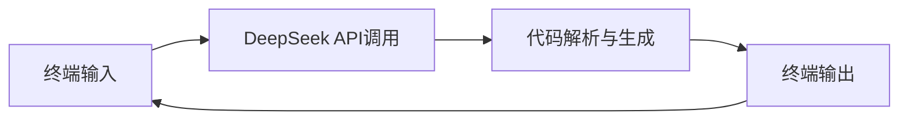
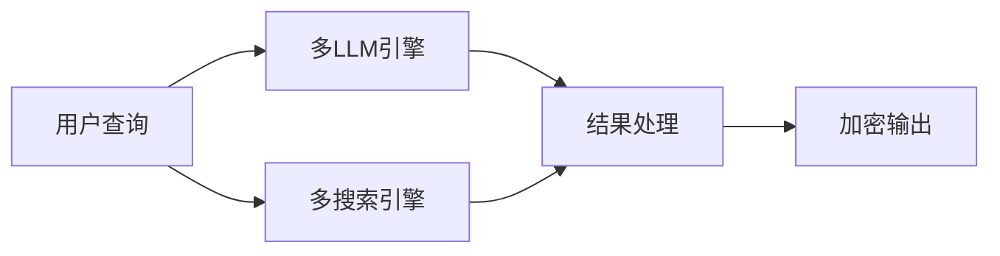
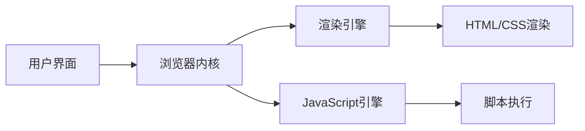

## 今日热点

今日GitHub热榜主要聚焦AI代理生态系统的蓬勃发展，尤其是面向特定领域（编程、金融）的专业化代理工具，以及强调本地化运行和隐私保护的AI解决方案。

---

## 热门项目一览

| 排名 | 项目 | 语言 | 今日 | 总计 | 简介 |
|:---:|------|:----:|------:|-----:|------|
| 1 | [Hmbown/DeepSeek-TUI](https://github.com/Hmbown/DeepSeek-TUI) | Rust | +6,175 | 14,342 | Coding agent for DeepSeek m... |
| 2 | [ruvnet/ruflo](https://github.com/ruvnet/ruflo) | TypeScript | +2,192 | 45,314 | 🌊 The leading agent orchest... |
| 3 | [D4Vinci/Scrapling](https://github.com/D4Vinci/Scrapling) | Python | +1,125 | 46,346 | 🕷️ An adaptive Web Scraping... |
| 4 | [addyosmani/agent-skills](https://github.com/addyosmani/agent-skills) | Shell | +800 | 30,686 | Production-grade engineerin... |
| 5 | [docusealco/docuseal](https://github.com/docusealco/docuseal) | Ruby | +774 | 14,928 | Open source DocuSign altern... |
| 6 | [virattt/dexter](https://github.com/virattt/dexter) | TypeScript | +666 | 24,383 | An autonomous agent for dee... |
| 7 | [anthropics/financial-services](https://github.com/anthropics/financial-services) | Python | +641 | 9,204 | No description |
| 8 | [LearningCircuit/local-deep-research](https://github.com/LearningCircuit/local-deep-research) | Python | +532 | 5,685 | ~95% on SimpleQA (e.g. Qwen... |
| 9 | [bwya77/vscode-dark-islands](https://github.com/bwya77/vscode-dark-islands) | PowerShell | +503 | 8,222 | VSCode theme based off the ... |
| 10 | [bytedance/deer-flow](https://github.com/bytedance/deer-flow) | Python | +337 | 65,565 | An open-source long-horizon... |
| 11 | [shiyu-coder/Kronos](https://github.com/shiyu-coder/Kronos) | Python | +234 | 23,215 | Kronos: A Foundation Model ... |
| 12 | [InsForge/InsForge](https://github.com/InsForge/InsForge) | TypeScript | +230 | 8,479 | InsForge is a Postgres-base... |

---

## 趋势洞察

```
┌─────────────────────────────────────────────────────────────────┐
│  AI/ML 工具         ████████████████████████  9 个项目        │
│  其他               ██████████                4 个项目        │
│  开发框架             ██                        1 个项目        │
│  数据分析             ██                        1 个项目        │
└─────────────────────────────────────────────────────────────────┘
```

---

## 项目深度解读

### 1. Hmbown/DeepSeek-TUI — [终端AI编码]

> **一句话总结**：基于DeepSeek模型的终端内AI编码助手，提供实时代码生成与优化功能

#### 价值主张

| 维度 | 说明 |
|------|------|
| **解决痛点** | 解决开发者需要频繁切换IDE与AI工具的效率问题 |
| **目标用户** | Rust开发者、AI辅助编程爱好者、终端用户 |
| **核心亮点** | 终端内集成 + AI代码生成 + 实时交互 + 轻量级部署 |

#### 技术架构



**技术特色**：
- 基于Rust构建的高性能终端应用
- 集成DeepSeek大语言模型API
- 实现终端内的实时代码生成与优化
- 轻量级设计，无需额外图形界面

#### 热度分析

- 项目近期Star激增一日超过6000，显示社区对其AI辅助编程功能的高度关注
- 作为开源AI工具，在当前AI编程助手热潮中具有明显竞争优势

#### 快速上手

```bash
# 安装依赖
cargo install deepseek-tui

# 启动应用
deepseek-tui
```

#### 注意事项

- 需要有效的DeepSeek API密钥才能使用
- 终端界面可能对初学者不够直观
- 需要稳定的网络连接以调用DeepSeek API


### 2. ruvnet/ruflo — AI编排平台

> **一句话总结**：Claude智能体编排平台，实现多代理协作与自主工作流，构建企业级对话AI系统

#### 价值主张

| 维度 | 说明 |
|------|------|
| **解决痛点** | 企业级AI应用开发中，多智能体协作与自主工作流编排的复杂性挑战 |
| **目标用户** | 企业AI开发团队、对话式AI系统构建者、智能体应用开发者 |
| **核心亮点** | 企业级架构 + 自学习群体智能 + RAG集成 + Claude Code原生集成 |

#### 技术架构


**技术特色**：
- 企业级多智能体协同架构设计
- 自学习群体智能算法实现
- RAG与Claude深度集成技术

#### 热度分析

- 项目获得45,314个Star，近期增长迅速，单日新增2,192个Star
- 作为AI编排领域的领先平台，社区活跃度高，企业级应用潜力大

#### 快速上手

```bash
# 安装ruflo
npm install ruflo

# 初始化项目
ruflo init my-agent-project

# 启动开发服务器
ruflo dev
```

#### 注意事项

- 需要Claude API访问权限
- 企业级部署需要考虑资源规划
- 自定义智能体需要熟悉Claude提示工程


### 3. D4Vinci/Scrapling — 自适应爬虫框架

> **一句话总结**：一个自适应网页抓取框架，可处理从简单请求到大规模爬取的全流程任务。

#### 价值主张

| 维度 | 说明 |
|------|------|
| **解决痛点** | 解决传统爬虫难以应对动态内容和反爬机制的问题 |
| **目标用户** | 需要从网页提取数据的开发者和数据分析师 |
| **核心亮点** | 自适应处理不同网站结构 + 从简单请求到大规模爬取的全流程支持 + 内置反反爬机制 |

#### 技术架构


**技术特色**：
- 自适应解析不同网页结构和内容类型
- 内置多种反反爬策略，包括IP轮换和请求头伪装
- 支持分布式爬取和大规模数据采集

#### 热度分析

- 项目获得超过4.6万星，近期单日新增超1千星，增长迅速，表明社区认可度高
- 零开放问题表明项目维护良好，已形成稳定的用户群体和生态系统

#### 快速上手

```bash
# 安装
pip install scrapling

# 基本使用
from scrapling import Scrapling
scraper = Scrapling('https://example.com')
data = scraper.get()
```

#### 注意事项

- 注意遵守目标网站的robots.txt和使用条款
- 考虑设置适当的请求延迟以避免对目标网站造成过大压力
- 使用代理池和随机请求头以降低被封禁的风险


### 4. addyosmani/agent-skills — AI工程技能库

> **一句话总结**：为AI编码代理提供生产级工程技能的高质量提示词和实践指南。

#### 价值主张

| 维度 | 说明 |
|------|------|
| **解决痛点** | AI编码代理缺乏工程规范，导致生成代码质量参差不齐 |
| **目标用户** | AI编码工具开发者、AI工程团队、提升AI代码质量的开发者 |
| **核心亮点** | 生产级提示词 + 多场景覆盖 + 持续更新的技能库 |

#### 技术架构


**技术特色**：
- 基于Shell脚本实现轻量级部署
- 结构化提示词组织方式
- 模块化技能便于扩展

#### 热度分析

- 项目近期增长迅速，单日新增800+星，显示社区对AI工程技能需求旺盛
- 高Star/Fork比例表明项目实用价值高，被广泛采纳和二次开发

#### 快速上手

```bash
# 克隆项目
git clone https://github.com/addyosmani/agent-skills.git
# 查看可用技能
cd agent-skills && ls
# 应用特定技能到AI编码环境
source apply-skill.sh <skill-name>
```

#### 注意事项

- 项目许可证不明确，使用前需确认许可条款
- 需要根据具体AI工具调整提示词以获得最佳效果
- 定期更新以获取最新工程实践和AI优化技巧


### 5. docusealco/docuseal — 电子签名平台

> **一句话总结**：开源DocuSign替代方案，提供完整的文档创建、填写和电子签名功能。

#### 价值主张

| 维度 | 说明 |
|------|------|
| **解决痛点** | 提供免费开源的电子签名解决方案，替代昂贵的商业软件 |
| **目标用户** | 中小企业、个人用户、需要文档签名的组织 |
| **核心亮点** | 完全开源 + 本地部署 + 多格式支持 + 用户友好界面 |

#### 技术架构


**技术特色**：
- 基于Ruby on Rails构建，提供RESTful API
- 支持Docker容器化部署，简化环境配置
- 采用PostgreSQL作为主数据库，保证数据可靠性

#### 热度分析

- 项目Star数近1.5万，单日增长700+，表明项目受到广泛关注
- Fork数超1300，显示社区活跃度高，有较强二次开发意愿

#### 快速上手

```bash
# 克隆项目
git clone https://github.com/docusealco/docuseal.git

# 使用Docker运行
docker-compose up -d
```

#### 注意事项

- 许可证信息不明确，使用前需确认开源协议
- 作为DocuSign替代方案，可能需要评估其安全性和合规性是否符合企业需求
- 项目可能需要一定的技术知识来部署和维护


### 6. virattt/dexter — 金融研究智能体

> **一句话总结**：基于AI的自主金融研究智能体，提供深度市场分析和投资决策支持

#### 价值主张

| 维度 | 说明 |
|------|------|
| **解决痛点** | 金融研究数据量大、分析复杂，需要自动化处理与深度洞察 |
| **目标用户** | 金融分析师、投资机构、个人投资者 |
| **核心亮点** | AI自主分析 + 深度金融研究 + 自动化决策支持 + 实时市场洞察 |

#### 技术架构


**技术特色**：
- TypeScript开发，确保代码质量与类型安全
- AI驱动的自主研究能力，减少人工干预
- 多维度数据分析，提供全面市场视角

#### 热度分析

- 高关注度且持续增长，24K+ stars表明项目获得广泛认可
- Fork/Star比例适中，社区参与度高，项目活跃度良好

#### 快速上手

```bash
# 克隆项目
git clone https://github.com/virattt/dexter.git
cd dexter

# 安装依赖并运行
npm install
npm start
```

#### 注意事项

- 本工具提供的投资建议仅供参考，实际投资需谨慎决策
- 使用前需确保数据源准确可靠，避免基于错误信息做出判断
- 项目许可证信息不明确，使用前建议确认授权条款


### 7. anthropics/financial-services — 金融AI服务

> **一句话总结**：将Anthropic的AI能力应用于金融领域的开源解决方案。

#### 价值主张

| 维度 | 说明 |
|------|------|
| **解决痛点** | 传统金融服务中AI应用复杂度高、安全性不足的问题 |
| **目标用户** | 金融机构、金融科技公司和需要AI赋能的金融从业者 |
| **核心亮点** | 金融领域专用模型 + 高安全性设计 + 合规性框架 + API集成 + 隐私保护 |

#### 技术架构


**技术特色**：
- 基于Anthropic Claude模型的金融领域专用微调
- 金融数据隐私保护与合规性处理机制
- 安全的API设计与认证框架

#### 热度分析

- 项目呈现高速增长趋势，近期日均增长数百stars，显示市场对AI金融解决方案的强烈需求
- 作为Anthropic官方金融项目，在AI金融应用领域占据领先地位，吸引大量开发者关注

#### 快速上手

```bash
# 安装依赖
pip install -r requirements.txt

# 运行示例
python examples/basic_financial_analysis.py
```

#### 注意事项

- 项目可能需要Anthropic API密钥才能完全运行
- 金融数据敏感，使用时需注意合规性和隐私保护
- 建议在生产环境使用前进行全面测试


### 8. LearningCircuit/local-deep-research — 本地研究助手

> **一句话总结**：本地化大模型深度研究工具，支持多LLM与学术搜索，数据安全加密

#### 价值主张

| 维度 | 说明 |
|------|------|
| **解决痛点** | 解决本地大模型研究效率低、数据安全与多源信息整合难题 |
| **目标用户** | 研究人员、AI开发者、学术工作者 |
| **核心亮点** | 本地部署 + 多LLM支持 + 学术搜索集成 + 数据加密 + 高准确率 |

#### 技术架构



**技术特色**：
- 支持本地与云端LLM无缝切换
- 多源信息智能整合与处理
- 端到端数据加密保障安全

#### 热度分析

- 项目近期增长迅速，单日新增532星，显示社区高度关注
- 零未解决问题表明项目维护良好，用户反馈及时响应

#### 快速上手

```bash
# 克隆仓库
git clone https://github.com/LearningCircuit/local-deep-research.git
cd local-deep-research

# 安装依赖
pip install -r requirements.txt

# 运行程序
python main.py
```

#### 注意事项

- 需要足够计算资源运行大模型（如3090级别显卡）
- 本地部署可能需要配置环境变量和模型路径
- 数据加密功能需要正确配置密钥管理


### 9. bwya77/vscode-dark-islands — VS Code 主题重构

> **一句话总结**：融合 easemate IDE 和 Jetbrains 美学的 VS Code 深色主题，提供舒适的编程视觉体验。

#### 价值主张

| 维度 | 说明 |
|------|------|
| **解决痛点** | 减少长时间编程的视觉疲劳，同时保持代码高可读性 |
| **目标用户** | 追求舒适视觉体验的 VS Code 深度用户 |
| **核心亮点** | 多种 IDE 美学融合 + 精心调校的色彩对比 + 优化的语法高亮 |

#### 技术架构


**技术特色**：
- 基于 PowerShell 开发，便于 Windows 环境部署
- 融合多个流行 IDE 的视觉元素
- 精心优化的色彩方案减少眼睛疲劳

#### 热度分析
- 项目获得8200+星且单日增长500+，表明主题设计获得开发者广泛认可
- 在 VS Code 主题生态中占据重要位置，特别受长时间编码的开发者欢迎

#### 快速上手

```bash
# 克隆仓库
git clone https://github.com/bwya77/vscode-dark-islands.git
# 进入目录
cd vscode-dark-islands
# 运行安装脚本
./install.ps1
```

#### 注意事项
- 主题可能需要 VS Code 的最新版本才能获得最佳体验
- 不同编程语言的语法高亮效果可能存在差异
- 在某些低亮度环境下可能需要额外调整显示器亮度以获得最佳体验


### 10. bytedance/deer-flow — 长期任务智能体

> **一句话总结**：字节开源的长期任务智能体框架，通过多组件协作处理复杂多步骤任务。

#### 价值主张

| 维度 | 说明 |
|------|------|
| **解决痛点** | 解决AI代理处理长期复杂任务的局限性 |
| **目标用户** | AI研究人员和复杂任务开发者 |
| **核心亮点** | 沙箱环境 + 记忆系统 + 多代理协作 |

#### 技术架构


**技术特色**：
- 长期任务处理能力
- 多代理协作架构
- 沙箱安全执行环境
- 记忆系统支持连续任务
- 消息网关组件通信

#### 热度分析

- 项目Star数超过65,000，且每日新增300+，表明项目受关注度高，增长迅速
- 作为字节跳动开源项目，在AI代理领域具有显著影响力，社区活跃度极高

#### 快速上手

```bash
# 克隆仓库
git clone https://github.com/bytedance/deer-flow.git
# 安装依赖
pip install -r requirements.txt
# 运行示例
python examples/basic_task.py
```

#### 注意事项

- 项目可能需要较高的计算资源，特别是处理长期任务时
- 作为字节跳动项目，可能需要注意数据隐私和使用条款
- 项目文档可能不够完善，需要参考源代码理解实现细节


### 11. shiyu-coder/Kronos — [金融语言模型]

> **一句话总结**：Kronos是专为金融领域打造的基础大模型，精通金融语言与市场分析。

#### 价值主张

| 维度 | 说明 |
|------|------|
| **解决痛点** | 通用大模型缺乏金融专业知识，难以准确理解和生成金融内容 |
| **目标用户** | 金融分析师、量化交易员、投资机构、金融研究团队 |
| **核心亮点** | 金融专业语料预训练 + 市场数据理解能力 + 多任务金融应用支持 |

#### 技术架构


**技术特色**：
- 金融专业语料库预训练，掌握金融术语与市场概念
- 支持多种金融任务，如市场分析、财报解读、风险评估
- 集成金融市场数据，增强预测与决策能力

#### 热度分析

- 项目Star数超2.3万，单日增长234星，显示金融AI领域需求旺盛
- 高星低Issues表明项目稳定且实用，处于金融AI模型生态前沿位置

#### 快速上手

```bash
# 安装依赖
pip install kronos-ai

# 基本使用示例
from kronos import KronosModel
model = KronosModel()
response = model.generate("分析最近的市场趋势")
print(response)
```

#### 注意事项

- 需要金融领域专业知识才能充分利用模型能力
- 模型输出需要人工验证，不可直接作为投资建议
- 可能需要GPU资源才能高效运行大模型


### 12. InsForge/InsForge — AI编码后端

> **一句话总结**：专为AI编码代理设计的全功能Postgres后端平台，提供认证、存储与AI网关一站式服务。

#### 价值主张

| 维度 | 说明 |
|------|------|
| **解决痛点** | 为AI编码代理提供完整后端基础设施，避免重复开发 |
| **目标用户** | AI编码工具开发者、智能IDE构建者、AI辅助编程平台 |
| **核心亮点** | Postgres一体化架构 + 完整认证系统 + AI网关集成 + 云原生部署 |

#### 技术架构


**技术特色**：
- 基于Postgres的一体化数据存储与处理架构
- 内置认证与安全系统，专为AI代理优化
- 云原生设计，支持弹性计算与托管

#### 热度分析

- 项目热度持续上升，单日增长230 stars，表明社区高度关注
- 作为AI编码基础设施项目，在当前AI辅助编程热潮中占据重要生态位置

#### 快速上手

```bash
# 克隆项目
git clone https://github.com/InsForge/InsForge.git

# 安装依赖
npm install

# 启动开发服务器
npm run dev
```

#### 注意事项

- 项目许可证未知，商业使用前需确认授权条款
- 作为基础设施项目，可能需要一定的PostgreSQL和云服务知识才能充分利用


### 13. PriorLabs/TabPFN — 表格数据基础模型

> **一句话总结**：TabPFN是一种专为表格数据设计的基础模型，提供高精度预测且无需复杂特征工程。

#### 价值主张

| 维度 | 说明 |
|------|------|
| **解决痛点** | 表格数据建模需要大量特征工程和超参数调整，传统方法效率低下 |
| **目标用户** | 数据科学家、机器学习工程师、研究人员 |
| **核心亮点** | 基于Transformer架构 + 预训练迁移能力 + 快速推理 + 高准确率 + 无需特征工程 |

#### 技术架构


**技术特色**：
- 基于Transformer架构的表格数据建模技术
- 结合预训练和微调的迁移学习策略
- 高效的注意力机制处理表格特征间关系

#### 热度分析

- 项目Star数增长迅速，单日新增218个Star，表明社区关注度持续攀升
- Fork数适中，表明项目在实用性和可扩展性方面有一定价值，但尚未达到大规模复制程度

#### 快速上手

```bash
# 安装TabPFN
pip install tabpfn

# 基本使用示例
from tabpfn import TabPFNClassifier
clf = TabPFNClassifier()
clf.fit(X_train, y_train)
predictions = clf.predict(X_test)
```

#### 注意事项

- 模型可能对数据分布有一定假设，实际应用前需验证数据适用性
- 作为基础模型，可能需要在特定任务上进行微调以获得最佳性能
- 注意模型的计算资源需求，特别是对于大规模数据集


### 14. cheahjs/free-llm-api-resources — 免费LLM资源库

> **一句话总结**：为开发者提供全面且结构化的免费大语言模型API资源清单，降低AI应用开发门槛。

#### 价值主张

| 维度 | 说明 |
|------|------|
| **解决痛点** | 解决开发者寻找和使用免费LLM API资源困难的问题 |
| **目标用户** | AI开发者、研究人员和需要测试LLM应用的开发者 |
| **核心亮点** | 资源丰富 + 实时更新 + 分类清晰 + 使用说明详细 |

#### 技术架构


**技术特色**：
- 使用Markdown结构化组织资源信息
- 提供统一的API调用格式说明
- 包含详细的使用限制和参数说明

#### 热度分析

- 项目Star数超2万且每日稳定增长，表明社区对免费LLM资源需求旺盛
- 作为AI开发基础设施项目，在当前LLM热潮中具有重要生态位置

#### 快速上手

```bash
# 克隆项目
git clone https://github.com/cheahjs/free-llm-api-resources.git

# 查看README获取最新资源列表
cat free-llm-api-resources/README.md
```

#### 注意事项

- 部分免费API可能有调用次数限制或需要申请
- 资源可能随时变更，建议关注项目更新
- 使用前请仔细阅读各API的使用条款和政策


### 15. LadybirdBrowser/ladybird — 独立浏览器引擎

> **一句话总结**：Ladybird是一个完全自主开发的浏览器引擎，旨在提供独立、安全且尊重用户隐私的浏览体验。

#### 价值主张

| 维度 | 说明 |
|------|------|
| **解决痛点** | 突破现有浏览器引擎垄断，打造真正独立、无商业利益驱动的浏览体验 |
| **目标用户** | 注重隐私的开发者、技术爱好者及寻求浏览器替代方案的用户 |
| **核心亮点** | 完全自主引擎 + 高性能渲染 + 强隐私保护 + 跨平台支持 + 模块化设计 |

#### 技术架构



**技术特色**：
- 基于现代C++开发，注重性能和内存安全
- 完全自主的渲染引擎，不依赖现有代码库
- 模块化架构设计，便于扩展和维护

#### 热度分析

- 项目Star数超6万，近期稳定增长，显示社区高度关注和认可
- 作为独立浏览器引擎，在开源浏览器生态中具有重要地位，填补市场空白

#### 快速上手

```bash
# 克隆仓库
git clone https://github.com/LadybirdBrowser/ladybird.git

# 构建项目
cd ladybird
./build.sh
```

#### 注意事项

- 项目仍处于早期开发阶段，功能可能不完整
- 部分平台可能存在兼容性问题
- 文档和社区支持可能还在完善中


## 今日推荐

| 主题 | 推荐项目 | 亮点 |
|------|----------|------|
| 今日最热 | [Hmbown/DeepSeek-TUI](https://github.com/Hmbown/DeepSeek-TUI) | Coding agent for ... |
| 值得关注 | [ruvnet/ruflo](https://github.com/ruvnet/ruflo) | 🌊 The leading age... |
| 快速上手 | [D4Vinci/Scrapling](https://github.com/D4Vinci/Scrapling) | 🕷️ An adaptive We... |
| 长期潜力 | [addyosmani/agent-skills](https://github.com/addyosmani/agent-skills) | Production-grade ... |

---

<div align="center">

*Generated on 2026-05-07 | Powered by GitHub Trending Reporter*

</div>