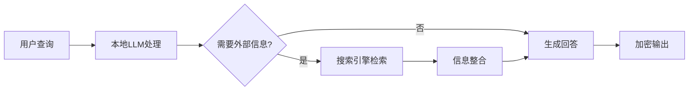
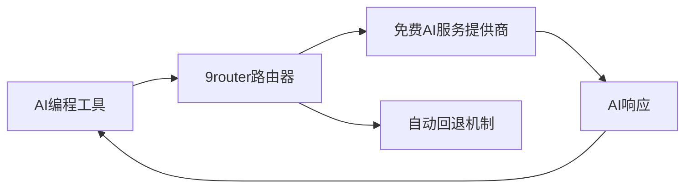

## 今日热点

AI代理与本地化应用成为今日GitHub绝对焦点，多种编码助手框架和本地部署的AI工具获得爆发式增长，反映开发者对自主可控AI解决方案的迫切需求。

---

## 热门项目一览

| 排名 | 项目 | 语言 | 今日 | 总计 | 简介 |
|:---:|------|:----:|------:|-----:|------|
| 1 | [Hmbown/DeepSeek-TUI](https://github.com/Hmbown/DeepSeek-TUI) | Rust | +5,799 | 19,127 | Coding agent for DeepSeek m... |
| 2 | [addyosmani/agent-skills](https://github.com/addyosmani/agent-skills) | Shell | +3,062 | 33,107 | Production-grade engineerin... |
| 3 | [anthropics/financial-services](https://github.com/anthropics/financial-services) | Python | +1,343 | 11,934 | No description |
| 4 | [VectifyAI/PageIndex](https://github.com/VectifyAI/PageIndex) | Python | +943 | 29,608 | 📑 PageIndex: Document Index... |
| 5 | [docusealco/docuseal](https://github.com/docusealco/docuseal) | Ruby | +900 | 15,661 | Open source DocuSign altern... |
| 6 | [z-lab/dflash](https://github.com/z-lab/dflash) | Python | +671 | 3,524 | DFlash: Block Diffusion for... |
| 7 | [LearningCircuit/local-deep-research](https://github.com/LearningCircuit/local-deep-research) | Python | +559 | 6,297 | ~95% on SimpleQA (e.g. Qwen... |
| 8 | [InsForge/InsForge](https://github.com/InsForge/InsForge) | TypeScript | +460 | 8,887 | InsForge is a Postgres-base... |
| 9 | [aaif-goose/goose](https://github.com/aaif-goose/goose) | Rust | +390 | 44,533 | an open source, extensible ... |
| 10 | [Augani/openreel-video](https://github.com/Augani/openreel-video) | TypeScript | +233 | 1,763 | OpenReel Video - Profession... |
| 11 | [PriorLabs/TabPFN](https://github.com/PriorLabs/TabPFN) | Python | +230 | 6,799 | ⚡ TabPFN: Foundation Model ... |
| 12 | [decolua/9router](https://github.com/decolua/9router) | JavaScript | +149 | 4,619 | 🆓 Unlimited FREE AI coding.... |

---

## 趋势洞察

```
┌─────────────────────────────────────────────────────────────────┐
│  AI/ML 工具         ████████████████████████  8 个项目        │
│  其他               █████████                 3 个项目        │
│  多媒体应用            ███                       1 个项目        │
│  数据分析             ███                       1 个项目        │
└─────────────────────────────────────────────────────────────────┘
```

---

## 项目深度解读

### 1. Hmbown/DeepSeek-TUI — 终端AI编程助手

> **一句话总结**：终端内运行的DeepSeek模型编程代理，提供智能代码生成与辅助功能。

#### 价值主张

| 维度 | 说明 |
|------|------|
| **解决痛点** | 开发者在终端环境中缺乏轻量级AI编程辅助解决方案 |
| **目标用户** | 终端重度用户、Rust开发者、AI编程助手需求者 |
| **核心亮点** | 终端内直接运行+DeepSeek模型集成+轻量级设计+实时代码辅助 |

#### 技术架构


**技术特色**：
- 基于Rust构建的高性能终端应用
- 集成DeepSeek大语言模型API
- 轻量级设计，资源占用小

#### 热度分析

- 项目Star数快速增长，单日增加近6k，表明近期获得高度关注
- Fork数与Star数比例合理，社区参与度较高

#### 快速上手

```bash
# 安装
cargo install deepseek-tui

# 运行
deepseek-tui
```

#### 注意事项

- 需要DeepSeek API密钥才能使用
- 项目可能需要较新的Rust版本
- 终端环境需要支持基本的交互功能


### 2. addyosmani/agent-skills — AI工程化工具

> **一句话总结**：为AI编码代理提供生产级工程技能的Shell工具集。

#### 价值主张

| 维度 | 说明 |
|------|------|
| **解决痛点** | 提升AI生成代码的生产级质量和工程能力 |
| **目标用户** | AI开发者和需要集成AI编码工具的工程师 |
| **核心亮点** | 实用工程技能 + Shell脚本实现 + 生产级适配 |

#### 技术架构


**技术特色**：
- 基于Shell脚本实现，轻量级且跨平台兼容
- 聚焦于AI编码代理的工程能力提升
- 提供生产级代码质量保障机制

#### 热度分析

- 项目Star数超过3.3万，今日增长3000+，表明近期关注度极高
- Fork数与Star数比例约为1:9，说明用户更多是直接使用而非二次开发

#### 快速上手

```bash
# 克隆项目
git clone https://github.com/addyosmani/agent-skills.git
# 进入目录
cd agent-skills
# 运行示例
./agent-skills.sh
```

#### 注意事项

- 需要基本的Shell环境支持
- 可能需要根据具体AI编码代理进行调整
- 项目License信息不明确，使用时需注意授权问题


### 3. anthropics/financial-services — 金融AI服务

> **一句话总结**：Anthropic开发的AI金融服务框架，提供安全可靠的金融分析与决策支持。

#### 价值主张

| 维度 | 说明 |
|------|------|
| **解决痛点** | 金融服务领域AI应用的安全性和可靠性挑战 |
| **目标用户** | 金融机构、金融分析师和AI安全研究人员 |
| **核心亮点** | AI安全防护 + 金融分析 + 决策支持 + 隐私保护 |

#### 技术架构


**技术特色**：
- 基于Anthropic的宪法AI安全框架
- 高度可定制的金融分析模型
- 强调隐私保护和数据安全合规

#### 热度分析

- 项目近12k星，单日增长1.3k+，显示市场对AI金融解决方案高度关注
- 0开放Issues表明项目维护良好，社区问题解决效率高

#### 快速上手

```bash
# 克隆仓库
git clone https://github.com/anthropics/financial-services.git

# 安装依赖
pip install -r requirements.txt

# 运行示例
python examples/basic_analysis.py
```

#### 注意事项

- 需确保符合金融行业的数据使用法规和隐私要求
- 在实际金融决策中应结合专业判断，不完全依赖AI分析结果


### 4. VectifyAI/PageIndex — 无向量RAG引擎

> **一句话总结**：无需向量的文档索引系统，通过推理增强RAG检索能力。

#### 价值主张

| 维度 | 说明 |
|------|------|
| **解决痛点** | 传统RAG过度依赖向量表示，缺乏推理能力，难以处理复杂查询 |
| **目标用户** | 需要构建高级RAG系统的开发者、研究人员和企业用户 |
| **核心亮点** | 无向量依赖 + 基于推理的检索 + 高效文档索引 + 可扩展架构 |

#### 技术架构


**技术特色**：
- 非向量化的索引机制，突破传统向量表示限制
- 基于推理的文档检索，提高复杂查询理解能力
- 高效的索引结构，支持大规模文档处理
- 可扩展架构，适应不同应用场景需求

#### 热度分析

- 项目Star数达29,608，单日增长943，表明项目受到广泛关注且采用率快速上升
- Fork数2,499，社区活跃度高，有大量用户进行二次开发和定制化应用

#### 快速上手

```bash
pip install pageindex
# 初始化PageIndex索引
pageindex init --path /path/to/documents
# 使用推理查询检索文档
pageindex query "您的查询问题"
```

#### 注意事项

- 项目需要Python环境支持，建议使用Python 3.8+
- 对于大规模文档集，可能需要调整索引参数以优化性能
- 推理查询能力依赖于内置的推理模型，可能需要根据特定领域进行微调


### 5. docusealco/docuseal — 电子签名解决方案

> **一句话总结**：开源DocuSign替代方案，提供完整的数字文档创建、填写和签名功能。

#### 价值主张

| 维度 | 说明 |
|------|------|
| **解决痛点** | 提供企业级电子签名功能的开源替代方案，避免高昂的商业软件成本 |
| **目标用户** | 中小企业、开源项目团队、需要文档签名功能的个人用户 |
| **核心亮点** | 自托管部署 + 完整签名工作流 + 多格式支持 + 合规性保障 + 易于集成 |

#### 技术架构


**技术特色**：
- Ruby on Rails构建的全栈应用
- 支持多种文档格式和签名方式
- 提供REST API便于集成

#### 热度分析

- 项目Star数超15k且单日增长900，显示强劲的市场需求
- Fork数适中，表明社区参与度良好，适合二次开发

#### 快速上手

```bash
git clone https://github.com/docusealco/docuseal.git
cd docuseal
bundle install
rails server
```

#### 注意事项

- 项目License未知，可能影响商业使用
- 需要自行部署和维护服务器
- 可能需要额外配置才能满足企业级安全要求


### 6. z-lab/dflash — [块扩散解码]

> **一句话总结**：DFlash通过块扩散技术优化Flash推测解码，显著提升大模型推理效率。

#### 价值主张

| 维度 | 说明 |
|------|------|
| **解决痛点** | 大语言模型推理速度慢，计算资源消耗高 |
| **目标用户** | 大模型研究人员和AI推理工程师 |
| **核心亮点** | 块扩散并行处理 + Flash推测解码 + 显著加速比 + 低资源消耗 |

#### 技术架构


**技术特色**：
- 块扩散技术提高并行计算效率
- Flash推测解码减少计算冗余
- 与现有大模型架构兼容性好

#### 热度分析

- 项目Star数3524且单日增长671，热度上升迅速
- 无开放Issues表明项目成熟稳定，社区维护良好

#### 快速上手

```bash
# 安装依赖
pip install -r requirements.txt

# 运行示例
python dflash_example.py --input "Your input text"
```

#### 注意事项

- 项目许可证信息不明确，使用前需确认
- 可能需要特定硬件配置才能获得最佳性能
- 项目文档相对有限，可能需要一定的技术背景才能理解


### 7. LearningCircuit/local-deep-research — 本地深度研究

> **一句话总结**：本地化深度研究工具，支持多种LLM和搜索引擎，提供安全私密的研究环境。

#### 价值主张

| 维度 | 说明 |
|------|------|
| **解决痛点** | 解决本地化、私密性强的深度研究需求 |
| **目标用户** | 研究人员、数据科学家、隐私敏感型用户 |
| **核心亮点** | 本地运行+全加密+多LLM支持+多搜索引擎集成 |

#### 技术架构



**技术特色**：
- 支持多种LLM后端（llama.cpp、Ollama等）
- 端到端加密确保数据安全
- 高效的本地处理能力

#### 热度分析

- 项目获得6297个Star，单日增长559，热度快速攀升
- 0个Open Issues表明项目维护良好，用户反馈问题少

#### 快速上手

```bash
# 克隆仓库
git clone https://github.com/LearningCircuit/local-deep-research.git

# 安装依赖
pip install -r requirements.txt
```

#### 注意事项

- 需要确保有足够的本地计算资源，特别是运行大型LLM时
- 数据完全在本地处理，无需担心隐私泄露，但需要用户自行管理数据安全
- 项目可能需要定期更新以支持最新的LLM模型和搜索引擎


### 8. InsForge/InsForge — 编码代理后端

> **一句话总结**：全功能后端解决方案，专为AI编码代理设计，集成Postgres数据库与AI能力。

#### 价值主张

| 维度 | 说明 |
|------|------|
| **解决痛点** | 为AI编码代理提供一站式后端基础设施，简化开发流程 |
| **目标用户** | AI编码代理开发者、智能编程助手构建者 |
| **核心亮点** | 基于Postgres的后端系统 + 内置认证功能 + 存储与计算支持 + AI网关集成 |

#### 技术架构


**技术特色**：
- 基于Postgres构建的一体化后端解决方案
- 内置认证与安全机制
- 集成AI能力，专为编码场景优化

#### 热度分析

- 项目近期增长迅速，单日新增460星，表明社区对AI编程辅助工具需求旺盛
- 零开放问题显示项目维护状态良好，作为AI编码代理基础设施处于生态核心位置

#### 快速上手

```bash
# 克隆仓库
git clone https://github.com/InsForge/InsForge.git

# 安装依赖并启动
npm install && npm run dev
```

#### 注意事项

- 需要PostgreSQL数据库支持
- 项目许可证信息不明确，使用前需确认授权条款
- 针对AI编码场景优化，可能不适用于其他类型应用


### 9. aaif-goose/goose — 全能AI助手

> **一句话总结**：开源可扩展的AI代理，超越代码建议，支持安装、执行、编辑和测试任何LLM。

#### 价值主张

| 维度 | 说明 |
|------|------|
| **解决痛点** | 打破AI工具局限，提供一体化LLM操作环境 |
| **目标用户** | 开发者、研究人员和需要与AI深度交互的用户 |
| **核心亮点** | 跨LLM兼容性 + 自动化执行能力 + 可扩展架构 |

#### 技术架构


**技术特色**：
- 基于Rust构建，提供高性能和内存安全
- 模块化设计，支持多种LLM集成
- 自动化执行流程，减少人工干预

#### 热度分析

- 高星项目(+390今日增长)，显示开发者社区对该工具的高度认可
- 热门AI开发工具生态中的重要组件，处于快速增长阶段

#### 快速上手

```bash
# 安装goose
cargo install goose

# 配置LLM
goose config set --provider openai --api-key YOUR_API_KEY

# 使用goose执行任务
goose "解释Rust所有权系统"
```

#### 注意事项

- 项目许可证未知，商业使用前需确认许可条款
- 依赖外部LLM服务，可能产生额外成本
- 需要一定的AI模型使用经验以获得最佳效果


### 10. Augani/openreel-video — 浏览器视频编辑器

> **一句话总结**：OpenReel Video 是一款完全基于浏览器的专业视频编辑器，无需安装或上传即可使用。

#### 价值主张

| 维度 | 说明 |
|------|------|
| **解决痛点** | 解决了传统视频编辑软件安装复杂、依赖云端、有水印的问题 |
| **目标用户** | 需要简单视频编辑功能但不想安装软件或上传内容到云端的用户 |
| **核心亮点** | 100%浏览器运行 + 无需云端上传 + 专业编辑功能 + 无水印 + 开源替代 |

#### 技术架构


**技术特色**：
- 使用WebAssembly实现高性能视频处理，避免传统JavaScript性能瓶颈
- 采用流式处理技术，允许大视频文件在不完全加载的情况下编辑
- 利用浏览器GPU加速实现实时视频预览和效果处理

#### 热度分析

- 项目获得1763星并持续增长，表明用户对浏览器端专业视频编辑工具有强烈需求
- 作为CapCut的开源替代品，该项目填补了市场上开源专业视频编辑工具的空白

#### 快速上手

```bash
# 克隆项目
git clone https://github.com/Augani/openreel-video.git

# 安装依赖并启动开发服务器
cd openreel-video
npm install && npm run dev
```

#### 注意事项

- 项目仍在开发中，可能存在功能不完善或稳定性问题
- 由于完全在浏览器中运行，大型视频项目可能会受到设备性能限制
- 兼容性可能因浏览器不同而有所差异，建议使用最新版Chrome或Firefox


### 11. PriorLabs/TabPFN — 表格数据基础模型

> **一句话总结**：首个专为表格数据设计的基础模型，实现零样本学习和高效预测

#### 价值主张

| 维度 | 说明 |
|------|------|
| **解决痛点** | 表格数据模型训练成本高、泛化能力差的问题 |
| **目标用户** | 数据科学家、机器学习工程师、数据分析师 |
| **核心亮点** | 零样本学习 + 高效推理 + 小样本性能优异 |

#### 技术架构


**技术特色**：
- 基于Transformer架构的表格数据处理
- 预训练与微调结合的迁移学习策略
- 计算效率高，适合资源受限环境

#### 热度分析

- 项目Star数增长迅速，日均增长230+，显示社区高度关注
- 作为表格数据基础模型，填补了NLP和CV领域之外的模型空白

#### 快速上手

```bash
# 安装
pip install tabpfn

# 使用示例
from tabpfn import TabPFNClassifier
classifier = TabPFNClassifier()
classifier.fit(X_train, y_train)
predictions = classifier.predict(X_test)
```

#### 注意事项
- 模型在大型数据集上可能需要更多计算资源
- 对于高维稀疏数据，可能需要额外特征工程
- 模型参数可能根据具体任务进行调整


### 12. decolua/9router — AI编程路由器

> **一句话总结**：连接多种AI编程工具到免费AI服务，实现无限免费编程辅助，降低token消耗40%。

#### 价值主张

| 维度 | 说明 |
|------|------|
| **解决痛点** | 解决AI编程工具付费限制高、成本高的问题 |
| **目标用户** | 需要大量使用AI编程辅助的开发者 |
| **核心亮点** | 40+免费AI服务提供商支持 + 自动回退机制 + 减少40%token消耗 |

#### 技术架构



**技术特色**：
- 智能路由技术，自动选择最佳AI服务提供商
- 多协议支持，兼容多种AI编程工具接口
- 请求优化技术，减少40%token消耗

#### 热度分析

- 项目获得4619个星标，近期增长强劲，今日增加149个星标
- 作为AI编程辅助工具，在当前AI热潮中处于活跃生态位置，开发者社区参与度高

#### 快速上手

```bash
# 克隆项目
git clone https://github.com/decolua/9router.git

# 安装依赖
cd 9router && npm install

# 启动服务
npm start
```

#### 注意事项

- 需要注意使用不同AI服务提供商的条款和限制
- 可能需要配置API密钥或访问凭证
- 项目许可证未知，使用前需确认授权方式


### 13. vercel-labs/open-agents — 云端智能代理

> **一句话总结**：开源模板简化云端智能代理构建，提供模块化架构和云原生部署支持。

#### 价值主张

| 维度 | 说明 |
|------|------|
| **解决痛点** | 降低云端智能代理开发门槛，提供标准化架构模板 |
| **目标用户** | AI应用开发者、云服务构建者、智能系统架构师 |
| **核心亮点** | 模块化架构 + 云原生设计 + TypeScript类型安全 + 易于扩展 |

#### 技术架构


**技术特色**：
- TypeScript全栈开发保障类型安全
- 插件化架构支持功能扩展
- 云原生设计简化部署流程
- 标准化接口促进组件复用

#### 热度分析

- 项目获得5K+星标，近期增长迅速(+131/天)，表明社区高度关注
- Fork数636显示开发者积极参与定制，形成活跃的二次开发生态

#### 快速上手

```bash
# 克隆项目
git clone https://github.com/vercel-labs/open-agents.git
# 安装依赖
npm install
# 启动开发服务器
npm run dev
```

#### 注意事项

- 需查看项目文档确认具体许可证信息
- 建议具备云服务基础知识以充分利用项目功能
- 注意项目依赖的AI服务可能需要额外配置API密钥


## 今日推荐

| 主题 | 推荐项目 | 亮点 |
|------|----------|------|
| 今日最热 | [Hmbown/DeepSeek-TUI](https://github.com/Hmbown/DeepSeek-TUI) | Coding agent for ... |
| 值得关注 | [addyosmani/agent-skills](https://github.com/addyosmani/agent-skills) | Production-grade ... |
| 快速上手 | [anthropics/financial-services](https://github.com/anthropics/financial-services) | No description |
| 长期潜力 | [VectifyAI/PageIndex](https://github.com/VectifyAI/PageIndex) | 📑 PageIndex: Docu... |

---

<div align="center">

*Generated on 2026-05-08 | Powered by GitHub Trending Reporter*

</div>