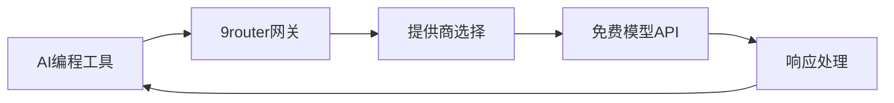
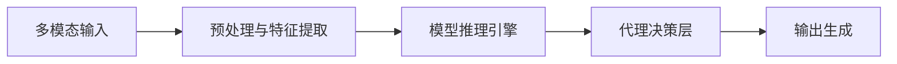
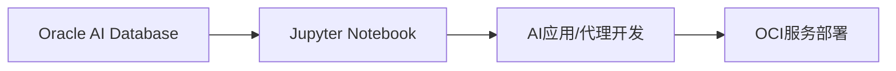

## 今日热点

今日GitHub热榜聚焦AI代理与智能体技术爆发，多模态AI代理栈和AI编码工具引领潮流，同时大模型学习资源需求旺盛。

---

## 热门项目一览

| 排名 | 项目 | 语言 | 今日 | 总计 | 简介 |
|:---:|------|:----:|------:|-----:|------|
| 1 | [anthropics/financial-services](https://github.com/anthropics/financial-services) | Python | +3,281 | 17,460 | No description |
| 2 | [addyosmani/agent-skills](https://github.com/addyosmani/agent-skills) | Shell | +3,009 | 37,430 | Production-grade engineerin... |
| 3 | [datawhalechina/hello-agents](https://github.com/datawhalechina/hello-agents) | Python | +1,197 | 45,720 | 📚 《从零开始构建智能体》——从零开始的智能体原理与实践教程 |
| 4 | [decolua/9router](https://github.com/decolua/9router) | JavaScript | +1,031 | 6,537 | Unlimited FREE AI coding. C... |
| 5 | [masterking32/MasterDnsVPN](https://github.com/masterking32/MasterDnsVPN) | Go | +597 | 2,554 | Advanced DNS tunneling VPN ... |
| 6 | [bytedance/UI-TARS-desktop](https://github.com/bytedance/UI-TARS-desktop) | TypeScript | +552 | 31,445 | The Open-Source Multimodal ... |
| 7 | [rohitg00/agentmemory](https://github.com/rohitg00/agentmemory) | TypeScript | +533 | 3,470 | #1 Persistent memory for AI... |
| 8 | [playcanvas/supersplat](https://github.com/playcanvas/supersplat) | TypeScript | +514 | 6,333 | 3D Gaussian Splat Editor |
| 9 | [datawhalechina/easy-vibe](https://github.com/datawhalechina/easy-vibe) | JavaScript | +294 | 8,556 | 💻 vibe coding 2026 | Your f... |
| 10 | [Lordog/dive-into-llms](https://github.com/Lordog/dive-into-llms) | Jupyter Notebook | +160 | 36,490 | 《动手学大模型Dive into LLMs》系列编程实践教程 |
| 11 | [rowboatlabs/rowboat](https://github.com/rowboatlabs/rowboat) | TypeScript | +144 | 13,806 | Open-source AI coworker, wi... |
| 12 | [ChromeDevTools/chrome-devtools-mcp](https://github.com/ChromeDevTools/chrome-devtools-mcp) | TypeScript | +107 | 38,842 | Chrome DevTools for coding ... |

---

## 趋势洞察

```
┌─────────────────────────────────────────────────────────────────┐
│  AI/ML 工具         ████████████████████████  9 个项目        │
│  其他               ████████                  3 个项目        │
│  数据分析             ██                        1 个项目        │
└─────────────────────────────────────────────────────────────────┘
```

---

## 项目深度解读

### 1. anthropics/financial-services — 金融AI服务

> **一句话总结**：Anthropic开发的AI金融解决方案，提供安全可靠的金融服务分析工具。

#### 价值主张

| 维度 | 说明 |
|------|------|
| **解决痛点** | 传统金融服务决策效率低，AI赋能提升分析准确性和决策速度 |
| **目标用户** | 金融机构、金融分析师、需要AI决策支持的企业 |
| **核心亮点** | AI驱动的金融分析 + 安全可靠的数据处理 + 高效决策支持系统 |

#### 技术架构


**技术特色**：
- 基于Python的AI分析框架，适合金融数据处理
- 结合Anthropic的AI安全理念，确保金融决策可靠性
- 模块化设计，支持多种金融场景定制

#### 热度分析

- 项目近期热度显著上升，单日增长超过3200 stars，显示市场高度关注
- Fork数量适中，表明项目可能处于早期发展阶段，社区贡献正在积累

#### 快速上手

```bash
# 克隆项目
git clone https://github.com/anthropics/financial-services.git

# 安装依赖
cd financial-services
pip install -r requirements.txt

# 运行示例
python examples/basic_analysis.py
```

#### 注意事项

- 项目许可协议未知，商业使用前需确认授权条款
- 项目描述信息有限，实际功能可能与推测有差异
- 由于Open Issues为0，可能项目尚在早期阶段或问题管理方式特殊


### 2. addyosmani/agent-skills — AI编程技能库

> **一句话总结**：提供生产级AI编程代理的工程技能与最佳实践，提升AI辅助编程质量。

#### 价值主张

| 维度 | 说明 |
|------|------|
| **解决痛点** | 解决AI编程代理生成代码质量参差不齐的问题 |
| **目标用户** | AI工具开发者、高级工程师、技术团队 |
| **核心亮点** | + 生产级最佳实践 + 结构化技能库 + 可扩展框架 |

#### 技术架构


**技术特色**：
- 基于Shell的轻量级技能定义
- 模块化技能组织结构
- 可扩展的提示工程框架

#### 热度分析

- 项目热度飙升，单日增长3000+星，显示AI编程领域需求激增
- 作为AI编程技能库，处于AI辅助开发工具生态的核心位置

#### 快速上手

```bash
# 克隆项目
git clone https://github.com/addyosmani/agent-skills.git

# 探索技能目录
cd agent-skills && ls -la skills/
```

#### 注意事项
- 项目缺乏明确的许可证声明，使用时需注意版权问题
- 技能库持续更新，建议关注最新版本以获取最佳实践
- 需要结合具体AI工具使用，不是独立运行的软件


### 3. datawhalechina/hello-agents — 智能体入门教程

> **一句话总结**：从零开始构建智能体的原理与实践教程，适合AI初学者系统学习智能体开发。

#### 价值主张

| 维度 | 说明 |
|------|------|
| **解决痛点** | 智能体领域知识零散，缺乏系统化、实践导向的学习资源 |
| **目标用户** | AI初学者、希望了解智能体原理的开发者 |
| **核心亮点** | 理论与实践结合 + 代码示例丰富 + 循序渐进的学习路径 |

#### 技术架构


**技术特色**：
- 基于Python主流AI框架实现智能体
- 提供从理论到实践的完整学习闭环
- 结合最新LLM技术展示智能体应用场景

#### 热度分析

- Star数持续增长，日均增长约1200+，显示社区高度关注
- 作为DataWhale系列教程之一，在AI学习领域具有显著影响力

#### 快速上手

```bash
# 克隆项目
git clone https://github.com/datawhalechina/hello-agents.git

# 安装依赖
pip install -r requirements.txt
```

#### 注意事项

- 项目内容可能需要一定Python和AI基础
- 建议按照章节顺序学习，循序渐进
- 部分示例可能需要更新以适配最新AI工具


### 4. decolua/9router — [AI编程网关]

> **一句话总结**：免费无限AI编程网关，连接多种AI工具到免费模型，自动回退降本40%。

#### 价值主张

| 维度 | 说明 |
|------|------|
| **解决痛点** | 突破AI编程工具限制，提供免费且无限制的AI编程体验 |
| **目标用户** | 需要大量使用AI编程工具的开发者和编程爱好者 |
| **核心亮点** | 40+提供商支持 + 自动回退机制 + 减少40%token消耗 + 无使用限制 |

#### 技术架构



**技术特色**：
- 多提供商智能路由技术，自动选择最佳API端点
- 请求合并与优化，减少40%token消耗
- 自动回退机制，确保服务连续性

#### 热度分析

- 近期增长迅猛，单日新增stars超1000，项目热度急剧上升
- 社区活跃度高，fork数量表明开发者积极参与项目改进

#### 快速上手

```bash
# 克隆仓库
git clone https://github.com/decolua/9router.git

# 安装依赖
npm install
```

#### 注意事项

- 项目许可证未知，使用时需注意商业使用限制
- 免费服务可能存在稳定性问题，建议不要用于关键生产环境
- 使用前需了解各AI提供商的使用政策，避免违规操作


### 5. masterking32/MasterDnsVPN

> **项目简介**：Advanced DNS tunneling VPN for censorship bypass, optimized beyond DNSTT and SlipStream with low-overhead ARQ, resolver load balancing, high packet-loss stability and speed.

#### 🎯 基本信息

| 维度 | 说明 |
|------|------|
| **语言** | Go |
| **今日Star** | +597 |
| **总Star** | 2,554 |

#### 🔗 链接

- GitHub: [masterking32/MasterDnsVPN](https://github.com/masterking32/MasterDnsVPN)

---

---

### 6. bytedance/UI-TARS-desktop — 多模态AI代理栈

> **一句话总结**：开源多模态AI代理堆栈，无缝连接前沿AI模型与代理基础设施。

#### 价值主张

| 维度 | 说明 |
|------|------|
| **解决痛点** | 多模态AI模型与基础设施之间的集成壁垒和开发复杂性 |
| **目标用户** | AI开发者、研究人员和企业AI解决方案构建者 |
| **核心亮点** | 多模态统一接口 + 开源可定制 + 企业级部署支持 + 模型即插即用 |

#### 技术架构



**技术特色**：
- 基于TypeScript的全栈开发，确保类型安全
- 模块化设计支持多种AI模型即插即用
- 企业级部署架构，支持大规模AI服务

#### 热度分析

- 项目Star数已达31,445，单日增长552，表明社区关注度极高
- 作为字节跳动开源的AI基础设施项目，在AI生态中具有重要地位

#### 快速上手

```bash
# 克隆项目
git clone https://github.com/bytedance/UI-TARS-desktop.git
# 安装依赖
npm install
# 启动项目
npm start
```

#### 注意事项

- 项目许可证未知，商业使用前需确认授权条款
- 作为字节跳动项目，可能存在与中国法律法规相关的特殊考量
- 项目文档和API可能需要进一步研究以获取完整信息


### 7. rohitg00/agentmemory — AI代理内存系统

> **一句话总结**：为AI编码代理提供基于真实世界基准的持久化内存解决方案

#### 价值主张

| 维度 | 说明 |
|------|------|
| **解决痛点** | 解决AI代理在长时间运行中无法保持记忆和上下文的问题 |
| **目标用户** | AI开发者、智能代理构建者、需要长期记忆的AI应用开发者 |
| **核心亮点** | 持久化存储 + 基于真实基准测试 + 高性能内存管理 |

#### 技术架构


**技术特色**：
- 基于真实世界基准测试的内存优化
- TypeScript实现的高效内存管理
- 持久化存储与检索系统

#### 热度分析

- 项目获得3470 stars，单日新增533 stars，表明项目正在快速增长，社区关注度极高
- 作为AI代理内存解决方案的领先项目，在AI开发工具链中占据重要生态位置

#### 快速上手

```bash
# 安装项目
npm install agentmemory

# 基本使用示例
const agentMemory = require('agentmemory');
const memory = agentMemory.createMemory();
memory.add('用户偏好', '喜欢深色主题');
const retrieved = memory.get('用户偏好');
```

#### 注意事项

- 项目许可证信息未知，使用前需确认开源许可条款
- 作为新兴项目，API和功能可能会频繁更新
- 需要结合实际AI代理架构进行集成，不是即插即用的解决方案


### 8. playcanvas/supersplat — 3D高斯飞溅编辑器

> **一句话总结**：一款用于创建、编辑和导出3D高斯飞溅的专业编辑工具，支持实时预览和交互式编辑。

#### 价值主张

| 维度 | 说明 |
|------|------|
| **解决痛点** | 提供直观的3D高斯飞溅编辑体验，解决复杂3D场景创建难题 |
| **目标用户** | 3D艺术家、游戏开发者、VR内容创作者 |
| **核心亮点** | 实时预览 + 高斯飞溅技术 + 交互式编辑 + 多格式导出 + PlayCanvas集成 |

#### 技术架构


**技术特色**：
- 基于TypeScript开发，提供类型安全和良好的开发体验
- 利用WebGL实现高性能3D渲染和实时预览
- 支持将传统3D模型转换为高斯飞溅格式

#### 热度分析

- 项目近期增长迅速，单日新增514个Star，显示社区对该技术的高度关注
- 作为PlayCanvas生态系统的一部分，受益于Web 3D开发的整体趋势

#### 快速上手

```bash
# 克隆仓库
git clone https://github.com/playcanvas/supersplat.git

# 安装依赖并启动开发服务器
cd supersplat
npm install
npm run dev
```

#### 注意事项

- 项目使用未知许可证，商业使用前需确认授权条款
- 高斯飞溅技术相对较新，可能存在兼容性和性能限制
- 项目依赖PlayCanvas引擎，可能需要一定的WebGL和3D图形学基础


### 9. datawhalechina/easy-vibe — 编程入门课程

> **一句话总结**：面向初学者的现代化编程课程，通过渐进式学习路径帮助零基础学员掌握编程技能。

#### 价值主张

| 维度 | 说明 |
|------|------|
| **解决痛点** | 初学者面对复杂编程概念难以入门，缺乏系统化学习路径 |
| **目标用户** | 零基础编程初学者，希望系统学习现代编程技能的人群 |
| **核心亮点** | 渐进式学习路径 + 实战项目导向 + 互动式学习体验 + 现代化技术栈覆盖 |

#### 技术架构


**技术特色**：
- 采用渐进式教学设计，降低初学者学习门槛
- 提供丰富的互动式编程练习，强化学习效果
- 整合现代Web技术栈，教授前沿开发技能

#### 热度分析

- 项目Star数超8500且持续增长，表明其受到广泛认可
- 作为开源学习项目，在编程教育领域具有较高影响力

#### 快速上手

```bash
# 克隆项目到本地
git clone https://github.com/datawhalechina/easy-vibe.git

# 进入项目目录
cd easy-vibe

# 查看课程目录
ls -l
```

#### 注意事项

- 项目可能需要一定的编程基础知识才能更好地理解内容
- 建议按照课程顺序逐步学习，不要跳过基础内容


### 10. Lordog/dive-into-llms — 大模型实践教程

> **一句话总结**：系统化大模型编程实践教程，通过Jupyter Notebook深入讲解LLM核心技术与应用。

#### 价值主张

| 维度 | 说明 |
|------|------|
| **解决痛点** | 提供系统化的大模型实践教程，填补理论与实践的鸿沟 |
| **目标用户** | AI研究人员、工程师及对大模型感兴趣的初学者 |
| **核心亮点** | 系统性 + 实践导向 + 代码完整 + 深度解析 + 最新进展 |

#### 技术架构


**技术特色**：
- 以Jupyter Notebook为载体，提供交互式学习体验
- 覆盖从基础到前沿的大模型全栈技术
- 注重理论与实践结合，提供完整代码实现

#### 热度分析

- 项目高星高fork，增长势头强劲，反映LLM学习需求旺盛
- 社区活跃度高，为AI学习领域的重要实践资源

#### 快速上手

```bash
# 克隆项目到本地
git clone https://github.com/Lordog/dive-into-llms.git

# 启动Jupyter服务器
cd dive-into-llms
jupyter notebook
```

#### 注意事项

- 项目依赖较多Python环境，建议使用conda创建独立环境
- 部分实验需要较高计算资源，可能需要GPU支持
- 随着LLM技术快速发展，部分内容可能需要更新


### 11. rowboatlabs/rowboat — AI助手

> **一句话总结**：开源AI助手，具备记忆功能，可作为编程伙伴使用。

#### 价值主张

| 维度 | 说明 |
|------|------|
| **解决痛点** | 解决AI助手无法记住用户历史交互的问题，提供连续对话体验 |
| **目标用户** | 开发者、研究人员和需要AI辅助的知识工作者 |
| **核心亮点** | 持久记忆 + 上下文理解 + 开源可定制 |

#### 技术架构


**技术特色**：
- 基于TypeScript构建，类型安全
- 实现了持久化记忆系统
- 支持多轮对话上下文维护

#### 热度分析

- 项目star数超过1.3万，且持续稳定增长，表明项目质量受到广泛认可
- 零open issues可能表明问题解决效率高，或社区主要通过其他渠道交流

#### 快速上手

```bash
# 克隆仓库
git clone https://github.com/rowboatlabs/rowboat.git
# 安装依赖
npm install
# 启动服务
npm start
```

#### 注意事项

- 项目许可证未知，商业使用前需确认授权条款
- 零open issues不代表没有问题，可能问题在其他渠道讨论
- 作为AI助手，需注意数据隐私和安全性问题


### 12. ChromeDevTools/chrome-devtools-mcp — 开发者工具AI扩展

> **一句话总结**：将Chrome开发者工具深度集成到AI编码代理，提供强大的网页调试与分析能力。

#### 价值主张

| 维度 | 说明 |
|------|------|
| **解决痛点** | AI编码代理无法直接使用浏览器开发者工具进行网页调试与分析 |
| **目标用户** | AI编码系统开发者、智能IDE构建者、自动化测试工程师 |
| **核心亮点** | Chrome DevTools深度集成 + MCP协议实现 + 模块化API设计 + 实时调试能力 |

#### 技术架构


**技术特色**：
- 基于TypeScript构建，提供完整类型定义与类型安全
- 采用MCP(Model Context Protocol)协议，标准化AI与工具的交互方式
- 模块化设计，支持按需加载DevTools功能

#### 热度分析

- 项目Star数近4万，近期持续稳定增长，表明获得开发者社区高度认可
- Fork数相对较低，暗示项目主要作为依赖使用，较少被二次开发

#### 快速上手

```bash
# 安装依赖
npm install chrome-devtools-mcp

# 基本使用
import { ChromeDevTools } from 'chrome-devtools-mcp';
const devtools = new ChromeDevTools();
await devtools.connect('ws://localhost:9222');
```

#### 注意事项

- 需要确保目标Chrome版本与API兼容，Chrome更新可能影响功能
- 使用前需在Chrome中启用远程调试端口(默认9222)
- 部分高级功能可能需要Chrome特定版本支持


### 13. oracle-devrel/oracle-ai-developer-hub — Oracle AI资源中心

> **一句话总结**：Oracle官方AI开发资源中心，提供Jupyter Notebook教程，帮助开发者构建基于Oracle AI数据库和OCI服务的AI应用。

#### 价值主张

| 维度 | 说明 |
|------|------|
| **解决痛点** | 提供Oracle AI技术栈集中学习资源，降低开发者上手门槛 |
| **目标用户** | 使用Oracle云服务的AI开发者、数据科学家和解决方案架构师 |
| **核心亮点** | 实用教程 + Oracle AI数据库集成 + OCI服务连接 + 完整示例代码 |

#### 技术架构



**技术特色**：
- 基于Jupyter Notebook的交互式学习环境
- 深度集成Oracle AI数据库和OCI云服务
- 提供从数据到部署的完整AI开发生态链

#### 热度分析

- 项目近期增长迅速，单日增长90个star，显示Oracle AI生态需求旺盛
- 作为Oracle官方开发者资源，在Oracle云服务生态中具有重要参考价值

#### 快速上手

```bash
# 克隆项目到本地
git clone https://github.com/oracle-devrel/oracle-ai-developer-hub.git
# 启动Jupyter服务器
cd oracle-ai-developer-hub && jupyter notebook
```

#### 注意事项

- 需要Oracle Cloud账户才能完整运行部分示例
- 某些Notebook可能需要特定的Oracle AI服务权限
- 项目文档以英文为主，需要一定的英语阅读能力


## 今日推荐

| 主题 | 推荐项目 | 亮点 |
|------|----------|------|
| 今日最热 | [anthropics/financial-services](https://github.com/anthropics/financial-services) | No description |
| 值得关注 | [addyosmani/agent-skills](https://github.com/addyosmani/agent-skills) | Production-grade ... |
| 快速上手 | [datawhalechina/hello-agents](https://github.com/datawhalechina/hello-agents) | 📚 《从零开始构建智能体》——从零... |
| 长期潜力 | [decolua/9router](https://github.com/decolua/9router) | Unlimited FREE AI... |

---

<div align="center">

*Generated on 2026-05-10 | Powered by GitHub Trending Reporter*

</div>