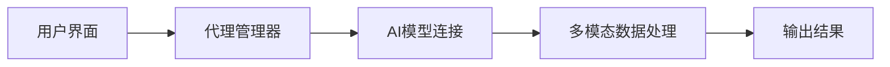
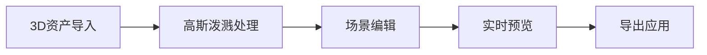

## 今日热点

今日GitHub热榜项目精彩纷呈。

---

## 热门项目一览

| 排名 | 项目 | 语言 | 今日 | 总计 | 简介 |
|:---:|------|:----:|------:|-----:|------|
| 1 | [anthropics/financial-services](https://github.com/anthropics/financial-services) | Python | +1,449 | 18,974 | No description |
| 2 | [affaan-m/everything-claude-code](https://github.com/affaan-m/everything-claude-code) | JavaScript | +1,081 | 178,330 | The agent harness performan... |
| 3 | [addyosmani/agent-skills](https://github.com/addyosmani/agent-skills) | Shell | +1,065 | 38,547 | Production-grade engineerin... |
| 4 | [decolua/9router](https://github.com/decolua/9router) | JavaScript | +803 | 7,364 | Unlimited FREE AI coding. C... |
| 5 | [datawhalechina/hello-agents](https://github.com/datawhalechina/hello-agents) | Python | +748 | 46,634 | 📚 《从零开始构建智能体》——从零开始的智能体原理与实践教程 |
| 6 | [bytedance/UI-TARS-desktop](https://github.com/bytedance/UI-TARS-desktop) | TypeScript | +669 | 32,208 | The Open-Source Multimodal ... |
| 7 | [datawhalechina/easy-vibe](https://github.com/datawhalechina/easy-vibe) | JavaScript | +635 | 9,235 | 💻 vibe coding 2026 | Your f... |
| 8 | [playcanvas/supersplat](https://github.com/playcanvas/supersplat) | TypeScript | +579 | 6,853 | 3D Gaussian Splat Editor |
| 9 | [CloakHQ/CloakBrowser](https://github.com/CloakHQ/CloakBrowser) | Python | +496 | 4,839 | Stealth Chromium that passe... |
| 10 | [jundot/omlx](https://github.com/jundot/omlx) | Python | +185 | 13,334 | LLM inference server with c... |
| 11 | [lsdefine/GenericAgent](https://github.com/lsdefine/GenericAgent) | Python | +174 | 10,556 | Self-evolving agent: grows ... |
| 12 | [HKUDS/AI-Trader](https://github.com/HKUDS/AI-Trader) | Python | +163 | 15,633 | "AI-Trader: 100% Fully-Auto... |

---

## 趋势洞察

```
┌─────────────────────────────────────────────────────────────────┐
│  AI/ML 工具         ████████████████████████  8 个项目        │
│  其他               █████████                 3 个项目        │
│  数据分析             ███                       1 个项目        │
└─────────────────────────────────────────────────────────────────┘
```

---

## 项目深度解读

### 1. anthropics/financial-services — [AI金融助手]

> **一句话总结**：Anthropic开发的金融行业AI助手工具集，提供专业金融服务支持。

#### 价值主张

| 维度 | 说明 |
|------|------|
| **解决痛点** | 金融行业专业知识和复杂决策支持需求 |
| **目标用户** | 金融机构、金融分析师、投资顾问 |
| **核心亮点** | 专业金融知识库 + 安全AI交互 + 决策辅助工具 |

#### 技术架构


**技术特色**：
- 基于Claude大语言模型的金融专业问答
- 金融数据安全与隐私保护机制
- 模块化金融分析工具集成

#### 热度分析

- 项目获得近19k星，近期单日增长超1.4k，显示市场高度关注
- 0个开放问题表明项目已成熟或社区问题通过其他渠道解决

#### 快速上手

```bash
# 安装依赖
pip install anthropic-financial-services

# 初始化配置
anthropic-financial init

# 启动金融助手
anthropic-financial start
```

#### 注意事项

- 需要Anthropic API密钥才能使用核心功能
- 数据安全与隐私需符合金融行业监管要求
- 建议在测试环境中验证后再用于生产环境


### 2. affaan-m/everything-claude-code — AI编程优化框架

> **一句话总结**：为Claude等AI编程工具提供性能优化与技能增强的智能系统

#### 价值主张

| 维度 | 说明 |
|------|------|
| **解决痛点** | AI编程工具性能不足与功能受限问题 |
| **目标用户** | Claude Code、Cursor等AI编程工具使用者 |
| **核心亮点** | 技能增强 + 本能优化 + 记忆系统 + 安全保障 + 研究优先开发 |

#### 技术架构

**技术特色**：
- 基于JavaScript的AI编程优化系统
- 集成技能与本能增强机制
- 提供安全与记忆功能支持

#### 热度分析

- 项目获得17.8万+星标，单日增长超1000，表明处于快速增长期
- 高社区参与度，2.7万+次分叉，显示开发者社区高度认可

#### 快速上手

```bash
git clone https://github.com/affaan-m/everything-claude-code.git
cd everything-claude-code
npm install
```

#### 注意事项

- 项目许可证未知，使用前需确认授权条款
- 缺少详细的文档说明，可能需要查看源码了解具体用法
- 项目似乎专注于特定AI编程工具，兼容性可能有限


### 3. addyosmani/agent-skills — AI工程技能集

> **一句话总结**：为AI编程代理提供生产级工程技能的Shell工具集。

#### 价值主张

| 维度 | 说明 |
|------|------|
| **解决痛点** | 提升AI编程代理在实际开发环境中的工程能力 |
| **目标用户** | AI编程工具开发者和使用AI辅助编程的开发者 |
| **核心亮点** | 实用性脚本 + 生产级适配 + 多场景覆盖 |

#### 技术架构


**技术特色**：
- 基于Shell的轻量级实现
- 模块化工程技能设计
- 与主流AI编程工具无缝集成

#### 热度分析

- 项目Star数高且增长迅速，表明AI编程辅助工具需求旺盛
- 零开放问题，说明项目维护质量高，问题解决效率高

#### 快速上手

```bash
# 克隆项目
git clone https://github.com/addyosmani/agent-skills.git
# 进入目录
cd agent-skills
# 查看可用技能列表
ls -la skills/
```

#### 注意事项

- 需要基本的Shell环境才能运行
- 可能需要根据具体开发环境调整某些脚本
- 建议在使用前阅读项目文档了解各脚本的适用场景


### 4. decolua/9router — AI代理路由

> **一句话总结**：AI编程助手路由器，连接多种工具到免费AI模型，自动回退优化，节省40%令牌使用永不限流。

#### 价值主张

| 维度 | 说明 |
|------|------|
| **解决痛点** | 解决AI编程工具成本高、限制多的痛点，提供免费替代方案 |
| **目标用户** | 需要使用AI编程助手但面临成本或限制的开发者 |
| **核心亮点** | 多提供商支持 + 自动回退机制 + 令牌节省40% + 无限使用 |

#### 技术架构


**技术特色**：
- 智能路由算法自动选择最优提供商
- 令牌优化技术减少40%使用量
- 多协议适配层兼容各种AI工具

#### 热度分析

- 高增长率，单日新增Star超800，显示强烈社区兴趣
- 高Fork/Star比例，表明社区积极参与二次开发和贡献

#### 快速上手

```bash
# 克隆项目
git clone https://github.com/decolua/9router.git

# 安装依赖
npm install

# 启动服务
npm start
```

#### 注意事项

- 注意使用免费AI模型的隐私和数据安全问题
- 可能需要注册多个提供商账户以实现自动回退功能
- 项目许可证未知，使用前需确认授权条款


### 5. datawhalechina/hello-agents — 智能体入门指南

> **一句话总结**：系统化智能体理论与实践教程，零基础友好，适合AI初学者入门学习。

#### 价值主张

| 维度 | 说明 |
|------|------|
| **解决痛点** | 为AI初学者提供系统化学习路径，解决智能体概念抽象、入门困难问题 |
| **目标用户** | AI初学者、对智能体技术感兴趣的开发者、研究人员和学生 |
| **核心亮点** | 系统性教程架构 + 零基础友好 + 理论实践结合 + 多场景案例 + 开源协作 |

#### 技术架构


**技术特色**：
- 基于Python的智能体实现框架
- 理论与实践相结合的教学方法
- 多层次递进的学习路径设计
- 开源协作的学习社区支持

#### 热度分析

- 项目Star数高且增长迅速，表明智能体领域热度高涨，学习需求旺盛
- 作为DataWhale组织的项目，在国内AI教育领域具有重要影响力

#### 快速上手

```bash
# 克隆项目到本地
git clone https://github.com/datawhalechina/hello-agents.git

# 进入项目目录
cd hello-agents
```

#### 注意事项

- 本项目主要提供学习内容，而非可直接运行的软件框架
- 学习过程中需要具备一定的Python编程基础
- 建议按照教程章节顺序逐步学习，以建立完整的知识体系
- 需配合其他AI工具和库进行实践操作


### 6. bytedance/UI-TARS-desktop — 多模态AI代理栈

> **一句话总结**：开源多模态AI代理栈，连接前沿AI模型与代理基础设施，提供一站式AI解决方案。

#### 价值主张

| 维度 | 说明 |
|------|------|
| **解决痛点** | AI模型与代理基础设施连接复杂，缺乏统一管理平台 |
| **目标用户** | AI开发者、研究人员、企业技术团队 |
| **核心亮点** | 多模态支持 + 开源可定制 + 模块化架构 + 前沿AI模型集成 |

#### 技术架构



**技术特色**：
- 基于TypeScript开发，保证类型安全
- 模块化架构设计，便于扩展
- 支持多种前沿AI模型的无缝集成

#### 热度分析

- 项目获得32,208个Star，今日新增669个，增长迅猛，表明社区对该项目高度关注
- 作为字节跳动开源项目，在AI代理领域具有较强影响力，生态潜力巨大

#### 快速上手

```bash
# 克隆仓库
git clone https://github.com/bytedance/UI-TARS-desktop.git

# 安装依赖
npm install

# 启动应用
npm start
```

#### 注意事项

- 项目许可证未知，商业使用前需确认授权条款
- 作为AI代理栈，可能需要API密钥或特定环境配置
- 项目处于活跃开发中，API可能会有变化


### 7. datawhalechina/easy-vibe — 编程入门课程

> **一句话总结**：面向初学者的现代编程课程，通过系统化路径帮助学习者掌握编程基础。

#### 价值主张

| 维度 | 说明 |
|------|------|
| **解决痛点** | 降低编程学习门槛，提供系统化入门路径 |
| **目标用户** | 编程零基础或初学者，尤其是想要学习现代编程的人 |
| **核心亮点** | 系统化课程设计 + 实践导向 + 循序渐进 |

#### 技术架构

**技术特色**：
- 采用JavaScript作为主要教学语言，适合初学者入门
- 提供模块化学习路径，循序渐进
- 结合理论与实践，注重动手能力培养

#### 热度分析

- 项目获得9,235星且单日增长635，显示热度持续上升
- 作为开源学习项目，社区参与度高，体现了学习型项目的影响力

#### 快速上手

```bash
# 克隆项目到本地
git clone https://github.com/datawhalechina/easy-vibe.git

# 查看项目文档
cd easy-vibe && README.md
```

#### 注意事项

- 项目许可证未知，使用时需注意授权问题
- 由于是面向初学者的课程，可能不适合有经验的开发者
- 建议按照课程顺序学习，以获得最佳学习效果


### 8. playcanvas/supersplat — 3D高斯编辑器

> **一句话总结**：一个功能强大的3D高斯泼溅编辑器，支持高效的3D场景创建与编辑。

#### 价值主张

| 维度 | 说明 |
|------|------|
| **解决痛点** | 简化3D高斯泼溅创建与编辑流程，降低技术门槛 |
| **目标用户** | 3D艺术家、游戏开发者、VR内容创作者 |
| **核心亮点** | 实时编辑 + 高性能渲染 + 直观UI + 多格式支持 |

#### 技术架构



**技术特色**：
- 基于3D高斯泼溅技术实现高效场景表示
- 使用TypeScript构建，确保类型安全和开发效率
- 集成PlayCanvas引擎，提供强大的WebGL渲染能力

#### 热度分析

- 项目近期获得大量关注，Star数增长迅速，表明3D高斯泼溅技术正受到业界重视
- 作为PlayCanvas生态系统的重要组成部分，有望成为3D内容创建的标准工具

#### 快速上手

```bash
# 克隆仓库
git clone https://github.com/playcanvas/supersplat.git

# 安装依赖并启动
cd supersplat
npm install
npm run dev
```

#### 注意事项

- 项目可能需要较新的浏览器支持，特别是WebGL 2.0
- 高斯泼溅技术仍在发展中，可能存在兼容性问题
- 处理大型3D场景时可能需要高性能硬件支持


### 9. CloakHQ/CloakBrowser — 反浏览器指纹

> **一句话总结**：隐形浏览器技术，通过源级指纹修补绕过所有机器人检测，可作为Playwright直接替代品。

#### 价值主张

| 维度 | 说明 |
|------|------|
| **解决痛点** | 解决自动化测试中被识别为机器人的问题，实现完全隐形的浏览器操作 |
| **目标用户** | 需要绕过反爬虫机制的自动化测试、数据采集和网页爬虫开发者 |
| **核心亮点** | 源级指纹修补 + 完全隐形 + Playwright兼容 + 高通过率测试 |

#### 技术架构


**技术特色**：
- 源级浏览器指纹修补技术，模拟真实用户行为
- 与Playwright完全兼容的API，无缝替换现有代码
- 通过30项机器人检测测试的高可靠性保证

#### 热度分析

- 项目获得4839星，单日激增496星，显示高度关注度和实用性
- 零开放问题表明项目成熟度高，用户反馈良好，维护状态稳定

#### 快速上手

```bash
# 安装CloakBrowser
pip install cloakbrowser

# 基本使用示例
from cloakbrowser import Browser
browser = Browser()
browser.goto("https://example.com")
print(browser.title)
browser.close()
```

#### 注意事项

- 可能涉及法律和道德边界，需谨慎用于非授权数据采集
- 项目许可证未知，商业使用前需确认授权条款
- 反检测技术可能随着网站检测机制更新而失效，需要持续维护


### 10. jundot/omlx — macOS LLM 服务器

> **一句话总结**：面向苹果设备的本地大语言模型推理服务，实现高效处理与缓存管理。

#### 价值主张

| 维度 | 说明 |
|------|------|
| **解决痛点** | 解决在 Apple Silicon 设备上高效运行大语言模型的性能问题 |
| **目标用户** | macOS 用户，特别是需要本地运行大语言模型的专业开发者 |
| **核心亮点** | 针对 Apple Silicon 优化 + 连续批处理技术 + SSD 智能缓存 |

#### 技术架构


**技术特色**：
- 基于 Apple Silicon 的硬件加速优化
- 连续批处理技术提升吞吐量
- SSD 智能缓存减少重复计算

#### 热度分析

- 项目获得超1.3万星，单日新增近200星，增长势头强劲
- 零开放问题显示项目维护良好，社区活跃度高

#### 快速上手

```bash
# 安装 omlx
pip install omlx

# 启动服务
omlx serve --model <model_name>
```

#### 注意事项

- 项目仅支持 Apple Silicon 设备(M1/M2/M3芯片)
- 需要足够的存储空间用于模型和缓存
- 可能需要较新的 macOS 版本


### 11. lsdefine/GenericAgent — 自进化智能体

> **一句话总结**：从3300行种子代码自我演化的智能体，实现系统完全控制且token消耗降低6倍。

#### 价值主张

| 维度 | 说明 |
|------|------|
| **解决痛点** | 传统AI系统训练成本高、扩展性差、难以实现复杂系统控制 |
| **目标用户** | AI研究人员、自动化系统开发者、复杂任务解决方案构建者 |
| **核心亮点** | 自我进化能力 + 技能树动态增长 + 6倍token效率提升 + 系统完全控制 |

#### 技术架构


**技术特色**：
- 自主进化机制，无需大量人工干预
- 技能树动态构建，扩展性强
- 显著降低token消耗，提高运行效率

#### 热度分析

- 项目获得10556个星标且持续增长(+174/天)，表明社区高度认可
- Fork数1200，显示项目具有良好的可复制性和二次开发潜力

#### 快速上手

```bash
# 克隆项目
git clone https://github.com/lsdefine/GenericAgent.git
cd GenericAgent
pip install -r requirements.txt
```

#### 注意事项

- 项目许可证未知，使用前需确认版权信息
- 可能需要较高的计算资源来运行自我进化过程
- 作为复杂AI系统，可能需要一定的技术背景才能完全理解和调整


### 12. HKUDS/AI-Trader — 自动化AI交易系统

> **一句话总结**：基于AI的完全自动化交易系统，无需人工干预即可执行交易决策。

#### 价值主张

| 维度 | 说明 |
|------|------|
| **解决痛点** | 解决人工交易决策延迟与情绪化问题，实现全自动交易执行 |
| **目标用户** | 量化交易者、投资机构、自动化交易爱好者 |
| **核心亮点** | AI驱动 + 完全自动化 + 代理原生 + 高效执行 + 低延迟 |

#### 技术架构


**技术特色**：
- 基于深度学习的市场预测模型
- 低延迟交易执行系统
- 动态风险控制机制
- 多市场数据源集成
- 实时回测与优化功能

#### 热度分析

- Star增长稳定，日均新增约160，显示持续关注热度
- 高Fork/Star比例(16.2%)，表明项目被广泛用于二次开发

#### 快速上手

```bash
git clone https://github.com/HKUDS/AI-Trader.git
cd AI-Trader
pip install -r requirements.txt
python main.py --config config/default.json
```

#### 注意事项

- 需确保API密钥安全，不要提交到公共代码库
- 建议先在模拟环境中测试，再投入真实交易
- 市场风险存在，AI系统无法保证100%盈利


## 今日推荐

| 主题 | 推荐项目 | 亮点 |
|------|----------|------|
| 今日最热 | [anthropics/financial-services](https://github.com/anthropics/financial-services) | No description |
| 值得关注 | [affaan-m/everything-claude-code](https://github.com/affaan-m/everything-claude-code) | The agent harness... |
| 快速上手 | [addyosmani/agent-skills](https://github.com/addyosmani/agent-skills) | Production-grade ... |
| 长期潜力 | [decolua/9router](https://github.com/decolua/9router) | Unlimited FREE AI... |

---

<div align="center">

*Generated on 2026-05-11 | Powered by GitHub Trending Reporter*

</div>