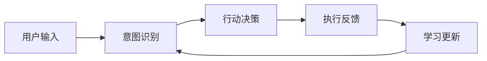
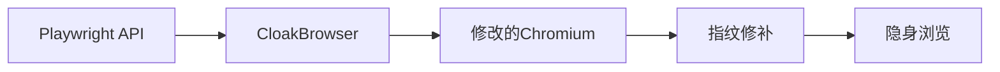
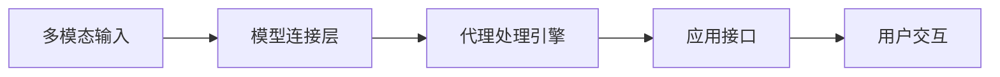
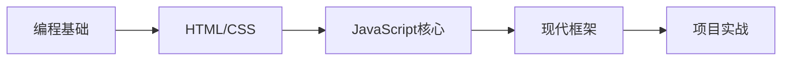
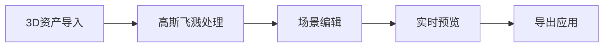
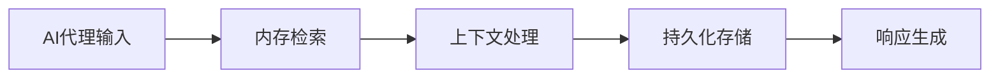
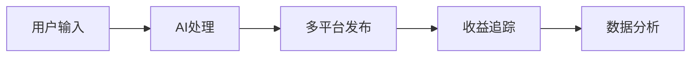
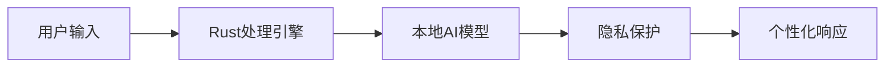
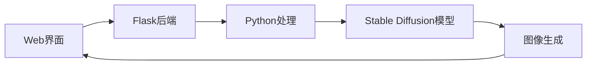

## 今日热点

今日GitHub热榜显示AI代理与工具生态持续爆发，多模态AI栈、免费AI路由器和智能代理系统引领潮流，同时AI教育与3D技术也备受关注。

---

## 热门项目一览

| 排名 | 项目 | 语言 | 今日 | 总计 | 简介 |
|:---:|------|:----:|------:|-----:|------|
| 1 | [NousResearch/hermes-agent](https://github.com/NousResearch/hermes-agent) | Python | +2,065 | 144,962 | The agent that grows with you |
| 2 | [CloakHQ/CloakBrowser](https://github.com/CloakHQ/CloakBrowser) | Python | +1,320 | 6,273 | Stealth Chromium that passe... |
| 3 | [bytedance/UI-TARS-desktop](https://github.com/bytedance/UI-TARS-desktop) | TypeScript | +956 | 33,050 | The Open-Source Multimodal ... |
| 4 | [decolua/9router](https://github.com/decolua/9router) | JavaScript | +941 | 8,406 | Unlimited FREE AI coding. C... |
| 5 | [datawhalechina/easy-vibe](https://github.com/datawhalechina/easy-vibe) | JavaScript | +812 | 9,974 | 💻 vibe coding 2026 | Your f... |
| 6 | [playcanvas/supersplat](https://github.com/playcanvas/supersplat) | TypeScript | +531 | 7,378 | 3D Gaussian Splat Editor |
| 7 | [rohitg00/agentmemory](https://github.com/rohitg00/agentmemory) | TypeScript | +430 | 4,805 | #1 Persistent memory for AI... |
| 8 | [yikart/AiToEarn](https://github.com/yikart/AiToEarn) | TypeScript | +427 | 10,865 | Let's use AI to Earn! |
| 9 | [Lordog/dive-into-llms](https://github.com/Lordog/dive-into-llms) | Jupyter Notebook | +422 | 37,340 | 《动手学大模型Dive into LLMs》系列编程实践教程 |
| 10 | [tinyhumansai/openhuman](https://github.com/tinyhumansai/openhuman) | Rust | +366 | 1,537 | Your Personal AI super inte... |
| 11 | [rasbt/LLMs-from-scratch](https://github.com/rasbt/LLMs-from-scratch) | Jupyter Notebook | +337 | 93,048 | Implement a ChatGPT-like LL... |
| 12 | [millionco/react-doctor](https://github.com/millionco/react-doctor) | TypeScript | +212 | 8,104 | Your agent writes bad React... |

---

## 趋势洞察

```
┌─────────────────────────────────────────────────────────────────┐
│  AI/ML 工具         ████████████████████████  9 个项目        │
│  其他               ████████                  3 个项目        │
│  数据分析             ██                        1 个项目        │
└─────────────────────────────────────────────────────────────────┘
```

---

## 项目深度解读

### 1. NousResearch/hermes-agent — 自适应智能代理

> **一句话总结**：一款能够通过交互持续学习和适应的智能代理系统。

#### 价值主张

| 维度 | 说明 |
|------|------|
| **解决痛点** | 传统AI代理缺乏长期学习和适应能力，无法根据用户反馈持续优化 |
| **目标用户** | AI研究人员、开发者、需要定制化智能代理解决方案的企业 |
| **核心亮点** | 持续学习能力 + 自适应性 + 交互式学习 + 模块化架构 + 开源可定制 |

#### 技术架构



**技术特色**：
- 基于强化学习的自适应机制，代理能从交互中持续学习
- 模块化设计支持多场景扩展和功能集成
- 分布式架构支持大规模并发处理和知识共享

#### 热度分析

- 项目Star数高达14.4万，单日增长2000+，显示社区高度关注和认可
- 高Fork数和零Issues表明社区活跃，可能通过其他渠道处理问题

#### 快速上手

```bash
git clone https://github.com/NousResearch/hermes-agent.git
cd hermes-agent
pip install -r requirements.txt
python main.py --config config/default.yaml
```

#### 注意事项

- 项目许可证未知，使用时需注意版权和许可问题
- 作为AI代理项目，运行可能需要大量计算资源和GPU支持
- 项目描述简洁，文档可能不够完善，建议参考社区讨论获取更多信息


### 2. CloakHQ/CloakBrowser — 隐形浏览器工具

> **一句话总结**：一个能绕过所有机器人检测的隐身浏览器，可作为Playwright的替代品，提供源级别指纹修补。

#### 价值主张

| 维度 | 说明 |
|------|------|
| **解决痛点** | 解决Web自动化工具被识别为机器人的问题，实现真正隐身浏览 |
| **目标用户** | 需要执行Web自动化但避免被检测的开发者、测试人员和数据采集者 |
| **核心亮点** | 源级别指纹修补 + 通过30/30机器人检测测试 + Playwright完全兼容 |

#### 技术架构



**技术特色**：
- 源级别的浏览器指纹修改技术
- 与Playwright API完全兼容的替代方案
- 通过30项严格机器人检测测试验证

#### 热度分析

- 项目一日内增加1,320个Star，表明近期关注度极高，需求迫切
- Open Issues为0，可能反映项目维护良好或问题通过其他渠道解决

#### 快速上手

```bash
# 安装
pip install cloak-browser

# 基本使用
from cloak_browser import Browser
browser = Browser()
page = browser.new_page()
page.goto("https://example.com")
```

#### 注意事项

- 项目许可证未知，使用前需确认其授权方式
- 修改浏览器指纹可能违反某些网站的使用条款
- 随着反机器人技术发展，当前有效性可能会随时间降低


### 3. bytedance/UI-TARS-desktop — 多模态AI代理栈

> **一句话总结**：开源多模态AI代理堆栈，连接前沿AI模型与代理基础设施。

#### 价值主张

| 维度 | 说明 |
|------|------|
| **解决痛点** | 统一连接多种AI模型，构建高效多模态代理应用 |
| **目标用户** | AI开发者、研究人员、企业技术团队 |
| **核心亮点** | 多模态能力 + 开源生态 + 模块化设计 + 高性能部署 |

#### 技术架构



**技术特色**：
- 多模态数据处理能力
- 模块化AI模型连接架构
- 高性能代理处理引擎
- 开源可扩展的生态设计

#### 热度分析

- 项目Star数高达33,050，日增长956，显示社区关注度极高
- Fork数3,276表明开发者积极参与二次开发，形成活跃生态

#### 快速上手

```bash
# 克隆项目
git clone https://github.com/bytedance/UI-TARS-desktop.git
# 安装依赖
npm install
# 启动项目
npm start
```

#### 注意事项

- 项目需要AI模型相关知识背景
- 确保有足够的计算资源支持多模态AI模型运行
- 注意项目的具体许可证信息（当前显示为Unknown）


### 4. decolua/9router — [AI代理路由]

> **一句话总结**：统一路由多种AI编码工具到免费服务，突破API限制，大幅降低成本。

#### 价值主张

| 维度 | 说明 |
|------|------|
| **解决痛点** | 突破AI编码工具API限制，解决高成本和访问限制问题 |
| **目标用户** | 开发者、AI工具使用者、需要大量AI辅助编码的人群 |
| **核心亮点** | 多平台支持 + 自动回退机制 + RTK技术降低40%token + 40+免费提供商 + 永不限制 |

#### 技术架构


**技术特色**：
- 智能路由算法动态选择最优API提供商
- RTK技术优化请求减少40%token消耗
- 自动回退机制确保服务不中断
- 统一接口适配多种AI编码工具

#### 热度分析

- 项目获得8,406个Star且单日增长941，表明项目近期热度极高
- 社区活跃度显著，1,336个Fork显示开发者积极参与使用和改进

#### 快速上手

```bash
# 克隆仓库
git clone https://github.com/decolua/9router.git

# 安装依赖
cd 9router && npm install

# 启动服务
npm start
```

#### 注意事项

- 使用前需要确保遵守各AI服务的使用条款
- 免费服务可能有稳定性问题，建议重要任务不要完全依赖
- 项目可能存在法律风险，使用前需自行评估


### 5. datawhalechina/easy-vibe — 编程入门课程

> **一句话总结**：系统化现代编程学习路径，零基础学员循序渐进掌握编程核心技能。

#### 价值主张

| 维度 | 说明 |
|------|------|
| **解决痛点** | 编程初学者缺乏系统学习路径，知识点零散不成体系 |
| **目标用户** | 编程零基础学员、IT转行者、计算机专业入门学生 |
| **核心亮点** | 系统化课程设计 + 2026年最新技术 + 实践导向学习 |

#### 技术架构



**技术特色**：
- 基于Web技术栈的前端开发完整学习路径
- 理论与实践相结合的教学方法
- 适应2026年技术趋势的内容更新机制

#### 热度分析

- 项目Star数近万且单日增长800+，表明近期推广力度大，学习资源需求旺盛
- 由DataWhale社区维护，在国内编程教育领域具有一定权威性和影响力

#### 快速上手

```bash
# 克隆项目到本地
git clone https://github.com/datawhalechina/easy-vibe.git

# 进入项目目录查看课程内容
cd easy-vibe && ls
```

#### 注意事项

- 项目信息有限，建议查看README文件获取详细学习指南
- 作为编程学习项目，需配合实际编码练习以巩固知识点
- 关注项目更新情况，确保学习内容的时效性


### 6. playcanvas/supersplat — 3D场景编辑器

> **一句话总结**：基于高斯飞溅技术的交互式3D场景编辑器，实现高效渲染与实时编辑。

#### 价值主张

| 维度 | 说明 |
|------|------|
| **解决痛点** | 解决传统3D场景编辑复杂、渲染性能低的问题 |
| **目标用户** | 3D内容创作者、游戏开发者、可视化工程师 |
| **核心亮点** | 高斯飞溅技术 + 实时渲染 + 交互式编辑 + 跨平台支持 |

#### 技术架构



**技术特色**：
- 基于高斯飞溅的高效3D场景表示技术
- 利用WebGL实现高性能实时渲染
- 基于Play引擎的强大图形处理能力
- TypeScript全栈开发确保代码质量

#### 热度分析

- 项目近期增长迅猛，531个新增星星反映社区对新兴3D技术高度关注
- 作为高斯飞溅领域领先工具，正吸引大量3D开发者和创作者

#### 快速上手

```bash
# 克隆项目
git clone https://github.com/playcanvas/supersplat.git
# 安装依赖
npm install
# 启动开发服务器
npm run dev
```

#### 注意事项

- 需要现代浏览器支持WebGL 2.0
- 高斯飞溅技术仍处于发展阶段，可能存在兼容性问题
- 项目需要一定的3D图形学基础才能充分利用功能


### 7. rohitg00/agentmemory — AI代理内存系统

> **一句话总结**：为AI编程代理提供持久化内存解决方案，基于真实世界基准测试优化。

#### 价值主张

| 维度 | 说明 |
|------|------|
| **解决痛点** | AI代理缺乏长期记忆能力，无法保持跨会话上下文和状态 |
| **目标用户** | AI应用开发者、智能编程助手构建者、大语言模型集成者 |
| **核心亮点** | 持久化存储 + 真实基准优化 + 高效检索 + TypeScript支持 + 易集成 |

#### 技术架构



**技术特色**：
- 基于真实世界基准测试优化内存管理策略
- 提供高效的语义检索和上下文关联机制
- 完整TypeScript类型支持，确保开发体验

#### 热度分析
- 项目获4800+ stars，单日增长430+，处于AI工具快速上升期
- 作为AI代理基础设施，处于技术生态关键位置，社区参与度高

#### 快速上手

```bash
# 安装依赖
npm install agentmemory

# 基本使用
import { createMemory } from 'agentmemory';

const memory = createMemory();
memory.add('用户偏好', '喜欢简洁的代码风格');
const relevant = memory.recall('代码风格');
console.log(relevant);
```

#### 注意事项
- 项目许可证未知，商业使用前需确认授权情况
- 虽然无开放issue，但建议关注项目更新，AI领域技术迭代迅速
- 基于真实基准测试，可能在特定场景下表现优于理论优化方案


### 8. yikart/AiToEarn — AI创利平台

> **一句话总结**：利用AI技术为用户提供自动化赚钱解决方案的创收平台。

#### 价值主张

| 维度 | 说明 |
|------|------|
| **解决痛点** | 降低普通人利用AI创收的技术门槛 |
| **目标用户** | 希望利用AI技术增加收入的普通用户 |
| **核心亮点** | 自动化创收流程 + 多渠道变现 + 低代码操作 |

#### 技术架构



**技术特色**：
- 基于TypeScript构建的全栈应用架构
- 集成多种AI服务接口实现内容生成
- 自动化收益追踪与分析系统

#### 热度分析

- 项目Star数持续快速增长，单日新增427个Star，显示出强劲的市场需求
- Fork数量适中，表明项目既有社区参与度又保持了一定的技术门槛

#### 快速上手

```bash
# 克隆项目
git clone https://github.com/yikart/AiToEarn.git

# 安装依赖
npm install

# 启动项目
npm start
```

#### 注意事项

- 项目许可证未知，使用前需确认授权条款
- 赚钱效果可能因地区、平台政策等因素而异
- 需谨慎处理AI生成内容的版权问题


### 9. Lordog/dive-into-llms — 大模型实践教程

> **一句话总结**：系统化的大语言模型编程实践教程，通过交互式Notebook实现理论与实践结合。

#### 价值主张

| 维度 | 说明 |
|------|------|
| **解决痛点** | 大模型技术门槛高，缺乏系统化、可实践的入门路径 |
| **目标用户** | AI领域学习者、研究人员及希望深入理解大模型的工程师 |
| **核心亮点** | 交互式学习体验 + 全栈技术覆盖 + 渐进式知识结构 |

#### 技术架构


**技术特色**：
- 基于Jupyter Notebook的交互式学习环境
- 提供可直接运行的完整代码示例
- 从基础到前沿的全技术栈覆盖

#### 热度分析

- 项目Star数突破3.7万，近期增长迅猛，反映大模型学习需求旺盛
- Fork数与Star数比例合理，表明用户不仅关注还积极参与实践

#### 快速上手

```bash
# 克隆仓库
git clone https://github.com/Lordog/dive-into-llms.git

# 安装依赖
cd dive-into-llms
pip install -r requirements.txt
```

#### 注意事项

- 需要一定的机器学习和深度学习基础
- 部分高级内容可能需要高性能计算资源
- 随大模型技术快速发展，部分内容可能需要更新


### 10. tinyhumansai/openhuman — 个人AI助手

> **一句话总结**：私密、简单且强大的个人超级智能系统，为用户提供专属AI辅助。

#### 价值主张

| 维度 | 说明 |
|------|------|
| **解决痛点** | 解决现有AI系统不够私密、复杂或功能不足的问题 |
| **目标用户** | 需要强大私人AI辅助的个人用户和开发者 |
| **核心亮点** | 私密性保障 + 极简设计 + 超强性能 + 本地部署 |

#### 技术架构



**技术特色**：
- 基于Rust构建，确保高性能与内存安全
- 强调本地部署，保障用户数据隐私
- 极简API设计，降低使用门槛

#### 热度分析

- 项目近期热度显著增长，单日新增Star达366，增长势头强劲
- 相对Star数，Fork比例较低，表明项目可能还处于早期发展阶段

#### 快速上手

```bash
# 克隆仓库
git clone https://github.com/tinyhumansai/openhuman.git
# 构建项目
cd openhuman && cargo build --release
```

#### 注意事项

- 项目许可证未知，使用前需确认授权条款
- 项目Open Issues为0，可能表明问题管理方式不同或项目尚在早期阶段
- 需要关注项目的更新频率和长期维护情况


### 11. rasbt/LLMs-from-scratch — 从零LLM教程

> **一句话总结**：从零实现ChatGPT式LLM的PyTorch教程，理论与实践并重。

#### 价值主张

| 维度 | 说明 |
|------|------|
| **解决痛点** | 揭示LLM内部工作原理，超越表面API使用 |
| **目标用户** | AI研究者、工程师及深度学习爱好者 |
| **核心亮点** | 逐步讲解 + PyTorch实现 + 完整代码 + 可复现实验 |

#### 技术架构


**技术特色**：
- 从零开始的完整LLM实现路径
- 详细的PyTorch代码与理论结合
- 模块化设计便于理解与扩展

#### 热度分析

- 高星标与活跃增长表明项目在LLM教育领域的领先地位
- 零开放问题显示项目已成熟稳定，维护质量高

#### 快速上手

```bash
# 克隆仓库
git clone https://github.com/rasbt/LLMs-from-scratch.git

# 安装依赖
pip install -r requirements.txt

# 运行第一个notebook
jupyter notebook Chapter01/
```

#### 注意事项

- 需要扎实的PyTorch和深度学习基础知识
- 训练过程需要较强的计算资源支持
- 建议按章节顺序学习，循序渐进理解LLM构建全过程


### 12. millionco/react-doctor — React 代码医生

> **一句话总结**：检测并捕获不良 React 代码，提升代码质量与开发效率。

#### 价值主张

| 维度 | 说明 |
|------|------|
| **解决痛点** | 识别并捕获低质量、潜在问题的 React 代码 |
| **目标用户** | React 开发者、代码审查者、AI 辅助编程用户 |
| **核心亮点** + 静态代码分析 + 模式检测 + 即时反馈 + 可配置规则 |

#### 技术架构


**技术特色**：
- 基于 TypeScript 开发，提供类型安全
- 静态代码分析技术，无需运行时检测
- 可配置规则系统，适应不同项目需求

#### 热度分析

- 项目获得超过 8k 星标，近期增长迅速，表明社区高度认可
- 作为代码质量工具，在 React 生态中占据重要位置，适合集成到开发流程

#### 快速上手

```bash
# 安装
npm install react-doctor

# 使用
react-doctor ./src
```

#### 注意事项

- 需要正确配置规则以适应项目特定需求
- 可能需要定期更新规则库以适应 React 的新特性


### 13. AUTOMATIC1111/stable-diffusion-webui — AI绘画界面

> **一句话总结**：Stable Diffusion的Web界面，将复杂AI模型操作简化为直观易用的图形界面。

#### 价值主张

| 维度 | 说明 |
|------|------|
| **解决痛点** | 将复杂的Stable Diffusion模型操作简化为直观的Web界面 |
| **目标用户** | AI艺术创作者、设计师、研究人员和普通爱好者 |
| **核心亮点** | 易于使用的Web界面 + 丰富的参数调整 + 插件扩展系统 |

#### 技术架构



**技术特色**：
- 基于Flask的轻量级Web服务器，提供RESTful API
- 支持GPU加速的模型推理，利用CUDA提高生成速度
- 提供丰富的参数配置选项，包括采样方法、步数、分辨率等

#### 热度分析

- 项目Star数超过16万，增长迅速，表明在AI绘画领域有极高人气
- Fork数与Star数比例较高，说明社区积极参与开发和定制

#### 快速上手

```bash
# 克隆仓库
git clone https://github.com/AUTOMATIC1111/stable-diffusion-webui.git
# 进入目录
cd stable-diffusion-webui
# 运行WebUI
./webui.sh
```

#### 注意事项

- 需要较强大的GPU才能获得良好的性能体验
- 模型文件需要单独下载并放置在指定目录
- 使用时需注意版权问题，避免生成侵权内容


## 今日推荐

| 主题 | 推荐项目 | 亮点 |
|------|----------|------|
| 今日最热 | [NousResearch/hermes-agent](https://github.com/NousResearch/hermes-agent) | The agent that gr... |
| 值得关注 | [CloakHQ/CloakBrowser](https://github.com/CloakHQ/CloakBrowser) | Stealth Chromium ... |
| 快速上手 | [bytedance/UI-TARS-desktop](https://github.com/bytedance/UI-TARS-desktop) | The Open-Source M... |
| 长期潜力 | [decolua/9router](https://github.com/decolua/9router) | Unlimited FREE AI... |

---

<div align="center">

*Generated on 2026-05-12 | Powered by GitHub Trending Reporter*

</div>