## 今日热点

今日GitHub热榜项目精彩纷呈。

---

## 热门项目一览

| 排名 | 项目 | 语言 | 今日 | 总计 | 简介 |
|:---:|------|:----:|------:|-----:|------|
| 1 | [mattpocock/skills](https://github.com/mattpocock/skills) | Shell | +3,392 | 79,212 | Skills for Real Engineers. ... |
| 2 | [CloakHQ/CloakBrowser](https://github.com/CloakHQ/CloakBrowser) | Python | +1,835 | 9,607 | Stealth Chromium that passe... |
| 3 | [tinyhumansai/openhuman](https://github.com/tinyhumansai/openhuman) | Rust | +1,696 | 5,727 | Your Personal AI super inte... |
| 4 | [obra/superpowers](https://github.com/obra/superpowers) | Shell | +1,401 | 189,655 | An agentic skills framework... |
| 5 | [rohitg00/agentmemory](https://github.com/rohitg00/agentmemory) | TypeScript | +1,379 | 7,777 | #1 Persistent memory for AI... |
| 6 | [github/spec-kit](https://github.com/github/spec-kit) | Python | +1,120 | 98,464 | 💫 Toolkit to help you get s... |
| 7 | [yikart/AiToEarn](https://github.com/yikart/AiToEarn) | TypeScript | +981 | 13,012 | Let's use AI to Earn! |
| 8 | [supertone-inc/supertonic](https://github.com/supertone-inc/supertonic) | Swift | +859 | 4,425 | Lightning-Fast, On-Device, ... |
| 9 | [rasbt/LLMs-from-scratch](https://github.com/rasbt/LLMs-from-scratch) | Jupyter Notebook | +821 | 94,503 | Implement a ChatGPT-like LL... |
| 10 | [millionco/react-doctor](https://github.com/millionco/react-doctor) | TypeScript | +604 | 9,316 | Your agent writes bad React... |
| 11 | [apernet/hysteria](https://github.com/apernet/hysteria) | Go | +485 | 20,637 | Hysteria is a powerful, lig... |
| 12 | [danielmiessler/Personal_AI_Infrastructure](https://github.com/danielmiessler/Personal_AI_Infrastructure) | TypeScript | +435 | 13,410 | Agentic AI Infrastructure f... |

---

## 趋势洞察

```
┌─────────────────────────────────────────────────────────────────┐
│  AI/ML 工具         ████████████████████████  12 个项目        │
│  其他               ██████████                5 个项目        │
│  开发工具             ████                      2 个项目        │
└─────────────────────────────────────────────────────────────────┘
```

---

## 项目深度解读

### 1. mattpocock/skills — 工程技能库

> **一句话总结**：从 .claude 目录整理的工程师实用技能集合，提供可直接使用的 shell 工具。

#### 价值主张

| 维度 | 说明 |
|------|------|
| **解决痛点** | 为工程师提供可直接使用的实用技能和工具 |
| **目标用户** | 开发者、系统管理员、DevOps 工程师 |
| **核心亮点** | 实战导向 + 直接可用 + .claude 实践精华 |

#### 技术架构

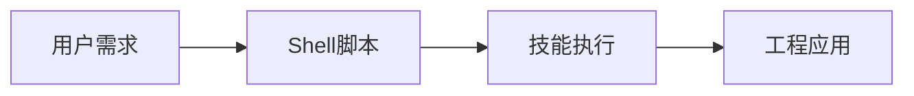

**技术特色**：
- 基于 Shell 脚本，跨平台兼容性良好
- 脚本化操作，提高工程效率
- 直接从实战经验中提取，实用性强

#### 热度分析

- 项目获得近8万星，单日新增超过3000星，增长迅猛
- 无开放问题，表明项目维护良好，用户反馈积极

#### 快速上手

```bash
# 克隆仓库
git clone https://github.com/mattpocock/skills.git
# 进入目录
cd skills
# 查看可用脚本
ls -la
# 执行需要的脚本
./<script-name>
```

#### 注意事项

- 由于是 Shell 脚本，在 Windows 系统上可能需要使用 WSL 或 Git Bash
- 执行脚本前需要检查脚本权限，可能需要使用 chmod +x
- 脚本可能依赖于特定的系统环境或工具


### 2. CloakHQ/CloakBrowser — 反检测浏览器

> **一句话总结**：隐形浏览器，完全绕过机器人检测，可作为Playwright替代品，提供源级指纹修补功能。

#### 价值主张

| 维度 | 说明 |
|------|------|
| **解决痛点** | 解决浏览器自动化被检测和阻止的问题，实现真正的隐形浏览 |
| **目标用户** | 需要绕过反爬虫机制的数据采集者、自动化测试人员 |
| **核心亮点** | 源级指纹修补 + 30/30测试通过率 + 完全兼容Playwright API + 反检测能力 |

#### 技术架构

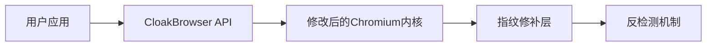

**技术特色**：
- 基于Chromium的深度定制，修改浏览器指纹
- 完全兼容Playwright API，可作为直接替换
- 源级指纹修补，针对多种检测机制进行优化

#### 热度分析

- 项目短期内获得大量关注，今日新增1,835个Star，表明该项目在自动化和数据采集领域有强烈需求
- 零Open Issues可能表明项目维护良好或社区反馈渠道不明确，但高Fork数表明社区有二次开发需求

#### 快速上手

```bash
# 安装
pip install cloak-browser

# 基本使用
from cloak import browser
b = browser.launch()
page = b.new_page()
page.goto("https://example.com")
print(page.title())
b.close()
```

#### 注意事项

- 项目可能存在法律和道德风险，需谨慎使用
- 反检测技术可能随网站反爬策略更新而失效，需要持续维护
- 许可证未知，可能存在商业使用限制


### 3. tinyhumansai/openhuman — 个人AI助手

> **一句话总结**：私密强大的个人AI超级智能系统，简单易用且功能强大。

#### 价值主张

| 维度 | 说明 |
|------|------|
| **解决痛点** | 提供私人、强大且易用的AI智能助手，解决个人智能需求 |
| **目标用户** | 需要个人AI助手的普通用户、开发者和科技爱好者 |
| **核心亮点** | 私密性 + 简单易用 + 极强功能 + 本地部署 + 个人化 |

#### 技术架构

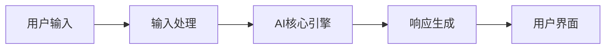

**技术特色**：
- Rust语言实现，保证高性能和内存安全
- 注重隐私保护，本地处理数据
- 简化的AI交互接口，降低使用门槛

#### 热度分析

- 项目在短时间内获得大量关注，今日增长1,696个Star，表明市场对个人AI助手需求旺盛
- 零未解决问题显示项目维护良好，社区反馈积极

#### 快速上手

```bash
# 克隆仓库
git clone https://github.com/tinyhumansai/openhuman.git
# 进入项目目录
cd openhuman
# 构建项目
cargo build --release
```

#### 注意事项

- 项目许可证未知，使用前需确认授权条款
- 作为AI系统，可能需要较高的计算资源
- 隐私保护效果需实际验证
- 项目处于早期阶段，功能可能还在快速迭代中


### 4. obra/superpowers — 实用技能框架

> **一句话总结**：一个强调实用性的代理技能框架与软件开发方法论，注重实际效果。

#### 价值主张

| 维度 | 说明 |
|------|------|
| **解决痛点** | 解决软件开发理论与实践脱节问题，提供可执行的技能框架 |
| **目标用户** | 软件开发团队、技术管理者、追求高效能的开发者 |
| **核心亮点** | 实用主义导向 + 代理技能框架 + 系统方法论 + 高效执行 + 结果验证 |

#### 技术架构


**技术特色**：
- 基于Shell的轻量级实现，跨平台兼容性好
- 模块化设计，可根据团队需求灵活调整
- 实用主义导向，强调实际效果而非理论完美

#### 热度分析

- 高星项目持续增长，今日新增1401星，社区认可度高
- 0开放问题表明项目维护良好，用户反馈处理及时

#### 快速上手

```bash
# 克隆项目
git clone https://github.com/obra/superpowers.git
# 进入项目目录
cd superpowers
# 查看使用说明
cat README.md
```

#### 注意事项

- 项目未明确许可证，使用前需确认授权条款
- 作为方法论框架，需要团队理解和实践才能发挥最大价值


### 5. rohitg00/agentmemory — AI记忆系统

> **一句话总结**：为AI编程代理提供持久化记忆能力，提升上下文理解与长期任务处理能力。

#### 价值主张

| 维度 | 说明 |
|------|------|
| **解决痛点** | 解决AI代理缺乏长期记忆和上下文连贯性的问题 |
| **目标用户** | AI开发者、智能代理构建者、需要长期上下文记忆的AI应用 |
| **核心亮点** | 持久化记忆系统 + 基于真实世界基准测试 + 高效内存管理 + 易于集成 |

#### 技术架构

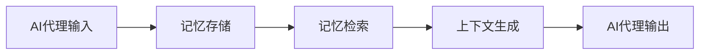

**技术特色**：
- 基于真实世界基准测试的记忆系统
- 持久化存储机制，确保长期记忆保持
- 高效的内存管理和检索算法

#### 热度分析

- 项目获得7,777 stars，今日增长1,379，表明项目近期受到极大关注
- 零开放问题，说明项目维护良好，用户反馈积极

#### 快速上手

```bash
# 安装依赖
npm install agentmemory

# 基本使用示例
import { createMemory } from 'agentmemory';
const memory = createMemory();
memory.add('记住这是一个重要项目');
const relevant = memory.query('项目');
console.log(relevant);
```

#### 注意事项

- 注意内存管理，避免过度存储导致性能问题
- 根据实际应用场景调整记忆持久化策略


### 6. github/spec-kit — 规范驱动工具

> **一句话总结**：提供规范驱动开发全流程工具链，提升代码质量和开发效率。

#### 价值主张

| 维度 | 说明 |
|------|------|
| **解决痛点** | 解决开发过程中规范不明确、实现与预期不符的问题 |
| **目标用户** | 软件开发团队、测试工程师、需求分析师 |
| **核心亮点** | 规范模板库 + 自动化验证 + 文档生成 + 多语言支持 |

#### 技术架构


**技术特色**：
- 基于YAML/JSON的规范描述语言
- 支持多种编程语言的代码生成
- 集成测试框架自动化验证规范

#### 热度分析

- 项目获得近10万星，单日增长超千星，表明规范驱动开发方法论受到广泛关注
- 高社区参与度，零开放问题，反映项目成熟度高且维护良好

#### 快速上手

```bash
# 安装spec-kit
pip install spec-kit

# 初始化项目规范
spec-kit init my-project

# 添加规范并生成代码
spec-kit add feature:user-authentication
spec-kit generate
```

#### 注意事项

- 项目许可证信息不明确，商业使用前需确认授权条款
- 规范驱动开发需要团队对规范达成共识，可能存在学习成本
- 需要与现有开发流程和工具链集成，可能需要定制化配置


### 7. yikart/AiToEarn — AI变现工具

> **一句话总结**：整合多种AI能力，提供自动化收入生成方案的低代码平台。

#### 价值主张

| 维度 | 说明 |
|------|------|
| **解决痛点** | 将AI技术转化为实际收入，降低普通人技术变现门槛 |
| **目标用户** | 开发者、内容创作者、自由职业者、AI爱好者 |
| **核心亮点** | 多种AI变现模式 + 自动化工作流 + 无需复杂编程 |

#### 技术架构

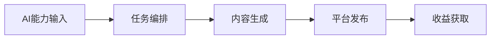

**技术特色**：
- 基于TypeScript构建的全栈解决方案，确保类型安全
- 模块化设计，支持多种AI服务提供商无缝集成
- 提供可视化配置界面，简化复杂AI工作流设置

#### 热度分析

- 项目获得13k+星标且近期增长显著，反映AI变现领域的高关注度
- Fork数量适中，表明项目兼具实用性和可扩展性，适合二次开发

#### 快速上手

```bash
# 克隆项目
git clone https://github.com/yikart/AiToEarn.git

# 安装依赖
npm install

# 启动开发环境
npm run dev
```

#### 注意事项

- 使用前需配置各AI平台的API密钥，部分功能可能需要付费订阅
- 确保遵守各平台的使用条款，避免账号被封禁
- 定期更新依赖包，以获取最新的安全补丁和功能优化


### 8. supertone-inc/supertonic — 快速多语TTS

> **一句话总结**：基于Swift和ONNX的极速、本地化多语言文本转语音解决方案

#### 价值主张

| 维度 | 说明 |
|------|------|
| **解决痛点** | 解决传统TTS速度慢、依赖云服务、语言支持有限的痛点 |
| **目标用户** | 需要高效本地TTS功能的iOS开发者、语音应用开发者 |
| **核心亮点** | 极速处理 + 完全离线运行 + 多语言支持 + ONNX优化 |

#### 技术架构

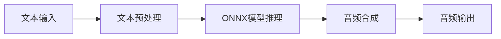

**技术特色**：
- 基于Swift和ONNX的高效TTS实现
- 完全本地化运行，不依赖云服务
- 支持多种语言的快速语音合成

#### 热度分析

- 项目获得4425个Star，单日增长859，显示极高的社区关注度和采用率
- 零Open Issues表明项目维护良好，问题解决及时，社区反馈积极

#### 快速上手

```bash
# 克隆项目
git clone https://github.com/supertone-inc/supertonic.git

# 安装依赖
cd supertonic && swift package update
```

#### 注意事项

- 项目许可证未知，商业使用前需确认授权方式
- 虽然支持多语言，但具体支持的语言列表和语言质量可能需要进一步验证
- 零Open Issues可能意味着社区反馈渠道不够活跃


### 9. rasbt/LLMs-from-scratch — LLM从零实现

> **一句话总结**：提供从零开始构建类ChatGPT大语言模型的完整PyTorch实现教程，通过逐步深入的方式让读者理解LLM核心原理。

#### 价值主张

| 维度 | 说明 |
|------|------|
| **解决痛点** | 解决AI学习者难以理解复杂LLM内部实现机制的问题，提供从基础到高级的完整实现路径 |
| **目标用户** | 对大语言模型原理感兴趣、希望深入理解LLM实现细节的研究者和开发者 |
| **核心亮点** | 从零开始构建LLM不依赖高级封装 + 详细的PyTorch代码实现 + 包含最新LLM技术如注意力机制 |

#### 技术架构

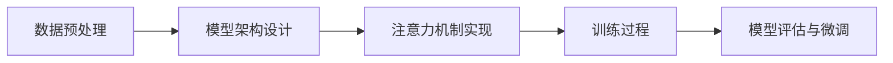

**技术特色**：
- 基于PyTorch的LLM完整实现
- 包含Transformer架构核心组件
- 提供从基础到高级的渐进式学习路径

#### 热度分析

- 项目Star数超过9.4万且持续增长(+821 today)，表明LLM学习需求旺盛
- Fork数与Star数比例合理，显示项目有较高实用价值，被广泛用于学习和实验

#### 快速上手

```bash
# 克隆项目仓库
git clone https://github.com/rasbt/LLMs-from-scratch.git

# 安装依赖
pip install torch numpy matplotlib

# 运行第一个notebook
cd LLMs-from-scratch
jupyter notebook Chapter01/
```

#### 注意事项

- 需要一定的PyTorch和深度学习基础
- 项目包含大量数学概念，建议配合相关数学知识一起学习
- 训练LLM需要大量计算资源，普通硬件可能只能运行部分示例


### 10. millionco/react-doctor — React代码质检

> **一句话总结**：专门检测AI生成React代码质量问题的静态分析工具，帮助开发者避免潜在bug和性能问题。

#### 价值主张

| 维度 | 说明 |
|------|------|
| **解决痛点** | 检测AI生成React代码中的性能问题和最佳实践违规 |
| **目标用户** | 使用AI辅助开发React应用的前端开发者和团队 |
| **核心亮点** | 静态分析AI生成代码 + 识别性能问题 + 提供修复建议 + 集成开发工作流 |

#### 技术架构

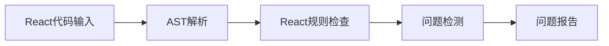

**技术特色**：
- 基于AST的深度代码分析技术
- 针对React特定模式的优化检测
- 与主流开发工具链的无缝集成能力

#### 热度分析

- 近期增长迅猛，单日新增604个Star，显示开发者对AI代码质检工具的强烈需求
- 在前端开发工具生态中占据独特位置，填补AI生成代码质量检测的空白

#### 快速上手

```bash
# 安装
npm install react-doctor

# 使用
npx react-doctor ./src
```

#### 注意事项
- 可能需要配置规则以适应特定项目需求
- 与其他代码质量工具(如ESLint)可能存在重复检测情况


### 11. apernet/hysteria — 高性能抗审查代理

> **一句话总结**：基于Go开发的高性能抗审查代理，提供快速、安全的网络连接能力。

#### 价值主张

| 维度 | 说明 |
|------|------|
| **解决痛点** | 突破网络审查，提供安全、高速的代理连接 |
| **目标用户** | 需要突破网络限制的开发者、研究人员和普通用户 |
| **核心亮点** | 基于QUIC协议的高性能传输 + 抗审查设计 + 多平台支持 + 简单易用的配置 |

#### 技术架构

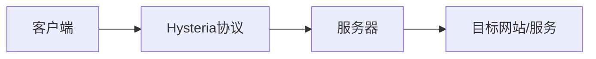

**技术特色**：
- 基于QUIC协议的高性能传输
- 自适应的抗审查机制
- 支持多种传输协议伪装

#### 热度分析

- 项目热度持续上升，近一日新增485星，表明社区活跃度高
- 零开放问题表明项目维护良好，用户反馈主要通过其他渠道

#### 快速上手

```bash
# 下载最新版本
wget https://github.com/apernet/hysteria/releases/latest/download/hysteria-linux-amd64 -O hysteria

# 赋予执行权限
chmod +x hysteria

# 运行客户端
./hysteria -c config.yaml client
```

#### 注意事项

- 需要了解当地法律关于使用代理工具的规定
- 配置文件需要根据实际网络环境进行调整
- 项目可能需要较高的Go版本支持


### 12. danielmiessler/Personal_AI_Infrastructure — 个人AI基建

> **一句话总结**：基于TypeScript构建的AI代理基础设施，旨在增强人类能力与效率。

#### 价值主张

| 维度 | 说明 |
|------|------|
| **解决痛点** | 降低个人AI系统构建复杂度，提供可扩展的智能代理框架 |
| **目标用户** | 开发者、AI研究人员、希望定制化AI系统的个人用户 |
| **核心亮点** | 模块化设计 + 类型安全 + 可扩展架构 + 人类能力增强 |

#### 技术架构

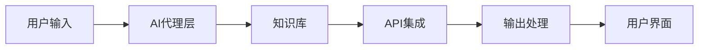

**技术特色**：
- TypeScript确保代码质量和类型安全
- 模块化架构支持灵活扩展
- 代理模式实现智能任务自动化

#### 热度分析

- 高关注度且持续增长，表明项目定位精准，解决实际需求
- 社区活跃度高，可能包含丰富的插件和扩展生态

#### 快速上手

```bash
# 克隆仓库
git clone https://github.com/danielmiessler/Personal_AI_Infrastructure.git
# 安装依赖
npm install
# 启动开发环境
npm run dev
```

#### 注意事项
- 需要一定的TypeScript和AI相关知识才能充分利用
- 项目可能需要配置API密钥或其他服务凭证
- 由于是个人项目，长期维护稳定性需要关注


### 13. trycua/cua — 桌面AI代理框架

> **一句话总结**：开源的计算机使用代理基础设施，提供沙箱、SDK和基准测试，支持跨平台桌面控制。

#### 价值主张

| 维度 | 说明 |
|------|------|
| **解决痛点** | 缺乏统一平台训练评估桌面控制AI代理，填补技术空白 |
| **目标用户** | AI研究人员、开发者，致力于开发桌面交互智能体的团队 |
| **核心亮点** | 跨平台支持+完整训练基础设施+开源可扩展架构 |

#### 技术架构


**技术特色**：
- 提供跨平台桌面环境的隔离沙箱
- 开发完整的SDK支持AI代理与桌面交互
- 建立标准化的基准测试体系

#### 热度分析

- 项目高热度增长，近16.6k stars且持续增长，显示社区高度认可
- 良好社区参与度，fork数超1k，表明项目有二次开发价值

#### 快速上手

```bash
# 克隆仓库
git clone https://github.com/trycua/cua.git

# 进入项目目录
cd cua

# 查看文档
cat README.md
```

#### 注意事项

- 项目许可信息未知，使用前需确认授权条款
- 可能需要一定的AI和系统编程基础才能有效使用
- 项目可能需要较新的硬件资源以支持AI代理的运行


### 14. imthenachoman/How-To-Secure-A-Linux-Server — Linux安全指南

> **一句话总结**：系统化的Linux服务器安全配置实践指南，提供从基础到高级的全方位安全加固方案。

#### 价值主张

| 维度 | 说明 |
|------|------|
| **解决痛点** | Linux服务器安全配置复杂且零散，缺乏系统化指导，容易留下安全漏洞 |
| **目标用户** | 系统管理员、DevOps工程师、网络安全初学者、Linux运维人员 |
| **核心亮点** | 系统化安全步骤 + 实用命令示例 + 持续更新的最佳实践 + 多发行版适配 |

#### 技术架构

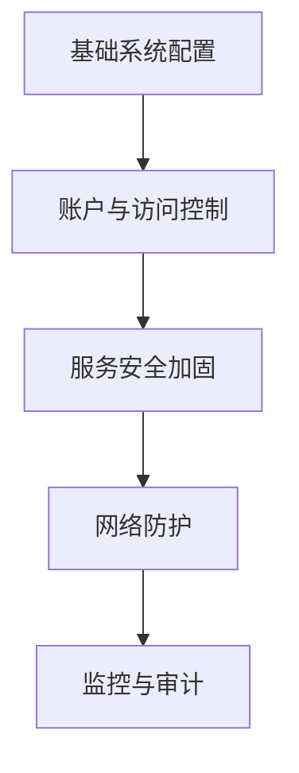

**技术特色**：
- 基于实战经验的渐进式安全配置方法
- 针对常见威胁的针对性防御措施
- 平衡安全性与系统可用性的优化方案

#### 热度分析
- 项目获得27,130+ stars且持续增长(+234 today)，表明Linux安全配置需求旺盛，内容质量高且实用性强。
- Fork数(1,776)与Star数比例约为1:15，显示用户更倾向于直接使用而非贡献，符合指南类文档特性。

#### 快速上手

```bash
# 检查当前用户权限
whoami

# 更新系统安全补丁
sudo apt update && sudo apt upgrade -y

# 检查系统开放端口
sudo ss -tulnp
```

#### 注意事项
- 该指南需根据具体Linux发行版和系统环境进行适当调整
- 安全配置是持续过程，需定期更新和检查以应对新威胁
- 在生产环境应用前应在测试环境充分验证配置效果


### 15. K-Dense-AI/scientific-agent-skills — 科研AI技能库

> **一句话总结**：提供多领域即用型AI代理技能，覆盖科研、工程、分析等专业场景。

#### 价值主张

| 维度 | 说明 |
|------|------|
| **解决痛点** | 解决专业领域AI技能模块化、即插即用的需求 |
| **目标用户** | 研究人员、科学家、工程师、分析师和金融从业者 |
| **核心亮点** | 多领域覆盖 + 专业性强 + 模块化设计 + 易于扩展 + 实用性强 |

#### 技术架构


**技术特色**：
- 多领域专业AI技能集成架构
- 模块化即插即用设计模式
- 支持科研与专业场景的定制化处理

#### 热度分析

- 项目获得21k+ Star且持续增长，在科研AI工具领域具有显著影响力
- 社区活跃度高，但Issues为0需关注问题反馈机制

#### 快速上手

```bash
# 克隆项目仓库
git clone https://github.com/K-Dense-AI/scientific-agent-skills.git
# 安装依赖
pip install -r requirements.txt
```

#### 注意事项

- 项目许可证信息未知，商业使用前需确认授权条款
- Issues数量为0，可能影响问题反馈和追踪机制
- 建议查看项目文档了解具体使用方法和适用场景


### 16. ArthurBrussee/brush — 3D重建工具

> **一句话总结**：基于Rust开发的开源3D重建工具，致力于让3D重建技术更加普及和易用。

#### 价值主张

| 维度 | 说明 |
|------|------|
| **解决痛点** | 降低3D重建技术门槛，使普通用户也能创建高质量3D模型 |
| **目标用户** | 3D建模爱好者、游戏开发者、AR/VR内容创作者、研究人员 |
| **核心亮点** | 高性能 + 易用性 + 跨平台 + 开源 + 全流程支持 |

#### 技术架构

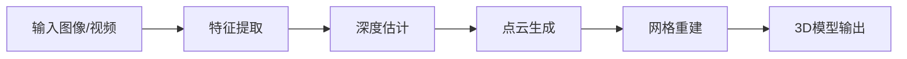

**技术特色**：
- 基于Rust语言实现，提供高性能3D重建能力
- 支持多种输入格式，包括图像序列和视频
- 采用先进的计算机视觉算法进行深度估计

#### 热度分析

- 项目获得4386个Star且单日增长81个，表明在3D重建领域具有较高的关注度和活跃度
- 0个Open Issues可能表明项目维护良好，社区参与度较高

#### 快速上手

```bash
# 克隆仓库
git clone https://github.com/ArthurBrussee/brush.git
# 进入项目目录
cd brush
# 运行项目
cargo run
```

#### 注意事项

- 由于许可证未知，商业使用前需确认授权方式
- 项目可能需要较高的计算资源，特别是处理大型3D重建任务时


### 17. Greedeks/GTweak — Windows系统优化工具

> **一句话总结**：便携式Windows系统一键配置工具，简化系统设置与优化流程。

#### 价值主张

| 维度 | 说明 |
|------|------|
| **解决痛点** | 解决Windows系统配置繁琐、需手动修改注册表和系统设置的问题 |
| **目标用户** | 需频繁重装系统或希望快速配置Windows环境的用户 |
| **核心亮点** | 便携式无需安装 + 一键优化系统设置 + 支持多Windows版本 |

#### 技术架构


**技术特色**：
- 基于C#开发的跨Windows版本兼容工具
- 便携式设计，无需安装即可运行
- 通过直接调用Windows API实现系统配置修改

#### 热度分析

- 近期新增75个Star，关注度快速增长，显示工具实用价值获得认可
- Issues数量为零，表明项目维护良好或功能已相对完善

#### 快速上手

```bash
# 下载GTweak.exe
# 直接运行无需安装
# 通过图形界面选择需要优化的项目
```

#### 注意事项

- 由于项目许可证未知，使用前需确认授权条款
- 修改系统设置可能存在风险，建议在测试环境中先试用
- 运行可能需要管理员权限才能修改某些系统设置


### 18. ton-blockchain/acton — TON工具链

> **一句话总结**：TON智能合约全流程开发工具链，提供编译、测试与部署支持

#### 价值主张

| 维度 | 说明 |
|------|------|
| **解决痛点** | TON智能合约开发工具链缺失，提供统一开发环境 |
| **目标用户** | TON区块链开发者、智能合约编写人员 |
| **核心亮点** | Rust实现 + 智能合约编译 + 开发工具集成 + 测试框架 |

#### 技术架构

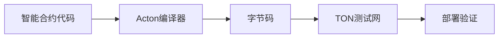

**技术特色**：
- 基于Rust语言开发，提供高性能工具链
- 专为TON区块链优化的编译与部署流程
- 提供完整的智能合约生命周期管理

#### 热度分析

- 项目近期增长明显，18个新增Star显示关注度上升
- Fork数相对较少，项目可能处于早期阶段，社区生态正在形成

#### 快速上手

```bash
cargo install acton
acton new my_contract
acton build
```

#### 注意事项

- 项目License未知，使用前需确认开源许可
- 项目处于早期阶段，API和功能可能不稳定
- 需要一定的TON区块链基础知识才能有效使用工具链


### 19. influxdata/telegraf — 多源数据采集器

> **一句话总结**：轻量级、插件化数据收集代理，支持多种输入输出，专为监控和日志场景设计。

#### 价值主张

| 维度 | 说明 |
|------|------|
| **解决痛点** | 统一收集多种数据源，简化监控和日志收集流程 |
| **目标用户** | 运维工程师、DevOps团队、监控系统管理员 |
| **核心亮点** | 插件化架构 + 高性能 + 低资源占用 + 丰富的数据输出支持 + 简单配置 |

#### 技术架构

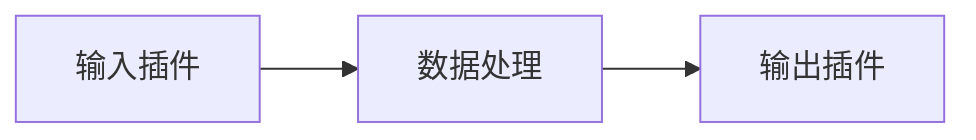

**技术特色**：
- 基于 Go 语言开发，性能优异且资源占用低
- 插件化架构，支持丰富的输入输出插件
- 内置数据处理功能，如过滤、聚合、转换等

#### 热度分析

- 作为 InfluxData 生态系统的重要组成部分，保持稳定的高增长趋势
- 在监控和数据收集领域占据重要位置，社区活跃度高

#### 快速上手

```bash
# 安装 Telegraf
wget https://dl.influxdata.com/telegraf/releases/telegraf-1.22.0_linux_amd64.tar.gz
tar -xvf telegraf-1.22.0_linux_amd64.tar.gz
# 运行配置向导
./telegraf config > telegraf.conf
# 启动 Telegraf
./telegraf -config telegraf.conf
```

#### 注意事项

- 配置文件相对复杂，初次使用可能需要一定学习成本
- 插件众多，但某些小众插件可能存在稳定性问题
- 对于大规模部署，建议使用配置管理工具统一管理配置文件


## 今日推荐

| 主题 | 推荐项目 | 亮点 |
|------|----------|------|
| 今日最热 | [mattpocock/skills](https://github.com/mattpocock/skills) | Skills for Real E... |
| 值得关注 | [CloakHQ/CloakBrowser](https://github.com/CloakHQ/CloakBrowser) | Stealth Chromium ... |
| 快速上手 | [tinyhumansai/openhuman](https://github.com/tinyhumansai/openhuman) | Your Personal AI ... |
| 长期潜力 | [obra/superpowers](https://github.com/obra/superpowers) | An agentic skills... |

---

<div align="center">

*Generated on 2026-05-14 | Powered by GitHub Trending Reporter*

</div>