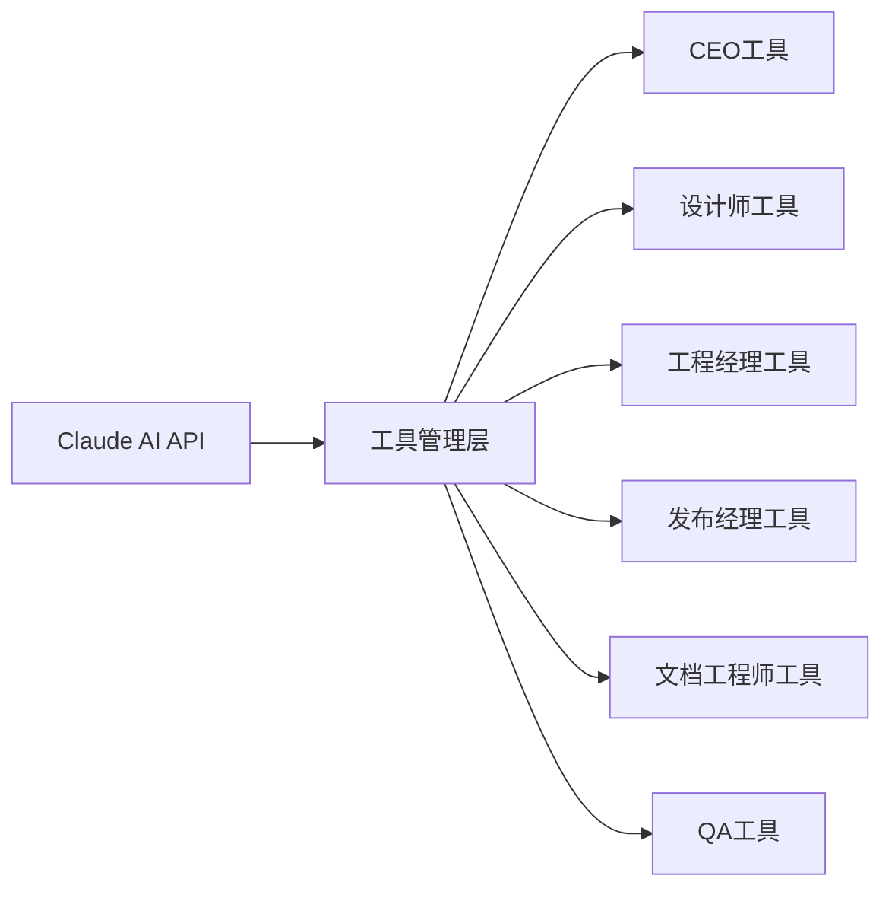

## 今日热点

今日GitHub热榜项目精彩纷呈。

---

## 热门项目一览

| 排名 | 项目 | 语言 | 今日 | 总计 | 简介 |
|:---:|------|:----:|------:|-----:|------|
| 1 | [tinyhumansai/openhuman](https://github.com/tinyhumansai/openhuman) | Rust | +3,329 | 7,854 | Your Personal AI super inte... |
| 2 | [mattpocock/skills](https://github.com/mattpocock/skills) | Shell | +2,987 | 82,548 | Skills for Real Engineers. ... |
| 3 | [rohitg00/agentmemory](https://github.com/rohitg00/agentmemory) | TypeScript | +1,879 | 9,042 | #1 Persistent memory for AI... |
| 4 | [obra/superpowers](https://github.com/obra/superpowers) | Shell | +1,780 | 191,340 | An agentic skills framework... |
| 5 | [ruvnet/RuView](https://github.com/ruvnet/RuView) | Rust | +1,715 | 56,144 | π RuView turns commodity Wi... |
| 6 | [CloakHQ/CloakBrowser](https://github.com/CloakHQ/CloakBrowser) | Python | +1,354 | 10,984 | Stealth Chromium that passe... |
| 7 | [github/spec-kit](https://github.com/github/spec-kit) | Python | +1,232 | 99,560 | 💫 Toolkit to help you get s... |
| 8 | [supertone-inc/supertonic](https://github.com/supertone-inc/supertonic) | Swift | +1,128 | 5,391 | Lightning-Fast, On-Device, ... |
| 9 | [garrytan/gstack](https://github.com/garrytan/gstack) | TypeScript | +915 | 96,850 | Use Garry Tan's exact Claud... |
| 10 | [Genymobile/scrcpy](https://github.com/Genymobile/scrcpy) | C | +851 | 141,405 | Display and control your An... |
| 11 | [K-Dense-AI/scientific-agent-skills](https://github.com/K-Dense-AI/scientific-agent-skills) | Python | +654 | 21,846 | A set of ready to use Agent... |
| 12 | [shiyu-coder/Kronos](https://github.com/shiyu-coder/Kronos) | Python | +363 | 24,867 | Kronos: A Foundation Model ... |

---

## 趋势洞察

```
┌─────────────────────────────────────────────────────────────────┐
│  AI/ML 工具         ████████████████████████  8 个项目        │
│  其他               ████████████              4 个项目        │
│  开发工具             ██████                    2 个项目        │
│  多媒体应用            ███                       1 个项目        │
└─────────────────────────────────────────────────────────────────┘
```

---

## 项目深度解读

### 1. tinyhumansai/openhuman — 个人AI超级助手

> **一句话总结**：注重隐私的个人超级AI助手，简单易用且功能强大。

#### 价值主张

| 维度 | 说明 |
|------|------|
| **解决痛点** | 提供私密、强大的个人AI助手，解决数据隐私与功能强大之间的矛盾 |
| **目标用户** | 重视隐私的个人用户，需要强大AI辅助但担心数据安全的用户 |
| **核心亮点** | 隐私保护 + 极简设计 + 强大功能 + 本地部署 + AI超级智能 |

#### 技术架构


**技术特色**：
- 基于Rust构建，内存安全且高性能
- 强调本地化处理，保护用户隐私
- 极简设计理念，降低使用门槛

#### 热度分析

- 项目近期获得大量关注，单日新增Star超过3300，显示强烈市场热度
- Fork数量相对较少，表明项目可能处于早期阶段，社区贡献尚未大规模展开

#### 快速上手

```bash
# 克隆项目
git clone https://github.com/tinyhumansai/openhuman.git
# 进入目录
cd openhuman
# 构建项目
cargo build --release
```

#### 注意事项

- 项目License未知，使用前需确认授权条款
- 作为AI助手，可能需要计算资源支持，低配置设备可能体验不佳
- 项目处于早期阶段，功能可能尚不稳定


### 2. mattpocock/skills — 工程师技能库

> **一句话总结**：一个收集真实工程师实用技能的Shell脚本集合，直接来源于作者Claude AI配置经验。

#### 价值主张

| 维度 | 说明 |
|------|------|
| **解决痛点** | 提供工程师日常工作中实用的Shell技能和配置，提高工作效率 |
| **目标用户** | 开发者、系统管理员、DevOps工程师 |
| **核心亮点** | 实用性强 + 来源于实践 + 涵盖多种工程场景 + 持续更新 |

#### 技术架构


**技术特色**：
- 基于Shell脚本实现，跨平台兼容性强
- 直接来源于作者的Claude配置实践经验
- 提供模块化的工程技能和工具集

#### 热度分析

- 项目获得82,548个Star，单日增长近3,000，显示极高的社区认可度和增长势头
- 7,130个Fork表明开发者社区积极参与项目贡献和二次开发
- 0个Open Issues反映项目维护良好，用户问题得到及时解决

#### 快速上手

```bash
# 克隆项目
git clone https://github.com/mattpocock/skills.git

# 进入项目目录
cd skills

# 查看可用脚本
ls -la
```

#### 注意事项

- 项目许可证未知，商业使用前需确认授权方式
- Shell脚本在不同操作系统上可能需要适配
- 使用前建议阅读项目文档了解各脚本功能和使用场景


### 3. rohitg00/agentmemory — AI记忆系统

> **一句话总结**：为AI编程代理提供基于真实世界基准的持久化记忆功能，增强长期上下文理解能力。

#### 价值主张

| 维度 | 说明 |
|------|------|
| **解决痛点** | 解决AI代理长期记忆缺失和上下文理解局限问题 |
| **目标用户** | AI应用开发者、智能代理系统构建者 |
| **核心亮点** | 基于真实世界基准 + 持久化记忆 + 上下文增强 + 实时更新 |

#### 技术架构


**技术特色**：
- 基于真实世界基准的记忆系统
- 持久化存储机制
- 高效记忆检索算法

#### 热度分析

- 项目获得9042个Star，近期增长迅猛，单日增长达1879个，表明社区高度关注
- 相对较少的Fork数(747)可能表明项目处于早期阶段，用户更多在关注而非使用

#### 快速上手

```bash
# 安装依赖
npm install agentmemory

# 基本使用
const agentMemory = new AgentMemory();
agentMemory.addMemory("用户偏好", "喜欢简洁代码");
const memories = agentMemory.getRelevantMemories("代码风格");
```

#### 注意事项

- 需要确保数据隐私和安全性，特别是存储用户相关记忆时
- 可能需要根据具体应用场景调整记忆检索策略


### 4. obra/superpowers — 智能开发框架

> **一句话总结**：基于代理技能的开发框架，提供实用的软件工程方法论。

#### 价值主张

| 维度 | 说明 |
|------|------|
| **解决痛点** | 解决软件开发效率与质量平衡问题 |
| **目标用户** | 软件开发团队和个人开发者 |
| **核心亮点** | 代理技能框架 + 实用方法论 + 工作流程优化 |

#### 技术架构


**技术特色**：
- 基于Shell脚本实现跨平台兼容
- 采用代理技能自动化开发流程
- 提供完整的开发生命周期支持

#### 热度分析

- 超过19万星，近1.8万日增，表明项目热度极高且持续增长
- 在开发者工具和方法论领域具有重要影响力，成为行业标准参考

#### 快速上手

```bash
# 克隆仓库
git clone https://github.com/obra/superpowers.git
# 进入目录
cd superpowers
# 运行安装脚本
./install.sh
```

#### 注意事项

- 项目使用Shell脚本，需要在类Unix系统上运行
- 可能需要配置特定的环境变量或依赖项
- 项目文档可能需要进一步阅读以正确应用方法论


### 5. ruvnet/RuView — 无摄像头感知

> **一句话总结**：利用普通WiFi信号实现实时空间感知、生命体征监测和存在检测，无需任何视频。

#### 价值主张

| 维度 | 说明 |
|------|------|
| **解决痛点** | 解决隐私保护下的空间感知和生命体征监测需求 |
| **目标用户** | 注重隐私的智能家居、医疗监护和安全监控用户 |
| **核心亮点** | 无摄像头感知 + 实时监测 + 隐私保护 + 普通硬件支持 |

#### 技术架构


**技术特色**：
- 基于WiFi信号的非视觉感知技术
- 利用信号变化检测人体活动和生命体征
- 实时处理低延迟空间感知算法
- 普通商用WiFi硬件即可实现

#### 热度分析

- 项目Star数超过5.6万，近期增长迅速，单日新增1700+星，显示技术热点和社区关注度高
- 零Open Issues表明项目成熟度高，社区问题解决效率高，维护活跃

#### 快速上手

```bash
# 安装RuView
cargo install ruview

# 运行WiFi感知监测
ruview --interface wlan0 --monitor vital_signs
```

#### 注意事项

- 项目需要支持WiFi监听的硬件环境
- 信号强度和墙体材质可能影响检测精度
- 需要考虑隐私合规性问题，特别是涉及生命体征数据时


### 6. CloakHQ/CloakBrowser — 隐形浏览器技术

> **一句话总结**：一款能通过所有机器人检测的隐形Chromium，可作为Playwright的无缝替代品。

#### 价值主张

| 维度 | 说明 |
|------|------|
| **解决痛点** | 解决自动化工具和爬虫被网站通过浏览器指纹识别的问题 |
| **目标用户** | 需要绕过反爬虫机制的自动化测试人员和数据采集者 |
| **核心亮点** | 源级指纹修补 + 30/30测试通过率 + Playwright完全兼容 |

#### 技术架构


**技术特色**：
- 源级浏览器指纹修补技术，从根本上改变浏览器特征
- 完全兼容Playwright API，无需修改现有测试代码
- 通过30项严格的反检测测试，确保高通过率

#### 热度分析

- 项目近期Star增长迅猛(+1,354)，表明市场需求旺盛
- 零开放问题，反映项目成熟度高且维护良好

#### 快速上手

```bash
# 安装
pip install cloak-browser

# 基本使用
from cloak_browser import Browser
browser = Browser()
browser.goto("https://example.com")
print(browser.title())
```

#### 注意事项

- 使用此工具可能违反某些网站的服务条款，请确保合规使用
- 长期有效性取决于反检测技术的持续更新，需关注项目维护情况
- 仅适用于合法合规的数据采集和自动化测试场景


### 7. github/spec-kit — 规范驱动工具包

> **一句话总结**：提供规范驱动开发工具集，帮助开发者先定义规范再实现代码，确保质量与一致性。

#### 价值主张

| 维度 | 说明 |
|------|------|
| **解决痛点** | 解决开发过程中缺乏明确规范和标准的问题，减少返工和沟通成本 |
| **目标用户** | 需要规范化开发流程的团队和个人开发者 |
| **核心亮点** | 规范模板库 + 自动验证工具 + 团队协作支持 + 文档生成 + 最佳实践指南 |

#### 技术架构


**技术特色**：
- 基于YAML/JSON的规范定义格式，易于理解和维护
- 提供多语言代码生成器，支持主流编程语言
- 集成持续验证机制，确保规范与实现一致性
- 支持团队协作和版本控制的最佳实践

#### 热度分析

- 项目获得近10万星，近期增长迅速，表明规范驱动开发方法受到广泛关注
- 高Fork数和零Open Issues反映社区活跃度高且问题解决及时

#### 快速上手

```bash
# 安装spec-kit
pip install spec-kit

# 创建新规范项目
spec-kit init my-project

# 生成规范模板
spec-kit generate template --type api

# 验证规范实现
spec-kit validate
```

#### 注意事项

- 规范驱动开发初期投入成本较高，需要团队共同学习和适应
- 工具集可能需要根据项目具体需求进行定制和扩展
- 确保团队成员对规范理解一致，避免因理解偏差导致的实现差异


### 8. supertone-inc/supertonic — 高效原生TTS

> **一句话总结**：基于Swift和ONNX构建的极快、设备端多语言文本转语音引擎，无需云端支持。

#### 价值主张

| 维度 | 说明 |
|------|------|
| **解决痛点** | 传统TTS依赖云端、延迟高、隐私问题，本地化处理受限。 |
| **目标用户** | 移动应用开发者、语音助手构建者、注重隐私的用户。 |
| **核心亮点** | 闪电速度 + 设备端运行 + 多语言支持 + ONNX原生实现 + 隐私保护 |

#### 技术架构


**技术特色**：
- 基于Swift实现，充分利用苹果平台性能优势
- 采用ONNX作为运行时，确保模型的高效执行
- 支持多语言模型，无需网络连接即可运行

#### 热度分析

- 近期Star增长迅速(+1,128今日)，表明项目受到广泛关注，可能发布了重要更新
- Fork数相对较少，说明项目可能处于早期阶段，社区贡献模式尚未完全形成

#### 快速上手

```bash
# 克隆仓库
git clone https://github.com/supertone-inc/supertonic.git
# 进入项目目录
cd supertonic
# 添加到项目 (具体使用方式需查看项目文档)
```

#### 注意事项

- 项目许可证未知，商业使用前需确认授权条款
- 作为ONNX-based的TTS引擎，可能需要特定的模型文件才能完全运行
- 虽然支持多语言，但不同语言的语音质量和支持程度可能存在差异


### 9. garrytan/gstack — AI开发工具栈

> **一句话总结**：23个Claude驱动的工具集合，覆盖从CEO到QA的全角色软件开发辅助系统。

#### 价值主张

| 维度 | 说明 |
|------|------|
| **解决痛点** | 简化软件开发流程，通过AI工具链覆盖全角色需求 |
| **目标用户** | 开发团队、产品经理、技术负责人和独立开发者 |
| **核心亮点** | 多角色AI辅助 + 全流程覆盖 + 23个专业化工具 |

#### 技术架构



**技术特色**：
- 基于Claude API的AI驱动架构
- TypeScript实现，保证类型安全
- 模块化工具设计，便于扩展和维护

#### 热度分析

- 高Star增长(+915/天)显示开发者社区对AI开发工具栈的强烈需求
- Fork数高表明项目被广泛采用和二次开发，生态活跃

#### 快速上手

```bash
# 克隆项目
git clone https://github.com/garrytan/gstack.git

# 安装依赖
cd gstack && npm install

# 配置Claude API
export CLAUDE_API_KEY="your_api_key_here"

# 运行工具
npm run tool-name
```

#### 注意事项

- 需要Claude API密钥才能使用核心功能
- 工具链可能需要一定的学习成本才能最大化效用
- 某些高级功能可能需要付费订阅Claude服务


### 10. Genymobile/scrcpy — Android镜像控制工具

> **一句话总结**：轻量级开源工具，通过USB或无线网络实时镜像和控制Android设备屏幕。

#### 价值主张

| 维度 | 说明 |
|------|------|
| **解决痛点** | 解决Android设备屏幕镜像到电脑并远程控制的痛点，无需root即可实现高效操作 |
| **目标用户** | Android开发者、测试人员、需要大屏操作手机的用户 |
| **核心亮点** | 轻量级 + 低延迟 + 无需root + 跨平台支持 + 高性能 |

#### 技术架构


**技术特色**：
- 基于Android ADB实现无需root的屏幕捕获
- 采用H.264/H.265编码实现高效传输
- 低延迟设计，提供接近原生的操作体验

#### 热度分析

- 项目Star数超过14万，近期每日新增约850个Star，增长势头强劲，表明其在开发者社区中广受欢迎
- 作为Android开发工具链中的重要组件，已成为安卓调试、测试和演示的标准工具之一

#### 快速上手

```bash
# 安装scrcpy
sudo apt install scrcpy  # Ubuntu/Debian
# 连接Android设备并启动
adb tcpip 5555  # 设置无线连接（可选）
scrcpy
```

#### 注意事项

- 首次使用需在Android设备上启用"USB调试"选项
- 无线连接时需确保设备与电脑在同一网络
- 高分辨率视频流可能需要较强性能的PC设备


### 11. K-Dense-AI/scientific-agent-skills — 科研AI技能库

> **一句话总结**：提供多领域即用型AI代理技能，覆盖科研、工程、金融等专业任务处理。

#### 价值主张

| 维度 | 说明 |
|------|------|
| **解决痛点** | 解决专业人士缺乏现成AI工具集的问题，提供专业领域即用型技能 |
| **目标用户** | 研究人员、科学家、工程师、分析师、金融专业人士和内容创作者 |
| **核心亮点** | 预构建专业领域技能 + 模块化设计 + 即插即用接口 + 多领域覆盖 |

#### 技术架构


**技术特色**：
- 多领域专业化AI技能集
- 模块化设计便于扩展集成
- 统一的技能调用接口

#### 热度分析

- 项目获2.1万Star且单日增长654，表明正处于快速增长期并受高度关注
- 零开放Issues反映项目维护良好或问题解决机制高效

#### 快速上手

```bash
# 安装项目
pip install scientific-agent-skills

# 导入并使用技能
from scientific_agent_skills import ResearchSkill
skill = ResearchSkill()
result = skill.analyze_data("dataset.csv")
```

#### 注意事项

- 需确认Python版本兼容性要求
- 部分技能可能需要额外API密钥或服务配置
- 建议查阅官方文档了解各技能的具体应用场景和限制


### 12. shiyu-coder/Kronos — 金融语言模型

> **一句话总结**：专为金融市场设计的开源基础模型，支持金融文本理解与市场分析。

#### 价值主张

| 维度 | 说明 |
|------|------|
| **解决痛点** | 金融领域缺乏专业大语言模型，通用模型难以处理复杂金融术语 |
| **目标用户** | 金融分析师、量化交易员、投资研究人员、金融科技开发者 |
| **核心亮点** | 金融专业知识 + 专业术语理解 + 市场趋势分析 + 多语言支持 |

#### 技术架构


**技术特色**：
- 基于Transformer架构的金融领域预训练模型
- 专为金融文本优化的专业词汇库和知识图谱
- 支持多种金融任务（市场分析、风险评估、投资建议等）

#### 热度分析

- 项目获得24k+星标，增长迅速，显示金融AI领域高度关注
- Fork数达4k+，表明社区活跃且有大量实际应用和二次开发

#### 快速上手

```bash
# 安装Kronos
pip install kronos-ai

# 基本使用示例
python -m kronos.analyze --input "market_report.txt" --task sentiment
```

#### 注意事项

- 模型输出仅供参考，不应作为唯一的投资决策依据
- 金融数据隐私保护需严格遵守相关法规
- 模型需定期更新以适应金融市场变化


### 13. influxdata/telegraf — 多源数据采集器

> **一句话总结**：轻量级开源数据采集代理，支持多种输入输出插件，实现全方位数据监控。

#### 价值主张

| 维度 | 说明 |
|------|------|
| **解决痛点** | 解决多源异构数据统一采集与处理的难题 |
| **目标用户** | 运维工程师、DevOps团队、监控平台建设者 |
| **核心亮点** | 插件化架构 + 轻量级设计 + 高性能处理 + 丰富的数据源支持 |

#### 技术架构


**技术特色**：
- 基于插件架构，支持超过200种输入输出类型
- 内存缓冲设计确保数据不丢失
- 支持数据过滤和聚合处理，减少数据传输量

#### 热度分析

- 项目持续稳定增长，近半年新增stars超过1000，反映社区认可度持续提升
- 作为InfluxData生态核心组件，与InfluxDB、Chronograf等产品形成完整监控解决方案

#### 快速上手

```bash
# 安装Telegraf
wget https://dl.influxdata.com/telegraf/releases/telegraf_1.21.0_amd64.deb
sudo dpkg -i telegraf_1.21.0_amd64.deb

# 生成配置文件
sudo telegraf config > telegraf.conf

# 启动服务
sudo systemctl start telegraf
```

#### 注意事项
- 配置文件较为复杂，建议使用Telegraf配置生成器辅助
- 大规模部署时需注意内存和CPU资源消耗
- 定期更新版本以获取新特性和安全修复


### 14. roboflow/supervision — 计算机视觉工具集

> **一句话总结**：全面的计算机视觉工具库，提供丰富的预构建功能，简化计算机视觉应用开发流程。

#### 价值主张

| 维度 | 说明 |
|------|------|
| **解决痛点** | 解决计算机视觉开发中重复造轮子问题，提供即用型工具降低开发门槛 |
| **目标用户** | 计算机视觉开发人员、AI研究员、数据科学家和机器学习工程师 |
| **核心亮点** | 丰富的预构建计算机视觉功能 + 简洁易用的API设计 + 与主流框架无缝集成 |

#### 技术架构


**技术特色**：
- 提供超过100种预实现的计算机视觉算法
- 与OpenCV、PyTorch、TensorFlow等主流框架深度集成
- 采用模块化设计，支持灵活组合使用

#### 热度分析

- 项目获得近39,000 stars，且持续稳定增长，表明其在计算机视觉领域具有重要影响力
- 作为roboflow生态系统的重要组成部分，与数据标注平台形成互补，构建完整CV开发闭环

#### 快速上手

```bash
# 安装supervision
pip install supervision

# 基本使用示例
import supervision as sv
from ultralytics import YOLO

model = YOLO('yolov8n.pt')
detector = sv.Detector(model)
results = detector.predict('image.jpg')
```

#### 注意事项

- 需要了解基本的计算机视觉概念才能有效使用
- 某些高级功能可能需要额外依赖
- 与其他roboflow产品配合使用可获得最佳体验


### 15. NVIDIA-AI-Blueprints/video-search-and-summarization — 视频AI解决方案

> **一句话总结**：基于NVIDIA GPU加速的参考架构套件，用于构建AI驱动的视频搜索和摘要系统。

#### 价值主张

| 维度 | 说明 |
|------|------|
| **解决痛点** | 解决传统视频分析处理速度慢、资源消耗大的问题，提供高性能GPU加速方案 |
| **目标用户** | AI开发者、视频分析工程师、企业级视频处理平台构建者 |
| **核心亮点** | GPU加速 + 视频智能分析 + 可扩展架构 + 多模态处理 + 高性能优化 |

#### 技术架构


**技术特色**：
- 基于NVIDIA GPU的深度学习加速技术
- 多模态视频内容理解与特征提取
- 高效的视频索引和智能检索机制

#### 热度分析

- 项目获得869颗星，近期增长显著(+62)，显示社区高度关注与实用价值
- Fork数247，表明项目具有良好的可扩展性和二次开发潜力

#### 快速上手

```bash
git clone https://github.com/NVIDIA-AI-Blueprints/video-search-and-summarization
cd video-search-and-summarization
pip install -r requirements.txt
python setup.py install
```

#### 注意事项

- 需要NVIDIA GPU硬件支持以获得最佳性能
- 可能需要安装特定版本的CUDA和cuDNN环境
- 代码需要根据具体应用场景进行定制化调整
- 项目文档可能需要进一步完善以提高可用性


## 今日推荐

| 主题 | 推荐项目 | 亮点 |
|------|----------|------|
| 今日最热 | [tinyhumansai/openhuman](https://github.com/tinyhumansai/openhuman) | Your Personal AI ... |
| 值得关注 | [mattpocock/skills](https://github.com/mattpocock/skills) | Skills for Real E... |
| 快速上手 | [rohitg00/agentmemory](https://github.com/rohitg00/agentmemory) | #1 Persistent mem... |
| 长期潜力 | [obra/superpowers](https://github.com/obra/superpowers) | An agentic skills... |

---

<div align="center">

*Generated on 2026-05-15 | Powered by GitHub Trending Reporter*

</div>