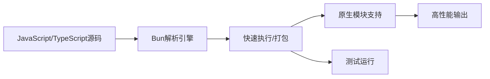

## 今日热点

AI代理技能生态系统快速崛起，边缘计算与设备端AI应用成为新热点，开发者工具持续集成AI功能，多模态AI技术深入垂直领域应用。

---

## 热门项目一览

| 排名 | 项目 | 语言 | 今日 | 总计 | 简介 |
|:---:|------|:----:|------:|-----:|------|
| 1 | [mattpocock/skills](https://github.com/mattpocock/skills) | Shell | +3,132 | 85,050 | Skills for Real Engineers. ... |
| 2 | [ruvnet/RuView](https://github.com/ruvnet/RuView) | Rust | +1,859 | 57,541 | π RuView turns commodity Wi... |
| 3 | [obra/superpowers](https://github.com/obra/superpowers) | Shell | +1,648 | 192,880 | An agentic skills framework... |
| 4 | [tinyhumansai/openhuman](https://github.com/tinyhumansai/openhuman) | Rust | +1,271 | 9,108 | Your Personal AI super inte... |
| 5 | [supertone-inc/supertonic](https://github.com/supertone-inc/supertonic) | Swift | +719 | 6,074 | Lightning-Fast, On-Device, ... |
| 6 | [anthropics/skills](https://github.com/anthropics/skills) | Python | +689 | 135,184 | Public repository for Agent... |
| 7 | [K-Dense-AI/scientific-agent-skills](https://github.com/K-Dense-AI/scientific-agent-skills) | Python | +646 | 22,484 | A set of ready to use Agent... |
| 8 | [oven-sh/bun](https://github.com/oven-sh/bun) | Rust | +448 | 90,629 | Incredibly fast JavaScript ... |
| 9 | [joeseesun/qiaomu-anything-to-notebooklm](https://github.com/joeseesun/qiaomu-anything-to-notebooklm) | Python | +438 | 2,732 | Claude Skill: Multi-source ... |
| 10 | [NVIDIA-AI-Blueprints/video-search-and-summarization](https://github.com/NVIDIA-AI-Blueprints/video-search-and-summarization) | Python | +308 | 1,167 | Suite of reference architec... |
| 11 | [influxdata/telegraf](https://github.com/influxdata/telegraf) | Go | +212 | 17,421 | Agent for collecting, proce... |
| 12 | [czlonkowski/n8n-mcp](https://github.com/czlonkowski/n8n-mcp) | TypeScript | +68 | 20,906 | A MCP for Claude Desktop / ... |

---

## 趋势洞察

```
┌─────────────────────────────────────────────────────────────────┐
│  AI/ML 工具         ████████████████████████  9 个项目        │
│  其他               █████                     2 个项目        │
│  多媒体应用            ██                        1 个项目        │
└─────────────────────────────────────────────────────────────────┘
```

---

## 项目深度解读

### 1. mattpocock/skills — 工程师技能集

> **一句话总结**：实用 Shell 脚本集合，提升工程师日常工作效率的技能库。

#### 价值主张

| 维度 | 说明 |
|------|------|
| **解决痛点** | 提供即用型脚本解决工程师日常任务，减少重复工作 |
| **目标用户** | 开发者、系统管理员、DevOps 工程师 |
| **核心亮点** | 实用性强 + 直接可用 + 覆盖面广 + 持续更新 |

#### 技术架构

**技术特色**：
- 使用纯 Shell 脚本，跨平台兼容性强
- 脚本模块化设计，便于组合使用
- 轻量级实现，无需额外依赖

#### 热度分析

- 项目获得超过85,000星，单日增长3,000+，表明工程师社区对此类实用工具需求旺盛
- Fork 数量相对较少，说明用户更倾向于直接使用而非二次开发，工具实用性高

#### 快速上手

```bash
# 克隆项目
git clone https://github.com/mattpocock/skills.git

# 进入目录并查看可用技能
cd skills && ls
```

#### 注意事项

- 需要基本的 Shell 知识才能理解和修改脚本
- 某些脚本可能需要特定环境或权限才能正常运行
- 由于项目持续更新，建议定期获取最新版本


### 2. ruvnet/RuView — 无视觉感知系统

> **一句话总结**：利用普通WiFi信号实现空间智能、生命体征监测和存在检测，无需任何视频采集。

#### 价值主张

| 维度 | 说明 |
|------|------|
| **解决痛点** | 解决无摄像头环境下的空间感知和生命体征监测需求 |
| **目标用户** | 需要非接触式监测的医疗机构、智能家居和安防系统 |
| **核心亮点** | 利用普通WiFi信号 + 实时空间智能 + 生命体征监测 + 隐私保护 |

#### 技术架构


**技术特色**：
- 利用商用WiFi设备实现非视觉感知
- 通过信号波动分析人体活动和生命体征
- 无需摄像头保护用户隐私安全
- 实时处理低延迟响应系统

#### 热度分析

- Star数高达57,541且单日增长1,859，显示项目受到广泛关注和认可
- Fork数7,553表明社区活跃度高，有大量开发者参与项目改进和应用

#### 快速上手

```bash
# 安装RuView
cargo install ruview

# 运行监测
ruview monitor --interface wlan0
```

#### 注意事项

- 需要支持WiFi监听模式的网络接口
- 隐私保护需注意数据存储和传输安全
- 可能需要特定的硬件配置才能获得最佳效果


### 3. obra/superpowers — 智能技能框架

> **一句话总结**：一个实用的代理技能框架和软件开发方法论，帮助提升开发效率和能力。

#### 价值主张

| 维度 | 说明 |
|------|------|
| **解决痛点** | 解决软件开发中技能碎片化和方法论缺失的问题 |
| **目标用户** | 软件开发者、技术团队和工程管理者 |
| **核心亮点** | 实用性 + 方法论完整 + 框架灵活 + 持续改进 |

#### 技术架构


**技术特色**：
- 基于Shell脚本实现，跨平台兼容性好
- 采用模块化设计，易于扩展和维护
- 强调实践与反馈的循环迭代

#### 热度分析

- 项目获得近20万Stars，近1.7万Forks，增长势头强劲
- 作为方法论类项目，社区参与度高，影响力广泛

#### 快速上手

```bash
# 克隆项目
git clone https://github.com/obra/superpowers.git
# 进入项目目录
cd superpowers
# 查看使用说明
./superpowers.sh
```

#### 注意事项

- 项目使用Shell脚本开发，确保您的系统支持Shell环境
- 需要一定的编程基础才能充分利用框架价值
- 项目没有明确的开源许可证，使用时需注意法律风险


### 4. tinyhumansai/openhuman — 个人AI助手

> **一句话总结**：隐私优先的个人AI超级智能，简单易用且功能强大

#### 价值主张

| 维度 | 说明 |
|------|------|
| **解决痛点** | 解决个人数据隐私与AI强大功能之间的矛盾 |
| **目标用户** | 注重隐私的个人用户和开发者 |
| **核心亮点** | 本地部署 + 强大AI能力 + 简单易用 + 高性能 |

#### 技术架构


**技术特色**：
- 基于Rust编写，提供内存安全和高性能
- 本地AI模型运行，确保数据不离开用户设备
- 简洁的API设计，降低使用门槛
- 高效的资源管理，适合个人设备部署

#### 热度分析

- 项目近期增长迅猛，单日增加超过1200个Star，显示出极高的社区关注度
- 作为隐私优先的AI项目，在数据隐私意识增强的环境下具有独特优势

#### 快速上手

```bash
# 克隆仓库
git clone https://github.com/tinyhumansai/openhuman.git

# 构建项目
cd openhuman
cargo build --release

# 运行AI助手
./target/release/openhuman
```

#### 注意事项

- 项目许可证未知，使用前需确认开源许可条款
- 作为新兴项目，API和功能可能存在较大变化
- 本地AI模型可能需要较高计算资源
- 项目可能仍在开发中，部分功能可能不完善


### 5. supertone-inc/supertonic — 高性能TTS引擎

> **一句话总结**：Swift编写的轻量级多语言文本转语音引擎，通过ONNX实现设备端高速运行。

#### 价值主张

| 维度 | 说明 |
|------|------|
| **解决痛点** | 解决传统TTS延迟高、依赖云端、多语言支持有限的问题 |
| **目标用户** | 需要离线TTS功能的开发者、移动应用开发者、语音交互产品团队 |
| **核心亮点** | 轻量级 + 多语言支持 + ONNX加速 + 离线运行 + Swift原生集成 |

#### 技术架构


**技术特色**：
- Swift与ONNX深度集成，提供高性能TTS体验
- 多语言模型支持，无需网络连接即可运行
- 轻量级设计，适合移动设备部署

#### 热度分析

- 项目Star数6074且单日新增719，表明项目正处于快速增长期，技术社区关注度极高
- Fork数599，表明社区参与度较高，可能已有多个分支或定制版本

#### 快速上手

```bash
# 在Xcode中添加依赖
swift package init
echo "dependencies: [.package(url: \"https://github.com/supertone-inc/supertonic\", from: \"1.0.0\")]" >> Package.swift
swift build
```

#### 注意事项

- 项目License未知，商业使用前需确认授权
- 作为ONNX集成项目，可能需要额外依赖ONNX运行时
- 多语言支持程度需具体测试确认，可能并非所有语言都达到最佳效果
- 需要确认模型文件大小，考虑移动设备存储限制


### 6. anthropics/skills — AI技能库

> **一句话总结**：Anthropic官方开源的AI代理技能库，提供标准化技能定义与执行框架。

#### 价值主张

| 维度 | 说明 |
|------|------|
| **解决痛点** | 解决AI代理能力模块化与可复用性问题 |
| **目标用户** | AI应用开发者、智能系统构建者 |
| **核心亮点** | 技能标准化框架 + 可组合性 + 扩展性强 + 类型安全 |

#### 技术架构


**技术特色**：
- 基于Python的类型注解系统，确保技能接口一致性
- 支持异步执行，提高技能调用效率
- 技能依赖管理与版本控制机制

#### 热度分析

- 项目星标超13万，日均增长600+，处于AI工具领域热度前列
- 作为Anthropic官方项目，在AI代理生态系统中占据核心位置

#### 快速上手

```bash
# 安装技能库
pip install anthropic-skills

# 初始化技能环境
anthropic-skills init my-agent

# 添加新技能
anthropic-skills add skill_name --description "技能描述"
```

#### 注意事项

- 项目许可证信息不明确，使用前需确认授权条款
- 技能系统可能与Claude模型紧密耦合，使用其他模型可能需要适配
- 建议在使用前充分阅读文档，理解技能定义的最佳实践


### 7. K-Dense-AI/scientific-agent-skills — 科学代理技能

> **一句话总结**：为科研、工程、金融等领域提供即用型AI代理技能集合，提升专业工作效率

#### 价值主张

| 维度 | 说明 |
|------|------|
| **解决痛点** | 专业领域工作缺乏高效AI工具，跨领域知识整合困难 |
| **目标用户** | 研究人员、工程师、分析师、金融从业者、内容创作者 |
| **核心亮点** | 预构建专业技能模块 + 跨领域应用支持 + 即插即用架构 + 高度可定制 |

#### 技术架构


**技术特色**：
- 模块化技能设计，支持专业领域特定功能
- 插件式架构，便于扩展新技能
- 跨领域知识融合，增强分析深度

#### 热度分析

- 项目Star数超过22k，单日增长600+，表明项目受到广泛关注和认可
- 零开放Issues反映项目维护良好，社区贡献积极，技术生态成熟

#### 快速上手

```bash
# 安装项目依赖
pip install scientific-agent-skills

# 导入所需技能模块
from scientific_agent_skills import ResearchSkill, AnalysisSkill

# 初始化并使用技能
researcher = ResearchSkill()
researcher.query("最新人工智能研究进展")
```

#### 注意事项

- 项目许可证不明确，使用前需确认具体授权条款
- 部分高级功能可能需要额外配置或API密钥
- 建议根据具体领域需求选择合适的技能模块组合使用


### 8. oven-sh/bun — 极速JS全栈工具

> **一句话总结**：用Rust重构的JavaScript全栈工具，提供比Node.js快10-100倍的一体化开发体验。

#### 价值主张

| 维度 | 说明 |
|------|------|
| **解决痛点** | 解决JavaScript工具链分散、性能瓶颈和配置复杂性问题 |
| **目标用户** | JavaScript/TypeScript开发者，特别是追求性能和工具链整合的用户 |
| **核心亮点** | 极致性能 + 一体化工具链 + 兼容Node.js API + TypeScript原生支持 + 测试运行器集成 |

#### 技术架构



**技术特色**：
- 使用JavaScriptCore引擎替代V8，提供更快的执行速度
- Rust编写的高性能JavaScript解析和执行引擎
- 内置WebSocket、HTTP等服务器功能，减少依赖

#### 热度分析

- Star数超9万且持续快速增长，日均增长约400+，显示开发者强烈兴趣
- 作为新兴技术栈，已形成活跃社区，但生态成熟度仍需时间验证

#### 快速上手

```bash
# 安装Bun
curl -fsSL https://bun.sh/install | bash

# 运行JavaScript文件
bun run index.js

# 安装依赖
bun install

# 运行测试
bun test
```

#### 注意事项

- 尚处于积极开发阶段，API可能不稳定
- 部分Node.js生态模块可能不完全兼容
- Windows支持仍在完善中


### 9. joeseesun/qiaomu-anything-to-notebooklm — 多源内容处理器

> **一句话总结**：将多源内容统一转换为NotebookLM支持的多种格式，提升内容处理效率。

#### 价值主张

| 维度 | 说明 |
|------|------|
| **解决痛点** | 解决多源内容难以统一处理和转换的痛点 |
| **目标用户** | 需要处理多种格式内容的研究者、教育工作者和内容创作者 |
| **核心亮点** | 多源输入支持 + 多格式输出 + NotebookLM集成 |

#### 技术架构


**技术特色**：
- 多源内容统一处理框架
- 支持主流内容格式解析
- 与NotebookLM深度集成

#### 热度分析

- 项目短期内Star增长迅速，今日增加438个Star，显示出社区高度关注
- 作为新兴内容处理工具，在AI辅助学习领域具有明显竞争优势

#### 快速上手

```bash
# 安装依赖
pip install -r requirements.txt

# 运行工具处理内容
python main.py --source_type wechat --input "article_url" --output_type podcast
```

#### 注意事项

- 需要确保NotebookLM API访问权限
- 不同内容格式可能需要额外的处理步骤
- 输出质量可能受原始内容质量影响


### 10. NVIDIA-AI-Blueprints/video-search-and-summarization — 视频AI架构参考

> **一句话总结**：提供GPU加速的视频搜索与AI分析参考架构，助力开发者构建高性能视频处理应用。

#### 价值主张

| 维度 | 说明 |
|------|------|
| **解决痛点** | 传统视频分析处理效率低下，难以实现实时大规模视频搜索与摘要 |
| **目标用户** | AI应用开发者、视频分析系统架构师、计算机视觉研究人员 |
| **核心亮点** | GPU加速处理 + 多模态视频分析 + 高效搜索算法 + 智能摘要生成 |

#### 技术架构


**技术特色**：
- 基于GPU的高效视频并行处理
- 多模态特征融合与语义理解
- 可扩展的微服务架构设计
- 实时处理与批量处理结合

#### 热度分析

- 项目单日激增308星，显示视频AI领域需求旺盛，技术关注度极高
- 作为NVIDIA官方项目，在AI视频处理领域具有权威性和行业引领作用

#### 快速上手

```bash
# 克隆项目
git clone https://github.com/NVIDIA-AI-Blueprints/video-search-and-summarization.git

# 安装依赖
cd video-search-and-summarization
pip install -r requirements.txt

# 运行示例
python examples/basic_video_search.py
```

#### 注意事项

- 项目需要NVIDIA GPU硬件以获得最佳性能，不支持纯CPU环境
- 需要安装NVIDIA相关软件栈如CUDA、cuDNN等以支持GPU加速
- 建议在使用前仔细阅读项目文档和示例代码，了解系统配置要求
- 处理高清视频时需要较大计算资源，建议在适当规模的数据集上测试


### 11. influxdata/telegraf — 多源数据收集器

> **一句话总结**：Telegraf是InfluxData开发的多源数据收集代理，支持数百种输入/输出插件，可收集处理各类指标和日志数据。

#### 价值主张

| 维度 | 说明 |
|------|------|
| **解决痛点** | 解决多源异构数据统一收集、处理和写入的复杂性问题 |
| **目标用户** | DevOps团队、监控工程师、IoT开发者、数据分析师 |
| **核心亮点** | 插件化架构 + 百种输入输出支持 + 低资源占用 + 高性能处理 + 配置简单 |

#### 技术架构


**技术特色**：
- 插件化架构设计，支持数百种输入/输出插件
- 轻量级Go实现，资源占用低，适合大规模部署
- 支持数据过滤、聚合和转换，提供强大的数据处理能力

#### 热度分析

- 项目星数持续稳定增长，近期日均增长约200+，表明社区活跃度高
- 作为InfluxData生态系统的核心组件，在监控和可观测性领域占据重要位置

#### 快速上手

```bash
# 安装Telegraf
wget https://dl.influxdata.com/telegraf/releases/telegraf-1.24.0_linux_amd64.tar.gz
tar -xvf telegraf-1.24.0_linux_amd64.tar.gz

# 配置Telegraf
cp telegraf.conf telegraf.conf.bak
nano telegraf.conf

# 启动Telegraf
./telegraf --config telegraf.conf
```

#### 注意事项

- 插件配置复杂度随数量增加而提高，建议分阶段逐步扩展
- 高频数据收集场景下需注意资源使用，适当调整收集间隔
- 输出目标故障时可能导致数据丢失，建议配置适当的缓冲和重试机制


### 12. czlonkowski/n8n-mcp — AI 工作流连接器

> **一句话总结**：将 n8n 工作流与 Claude AI 无缝集成的 MCP 协议实现，增强自动化工作流能力。

#### 价值主张

| 维度 | 说明 |
|------|------|
| **解决痛点** | 解决了 n8n 工作流与 Claude AI 难以直接集成的问题 |
| **目标用户** | 使用 n8n 和 Claude AI 的开发者与自动化工程师 |
| **核心亮点** | 无缝集成 + 智能工作流构建 + 多平台支持 |

#### 技术架构


**技术特色**：
- 基于 TypeScript 实现，类型安全且跨平台兼容
- 采用 MCP 协议标准，确保与 Claude 生态系统的互操作性
- 提供工作流构建能力，简化复杂自动化流程开发

#### 热度分析

- Star 数超过 2 万且持续增长(+68 today)，表明项目受到社区高度关注
- Fork 数适中，显示项目有良好的社区参与度和二次开发潜力

#### 快速上手

```bash
# 安装 n8n-mcp
npm install -g n8n-mcp

# 配置 Claude Desktop 使用 n8n-mcp
# 在 Claude Desktop 配置文件中添加 MCP 服务器路径
```

#### 注意事项

- 需要确保已安装 n8n 服务或实例
- 配置时需正确设置 API 端点和认证信息
- 不同 Claude 平台(Claude Desktop/Cursor等)的配置方式可能略有不同


## 今日推荐

| 主题 | 推荐项目 | 亮点 |
|------|----------|------|
| 今日最热 | [mattpocock/skills](https://github.com/mattpocock/skills) | Skills for Real E... |
| 值得关注 | [ruvnet/RuView](https://github.com/ruvnet/RuView) | π RuView turns co... |
| 快速上手 | [obra/superpowers](https://github.com/obra/superpowers) | An agentic skills... |
| 长期潜力 | [tinyhumansai/openhuman](https://github.com/tinyhumansai/openhuman) | Your Personal AI ... |

---

<div align="center">

*Generated on 2026-05-16 | Powered by GitHub Trending Reporter*

</div>