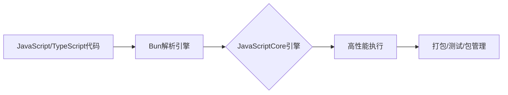

## 今日热点

今日GitHub热榜聚焦AI代理技能在各领域的应用，以及边缘计算与隐私保护技术，Rust语言项目表现亮眼，反映开发者对高效、安全解决方案的持续追求。

---

## 热门项目一览

| 排名 | 项目 | 语言 | 今日 | 总计 | 简介 |
|:---:|------|:----:|------:|-----:|------|
| 1 | [tinyhumansai/openhuman](https://github.com/tinyhumansai/openhuman) | Rust | +1,549 | 10,808 | Your Personal AI super inte... |
| 2 | [obra/superpowers](https://github.com/obra/superpowers) | Shell | +1,305 | 194,079 | An agentic skills framework... |
| 3 | [ruvnet/RuView](https://github.com/ruvnet/RuView) | Rust | +1,010 | 58,385 | π RuView turns commodity Wi... |
| 4 | [supertone-inc/supertonic](https://github.com/supertone-inc/supertonic) | Swift | +749 | 6,939 | Lightning-Fast, On-Device, ... |
| 5 | [K-Dense-AI/scientific-agent-skills](https://github.com/K-Dense-AI/scientific-agent-skills) | Python | +673 | 23,186 | A set of ready to use Agent... |
| 6 | [colbymchenry/codegraph](https://github.com/colbymchenry/codegraph) | TypeScript | +416 | 2,574 | Pre-indexed code knowledge ... |
| 7 | [oven-sh/bun](https://github.com/oven-sh/bun) | Rust | +397 | 91,274 | Incredibly fast JavaScript ... |
| 8 | [Anil-matcha/Open-Generative-AI](https://github.com/Anil-matcha/Open-Generative-AI) | JavaScript | +317 | 14,478 | Open-source alternative to ... |

---

## 趋势洞察

```
┌─────────────────────────────────────────────────────────────────┐
│  AI/ML 工具         ████████████████████████  5 个项目        │
│  其他               █████████                 2 个项目        │
│  多媒体应用            ████                      1 个项目        │
└─────────────────────────────────────────────────────────────────┘
```

---

## 项目深度解读

### 1. tinyhumansai/openhuman — 个人超级AI

> **一句话总结**：本地部署的私密AI助手，提供强大智能服务同时保障用户数据安全。

#### 价值主张

| 维度 | 说明 |
|------|------|
| **解决痛点** | 解决云端AI服务的隐私泄露问题，提供完全本地化的智能助手 |
| **目标用户** | 注重隐私、追求高性能AI能力的个人用户和小型团队 |
| **核心亮点** | 本地部署 + 高性能计算 + 完全私密 + 超强理解能力 |

#### 技术架构


**技术特色**：
- 基于Rust构建的高性能本地AI系统
- 端到端加密确保用户数据完全私密
- 优化的大语言模型实现提供接近ChatGPT的体验

#### 热度分析

- 项目近期Star数激增，显示用户对私密AI解决方案的强烈需求
- 高Fork/Star比例表明社区积极参与二次开发和功能扩展

#### 快速上手

```bash
# 克隆仓库
git clone https://github.com/tinyhumansai/openhuman.git
# 构建项目
cd openhuman && cargo build --release
# 运行应用
./target/release/openhuman
```

#### 注意事项

- 项目License信息不明确，使用前需确认授权条款
- 本地运行可能需要较高配置的硬件设备
- 需要一定的技术背景进行安装和配置


### 2. obra/superpowers — 智能开发框架

> **一句话总结**：基于Shell的智能代理技能框架，提供实用的软件开发方法论。

#### 价值主张

| 维度 | 说明 |
|------|------|
| **解决痛点** | 解决软件开发效率低下和方法论不统一问题，提供可执行的框架 |
| **目标用户** | Shell开发者、DevOps工程师、系统管理员和自动化脚本编写者 |
| **核心亮点** | 轻量级Shell实现 + 智能代理能力 + 实用开发方法论 + 高度可定制化 |

#### 技术架构


**技术特色**：
- 纯Shell实现，无外部依赖
- 模块化设计，易于扩展
- 脚本化代理交互模式

#### 热度分析

- 项目获得近20万星，近期增长迅速，表明开发者认可度高
- 作为Shell框架，填补了自动化脚本与高级方法论之间的空白

#### 快速上手

```bash
# 克隆项目
git clone https://github.com/obra/superpowers.git
cd superpowers

# 运行示例或初始化
./superpowers init
```

#### 注意事项

- 项目依赖Shell环境，需确保系统兼容性
- 可能需要阅读文档以理解完整的方法论框架


### 3. ruvnet/RuView — [WiFi感知系统]

> **一句话总结**：利用普通WiFi信号实现无摄像头空间感知、生命体征监测和存在检测的技术。

#### 价值主张

| 维度 | 说明 |
|------|------|
| **解决痛点** | 解决无摄像头情况下的空间感知和生命体征监测需求 |
| **目标用户** | 需要隐私保护的空间监测、健康监护和安防应用开发者 |
| **核心亮点** | 利用普通WiFi信号 + 实时空间智能 + 无视频隐私保护 + 多功能合一 |

#### 技术架构


**技术特色**：
- 基于WiFi信号的雷达式感知技术
- 利用机器学习进行信号模式识别
- 实现无接触式生命体征监测

#### 热度分析

- 项目获得5.8万星且持续增长，显示非视觉感知领域有巨大需求
- 高社区活跃度，7.6千次fork表明开发者积极参与

#### 快速上手

```bash
# 克隆仓库
git clone https://github.com/ruvnet/RuView.git
# 进入项目目录
cd RuView
# 构建项目
cargo build --release
```

#### 注意事项

- 需要特定的硬件支持才能发挥最佳效果
- 隐私保护是其核心优势，使用时需注意合规性
- 可能需要校准以适应不同环境


### 4. supertone-inc/supertonic — 极速多语言TTS

> **一句话总结**：基于Swift和ONNX的极速设备端多语言文本转语音解决方案

#### 价值主张

| 维度 | 说明 |
|------|------|
| **解决痛点** | 传统TTS服务延迟高、依赖云端、语言支持有限的问题 |
| **目标用户** | 需要本地化、低延迟TTS功能的应用开发者和内容创作者 |
| **核心亮点** | 极速响应 + 设备端运行 + 多语言支持 + ONNX优化 + Swift原生实现 |

#### 技术架构


**技术特色**：
- Swift语言实现，与Apple生态系统深度集成
- 基于ONNX的设备端推理，无需云端依赖
- 多语言模型支持，覆盖主要语言

#### 热度分析

- 项目近期热度显著上升，单日新增Star超过700，可能因重大更新
- Fork数适中，表明开发者社区关注度高但尚未广泛二次开发

#### 快速上手

```bash
# 克隆仓库
git clone https://github.com/supertone-inc/supertonic.git
# 进入项目目录
cd supertonic
# 安装依赖
swift package update
# 构建项目
swift build
```

#### 注意事项

- 项目需要Swift 5.0或更高版本支持
- ONNX模型文件需要单独下载并配置到项目中
- 设备端运行可能对设备性能有一定要求，特别是对于长文本处理


### 5. K-Dense-AI/scientific-agent-skills — 科研AI技能库

> **一句话总结**：为科研、工程等领域提供即用型AI Agent技能集合，提升工作效率和专业性。

#### 价值主张

| 维度 | 说明 |
|------|------|
| **解决痛点** | 解决各专业领域AI应用门槛高、开发成本大的问题 |
| **目标用户** | 研究人员、工程师、分析师、金融从业者、内容创作者 |
| **核心亮点** | 即插即用的专业AI技能模块 + 覆盖多学科领域 + 开源可定制 |

#### 技术架构


**技术特色**：
- 模块化AI技能设计，支持快速集成
- 多领域专业知识封装，降低应用门槛
- 开源可扩展架构，支持自定义技能

#### 热度分析

- 项目Star数超2.3万且近期增长迅速，社区认可度高
- Fork数适中，表明项目处于活跃迭代期，用户参与度良好

#### 快速上手

```bash
# 克隆项目
git clone https://github.com/K-Dense-AI/scientific-agent-skills.git
# 安装依赖
pip install -r requirements.txt
# 运行示例
python examples/basic_usage.py
```

#### 注意事项

- 项目License未知，商业使用前需确认授权条款
- 需要一定的AI和Python基础才能进行二次开发
- 不同技能模块可能依赖不同的AI服务或模型


### 6. colbymchenry/codegraph — 本地代码索引

> **一句话总结**：为 Claude Code 构建本地化预索引代码知识图，减少 token 使用和工具调用，提高代码分析效率。

#### 价值主张

| 维度 | 说明 |
|------|------|
| **解决痛点** | 代码分析中的高 token 消耗和频繁工具调用问题 |
| **目标用户** | 使用 Claude Code 进行代码分析和开发的开发者 |
| **核心亮点** | 预索引代码知识 + 100% 本地运行 + 减少 token 使用 + 减少 API 调用 |

#### 技术架构


**技术特色**：
- 基于 TypeScript 开发，类型安全
- 完全本地运行，保护隐私
- 预索引机制减少实时处理开销

#### 热度分析

- 项目获得2574个Star，单日增长416，显示快速增长趋势
- 无开放问题，表明项目成熟度高，用户反馈积极

#### 快速上手

```bash
git clone https://github.com/colbymchenry/codegraph.git
cd codegraph
npm install
```

#### 注意事项

- 项目许可证未知，使用前需确认
- 需要配合 Claude Code 使用，单独可能无法发挥全部价值


### 7. oven-sh/bun — 极速JS全栈工具

> **一句话总结**：用Rust编写的超快速JavaScript全栈工具，集运行时、打包、测试和包管理于一体。

#### 价值主张

| 维度 | 说明 |
|------|------|
| **解决痛点** | JavaScript开发工具链性能瓶颈和碎片化问题 |
| **目标用户** | JavaScript/Node.js开发者，追求高性能和简洁工具链 |
| **核心亮点** | 超高执行速度 + 统一工具链 + 兼容Node.js API + 原生TypeScript支持 |

#### 技术架构



**技术特色**：
- 使用JavaScriptCore而非V8引擎，提供更快的JS执行速度
- 统一运行时、打包器、测试和包管理，减少工具链碎片化
- Rust编写，内存安全且性能优异，原生支持TypeScript

#### 热度分析

- Star数超9万，日增近400，显示社区对高性能JS工具的高度关注
- 作为新兴项目，正快速成为Node.js的有力竞争者，生态建设初期但发展迅速

#### 快速上手

```bash
# 安装Bun
curl -fsSL https://bun.sh/install | bash

# 运行JavaScript文件
bun run index.js

# 安装依赖
bun install

# 运行测试
bun test
```

#### 注意事项

- 项目仍处于早期阶段，部分Node.js模块可能不完全兼容
- 作为新兴工具，生态系统和插件支持相对Node.js还不够成熟
- 长期稳定性和企业级应用支持有待验证


### 8. Anil-matcha/Open-Generative-AI — 开源AI生成平台

> **一句话总结**：开源替代商业AI视频平台，提供200+模型的无过滤图像视频生成工作室，支持自托管部署。

#### 价值主张

| 维度 | 说明 |
|------|------|
| **解决痛点** | 打破商业AI平台限制，提供无内容过滤的开源替代方案 |
| **目标用户** | 需要灵活部署AI生成工具的开发者与创意工作者 |
| **核心亮点** | 200+模型支持 + 无内容过滤 + 自托管部署 + 多种前沿AI模型集成 |

#### 技术架构


**技术特色**：
- 基于JavaScript的全栈解决方案，便于部署和扩展
- 集成200+AI模型，包括Flux、Midjourney、Kling等前沿模型
- 无内容过滤机制，提供完全的创作自由度

#### 热度分析

- 项目获得14,478个星标，近期增长迅速，表明市场需求强烈
- Fork数达2,521，显示开发者社区积极参与贡献和二次开发

#### 快速上手

```bash
# 克隆项目
git clone https://github.com/Anil-matcha/Open-Generative-AI.git

# 安装依赖
npm install

# 启动服务
npm run dev
```

#### 注意事项

- 项目使用MIT许可证，可用于商业用途
- 需要考虑AI生成内容的伦理和法律问题
- 自托管部署需要足够的计算资源，特别是处理视频生成任务时


## 今日推荐

|

---

<div align="center">

*Generated on 2026-05-17 | Powered by GitHub Trending Reporter*

</div>