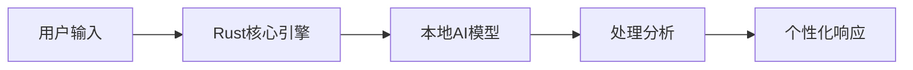
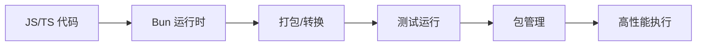
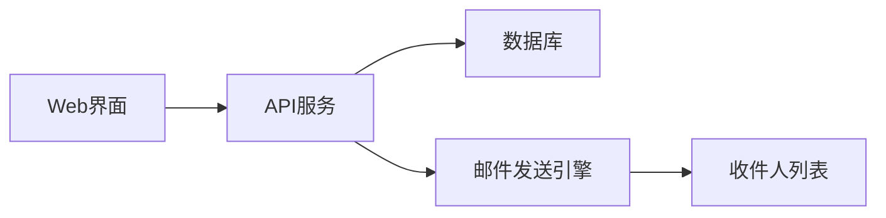
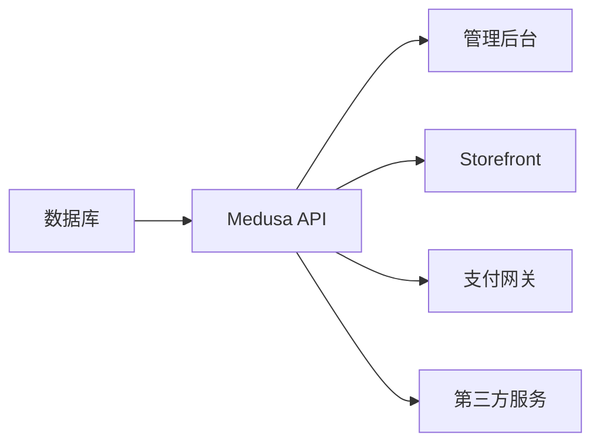
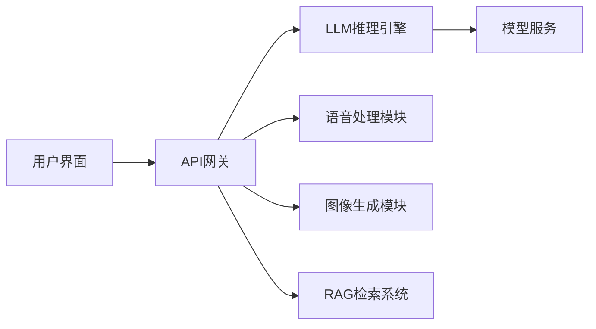

## 今日热点

AI代理技术持续火热，从个人助手到专业领域应用全面开花；本地化AI解决方案崛起，用户对数据隐私和离线功能需求显著增长。

---

## 热门项目一览

| 排名 | 项目 | 语言 | 今日 | 总计 | 简介 |
|:---:|------|:----:|------:|-----:|------|
| 1 | [tinyhumansai/openhuman](https://github.com/tinyhumansai/openhuman) | Rust | +1,690 | 13,601 | Your Personal AI super inte... |
| 2 | [oven-sh/bun](https://github.com/oven-sh/bun) | Rust | +910 | 91,745 | Incredibly fast JavaScript ... |
| 3 | [colbymchenry/codegraph](https://github.com/colbymchenry/codegraph) | TypeScript | +857 | 3,462 | Pre-indexed code knowledge ... |
| 4 | [K-Dense-AI/scientific-agent-skills](https://github.com/K-Dense-AI/scientific-agent-skills) | Python | +762 | 23,873 | A set of ready to use Agent... |
| 5 | [Anil-matcha/Open-Generative-AI](https://github.com/Anil-matcha/Open-Generative-AI) | JavaScript | +703 | 15,191 | Open-source alternative to ... |
| 6 | [microsoft/ai-agents-for-beginners](https://github.com/microsoft/ai-agents-for-beginners) | Jupyter Notebook | +485 | 62,639 | 12 Lessons to Get Started B... |
| 7 | [calcom/cal.diy](https://github.com/calcom/cal.diy) | TypeScript | +433 | 43,316 | Scheduling infrastructure f... |
| 8 | [BigBodyCobain/Shadowbroker](https://github.com/BigBodyCobain/Shadowbroker) | Python | +333 | 7,156 | Open-source intelligence fo... |
| 9 | [knadh/listmonk](https://github.com/knadh/listmonk) | Go | +242 | 20,638 | High performance, self-host... |
| 10 | [HKUDS/CLI-Anything](https://github.com/HKUDS/CLI-Anything) | Python | +238 | 35,744 | "CLI-Anything: Making ALL S... |
| 11 | [TryGhost/Ghost](https://github.com/TryGhost/Ghost) | JavaScript | +231 | 53,345 | Independent technology for ... |
| 12 | [tech-leads-club/agent-skills](https://github.com/tech-leads-club/agent-skills) | TypeScript | +225 | 3,588 | The secure, validated skill... |

---

## 趋势洞察

```
┌─────────────────────────────────────────────────────────────────┐
│  AI/ML 工具         ████████████████████████  13 个项目        │
│  其他               ███████                   4 个项目        │
│  数据分析             █                         1 个项目        │
└─────────────────────────────────────────────────────────────────┘
```

---

## 项目深度解读

### 1. tinyhumansai/openhuman — 个人AI助手

> **一句话总结**：基于Rust构建的私密个人AI超级智能助手，提供强大而简单的AI体验。

#### 价值主张

| 维度 | 说明 |
|------|------|
| **解决痛点** | 提供私密、强大且易于使用的个人AI助手，不依赖公共AI服务 |
| **目标用户** | 重视数据隐私的技术爱好者和寻求AI自主权的个人用户 |
| **核心亮点** | 基于Rust构建 + 私密性强 + 极其强大 + 使用简单 + 个人化定制 |

#### 技术架构



**技术特色**：
- 使用Rust语言构建，确保高性能和内存安全
- 强调本地运行，保护用户隐私不被泄露
- 极简设计理念，降低AI使用门槛

#### 热度分析

- 项目短期内获得大量关注，今日Star增长显著，显示社区高度认可
- 零开放问题反映项目维护良好，用户反馈机制高效

#### 快速上手

```bash
# 克隆项目
git clone https://github.com/tinyhumansai/openhuman.git
# 构建项目
cd openhuman && cargo build --release
# 运行
./target/release/openhuman
```

#### 注意事项

- 项目许可信息未知，使用前需确认授权条款
- 作为AI项目，可能需要足够的计算资源，特别是运行大型模型时
- 项目处于早期阶段，功能可能还在快速迭代中


### 2. oven-sh/bun — 全能 JS 运行时

> **一句话总结**：基于 Rust 的超快 JavaScript 运行时，整合打包、测试和包管理功能于一体。

#### 价值主张

| 维度 | 说明 |
|------|------|
| **解决痛点** | JavaScript 工具链分散、性能低下、开发效率低 |
| **目标用户** | 前端开发者、Node.js 用户、构建工具使用者 |
| **核心亮点** | 极致速度 + 一体化工具链 + TypeScript 支持 + Node.js 兼容 + Web API 实现 |

#### 技术架构



**技术特色**：
- 基于 JavaScriptCore 引擎，提供高性能执行环境
- 使用 Rust 重写，减少内存占用并提升启动速度
- 内置 TypeScript 和 JSX 转换器，无需额外配置
- 自定义事件循环和异步 I/O 实现，优化性能
- 提供与 Node.js API 的高度兼容性

#### 热度分析

- 项目 Star 数快速增长，单日增长超 900，社区关注度极高
- Fork 数相对较少，表明项目仍在活跃开发阶段，社区更倾向于直接贡献

#### 快速上手

```bash
# 安装 Bun
curl -fsSL https://bun.sh/install | bash

# 运行 JavaScript 文件
bun run index.js

# 运行 TypeScript 文件
bun run index.ts

# 安装依赖
bun install
```

#### 注意事项

- Bun 作为新兴项目，API 和功能仍在快速迭代中
- 虽然兼容 Node.js API，但某些特定模块可能不完全兼容
- 在生产环境使用前，建议充分测试关键功能


### 3. colbymchenry/codegraph — 代码知识图谱

> **一句话总结**：为AI编程助手构建本地化预索引代码知识图谱，减少token消耗和工具调用

#### 价值主张

| 维度 | 说明 |
|------|------|
| **解决痛点** | 解决AI编程助手处理大型代码库时的效率与隐私问题 |
| **目标用户** | 使用Claude、Codex、Cursor等AI编程助手的开发者 |
| **核心亮点** | 预索引代码知识图谱 + 100%本地运行 + 减少token消耗 |

#### 技术架构


**技术特色**：
- 基于TypeScript构建的高性能代码解析器
- 本地化知识图谱存储与查询系统
- 优化的token使用策略，减少API调用

#### 热度分析

- 项目近期获得大量关注，单日增长857个star，表明开发者对本地化AI编程工具有强烈需求
- Fork数量相对较少，说明项目可能还处于早期阶段，社区贡献尚未充分展开

#### 快速上手

```bash
# 克隆项目
git clone https://github.com/colbymchenry/codegraph.git
# 安装依赖
npm install
# 构建项目
npm run build
```

#### 注意事项

- 项目License信息未知，使用前需确认开源协议
- 项目可能需要一定的技术背景才能正确配置和使用
- 作为预索引系统，可能对特定编程语言或框架支持有限


### 4. K-Dense-AI/scientific-agent-skills — 科学AI技能集

> **一句话总结**：为科研和行业领域提供即用型AI代理技能，赋能多专业领域的智能分析任务。

#### 价值主张

| 维度 | 说明 |
|------|------|
| **解决痛点** | 解决专业领域AI应用门槛高、定制化难度大的问题 |
| **目标用户** | 研究人员、工程师、分析师、金融从业者和内容创作者 |
| **核心亮点** | 多领域覆盖 + 即插即用 + 开源可定制 + 高质量实现 |

#### 技术架构


**技术特色**：
- 模块化设计，支持不同领域的AI技能即插即用
- 统一的Agent接口，便于集成和扩展
- 高质量的专业领域实现，确保实用性

#### 热度分析

- 项目获得近2.4万star，近期单日增长762，表明热度持续攀升
- 社区活跃度高，fork数超过2500，显示广泛的二次开发和定制需求

#### 快速上手

```bash
# 克隆项目
git clone https://github.com/K-Dense-AI/scientific-agent-skills.git

# 安装依赖
cd scientific-agent-skills
pip install -r requirements.txt
```

#### 注意事项

- 项目许可证信息不明确，使用前需确认授权条款
- 作为专业领域AI技能集，可能需要一定的专业知识才能有效利用
- 需要根据具体需求选择合适的技能模块，可能需要一定的定制工作


### 5. Anil-matcha/Open-Generative-AI — 开源AI生成平台

> **一句话总结**：开源替代AI视频平台，提供200+模型支持的无内容过滤图像视频生成工具。

#### 价值主张

| 维度 | 说明 |
|------|------|
| **解决痛点** | 提供无内容过滤的AI生成平台，替代商业AI视频服务 |
| **目标用户** | 开发者、创意工作者、AI研究者和需要自托管解决方案的企业 |
| **核心亮点** | 200+模型支持 + 无内容限制 + 自托管部署 + 多格式生成 |

#### 技术架构


**技术特色**：
- 支持200多种AI生成模型，包括业界领先的Flux、Midjourney等
- 自托管部署架构，确保数据隐私和控制权
- 无内容过滤限制，提供更自由的创作空间

#### 热度分析

- 项目获得超过15k星标，近期单日增长700+，显示社区高度关注和需求旺盛
- 作为开源AI生成平台，在当前AI热潮中占据重要生态位置，提供商业替代方案

#### 快速上手

```bash
# 克隆项目
git clone https://github.com/Anil-matcha/Open-Generative-AI.git

# 安装依赖
npm install

# 启动服务
npm start
```

#### 注意事项

- 项目许可信息在描述中提到是MIT，但在项目信息中显示为Unknown，需要确认实际许可
- 无内容过滤可能带来伦理和安全问题，使用时需注意合规性
- 模型资源可能需要较大计算能力，建议有足够硬件支持


### 6. microsoft/ai-agents-for-beginners — AI智能体入门

> **一句话总结**：微软官方出品的12课AI智能体入门教程，理论与实践结合，适合初学者快速上手。

#### 价值主张

| 维度 | 说明 |
|------|------|
| **解决痛点** | 降低AI智能体开发门槛，提供系统化学习路径 |
| **目标用户** | AI开发初学者、希望了解智能体技术的开发者 |
| **核心亮点** | 微软官方出品 + 实践导向 + 12课系统化学习 + Jupyter Notebook交互式学习 |

#### 技术架构


**技术特色**：
- 基于Jupyter Notebook的交互式学习环境
- 理论与实践相结合的教学模式
- 微软官方提供的最新AI智能体技术

#### 热度分析

- 项目获得超6万星，日增星近500，表明在AI智能体学习领域热度极高
- 作为微软官方教程，在AI教育领域具有权威性和高认可度

#### 快速上手

```bash
# 克隆项目到本地
git clone https://github.com/microsoft/ai-agents-for-beginners.git

# 安装Jupyter并运行课程
pip install jupyter
cd ai-agents-for-beginners
jupyter notebook
```

#### 注意事项

- 本项目仅提供教程代码，需要自行配置AI开发环境
- 建议按照顺序完成12个课程，以获得最佳学习效果
- 需要一定的Python编程基础和AI基础知识


### 7. calcom/cal.diy — 开源调度平台

> **一句话总结**：为所有人提供灵活的调度基础设施，支持多种集成场景。

#### 价值主张

| 维度 | 说明 |
|------|------|
| **解决痛点** | 统一管理各类预约需求，简化调度流程 |
| **目标用户** | 需要预约管理的企业、团队和个人 |
| **核心亮点** | 多平台集成 + 开源可定制 + API驱动 + 高可扩展性 |

#### 技术架构


**技术特色**：
- 基于TypeScript开发，提供类型安全和高代码质量
- 采用模块化设计，便于扩展和定制
- 支持多平台集成，包括Web、移动端等

#### 热度分析

- 项目获得43k+星标，显示其在调度领域有广泛认可和影响力
- 高社区活跃度，Fork数达13k+，表明项目被大量二次开发和定制

#### 快速上手

```bash
# 克隆项目
git clone https://github.com/calcom/cal.diy.git

# 安装依赖
npm install

# 启动开发服务器
npm run dev
```

#### 注意事项

- 项目文档可能需要进一步完善，特别是对于新用户
- 部署过程可能需要一定的技术背景，特别是自定义配置部分
- 需要确认项目的具体授权方式（License显示为Unknown）


### 8. BigBodyCobain/Shadowbroker — 全球情报聚合

> **一句话总结**：开源情报平台，整合全球卫星、飞机、地震等多源数据，提供AI驱动的关联分析能力。

#### 价值主张

| 维度 | 说明 |
|------|------|
| **解决痛点** | 分散全球情报数据孤岛，提供统一可视化与AI关联分析能力 |
| **目标用户** | 研究人员、安全分析师、情报机构、数据科学家 |
| **核心亮点** | 多源数据整合 + AI智能分析 + 可视化展示 + 开源情报平台 |

#### 技术架构


**技术特色**：
- 跨平台数据聚合技术，整合卫星、航空、地震等多源数据
- 机器学习算法实现异常检测与关联分析
- 分布式架构支持大规模情报数据处理

#### 热度分析

- 项目7K+星标，近期增长迅速，表明开源情报领域需求旺盛
- 社区活跃度高，Fork数达千级，显示技术认可度强

#### 快速上手

```bash
# 克隆项目
git clone https://github.com/BigBodyCobain/Shadowbroker.git
cd Shadowbroker
pip install -r requirements.txt && python main.py
```

#### 注意事项

- 使用时需确保数据来源合法合规，遵守相关法律法规
- 项目可能需要API密钥访问某些数据源，需自行配置
- 数据处理过程可能需要较高计算资源，建议在适当环境下运行


### 9. knadh/listmonk — 邮件列表管理器

> **一句话总结**：高性能自托管邮件列表管理工具，提供现代化仪表板，单个二进制文件即可运行。

#### 价值主张

| 维度 | 说明 |
|------|------|
| **解决痛点** | 解决自托管邮件列表管理和分发需求，无需复杂配置 |
| **目标用户** | 需要自建邮件列表的网站管理员、内容创作者和小型企业 |
| **核心亮点** | 高性能 + 单二进制文件 + 现代化仪表板 + 自托管 + 用户友好 |

#### 技术架构



**技术特色**：
- 基于Go语言开发，高性能且资源占用低
- 单一二进制文件部署，无需依赖
- 支持多种邮件后端和模板引擎
- 提供现代化的Web管理界面

#### 热度分析

- 项目获得超过2万星，近期增长迅速，日均增长约240星
- Fork数量稳定，表明社区积极参与维护和二次开发
- Issues数量为0，可能表明项目维护良好或问题处理高效

#### 快速上手

```bash
# 下载并运行listmonk
wget https://github.com/knadh/listmonk/releases/latest/download/listmonk_linux_amd64.tar.gz
tar -xvf listmonk_linux_amd64.tar.gz
./listmonk --install
./listmonk
```

#### 注意事项

- 需要配置数据库（支持SQLite、MySQL、PostgreSQL等）
- 需要配置SMTP服务器才能发送邮件
- 部署时建议配置反向代理和HTTPS
- 需要定期备份数据库以防止数据丢失


### 10. HKUDS/CLI-Anything — CLI万物化工具

> **一句话总结**：将各类软件转换为命令行接口，实现跨平台的统一自动化操作入口。

#### 价值主张

| 维度 | 说明 |
|------|------|
| **解决痛点** | 软件操作分散，缺乏统一命令行交互方式，自动化和脚本化困难 |
| **目标用户** | 开发者、系统管理员、自动化脚本编写者和命令行爱好者 |
| **核心亮点** | 跨平台支持 + 插件化架构 + 自动化转换 + 统一命令入口 + 轻量级设计 |

#### 技术架构


**技术特色**：
- 模块化设计，支持多种软件接口适配
- 智能解析技术，自动识别软件功能
- 轻量级实现，不依赖复杂环境

#### 热度分析

- 项目Star数高且增长迅速，日均增长约240，表明项目受到广泛关注和认可。
- Fork数适中，说明社区贡献度较高，项目有活跃的开发和改进生态。

#### 快速上手

```bash
# 安装
pip install cli-anything

# 基本使用
cli-anything --convert <software_name>
cli-anything --run <command>
```

#### 注意事项

- 项目License未知，可能存在使用限制
- 部分复杂软件可能需要额外配置才能完全支持
- 需要Python环境，建议使用虚拟机隔离依赖


### 11. TryGhost/Ghost — 现代内容发布平台

> **一句话总结**：专为创作者设计的开源博客平台，提供优雅的出版体验和会员订阅功能。

#### 价值主张

| 维度 | 说明 |
|------|------|
| **解决痛点** | 解决创作者在内容发布和变现方面的技术障碍 |
| **目标用户** | 博客作者、内容创作者、新闻通讯发布者 |
| **核心亮点** | 简洁优雅界面 + 强大订阅系统 + 完整会员管理 + API驱动架构 + 自托管能力 |

#### 技术架构


**技术特色**：
- 基于Node.js构建，性能优异
- 完全RESTful API设计，便于扩展
- 内置SEO优化和响应式设计

#### 热度分析

- 项目Star数超5万，日增200+，持续稳定增长，表明其作为内容管理平台受到广泛认可
- 在独立博客和内容创作者社区中具有较高影响力，是替代传统CMS的热门选择

#### 快速上手

```bash
# 安装Ghost CLI
npm install -g ghost-cli

# 创建新站点
ghost install local

# 启动开发服务器
ghost start
```

#### 注意事项

- Ghost对服务器有一定要求，推荐至少1GB内存
- 自托管需要一定的技术背景，特别是数据库管理和服务器配置
- 某些高级功能可能需要付费订阅Ghost Pro服务


### 12. tech-leads-club/agent-skills — AI技能库

> **一句话总结**：为专业AI编程代理提供安全、已验证的技能注册表，确保扩展无忧。

#### 价值主张

| 维度 | 说明 |
|------|------|
| **解决痛点** | 解决AI编程代理技能验证和安全扩展的问题 |
| **目标用户** | AI编程工具开发者和高级用户 |
| **核心亮点** | 安全验证 + 技能标准化 + 多平台支持 + 可靠性保障 |

#### 技术架构


**技术特色**：
- 基于TypeScript构建，确保类型安全
- 技能验证机制，保障代码质量
- 提供标准化接口，支持多平台AI工具

#### 热度分析

- 项目获得3588个星标且单日增长225，表明社区高度关注
- 无开放问题，说明项目成熟稳定，维护良好

#### 快速上手

```bash
# 安装agent-skills
npm install agent-skills

# 初始化技能库
npx agent-skills init
```

#### 注意事项

- 项目许可证未知，商业使用前需确认授权方式
- 集成前需了解各AI代理平台的兼容性要求


### 13. dograh-hq/dograh — [开源语音平台]

> **一句话总结**：开源语音代理平台，提供自然语言交互与智能助手构建能力。

#### 价值主张

| 维度 | 说明 |
|------|------|
| **解决痛点** | 简化语音应用开发，降低AI语音技术使用门槛 |
| **目标用户** | 开发者、语音应用构建者、智能助手研究者 |
| **核心亮点** | 开源可定制 + 跨平台支持 + 模块化架构 + 易于集成 |

#### 技术架构


**技术特色**：
- 基于Python构建，易于扩展和定制
- 模块化设计，支持灵活组件替换
- 提供完整的语音交互解决方案

#### 热度分析

- 项目近期增长迅速，单日新增Star超200，显示社区关注度提升
- 虽Issues为0，但Fork数相对较高，表明开发者有实际使用和二次开发意愿

#### 快速上手

```bash
# 克隆项目
git clone https://github.com/dograh-hq/dograh.git
# 安装依赖
pip install -r requirements.txt
# 启动服务
python dograh --config config.yaml
```

#### 注意事项

- 项目License未知，商业使用前需确认授权条款
- 作为语音平台，可能需要额外的语音模型资源
- 项目文档可能不够完善，需要参考代码示例


### 14. medusajs/medusa — 开源电商框架

> **一句话总结**：模块化、可扩展的开源电商平台，支持灵活定制业务逻辑与前端体验。

#### 价值主张

| 维度 | 说明 |
|------|------|
| **解决痛点** | 传统电商平台功能固化，难以满足个性化业务需求 |
| **目标用户** | 电商开发者、企业级电商平台构建者 |
| **核心亮点** | 模块化架构 + API驱动 + 插件生态 + 自定义业务逻辑 |

#### 技术架构



**技术特色**：
- 基于TypeScript构建，提供类型安全
- 插件化架构，支持功能灵活扩展
- RESTful API设计，便于多端集成

#### 热度分析

- 项目Star数超3.3万，近期稳定增长，表明市场认可度高
- 作为新兴开源电商框架，社区活跃度持续上升，生态逐步完善

#### 快速上手

```bash
# 创建新项目
npx create-medusa-app@latest

# 启动开发服务器
npm start

# 安装插件
npx medusa-plugin create-plugin
```

#### 注意事项

- 项目需要一定的TypeScript和Node.js基础
- 插件生态仍在发展中，部分高级功能可能需要自行开发
- 生产环境部署需考虑数据库优化和性能调优


### 15. KeygraphHQ/shannon — AI安全测试工具

> **一句话总结**：自主白盒AI渗透测试工具，分析源代码并执行真实漏洞验证，提前发现Web应用和API安全隐患。

#### 价值主张

| 维度 | 说明 |
|------|------|
| **解决痛点** | 自动化发现Web应用和API中的安全漏洞，减少人工测试的盲点和耗时 |
| **目标用户** | Web开发者、安全团队、DevOps工程师、QA测试人员 |
| **核心亮点** | AI驱动漏洞分析 + 白盒测试方法 + 实际漏洞验证 + 源代码级检测 + 预防性安全评估 |

#### 技术架构


**技术特色**：
- 基于AI的智能安全漏洞检测算法
- 白盒测试方法，可深入分析代码逻辑
- 自动生成实际漏洞利用代码进行验证
- 支持多种Web框架和API协议
- 与CI/CD流程集成实现持续安全测试

#### 热度分析
- 项目获得42k+星标且持续增长，表明开发者社区高度认可其安全测试价值
- 4.8k+的fork数反映活跃的开发社区贡献，工具在安全测试领域占据重要位置

#### 快速上手

```bash
# 安装Shannon CLI工具
npm install -g @keygraphhq/shannon

# 初始化项目扫描
shannon init --path ./src

# 执行安全测试
shannon test --api ./api --web ./webapp
```

#### 注意事项
- 使用前需确认合法合规，仅用于测试自有或获得授权的系统
- 白盒测试可能需要访问完整源代码，注意敏感信息保护
- 建议在开发环境或测试环境先行验证，避免影响生产系统
- 需要配合适当的安全修复流程，发现漏洞后及时修复


### 16. plausible/analytics — 隐私分析平台

> **一句话总结**：注重隐私的轻量级网站分析工具，无需cookie，支持自托管和云服务。

#### 价值主张

| 维度 | 说明 |
|------|------|
| **解决痛点** | 解决传统分析工具侵犯用户隐私、依赖cookie的问题 |
| **目标用户** | 注重隐私的网站所有者、博客作者、小型企业 |
| **核心亮点** | 隐私优先 + 轻量级 + 无cookie + 自托管 + 开源 |

#### 技术架构


**技术特色**：
- 基于Elixir构建，高并发性能
- 数据处理流程轻量高效
- 注重用户隐私的数据收集机制

#### 热度分析

- Star数超过25,000且持续增长(+186/天)，表明项目活跃度高，受到社区广泛认可
- 作为隐私分析领域领先项目，填补了Google Analytics替代方案的市场空白

#### 快速上手

```bash
# 克隆仓库
git clone https://github.com/plausible/analytics.git

# 安装依赖并启动
cd analytics && mix deps.get && mix phx.server
```

#### 注意事项

- 需要一定的Elixir/Phoenix知识才能进行深度定制
- 自托管需要服务器资源和一定的运维能力
- 开源协议未知，商业使用前需确认许可条款


### 17. NirDiamant/agents-towards-production — 生成式AI代理教程

> **一句话总结**：提供从原型到企业部署的全流程代码教程，助力构建生产级生成式AI代理系统。

#### 价值主张

| 维度 | 说明 |
|------|------|
| **解决痛点** | 解决AI代理从原型到生产环境部署的复杂性和知识鸿沟问题 |
| **目标用户** | AI开发者、数据科学家、企业技术架构师和AI产品团队 |
| **核心亮点** | 端到端完整流程覆盖 + 代码优先的实践指导 + 生产级部署方案 |

#### 技术架构


**技术特色**：
- 基于最新AI框架的实用代码示例
- 从简单到复杂循序渐进的教程设计
- 覆盖代理开发的完整生命周期

#### 热度分析

- 项目获得近2万星且持续增长，表明生成式AI代理开发领域需求旺盛
- 作为教程类项目，高fork数反映了社区对生产化AI代理知识的强烈需求

#### 快速上手

```bash
git clone https://github.com/NirDiamant/agents-towards-production.git
cd agents-towards-production
jupyter lab  # 启动Jupyter Lab开始学习
```

#### 注意事项

- 项目使用Jupyter Notebook，需要Python环境和相关AI框架支持
- 某些教程可能需要特定API密钥或云服务账号
- 部署教程可能涉及云服务成本，需注意预算控制


### 18. Light-Heart-Labs/DreamServer — 本地全能AI平台

> **一句话总结**：本地部署的全能AI服务器，提供大模型推理、聊天、语音和图像生成等一站式服务。

#### 价值主张

| 维度 | 说明 |
|------|------|
| **解决痛点** | 消除对云服务的依赖，提供本地化、私密且无需订阅的AI解决方案 |
| **目标用户** | 开发者、研究人员和注重隐私的个人用户 |
| **核心亮点** | 多功能AI集成 + 本地部署 + 零订阅费 + 私密保护 |

#### 技术架构



**技术特色**：
- 集成多种AI模型于一身，统一管理
- 提供RESTful API接口，便于集成
- 支持本地化部署，确保数据隐私安全

#### 热度分析

- 项目Star数持续增长，今日新增112个Star，显示项目热度快速上升
- Open Issues为0，表明项目维护良好，社区反馈高效

#### 快速上手

```bash
# 克隆项目
git clone https://github.com/Light-Heart-Labs/DreamServer.git
cd DreamServer

# 安装依赖并启动
pip install -r requirements.txt
python app.py
```

#### 注意事项

- 由于项目License未知，使用前需确认授权协议
- 本地运行可能需要较高的计算资源，特别是对于大型模型
- 项目功能丰富，可能需要配置多个AI模型以获得完整体验


## 今日推荐

| 主题 | 推荐项目 | 亮点 |
|------|----------|------|
| 今日最热 | [tinyhumansai/openhuman](https://github.com/tinyhumansai/openhuman) | Your Personal AI ... |
| 值得关注 | [oven-sh/bun](https://github.com/oven-sh/bun) | Incredibly fast J... |
| 快速上手 | [colbymchenry/codegraph](https://github.com/colbymchenry/codegraph) | Pre-indexed code ... |
| 长期潜力 | [K-Dense-AI/scientific-agent-skills](https://github.com/K-Dense-AI/scientific-agent-skills) | A set of ready to... |

---

<div align="center">

*Generated on 2026-05-18 | Powered by GitHub Trending Reporter*

</div>