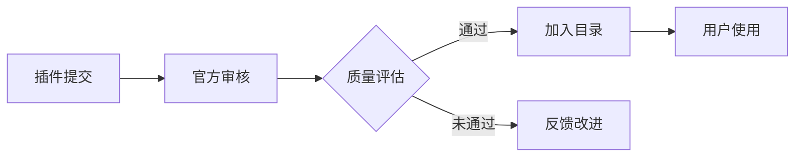

## 今日热点

今日GitHub热榜聚焦AI代理生态爆发式增长与开发工具链优化，个人智能助手到企业级代理框架全面开花，效率工具备受青睐。

---

## 热门项目一览

| 排名 | 项目 | 语言 | 今日 | 总计 | 简介 |
|:---:|------|:----:|------:|-----:|------|
| 1 | [tinyhumansai/openhuman](https://github.com/tinyhumansai/openhuman) | Rust | +3,973 | 21,527 | Your Personal AI super inte... |
| 2 | [Imbad0202/academic-research-skills](https://github.com/Imbad0202/academic-research-skills) | Python | +3,164 | 14,249 | Academic Research Skills fo... |
| 3 | [multica-ai/andrej-karpathy-skills](https://github.com/multica-ai/andrej-karpathy-skills) | Unknown | +1,955 | 138,242 | A single CLAUDE.md file to ... |
| 4 | [colbymchenry/codegraph](https://github.com/colbymchenry/codegraph) | TypeScript | +1,850 | 6,768 | Pre-indexed code knowledge ... |
| 5 | [obra/superpowers](https://github.com/obra/superpowers) | Shell | +1,623 | 198,546 | An agentic skills framework... |
| 6 | [rohitg00/agentmemory](https://github.com/rohitg00/agentmemory) | TypeScript | +1,609 | 14,247 | #1 Persistent memory for AI... |
| 7 | [CloakHQ/CloakBrowser](https://github.com/CloakHQ/CloakBrowser) | Python | +1,463 | 16,703 | Stealth Chromium that passe... |
| 8 | [msitarzewski/agency-agents](https://github.com/msitarzewski/agency-agents) | Shell | +1,120 | 101,730 | A complete AI agency at you... |
| 9 | [HKUDS/CLI-Anything](https://github.com/HKUDS/CLI-Anything) | Python | +1,038 | 37,783 | "CLI-Anything: Making ALL S... |
| 10 | [microsoft/ai-agents-for-beginners](https://github.com/microsoft/ai-agents-for-beginners) | Jupyter Notebook | +818 | 64,446 | 12 Lessons to Get Started B... |
| 11 | [humanlayer/12-factor-agents](https://github.com/humanlayer/12-factor-agents) | TypeScript | +736 | 21,221 | What are the principles we ... |
| 12 | [rtk-ai/rtk](https://github.com/rtk-ai/rtk) | Rust | +704 | 50,992 | CLI proxy that reduces LLM ... |

---

## 趋势洞察

```
┌─────────────────────────────────────────────────────────────────┐
│  AI/ML 工具         ████████████████████████  14 个项目        │
│  其他               █████                     3 个项目        │
│  项目管理             █                         1 个项目        │
└─────────────────────────────────────────────────────────────────┘
```

---

## 项目深度解读

### 1. tinyhumansai/openhuman — 个人AI助手

> **一句话总结**：私有化本地运行的个人AI超级智能助手，强调隐私保护与强大功能。

#### 价值主张

| 维度 | 说明 |
|------|------|
| **解决痛点** | 提供完全私有的AI助手解决方案，避免数据泄露风险 |
| **目标用户** | 注重隐私的个人用户、开发者和需要高效AI辅助的专业人士 |
| **核心亮点** | 本地运行 + 隐私保护 + 简易设计 + 强大AI能力 |

#### 技术架构


**技术特色**：
- 采用Rust语言开发，确保高性能与内存安全
- 完全本地运行，不依赖云端服务，保障数据隐私
- 极简设计理念，降低用户使用门槛

#### 热度分析

- 项目短时间内获得近4000个新Star，显示AI个人助手领域需求旺盛
- 高Fork数表明社区积极参与二次开发与功能扩展

#### 快速上手

```bash
# 克隆仓库
git clone https://github.com/tinyhumansai/openhuman.git

# 构建项目
cd openhuman
cargo build --release
```

#### 注意事项
- 项目License信息未知，使用前需确认授权条款
- 缺少详细的文档和Issue反馈渠道
- 作为AI项目，可能需要较强的本地计算资源支持


### 2. Imbad0202/academic-research-skills — 学术研究助手

> **一句话总结**：为Claude Code提供完整学术研究工作流，从研究到论文定稿的全流程支持。

#### 价值主张

| 维度 | 说明 |
|------|------|
| **解决痛点** | 简化学术研究流程，提升研究效率与论文质量 |
| **目标用户** | 学术研究人员、学生、学者 |
| **核心亮点** | 完整研究流程支持 + AI辅助 + 结构化写作指导 |

#### 技术架构


**技术特色**：
- 基于Python实现，易于集成和扩展
- 提供结构化的学术研究工作流
- 结合AI技术辅助研究过程

#### 热度分析

- 项目获得超过14k星，单日增长超过3k，表明近期关注度大幅提升
- Fork数适中，说明项目处于活跃开发阶段，但尚未形成大规模社区分支

#### 快速上手

```bash
# 克隆项目
git clone https://github.com/Imbad0202/academic-research-skills.git

# 安装依赖
pip install -r requirements.txt
```

#### 注意事项

- 项目许可证未知，商业使用前需确认授权情况
- 项目可能需要Claude Code环境才能充分利用功能
- 由于没有明确的技术文档，使用时可能需要自行探索功能实现


### 3. multica-ai/andrej-karpathy-skills — [AI编程指南]

> **一句话总结**：基于Karpathy经验的LLM编码最佳实践，提升Claude Code编程能力。

#### 价值主张

| 维度 | 说明 |
|------|------|
| **解决痛点** | 解决LLM在编程中的常见缺陷，提高代码质量 |
| **目标用户** | 使用Claude Code的开发者和AI编程爱好者 |
| **核心亮点** | 实践经验总结 + 结构化建议 + 易于应用 |

#### 技术架构

**技术特色**：
- 基于业界顶尖AI专家的实践经验
- 简洁明了的指导原则
- 针对Claude Code优化的建议

#### 热度分析

- 项目获得13万+星标，增长迅速，反映开发者对AI编程指南的强烈需求
- 高星高fork比，表明社区积极参与并认可项目价值

#### 快速上手

```bash
# 克隆项目查看CLAUDE.md文件
git clone https://github.com/multica-ai/andrej-karpathy-skills.git
cat andrej-karpathy-skills/CLAUDE.md
```

#### 注意事项

- 本项目主要是指导性文档，不包含可执行的代码
- 建议结合实际编程场景应用这些原则
- 随着AI模型更新，部分建议可能需要调整


### 4. colbymchenry/codegraph — 代码知识图谱

> **一句话总结**：本地化预索引代码知识库，大幅降低AI编程工具的token消耗和调用次数。

#### 价值主张

| 维度 | 说明 |
|------|------|
| **解决痛点** | 解决AI编程工具处理代码时token消耗过多和工具调用效率低的问题 |
| **目标用户** | 使用Claude、Codex等AI编程工具的开发者和AI工具开发者 |
| **核心亮点** | 100%本地处理 + 预索引代码知识图谱 + 减少token消耗 + 减少工具调用 |

#### 技术架构


**技术特色**：
- 基于TypeScript实现的全栈本地解决方案
- 预索引技术减少实时处理开销
- 专为AI编程工具优化的代码查询机制

#### 热度分析

- 项目单日增长1,850 stars，表明其解决了AI编程社区的迫切需求
- 高star与低fork比例(15.3:1)显示项目更多作为直接解决方案而非二次开发基础

#### 快速上手

```bash
# 安装
npm install -g codegraph

# 初始化本地代码库索引
codegraph init

# 查询代码知识
codegraph query "function_name"
```

#### 注意事项

- 许可证未知，商业使用前需确认授权条款
- 项目未明确支持哪些编程语言，可能存在语言限制
- 本地处理虽保障隐私，但可能牺牲部分云端AI服务的功能集成


### 5. obra/superpowers — 高效开发框架

> **一句话总结**：提供实用有效的代理技能框架和软件开发方法论，提升团队协作与个人效能。

#### 价值主张

| 维度 | 说明 |
|------|------|
| **解决痛点** | 传统软件开发方法效率低下，缺乏系统化的技能培养路径 |
| **目标用户** | 软件开发团队、技术管理者、个人开发者 |
| **核心亮点** | 系统化技能框架 + 实用方法论 + 高效协作模式 + 持续改进机制 |

#### 技术架构


**技术特色**：
- 基于Shell的轻量级实现
- 模块化技能培养体系
- 实践导向的方法论

#### 热度分析

- Star数接近20万，近期增长迅速，表明项目具有极高的实用价值和社区认可度
- 作为方法论框架，在技术社区中形成独特生态，影响广泛

#### 快速上手

```bash
# 克隆项目
git clone https://github.com/obra/superpowers.git
# 进入项目目录
cd superpowers
# 查看文档
cat README.md
```

#### 注意事项

- 项目主要提供方法论而非具体代码实现，需要团队自行实践
- 由于项目没有明确许可证，使用时需注意版权问题
- 项目可能需要一定的团队协作经验才能有效实施


### 6. rohitg00/agentmemory — AI代理内存库

> **一句话总结**：为AI编程代理提供持久化内存功能，基于真实世界基准测试优化长期记忆能力。

#### 价值主张

| 维度 | 说明 |
|------|------|
| **解决痛点** | 解决AI代理在长期运行中无法保持记忆和上下文的问题 |
| **目标用户** | AI应用开发者、智能系统构建者 |
| **核心亮点** | 持久化存储 + 基于真实基准测试 + 高效内存管理 |

#### 技术架构


**技术特色**：
- 基于真实世界基准测试优化性能
- 高效的内存检索与更新机制
- TypeScript实现确保类型安全

#### 热度分析

- 项目获得14,247 stars，近期增长迅猛，今日增加1,609 stars，显示近期有重大突破
- 在AI编程工具生态中占据重要位置，是构建长期记忆AI系统的关键组件

#### 快速上手

```bash
# 安装
npm install agentmemory

# 基本使用
import { createMemory } from 'agentmemory';
const memory = createMemory();
memory.add('用户偏好', '喜欢简洁界面');
const preference = memory.recall('用户偏好');
```

#### 注意事项

- 项目许可证信息不明确，商业使用前需确认授权条款
- 内存管理策略可能需要根据具体应用场景进行调整优化
- 与其他AI框架的集成可能需要额外配置


### 7. CloakHQ/CloakBrowser — [反检测浏览器]

> **一句话总结**：隐形 Chromium 浏览器，通过源级指纹修补绕过所有机器人检测，是 Playwright 的完美替代品。

#### 价值主张

| 维度 | 说明 |
|------|------|
| **解决痛点** | 解决自动化测试和爬虫被网站检测和阻止的问题 |
| **目标用户** | 自动化测试工程师、爬虫开发者、数据采集人员 |
| **核心亮点** | 源级指纹修补 + 30/30测试通过率 + Playwright无缝替代 |

#### 技术架构


**技术特色**：
- 源级浏览器指纹修改技术
- 完全兼容Playwright API的替代品
- 30项全面测试验证反检测能力

#### 热度分析

- 项目Star数超1.6万，单日增长近1500，表明近期关注度极高
- 高Fork/Star比反映项目实用性高，开发者社区活跃

#### 快速上手

```bash
# 安装CloakBrowser
pip install cloak-browser

# 替换Playwright代码示例
from cloak_browser import browser

async with browser.launch() as b:
    page = await b.new_page()
    await page.goto("https://example.com")
    # 其余代码与Playwright相同
```

#### 注意事项

- 许可证未知，商业使用前需确认授权方式
- 项目更新频繁，可能存在不稳定的API变化
- 反检测技术可能随网站检测手段升级而失效


### 8. msitarzewski/agency-agents — AI代理工具箱

> **一句话总结**：提供多种专业化AI代理工具，覆盖前端开发、社区管理等多个领域。

#### 价值主张

| 维度 | 说明 |
|------|------|
| **解决痛点** | 提供一站式AI代理解决方案，无需单独寻找各种专业AI工具 |
| **目标用户** | 开发者、内容创作者、社区管理员、市场营销人员 |
| **核心亮点** | 多样化专业代理 + 个性化工作流程 + 即用型脚本 |

#### 技术架构


**技术特色**：
- 基于Shell脚本实现，跨平台兼容性强
- 模块化设计，每个代理独立工作
- 轻量级实现，资源占用少
- 集成多种AI服务接口

#### 热度分析

- 项目获得超过10万星，增长迅速，表明AI代理工具需求旺盛
- 零开放问题，说明项目维护良好，社区参与度高

#### 快速上手

```bash
# 克隆仓库
git clone https://github.com/msitarzewski/agency-agents.git
# 进入目录
cd agency-agents
# 查看可用代理
ls agents/
# 运行特定代理
./agents/your-chosen-agent.sh
```

#### 注意事项

- 需要配置相应的AI服务API密钥才能正常运行
- 不同代理可能需要安装额外的依赖工具
- Shell脚本在Windows上可能需要额外配置才能运行


### 9. HKUDS/CLI-Anything — CLI原生化工具

> **一句话总结**：将各类软件转化为命令行原生工具，提升软件的代理原生能力和操作效率。

#### 价值主张

| 维度 | 说明 |
|------|------|
| **解决痛点** | 将图形界面软件转换为命令行操作，提升自动化和集成能力 |
| **目标用户** | 开发者、系统管理员、自动化脚本编写者 |
| **核心亮点** | 统一命令行接口 + 跨软件集成 + 自动化操作 + 代理原生设计 |

#### 技术架构


**技术特色**：
- 软件操作命令化封装，无需修改原软件
- 提供统一的CLI接口调用各类软件
- 支持复杂的软件操作自动化流程

#### 热度分析

- 项目获得37,783个星标，近期增长1,038个，显示快速增长态势
- 作为软件自动化工具，在DevOps和自动化领域具有较高关注度

#### 快速上手

```bash
# 安装CLI-Anything
pip install cli-anything

# 基本使用
cli-anything <software-name> <command>
```

#### 注意事项

- 可能需要针对不同软件安装特定的适配器
- 复杂软件的某些功能可能无法完全通过命令行实现
- 需要确保目标软件已正确安装并配置


### 10. microsoft/ai-agents-for-beginners — AI代理入门教程

> **一句话总结**：微软官方出品的12课AI代理入门教程，通过Jupyter Notebook引导初学者构建AI应用。

#### 价值主张

| 维度 | 说明 |
|------|------|
| **解决痛点** | 降低AI代理技术入门门槛，提供系统化学习路径 |
| **目标用户** | AI初学者、开发者、希望了解AI代理技术的学生 |
| **核心亮点** | 微软官方出品 + 12课系统化教程 + Jupyter Notebook实践 + 项目导向学习 |

#### 技术架构

**技术特色**：
- 基于Jupyter Notebook的交互式学习环境
- 涵盖AI代理核心概念与实际应用场景
- 微软官方提供的最佳实践与技术指导

#### 热度分析

- 项目获得6.4万+星标，日增800+，表明AI代理领域学习需求旺盛
- 作为微软官方教程，在AI教育领域具有权威性和影响力

#### 快速上手

```bash
# 克隆项目到本地
git clone https://github.com/microsoft/ai-agents-for-beginners.git

# 启动Jupyter Notebook
cd ai-agents-for-beginners
jupyter notebook
```

#### 注意事项

- 需要具备基本的Python编程知识
- 建议使用Anaconda环境管理依赖包
- 项目需要访问OpenAI API，需提前准备API密钥


### 11. humanlayer/12-factor-agents — LLM设计原则

> **一句话总结**：提供构建生产级LLM驱动软件的12项核心原则，确保AI应用可靠、可维护且安全。

#### 价值主张

| 维度 | 说明 |
|------|------|
| **解决痛点** | 解决LLM应用生产化过程中的可靠性、安全性和可维护性问题 |
| **目标用户** | AI应用开发者、产品经理和架构师 |
| **核心亮点** | 原则指南 + 最佳实践 + 生产就绪 |

#### 技术架构

**技术特色**：
- 基于十二因素应用方法论构建LLM设计原则
- 提供结构化的AI应用开发框架
- 融合传统软件工程与AI特性考量

#### 热度分析

- 项目Star数超过21k且单日新增736，表明LLM应用开发领域热度高涨
- 作为新兴领域指南项目，具有极高的参考价值和生态影响力

#### 快速上手

```bash
# 克隆项目查看12因素原则
git clone https://github.com/humanlayer/12-factor-agents.git
cd 12-factor-agents
cat README.md
```

#### 注意事项

- 本项目为原则指南，具体实现需结合业务场景
- LLM技术发展迅速，原则需持续更新以适应新趋势
- 遵循这些原则可提高LLM应用稳定性，但不能完全替代测试和监控


### 12. rtk-ai/rtk — 高效LLM代理

> **一句话总结**：通过智能代理减少LLM token消耗60-90%的轻量级CLI工具。

#### 价值主张

| 维度 | 说明 |
|------|------|
| **解决痛点** | 大型语言模型API调用成本高，开发者负担重 |
| **目标用户** | 使用AI辅助编程的开发者和团队 |
| **核心亮点** | 零依赖单二进制 + 60-90%token节省 + 即装即用 |

#### 技术架构


**技术特色**：
- 基于Rust构建的高性能单二进制文件
- 无外部依赖，降低安全风险
- 智能token压缩算法，显著减少API调用成本
- 即插即用的CLI工具，无需复杂配置

#### 热度分析

- 项目Star数超过5万，单日增长700+，表明开发者对降低LLM成本有强烈需求
- 零Issues状态反映项目成熟度高，已解决潜在问题，社区认可度高

#### 快速上手

```bash
# 下载并运行rtk
curl -L https://github.com/rtk-ai/rtk/releases/latest/download/rtk-x86_64-unknown-linux-gnu.tar.gz | tar -xz
./rtk
```

#### 注意事项

- 需要配置OpenAI API密钥才能正常使用
- 可能不适用于所有类型的LLM命令，特定场景效果可能有所不同
- 作为代理工具，需要确保网络连接稳定以获得最佳体验


### 13. Alishahryar1/free-claude-code — 免费 Claude 工具

> **一句话总结**：提供终端、VSCode 和 Discord 免费使用 Claude AI 的解决方案，支持语音交互功能。

#### 价值主张

| 维度 | 说明 |
|------|------|
| **解决痛点** | 绕过 Claude 官方限制，提供免费访问渠道 |
| **目标用户** | 需要免费使用 Claude AI 的开发者和普通用户 |
| **核心亮点** | 终端支持 + VSCode扩展 + Discord集成 + 语音功能 |

#### 技术架构


**技术特色**：
- Python 开发，跨平台兼容性强
- 多端统一接入，用户体验一致
- 可能通过反向代理或API转发实现免费访问

#### 热度分析

- 项目 Star 数达 2.6万+，日增 500+，用户需求旺盛
- Fork 数近 4千，社区活跃度高，二次开发潜力大

#### 快速上手

```bash
# 克隆项目
git clone https://github.com/Alishahryar1/free-claude-code.git
# 安装依赖
pip install -r requirements.txt
# 运行服务
python main.py
```

#### 注意事项

- 项目许可证未知，使用前需确认法律合规性
- 免费访问方式可能违反 Claude 服务条款，存在账号风险
- 项目稳定性依赖于维护者，长期使用需谨慎


### 14. HKUDS/ViMax — 智能视频生成

> **一句话总结**：ViMax是一站式智能视频生成平台，整合导演、编剧、制片等多角色功能，实现从概念到成片的自动化创作。

#### 价值主张

| 维度 | 说明 |
|------|------|
| **解决痛点** | 视频创作流程复杂，需要多专业协作，创作门槛高 |
| **目标用户** | 内容创作者、视频制作团队、营销机构 |
| **核心亮点** | AI驱动全流程自动化 + 多角色协同 + 一站式创作体验 |

#### 技术架构


**技术特色**：
- 多智能体协同工作架构
- 端到端视频生成流水线
- 用户友好的创意实现接口

#### 热度分析

- 项目近期热度显著增长，单日新增500+ stars，显示出强烈的市场关注。
- 作为视频生成领域的新兴项目，正快速建立其在AI视频创作生态中的领先地位。

#### 快速上手

```bash
# 克隆仓库
git clone https://github.com/HKUDS/ViMax.git
cd ViMax

# 安装依赖
pip install -r requirements.txt

# 运行示例
python examples/basic_generation.py
```

#### 注意事项

- 项目可能需要高性能GPU资源进行视频生成，建议在具备足够计算能力的环境中运行。
- 作为新兴项目，API和功能可能还在快速迭代中，建议关注项目更新以获取最新功能。


### 15. Diolinux/PhotoGIMP — [Photoshop风格GIMP]

> **一句话总结**：为GIMP 3+添加Photoshop风格的界面，帮助Photoshop用户无缝迁移到开源图像编辑器。

#### 价值主张

| 维度 | 说明 |
|------|------|
| **解决痛点** | 解决Photoshop用户迁移到GIMP时的界面适应问题 |
| **目标用户** | 从Photoshop转向开源图像编辑器的用户 |
| **核心亮点** | Photoshop风格界面 + 保持GIMP核心功能 + 简化工作流程 |

#### 技术架构


**技术特色**：
- 基于CSS的界面改造，无需修改GIMP核心代码
- 保持GIMP原有功能的同时提供熟悉的操作环境
- 简单安装，通过覆盖GIMP配置文件即可应用

#### 热度分析

- 项目获得超过1万颗星，近期增长迅速(+493 today)，表明需求旺盛
- 零开放问题，说明项目成熟且维护良好，社区反馈渠道可能通过其他方式

#### 快速上手

```bash
# 下载项目文件
git clone https://github.com/Diolinux/PhotoGIMP.git
# 将文件复制到GIMP配置目录
cp -r PhotoGIMP ~/.config/GIMP/3.0/
```

#### 注意事项

- 此补丁仅改变界面外观，不添加Photoshop特有的功能
- 可能与某些GIMP插件兼容性不佳
- GIMP版本更新后可能需要调整补丁


### 16. anthropics/claude-plugins-official — 官方插件目录

> **一句话总结**：Anthropic官方维护的高质量Claude插件集合，提供安全可靠的插件生态。

#### 价值主张

| 维度 | 说明 |
|------|------|
| **解决痛点** | 提供官方认可的Claude插件，确保质量与安全性 |
| **目标用户** | Claude用户、AI应用开发者、插件创作者 |
| **核心亮点** | 官方认证 + 质量筛选 + 安全保障 + 插件目录化 + 社区驱动 |

#### 技术架构



**技术特色**：
- 官方审核机制确保插件质量与安全性
- 标准化的插件元数据管理与分类系统
- 社区驱动的插件生态建设与维护

#### 热度分析

- 项目热度持续上升，今日新增171个Star，社区关注度极高
- 作为官方目录项目，在Claude插件生态中占据核心位置，是开发者获取可靠插件的首选渠道

#### 快速上手

```bash
# 克隆项目到本地查看插件列表
git clone https://github.com/anthropics/claude-plugins-official.git
cd claude-plugins-official
# 查看插件目录结构
ls -la plugins/
```

#### 注意事项

- 插件需要通过Anthropic官方审核才能被收录，确保质量标准
- 用户在使用插件时需注意官方认证标识，避免使用非官方渠道插件
- 项目主要提供插件索引和元数据，不包含完整的插件实现代码


### 17. pascalorg/editor — 3D建筑编辑器

> **一句话总结**：云端协作式3D建筑设计工具，让建筑师轻松创建和分享专业建筑项目。

#### 价值主张

| 维度 | 说明 |
|------|------|
| **解决痛点** | 简化3D建筑设计流程，提供直观协作平台 |
| **目标用户** | 专业建筑师、室内设计师及建筑系学生 |
| **核心亮点** | 实时协作 + 云端存储 + 跨平台支持 + 专业建筑工具 + 可视化界面 |

#### 技术架构


**技术特色**：
- 基于Web的轻量级3D编辑器架构
- TypeScript全栈开发，保证类型安全
- WebGL实现高性能3D渲染与交互

#### 热度分析

- 项目获得超15,000个Star，月增长稳定，显示在建筑领域有高认可度
- 无Open Issues表明项目维护良好，反馈可能通过其他渠道处理

#### 快速上手

```bash
# 克隆仓库
git clone https://github.com/pascalorg/editor.git
# 安装依赖
npm install
# 启动开发服务器
npm run dev
```

#### 注意事项

- 项目许可证未知，使用前需确认授权条款
- 作为3D编辑器，可能需要较新的浏览器支持WebGL
- 大型建筑项目可能需要较高性能的硬件


### 18. frappe/erpnext — 开源ERP系统

> **一句话总结**：全功能开源ERP解决方案，覆盖财务、销售、采购等企业核心业务流程。

#### 价值主张

| 维度 | 说明 |
|------|------|
| **解决痛点** | 中小企业管理流程分散、数据孤岛、系统集成困难 |
| **目标用户** | 中小型企业、初创公司、需要低成本ERP的组织 |
| **核心亮点** | 开源免费 + 低代码平台 + 全功能覆盖 + 模块化设计 + 本地化支持 |

#### 技术架构


**技术特色**：
- 基于 Python 和 JavaScript 的低代码开发平台
- 使用 MariaDB 作为数据库，支持事务处理
- 采用模块化架构，便于功能扩展和维护
- 提供完整的 REST API，支持第三方集成
- 支持多语言和多币种，适合国际化部署

#### 热度分析

- 高星持续增长项目，表明其市场认可度和社区活跃度高
- 拥有全球活跃用户群，在开源ERP领域处于领先地位

#### 快速上手

```bash
# 使用 Docker 快速启动开发环境
docker run -d --name erpnext -p 8000:8000 frappe/erpnext:develop

# 或使用 bench CLI 安装
bench init frappe-bench
cd frappe-bench
bench new-site site.local
bench install-app erpnext
bench start
```

#### 注意事项

- 生产环境部署需要考虑性能优化和安全加固
- 定期更新以获取新功能和修复安全漏洞
- 对于复杂业务需求，可能需要定制开发和二次开发


## 今日推荐

| 主题 | 推荐项目 | 亮点 |
|------|----------|------|
| 今日最热 | [tinyhumansai/openhuman](https://github.com/tinyhumansai/openhuman) | Your Personal AI ... |
| 值得关注 | [Imbad0202/academic-research-skills](https://github.com/Imbad0202/academic-research-skills) | Academic Research... |
| 快速上手 | [multica-ai/andrej-karpathy-skills](https://github.com/multica-ai/andrej-karpathy-skills) | A single CLAUDE.m... |
| 长期潜力 | [colbymchenry/codegraph](https://github.com/colbymchenry/codegraph) | Pre-indexed code ... |

---

<div align="center">

*Generated on 2026-05-20 | Powered by GitHub Trending Reporter*

</div>