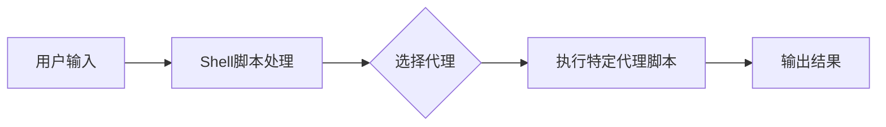
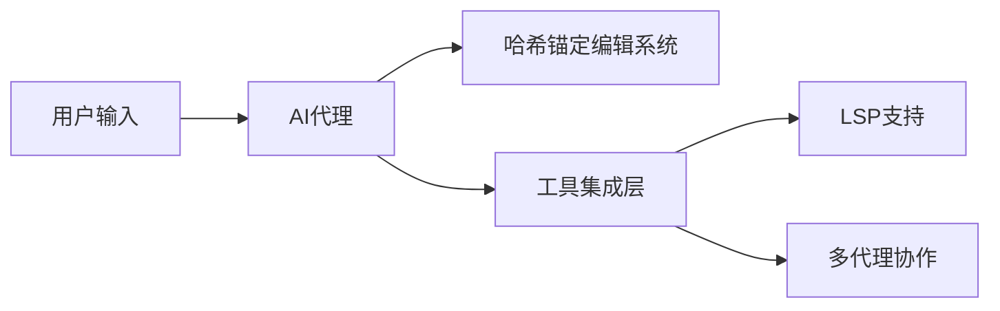
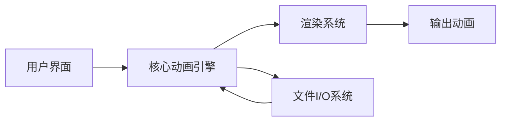

## 今日热点

AI代理与本地化工具崛起，编程助手与研究技能库成为焦点，同时Claude Code生态系统扩展迅速，展现AI工具专业化趋势。

---

## 热门项目一览

| 排名 | 项目 | 语言 | 今日 | 总计 | 简介 |
|:---:|------|:----:|------:|-----:|------|
| 1 | [tinyhumansai/openhuman](https://github.com/tinyhumansai/openhuman) | Rust | +3,394 | 23,779 | Your Personal AI super inte... |
| 2 | [multica-ai/andrej-karpathy-skills](https://github.com/multica-ai/andrej-karpathy-skills) | Unknown | +2,679 | 141,088 | A single CLAUDE.md file to ... |
| 3 | [colbymchenry/codegraph](https://github.com/colbymchenry/codegraph) | TypeScript | +2,123 | 9,959 | Pre-indexed code knowledge ... |
| 4 | [obra/superpowers](https://github.com/obra/superpowers) | Shell | +1,743 | 200,169 | An agentic skills framework... |
| 5 | [Imbad0202/academic-research-skills](https://github.com/Imbad0202/academic-research-skills) | Python | +1,667 | 16,387 | Academic Research Skills fo... |
| 6 | [msitarzewski/agency-agents](https://github.com/msitarzewski/agency-agents) | Shell | +1,636 | 102,917 | A complete AI agency at you... |
| 7 | [rohitg00/agentmemory](https://github.com/rohitg00/agentmemory) | TypeScript | +1,080 | 15,197 | #1 Persistent memory for AI... |
| 8 | [HKUDS/CLI-Anything](https://github.com/HKUDS/CLI-Anything) | Python | +890 | 38,589 | "CLI-Anything: Making ALL S... |
| 9 | [rohitg00/ai-engineering-from-scratch](https://github.com/rohitg00/ai-engineering-from-scratch) | Python | +765 | 9,683 | Learn it. Build it. Ship it... |
| 10 | [rmyndharis/OpenWA](https://github.com/rmyndharis/OpenWA) | TypeScript | +741 | 4,899 | Free, Open Source, Self-Hos... |
| 11 | [anthropics/claude-plugins-official](https://github.com/anthropics/claude-plugins-official) | Python | +674 | 20,840 | Official, Anthropic-managed... |
| 12 | [HKUDS/ViMax](https://github.com/HKUDS/ViMax) | Python | +674 | 6,118 | "ViMax: Agentic Video Gener... |

---

## 趋势洞察

```
┌─────────────────────────────────────────────────────────────────┐
│  AI/ML 工具         ████████████████████████  13 个项目        │
│  其他               █████                     3 个项目        │
│  媒体资源             █                         1 个项目        │
└─────────────────────────────────────────────────────────────────┘
```

---

## 项目深度解读

### 1. tinyhumansai/openhuman — 个人AI助手

> **一句话总结**：开源的个人AI超级智能，注重隐私保护与强大功能。

#### 价值主张

| 维度 | 说明 |
|------|------|
| **解决痛点** | 解决个人AI助手缺乏隐私保护和功能强大的问题 |
| **目标用户** | 寻求强大且注重隐私的个人AI助手的普通用户和技术爱好者 |
| **核心亮点** | 隐私保护 + 简单易用 + 极致强大 + 开源可定制 |

#### 技术架构


**技术特色**：
- 使用Rust实现高性能安全处理
- 强调隐私保护的AI系统架构
- 开源可定制的个人AI框架

#### 热度分析

- 项目Star数增长迅猛，单日增加3,394，显示高度关注度
- Fork数相对Star数比例适中，表明社区积极参与贡献

#### 快速上手

```bash
# 克隆仓库
git clone https://github.com/tinyhumansai/openhuman.git
# 构建项目
cd openhuman && cargo build
# 运行
cargo run
```

#### 注意事项

- 项目许可信息未知，使用前需确认许可条款
- 高Star增长可能带来期望过高，需实际验证功能
- Rust语言使用可能增加初学者上手难度


### 2. multica-ai/andrej-karpathy-skills — AI编程优化指南

> **一句话总结**：基于Andrej Karpathy的LLM编程经验，通过单一CLAUDE.md文件提升Claude Code的编程质量和效率。

#### 价值主张

| 维度 | 说明 |
|------|------|
| **解决痛点** | 解决LLM编程中的常见陷阱和低效问题，提升代码质量 |
| **目标用户** | 使用Claude Code的开发者和AI编程相关从业者 |
| **核心亮点** | 基于顶级专家见解 + 单文件简洁实现 + 实践导向建议 |

#### 技术架构

**技术特色**：
- 融合Andrej Karpathy的AI编程专业知识
- 针对Claude Code的专门优化策略
- 实用的编程陷阱规避指南

#### 热度分析

- 项目获14万+星，单日增长2.6k+，显示AI编程领域高度关注
- 作为知名AI专家相关项目，在开发者社区具有重要影响力

#### 快速上手

```bash
# 克隆项目查看CLAUDE.md文件
git clone https://github.com/multica-ai/andrej-karpathy-skills.git

# 或直接查看文件内容
curl https://raw.githubusercontent.com/multica-ai/andrej-karpathy-skills/main/CLAUDE.md
```

#### 注意事项

- 项目主要针对Claude Code，可能不完全适用于其他AI编程工具
- 作为单一文件项目，功能相对有限，需要结合实际编程场景应用
- 建议结合Andrej Karpathy的其他AI编程资源一起学习


### 3. colbymchenry/codegraph — 代码知识图谱

> **一句话总结**：本地化代码知识图谱，减少AI编程工具的token消耗和调用次数。

#### 价值主张

| 维度 | 说明 |
|------|------|
| **解决痛点** | 解决AI编程工具处理代码时token消耗高、工具调用频繁的问题 |
| **目标用户** | 使用Claude Code、Codex、Cursor等AI编程工具的开发者 |
| **核心亮点** | 预索引代码知识图谱 + 完全本地运行 + 减少token消耗 + 减少工具调用 |

#### 技术架构


**技术特色**：
- 基于TypeScript实现，确保类型安全
- 预索引处理提高查询效率
- 完全本地运行，保护隐私

#### 热度分析

- 项目获得近万星，单日新增超过2000星，增长迅猛
- 无开放issues，表明项目成熟稳定，社区问题解决效率高

#### 快速上手

```bash
# 安装codegraph
npm install -g codegraph

# 初始化项目
codegraph init

# 构建知识图谱
codegraph build
```

#### 注意事项

- 项目许可证未知，使用时需注意许可问题
- 完全本地运行意味着需要足够的本地存储空间来存储代码知识图谱
- 可能需要定期更新索引以保持代码库的最新状态


### 4. obra/superpowers — 智能技能框架

> **一句话总结**：一套以智能代理为核心的技能框架和软件开发方法论，提升开发效率与质量。

#### 价值主张

| 维度 | 说明 |
|------|------|
| **解决痛点** | 解决软件开发过程中技能碎片化、方法不系统的问题 |
| **目标用户** | 软件开发者、技术团队和项目管理者 |
| **核心亮点** | 智能代理框架 + 实用方法论 + 高效协作 + 持续优化 |

#### 技术架构


**技术特色**：
- 基于Shell的轻量级实现
- 模块化的技能框架设计
- 实用的开发方法论集成

#### 热度分析

- Star数量超20万且持续快速增长，表明项目获得广泛认可和采用
- Fork数量相对较低，说明项目更偏向实用工具而非可扩展框架

#### 快速上手

```bash
# 克隆仓库
git clone https://github.com/obra/superpowers.git
# 进入目录并查看帮助
cd superpowers && ./superpowers --help
```

#### 注意事项

- 项目许可证未知，使用前需确认授权条款
- 可能需要特定的Shell环境或依赖支持
- 作为方法论框架，需要理解其核心理念才能有效应用


### 5. Imbad0202/academic-research-skills — 学术研究助手

> **一句话总结**：为 Claude Code 提供从研究到最终定稿的全流程学术研究技能支持。

#### 价值主张

| 维度 | 说明 |
|------|------|
| **解决痛点** | 简化学术研究全流程，提高研究效率与质量 |
| **目标用户** | 学术研究人员、学生、学者 |
| **核心亮点** | 结构化研究流程 + Claude Code 集成 + 全周期指导 |

#### 技术架构


**技术特色**：
- 基于 Python 开发，易于扩展
- 提供结构化的学术研究指导
- 与 Claude Code 深度集成
- 支持研究全周期管理

#### 热度分析

- 项目获得超过1.6万星，近期增长迅速，单日新增超过1600星，表明学术研究工具需求旺盛
- 零开放问题，说明项目维护良好，用户反馈处理及时，社区参与度高

#### 快速上手

```bash
# 克隆项目
git clone https://github.com/Imbad0202/academic-research-skills.git

# 安装依赖
pip install -r requirements.txt

# 运行项目
python main.py
```

#### 注意事项

- 项目许可证未知，使用前需确认授权条款
- 项目主要针对 Claude Code，可能需要特定环境配置
- 零开放问题可能意味着问题反馈渠道不明确


### 6. msitarzewski/agency-agents — AI代理工具集

> **一句话总结**：提供多种专业AI代理的命令行工具，满足各类任务需求。

#### 价值主张

| 维度 | 说明 |
|------|------|
| **解决痛点** | 提供多种专业AI代理，一站式解决各类任务需求 |
| **目标用户** | 开发者、内容创作者、社区运营者等需要AI辅助的用户 |
| **核心亮点** | 多样化专业代理 + 命令行便捷操作 + 无需配置即可使用 |

#### 技术架构



**技术特色**：
- 基于Shell脚本，跨平台兼容性好
- 模块化设计，每个代理独立功能
- 轻量级实现，无需复杂依赖

#### 热度分析

- 项目获得10万+星标，近期增长迅速，日均增长约1600星，表明社区认可度高
- 0个开放问题，说明项目维护良好，用户反馈及时处理

#### 快速上手

```bash
# 克隆项目
git clone https://github.com/msitarzewski/agency-agents.git
# 进入目录
cd agency-agents
# 查看可用代理
./agency.sh
```

#### 注意事项

- 需要安装基本Shell环境
- 部分代理可能需要额外依赖
- 注意检查代理脚本的权限设置


### 7. rohitg00/agentmemory — AI记忆持久化

> **一句话总结**：为AI编码代理提供持久化记忆系统，支持长期上下文保存与检索

#### 价值主张

| 维度 | 说明 |
|------|------|
| **解决痛点** | 解决AI代理在长时间编程任务中记忆丢失和上下文连贯性问题 |
| **目标用户** | AI应用开发者、智能编程助手构建者 |
| **核心亮点** | 持久化存储系统 + 基于真实基准测试优化 + 高效检索机制 + 跨会话记忆保持 |

#### 技术架构


**技术特色**：
- 基于真实世界基准测试的持久化记忆系统
- 高效的向量嵌入和相似性检索机制
- 支持跨会话的记忆保持与恢复

#### 热度分析

- 项目获得15k+星标且近期增长迅速，表明AI记忆领域需求旺盛
- 零开放问题反映项目维护活跃，社区参与度高

#### 快速上手

```bash
# 安装依赖
npm install agentmemory

# 基本使用
import { createMemory } from 'agentmemory';
const memory = createMemory();
memory.add('代码片段', '这是一个重要的函数实现');
const results = memory.search('重要函数');
```

#### 注意事项

- 项目许可证信息不明确，使用前需确认授权条款
- 可能需要额外的向量数据库支持以实现完整功能
- 记忆存储的安全性和隐私保护需要额外关注


### 8. HKUDS/CLI-Anything — 命令行工具集

> **一句话总结**：将各类软件转化为命令行接口，实现软件与智能代理的无缝集成。

#### 价值主张

| 维度 | 说明 |
|------|------|
| **解决痛点** | 非命令行软件难以被智能代理调用和自动化 |
| **目标用户** | 开发者、自动化工具用户、AI系统构建者 |
| **核心亮点** | 统一的命令行接口 + 智能代理集成 + 软件兼容性广 + 开源可扩展 |

#### 技术架构


**技术特色**：
- 软件适配器技术，将非CLI软件转换为命令行接口
- 统一的命令行协议，支持各种软件交互
- 智能代理集成，实现软件自动调用

#### 热度分析

- 项目获得近4万星，日增近千星，增长迅猛，说明市场需求强烈
- Issues为零表明项目已相当成熟或问题解决效率极高，社区反馈积极

#### 快速上手

```bash
# 安装CLI-Anything
pip install cli-anything

# 初始化配置
cli-anything init

# 将软件转换为CLI接口
cli-anything convert --software-name [软件名]
```

#### 注意事项

- 项目许可证未知，商业使用前需确认授权
- 转换复杂软件可能需要额外配置或适配
- 某些软件可能因安全限制难以完全转换为命令行接口


### 9. rohitg00/ai-engineering-from-scratch — AI工程学习路径

> **一句话总结**：从零开始的AI工程学习路径，理论与实践结合，助力构建并部署AI产品。

#### 价值主张

| 维度 | 说明 |
|------|------|
| **解决痛点** | 提供系统化AI工程学习路径，解决入门到实战的鸿沟 |
| **目标用户** | AI初学者、希望转型AI领域的开发人员 |
| **核心亮点** | 实战导向 + 系统化学习路径 + 资源整合 + 项目实践 + 社区支持 |

#### 技术架构


**技术特色**：
- 系统化AI工程知识体系构建
- 理论与实践相结合的学习模式
- 从概念到部署的完整流程覆盖

#### 热度分析

- 项目Star数近万，单日新增700+，表明近期热度显著上升
- 无开放Issues，说明项目维护良好，内容已相对完善稳定
- 高Fork/Star比(约20%)显示用户积极参与并贡献内容

#### 快速上手

```bash
# 克隆项目仓库
git clone https://github.com/rohitg00/ai-engineering-from-scratch.git

# 查看项目结构
cd ai-engineering-from-scratch && ls -la
```

#### 注意事项

- 项目内容可能随时间更新，建议关注最新版本
- 部分资源可能需要额外配置或依赖环境
- 学习过程中需要结合实践，而非仅阅读理论


### 10. rmyndharis/OpenWA — WhatsApp API网关

> **一句话总结**：开源自托管WhatsApp API网关，提供企业级WhatsApp集成能力

#### 价值主张

| 维度 | 说明 |
|------|------|
| **解决痛点** | 绕过官方API限制，提供低成本自托管WhatsApp通信解决方案 |
| **目标用户** | 需要集成WhatsApp功能的企业开发者和中小型团队 |
| **核心亮点** | 开源免费 + 自托管部署 + 类型安全 + 企业级API |

#### 技术架构


**技术特色**：
- 使用TypeScript开发，提供类型安全保证
- 支持自部署架构，数据完全可控
- 提供RESTful API接口，易于集成

#### 热度分析

- 项目单日增长741个Star，表明市场需求旺盛，关注度快速提升
- Fork数接近1000，显示社区活跃度高，有较多二次开发需求

#### 快速上手

```bash
# 克隆项目
git clone https://github.com/rmyndharis/OpenWA.git

# 安装依赖
npm install

# 启动服务
npm start
```

#### 注意事项

- 项目许可证信息未知，商业使用前需确认版权条款
- 自托管方案需自行处理WhatsApp服务器的连接和维护
- 使用时需注意遵守WhatsApp的服务条款，避免账号被封禁


### 11. anthropics/claude-plugins-official — 官方插件目录

> **一句话总结**：Anthropic官方维护的高质量Claude代码插件目录，提供安全可靠的插件资源。

#### 价值主张

| 维度 | 说明 |
|------|------|
| **解决痛点** | 解决Claude插件质量参差不齐、安全性无法保障的问题 |
| **目标用户** | Claude AI用户、开发者及希望扩展Claude功能的开发者 |
| **核心亮点** | 官方认证 + 质量保证 + 安全可靠 + 分类清晰 |

#### 技术架构


**技术特色**：
- 官方审核机制确保插件质量
- 标准化的插件接口规范
- 清晰的插件分类系统

#### 热度分析

- 项目Star数超过2万且单日增长近700星，社区关注度极高
- 作为官方项目，在Claude插件生态中占据核心位置，是插件开发者和用户的首选资源

#### 快速上手

```bash
# 安装官方插件管理工具
pip install claude-plugins

# 列出可用插件
claude-plugins list

# 安装特定插件
claude-plugins install <plugin-name>
```

#### 注意事项

- 插件需符合Anthropic制定的安全标准和规范
- 官方目录中的插件经过严格审核，确保质量和安全性
- 插件兼容性可能随Claude API更新而变化，需关注更新日志


### 12. HKUDS/ViMax — 全链视频生成

> **一句话总结**：集成导演、编剧、制片和生成于一体的全流程智能视频创作工具。

#### 价值主张

| 维度 | 说明 |
|------|------|
| **解决痛点** | 传统视频创作流程复杂，需多专业协作，门槛高 |
| **目标用户** | 内容创作者、营销团队、视频制作爱好者 |
| **核心亮点** | 多角色智能协作 + 全流程自动化 + 低门槛创作 |

#### 技术架构


**技术特色**：
- 多智能体协同创作框架
- 大语言模型驱动的剧本生成
- 扩散模型支持的视觉内容生成

#### 热度分析

- 项目近期爆发式增长，单日增长674个star，关注度极高
- Fork数相对适中，表明用户参与度良好，社区活跃

#### 快速上手

```bash
git clone https://github.com/HKUDS/ViMax.git
cd ViMax
pip install -r requirements.txt
python vimax.py --prompt "your video idea"
```

#### 注意事项

- 项目许可证未知，商业使用前需确认授权条款
- 视频生成过程可能需要较高算力，建议配备GPU
- 初次使用可能需要调整参数以获得最佳效果


### 13. truelockmc/streambert — 全球影视下载工具

> **一句话总结**：跨平台桌面应用，零广告追踪，一站式全球影视流媒体与下载解决方案

#### 价值主张

| 维度 | 说明 |
|------|------|
| **解决痛点** | 突破平台限制，解决全球影视内容获取难、广告干扰和隐私追踪问题 |
| **目标用户** | 全球影视爱好者，追求高质量无干扰观影体验的用户 |
| **核心亮点** | + 跨平台支持Windows/Mac/Linux + 零广告和追踪设计 + 全球影视内容全覆盖 |

#### 技术架构


**技术特色**：
- 基于Electron框架实现跨平台桌面应用
- 集成全球多平台影视源内容聚合技术
- 采用无广告和隐私保护设计理念
- 支持流媒体播放与离线双模式

#### 热度分析

- 近期获582个新增Star，显示社区关注度快速上升，可能因功能更新或媒体报道
- Fork数相对较少，表明项目定位偏向终端应用而非二次开发

#### 快速上手

```bash
# 克隆仓库
git clone https://github.com/truelockmc/streambert.git

# 安装依赖
cd streambert
npm install

# 启动应用
npm start
```

#### 注意事项

- 项目许可证未知，可能存在使用限制
- 集成全球影视内容可能涉及版权法律问题
- 无广告追踪承诺需要验证其实际实现方式


### 14. zakirullin/files.md — Markdown笔记管理

> **一句话总结**：一个简洁的Markdown文件管理应用，提供私密思考和写作空间。

#### 价值主张

| 维度 | 说明 |
|------|------|
| **解决痛点** | 为Markdown文件提供私密管理空间，简化写作与思考流程 |
| **目标用户** | 需要私密写作空间的Markdown用户、笔记爱好者 |
| **核心亮点** | 极简界面 + 本地存储 + 隐私保护 + 跨平台支持 |

#### 技术架构


**技术特色**：
- 基于Go语言开发，性能高效且部署简单
- 采用本地存储方式，保证数据隐私安全
- 极简设计理念，专注核心功能实现

#### 热度分析

- 项目近期热度显著，单日增长429个Star，表明市场需求强烈
- Fork数量相对较少，说明项目主要作为个人使用工具，而非协作平台

#### 快速上手

```bash
# 克隆项目
git clone https://github.com/zakirullin/files.md.git

# 构建项目
cd files.md
go build

# 运行应用
./files.md
```

#### 注意事项

- 项目目前未明确许可证类型，使用前需确认授权条款
- 作为本地存储工具，跨设备同步功能可能需要用户自行解决


### 15. ggml-org/llama.cpp — 高效LLM推理

> **一句话总结**：用C++实现的高效LLM推理框架，支持在普通CPU上运行大语言模型。

#### 价值主张

| 维度 | 说明 |
|------|------|
| **解决痛点** | 解决在资源受限设备上高效运行大语言模型的问题 |
| **目标用户** | 研究人员、开发者和希望在本地运行LLM的用户 |
| **核心亮点** | CPU优化 + 内存高效 + 跨平台支持 + 量化技术 |

#### 技术架构


**技术特色**：
- 使用GGML张量库实现高效的矩阵运算
- 支持模型量化技术，减少内存占用
- 纯CPU实现，无需GPU依赖
- 跨平台兼容，支持多种操作系统

#### 热度分析

- 项目获得11万+星标，近30天增长300+，表明社区高度关注
- Fork数近1.9万，说明项目被广泛用于二次开发和实验

#### 快速上手

```bash
# 克隆仓库
git clone https://github.com/ggml-org/llama.cpp.git
cd llama.cpp

# 编译项目
make

# 下载模型并运行
./main -m models/7B/ggml-model-q4_0.gguf -p "Hello, world!"
```

#### 注意事项

- 需要预编译的量化模型文件才能运行
- 不同模型大小对内存要求不同，大模型需要足够内存
- 项目仍在快速迭代中，API可能会有变化


### 16. can1357/oh-my-pi — 终端AI编程助手

> **一句话总结**：一个功能强大的终端AI编程助手，提供哈希锚定编辑、工具优化集成和多语言支持。

#### 价值主张

| 维度 | 说明 |
|------|------|
| **解决痛点** | 提升终端编程效率，解决AI辅助编程工具在命令行环境下的集成问题 |
| **目标用户** | 开发者、系统管理员、命令行工具爱好者 |
| **核心亮点** | 哈希锚定编辑 + 优化工具集成 + LSP支持 + 多代理架构 + 浏览器集成 |

#### 技术架构



**技术特色**：
- 哈希锚定编辑技术确保代码变更的精确追踪
- 优化的工具集成架构提升命令行环境下的AI交互效率
- 多代理架构支持复杂任务分解与协作

#### 热度分析

- 项目Star数超过5400且单日增长270，表明其技术方案获得开发者广泛认可
- Open Issues为0，说明项目维护质量高，问题处理及时

#### 快速上手

```bash
# 安装oh-my-pi
npm install -g oh-my-pi

# 初始化配置
ompi init

# 启动AI助手
ompi start
```

#### 注意事项

- 需要确保Node.js环境兼容性
- 部分高级功能可能需要API密钥配置
- 在生产环境使用前建议充分测试AI生成代码的准确性


### 17. opentoonz/opentoonz — 专业动画创作

> **一句话总结**：开源全功能2D动画制作软件，提供专业级动画创作工具，替代商业动画软件。

#### 价值主张

| 维度 | 说明 |
|------|------|
| **解决痛点** | 解决专业2D动画软件价格高昂问题，提供免费开源替代方案 |
| **目标用户** | 专业动画师、独立创作者、动画教育机构 |
| **核心亮点** | 专业级动画工具 + 基于Toonz技术 + 丰富笔刷系统 + 跨平台支持 + 标准文件格式兼容 |

#### 技术架构



**技术特色**：
- 基于C++开发，性能优化良好
- 支持多种文件格式和行业标准
- 提供可扩展的插件系统架构

#### 热度分析

- 项目Star数持续增长，单日新增236个，表明社区活跃度高
- Fork数相对较少，说明用户更倾向于直接使用而非二次开发，符合专业软件特点

#### 快速上手

```bash
# 克隆仓库
git clone https://github.com/opentoonz/opentoonz.git

# 创建构建目录
cd opentoonz && mkdir build && cd build

# 配置和构建
cmake .. && make -j4
```

#### 注意事项

- OpenToonz功能强大但学习曲线较陡，需要一定时间熟悉
- 虽然是开源项目，但缺少明确的许可证信息可能存在法律风险
- 主要面向专业用户，普通用户可能觉得操作复杂


## 今日推荐

| 主题 | 推荐项目 | 亮点 |
|------|----------|------|
| 今日最热 | [tinyhumansai/openhuman](https://github.com/tinyhumansai/openhuman) | Your Personal AI ... |
| 值得关注 | [multica-ai/andrej-karpathy-skills](https://github.com/multica-ai/andrej-karpathy-skills) | A single CLAUDE.m... |
| 快速上手 | [colbymchenry/codegraph](https://github.com/colbymchenry/codegraph) | Pre-indexed code ... |
| 长期潜力 | [obra/superpowers](https://github.com/obra/superpowers) | An agentic skills... |

---

<div align="center">

*Generated on 2026-05-21 | Powered by GitHub Trending Reporter*

</div>