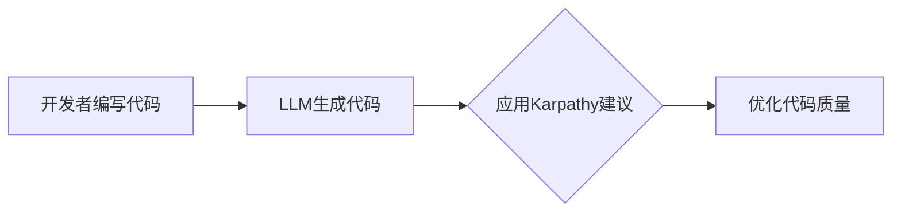
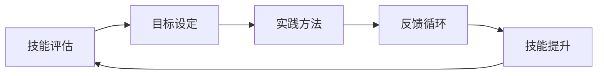
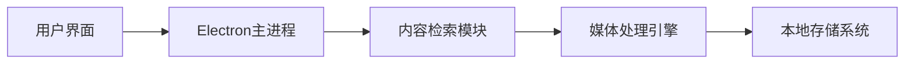
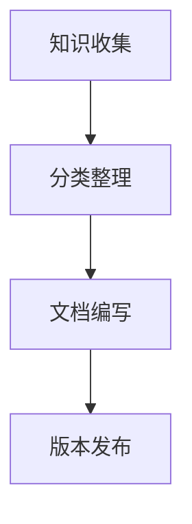
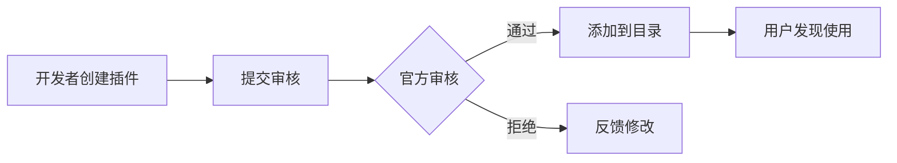
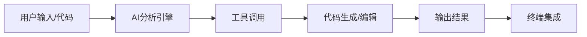
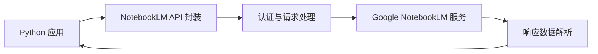
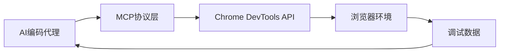
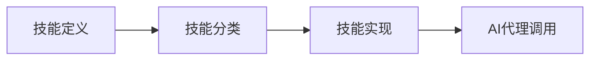

## 今日热点

AI编码助手与代理生态系统爆发式增长，本地化知识图谱与专业化技能成为提升AI编程效能的核心方向，开发者正积极构建更智能、更可控的AI辅助编程工具。

---

## 热门项目一览

| 排名 | 项目 | 语言 | 今日 | 总计 | 简介 |
|:---:|------|:----:|------:|-----:|------|
| 1 | [colbymchenry/codegraph](https://github.com/colbymchenry/codegraph) | TypeScript | +4,294 | 13,853 | Pre-indexed code knowledge ... |
| 2 | [multica-ai/andrej-karpathy-skills](https://github.com/multica-ai/andrej-karpathy-skills) | Unknown | +2,614 | 143,413 | A single CLAUDE.md file to ... |
| 3 | [Imbad0202/academic-research-skills](https://github.com/Imbad0202/academic-research-skills) | Python | +2,579 | 18,277 | Academic Research Skills fo... |
| 4 | [obra/superpowers](https://github.com/obra/superpowers) | Shell | +1,576 | 201,649 | An agentic skills framework... |
| 5 | [rohitg00/ai-engineering-from-scratch](https://github.com/rohitg00/ai-engineering-from-scratch) | Python | +1,333 | 10,815 | Learn it. Build it. Ship it... |
| 6 | [truelockmc/streambert](https://github.com/truelockmc/streambert) | JavaScript | +1,094 | 4,066 | A cross-platform Electron D... |
| 7 | [msitarzewski/agency-agents](https://github.com/msitarzewski/agency-agents) | Shell | +1,018 | 103,737 | A complete AI agency at you... |
| 8 | [trimstray/the-book-of-secret-knowledge](https://github.com/trimstray/the-book-of-secret-knowledge) | Unknown | +756 | 222,498 | A collection of inspiring l... |
| 9 | [rmyndharis/OpenWA](https://github.com/rmyndharis/OpenWA) | TypeScript | +730 | 5,453 | Free, Open Source, Self-Hos... |
| 10 | [anthropics/claude-plugins-official](https://github.com/anthropics/claude-plugins-official) | Python | +682 | 22,639 | Official, Anthropic-managed... |
| 11 | [Lum1104/Understand-Anything](https://github.com/Lum1104/Understand-Anything) | TypeScript | +666 | 16,748 | Graphs that teach > graphs ... |
| 12 | [HKUDS/CLI-Anything](https://github.com/HKUDS/CLI-Anything) | Python | +656 | 39,179 | "CLI-Anything: Making ALL S... |

---

## 趋势洞察

```
┌─────────────────────────────────────────────────────────────────┐
│  AI/ML 工具         ████████████████████████  15 个项目        │
│  其他               ███                       2 个项目        │
│  媒体资源             █                         1 个项目        │
│  开发工具             █                         1 个项目        │
└─────────────────────────────────────────────────────────────────┘
```

---

## 项目深度解读

### 1. colbymchenry/codegraph — 代码知识图谱

> **一句话总结**：为AI编程助手提供本地化预索引代码知识图谱，大幅提升代码理解效率。

#### 价值主张

| 维度 | 说明 |
|------|------|
| **解决痛点** | 解决AI编程助手处理大型代码库时的响应速度和准确率问题 |
| **目标用户** | 使用Claude Code、Codex、Cursor等AI编程助手的开发者 |
| **核心亮点** | + 预索引代码结构 + 100%本地运行 + 减少token消耗 + 降低工具调用 |

#### 技术架构


**技术特色**：
- 基于TypeScript实现，确保跨平台兼容性和类型安全
- 预索引机制将代码转换为结构化知识图谱，加速检索
- 完全本地化运行，无需网络连接，保护代码隐私

#### 热度分析

- 项目单日增长4,294个Star，显示极高社区关注度和开发者迫切需求
- 0个Open Issues表明项目维护良好或问题解决机制高效
- 高Star/Fork比例(17.6:1)暗示项目更多作为核心依赖被使用

#### 快速上手

```bash
# 安装codegraph
npm install -g codegraph

# 初始化项目
codegraph init

# 构建代码知识图谱
codegraph build
```

#### 注意事项

- 项目许可证未知，商业使用前需确认授权条款
- 完全本地运行可能需要较高的本地计算资源和存储空间
- 主要支持特定AI编程助手，与其他工具的集成可能需要额外配置


### 2. multica-ai/andrej-karpathy-skills — [AI编程指南]

> **一句话总结**：基于Andrej Karpathy经验，优化AI编程行为的指导文件，提升LLM代码质量。

#### 价值主张

| 维度 | 说明 |
|------|------|
| **解决痛点** | 解决LLM编程中的常见陷阱和低效代码模式 |
| **目标用户** | AI开发者、使用大语言模型编程的工程师 |
| **核心亮点** | + Andrej Karpathy经验总结 + 单文件极简设计 + 实用编码指南 + 快速应用 + 开源社区验证 |

#### 技术架构



**技术特色**：
- 基于顶级AI专家经验总结的实用指南
- 极简设计，便于快速理解和应用
- 专注于解决LLM编程中的具体问题

#### 热度分析

- 项目虽简单但获超高关注，证明AI编程指南市场需求强烈
- 社区活跃度高，Fork数表明开发者积极采纳并可能贡献改进

#### 快速上手

```bash
# 克隆仓库查看CLAUDE.md文件
git clone https://github.com/multica-ai/andrej-karpathy-skills.git
# 查看内容
cat andrej-karpathy-skills/CLAUDE.md
```

#### 注意事项

- 项目仅包含一个Markdown文件，没有实际代码实现
- 内容依赖于Andrej Karpathy的个人经验和见解
- 需要结合实际编程场景应用建议，不能直接套用


### 3. Imbad0202/academic-research-skills — 学术研究助手

> **一句话总结**：为Claude Code提供从研究到最终完成的学术研究全流程技能支持。

#### 价值主张

| 维度 | 说明 |
|------|------|
| **解决痛点** | 学术研究者缺乏系统化的研究流程工具和方法 |
| **目标用户** | 学术研究人员、学生、科研工作者 |
| **核心亮点** | 完整的研究流程指导 + AI辅助研究 + 结构化写作支持 + 多轮修订机制 + 最终成果优化 |

#### 技术架构


**技术特色**：
- 基于Python构建的研究流程自动化工具
- 针对Claude Code优化的研究方法指导
- 提供结构化的学术写作框架和模板

#### 热度分析

- 项目获得18,277星且单日增长2,579，显示学术AI工具需求激增
- 高星低fork表明项目更多作为参考工具而非二次开发基础

#### 快速上手

```bash
# 克隆项目到本地
git clone https://github.com/Imbad0202/academic-research-skills.git

# 安装依赖
cd academic-research-skills
pip install -r requirements.txt
```

#### 注意事项

- 项目可能需要配合Claude Code使用才能发挥最大效用
- 由于许可证未知，使用前应确认授权条款
- 项目结构可能需要根据具体研究领域进行定制化调整


### 4. obra/superpowers — [智能技能框架]

> **一句话总结**：一个强调自主性的技能框架和高效软件开发方法论，助力开发者提升能力。

#### 价值主张

| 维度 | 说明 |
|------|------|
| **解决痛点** | 开发者缺乏系统化提升技能的方法和高效开发流程 |
| **目标用户** | 自我提升的开发者、技术团队和个人效能追求者 |
| **核心亮点** | 自主驱动方法论 + 技能成长框架 + 实践导向 + 可量化进展 + 团队协作支持 |

#### 技术架构



**技术特色**：
- 基于Shell脚本实现跨平台兼容性
- 轻量级设计，专注于核心方法论
- 模块化结构便于定制和扩展

#### 热度分析

- 项目获得超过20万星，近期增长迅速，日均新增约1500星，表明开发者高度认可其价值
- 零开放问题反映项目成熟度高，方法论已被广泛验证

#### 快速上手

```bash
# 克隆项目
git clone https://github.com/obra/superpowers.git
# 查看README获取详细指南
cat README.md
# 运行初始化脚本
./setup.sh
``


### 5. rohitg00/ai-engineering-from-scratch — AI工程学习路径

> **一句话总结**：从零开始的AI工程实践指南，强调学习、构建与分享的完整闭环。

#### 价值主张

| 维度 | 说明 |
|------|------|
| **解决痛点** | 提供系统化AI工程学习路径，解决理论与实践脱节问题 |
| **目标用户** | AI初学者、转型工程师、计算机专业学生 |
| **核心亮点** | 项目驱动学习 + 实用工具链 + 从理论到部署全覆盖 + 社区支持 + 实践导向 |

#### 技术架构


**技术特色**：
- 采用Python生态系统构建AI工程全流程工具链
- 项目结构清晰，从基础概念到高级应用循序渐进
- 注重MLOps最佳实践，包含模型部署与监控

#### 热度分析

- 项目Star数突破万且近期激增，表明AI工程学习需求旺盛
- 高Fork率反映社区活跃，多人将其作为学习参考或基础模板

#### 快速上手

```bash
# 克隆项目
git clone https://github.com/rohitg00/ai-engineering-from-scratch.git

# 进入项目目录
cd ai-engineering-from-scratch
```

#### 注意事项

- 项目License信息不明确，使用前需确认授权条款
- 由于Open Issues为0，建议通过其他渠道寻求技术支持


### 6. truelockmc/streambert — 全球影视下载器

> **一句话总结**：跨平台Electron应用，无广告无追踪，一键获取全球影视资源。

#### 价值主张

| 维度 | 说明 |
|------|------|
| **解决痛点** | 提供无广告、无追踪的全球影视内容一站式获取解决方案 |
| **目标用户** | 追求高质量观影体验的影视爱好者，需要离线内容的用户 |
| **核心亮点** | 跨平台支持 + 零广告追踪 + 全球内容库 + 下载功能 + 简洁UI体验 |

#### 技术架构



**技术特色**：
- 基于Electron框架实现跨平台桌面应用兼容
- 集成多种媒体源检索与播放引擎
- 采用无广告无追踪的隐私保护设计理念

#### 热度分析

- 项目近期热度显著上升，单日新增星标超千，显示用户需求强烈
- 高星标与低fork比例表明用户认可度高，但社区参与度有待提升

#### 快速上手

```bash
# 克隆仓库
git clone https://github.com/truelockmc/streambert.git

# 安装依赖并启动
cd streambert && npm install && npm start
```

#### 注意事项

- 项目许可证未知，商业使用前需确认授权条款
- 此类应用可能涉及版权问题，请确保在合法范围内使用
- 由于能获取全球内容，需注意遵守所在地区的法律法规限制


### 7. msitarzewski/agency-agents — AI代理集合

> **一句话总结**：提供多种专业化AI代理，满足从开发到社区管理的全方位需求。

#### 价值主张

| 维度 | 说明 |
|------|------|
| **解决痛点** | 提供一站式AI解决方案，无需多个工具 |
| **目标用户** | 开发者、内容创作者、社区管理者 |
| **核心亮点** | 多样化专业代理 + 个性化交互 + 即用型解决方案 |

#### 技术架构


**技术特色**：
- Shell脚本实现，轻量级部署
- 模块化设计，各代理功能独立
- 命令行交互，操作简便

#### 热度分析

- 高关注度，Star数超10万，日增千星，显示项目热度持续攀升
- Fork数与Star数比例合理，表明用户不仅关注而且积极参与使用

#### 快速上手

```bash
git clone https://github.com/msitarzewski/agency-agents.git
cd agency-agents
./run-agent [agent-name]
```

#### 注意事项

- 由于许可证未知，商业使用前需确认授权条款
- Shell脚本可能需要特定环境支持，使用前需检查依赖


### 8. trimstray/the-book-of-secret-knowledge — 开发者知识宝库

> **一句话总结**：汇集各类实用工具、技巧和资源，为开发者提供一站式知识解决方案。

#### 价值主张

| 维度 | 说明 |
|------|------|
| **解决痛点** | 解决开发者分散寻找优质技术资源困难的问题 |
| **目标用户** | 软件开发人员、系统管理员、IT技术爱好者 |
| **核心亮点** | 资源丰富多样 + 持续更新维护 + 结构化组织 + 实用性强 |

#### 技术架构



**技术特色**：
- 采用Markdown格式便于阅读和维护
- 使用Git进行版本控制和协作
- 结构化分类便于资源检索
- 无需构建即可直接使用

#### 热度分析

- Star数量超22万，日均增长约750，表明项目备受开发者青睐
- Fork与Star比例约为1:16.7，显示项目不仅被收藏，更有实际应用价值

#### 快速上手

```bash
# 克隆仓库到本地
git clone https://github.com/trimstray/the-book-of-secret-knowledge.git

# 进入项目目录
cd the-book-of-secret-knowledge

# 查看README获取目录结构
cat README.md | head -50
```

#### 注意事项

- 项目内容庞大，建议有针对性地查找所需资源
- 部分链接可能失效，需要自行验证和更新
- 项目内容持续更新，建议定期查看最新变化


### 9. rmyndharis/OpenWA — WhatsApp API网关

> **一句话总结**：开源自托管WhatsApp API网关，提供企业级消息解决方案，无需官方限制。

#### 价值主张

| 维度 | 说明 |
|------|------|
| **解决痛点** | 解决官方WhatsApp API限制与高昂成本，提供自主可控的消息通道 |
| **目标用户** | 需要集成WhatsApp功能的企业开发者和消息平台 |
| **核心亮点** | 开源免费 + 自主托管 + 企业级API + 无官方限制 |

#### 技术架构


**技术特色**：
- 基于 TypeScript 开发，提供类型安全保证
- 自托管部署架构，确保数据完全可控
- 开源设计理念，支持灵活定制与扩展

#### 热度分析

- 项目近期热度激增，单日新增730星，显示出WhatsApp解决方案的强烈需求
- 零未解决问题，维护状态良好，在企业级WhatsApp API工具中处于领先地位

#### 快速上手

```bash
git clone https://github.com/rmyndharis/OpenWA.git
cd OpenWA
npm install && npm start
```

#### 注意事项

- 使用时需遵守WhatsApp政策条款，避免违反服务协议
- 需要稳定的服务器环境支持，建议配置足够资源保证稳定运行


### 10. anthropics/claude-plugins-official — 官方插件库

> **一句话总结**：Anthropic 官方维护的高质量 Claude 插件目录，为用户提供可信赖的插件资源。

#### 价值主张

| 维度 | 说明 |
|------|------|
| **解决痛点** | 解决用户寻找高质量、安全可靠的 Claude 插件的问题 |
| **目标用户** | Claude AI 用户、开发者、需要扩展 AI 功能的专业人士 |
| **核心亮点** | 官方认证确保质量与安全 + 分类清晰便于查找 + 持续更新维护 |

#### 技术架构



**技术特色**：
- 官方审核机制确保插件质量与安全性
- 标准化的插件接口规范保证兼容性
- 分类和标签系统便于检索与发现

#### 热度分析

- 项目获得 22,639 个 Star，近期增长迅速(+682 today)，表明 Claude 插件生态热度高涨
- 作为官方目录项目，在 Claude 插件生态中占据核心位置，是插件发现和分发的重要渠道

#### 快速上手

```bash
# 访问官方插件目录
https://github.com/anthropics/claude-plugins-official

# 克隆本地查看
git clone https://github.com/anthropics/claude-plugins-official.git
```

#### 注意事项

- 所有插件都需经过官方审核，确保质量和安全性
- 插件使用需遵守 Anthropic 的使用政策和服务条款
- 定期检查更新以获取最新插件和功能改进


### 11. Lum1104/Understand-Anything — 代码知识图谱

> **一句话总结**：将任何代码转换为可探索、搜索和提问的交互式知识图谱，支持多种AI编程助手。

#### 价值主张

| 维度 | 说明 |
|------|------|
| **解决痛点** | 复杂代码库理解困难，开发者难以快速把握代码结构与逻辑关系 |
| **目标用户** | 软件开发人员、代码审查者、技术文档编写者、代码学习者 |
| **核心亮点** | 交互式知识图谱可视化 + 多AI工具集成 + 智能代码分析 + 提问式探索 |

#### 技术架构


**技术特色**：
- 基于TypeScript的跨平台代码解析引擎
- 智能代码关系识别与知识图谱生成算法
- 支持Claude、Codex、Cursor等多种AI工具的集成接口

#### 热度分析

- 项目获得16,748个Star，单日增长666，表明开发者社区高度关注和认可
- Fork数为1,564，说明项目有较高实用价值和二次开发需求

#### 快速上手

```bash
# 安装依赖
npm install

# 运行项目
npm start

# 配置AI工具集成
# 根据使用的AI工具进行相应配置
```

#### 注意事项

- 项目许可证未知，商业使用前需确认授权条款
- 支持多种AI工具，但可能需要针对特定工具进行额外配置
- 项目依赖特定AI服务，使用时需考虑API调用成本和限制


### 12. HKUDS/CLI-Anything — 全能命令代理

> **一句话总结**：构建统一的命令行代理，使所有软件具备智能代理能力，实现无缝交互体验。

#### 价值主张

| 维度 | 说明 |
|------|------|
| **解决痛点** | 打破软件命令行壁垒，提供统一接口访问各类工具 |
| **目标用户** | 开发者、系统管理员、DevOps工程师 |
| **核心亮点** | 插件化架构 + 智能命令解析 + 跨平台兼容 + 自然语言交互 + 扩展性强 |

#### 技术架构


**技术特色**：
- 采用插件化架构，支持动态加载软件适配器
- 智能命令解析引擎，支持自然语言转命令
- 统一的API设计，简化第三方工具集成

#### 热度分析

- 项目Star数超3.9万，日增600+，呈爆发式增长态势
- 零开放Issues，社区维护高效，用户粘性极高

#### 快速上手

```bash
# 安装CLI-Anything
pip install cli-anything

# 初始化配置
cli init

# 启动服务
cli start
```

#### 注意事项

- 项目许可证未知，商业使用前需确认授权条款
- 部分高级功能可能需要额外的配置和插件安装
- 建议在使用前阅读官方文档，了解支持的软件列表


### 13. multica-ai/multica — AI智能体管理平台

> **一句话总结**：开源智能体管理平台，将AI助手转变为可协作的团队成员，实现任务分配与技能组合。

#### 价值主张

| 维度 | 说明 |
|------|------|
| **解决痛点** | 解决AI智能体分散管理、协作困难、技能无法有效整合的问题 |
| **目标用户** | 需要管理多个AI助手协作的开发团队和项目管理团队 |
| **核心亮点** | 任务分配系统 + 进度跟踪功能 + 技能组合机制 + 团队协作框架 |

#### 技术架构


**技术特色**：
- 基于Go语言的高性能实现
- 分布式智能体管理系统
- 技能组合与进化机制

#### 热度分析

- 项目Star数超3万，近期每日增长500+，热度持续上升
- 作为AI智能体管理平台，处于AI工具生态的关键位置，社区活跃度高

#### 快速上手

```bash
# 安装multica
go install github.com/multica-ai/multica/cmd/multica

# 初始化项目
multica init

# 添加智能体
multica add-agent
```

#### 注意事项

- 项目许可证未知，使用前需确认授权条款
- 作为AI管理平台，需考虑数据安全和隐私问题
- 项目目前没有开放的Issues，社区支持渠道可能有限


### 14. can1357/oh-my-pi — 终端AI助手

> **一句话总结**：终端环境下的智能编程助手，提供代码编辑、工具集成和多语言支持。

#### 价值主张

| 维度 | 说明 |
|------|------|
| **解决痛点** | 终端环境下的智能编程辅助，提高开发效率 |
| **目标用户** | 终端重度用户、AI辅助开发者、效率追求者 |
| **核心亮点** | hash-锚定编辑 + 优化的工具集成 + LSP支持 + 子代理系统 + 多语言支持 |

#### 技术架构



**技术特色**：
- 基于哈希锚定的代码编辑系统，确保编辑的准确性
- 优化的工具调用机制，提高AI辅助效率
- 子代理系统，支持复杂任务的分解与执行

#### 热度分析

- 项目获得近6k星，单日增长500，表明项目正处于快速增长期，备受开发者关注
- 零开放问题显示项目维护良好，社区反馈机制高效

#### 快速上手

```bash
# 安装 oh-my-pi
npm install -g oh-my-pi

# 初始化配置
oh-my-pi init

# 启动服务
oh-my-pi start
```

#### 注意事项

- 项目许可证未知，使用前需确认商业使用限制
- 作为AI编程工具，需注意代码安全性和隐私问题
- 可能需要配置AI API密钥才能使用完整功能


### 15. antoinezambelli/forge — LLM工作流框架

> **一句话总结**：一个用于自托管LLM工具调用和多步骤智能工作流的Python框架。

#### 价值主张

| 维度 | 说明 |
|------|------|
| **解决痛点** | 解决LLM工具调用和复杂工作流的自托管需求 |
| **目标用户** | 需要构建自定义LLM应用的开发者和研究人员 |
| **核心亮点** | 自托管能力 + 多步骤工作流 + 工具调用集成 |

#### 技术架构


**技术特色**：
- 支持自托管LLM模型，减少依赖第三方服务
- 提供多步骤智能工作流管理能力
- 内置工具调用和集成功能，简化复杂任务处理

#### 热度分析

- 项目近期增长迅猛，单日新增398个Star，显示社区对该方向的高度关注
- 虽然Fork数量相对较少，但高Star增长率表明项目处于活跃发展阶段

#### 快速上手

```bash
# 安装forge
pip install forge-framework

# 基本使用示例
from forge import Agent, Tool

# 创建代理并配置工具
agent = Agent()
agent.add_tool(Tool(...))

# 运行工作流
agent.run("用户查询")
```

#### 注意事项

- 项目License未知，商业使用前需确认许可协议
- 作为新项目，文档和社区支持可能仍在完善中
- 需要一定的LLM和Python知识才能有效使用


### 16. teng-lin/notebooklm-py — NotebookLM API

> **一句话总结**：非官方 Python API 完整解锁 Google NotebookLM 功能，支持 CLI 与 AI 代理集成。

#### 价值主张

| 维度 | 说明 |
|------|------|
| **解决痛点** | 提供官方未公开的 NotebookLM API 访问，突破 web UI 功能限制 |
| **目标用户** | 需要程序化集成 NotebookLM 的开发者和 AI 代理系统构建者 |
| **核心亮点** | + 完整 API 覆盖 + 命令行工具 + 多 AI 代理兼容 + 非官方功能访问 |

#### 技术架构



**技术特色**：
- 非官方 API 逆向工程实现，突破官方限制
- 模块化设计，支持多种交互方式
- 完整的错误处理与状态管理机制

#### 热度分析
- 项目星数超 14,400 且持续增长，表明社区对 NotebookLM API 访问需求强烈
- Fork 数近 2,000，反映项目具有高二次开发价值和可扩展性

#### 快速上手

```bash
pip install notebooklm-py
notebooklm --help
```

#### 注意事项
- 作为非官方 API，存在被 Google 更新导致失效的风险
- 使用时需遵守 Google 服务条款，避免滥用导致账号限制
- 建议关注项目更新，及时适配 API 变化


### 17. ChromeDevTools/chrome-devtools-mcp — AI开发工具集成

> **一句话总结**：将Chrome开发者工具功能集成到AI编码代理中，提供强大的调试和代码分析能力。

#### 价值主张

| 维度 | 说明 |
|------|------|
| **解决痛点** | 为AI编码代理提供标准化的浏览器调试环境 |
| **目标用户** | AI编码工具开发者、自动化测试工程师、Web开发AI助手 |
| **核心亮点** | 完整的DevTools API集成 + 支持自动化调试流程 + 与主流AI框架兼容 + 提供代码性能分析 + 支持远程调试会话 |

#### 技术架构



**技术特色**：
- 基于TypeScript实现，提供类型安全的DevTools交互
- 模块化设计支持多种编码代理场景
- 提供统一的API抽象不同浏览器版本的差异

#### 热度分析

- 高Star数和持续增长表明该项目在AI开发工具领域具有重要地位
- 零开放问题可能表明项目成熟度高或社区通过其他渠道支持

#### 快速上手

```bash
# 安装依赖
npm install chrome-devtools-mcp

# 初始化配置
npx chrome-devtools-mcp init

# 启动DevTools代理
npx chrome-devtools-mcp start
```

#### 注意事项

- 确保目标浏览器版本与项目兼容
- 需要基本的Chrome DevTools知识以充分利用功能
- 可能需要额外的配置才能与某些AI框架完全集成


### 18. dotnet/skills — AI编程技能库

> **一句话总结**：为AI编码代理提供.NET和C#专业技能的技能库，提升AI在.NET环境下的编程能力。

#### 价值主张

| 维度 | 说明 |
|------|------|
| **解决痛点** | 解决AI编程代理在.NET和C#领域专业知识不足的问题 |
| **目标用户** | 使用.NET和C#的AI编程代理开发者 |
| **核心亮点** | 结构化技能库 + 专业化.NET知识 + 可扩展技能框架 |

#### 技术架构



**技术特色**：
- 采用结构化方式组织.NET编程技能
- 提供标准化的技能接口定义
- 支持技能的可扩展性和组合性

#### 热度分析

- 项目获得2,223个星标，近期增长迅速（单日+129），显示.NET AI编程领域需求旺盛
- 作为微软生态系统中AI辅助编程的重要基础设施，具有战略价值

#### 快速上手

```bash
# 克隆仓库
git clone https://github.com/dotnet/skills.git

# 查看技能分类
cd skills && ls -l skills/
```

#### 注意事项

- 项目许可证未知，使用前需确认开源许可条款
- 项目目前没有开放Issue，可能通过其他渠道进行问题反馈和讨论


### 19. alireza0/s-ui — 代理管理面板

> **一句话总结**：为 SagerNet/Sing-Box 构建的高级 Web 面板，提供直观的代理服务管理界面。

#### 价值主张

| 维度 | 说明 |
|------|------|
| **解决痛点** | 简化代理服务配置管理，解决命令行操作复杂性 |
| **目标用户** | 网络管理员及需要管理多个代理服务的技术用户 |
| **核心亮点** | 高级面板 + 多协议支持 + 实时监控 + 用户管理 |

#### 技术架构


**技术特色**：
- 基于 Go 语言开发，高性能且资源占用低
- 提供完整的 RESTful API 接口
- 支持多种代理协议和灵活的配置管理

#### 热度分析

- 近 9k Star 且持续增长，表明项目在代理管理领域受到广泛认可
- 1500+ Fork 反映社区活跃度高，二次开发需求旺盛

#### 快速上手

```bash
# 克隆项目
git clone https://github.com/alireza0/s-ui.git

# 安装依赖
cd s-ui && go mod tidy

# 构建并运行
go build && ./s-ui
```

#### 注意事项

- 项目许可证未知，商业使用前需确认授权方式
- 需要一定的网络代理基础知识才能充分利用功能
- 建议在隔离环境中测试后再部署到生产环境


## 今日推荐

| 主题 | 推荐项目 | 亮点 |
|------|----------|------|
| 今日最热 | [colbymchenry/codegraph](https://github.com/colbymchenry/codegraph) | Pre-indexed code ... |
| 值得关注 | [multica-ai/andrej-karpathy-skills](https://github.com/multica-ai/andrej-karpathy-skills) | A single CLAUDE.m... |
| 快速上手 | [Imbad0202/academic-research-skills](https://github.com/Imbad0202/academic-research-skills) | Academic Research... |
| 长期潜力 | [obra/superpowers](https://github.com/obra/superpowers) | An agentic skills... |

---

<div align="center">

*Generated on 2026-05-22 | Powered by GitHub Trending Reporter*

</div>