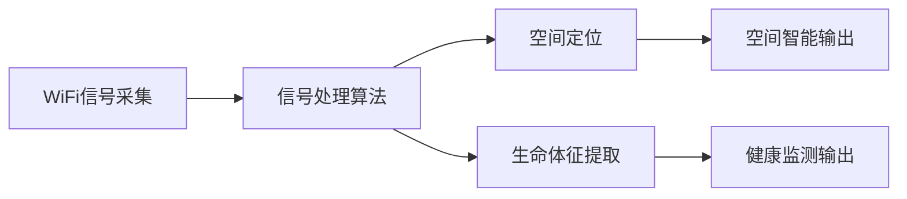
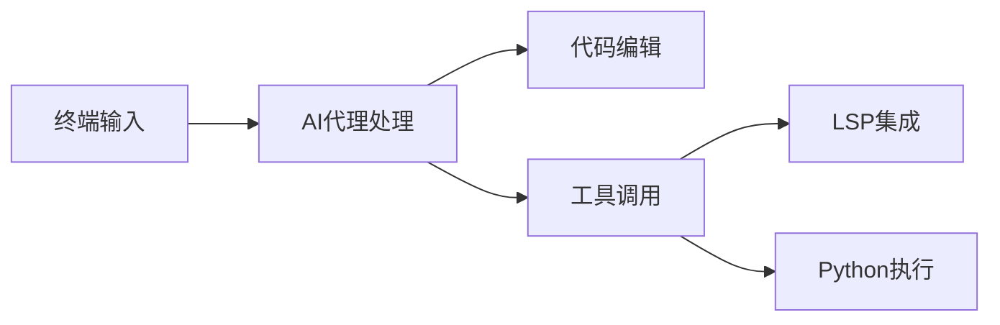
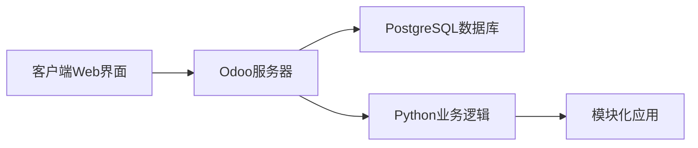

## 今日热点

AI编程助手生态系统爆发式增长，代码知识图谱和插件系统成为焦点，同时边缘计算与传感器技术创新引领非视频感知新方向。

---

## 热门项目一览

| 排名 | 项目 | 语言 | 今日 | 总计 | 简介 |
|:---:|------|:----:|------:|-----:|------|
| 1 | [colbymchenry/codegraph](https://github.com/colbymchenry/codegraph) | TypeScript | +3,684 | 16,671 | Pre-indexed code knowledge ... |
| 2 | [anthropics/claude-plugins-official](https://github.com/anthropics/claude-plugins-official) | Python | +2,549 | 25,034 | Official, Anthropic-managed... |
| 3 | [Lum1104/Understand-Anything](https://github.com/Lum1104/Understand-Anything) | TypeScript | +1,393 | 18,767 | Graphs that teach > graphs ... |
| 4 | [rohitg00/ai-engineering-from-scratch](https://github.com/rohitg00/ai-engineering-from-scratch) | Python | +988 | 11,996 | Learn it. Build it. Ship it... |
| 5 | [ruvnet/RuView](https://github.com/ruvnet/RuView) | Rust | +978 | 64,071 | π RuView turns commodity Wi... |
| 6 | [trimstray/the-book-of-secret-knowledge](https://github.com/trimstray/the-book-of-secret-knowledge) | Unknown | +969 | 223,231 | A collection of inspiring l... |
| 7 | [ChromeDevTools/chrome-devtools-mcp](https://github.com/ChromeDevTools/chrome-devtools-mcp) | TypeScript | +501 | 40,992 | Chrome DevTools for coding ... |
| 8 | [can1357/oh-my-pi](https://github.com/can1357/oh-my-pi) | TypeScript | +457 | 6,373 | ⌥ AI Coding agent for the t... |
| 9 | [yt-dlp/yt-dlp](https://github.com/yt-dlp/yt-dlp) | Python | +444 | 164,379 | A feature-rich command-line... |
| 10 | [dotnet/skills](https://github.com/dotnet/skills) | C# | +389 | 2,545 | Repository for skills to as... |
| 11 | [Fincept-Corporation/FinceptTerminal](https://github.com/Fincept-Corporation/FinceptTerminal) | Python | +367 | 22,665 | FinceptTerminal is a modern... |
| 12 | [karpathy/nn-zero-to-hero](https://github.com/karpathy/nn-zero-to-hero) | Jupyter Notebook | +159 | 22,378 | Neural Networks: Zero to Hero |

---

## 趋势洞察

```
┌─────────────────────────────────────────────────────────────────┐
│  AI/ML 工具         ████████████████████████  8 个项目        │
│  多媒体应用            ██████                    2 个项目        │
│  开发工具             ██████                    2 个项目        │
│  其他               ██████                    2 个项目        │
└─────────────────────────────────────────────────────────────────┘
```

---

## 项目深度解读

### 1. colbymchenry/codegraph — 代码知识图谱

> **一句话总结**：为AI代码助手提供本地化预索引代码知识图谱，减少token和工具调用。

#### 价值主张

| 维度 | 说明 |
|------|------|
| **解决痛点** | AI代码助手处理大型项目时效率低下、依赖远程API的问题 |
| **目标用户** | 使用Claude Code、Codex、Cursor等AI编程工具的开发者 |
| **核心亮点** | 预索引代码库 + 完全本地运行 + 减少token消耗 + 降低工具调用 |

#### 技术架构


**技术特色**：
- 预索引技术减少实时处理开销
- 本地化运行确保隐私与速度
- 知识图谱优化代码理解准确性

#### 热度分析

- 项目Star数高达16,671，单日增长3,684，表明近期受到广泛关注
- Fork数919，说明社区积极参与项目迭代和定制

#### 快速上手

```bash
# 克隆项目
git clone https://github.com/colbymchenry/codegraph.git

# 安装依赖
npm install
```

#### 注意事项

- 许可证未知，使用前需确认授权条款
- 项目完全本地运行，可能需要较高的本地计算资源
- 与多个AI代码助手集成，需确认兼容性


### 2. anthropics/claude-plugins-official — 官方插件目录

> **一句话总结**：Anthropic官方维护的高质量Claude插件目录，提供开发者可扩展的功能集。

#### 价值主张

| 维度 | 说明 |
|------|------|
| **解决痛点** | 解决Claude用户缺乏官方认可的优质插件来源问题 |
| **目标用户** | Claude AI用户和需要扩展Claude功能的开发者 |
| **核心亮点** | 官方维护 + 高质量筛选 + 多样化功能 + 易于集成 |

#### 技术架构


**技术特色**：
- 基于Python的插件管理系统
- 官方维护的质量保证机制
- 插件发现与分类功能

#### 热度分析

- 项目获得超2.5万星，单日增长2500+，显示极高社区关注度和快速上升趋势
- 作为Anthropic官方项目，处于Claude插件生态核心位置，具有权威性和引领性

#### 快速上手

```bash
# 克隆仓库
git clone https://github.com/anthropics/claude-plugins-official.git
# 安装依赖
pip install -r requirements.txt
# 浏览插件目录
cd plugins && ls
```

#### 注意事项

- 插件需要通过Anthropic官方审核才能被收录
- 用户应仅从官方目录获取插件以确保安全性
- 插件可能需要与特定版本的Claude API兼容


### 3. Lum1104/Understand-Anything — 代码知识图谱

> **一句话总结**：将代码转化为可交互探索的知识图谱，支持多种AI工具，提升代码理解效率。

#### 价值主张

| 维度 | 说明 |
|------|------|
| **解决痛点** | 将复杂代码结构转化为可视化知识图谱，解决代码理解困难问题 |
| **目标用户** | 软件开发人员、代码审查者、系统架构师 |
| **核心亮点** | 多AI工具集成 + 交互式知识图谱 + 代码搜索问答功能 |

#### 技术架构


**技术特色**：
- 基于TypeScript构建，确保类型安全和高性能
- 支持多种主流AI代码工具的无缝集成能力
- 将静态代码转化为动态可探索的知识结构

#### 热度分析

- 项目获近19k星且近期增长迅猛，显示开发者社区对该工具的高度认可
- 处于AI辅助编程工具生态前沿，与主流AI代码编辑器深度集成

#### 快速上手

```bash
# 安装
npm install understand-anything

# 使用
understand-anything ./your-code-directory
```

#### 注意事项

- 许可证信息未知，可能影响商业使用决策
- 零开放Issues可能意味着项目已成熟或社区反馈渠道不够完善


### 4. rohitg00/ai-engineering-from-scratch — AI工程学习指南

> **一句话总结**：从零开始的AI工程实践学习路径，强调动手构建和部署。

#### 价值主张

| 维度 | 说明 |
|------|------|
| **解决痛点** | 提供系统化AI工程学习路径，解决理论与实践脱节问题 |
| **目标用户** | 希望从零开始学习AI工程的初学者和转型者 |
| **核心亮点** | 项目驱动学习 + 实战导向 + 完整工程生命周期 + 社区支持 + 持续更新 |

#### 技术架构


**技术特色**：
- 基于Python的机器学习与深度学习实践
- 端到端AI工程流程覆盖
- 理论与实践结合的教学方法

#### 热度分析

- 项目近期增长迅猛，单日星数增加近1k，表明社区高度关注
- 12k星和2.2k叉的比值约为5.5，表明项目不仅被关注，也被广泛实践

#### 快速上手

```bash
# 克隆项目
git clone https://github.com/rohitg00/ai-engineering-from-scratch.git

# 安装依赖
pip install -r requirements.txt

# 运行示例
python examples/basic_example.py
```

#### 注意事项

- 项目可能需要一定的Python基础和机器学习基础知识
- 由于项目持续更新，建议关注最新版本和文档变更
- 实践过程中可能需要额外的计算资源，尤其是深度学习部分


### 5. ruvnet/RuView — 无感空间感知

> **一句话总结**：利用普通WiFi信号实现无视频的空间智能、生命体征监测和存在检测。

#### 价值主张

| 维度 | 说明 |
|------|------|
| **解决痛点** | 解决隐私保护下的空间感知与生命体征监测需求 |
| **目标用户** | 需要无接触监测的家庭、医疗机构和安防领域 |
| **核心亮点** | 无视频隐私保护 + 实时空间智能 + WiFi信号利用 + 生命体征监测 |

#### 技术架构



**技术特色**：
- 利用商用WiFi设备实现无感感知
- 通过信号波动分析提取人体活动特征
- 实现高精度室内定位与生命体征监测
- 保护用户隐私，不依赖摄像头

#### 热度分析

- 项目Star数超过6万，日增近千，显示技术前沿性和高关注度
- Fork数近8500，表明开发者社区活跃度高，技术实用性强

#### 快速上手

```bash
# 安装依赖
cargo install ruview

# 运行监测
ruview monitor --interface wlan0

# 实时数据查看
ruview view --live
```

#### 注意事项

- 需要特定的WiFi硬件支持
- 精度可能受环境因素影响
- 需要遵守当地关于信号监测的法律法规
- 可能涉及隐私保护问题，需确保合规使用


### 6. trimstray/the-book-of-secret-knowledge — 知识宝库

> **一句话总结**：综合性开发者资源集合，提供工具、技巧和知识点的集中访问点。

#### 价值主张

| 维度 | 说明 |
|------|------|
| **解决痛点** | 开发者难以快速找到分散的优质技术资源和实用工具 |
| **目标用户** | 开发者、系统管理员、DevOps工程师和技术爱好者 |
| **核心亮点** | 资源丰富多样 + 覆盖多技术领域 + 持续更新维护 + 结构化组织 |

#### 技术架构

由于项目主要作为静态资源集合，无需复杂技术架构。

**技术特色**：
- 纯静态内容组织方式
- 轻量级维护成本
- 便于快速访问和分享

#### 热度分析

- 项目获22万+星标，每日新增约1000星标，显示极强的社区认可度和持续增长趋势
- 作为知识型资源库，在开发者社区中具有高度参考价值，成为许多人日常工作的"秘密武器"

#### 快速上手

```bash
# 克隆项目到本地
git clone https://github.com/trimstray/the-book-of-secret-knowledge.git

# 浏览README.md文件获取资源索引
cat README.md | head -50
```

#### 注意事项

- 项目内容主要包含外部链接，需要访问互联网才能使用大部分资源
- 由于内容众多，建议有针对性地查找所需资源，避免信息过载
- 部分链接可能随着时间失效，需要自行验证资源的可用性


### 7. ChromeDevTools/chrome-devtools-mcp — [AI DevTools集成]

> **一句话总结**：将Chrome开发者工具与AI代码代理深度融合，提供智能化开发辅助能力。

#### 价值主张

| 维度 | 说明 |
|------|------|
| **解决痛点** | 为AI代码代理提供直接访问和操控浏览器环境的能力，突破传统开发限制 |
| **目标用户** | AI代码代理开发者、前端自动化测试工程师、Chrome扩展开发者 |
| **核心亮点** + 实时DOM操作能力 + 网络请求监控 + 性能分析支持 + 自动化测试集成

#### 技术架构


**技术特色**：
- 基于TypeScript构建，提供类型安全开发体验
- MCP协议标准化DevTools访问接口，实现跨平台兼容
- 异步操作处理，确保与浏览器环境高效交互

#### 热度分析
- 项目获近4.1万星且持续增长，显示开发者对AI辅助开发工具的高度关注
- Fork数相对较少，表明项目以使用为主，社区贡献可能集中在特定功能模块

#### 快速上手

```bash
# 安装项目
npm install chrome-devtools-mcp

# 基本连接使用
import { ChromeDevTools } from 'chrome-devtools-mcp';
const devtools = new ChromeDevTools();
await devtools.connect('ws://localhost:9222');
```

#### 注意事项
- 项目需要Chrome浏览器特定版本支持，建议与Chrome DevTools Protocol版本保持一致
- MCP协议可能需要与特定AI代理框架配合使用，使用前需确认兼容性
- 项目许可证信息不明确，商业使用前需确认授权条款


### 8. can1357/oh-my-pi — 终端AI编程助手

> **一句话总结**：oh-my-pi是一个集成多种AI能力的终端编程助手，提供智能代码编辑和工具调用功能。

#### 价值主张

| 维度 | 说明 |
|------|------|
| **解决痛点** | 解决终端编程中AI辅助工具不足的问题 |
| **目标用户** | 开发者、程序员、终端爱好者 |
| **核心亮点** | 哈希锚定编辑 + 优化工具接口 + LSP支持 + Python集成 + 子代理系统 |

#### 技术架构



**技术特色**：
- 基于TypeScript构建的AI编程代理系统
- 哈希锚定编辑技术确保代码变更的稳定性
- 优化的工具接口实现高效资源调用

#### 热度分析

- 项目近期增长迅速，单日增长457个Star，表明社区关注度极高
- 相比Fork数量，Star数量占绝对优势，说明项目具有较高实用价值和收藏价值

#### 快速上手

```bash
# 安装oh-my-pi
npm install -g oh-my-pi

# 初始化配置
oh-my-pi init

# 启动服务
oh-my-pi start
```

#### 注意事项

- 项目许可证未知，使用前需确认开源协议
- 作为AI编程工具，可能需要联网调用AI服务
- 项目仍在积极开发中，API可能会有变化


### 9. yt-dlp/yt-dlp — 全能媒体下载工具

> **一句话总结**：跨平台命令行工具，支持数百个视频网站，提供高质量下载与格式转换功能。

#### 价值主张

| 维度 | 说明 |
|------|------|
| **解决痛点** | 统一解决多平台媒体下载与格式转换需求 |
| **目标用户** | 需要下载在线媒体内容的开发者和普通用户 |
| **核心亮点** | 多站点支持+高质量下载+格式转换+命令行友好+持续更新 |

#### 技术架构


**技术特色**：
- 基于youtube-dl的增强版，修复bug并添加新功能
- 支持数百个网站，通过插件系统扩展性强
- 智能选择最佳质量，支持多线程下载

#### 热度分析

- Star数16万+，持续增长，表明项目高度活跃且受广泛认可
- 社区贡献频繁，维护响应迅速，成为媒体下载领域的标杆项目

#### 快速上手

```bash
# 下载视频（默认最佳质量）
yt-dlp "https://www.youtube.com/watch?v=VIDEO_ID"

# 下载音频（MP3格式）
yt-dlp -x --audio-format mp3 "https://www.youtube.com/watch?v=VIDEO_ID"

# 下载播放列表
yt-dlp "https://www.youtube.com/playlist?list=PLAYLIST_ID"
```

#### 注意事项

- 使用前需安装Python和yt-dlp（可通过pip安装）
- 某些网站可能有访问限制或需要认证
- 下载内容请遵守相关网站的版权条款和当地法律法规
- 定期更新以获得新网站支持和bug修复


### 10. dotnet/skills — AI编程助手

> **一句话总结**：为AI编程助手提供.NET和C#领域的结构化技能库，提升代码生成质量。

#### 价值主张

| 维度 | 说明 |
|------|------|
| **解决痛点** | AI助手缺乏.NET和C#专业领域知识与最佳实践指导 |
| **目标用户** | 使用.NET和C#的开发者、AI编程助手工具提供商 |
| **核心亮点** | 结构化技能组织 + .NET全生态覆盖 + AI适配知识表示 |

#### 技术架构


**技术特色**：
- 采用结构化方式组织.NET领域知识
- 为AI助手提供可理解的技能表示
- 覆盖.NET全生态的技能集

#### 热度分析
- 项目近期增长迅猛，单日增加389个star，显示社区高度关注
- Fork数相对较少，表明项目处于早期建设阶段，主要关注内容积累

#### 快速上手

```bash
# 克隆仓库
git clone https://github.com/dotnet/skills.git

# 查看技能分类
cd skills && ls -R
```

#### 注意事项
- 项目可能需要持续更新以适应.NET生态的变化
- 使用时需注意技能的适用场景和版本兼容性
- 开发者可贡献新的技能条目丰富知识库


### 11. Fincept-Corporation/FinceptTerminal — 金融分析终端

> **一句话总结**：现代金融应用提供高级市场分析、投资研究和经济数据工具，支持交互式探索和数据驱动决策。

#### 价值主张

| 维度 | 说明 |
|------|------|
| **解决痛点** | 传统金融终端复杂昂贵，提供一站式现代金融分析解决方案 |
| **目标用户** | 金融分析师、投资经理、经济研究人员和量化交易者 |
| **核心亮点** | 交互式市场分析 + 投资研究工具 + 经济数据整合 + 用户友好界面 + 数据驱动决策支持 |

#### 技术架构


**技术特色**：
- 基于 Python 构建，利用丰富的数据科学和金融分析库
- 提供交互式界面，优化用户体验和数据可视化
- 整合多源金融数据，支持实时市场分析

#### 热度分析

- 项目获得22,665个Star，近期增长迅速（单日增加367个），表明社区活跃度高
- Fork数为3,128，表明项目有较强的可扩展性和二次开发价值，适合金融科技领域

#### 快速上手

```bash
# 克隆项目
git clone https://github.com/Fincept-Corporation/FinceptTerminal.git
# 安装依赖
pip install -r requirements.txt
# 运行应用
python fincept_terminal.py
```

#### 注意事项

- 项目许可证信息未知，使用前需确认授权条款
- 项目涉及金融数据，使用时需注意数据来源的合规性和准确性
- 作为金融分析工具，建议结合专业金融知识使用，避免仅依赖自动化决策


### 12. karpathy/nn-zero-to-hero — 神经网络教程系列

> **一句话总结**：从基础到高级的神经网络完整学习教程，理论与实践相结合。

#### 价值主张

| 维度 | 说明 |
|------|------|
| **解决痛点** | 提供系统化神经网络学习路径，解决初学者入门难问题 |
| **目标用户** | AI初学者、希望深入理解神经网络原理的研究者和开发者 |
| **核心亮点** | 代码实践导向 + 从零实现 + 理论与实战结合 + Karpathy亲授 + 逐步深入 |

#### 技术架构


**技术特色**：
- 从零开始构建神经网络，不依赖高级框架
- 注重数学原理与代码实现的结合
- 通过实践项目巩固理论知识

#### 热度分析

- 高关注度项目，Star数超过22k，近期持续增长，表明AI学习需求旺盛
- 零开放Issues，说明教程内容成熟稳定，社区维护良好

#### 快速上手

```bash
# 克隆项目
git clone https://github.com/karpathy/nn-zero-to-hero.git

# 进入目录
cd nn-zero-to-hero

# 运行Jupyter Notebook
jupyter notebook
```

#### 注意事项

- 本项目需要一定的Python编程基础和数学基础
- 建议按顺序学习各部分内容，因为知识是递进的
- 需要安装Python环境和相关依赖包


### 13. byJoey/cfnew — Cloudflare 新工具

> **一句话总结**：新一代 Cloudflare 配置与管理工具，简化网站加速与安全设置。

#### 价值主张

| 维度 | 说明 |
|------|------|
| **解决痛点** | 简化 Cloudflare 配置流程，降低使用门槛 |
| **目标用户** | 网站管理员、开发者、云服务使用者 |
| **核心亮点** | 直观界面 + 一键部署 + 自动化配置 + 多账户管理 |

#### 技术架构


**技术特色**：
- 基于 Cloudflare REST API 构建
- 支持批量操作与配置模板
- 跨平台兼容性设计

#### 热度分析

- 项目 Star 数超过 13,000，近期增长稳定，表明社区认可度高
- Fork 数约为 Star 数的一半，显示用户积极参与二次开发与定制

#### 快速上手

```bash
# 安装 cfnew
npm install -g cfnew

# 初始化配置
cfnew init

# 部署到 Cloudflare
cfnew deploy
```

#### 注意事项

- 需要有效的 Cloudflare 账户和 API 密钥
- 配置更改前建议备份当前设置
- 定期更新以获取最新功能和安全补丁


### 14. odoo/odoo — 全能型开源ERP平台

> **一句话总结**：功能全面的开源ERP套件，提供一体化业务管理解决方案，助力企业数字化转型。

#### 价值主张

| 维度 | 说明 |
|------|------|
| **解决痛点** | 解决企业多系统数据孤岛、业务流程割裂、管理效率低下的问题 |
| **目标用户** | 中小型企业、成长型公司以及需要整合业务流程的组织 |
| **核心亮点** | 模块化设计 + 一体化解决方案 + 高度可定制性 + 丰富的应用生态 |

#### 技术架构



**技术特色**：
- 基于Python的模块化架构，支持高度可扩展
- 采用ORM框架简化数据库操作
- 完整的Web开发框架，自带前后端解决方案

#### 热度分析

- Odoo项目拥有超过5万星，持续稳定增长，表明其在开源ERP领域具有强大吸引力
- 社区活跃度高，Fork数量庞大，开发者参与度强，生态体系成熟

#### 快速上手

```bash
# 克隆Odoo源码
git clone https://github.com/odoo/odoo.git

# 安装依赖
pip install -r requirements.txt

# 初始化数据库并启动
./odoo-bin -d dbname --db-user=odoo --db-password=odoo
```

#### 注意事项

- Odoo系统配置复杂，需要一定的技术背景
- 大规模部署需要专业服务器配置和优化
- 定期更新以获取安全补丁和新功能


## 今日推荐

| 主题 | 推荐项目 | 亮点 |
|------|----------|------|
| 今日最热 | [colbymchenry/codegraph](https://github.com/colbymchenry/codegraph) | Pre-indexed code ... |
| 值得关注 | [anthropics/claude-plugins-official](https://github.com/anthropics/claude-plugins-official) | Official, Anthrop... |
| 快速上手 | [Lum1104/Understand-Anything](https://github.com/Lum1104/Understand-Anything) | Graphs that teach... |
| 长期潜力 | [rohitg00/ai-engineering-from-scratch](https://github.com/rohitg00/ai-engineering-from-scratch) | Learn it. Build i... |

---

<div align="center">

*Generated on 2026-05-23 | Powered by GitHub Trending Reporter*

</div>