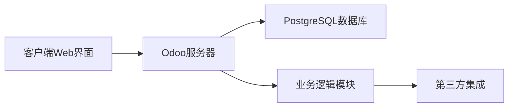

## 今日热点

AI代码理解与知识图谱工具今日大热，

---

## 热门项目一览

| 排名 | 项目 | 语言 | 今日 | 总计 | 简介 |
|:---:|------|:----:|------:|-----:|------|
| 1 | [multica-ai/andrej-karpathy-skills](https://github.com/multica-ai/andrej-karpathy-skills) | Unknown | +3,507 | 149,784 | A single CLAUDE.md file to ... |
| 2 | [colbymchenry/codegraph](https://github.com/colbymchenry/codegraph) | TypeScript | +2,456 | 19,687 | Pre-indexed code knowledge ... |
| 3 | [Lum1104/Understand-Anything](https://github.com/Lum1104/Understand-Anything) | TypeScript | +2,299 | 21,778 | Graphs that teach > graphs ... |
| 4 | [anthropics/claude-plugins-official](https://github.com/anthropics/claude-plugins-official) | Python | +2,193 | 26,525 | Official, Anthropic-managed... |
| 5 | [rohitg00/ai-engineering-from-scratch](https://github.com/rohitg00/ai-engineering-from-scratch) | Python | +1,521 | 13,846 | Learn it. Build it. Ship it... |
| 6 | [yt-dlp/yt-dlp](https://github.com/yt-dlp/yt-dlp) | Python | +759 | 164,991 | A feature-rich command-line... |
| 7 | [trimstray/the-book-of-secret-knowledge](https://github.com/trimstray/the-book-of-secret-knowledge) | Unknown | +628 | 223,877 | A collection of inspiring l... |
| 8 | [Fincept-Corporation/FinceptTerminal](https://github.com/Fincept-Corporation/FinceptTerminal) | Python | +545 | 23,149 | FinceptTerminal is a modern... |
| 9 | [ChromeDevTools/chrome-devtools-mcp](https://github.com/ChromeDevTools/chrome-devtools-mcp) | TypeScript | +435 | 41,360 | Chrome DevTools for coding ... |
| 10 | [multica-ai/multica](https://github.com/multica-ai/multica) | TypeScript | +410 | 31,959 | The open-source managed age... |
| 11 | [odoo/odoo](https://github.com/odoo/odoo) | Python | +386 | 51,499 | Odoo. Open Source Apps To G... |
| 12 | [mukul975/Anthropic-Cybersecurity-Skills](https://github.com/mukul975/Anthropic-Cybersecurity-Skills) | Python | +281 | 7,478 | 754 structured cybersecurit... |

---

## 趋势洞察

```
┌─────────────────────────────────────────────────────────────────┐
│  AI/ML 工具         ████████████████████████  10 个项目        │
│  多媒体应用            ████                      2 个项目        │
│  开发工具             ████                      2 个项目        │
│  其他               ████                      2 个项目        │
└─────────────────────────────────────────────────────────────────┘
```

---

## 项目深度解读

### 1. multica-ai/andrej-karpathy-skills — AI编码指南

> **一句话总结**：基于Andrej Karpathy观察的LLM编码最佳实践，优化Claude Code行为的单一指南文件。

#### 价值主张

| 维度 | 说明 |
|------|------|
| **解决痛点** | 解决AI模型在编程中常见的陷阱和低效代码问题 |
| **目标用户** | 使用Claude Code的开发者和AI辅助编程用户 |
| **核心亮点** | 基于专家经验 + 实用编码指南 + 单文件简洁易用 |

#### 技术架构

**技术特色**：
- 基于Andrej Karpathy的AI编程经验总结
- 聚焦于Claude Code行为优化
- 单文件结构，易于理解和实施

#### 热度分析

- 项目获得超过14.9万星，近期增长迅速(+3,507/天)，显示AI编程指南需求旺盛
- 作为单一文件项目，在AI辅助编程领域具有独特生态位置，提供简洁实用的最佳实践

#### 快速上手

```bash
# 直接查看CLAUDE.md文件内容
# 将建议应用到Claude Code使用中
```

#### 注意事项

- 项目内容基于Claude Code优化，可能不完全适用于其他AI编程助手
- 需要定期关注更新，因为AI编程最佳实践可能随模型发展而变化
- 建议结合实际编程场景应用，而非生搬硬套


### 2. colbymchenry/codegraph — 代码知识图索引

> **一句话总结**：为AI代码助手构建本地代码知识图，减少token消耗和工具调用，提升代码理解效率。

#### 价值主张

| 维度 | 说明 |
|------|------|
| **解决痛点** | AI代码助手理解大型代码库效率低、响应慢、token消耗多 |
| **目标用户** | 使用Claude Code、Codex、Cursor等AI编程助手的开发者 |
| **核心亮点** | 预先索引代码知识 + 100%本地运行 + 减少token使用 + 减少工具调用 |

#### 技术架构


**技术特色**：
- 基于TypeScript开发，跨平台兼容
- 预先索引构建，减少AI实时处理负担
- 本地运行机制，保证数据隐私和响应速度

#### 热度分析

- 项目获得近2万星，单日增长超2400星，社区高度认可该技术
- 零开放问题，表明项目已成熟稳定或问题处理高效

#### 快速上手

```bash
# 克隆项目
git clone https://github.com/colbymchenry/codegraph.git

# 安装依赖
npm install
```

#### 注意事项

- 项目需要本地存储空间来保存代码知识图
- 可能需要定期更新索引以保持代码库最新
- 兼容性可能受不同编程语言和项目结构影响


### 3. Lum1104/Understand-Anything — 代码知识图谱

> **一句话总结**：将代码转换为交互式知识图谱，支持多种AI编码助手，便于代码探索和理解。

#### 价值主张

| 维度 | 说明 |
|------|------|
| **解决痛点** | 复杂代码难以理解与导航，缺乏直观可视化方式 |
| **目标用户** | 开发者、代码审查人员、技术学习者 |
| **核心亮点** | 交互式知识图谱 + 多AI工具兼容 + 代码搜索与问答 |

#### 技术架构


**技术特色**：
- 基于TypeScript的高性能代码解析引擎
- 交互式知识图谱可视化技术
- 多AI编码助手兼容性接口

#### 热度分析

- 项目Star数突破21k，单日增长2.3k，社区关注度极高
- 处于AI辅助编程工具生态热点位置，与主流工具深度集成

#### 快速上手

```bash
# 克隆项目
git clone https://github.com/Lum1104/Understand-Anything.git
# 安装依赖
npm install
# 启动应用
npm start
```

#### 注意事项

- 项目许可证未知，商业使用前需确认授权情况
- 需要配置与特定AI编码工具的集成才能发挥全部功能
- 随着AI工具更新，可能需要调整兼容性配置


### 4. anthropics/claude-plugins-official — 官方插件库

> **一句话总结**：Anthropic官方维护的高质量Claude插件目录，为开发者提供可信赖的插件生态系统。

#### 价值主张

| 维度 | 说明 |
|------|------|
| **解决痛点** | 解决Claude插件发现、验证和管理问题，确保插件质量与安全 |
| **目标用户** | 开发者、企业用户、AI研究人员需要扩展Claude功能的群体 |
| **核心亮点** | 官方认证 + 质量保证 + 开发规范 + 社区驱动 + 持续更新 |

#### 技术架构


**技术特色**：
- 标准化的插件接口规范，确保跨插件兼容性
- 自动化验证流程，保证插件质量和安全性
- 基于Python的轻量级管理系统，易于扩展和维护

#### 热度分析

- 项目Star数突破26,000且单日增长2,000+，显示社区对Claude插件生态的强烈需求
- 作为官方核心项目，在Claude插件生态中占据中心位置，是开发者获取插件的首选渠道

#### 快速上手

```bash
# 克隆项目
git clone https://github.com/anthropics/claude-plugins-official.git
# 安装依赖
pip install -r requirements.txt
# 本地运行开发服务器
python -m http.server 8000
```

#### 注意事项

- 插件需遵循Anthropic官方开发规范和API要求
- 官方目录中的插件经过质量验证，使用非官方插件存在安全风险
- 插件系统仍在快速发展中，API和功能可能会有更新变化


### 5. rohitg00/ai-engineering-from-scratch — AI工程实践指南

> **一句话总结**：从零开始学习AI工程化，构建可部署AI系统的完整实践教程。

#### 价值主张

| 维度 | 说明 |
|------|------|
| **解决痛点** | AI理论知识与实际工程落地之间存在鸿沟，缺乏完整实践路径 |
| **目标用户** | AI初学者、转型开发者、计算机专业学生 |
| **核心亮点** | 项目驱动学习 + 端到端工程流程 + 实战案例丰富 + 开源可复现 |

#### 技术架构


**技术特色**：
- 采用模块化设计，每个环节都有完整代码实现
- 融合MLOps最佳实践，强调工程化思维
- 提供从原型到生产的全流程解决方案

#### 热度分析

- 单日Star激增1,521，表明项目当前处于快速上升期，社区认可度高
- 13k+ Stars与2.5k+ Forks比例合理，反映项目兼具学习价值和实用价值

#### 快速上手

```bash
# 克隆项目
git clone https://github.com/rohitg00/ai-engineering-from-scratch.git

# 安装依赖
cd ai-engineering-from-scratch && pip install -r requirements.txt
```

#### 注意事项

- 项目许可证未知，商业使用前需确认授权条款
- 项目内容可能随时间更新，建议关注最新版本和文档变更
- 部分实践可能需要GPU资源，本地运行前确保硬件配置满足要求


### 6. yt-dlp/yt-dlp — 多媒体下载工具

> **一句话总结**：功能强大的命令行工具，支持从全球主流平台下载高质量音视频内容。

#### 价值主张

| 维度 | 说明 |
|------|------|
| **解决痛点** | 统一解决多平台视频音频下载需求，支持高质量格式选择 |
| **目标用户** | 需要离线观看视频内容的研究人员、内容创作者和普通用户 |
| **核心亮点** | 支持数百个视频平台 + 高质量音视频提取 + 自定义下载格式 + 批量下载功能 + 强大的命令行接口 |

#### 技术架构


**技术特色**：
- 基于yt项目架构，增加了对更多平台的兼容性
- 支持复杂的网络请求处理，绕过平台限制
- 智能选择最佳音视频轨道并合并

#### 热度分析

- 项目Star数持续快速增长，日增759星，表明社区认可度高
- 作为youtube-dl的分支项目，已成为视频下载领域的标杆工具

#### 快速上手

```bash
# 下载单个视频
yt-dlp "https://www.youtube.com/watch?v=dQw4w9WgXcQ"

# 下载最佳质量的视频和音频
yt-dlp -f bestvideo+bestaudio "https://www.youtube.com/watch?v=dQw4w9WgXcQ"

# 下载整个播放列表
yt-dlp -i "https://www.youtube.com/playlist?list=PLxyz"
```

#### 注意事项

- 注意遵守目标平台的使用条款和版权法规
- 某些网站可能需要更新版本才能继续正常工作
- 大文件下载可能需要较长时间和网络稳定性


### 7. trimstray/the-book-of-secret-knowledge — 知识宝典

> **一句话总结**：汇聚各类技术资源、工具与技巧的开发者实用知识库。

#### 价值主张

| 维度 | 说明 |
|------|------|
| **解决痛点** | 整合碎片化技术资源，解决开发者查找参考资料困难的问题 |
| **目标用户** | 开发者、系统管理员、DevOps工程师及技术爱好者 |
| **核心亮点** | 内容全面 + 持续更新 + 结构化组织 + 轻量级访问 + 社区驱动 |

#### 技术架构


**技术特色**：
- 基于Markdown的轻量级文档系统
- GitHub原生支持，无需复杂构建流程
- 社区协作维护，内容持续丰富

#### 热度分析

- 项目获得超22万star，日增长约600+，显示出极高的技术社区认可度
- 作为知识聚合项目，在开发者社区中具有核心参考价值，成为必备书签

#### 快速上手

```bash
# 克隆仓库到本地
git clone https://github.com/trimstray/the-book-of-secret-knowledge.git

# 或直接访问在线版本
# https://github.com/trimstray/the-book-of-secret-knowledge
```

#### 注意事项

- 项目内容庞杂，建议使用目录索引快速定位所需资源
- 部分链接可能随时间失效，需要用户自行验证
- 由于是社区贡献项目，内容的准确性和时效性依赖维护者


### 8. Fincept-Corporation/FinceptTerminal — 金融分析终端

> **一句话总结**：提供高级市场分析、投资研究和经济数据工具，支持数据驱动的金融决策。

#### 价值主张

| 维度 | 说明 |
|------|------|
| **解决痛点** | 金融专业人士缺乏一站式平台获取市场分析和经济数据 |
| **目标用户** | 金融分析师、投资经理、经济研究人员和个人投资者 |
| **核心亮点** | 高级市场分析工具 + 投资研究平台 + 经济数据整合 + 交互式探索 + 用户友好界面 |

#### 技术架构


**技术特色**：
- 基于Python构建，利用丰富的数据分析库
- 模块化设计，支持多种金融数据源接入
- 交互式可视化，提供直观的市场洞察

#### 热度分析

- 项目获得23,149个星标且近期增长迅速，表明其在金融科技领域具有很高人气
- 零开放问题反映项目维护良好，用户反馈可能通过其他渠道处理

#### 快速上手

```bash
# 克隆项目
git clone https://github.com/Fincept-Corporation/FinceptTerminal.git
# 进入项目目录
cd FinceptTerminal
# 安装依赖
pip install -r requirements.txt
```

#### 注意事项

- 项目许可证未知，商业使用前需确认授权条款
- 作为金融分析工具，数据准确性和实时性至关重要
- 可能需要金融数据API密钥才能完全利用所有功能


### 9. ChromeDevTools/chrome-devtools-mcp — [开发工具代理]

> **一句话总结**：为AI编码代理提供Chrome开发者工具接口，实现网页环境交互能力。

#### 价值主张

| 维度 | 说明 |
|------|------|
| **解决痛点** | 解决AI代理无法直接与浏览器环境交互的问题 |
| **目标用户** | AI编码助手、自动化测试工具开发者 |
| **核心亮点** | 提供完整的DevTools API接口 + 支持远程控制 + 实时页面交互 |

#### 技术架构


**技术特色**：
- 基于TypeScript实现类型安全
- 通过MCP协议连接AI与浏览器
- 提供完整的DevTools功能封装

#### 热度分析

- 项目获得超过41k星，单日增长435，表明开发者社区高度关注
- 作为Chrome DevTools的扩展，处于AI辅助开发工具生态的关键位置

#### 快速上手

```bash
# 安装依赖
npm install chrome-devtools-mcp

# 初始化配置
npx chrome-devtools-mcp init

# 启动服务
chrome-devtools-mcp start
```

#### 注意事项

- 需要配合支持MCP协议的AI工具使用
- 可能需要特定的Chrome版本或启动参数
- API可能随Chrome版本更新而变化


### 10. multica-ai/multica — 智能代理管理平台

> **一句话总结**：开源AI代理管理平台，将编程代理转变为可分配任务、跟踪进度的虚拟团队成员

#### 价值主张

| 维度 | 说明 |
|------|------|
| **解决痛点** | 解决AI代理难以管理、任务分配混乱、技能无法有效组合的问题 |
| **目标用户** | 软件开发团队、AI开发者、需要管理多个AI代理的组织 |
| **核心亮点** | 任务分配与跟踪系统 + 技能组合机制 + 代理生命周期管理 + 团队协作界面 + 开源可定制 |

#### 技术架构


**技术特色**：
- 基于TypeScript的全栈开发，确保类型安全
- 模块化代理设计，支持技能组合与扩展
- 实时任务跟踪系统，提供可视化进度管理

#### 热度分析

- 项目Star数超过3万，日增400+，呈快速增长趋势，显示市场对该类AI代理管理平台的高度需求
- 作为开源项目，在AI代理管理领域占据重要生态位置，有望成为行业标准工具

#### 快速上手

```bash
# 安装Multica
npm install -g multica

# 初始化代理团队
multica init

# 创建并分配任务
multica create-task --name "新功能开发" --agent "前端专家"
```

#### 注意事项

- 项目许可证信息未知，商业使用前需确认授权条款
- 作为新兴技术，可能存在API不稳定或功能不完善的情况
- 需要一定的AI代理开发经验才能充分利用平台功能


### 11. odoo/odoo — 开源ERP平台

> **一句话总结**：Odoo是全功能开源ERP平台，提供模块化业务应用，助力企业一站式管理核心业务流程。

#### 价值主张

| 维度 | 说明 |
|------|------|
| **解决痛点** | 企业多系统分散、流程割裂、数据孤岛问题，提供一体化业务管理平台 |
| **目标用户** | 中小企业、成长型企业和需要定制化管理流程的组织 |
| **核心亮点** | 模块化架构 + 全功能业务应用 + 开源可定制 + 云端部署 + 活跃社区支持 |

#### 技术架构



**技术特色**：
- 基于Python和PostgreSQL构建的高性能企业应用平台
- 采用模块化插件架构，支持功能扩展和定制开发
- 使用ORM框架简化数据库操作，支持多租户架构

#### 热度分析

- 高Star增长率表明企业对开源ERP解决方案需求旺盛，社区认可度高
- 作为企业级开源项目，拥有完善的生态系统和广泛的商业支持网络

#### 快速上手

```bash
# 使用Docker快速启动Odoo开发环境
docker run -d --name odoo -e POSTGRES_HOST=db -e POSTGRES_PASSWORD=odoo --link db:db -p 8069:8069 odoo
docker run -d --name db -e POSTGRES_PASSWORD=odoo -e POSTGRES_USER=odoo postgres:10
```

#### 注意事项

- Odoo部署需要一定的技术门槛，特别是对于生产环境
- 定制开发需要熟悉Odoo的框架和开发模式，学习曲线较陡
- 大规模部署需要考虑性能优化和资源规划


### 12. mukul975/Anthropic-Cybersecurity-Skills — AI安全技能库

> **一句话总结**：754结构化网络安全技能映射5大框架，支持20+AI平台，提升AI代理安全能力。

#### 价值主张

| 维度 | 说明 |
|------|------|
| **解决痛点** | AI代理缺乏结构化网络安全专业知识，难以提供精准安全指导 |
| **目标用户** | AI安全开发者、网络安全专业人员、安全研究员 |
| **核心亮点** | 754结构化技能 + 5大框架映射 + 20+平台支持 + 26安全领域覆盖 |

#### 技术架构


**技术特色**：
- 标准化的agentskills.io数据格式
- 多框架映射技术(MITRE ATT&CK, NIST CSF等)
- 跨平台兼容性设计

#### 热度分析
- 项目获得7,478个Star且近期增长迅速(+281 today)，显示其在AI安全领域备受关注
- 1,010个Fork和0个Open Issues表明社区活跃度高且项目维护良好

#### 快速上手

```bash
# 克隆项目
git clone https://github.com/mukul975/Anthropic-Cybersecurity-Skills.git

# 查看支持的框架和技能
cat README.md | grep -A5 "Frameworks"
```

#### 注意事项
- 需要了解基本的网络安全概念才能有效利用这些技能
- 不同AI平台可能需要特定的适配方法
- 项目需定期更新以应对新的安全威胁和框架变化


### 13. dotnet/skills — AI.NET 技能库

> **一句话总结**：为 AI 编程助手提供结构化的 .NET 和 C# 开发技能库，提升智能辅助编程能力。

#### 价值主张

| 维度 | 说明 |
|------|------|
| **解决痛点** | 解决 AI 编程助手在 .NET 和 C# 领域专业知识不足的问题 |
| **目标用户** | .NET 开发者、AI 编程工具开发者、智能 IDE 插件开发者 |
| **核心亮点** | 结构化技能定义 + 多层次技术覆盖 + 可扩展技能框架 + 实用代码示例 |

#### 技术架构


**技术特色**：
- 基于 YAML 的结构化技能定义系统
- 分层技能组织架构，便于扩展和维护
- 提供丰富的上下文信息支持 AI 理解技能用途

#### 热度分析

- Star 数量持续增长，表明 .NET 开发者对 AI 辅助编程需求旺盛
- 作为微软生态中的重要 AI 编程助手支持库，社区关注度较高

#### 快速上手

```bash
git clone https://github.com/dotnet/skills.git
cd skills
ls skills/  # 查看可用的技能目录
```

#### 注意事项

- 技能库需要与支持该格式的 AI 编程工具配合使用
- 技能定义需要遵循项目的规范，以确保 AI 能正确理解和应用


### 14. presenton/presenton — AI演示生成器

> **一句话总结**：开源AI演示文稿生成平台，提供API接口，可替代商业产品，支持私有化部署

#### 价值主张

| 维度 | 说明 |
|------|------|
| **解决痛点** | 需要商业AI演示工具但希望有开源替代方案且保留数据隐私 |
| **目标用户** | 开发者、企业团队、教育机构 |
| **核心亮点** | 开源可定制 + AI智能生成 + API支持 + 隐私保护 + 免费使用 |

#### 技术架构


**技术特色**：
- TypeScript全栈开发，确保类型安全
- 模块化架构设计，支持插件扩展
- API优先设计，便于集成第三方系统

#### 热度分析

- 项目Star数达6,413且日增241，表明在AI演示工具领域迅速崛起
- Issues为0显示问题解决效率高，Fork数1,121反映社区参与度良好

#### 快速上手

```bash
git clone https://github.com/presenton/presenton.git
cd presenton
npm install
npm run dev
```

#### 注意事项

- 许可证信息不明确，使用前需确认开源许可类型
- 作为AI生成工具，可能需要注意生成内容的版权问题


### 15. NVlabs/LongLive — 长视频生成

> **一句话总结**：LongLive是专注于长视频生成的基础设施框架，解决长序列视频生成的内存与连贯性挑战。

#### 价值主张

| 维度 | 说明 |
|------|------|
| **解决痛点** | 解决长视频生成中的内存消耗高、连贯性差、计算效率低问题 |
| **目标用户** | 视频生成研究者、AI内容创作者、影视后期开发人员 |
| **核心亮点** | 高效内存管理 + 长序列连贯性 + 分布式训练支持 |

#### 技术架构


**技术特色**：
- 分块处理机制减少内存消耗
- 长序列建模保证视频连贯性
- 分布式训练加速大规模视频生成

#### 热度分析

- 项目近期获得较多关注，Star数持续增长(+94 today)，表明社区对长视频生成技术兴趣浓厚
- 作为NVIDIA Labs项目，在AI视频生成领域具有较高影响力，吸引研究者和开发者关注

#### 快速上手

```bash
# 克隆项目
git clone https://github.com/NVlabs/LongLive.git
cd LongLive

# 安装依赖
pip install -r requirements.txt

# 运行示例
python examples/basic_long_video_generation.py
```

#### 注意事项

- 项目需要高性能GPU支持，建议使用NVIDIA A100或H100等高端显卡
- 长视频生成需要大量计算资源，建议在分布式环境下运行
- 项目可能需要特定的CUDA版本和PyTorch版本兼容性
- 由于是研究项目，API可能会发生变化，建议关注官方更新


### 16. janestreet/magic-trace — 进程追踪利器

> **一句话总结**：高分辨率进程跟踪工具，精确定位程序执行路径和性能瓶颈。

#### 价值主张

| 维度 | 说明 |
|------|------|
| **解决痛点** | 传统工具无法精确捕获程序执行细节，难以定位复杂性能问题 |
| **目标用户** | OCaml开发者、系统性能工程师、需要深度程序分析的技术人员 |
| **核心亮点** | 高分辨率跟踪 + 低开销监控 + 实时可视化 + Jane Street技术背书 |

#### 技术架构


**技术特色**：
- 基于OCaml构建，利用其高性能和内存安全特性
- 采用非侵入式跟踪技术，最小化对目标进程影响
- 提供纳秒级时间分辨率，捕获精确执行时序

#### 热度分析

- 项目获5,877星且持续增长，显示开发者对高性能分析工具的强烈需求
- 作为Jane Street出品项目，在金融科技和函数式编程社区具有特殊影响力

#### 快速上手

```bash
# 安装magic-trace
opam install magic-trace

# 跟踪程序执行
magic-trace record your_program
magic-trace view trace_output.mtr
```

#### 注意事项

- 需要系统权限才能进行进程跟踪，可能影响系统安全策略
- 在生产环境使用时需评估性能开销，建议在测试环境先行验证
- 主要针对OCaml程序优化，对其他语言的支持可能有限


## 今日推荐

| 主题 | 推荐项目 | 亮点 |
|------|----------|------|
| 今日最热 | [multica-ai/andrej-karpathy-skills](https://github.com/multica-ai/andrej-karpathy-skills) | A single CLAUDE.m... |
| 值得关注 | [colbymchenry/codegraph](https://github.com/colbymchenry/codegraph) | Pre-indexed code ... |
| 快速上手 | [Lum1104/Understand-Anything](https://github.com/Lum1104/Understand-Anything) | Graphs that teach... |
| 长期潜力 | [anthropics/claude-plugins-official](https://github.com/anthropics/claude-plugins-official) | Official, Anthrop... |

---

<div align="center">

*Generated on 2026-05-24 | Powered by GitHub Trending Reporter*

</div>