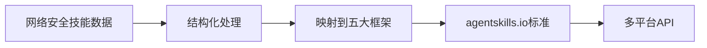
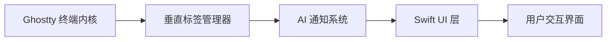
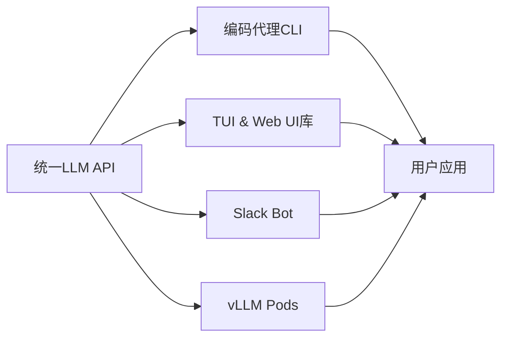
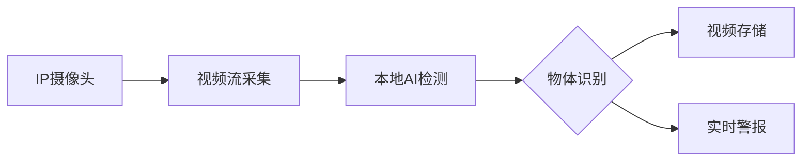

## 今日热点

AI编程助手生态爆发，代码知识图谱技术引领开发效率革命，Claude Code工具链重构软件开发流程。

---

## 热门项目一览

| 排名 | 项目 | 语言 | 今日 | 总计 | 简介 |
|:---:|------|:----:|------:|-----:|------|
| 1 | [Lum1104/Understand-Anything](https://github.com/Lum1104/Understand-Anything) | TypeScript | +3,999 | 26,511 | Graphs that teach > graphs ... |
| 2 | [colbymchenry/codegraph](https://github.com/colbymchenry/codegraph) | TypeScript | +3,003 | 22,413 | Pre-indexed code knowledge ... |
| 3 | [multica-ai/andrej-karpathy-skills](https://github.com/multica-ai/andrej-karpathy-skills) | Unknown | +2,551 | 152,383 | A single CLAUDE.md file to ... |
| 4 | [rohitg00/ai-engineering-from-scratch](https://github.com/rohitg00/ai-engineering-from-scratch) | Python | +1,853 | 16,317 | Learn it. Build it. Ship it... |
| 5 | [anthropics/claude-plugins-official](https://github.com/anthropics/claude-plugins-official) | Python | +1,173 | 27,302 | Official, Anthropic-managed... |
| 6 | [mukul975/Anthropic-Cybersecurity-Skills](https://github.com/mukul975/Anthropic-Cybersecurity-Skills) | Python | +930 | 8,422 | 754 structured cybersecurit... |
| 7 | [manaflow-ai/cmux](https://github.com/manaflow-ai/cmux) | Swift | +696 | 19,059 | Ghostty-based macOS termina... |
| 8 | [multica-ai/multica](https://github.com/multica-ai/multica) | TypeScript | +585 | 32,568 | The open-source managed age... |
| 9 | [Alishahryar1/free-claude-code](https://github.com/Alishahryar1/free-claude-code) | Python | +553 | 29,209 | Use claude-code for free in... |
| 10 | [anthropics/knowledge-work-plugins](https://github.com/anthropics/knowledge-work-plugins) | Python | +550 | 14,141 | Open source repository of p... |
| 11 | [codecrafters-io/build-your-own-x](https://github.com/codecrafters-io/build-your-own-x) | Markdown | +550 | 504,304 | Master programming by recre... |
| 12 | [earendil-works/pi](https://github.com/earendil-works/pi) | TypeScript | +456 | 54,011 | AI agent toolkit: coding ag... |

---

## 趋势洞察

```
┌─────────────────────────────────────────────────────────────────┐
│  AI/ML 工具         ████████████████████████  12 个项目        │
│  其他               ██████                    3 个项目        │
│  多媒体应用            ██                        1 个项目        │
└─────────────────────────────────────────────────────────────────┘
```

---

## 项目深度解读

### 1. Lum1104/Understand-Anything — 代码知识图谱

> **一句话总结**：将任意代码转换为可探索、搜索和提问的交互式知识图谱，支持多种AI编程助手。

#### 价值主张

| 维度 | 说明 |
|------|------|
| **解决痛点** | 解决代码理解困难、结构复杂难以分析的问题 |
| **目标用户** | 软件开发者、代码审查者、编程学习者 |
| **核心亮点** | 支持多种AI编程助手 + 交互式知识图谱 + 代码探索搜索 + 提问功能 + 教学导向 |

#### 技术架构


**技术特色**：
- 基于TypeScript构建，确保类型安全
- 支持多种AI编程助手，提供广泛兼容性
- 将代码转换为可视化知识图谱，增强可理解性

#### 热度分析

- 项目近期获得大量关注（单日增加近4K stars），表明在代码理解领域有强烈需求
- 零开放issues反映项目成熟度高，用户反馈机制高效

#### 快速上手

```bash
# 安装项目
npm install understand-anything

# 初始化知识图谱
understand-anything init ./your-code-path

# 启动交互界面
understand-anything serve
```

#### 注意事项

- 项目许可证未知，商业使用前需确认授权
- 零开放issues可能意味着问题反馈渠道不明确
- 需要配合支持的AI编程助手使用才能发挥最大效用


### 2. colbymchenry/codegraph — 代码知识图谱

> **一句话总结**：为AI代码助手提供本地化预索引代码知识图谱，减少token消耗和工具调用，提升代码理解效率。

#### 价值主张

| 维度 | 说明 |
|------|------|
| **解决痛点** | 大型代码库中AI助手理解代码效率低，响应慢 |
| **目标用户** | 使用AI代码助手的开发者，特别是处理大型项目者 |
| **核心亮点** | 预索引代码知识图谱 + 100%本地处理 + 减少token消耗 + 提升AI理解效率 |

#### 技术架构


**技术特色**：
- 预构建代码知识图谱，减少AI实时解析负担
- 100%本地处理，确保数据安全与隐私
- 优化token使用，提高AI响应效率

#### 热度分析

- 项目获得22,413 stars，近期增长迅猛(+3,003 today)，显示开发者对提升AI代码理解工具的强烈需求
- 作为新兴领域的前沿项目，在AI辅助编程生态中占据重要位置

#### 快速上手

```bash
# 安装codegraph
npm install -g codegraph

# 初始化项目索引
codegraph init

# 为AI助手提供本地代码知识
codegraph serve
```

#### 注意事项

- 项目可能需要足够的本地存储空间来存储代码知识图谱
- 对于大型项目，构建索引可能需要较长时间和计算资源
- 确保与使用的AI代码助手兼容（支持Claude Code, Codex, Cursor等）


### 3. multica-ai/andrej-karpathy-skills — AI编程指南

> **一句话总结**：基于Andrej Karpathy对LLM编程陷阱的观察，提供Claude Code优化指南。

#### 价值主张

| 维度 | 说明 |
|------|------|
| **解决痛点** | 解决LLM编程中的常见陷阱和低效代码问题 |
| **目标用户** | 使用Claude Code的AI开发者、研究人员 |
| **核心亮点** | 专家指导 + 实践经验 + 代码优化技巧 |

#### 技术架构

**技术特色**：
- 基于Andrej Karpathy的权威AI编程经验
- 针对Claude Code优化的专门指南
- 简洁明了的文档结构

#### 热度分析

- 项目获得超过15万星，日增2500+，表明AI编程指南需求旺盛
- 作为AI编程领域的参考项目，具有高社区认可度和实用价值

#### 快速上手

```bash
# 克隆仓库查看CLAUDE.md文件
git clone https://github.com/multica-ai/andrej-karpathy-skills.git
cat CLAUDE.md
```

#### 注意事项

- 本项目主要针对Claude Code优化，可能不完全适用于其他AI编程工具
- 内容基于Andrej Karpathy的个人经验，需要结合实际情况应用


### 4. rohitg00/ai-engineering-from-scratch — AI工程实践指南

> **一句话总结**：从零开始学习、构建和交付AI工程的全流程实践指南。

#### 价值主张

| 维度 | 说明 |
|------|------|
| **解决痛点** | 提供AI工程从学习到交付的全流程实践指导 |
| **目标用户** | AI初学者和希望提升工程能力的实践者 |
| **核心亮点** | 端到端项目实践 + 理论与实践结合 + 实用工具推荐 |

#### 技术架构


**技术特色**：
- 覆盖AI工程全生命周期
- 理论与实践紧密结合
- 提供可复现的代码示例

#### 热度分析

- 项目获得16,317星且近期增长迅猛，显示AI工程学习需求旺盛
- 无开放问题表明项目维护良好，内容稳定成熟

#### 快速上手

```bash
# 克隆项目
git clone https://github.com/rohitg00/ai-engineering-from-scratch.git

# 查看项目结构
cd ai-engineering-from-scratch
ls -la
```

#### 注意事项

- 由于许可证未知，商业使用前需确认版权信息
- 项目内容可能随AI技术发展需要更新


### 5. anthropics/claude-plugins-official — 官方插件目录

> **一句话总结**：Anthropic 官方维护的高质量 Claude 插件目录，提供经过审核的扩展功能。

#### 价值主张

| 维度 | 说明 |
|------|------|
| **解决痛点** | Claude 用户缺乏可靠、高质量的官方插件来源 |
| **目标用户** | 使用 Claude AI 的开发者、研究人员和普通用户 |
| **核心亮点** | 官方维护 + 质量保证 + 插件多样性 + 持续更新 + 安全可靠 |

#### 技术架构


**技术特色**：
- 官方审核机制确保插件质量
- 标准化的插件接口规范
- 插件分类和检索系统

#### 热度分析

- 项目 Star 数增长迅速，今日新增 1,173 个 Star，显示社区高度关注
- 作为 Anthropic 官方项目，在 Claude 插件生态中占据核心位置

#### 快速上手

```bash
# 克隆插件目录
git clone https://github.com/anthropics/claude-plugins-official.git

# 浏览插件列表
cat README.md
```

#### 注意事项

- 插件需要通过 Anthropic 官方审核才能加入目录
- 使用插件时需注意官方的安全建议
- 插件更新可能需要用户手动跟进


### 6. mukul975/Anthropic-Cybersecurity-Skills — AI安全技能库

> **一句话总结**：为AI代理提供结构化网络安全技能，映射五大安全框架，支持20+开发平台。

#### 价值主张

| 维度 | 说明 |
|------|------|
| **解决痛点** | 解决AI代理缺乏专业网络安全知识和技能映射问题 |
| **目标用户** | AI开发者、安全研究人员、网络安全专业人员 |
| **核心亮点** | + 754结构化安全技能 + 5大主流安全框架映射 + 20+平台兼容性 + agentskills.io标准 |

#### 技术架构



**技术特色**：
- 基于Python的结构化数据处理
- 支持五大主流安全框架的映射转换
- 提供标准化agentskills.io接口

#### 热度分析

- 项目Star数高达8,422，单日增长930，表明网络安全与AI结合领域需求旺盛
- Fork数为1,063，表明开发者社区积极参与项目的扩展和定制
- 无Open Issues，说明项目维护质量高或问题解决效率高

#### 快速上手

```bash
# 克隆项目
git clone https://github.com/mukul975/Anthropic-Cybersecurity-Skills.git

# 安装依赖
pip install -r requirements.txt

# 探索技能数据集
python examples/explore_skills.py
```

#### 注意事项

- 项目依赖特定的AI平台，使用前需确认兼容性
- 技能数据需要定期更新以跟上网络安全领域的发展
- 使用时需注意各框架版本的差异，确保映射准确性


### 7. manaflow-ai/cmux — AI增强终端

> **一句话总结**：基于 Ghostty 的 macOS 终端，集成垂直标签与 AI 编码助手通知

#### 价值主张

| 维度 | 说明 |
|------|------|
| **解决痛点** | 传统终端缺乏垂直布局和 AI 工具集成，降低开发效率 |
| **目标用户** | macOS 开发者，特别是使用 AI 编码助手的用户群体 |
| **核心亮点** | 垂直标签布局 + AI 智能通知 + Ghostty 高性能内核 + Swift 原生开发 |

#### 技术架构



**技术特色**：
- 基于 Swift 构建，充分利用 macOS 系统原生特性
- 集成 Ghostty 高性能终端核心，保证流畅体验
- 实现垂直标签布局，优化屏幕空间利用
- 设计 AI 通知系统，无缝对接各类编码助手工具

#### 热度分析

- Star 数突破 19K 且日增近 700，表明项目热度极高，受开发者广泛关注
- Fork 数相对较少，说明更多用户选择直接使用而非二次开发，项目定位清晰

#### 快速上手

```bash
# 从 GitHub 克隆项目
git clone https://github.com/manaflow-ai/cmux.git

# 构建并安装
cd cmux && make install
```

#### 注意事项

- 需要最新版 macOS 系统环境
- 依赖 Ghostty 终端核心组件，需提前安装
- 需配置 AI 编码工具接口以启用完整通知功能
- 作为较新项目，API 可能存在变动，关注更新日志


### 8. multica-ai/multica — AI代理管理平台

> **一句话总结**：开源AI代理管理平台，将编码代理转化为可协作的智能队友，实现任务分配与技能整合。

#### 价值主张

| 维度 | 说明 |
|------|------|
| **解决痛点** | 单个AI代理能力有限，缺乏协作与管理机制 |
| **目标用户** | 开发团队、AI研究人员、自动化流程构建者 |
| **核心亮点** | 多代理协作 + 任务分配 + 进度跟踪 + 技能复合 + 开源管理 |

#### 技术架构


**技术特色**：
- 基于TypeScript构建的类型安全代理系统
- 支持多代理协同工作的编排引擎
- 开源可扩展的代理管理框架

#### 热度分析

- 项目获得32,568个星标，单日增长585，表明AI代理管理领域热度迅速攀升
- 作为开源AI代理管理平台，在AI工具生态中占据重要位置，填补了多代理协作管理空白

#### 快速上手

```bash
# 克隆仓库
git clone https://github.com/multica-ai/multica.git

# 安装依赖
npm install

# 启动服务
npm start
```

#### 注意事项

- 项目许可证未知，商业使用前需确认授权条款
- 作为AI代理管理平台，需要考虑数据隐私和安全问题
- 项目目前Open Issues为0，可能意味着社区反馈渠道不够活跃


### 9. Alishahryar1/free-claude-code — 免费Claude工具

> **一句话总结**：提供免费终端、VSCode和Discord中的Claude代码助手，支持语音交互。

#### 价值主张

| 维度 | 说明 |
|------|------|
| **解决痛点** | 解决Claude官方API收费问题，提供免费使用途径 |
| **目标用户** | 开发者、程序员、需要AI辅助编码的用户 |
| **核心亮点** | 多平台支持 + 免费使用 + 语音交互 + 开源实现 |

#### 技术架构


**技术特色**：
- 通过代理服务绕过官方API限制
- 支持多平台统一接口
- 实现语音交互功能
- 开源免费替代方案

#### 热度分析

- 项目获得29,209个Star，单日增长553，热度持续攀升
- Fork数达4,387，显示社区积极参与和二次开发活跃
- 0个Open Issues表明项目维护良好，问题解决及时

#### 快速上手

```bash
# 克隆项目
git clone https://github.com/Alishahryar1/free-claude-code.git

# 安装依赖
pip install -r requirements.txt

# 运行服务
python app.py
```

#### 注意事项

- 由于使用非官方API，可能存在服务不稳定或随时失效的风险
- 项目使用可能违反Claude的服务条款，有被封禁账号的风险
- 建议仅用于学习和研究目的，商业使用需谨慎


### 10. anthropics/knowledge-work-plugins — AI知识插件库

> **一句话总结**：Anthropic官方开源的Claude Cowork知识工作插件集合，提升专业工作效率的AI工具集。

#### 价值主张

| 维度 | 说明 |
|------|------|
| **解决痛点** | 为知识工作者提供结构化插件，解决Claude使用场景碎片化问题 |
| **目标用户** | 知识工作者、研究人员、内容创作者和Claude Cowork用户 |
| **核心亮点** | 官方支持 + 专业场景定制 + 插件架构 + 易于扩展 + 高性能优化 |

#### 技术架构


**技术特色**：
- 基于Python构建的轻量级插件架构
- 采用模块化设计，便于独立开发和维护
- 提供统一的API接口，确保插件间兼容性

#### 热度分析

- 项目Star数快速增长，日均增长约400+，表明市场认可度高
- 作为Anthropic官方项目，在AI知识工作领域占据重要生态位置

#### 快速上手

```bash
# 克隆项目
git clone https://github.com/anthropics/knowledge-work-plugins.git

# 安装依赖
cd knowledge-work-plugins
pip install -r requirements.txt
```

#### 注意事项

- 插件需要Claude Cowork环境支持
- 部分插件可能需要Anthropic API密钥


### 11. codecrafters-io/build-your-own-x — 编程重建教程

> **一句话总结**：通过亲手重建知名技术来掌握编程核心概念和实践技能。

#### 价值主张

| 维度 | 说明 |
|------|------|
| **解决痛点** | 传统编程学习缺乏实践项目，难以深入理解技术原理 |
| **目标用户** | 有编程基础想深入理解技术本质的开发者 |
| **核心亮点** | 项目驱动学习 + 实践导向 + 覆盖多种技术栈 |

#### 技术架构


**技术特色**：
- 基于项目驱动的学习路径
- 从零开始重建技术核心
- 结合理论与实践的教学方法

#### 热度分析

- 项目获得超50万星，每天新增550+星，表明编程学习需求旺盛
- 作为开源教育资源，在开发者社区具有极高影响力

#### 快速上手

```bash
# 克隆项目
git clone https://github.com/codecrafters-io/build-your-own-x.git

# 选择感兴趣的技术目录，按照README开始学习
cd build-your-own-x/build-your-own-shell
```

#### 注意事项

- 项目本身是学习资源，不是可直接运行的软件
- 每个子项目需要单独设置环境和运行
- 建议有一定编程基础后再尝试，否则可能会遇到困难


### 12. earendil-works/pi — 全能AI工具包

> **一句话总结**：集成编码助手、统一LLM接口和多种UI的AI代理工具套件

#### 价值主张

| 维度 | 说明 |
|------|------|
| **解决痛点** | 提供一站式AI开发工具链，解决多平台AI应用开发碎片化问题 |
| **目标用户** | AI开发者、企业AI应用构建者、需要集成AI功能的团队 |
| **核心亮点** | 统一LLM API接口 + 多样化UI支持 + 编程助手集成 + Slack机器人 + vLLM部署 |

#### 技术架构



**技术特色**：
- 统一的LLM API抽象层，支持多种后端模型
- 模块化设计，各组件可独立部署和使用
- 多层次UI支持，满足不同场景需求

#### 热度分析

- Star数量超5万，日增星数近500，表明项目处于快速增长期
- Fork数与Star数比例约1:8，显示项目被广泛采用但二次开发较少

#### 快速上手

```bash
# 安装pi工具包
npm install -g @pi

# 启动编码助手
pi code

# 启动TUI界面
pi tui

# 启动Web界面
pi web
```

#### 注意事项

- 项目许可证未知，商业使用前需确认授权情况
- 需要OpenAI API密钥或其他LLM服务访问权限
- vLLM pods部分可能需要额外的GPU资源支持


### 13. 666ghj/MiroFish — 群体智能引擎

> **一句话总结**：基于群体智能算法的通用预测框架，可应用于多领域问题求解。

#### 价值主张

| 维度 | 说明 |
|------|------|
| **解决痛点** | 提供通用、简洁的群体智能解决方案，降低复杂预测问题技术门槛 |
| **目标用户** | 需解决复杂预测问题的研究人员、数据科学家和算法工程师 |
| **核心亮点** | 简单易用 + 通用性强 + 高精度预测 + 开源免费 + Python生态支持 |

#### 技术架构


**技术特色**：
- 基于群体智能算法的通用预测框架
- 模块化设计，易于扩展和定制
- 支持多领域问题的自适应求解

#### 热度分析

- 项目获超6万星，日增约200星，表明其受到广泛关注和认可
- 零开放问题反映项目维护良好，社区可能通过其他渠道交流

#### 快速上手

```bash
# 安装MiroFish
pip install miropy

# 基本使用示例
from miropy import MiroFish

# 初始化引擎
engine = MiroFish()

# 训练和预测
engine.fit(X_train, y_train)
predictions = engine.predict(X_test)
```

#### 注意事项

- 项目许可证未知，商业使用前需确认授权条款
- 群体智能算法可能需要大量计算资源，建议在适当环境中运行
- 由于是通用引擎，特定领域可能需要进一步优化和调整


### 14. dotnet/skills — AI编程助手技能库

> **一句话总结**：为AI编程助手提供结构化的.NET和C#技能集合，提升代码生成质量和效率。

#### 价值主张

| 维度 | 说明 |
|------|------|
| **解决痛点** | AI编程助手在处理.NET和C#代码时缺乏专业指导 |
| **目标用户** | .NET开发者、AI编程工具开发者 |
| **核心亮点** | 结构化技能库 + 语言特定优化 + AI代理辅助 + 开放贡献模式 |

#### 技术架构


**技术特色**：
- 技能结构化组织，便于AI理解调用
- 提供.NET和C#特定上下文指导
- 支持AI代理的渐进式学习优化

#### 热度分析

- Star数持续增长，日均增加约183个，表明项目受到.NET开发者社区高度关注
- Fork数相对较少，说明用户更倾向于作为消费者而非贡献者

#### 快速上手

```bash
# 克隆仓库
git clone https://github.com/dotnet/skills.git

# 查看技能目录
cd skills && find . -name "*.md" | head -10
```

#### 注意事项

- 需要了解.NET和C#基础知识才能有效贡献
- 技能描述需要清晰明确，便于AI理解
- 提交前需确保技能符合项目结构和规范


### 15. blakeblackshear/frigate — 智能视频监控

> **一句话总结**：基于AI的本地化IP摄像头监控系统，提供实时物体检测和视频录制功能。

#### 价值主张

| 维度 | 说明 |
|------|------|
| **解决痛点** | 解决传统NVR系统云端依赖高、隐私风险大、响应延迟问题 |
| **目标用户** | 需要本地化智能监控的家庭用户和小型企业 |
| **核心亮点** | 本地AI物体检测 + 实时警报 + 视频分析 + 隐私保护 + 自托管 |

#### 技术架构



**技术特色**：
- 基于TensorFlow.js的本地AI物体检测
- 完全本地化处理，无需云端依赖
- 支持多摄像头同时监控与检测
- 提供Web界面进行远程管理
- 轻量级部署，资源占用低

#### 热度分析

- Star数持续增长，近期日均增长约180，表明项目活跃度高且受欢迎
- 社区活跃度良好，Fork与Star比例约为1:10，反映项目有较高应用价值

#### 快速上手

```bash
# 克隆项目
git clone https://github.com/blakeblackshear/frigate.git

# 安装依赖
cd frigate && npm install

# 启动服务
docker-compose up -d
```

#### 注意事项

- 需要稳定的网络连接和足够的本地计算资源以支持AI检测
- 配置摄像头可能需要根据具体型号进行调整
- 系统需要定期维护和更新以保持最佳性能


### 16. shiyu-coder/Kronos — [金融语言模型]

> **一句话总结**：Kronos是专为金融市场语言设计的基础模型，提供专业金融知识理解和生成能力。

#### 价值主张

| 维度 | 说明 |
|------|------|
| **解决痛点** | 金融领域专业术语理解与生成难题，通用大模型在金融场景下的局限性 |
| **目标用户** | 金融分析师、量化交易员、投资机构、金融科技开发者 |
| **核心亮点** | 金融领域专业预训练 + 多任务适应能力 + 高质量金融文本生成 |

#### 技术架构


**技术特色**：
- 基于大规模金融语料的专业预训练，掌握金融领域专业知识
- 多任务学习框架，可适应多种金融下游任务
- 金融特定优化，提升专业术语理解和生成质量

#### 热度分析

- Star数超过2.5万，且持续增长，显示金融AI领域高度关注
- Fork数接近4.5k，表明开发者社区积极参与模型定制和应用

#### 快速上手

```bash
# 克隆项目
git clone https://github.com/shiyu-coder/Kronos.git
cd Kronos

# 安装依赖
pip install -r requirements.txt
```

#### 注意事项

- 模型可能需要强大的计算资源，特别是GPU支持
- 金融领域应用需注意合规性和风险控制
- 模型输出应结合专业领域知识进行验证，避免过度依赖


## 今日推荐

| 主题 | 推荐项目 | 亮点 |
|------|----------|------|
| 今日最热 | [Lum1104/Understand-Anything](https://github.com/Lum1104/Understand-Anything) | Graphs that teach... |
| 值得关注 | [colbymchenry/codegraph](https://github.com/colbymchenry/codegraph) | Pre-indexed code ... |
| 快速上手 | [multica-ai/andrej-karpathy-skills](https://github.com/multica-ai/andrej-karpathy-skills) | A single CLAUDE.m... |
| 长期潜力 | [rohitg00/ai-engineering-from-scratch](https://github.com/rohitg00/ai-engineering-from-scratch) | Learn it. Build i... |

---

<div align="center">

*Generated on 2026-05-25 | Powered by GitHub Trending Reporter*

</div>