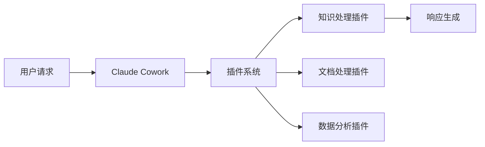
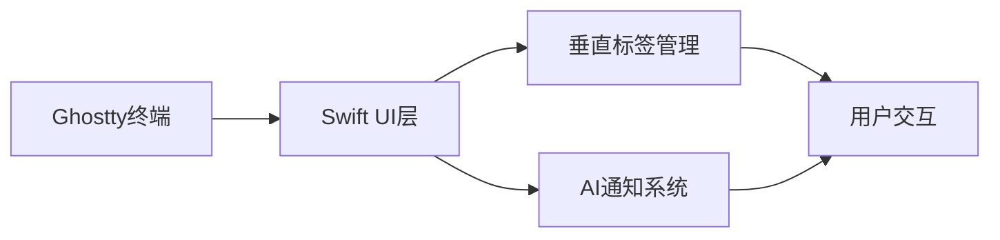
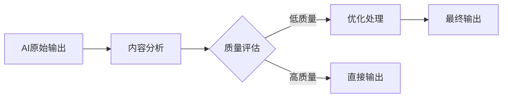

## 今日热点

AI编程助手生态迅速发展，知识图谱与性能优化工具成为热点；同时提升AI生成内容真实性的项目受到关注，反映开发者对AI实用性与质量的双重追求。

---

## 热门项目一览

| 排名 | 项目 | 语言 | 今日 | 总计 | 简介 |
|:---:|------|:----:|------:|-----:|------|
| 1 | [Lum1104/Understand-Anything](https://github.com/Lum1104/Understand-Anything) | TypeScript | +5,604 | 31,531 | Graphs that teach > graphs ... |
| 2 | [colbymchenry/codegraph](https://github.com/colbymchenry/codegraph) | TypeScript | +3,161 | 25,354 | Pre-indexed code knowledge ... |
| 3 | [rohitg00/ai-engineering-from-scratch](https://github.com/rohitg00/ai-engineering-from-scratch) | Python | +3,154 | 18,796 | Learn it. Build it. Ship it... |
| 4 | [multica-ai/andrej-karpathy-skills](https://github.com/multica-ai/andrej-karpathy-skills) | Unknown | +2,749 | 155,153 | A single CLAUDE.md file to ... |
| 5 | [affaan-m/ECC](https://github.com/affaan-m/ECC) | JavaScript | +2,025 | 192,504 | The agent harness performan... |
| 6 | [anthropics/knowledge-work-plugins](https://github.com/anthropics/knowledge-work-plugins) | Python | +1,441 | 15,580 | Open source repository of p... |
| 7 | [mukul975/Anthropic-Cybersecurity-Skills](https://github.com/mukul975/Anthropic-Cybersecurity-Skills) | Python | +1,004 | 9,312 | 754 structured cybersecurit... |
| 8 | [garrytan/gstack](https://github.com/garrytan/gstack) | TypeScript | +640 | 102,553 | Use Garry Tan's exact Claud... |
| 9 | [manaflow-ai/cmux](https://github.com/manaflow-ai/cmux) | Swift | +603 | 19,531 | Ghostty-based macOS termina... |
| 10 | [hardikpandya/stop-slop](https://github.com/hardikpandya/stop-slop) | Unknown | +345 | 4,456 | A skill file for removing A... |
| 11 | [Fincept-Corporation/FinceptTerminal](https://github.com/Fincept-Corporation/FinceptTerminal) | Python | +317 | 23,913 | FinceptTerminal is a modern... |
| 12 | [Leonxlnx/taste-skill](https://github.com/Leonxlnx/taste-skill) | Shell | +264 | 19,832 | Taste-Skill - gives your AI... |

---

## 趋势洞察

```
┌─────────────────────────────────────────────────────────────────┐
│  AI/ML 工具         ████████████████████████  13 个项目        │
│  其他               ███                       2 个项目        │
│  项目管理             █                         1 个项目        │
│  开发工具             █                         1 个项目        │
└─────────────────────────────────────────────────────────────────┘
```

---

## 项目深度解读

### 1. Lum1104/Understand-Anything — 代码知识图谱

> **一句话总结**：将任何代码转换为可探索、搜索和提问的交互式知识图谱，支持多种AI编码助手。

#### 价值主张

| 维度 | 说明 |
|------|------|
| **解决痛点** | 解决代码理解和知识获取难题，提供代码全局视角 |
| **目标用户** | 开发者、代码审查者、技术文档编写者 |
| **核心亮点** | 交互式知识图谱 + 多AI工具集成 + 代码搜索与问答 |

#### 技术架构


**技术特色**：
- 代码解析与知识提取技术
- 交互式知识图谱可视化
- 多AI工具兼容性架构

#### 热度分析

- 项目获得31,531个star，近期增长5,604个，表明技术社区高度认可
- 作为代码理解工具，处于AI辅助编程生态的关键位置

#### 快速上手

```bash
# 安装
npm install understand-anything

# 使用
understand-anything ./your-code-directory
```

#### 注意事项

- 项目许可证未知，商业使用前需确认授权情况
- 支持多种AI工具，但可能需要额外配置
- 代码解析可能存在对特定编程语言的支持差异


### 2. colbymchenry/codegraph — 代码知识图谱

> **一句话总结**：为AI编程助手提供本地化预索引代码知识图谱，减少token和工具调用，提升效率。

#### 价值主张

| 维度 | 说明 |
|------|------|
| **解决痛点** | 解决AI编程助手理解大型代码库效率低、token消耗大、工具调用频繁的问题 |
| **目标用户** | 使用Claude Code、Codex、Cursor等AI编程助手的开发人员 |
| **核心亮点** | 预索引代码知识 + 完全本地运行 + 减少token消耗 + 减少工具调用 |

#### 技术架构


**技术特色**：
- 预索引技术减少实时处理开销
- 本地化运行确保数据隐私和低延迟
- 知识图谱结构提升代码理解效率
- 优化token使用降低API成本
- 支持多个主流AI编程助手平台

#### 热度分析

- 项目获得25,354个Star，单日增长3,161，显示强劲的社区关注度和快速上升的热度
- Fork数相对较少(1,406)表明项目更多被直接使用而非二次开发，反映出其成熟度和易用性

#### 快速上手

```bash
# 克隆项目
git clone https://github.com/colbymchenry/codegraph.git

# 安装依赖
npm install

# 构建索引
npm run build
```

#### 注意事项

- 项目许可证未知，使用前需确认商业使用限制
- 完全本地运行可能需要较高的本地计算资源
- 需要确保与使用的AI编程助手平台的兼容性
- 可能需要定期更新索引以保持代码库的最新状态


### 3. rohitg00/ai-engineering-from-scratch — AI工程学习路径

> **一句话总结**：从零开始的AI工程学实践指南，提供从学习到部署的完整路径。

#### 价值主张

| 维度 | 说明 |
|------|------|
| **解决痛点** | 提供系统化AI工程学习路径，解决从理论到实践的鸿沟 |
| **目标用户** | AI领域初学者和希望提升工程化能力的开发者 |
| **核心亮点** | 项目驱动学习 + 完整工程流程 + 实用代码示例 |

#### 技术架构


**技术特色**：
- 基于Python的AI工具链整合
- 端到端项目实践方法
- 工程化思维培养

#### 热度分析

- 项目近期增长迅速，单日增加3000+ stars，表明内容质量高且符合当前AI学习热潮
- Fork数量相对适中，说明项目更多被用作学习参考而非二次开发

#### 快速上手

```bash
# 克隆项目
git clone https://github.com/rohitg00/ai-engineering-from-scratch.git

# 进入项目目录
cd ai-engineering-from-scratch
```

#### 注意事项

- 项目内容可能需要一定的编程基础，特别是Python
- 学习过程中需要自行准备相关环境和数据集
- 建议按照项目顺序逐步学习，避免跳跃


### 4. multica-ai/andrej-karpathy-skills — AI编程优化指南

> **一句话总结**：基于Andrej Karpathy观察的Claude Code行为优化指南，解决LLM编程陷阱。

#### 价值主张

| 维度 | 说明 |
|------|------|
| **解决痛点** | 解决AI模型在编程中的常见陷阱和低效问题 |
| **目标用户** | 使用AI辅助编程的开发者和研究人员 |
| **核心亮点** | 实用指南 + Andrej Karpathy经验 + 单文件简洁设计 |

#### 技术架构

**技术特色**：
- 基于专家经验提炼的编程指南
- 针对Claude Code优化的专门建议
- 简洁的单文件设计便于实施

#### 热度分析

- 项目获得15.5万星标，近期增长迅速，日均增长超2.7k
- 无开放issue表明项目已成熟稳定，社区高度认可

#### 快速上手

```bash
# 直接查看CLAUDE.md文件获取完整指南
# 文件内容可直接应用于Claude Code使用场景
```

#### 注意事项

- 本项目专门针对Claude Code优化，其他AI编程助手可能不完全适用
- 指南基于当前AI模型能力，随着技术发展可能需要更新


### 5. affaan-m/ECC — AI代码优化系统

> **一句话总结**：ECC是AI代码助手性能优化系统，提升Claude Code等工具的技能、记忆与安全特性。

#### 价值主张

| 维度 | 说明 |
|------|------|
| **解决痛点** | 优化AI代码助手性能，提升生成代码质量与安全性 |
| **目标用户** | 使用Claude Code、Codex等AI编程工具的开发者 |
| **核心亮点** | 技能增强 + 记忆功能 + 安全保障 + 研究优先开发 |

#### 技术架构


**技术特色**：
- 基于JavaScript实现，便于集成到多种开发环境
- 采用记忆机制提升AI代码生成的连贯性与质量
- 研究优先开发，持续优化AI代码生成能力

#### 热度分析

- 项目Star数超19万且每日新增2千+，增长迅猛，表明其价值获得广泛认可
- Fork数近3万，社区活跃度高，表明项目被广泛使用和二次开发

#### 快速上手

```bash
git clone https://github.com/affaan-m/ECC.git
cd ECC
npm install
```

#### 注意事项

- 项目许可证未知，使用时需注意版权问题
- Open Issues为0，可能表示项目通过其他渠道处理问题
- 建议查看源码文档以了解具体功能配置方法


### 6. anthropics/knowledge-work-plugins — 知识工作插件库

> **一句话总结**：Anthropic官方开源的知识工作插件库，扩展Claude Cowork的专业处理能力。

#### 价值主张

| 维度 | 说明 |
|------|------|
| **解决痛点** | 为知识工作者提供专业插件，增强Claude在文档处理和信息检索能力 |
| **目标用户** | 知识工作者、研究人员、内容创作者、企业用户等专业人士 |
| **核心亮点** | 官方支持的插件生态 + 专为知识工作场景优化 + 开源可定制 |

#### 技术架构



**技术特色**：
- 模块化插件架构，便于扩展和维护
- 基于Python轻量级实现，降低开发门槛
- 提供统一插件接口，确保系统兼容性

#### 热度分析

- 项目短时间内获得大量关注，单日新增1441星，呈现爆发式增长
- 作为Anthropic官方项目，在AI助手插件生态中占据核心战略位置

#### 快速上手

```bash
# 克隆项目
git clone https://github.com/anthropics/knowledge-work-plugins.git
cd knowledge-work-plugins

# 安装依赖
pip install -r requirements.txt
```

#### 注意事项

- 插件需与Claude Cowork配合使用，单独部署无法发挥全部功能
- 作为新兴项目，API和功能可能有较大变化，生产环境使用需谨慎评估
- 建议关注官方更新，及时获取最新功能和最佳实践


### 7. mukul975/Anthropic-Cybersecurity-Skills — AI安全技能库

> **一句话总结**：754个结构化网络安全技能，整合5大主流安全框架，赋能AI代理安全能力。

#### 价值主张

| 维度 | 说明 |
|------|------|
| **解决痛点** | 网络安全知识分散，缺乏统一标准，AI安全能力不足 |
| **目标用户** | 安全研究员、AI开发者、网络安全团队、合规审计人员 |
| **核心亮点** | 跨框架映射 + agentskills.io标准 + 多平台兼容 + 结构化技能库 |

#### 技术架构


**技术特色**：
- 基于Python的结构化技能库实现
- 与主流AI开发平台无缝集成
- 支持多种安全框架的交叉映射

#### 热度分析

- 项目获得9,312个Star，单日增长1,004，呈现爆发式增长态势
- 社区活跃度高，Fork数达1,139，表明被广泛采用和二次开发
- 无公开Issues，可能表示项目维护良好或问题通过其他渠道解决

#### 快速上手

```bash
# 克隆项目
git clone https://github.com/mukul975/Anthropic-Cybersecurity-Skills.git

# 安装依赖
pip install -r requirements.txt
```

#### 注意事项

- 项目使用Apache 2.0许可证，可用于商业用途
- 技能库需要定期更新以应对新型网络安全威胁
- 与AI平台的集成可能需要针对特定环境进行调整


### 8. garrytan/gstack — 全栈工具集

> **一句话总结**：一个包含23个专业工具的开发工具栈，覆盖从CEO到QA的全流程开发角色需求。

#### 价值主张

| 维度 | 说明 |
|------|------|
| **解决痛点** | 整合分散的开发工具链，提供一站式解决方案 |
| **目标用户** | 高效团队、独立开发者和全栈工程师 |
| **核心亮点** | 覆盖全生命周期 + 23个专业工具 + 角色化设计 |

#### 技术架构

**技术特色**：
- 基于TypeScript构建，提供类型安全
- 工具模块化设计，便于扩展
- 覆盖开发全流程的完整工具链

#### 热度分析

- 项目获得10万+星标，日增640+，表明开发者高度认可
- 作为开发工具生态中的重要组件，社区活跃度高

#### 快速上手

```bash
# 克隆项目
git clone https://github.com/garrytan/gstack.git
# 进入目录
cd gstack
# 安装依赖
npm install
```

#### 注意事项

- 项目包含23个工具，初次使用需要一定学习成本
- 工具链整合度高，可能需要根据团队需求进行调整


### 9. manaflow-ai/cmux — AI终端增强

> **一句话总结**：基于Ghostty的macOS终端，提供垂直标签和AI编码代理通知功能，提升AI辅助开发体验。

#### 价值主张

| 维度 | 说明 |
|------|------|
| **解决痛点** | 传统终端缺乏AI集成，无法有效支持AI编码辅助工作流 |
| **目标用户** | macOS上的AI辅助开发者、AI编码工具使用者 |
| **核心亮点** | 垂直标签布局 + AI通知集成 + Ghostty基础性能 |

#### 技术架构



**技术特色**：
- 基于Ghostty的高性能终端内核
- Swift实现的现代化UI界面
- 专为AI编码工作流优化的通知系统

#### 热度分析

- 项目Star数近2万且持续增长，表明开发者社区对AI集成终端工具需求强烈
- 作为新兴AI工具链中的关键组件，生态位独特且发展迅速

#### 快速上手

```bash
# 安装cmux
brew install manaflow-ai/tap/cmux

# 启动cmux终端
cmux
```

#### 注意事项

- 目前仅支持macOS系统
- 需要配合AI编码工具使用才能发挥最大价值
- 作为较新项目，API和功能可能快速迭代


### 10. hardikpandya/stop-slop — AI文本净化工具

> **一句话总结**：一个技能文件工具，用于移除AI生成文本中的机械特征，使文本更自然流畅。

#### 价值主张

| 维度 | 说明 |
|------|------|
| **解决痛点** | AI生成文本易被识别，缺乏人类写作的自然性和多样性 |
| **目标用户** | 内容创作者、AI工具使用者、需要隐藏AI痕迹的写作者 |
| **核心亮点** | 检测AI特征 + 修改文本表达 + 保留原意 + 提高自然度 |

#### 技术架构


**技术特色**：
- 识别AI文本特有的句式和词汇模式
- 应用多种自然化处理规则增强文本多样性
- 保持语义一致性的前提下优化表达方式

#### 热度分析

- 项目近期热度迅速攀升，单日增长345个Star，反映对AI文本处理需求激增
- 零Issues表明项目已相对成熟或用户反馈主要通过其他渠道处理

#### 快速上手

```bash
# 克隆项目
git clone https://github.com/hardikpandya/stop-slop.git

# 使用工具处理文本文件
python stop_slop.py input.txt -o output.txt
```

#### 注意事项

- 项目代码尚未完全公开，具体实现细节有待验证
- 效果可能因AI生成模型不同而有所差异
- 使用前应了解文本处理的数据隐私政策


### 11. Fincept-Corporation/FinceptTerminal — 金融分析终端

> **一句话总结**：一站式金融数据分析平台，提供市场洞察与投资决策支持。

#### 价值主张

| 维度 | 说明 |
|------|------|
| **解决痛点** | 整合分散金融数据，简化复杂市场分析流程 |
| **目标用户** | 金融分析师、投资者和经济研究人员 |
| **核心亮点** | 高级市场分析工具 + 投资研究功能 + 交互式数据探索 + 经济数据整合 + 用户友好界面 |

#### 技术架构


**技术特色**：
- 基于Python的金融数据处理框架
- 交互式数据可视化组件
- 多源金融数据整合能力

#### 热度分析

- 项目拥有近24,000个Star，近期增长迅速，表明其在金融科技领域具有较高的认可度。
- Fork数量超过3,200，说明社区积极参与项目改进和功能扩展。

#### 快速上手

```bash
# 安装FinceptTerminal
pip install fincept

# 启动金融终端
fincept
```

#### 注意事项

- 项目许可证未知，商业使用前需确认授权条款
- 作为金融分析工具，数据准确性和可靠性至关重要
- 可能需要额外的数据源配置才能完全发挥功能


### 12. Leonxlnx/taste-skill — AI内容优化

> **一句话总结**：提升AI生成内容质量，防止产生无聊、通用的内容输出。

#### 价值主张

| 维度 | 说明 |
|------|------|
| **解决痛点** | 解决AI生成内容缺乏创意和个性问题，提升内容质量 |
| **目标用户** | AI开发者、内容创作者、AI工具使用者 |
| **核心亮点** | 过滤低质量内容 + 提升创意性 + 保持AI原有功能 |

#### 技术架构



**技术特色**：
- 使用Shell脚本实现轻量级过滤机制
- 通过启发式算法识别低质量内容
- 保持AI原有功能的同时提升输出质量

#### 热度分析

- 项目获得近2万星，近期增长迅速，表明用户对AI内容质量提升需求强烈
- 虽为小工具但社区活跃度高，已成为AI内容优化领域的重要参考

#### 快速上手

```bash
# 安装
git clone https://github.com/Leonxlnx/taste-skill.git
cd taste-skill

# 使用
./taste-skill "输入内容"
```

#### 注意事项

- 项目许可证未知，商业使用前需确认授权情况
- 可能需要根据具体AI模型和使用场景进行调整优化
- Shell脚本实现可能在处理大量内容时性能有限


### 13. shiyu-coder/Kronos — 金融语言大模型

> **一句话总结**：Kronos是专为金融市场语言设计的开源基础模型，助力金融分析和决策。

#### 价值主张

| 维度 | 说明 |
|------|------|
| **解决痛点** | 金融文本理解与分析缺乏专业AI支持 |
| **目标用户** | 金融分析师、量化交易员、投资机构 |
| **核心亮点** | 金融领域专业知识 + 多任务处理能力 + 高性能推理 |

#### 技术架构


**技术特色**：
- 基于Transformer架构的金融语言模型
- 针对金融专业术语优化的预训练策略
- 支持多种金融NLP任务的一体化框架

#### 热度分析

- 项目获得26k+星标，近期单日增长245星，显示金融AI领域强烈需求
- 4.5k+次Fork，表明开发者社区积极参与二次开发和贡献

#### 快速上手

```bash
# 安装依赖
pip install kronos-model

# 加载预训练模型
from kronos import KronosModel
model = KronosModel.from_pretrained("kronos-base")

# 金融文本分析
result = model.analyze("AAPL stock performance analysis")
```

#### 注意事项

- 模型仅用于研究和学术目的，商业使用需获得授权
- 金融决策应结合多方信息，模型预测仅供参考
- 模型可能无法覆盖所有金融专业领域，需定期更新


### 14. Axorax/awesome-free-apps — [精选免费应用]

> **一句话总结**：精心筛选的跨平台免费应用资源库，解决用户寻找优质免费软件的难题。

#### 价值主张

| 维度 | 说明 |
|------|------|
| **解决痛点** | 用户在海量应用中难以筛选出真正免费且优质的软件 |
| **目标用户** | 寻找免费替代品的普通用户、预算有限的开发者和学生 |
| **核心亮点** + 精心筛选 + 持续更新 + 分类清晰 + 跨平台覆盖 |

#### 技术架构

**技术特色**：
- 使用Markdown格式组织内容，便于阅读和维护
- 采用分类结构，提高资源查找效率
- 通过社区贡献保持内容更新，确保资源时效性

#### 热度分析

- 项目获得近4600星，日均增长约190星，显示用户对免费应用资源有强烈需求
- 作为awesome系列分支，受益于awesome品牌效应，同时社区活跃度较高

#### 快速上手

```bash
# 克隆仓库查看完整列表
git clone https://github.com/Axorax/awesome-free-apps.git

# 浏览README.md了解应用分类
cat awesome-free-apps/README.md
```

#### 注意事项

- 项目依赖社区贡献更新，部分应用可能随时间停止维护或转为付费
- 使用前建议验证应用的许可协议，确保符合个人或组织使用需求
- 不同平台的应用兼容性可能有所差异，使用前需确认系统要求


### 15. paperless-ngx/paperless-ngx — 智能文档管理

> **一句话总结**：开源文档管理系统，支持扫描、OCR识别、自动分类和全文检索。

#### 价值主张

| 维度 | 说明 |
|------|------|
| **解决痛点** | 解决纸质文档堆积、查找困难、存储空间不足的问题 |
| **目标用户** | 需要系统化文档管理的个人、家庭和小型企业 |
| **核心亮点** | OCR文字识别 + 智能分类 + 全文检索 + 元数据管理 + 多设备访问 |

#### 技术架构


**技术特色**：
- 采用OCR技术自动提取文档内容，支持多语言识别
- 基于Docker容器化部署，简化环境配置和迁移
- 使用Vue.js构建响应式前端界面，提供良好用户体验
- 支持多种文档格式转换与处理
- 提供RESTful API便于第三方系统集成

#### 热度分析

- 项目Star数超4.1万，近期日均增长约170+，表明社区活跃度持续攀升
- 作为文档管理领域的领先开源解决方案，已形成完善的插件生态和社区支持体系

#### 快速上手

```bash
# 克隆项目
git clone https://github.com/paperless-ngx/paperless-ngx.git

# 使用Docker启动
docker-compose up -d

# 访问Web界面
http://localhost:8000
```

#### 注意事项

- OCR处理对服务器性能要求较高，建议配置足够内存和CPU资源
- 文档存储空间需求随使用量增长而增加，需合理规划存储容量
- 需定期备份数据库和文件存储，确保数据安全
- 文档隐私保护需额外配置访问控制，敏感文档建议加密存储


### 16. anthropics/claude-cookbooks — Claude应用示例集

> **一句话总结**：精选Claude使用示例集，提供实用技巧和创新应用场景。

#### 价值主张

| 维度 | 说明 |
|------|------|
| **解决痛点** | Claude使用缺乏系统示例和最佳实践指导 |
| **目标用户** | AI研究人员、开发者、Claude用户 |
| **核心亮点** | 实用性强 + 场景丰富 + 示例详细 + 更新及时 + 社区贡献 |

#### 技术架构


**技术特色**：
- 基于Jupyter Notebook的交互式展示
- 提供可直接运行的Claude API调用代码
- 结合具体场景展示Claude能力边界

#### 热度分析

- 项目获得44k+ stars，近期稳定增长，显示Claude社区活跃度高
- 作为官方示例库，具有高参考价值和生态引领作用

#### 快速上手

```bash
# 克隆仓库
git clone https://github.com/anthropics/claude-cookbooks.git

# 运行示例notebook
cd claude-cookbooks
jupyter notebook
```

#### 注意事项

- 需要有效的Anthropic API密钥才能运行部分示例
- 不同notebook可能需要特定依赖包，建议使用虚拟环境
- 示例代码会随Claude API更新而变化，需关注最新版本


### 17. moeru-ai/airi — **AI动漫助手**

> **一句话总结**：自托管AI助手，融合动漫角色特色，支持实时语音与游戏互动的个性化AI伴侣。

#### 价值主张

| 维度 | 说明 |
|------|------|
| **解决痛点** | 提供自托管、用户拥有的AI助手，结合动漫角色特色，增强交互体验 |
| **目标用户** | 喜欢动漫文化的AI爱好者、注重隐私的游戏玩家、技术型AI探索者 |
| **核心亮点** | 自托管架构 + 动漫角色人格 + 实时语音交互 + 游戏集成 + 跨平台支持 |

#### 技术架构


**技术特色**：
- 自托管架构设计，保障用户数据隐私与自主控制权
- 实时语音处理技术，实现低延迟、自然的对话体验
- 游戏API集成能力，扩展AI在虚拟环境中的应用场景

#### 热度分析
- 项目近4万Star，日均增长62个，表明项目受广泛关注且持续增长
- 4千+ Fork数显示社区活跃度高，用户二次开发意愿强烈

#### 快速上手

```bash
# 克隆项目仓库
git clone https://github.com/moeru-ai/airi.git

# 安装依赖
cd airi
npm install

# 启动服务
npm start
```

#### 注意事项
- 项目需要自托管部署，用户需具备基本的技术配置能力
- 游戏功能(Minecraft/Factorio)可能需要额外配置API接口
- 项目许可证信息不明确，使用前需确认版权条款


## 今日推荐

| 主题 | 推荐项目 | 亮点 |
|------|----------|------|
| 今日最热 | [Lum1104/Understand-Anything](https://github.com/Lum1104/Understand-Anything) | Graphs that teach... |
| 值得关注 | [colbymchenry/codegraph](https://github.com/colbymchenry/codegraph) | Pre-indexed code ... |
| 快速上手 | [rohitg00/ai-engineering-from-scratch](https://github.com/rohitg00/ai-engineering-from-scratch) | Learn it. Build i... |
| 长期潜力 | [multica-ai/andrej-karpathy-skills](https://github.com/multica-ai/andrej-karpathy-skills) | A single CLAUDE.m... |

---

<div align="center">

*Generated on 2026-05-26 | Powered by GitHub Trending Reporter*

</div>