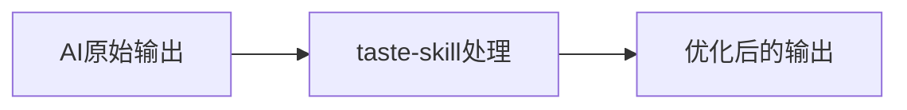
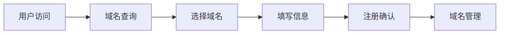
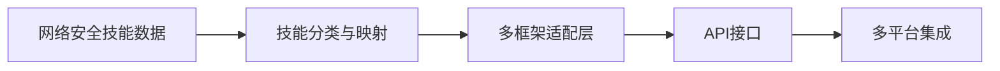
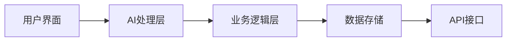
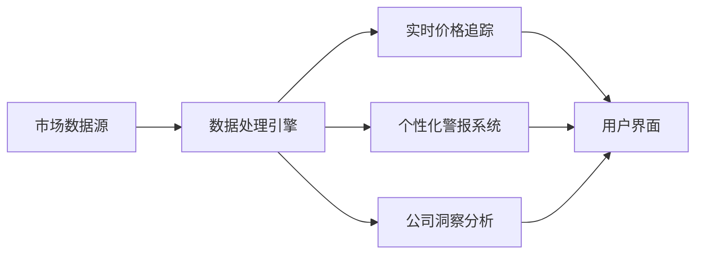

## 今日热点

今日GitHub热榜聚焦AI代理增强工具与工程化开发，多个项目提升AI理解能力、记忆力和专业化技能，开源社区积极构建企业级AI替代方案。

---

## 热门项目一览

| 排名 | 项目 | 语言 | 今日 | 总计 | 简介 |
|:---:|------|:----:|------:|-----:|------|
| 1 | [Lum1104/Understand-Anything](https://github.com/Lum1104/Understand-Anything) | TypeScript | +4,697 | 36,252 | Graphs that teach > graphs ... |
| 2 | [rohitg00/ai-engineering-from-scratch](https://github.com/rohitg00/ai-engineering-from-scratch) | Python | +2,155 | 20,901 | Learn it. Build it. Ship it... |
| 3 | [affaan-m/ECC](https://github.com/affaan-m/ECC) | JavaScript | +1,915 | 194,556 | The agent harness performan... |
| 4 | [anthropics/knowledge-work-plugins](https://github.com/anthropics/knowledge-work-plugins) | Python | +1,718 | 16,733 | Open source repository of p... |
| 5 | [Leonxlnx/taste-skill](https://github.com/Leonxlnx/taste-skill) | Shell | +1,430 | 22,034 | Taste-Skill - gives your AI... |
| 6 | [DigitalPlatDev/FreeDomain](https://github.com/DigitalPlatDev/FreeDomain) | HTML | +1,219 | 167,553 | DigitalPlat FreeDomain: Fre... |
| 7 | [mukul975/Anthropic-Cybersecurity-Skills](https://github.com/mukul975/Anthropic-Cybersecurity-Skills) | Python | +880 | 10,185 | 754 structured cybersecurit... |
| 8 | [Axorax/awesome-free-apps](https://github.com/Axorax/awesome-free-apps) | JavaScript | +731 | 5,341 | Curated list of the best fr... |
| 9 | [hardikpandya/stop-slop](https://github.com/hardikpandya/stop-slop) | Unknown | +539 | 5,080 | A skill file for removing A... |
| 10 | [thedotmack/claude-mem](https://github.com/thedotmack/claude-mem) | TypeScript | +352 | 78,727 | Persistent Context Across S... |
| 11 | [twentyhq/twenty](https://github.com/twentyhq/twenty) | TypeScript | +216 | 46,895 | The open alternative to Sal... |
| 12 | [st-tech/ppf-contact-solver](https://github.com/st-tech/ppf-contact-solver) | Python | +170 | 3,515 | A contact solver for physic... |

---

## 趋势洞察

```
┌─────────────────────────────────────────────────────────────────┐
│  AI/ML 工具         ████████████████████████  11 个项目        │
│  多媒体应用            ██                        1 个项目        │
│  开发工具             ██                        1 个项目        │
│  其他               ██                        1 个项目        │
└─────────────────────────────────────────────────────────────────┘
```

---

## 项目深度解读

### 1. Lum1104/Understand-Anything — 代码知识图谱

> **一句话总结**：将代码转换为交互式知识图谱，支持多种AI工具，便于代码探索与理解。

#### 价值主张

| 维度 | 说明 |
|------|------|
| **解决痛点** | 降低复杂代码理解门槛，提供直观代码结构可视化 |
| **目标用户** | 开发者、代码审查人员、系统架构师、技术学习者 |
| **核心亮点** | 交互式知识图谱可视化 + 多AI工具集成 + 代码搜索与问答功能 |

#### 技术架构


**技术特色**：
- 基于TypeScript构建，确保类型安全
- 支持多种AI工具集成，增强代码理解能力
- 交互式知识图谱技术，提供直观的代码结构展示

#### 热度分析

- 项目Star数高达36,252且单日增长近5,000，表明获得开发者广泛关注
- 零Open Issues可能反映项目成熟度高或社区通过其他渠道提供支持

#### 快速上手

```bash
# 安装依赖
npm install

# 启动服务
npm start

# 与AI工具集成
npm run integrate -- --tool claude
```

#### 注意事项

- 项目许可证未知，商业使用前需确认授权条款
- 零Open Issues可能意味着问题在其他渠道讨论，需关注社区支持方式


### 2. rohitg00/ai-engineering-from-scratch — AI工程学习路径

> **一句话总结**：从零开始学习AI工程，通过实践项目构建并交付AI解决方案。

#### 价值主张

| 维度 | 说明 |
|------|------|
| **解决痛点** | 提供系统化的AI工程学习路径，解决理论与实践脱节问题 |
| **目标用户** | 希望进入AI工程领域的学习者和开发者 |
| **核心亮点** | 项目驱动学习 + 实践导向 + 完整工程流程覆盖 + 社区支持 |

#### 技术架构


**技术特色**：
- 基于Python的AI工程实践案例
- 涵盖从学习到部署的完整流程
- 提供可复现的项目代码和教程

#### 热度分析

- 项目获得超过2万星，近期增长迅速，表明AI工程学习需求旺盛
- 作为教育类项目，社区参与度高，形成良好的学习生态

#### 快速上手

```bash
# 克隆项目仓库
git clone https://github.com/rohitg00/ai-engineering-from-scratch.git

# 进入项目目录
cd ai-engineering-from-scratch

# 查看项目说明
cat README.md
```

#### 注意事项
- 项目可能需要一定的Python和AI基础知识
- 部分项目可能需要额外的依赖和环境配置
- 建议按照项目顺序学习，以获得最佳学习体验


### 3. affaan-m/ECC — AI 编程优化系统

> **一句话总结**：为 AI 编程助手提供性能优化，整合技能、记忆与安全特性的智能代理系统。

#### 价值主张

| 维度 | 说明 |
|------|------|
| **解决痛点** | AI 编程助手性能瓶颈与上下文理解不足问题 |
| **目标用户** | 使用 AI 编程助力的开发者与研究人员 |
| **核心亮点** | 技能整合 + 记忆系统 + 安全机制 + 研究优先开发 |

#### 技术架构

**技术特色**：
- 多维度能力整合系统
- 智能代理性能优化框架
- 安全优先的代码处理机制

#### 热度分析

- 项目获得近20万星，日增近2千，显示极高社区关注度
- 作为AI编程辅助工具，处于技术前沿热点领域

#### 快速上手

```bash
# 克隆项目
git clone https://github.com/affaan-m/ECC.git

# 安装依赖
npm install
```

#### 注意事项

- 项目许可证未知，使用前需确认授权条款
- 项目Open Issues为0，可能意味着问题在其他渠道解决或项目处于稳定期


### 4. anthropics/knowledge-work-plugins — 知识工作插件

> **一句话总结**：Anthropic官方为Claude Cowork开发的知识工作者插件库，扩展AI助手专业应用能力。

#### 价值主张

| 维度 | 说明 |
|------|------|
| **解决痛点** | 为知识工作者提供专业领域插件，扩展Claude在特定场景的应用能力 |
| **目标用户** | 知识工作者、研究人员、内容创作者、分析师等 |
| **核心亮点** | 官方支持 + 专业领域扩展 + 易于集成 + 高度定制化 |

#### 技术架构

**技术特色**：
- 基于Python插件架构，便于扩展和功能定制
- 采用模块化设计，各插件功能独立且可组合使用
- 与Claude Cowork深度集成，提供无缝用户体验

#### 热度分析

- 项目Star数超16,000且近期激增，显示知识工作者对AI助手插件需求的爆发式增长
- 作为Anthropic官方项目，在Claude生态系统中占据核心地位，有望成为AI辅助知识工作的标准插件库

#### 快速上手

```bash
# 克隆仓库
git clone https://github.com/anthropics/knowledge-work-plugins.git

# 安装依赖
cd knowledge-work-plugins
pip install -r requirements.txt
```

#### 注意事项

- 项目许可证信息不明确，使用前需确认授权条款
- 需要Claude Cowork环境才能正常使用这些插件
- 插件可能需要Anthropic API密钥进行身份验证


### 5. Leonxlnx/taste-skill — AI内容优化

> **一句话总结**：通过Shell脚本增强AI生成内容质量，避免单调乏味的通用输出

#### 价值主张

| 维度 | 说明 |
|------|------|
| **解决痛点** | 解决AI生成内容单调、缺乏创意和深度的问题 |
| **目标用户** | AI开发者、内容创作者、研究人员 |
| **核心亮点** | + 内容质量提升 + 避免单调输出 + 简单易用 + 轻量级实现 |

#### 技术架构



**技术特色**：
- 基于Shell脚本实现，跨平台兼容性强
- 轻量级设计，无需复杂依赖
- 可定制化处理逻辑，适应不同场景需求

#### 热度分析

- 项目获得22,034个Star且近期激增(+1,430 today)，显示其在AI内容优化领域有显著影响力
- 零Open Issues表明项目维护良好，社区反馈问题已得到有效解决

#### 快速上手

```bash
# 克隆项目
git clone https://github.com/Leonxlnx/taste-skill.git
cd taste-skill

# 使用taste-skill处理AI输出
./taste-skill.sh "your AI generated text"
```

#### 注意事项

- 项目许可证未知，商业使用前需确认授权方式
- 作为Shell脚本工具，可能需要额外的依赖库或环境配置才能正常运行
- 由于缺乏详细文档，使用前可能需要阅读源代码以了解具体用法


### 6. DigitalPlatDev/FreeDomain — 免费域名服务

> **一句话总结**：提供完全免费的域名注册服务，降低个人和小型项目的网站建设门槛。

#### 价值主张

| 维度 | 说明 |
|------|------|
| **解决痛点** | 解决域名注册费用高的问题，让每个人都能拥有自己的网站 |
| **目标用户** | 个人开发者、小型项目团队、初创企业、预算有限的网站建设者 |
| **核心亮点** | 完全免费 + 即时生效 + 无广告 + 简单注册流程 |

#### 技术架构



**技术特色**：
- 基于HTML的轻量级前端界面设计
- 实时域名可用性查询系统
- 简化的注册流程和即时域名分配机制

#### 热度分析

- 项目获得超过16万星，日均增长1200+，表明需求旺盛且用户认可度高
- 零开放问题，暗示服务已稳定运行或问题通过其他渠道妥善处理

#### 快速上手

```bash
# 访问项目网站
# 输入 desired-name.freedomain.dev 查询可用性
# 填写基本信息完成注册
```

#### 注意事项

- 需确认免费域名的使用期限和续费政策
- 可能存在域名所有权限制或商业使用限制
- 建议仔细阅读服务条款，了解域名使用规则和限制


### 7. mukul975/Anthropic-Cybersecurity-Skills — AI安全技能库

> **一句话总结**：为AI代理提供754种结构化网络安全技能，映射至5大主流安全框架。

#### 价值主张

| 维度 | 说明 |
|------|------|
| **解决痛点** | AI代理缺乏结构化网络安全知识，无法有效应对安全挑战 |
| **目标用户** | 安全研究人员、AI开发者、网络安全专业人员 |
| **核心亮点** | 754结构化安全技能 + 5大框架映射 + 26安全领域覆盖 + 多平台兼容性 |

#### 技术架构



**技术特色**：
- 采用标准化agentskills.io规范，确保技能一致性
- 同时支持Claude Code、GitHub Copilot等20+平台
- 将网络安全知识结构化为机器可读格式
- 跨框架映射技术实现知识互通

#### 热度分析

- 项目近期Star激增(+880/天)，表明网络安全AI技能需求旺盛
- 高关注度且无开放Issue，说明项目成熟度高，用户满意度良好

#### 快速上手

```bash
# 克隆项目仓库
git clone https://github.com/mukul975/Anthropic-Cybersecurity-Skills.git

# 安装依赖
pip install -r requirements.txt

# 查看技能映射示例
python examples/skills_mapping.py --framework MITRE_ATT&CK
```

#### 注意事项

- 项目使用Apache 2.0许可证，可自由使用但需保留版权声明
- 技能映射需定期更新以跟上网络安全框架的最新发展
- 不同平台集成可能需要额外的配置和适配工作


### 8. Axorax/awesome-free-apps — 精选免费应用库

> **一句话总结**：精选优质免费应用资源库，涵盖PC和移动平台，助用户发现高效实用的免费软件。

#### 价值主张

| 维度 | 说明 |
|------|------|
| **解决痛点** | 解决用户寻找高质量免费应用困难的问题 |
| **目标用户** | 寻找优质免费软件的开发者、普通用户 |
| **核心亮点** | 精选优质 + 分类全面 + 持续更新 + 用户评价 + 跨平台支持 |

#### 技术架构


**技术特色**：
- 采用轻量级文档结构，便于维护和更新
- 使用JavaScript实现交互式应用筛选功能
- 分类系统清晰，支持多维度应用查找

#### 热度分析

- 项目获得5,341个星标，单日增长731，表明用户对免费资源需求强烈
- 零开放问题显示维护团队响应迅速，社区参与度高

#### 快速上手

```bash
# 克隆项目到本地
git clone https://github.com/Axorax/awesome-free-apps.git

# 浏览README.md了解应用分类
cat awesome-free-apps/README.md
```

#### 注意事项

- 应用可用性可能随时间变化，建议在使用前验证
- 部分应用可能包含广告或限制功能，请根据需求选择
- 定期查看更新以获取最新应用推荐


### 9. hardikpandya/stop-slop — AI文本净化

> **一句话总结**：移除AI生成文本特征的工具，帮助人类写作保持自然性

#### 价值主张

| 维度 | 说明 |
|------|------|
| **解决痛点** | 消除AI生成文本的机械感和可识别特征，使内容更自然 |
| **目标用户** | 内容创作者、编辑、研究人员和AI工具使用者 |
| **核心亮点** | 精准识别AI特征 + 保留作者风格 + 支持多种文本格式 |

#### 技术架构


**技术特色**：
- 基于模式识别的AI特征检测算法
- 智能保留作者个人写作风格
- 支持批量处理多种文本格式

#### 热度分析

- 项目近期增长迅速，单日新增539个星标，显示市场强烈需求
- 高star与低fork比例表明项目处于早期采纳阶段，尚未形成广泛生态

#### 快速上手

```bash
# 安装
pip install stop-slop

# 使用
stop-slop input.txt --output clean.txt
```

#### 注意事项

- 该工具可能无法完全消除所有AI特征，特别是在高度结构化的内容中
- 使用前建议备份原始文件，以防处理结果不符合预期
- 项目尚未明确开源协议，商业使用前需确认授权情况


### 10. thedotmack/claude-mem — AI记忆增强

> **一句话总结**：为AI助手提供跨会话持久化记忆，自动捕捉并压缩上下文，提升多轮对话连贯性。

#### 价值主张

| 维度 | 说明 |
|------|------|
| **解决痛点** | 解决AI助手在不同会话间无法保持上下文连贯性的问题 |
| **目标用户** | 使用多种AI编程助力的开发者和研究人员 |
| **核心亮点** | 跨会话记忆持久化 + AI压缩上下文 + 多平台兼容性 + 自动注入相关记忆 |

#### 技术架构


**技术特色**：
- 使用AI压缩技术减少记忆存储空间
- 支持多种AI平台的兼容性设计
- 智能提取和注入相关上下文

#### 热度分析

- 项目获得78,727个Star，单日增长352，显示快速增长趋势
- 6,772个Fork表明开发者社区积极参与，项目处于AI辅助编程工具生态核心位置

#### 快速上手

```bash
# 安装claude-mem
npm install -g claude-mem

# 初始化并配置
claude-mem init

# 启动会话记忆功能
claude-mem start
```

#### 注意事项

- 由于项目支持多种AI平台，需要确保配置正确对应使用的AI助手
- 记忆存储可能会涉及敏感信息，需要注意数据安全与隐私保护
- 项目License未知，商业使用前需确认授权方式


### 11. twentyhq/twenty — 开源AI CRM

> **一句话总结**：面向AI设计的开源CRM系统，提供Salesforce的现代化替代方案。

#### 价值主张

| 维度 | 说明 |
|------|------|
| **解决痛点** | 提供开源、可定制且AI优化的客户关系管理解决方案 |
| **目标用户** | 需要CRM系统但不想依赖Salesforce的企业和开发者 |
| **核心亮点** | 开源替代 + AI原生设计 + 高度可定制 + 企业级功能 |

#### 技术架构



**技术特色**：
- TypeScript全栈开发，确保类型安全和代码质量
- AI原生设计，深度集成机器学习和预测分析
- 微服务架构，支持高可扩展性和模块化部署

#### 热度分析

- Star数持续高增长(+216/天)，表明项目活跃度高且受欢迎
- 高Fork/Star比例(14.2%)，显示社区参与度和二次开发活跃

#### 快速上手

```bash
# 克隆仓库
git clone https://github.com/twentyhq/twenty.git
# 安装依赖
cd twenty && npm install
# 启动开发服务器
npm run dev
```

#### 注意事项

- 项目许可证未知，商业使用前需确认授权条款
- 作为相对较新的项目，生产环境使用前需充分测试
- 可能需要AI基础设施支持以充分利用AI功能


### 12. st-tech/ppf-contact-solver — 物理接触求解器

> **一句话总结**：高效处理壳体、固体和杆接触问题的物理模拟求解器

#### 价值主张

| 维度 | 说明 |
|------|------|
| **解决痛点** | 复杂物体间的精确碰撞检测与响应计算 |
| **目标用户** | 物理模拟开发者、游戏引擎工程师 |
| **核心亮点** | 基于约束的求解算法 + 多几何体支持 + 高性能并行计算 |

#### 技术架构


**技术特色**：
- 基于约束的接触求解方法，保证数值稳定性
- 支持壳体、固体和杆等复杂几何体的交互模拟
- 高效的空间分割和并行计算优化

#### 热度分析

- 项目近期获得较多关注，今日新增170星，处于活跃发展阶段
- 高fork数表明社区对其算法实现有浓厚兴趣，但问题数为零说明项目成熟度高

#### 快速上手

```bash
# 克隆项目
git clone https://github.com/st-tech/ppf-contact-solver.git

# 安装依赖
pip install -r requirements.txt

# 运行示例
python examples/demo.py
```

#### 注意事项

- 项目许可证未知，商业使用前需确认授权
- 可能需要一定的物理模拟和数值计算基础才能有效使用
- 项目可能依赖特定的Python环境和数值计算库


### 13. Open-Dev-Society/OpenStock — 开源股票平台

> **一句话总结**：开源免费的股票市场平台，提供实时价格追踪、个性化警报和深度公司洞察。

#### 价值主张

| 维度 | 说明 |
|------|------|
| **解决痛点** | 替代昂贵的股票市场平台，提供免费开源的替代方案 |
| **目标用户** | 个人投资者、股票交易员、金融分析师 |
| **核心亮点** | 实时价格追踪 + 个性化警报 + 详细公司洞察 + 开源透明 + 永久免费 |

#### 技术架构



**技术特色**：
- 使用TypeScript构建，保证代码质量和类型安全
- 实时数据处理能力，支持股票市场数据实时更新
- 模块化设计，便于扩展和维护

#### 热度分析

- 项目拥有12,178个星标且持续增长(+156/天)，表明市场对开源股票平台的强烈需求
- Fork数1,630，显示社区积极参与代码贡献和二次开发
- 0个开放问题，暗示项目维护良好，问题解决高效

#### 快速上手

```bash
# 克隆项目
git clone https://github.com/Open-Dev-Society/OpenStock.git
cd OpenStock

# 安装依赖
npm install

# 启动开发服务器
npm run dev
```

#### 注意事项

- 项目许可证未知，使用前需确认开源协议
- 作为金融数据平台，需关注数据来源的合法性和准确性
- 实时市场数据可能需要付费API支持，需确认项目是否有相关解决方案


### 14. jellyfin/jellyfin — 开源媒体服务器

> **一句话总结**：Jellyfin 是功能完善的免费开源媒体服务器，提供跨平台媒体管理与流媒体服务。

#### 价值主张

| 维度 | 说明 |
|------|------|
| **解决痛点** | 提供自托管媒体解决方案，摆脱商业软件限制和隐私担忧 |
| **目标用户** | 媒体收藏爱好者、家庭用户、小型组织及需要媒体流媒体服务的开发者 |
| **核心亮点** | 跨平台支持 + 免费开源 + 插件扩展 + 高度可定制 |

#### 技术架构


**技术特色**：
- 采用 C#/.NET Core 构建跨平台后端服务
- RESTful API 设计，支持多种客户端类型
- 支持实时媒体转码和自适应流媒体传输

#### 热度分析

- 项目持续稳定增长，近期日增星数超过80，显示活跃的开发社区和用户基础
- 作为 Plex 和 Emby 的开源替代品，在开源媒体服务器领域占据重要生态位置

#### 快速上手

```bash
# 安装 Jellyfin 服务器
docker run -d --name jellyfin -p 8096:8096 jellyfin/jellyfin

# 访问 Web 界面
# http://localhost:8096
```

#### 注意事项

- 需要一定的技术知识来设置和管理媒体库
- 大型媒体库可能需要较强的服务器硬件支持
- 插件系统可能存在兼容性问题，需谨慎选择


## 今日推荐

| 主题 | 推荐项目 | 亮点 |
|------|----------|------|
| 今日最热 | [Lum1104/Understand-Anything](https://github.com/Lum1104/Understand-Anything) | Graphs that teach... |
| 值得关注 | [rohitg00/ai-engineering-from-scratch](https://github.com/rohitg00/ai-engineering-from-scratch) | Learn it. Build i... |
| 快速上手 | [affaan-m/ECC](https://github.com/affaan-m/ECC) | The agent harness... |
| 长期潜力 | [anthropics/knowledge-work-plugins](https://github.com/anthropics/knowledge-work-plugins) | Open source repos... |

---

<div align="center">

*Generated on 2026-05-27 | Powered by GitHub Trending Reporter*

</div>