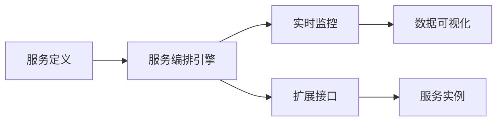
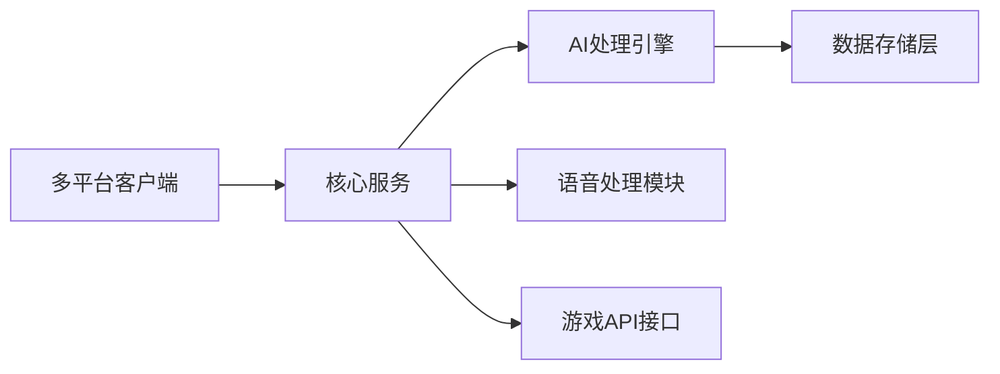

## 今日热点

AI内容质量提升与企业级AI工具崛起，开发者正积极解决AI输出同质化问题，同时构建专业领域AI解决方案。

---

## 热门项目一览

| 排名 | 项目 | 语言 | 今日 | 总计 | 简介 |
|:---:|------|:----:|------:|-----:|------|
| 1 | [Lum1104/Understand-Anything](https://github.com/Lum1104/Understand-Anything) | TypeScript | +4,465 | 40,158 | Graphs that teach > graphs ... |
| 2 | [Leonxlnx/taste-skill](https://github.com/Leonxlnx/taste-skill) | Shell | +2,715 | 24,455 | Taste-Skill - gives your AI... |
| 3 | [DigitalPlatDev/FreeDomain](https://github.com/DigitalPlatDev/FreeDomain) | HTML | +2,222 | 169,247 | DigitalPlat FreeDomain: Fre... |
| 4 | [affaan-m/ECC](https://github.com/affaan-m/ECC) | JavaScript | +2,062 | 196,133 | The agent harness performan... |
| 5 | [harry0703/MoneyPrinterTurbo](https://github.com/harry0703/MoneyPrinterTurbo) | Python | +1,742 | 62,470 | 利用AI大模型，一键生成高清短视频 Generate ... |
| 6 | [obra/superpowers](https://github.com/obra/superpowers) | Shell | +1,511 | 209,656 | An agentic skills framework... |
| 7 | [byoungd/English-level-up-tips](https://github.com/byoungd/English-level-up-tips) | Unknown | +1,163 | 46,878 | An advanced guide to learn ... |
| 8 | [mukul975/Anthropic-Cybersecurity-Skills](https://github.com/mukul975/Anthropic-Cybersecurity-Skills) | Python | +886 | 11,023 | 754 structured cybersecurit... |
| 9 | [Axorax/awesome-free-apps](https://github.com/Axorax/awesome-free-apps) | JavaScript | +728 | 5,927 | Curated list of the best fr... |
| 10 | [anthropics/knowledge-work-plugins](https://github.com/anthropics/knowledge-work-plugins) | Python | +695 | 17,328 | Open source repository of p... |
| 11 | [hardikpandya/stop-slop](https://github.com/hardikpandya/stop-slop) | Unknown | +664 | 5,769 | A skill file for removing A... |
| 12 | [twentyhq/twenty](https://github.com/twentyhq/twenty) | TypeScript | +519 | 47,370 | The open alternative to Sal... |

---

## 趋势洞察

```
┌─────────────────────────────────────────────────────────────────┐
│  AI/ML 工具         ████████████████████████  12 个项目        │
│  其他               ██████████                5 个项目        │
└─────────────────────────────────────────────────────────────────┘
```

---

## 项目深度解读

### 1. Lum1104/Understand-Anything — 代码知识图谱

> **一句话总结**：将代码转换为交互式知识图谱，支持探索、搜索和提问，兼容多种AI编程助手。

#### 价值主张

| 维度 | 说明 |
|------|------|
| **解决痛点** | 代码理解困难，缺乏直观的知识表示方式 |
| **目标用户** | 开发者、代码审查人员、技术文档编写者 |
| **核心亮点** | 交互式知识图谱 + 多AI工具支持 + 代码可视化探索 |

#### 技术架构


**技术特色**：
- 支持多种编程语言和代码格式的AST解析
- 提供语义化知识图谱构建与可视化
- 兼容主流AI编程工具生态的API集成
- 实现代码实体关系的智能提取与关联

#### 热度分析

- 项目Star数已达4万+，单日增长4400+，处于AI辅助开发工具的快速增长期
- 兼容Claude、Cursor等主流AI编程工具，处于AI辅助开发生态的核心位置

#### 快速上手

```bash
# 克隆项目
git clone https://github.com/Lum1104/Understand-Anything.git

# 安装依赖
npm install

# 运行项目
npm start
```

#### 注意事项

- 项目许可证未明确，商业使用前需确认授权
- 需要了解支持的编程语言范围，避免不兼容的代码格式
- 可能需要配置AI工具API密钥以获得完整功能


### 2. Leonxlnx/taste-skill — AI内容风味提升

> **一句话总结**：通过特定技巧提升AI生成内容质量，避免产生无聊、通用的内容。

#### 价值主张

| 维度 | 说明 |
|------|------|
| **解决痛点** | AI生成内容质量低、缺乏创意和个性 |
| **目标用户** | AI内容创作者、开发者、研究人员 |
| **核心亮点** | 提升内容质量 + 避免平庸 + 增加创意性 + 保持AI实用性 |

#### 技术架构


**技术特色**：
- 基于Shell脚本实现，轻量级且跨平台兼容
- 可能通过特定提示词工程优化AI输出
- 简单易用，无需复杂安装配置

#### 热度分析

- 项目单日增长2.7k stars，表明AI内容质量需求爆发式增长
- Fork数相对较少，说明项目以直接使用为主，二次开发需求低

#### 快速上手

```bash
# 克隆项目
git clone https://github.com/Leonxlnx/taste-skill.git

# 运行脚本
cd taste-skill
./taste-skill.sh "your prompt here"
```

#### 注意事项

- 需要确保系统有Shell环境支持
- 可能需要配合特定的AI模型使用
- 具体使用方法需参考项目文档获取详细信息


### 4. affaan-m/ECC — AI编程优化

> **一句话总结**：为AI编程助手提供性能优化系统，整合技能、记忆与安全特性。

#### 价值主张

| 维度 | 说明 |
|------|------|
| **解决痛点** | 提升AI编程助手的性能和响应能力，增强代码质量和安全性 |
| **目标用户** | 使用AI编程助手的开发者和研究人员 |
| **核心亮点** | 多模态技能整合 + 智能记忆系统 + 安全强化机制 + 研究优先开发 |

#### 技术架构


**技术特色**：
- 多模态技能整合系统，提升AI助手适应能力
- 智能记忆架构，增强上下文连贯性
- 安全强化机制，保障代码生成安全

#### 热度分析

- 项目Star数达19万+，日增2千+，呈现爆发式增长趋势
- 无开放Issues，表明项目成熟度极高，社区反馈渠道可能已迁移

#### 快速上手

```bash
# 克隆项目
git clone https://github.com/affaan-m/ECC.git

# 安装依赖
npm install

# 启动服务
npm start
```

#### 注意事项

- 项目License未知，使用前需确认授权条款
- 项目可能与特定AI编程助手集成，使用前需确认兼容性
- 高Star数可能意味着项目功能强大但也可能有较高学习曲线


### 5. harry0703/MoneyPrinterTurbo — AI视频生成工具

> **一句话总结**：利用AI大模型一键生成高清短视频，降低视频创作门槛。

#### 价值主张

| 维度 | 说明 |
|------|------|
| **解决痛点** | 降低视频创作门槛，无需专业技能即可生成高质量短视频 |
| **目标用户** | 内容创作者、营销人员、自媒体从业者、视频爱好者 |
| **核心亮点** | 一键生成 + 多种AI模型支持 + 高清输出 + 简单易用 |

#### 技术架构


**技术特色**：
- 基于大语言模型的视频内容生成
- 多种AI模型集成与调用
- 简化的用户界面，一键操作

#### 热度分析

- 项目短期内获得大量关注，一日内增长1742个Star，显示AI视频生成领域热度高涨
- 高Fork/Star比例(约14.6%)表明用户积极参与项目定制与二次开发

#### 快速上手

```bash
# 克隆项目
git clone https://github.com/harry0703/MoneyPrinterTurbo.git

# 安装依赖
cd MoneyPrinterTurbo
pip install -r requirements.txt
```

#### 注意事项

- 项目可能需要较高的计算资源，特别是运行大型AI模型
- 使用前需了解相关AI模型的API调用限制和费用
- 生成的视频可能涉及版权问题，需注意使用场景


### 6. obra/superpowers — 智能开发框架

> **一句话总结**：一种基于代理技能的高效软件开发方法论，通过结构化流程提升开发效能。

#### 价值主张

| 维度 | 说明 |
|------|------|
| **解决痛点** | 传统软件开发方法效率低下，缺乏结构化技能框架 |
| **目标用户** | 软件开发团队、独立开发者、技术管理者 |
| **核心亮点** | 代理技能框架 + 实用方法论 + 高效工作流 + 可复制成功经验 |

#### 技术架构


**技术特色**：
- 基于 Shell 的轻量级实现
- 模块化技能框架设计
- 实用导向的软件开发流程

#### 热度分析

- 项目获得超过20万星，近期增长迅速，显示其在开发者社区中高度认可
- 零未解决问题表明项目维护良好，方法论已成熟稳定

#### 快速上手

```bash
# 克隆项目
git clone https://github.com/obra/superpowers.git
# 进入目录
cd superpowers
# 运行帮助
./superpowers --help
```

#### 注意事项

- 项目许可证未知，商业使用前需确认授权方式
- 作为方法论框架，可能需要一定时间理解和实践其核心概念
- 建议先阅读项目文档，再尝试应用其方法论


### 7. byoungd/English-level-up-tips — 英语学习指南

> **一句话总结**：一份高星英语学习指南，提供系统化学习方法和实用技巧，助你高效提升英语水平。

#### 价值主张

| 维度 | 说明 |
|------|------|
| **解决痛点** | 英语学习者缺乏系统方法和实用技巧，学习效率低下 |
| **目标用户** | 中高级英语学习者，希望突破学习瓶颈的英语爱好者 |
| **核心亮点** | 系统化学习路径 + 实用技巧分享 + 资源推荐 |

#### 技术架构


**技术特色**：
- 基于Markdown的内容组织，便于阅读和贡献
- 轻量级文档结构，快速加载和访问
- 开放式贡献机制，社区驱动的内容更新

#### 热度分析

- 项目获得近5万Star，日均增长约1100+，表明英语学习需求旺盛
- 在语言学习领域具有较高影响力，成为非技术类教育项目的热门参考

#### 快速上手

```bash
# 克隆项目到本地
git clone https://github.com/byoungd/English-level-up-tips.git

# 使用浏览器打开README.html查看内容
open English-level-up-tips/README.html
```

#### 注意事项
- 本项目内容基于作者个人经验，学习方法需因人而异
- 建议结合自身情况调整学习计划，避免生搬硬套
- 项目内容可能需要定期更新以适应语言学习的新趋势


### 8. mukul975/Anthropic-Cybersecurity-Skills — AI安全技能库

> **一句话总结**：结构化网络安全技能映射多框架，赋能AI安全助手专业能力

#### 价值主张

| 维度 | 说明 |
|------|------|
| **解决痛点** | 缺乏统一标准化的网络安全技能表示方法 |
| **目标用户** | AI安全开发者、网络安全专家、安全工具构建者 |
| **核心亮点** | 754结构化安全技能 + 5大主流框架映射 + 20+平台兼容 + agentskills.io标准 |

#### 技术架构


**技术特色**：
- 采用标准化agentskills.io数据结构
- 实现多框架映射与转换机制
- 设计轻量级API便于集成

#### 热度分析

- 项目获得超11K stars，近期增长迅速（单日+886），表明安全领域对AI技能库需求旺盛
- Fork数与star比例约为1:9，显示项目以使用为主，二次开发较少，属于知识型工具库

#### 快速上手

```bash
# 克隆项目
git clone https://github.com/mukul975/Anthropic-Cybersecurity-Skills.git

# 安装依赖
pip install -r requirements.txt
```

#### 注意事项

- 需要了解基本的网络安全框架(MITRE ATT&CK等)才能有效利用项目
- 不同平台可能有不同的集成方式，需参考具体文档


### 9. Axorax/awesome-free-apps — 精选免费应用大全

> **一句话总结**：精心整理PC和移动设备的最佳免费应用，为用户提供高质量软件资源。

#### 价值主张

| 维度 | 说明 |
|------|------|
| **解决痛点** | 解决用户在海量应用中难以找到真正优质免费软件的困境 |
| **目标用户** | 寻找免费优质软件的普通用户、开发者和IT专业人士 |
| **核心亮点** | 精心筛选高质量应用 + 覆盖PC和移动双平台 + 分类清晰便于查找 |

#### 技术架构


**技术特色**：
- 轻量级文档结构便于维护和更新
- 社区驱动的贡献机制保证内容质量
- 分类系统便于用户快速查找所需应用

#### 热度分析
- 项目近728个新增stars表明社区认可度高，用户对免费应用资源需求强烈
- 作为资源聚合项目，在开源应用推荐领域具有显著影响力

#### 快速上手

```bash
# 克隆项目查看
git clone https://github.com/Axorax/awesome-free-apps.git
# 直接访问在线文档
# https://github.com/Axorax/awesome-free-apps
```

#### 注意事项
- 项目许可信息不明确，使用前建议确认授权条款
- 应用推荐基于社区贡献，建议自行验证应用的安全性和质量
- 部分应用可能有免费试用期或限制，使用前需仔细了解


### 10. anthropics/knowledge-work-plugins — AI知识工作插件

> **一句话总结**：Anthropic官方开源的知识工作插件集，为Claude Cowork平台提供专业工具支持，提升知识工作者工作效率。

#### 价值主张

| 维度 | 说明 |
|------|------|
| **解决痛点** | 为知识工作者提供专业插件，解决复杂任务处理需求 |
| **目标用户** | 知识工作者、研究人员、内容创作者、分析师 |
| **核心亮点** | 官方支持 + 专业定制 + 无缝集成 + 高效扩展 |

#### 技术架构


**技术特色**：
- 基于Python开发，易于扩展和维护
- 提供标准化插件接口，便于第三方开发
- 支持多种知识工作场景的定制化功能
- 与Claude AI深度集成，实现智能辅助

#### 热度分析

- 项目获得17k+高星，单日增长近700，显示社区高度关注和认可
- 作为Anthropic官方项目，处于AI助手插件生态的核心位置，引领行业标准

#### 快速上手

```bash
# 克隆仓库
git clone https://github.com/anthropics/knowledge-work-plugins.git

# 安装依赖
pip install -r requirements.txt

# 使用示例
python -m plugin_manager install knowledge-plugin
```

#### 注意事项

- 插件需要Claude Cowork平台支持才能正常运行
- 部分高级功能可能需要API密钥或订阅服务
- 使用前请确认Python版本兼容性
- 插件开发需遵循官方提供的规范和文档


### 11. hardikpandya/stop-slop — AI文本去痕

> **一句话总结**：移除AI生成文本中的机器化特征，使文本更接近自然人类写作风格。

#### 价值主张

| 维度 | 说明 |
|------|------|
| **解决痛点** | 消除AI生成文本的机械感和可预测性，提升文本自然度 |
| **目标用户** | 内容创作者、编辑、研究人员、AI工具使用者 |
| **核心亮点** | + 自动识别AI特征 + 保留原文意思 + 操作简单 + 高效批量处理 |

#### 技术架构


**技术特色**：
- 基于语言模型的AI特征识别算法
- 保留原文语义的文本重写技术
- 高效的文本处理管道与批量处理能力

#### 热度分析

- 项目获得5769星且单日增长664，显示AI去痕需求激增
- 零开放问题表明项目成熟度高，用户反馈直接通过其他渠道处理

#### 快速上手

```bash
# 克隆项目
git clone https://github.com/hardikpandya/stop-slop.git
cd stop-slop

# 运行处理（假设用法）
python stop-slop.py input.txt -o output.txt
```

#### 注意事项

- 项目可能存在精度限制，对高度复杂的AI文本处理效果有限
- 建议在使用前备份原始文本，以防处理过程中丢失重要信息
- 可能需要根据不同AI模型调整处理参数


### 12. twentyhq/twenty — AI CRM平台

> **一句话总结**：开源Salesforce替代方案，专为AI时代设计的客户关系管理系统。

#### 价值主张

| 维度 | 说明 |
|------|------|
| **解决痛点** | 提供开源、AI增强的CRM解决方案，摆脱商业软件锁定 |
| **目标用户** | 需要AI赋能CRM的企业开发者和业务团队 |
| **核心亮点** | 开源可定制 + AI深度集成 + 现代化架构 + 高性能 + 易扩展 |

#### 技术架构


**技术特色**：
- 全栈TypeScript开发，确保代码质量和类型安全
- 模块化设计，支持灵活部署和功能扩展
- AI原生架构，内置智能分析和自动化功能

#### 热度分析

- 项目Star数快速增长，表明市场对开源AI CRM解决方案的强烈需求
- 高社区参与度，开发者积极贡献，形成活跃的开源生态

#### 快速上手

```bash
# 克隆仓库
git clone https://github.com/twentyhq/twenty.git
# 安装依赖
npm install
# 启动开发环境
npm run dev
```

#### 注意事项

- 项目License信息不明确，使用前需确认开源许可条款
- 作为企业级系统，部署和生产环境配置可能需要额外配置
- AI功能可能需要适当的计算资源和专业知识支持


### 13. shiyu-coder/Kronos — 金融语言大模型

> **一句话总结**：专为金融领域设计的基础模型，将自然语言理解能力转化为市场洞察力。

#### 价值主张

| 维度 | 说明 |
|------|------|
| **解决痛点** | 传统金融分析工具难以理解和处理非结构化市场信息 |
| **目标用户** | 金融分析师、量化交易员、投资机构研究人员 |
| **核心亮点** | 金融专业知识 + 大语言模型 + 市场预测能力 + 风险评估 |

#### 技术架构


**技术特色**：
- 金融领域专用预训练策略，提升专业术语理解
- 多模态金融数据处理能力，整合市场数据与新闻
- 专业金融知识图谱融合，增强推理准确性

#### 热度分析

- 项目Star数超过26k，近期增长迅速，显示金融AI领域关注度持续攀升
- Fork数与Star数比例合理，表明项目具有良好的可复制性和实用价值

#### 快速上手

```bash
# 安装依赖
pip install -r requirements.txt

# 下载模型
python download_model.py

# 基本使用
python inference.py --query "分析最近的股市趋势"
```

#### 注意事项

- 模型仅适用于金融领域，通用语言能力可能有限
- 金融预测存在不确定性，不应作为唯一决策依据
- 需要合规使用，特别是在金融交易决策中


### 14. iii-hq/iii — 实时服务编排

> **一句话总结**：基于 Rust 构建的实时服务组合与观测平台，实现服务无缝集成与动态扩展。

#### 价值主张

| 维度 | 说明 |
|------|------|
| **解决痛点** | 解决微服务架构中服务组合、扩展与实时观测的复杂性 |
| **目标用户** | 微服务架构开发者、DevOps工程师、云原生应用团队 |
| **核心亮点** | 实时服务组合 + 动态扩展能力 + 全方位服务观测 + Rust高性能 |

#### 技术架构



**技术特色**：
- 基于 Rust 语言构建，提供高性能和内存安全保证
- 实时服务组合能力，支持动态服务连接与重组
- 内置观察系统，提供全方位服务监控与数据收集
- 提供丰富的扩展接口，便于功能定制与集成

#### 热度分析

- 项目近期增长迅猛，每日新增 star 近 400 个，表明社区关注度持续攀升
- 高 star 与低 fork 比例显示项目以用户直接使用为主，社区贡献模式偏向应用而非分支开发

#### 快速上手

```bash
# 安装 iii
cargo install iii

# 初始化项目
iii init my-service

# 启动服务
iii up

# 实时观察服务
iii observe
```

#### 注意事项

- 项目 License 不明确，商业使用前需确认授权条款
- 作为新兴项目，生产环境使用前建议充分测试验证
- 团队需具备 Rust 技术背景以充分利用项目特性


### 15. p-e-w/heretic — AI审查破解

> **一句话总结**：全自动语言模型审查机制移除工具，解除AI系统的内容限制。

#### 价值主张

| 维度 | 说明 |
|------|------|
| **解决痛点** | 解除AI语言模型中的内容限制和安全审查机制 |
| **目标用户** | AI研究人员、开发者、需要突破AI限制的研究人员 |
| **核心亮点** | 自动化逆向工程审查机制 + 无需重新训练模型 + 保持原有功能 |

#### 技术架构


**技术特色**：
- 通过逆向工程识别和绕过安全限制
- 应用轻量级补丁而非重新训练模型
- 保持模型性能同时解除内容过滤

#### 热度分析

- 项目获得22k+星且持续增长，反映社区对AI自由化的强烈需求
- 无开放问题表明项目已成熟，社区通过其他渠道持续支持

#### 快速上手

```bash
git clone https://github.com/p-e-w/heretic.git
cd heretic
pip install -r requirements.txt
python heretic.py --model [模型名称]
```

#### 注意事项

- 使用可能违反AI服务提供商的使用条款
- 伦理和道德考量，需负责任使用，避免生成有害内容
- 可能影响模型的安全性和稳定性，不建议用于生产环境


### 16. Chachamaru127/claude-code-harness — AI 开发框架

> **一句话总结**：基于 Claude AI 的自主规划、编码与审查循环开发工具，提升代码质量与开发效率。

#### 价值主张

| 维度 | 说明 |
|------|------|
| **解决痛点** | 打破传统开发中规划、编码、审查环节分离的低效问题 |
| **目标用户** | 开发者、AI 研究者、自动化工具使用者 |
| **核心亮点** | AI 驱动流程 + 自主规划能力 + 智能代码审查 + 高效迭代循环 |

#### 技术架构


**技术特色**：
- 基于 Shell 脚本的轻量级实现方案
- 集成 Claude AI 强大的代码理解与生成能力
- 实现完整的开发闭环流程自动化

#### 热度分析

- 项目获得 1873 个 star，近期增长 87 个，显示开发者对 AI 辅助开发工具的强烈兴趣
- 作为新兴的 AI 开发工具，在自动化开发领域具有独特的生态位置和增长潜力

#### 快速上手

```bash
# 克隆项目
git clone https://github.com/Chachamaru127/claude-code-harness.git
cd claude-code-harness
# 运行安装脚本
./install.sh
```

#### 注意事项

- 需要配置 Claude API 访问权限
- 可能需要特定的开发环境支持
- 对于复杂项目可能需要额外的配置和优化


### 17. moeru-ai/airi — AI伴侣平台

> **一句话总结**：自托管型AI虚拟伴侣，支持实时语音交互与游戏集成，打造个性化数字生命体验。

#### 价值主张

| 维度 | 说明 |
|------|------|
| **解决痛点** | 提供可定制的AI伴侣，满足情感交互与陪伴需求 |
| **目标用户** | AI爱好者、虚拟角色粉丝、游戏玩家、科技探索者 |
| **核心亮点** | 自托管隐私保护 + 实时语音对话 + 游戏AI集成 + 跨平台支持 + 高度可定制化 |

#### 技术架构



**技术特色**：
- TypeScript全栈开发，确保代码质量与类型安全
- 实时语音交互技术，提供自然流畅的对话体验
- 游戏环境AI集成，扩展AI应用场景边界

#### 热度分析

- 项目超4万星且持续增长，在AI伴侣领域具有显著影响力
- 0开放问题暗示项目维护模式特殊或社区主要通过其他渠道交流

#### 快速上手

```bash
# 克隆项目
git clone https://github.com/moeru-ai/airi.git

# 安装依赖并启动
cd airi && npm install && npm run start
```

#### 注意事项

- 许可证信息不明确，使用前需确认授权条款
- 自部署需要一定技术基础，特别是服务器配置方面
- 实时语音功能可能依赖特定硬件环境
- 游戏集成可能需要额外配置特定游戏环境


## 今日推荐

| 主题 | 推荐项目 | 亮点 |
|------|----------|------|
| 今日最热 | [Lum1104/Understand-Anything](https://github.com/Lum1104/Understand-Anything) | Graphs that teach... |
| 值得关注 | [Leonxlnx/taste-skill](https://github.com/Leonxlnx/taste-skill) | Taste-Skill - giv... |
| 快速上手 | [DigitalPlatDev/FreeDomain](https://github.com/DigitalPlatDev/FreeDomain) | DigitalPlat FreeD... |
| 长期潜力 | [affaan-m/ECC](https://github.com/affaan-m/ECC) | The agent harness... |

---

<div align="center">

*Generated on 2026-05-28 | Powered by GitHub Trending Reporter*

</div>