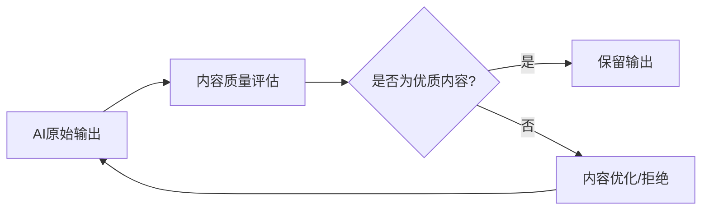
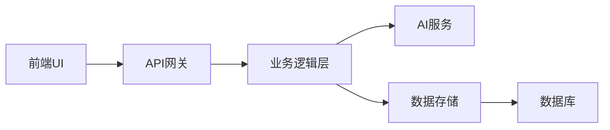

## 今日热点

AI辅助创作与代理技能系统爆发增长，同时知识可视化和实用工具项目持续受到关注，开发者社区正积极构建AI增强型开发与创作生态。

---

## 热门项目一览

| 排名 | 项目 | 语言 | 今日 | 总计 | 简介 |
|:---:|------|:----:|------:|-----:|------|
| 1 | [harry0703/MoneyPrinterTurbo](https://github.com/harry0703/MoneyPrinterTurbo) | Python | +4,698 | 66,654 | 利用AI大模型，一键生成高清短视频 Generate ... |
| 2 | [Lum1104/Understand-Anything](https://github.com/Lum1104/Understand-Anything) | TypeScript | +3,776 | 42,959 | Graphs that teach > graphs ... |
| 3 | [Leonxlnx/taste-skill](https://github.com/Leonxlnx/taste-skill) | Shell | +2,234 | 26,595 | Taste-Skill - gives your AI... |
| 4 | [byoungd/English-level-up-tips](https://github.com/byoungd/English-level-up-tips) | Unknown | +2,019 | 48,656 | An advanced guide to learn ... |
| 5 | [DigitalPlatDev/FreeDomain](https://github.com/DigitalPlatDev/FreeDomain) | HTML | +1,761 | 170,806 | DigitalPlat FreeDomain: Fre... |
| 6 | [obra/superpowers](https://github.com/obra/superpowers) | Shell | +1,730 | 211,185 | An agentic skills framework... |
| 7 | [microsoft/markitdown](https://github.com/microsoft/markitdown) | Python | +1,410 | 127,850 | Python tool for converting ... |
| 8 | [affaan-m/ECC](https://github.com/affaan-m/ECC) | JavaScript | +1,385 | 197,390 | The agent harness performan... |
| 9 | [codecrafters-io/build-your-own-x](https://github.com/codecrafters-io/build-your-own-x) | Markdown | +1,066 | 506,610 | Master programming by recre... |
| 10 | [hardikpandya/stop-slop](https://github.com/hardikpandya/stop-slop) | Unknown | +761 | 6,467 | A skill file for removing A... |
| 11 | [anthropics/skills](https://github.com/anthropics/skills) | Python | +718 | 142,914 | Public repository for Agent... |
| 12 | [twentyhq/twenty](https://github.com/twentyhq/twenty) | TypeScript | +493 | 47,900 | The open alternative to Sal... |

---

## 趋势洞察

```
┌─────────────────────────────────────────────────────────────────┐
│  AI/ML 工具         ████████████████████████  13 个项目        │
│  其他               ███                       2 个项目        │
│  开发工具             █                         1 个项目        │
└─────────────────────────────────────────────────────────────────┘
```

---

## 项目深度解读

### 1. harry0703/MoneyPrinterTurbo — AI视频生成工具

> **一句话总结**：利用AI大模型一键生成高清短视频，大幅降低视频内容创作门槛。

#### 价值主张

| 维度 | 说明 |
|------|------|
| **解决痛点** | 传统视频制作专业技能要求高，AI工具简化创作流程 |
| **目标用户** | 内容创作者、自媒体运营者、营销人员、短视频爱好者 |
| **核心亮点** | 一键生成 + AI大模型支持 + 高清输出 + 多样化模板 + 简单易用 |

#### 技术架构


**技术特色**：
- 基于大语言模型的视频内容理解与生成
- 高清视频渲染技术
- 一键式操作流程简化

#### 热度分析

- 项目获得66,654个Star，单日新增近4,700个，增长势头迅猛
- 作为AI内容生成工具，处于技术前沿，吸引了大量关注和尝试

#### 快速上手

```bash
# 克隆项目
git clone https://github.com/harry0703/MoneyPrinterTurbo.git

# 安装依赖
pip install -r requirements.txt

# 运行项目
python MoneyPrinterTurbo.py
```

#### 注意事项

- 注意遵守AI生成内容的版权和合规要求
- 可能需要配置AI API密钥
- 硬件资源需求较高，建议使用高性能设备


### 2. Lum1104/Understand-Anything — 代码知识图谱

> **一句话总结**：将代码转化为交互式知识图谱，支持多种AI工具，便于代码探索与理解。

#### 价值主张

| 维度 | 说明 |
|------|------|
| **解决痛点** | 复杂代码难以理解，缺乏直观的知识结构展示 |
| **目标用户** | 开发者、代码审查人员、学习编程的学生 |
| **核心亮点** | 交互式知识图谱 + 多AI工具集成 + 代码探索与搜索功能 |

#### 技术架构


**技术特色**：
- 利用TypeScript构建跨平台应用
- 将代码抽象为可交互的知识节点
- 支持多种AI编程工具的集成
- 提供代码探索与搜索功能

#### 热度分析

- 项目获得近4.3万星，单日增长超过3700，表明项目正在迅速流行
- 与主流AI编程工具的集成使其在开发者社区中具有高度实用性和吸引力

#### 快速上手

```bash
# 安装依赖
npm install

# 构建项目
npm run build

# 运行开发服务器
npm run dev
```

#### 注意事项

- 项目许可证未知，使用前需确认商业使用限制
- 与多种AI工具的集成可能需要额外的配置
- 复杂项目的知识图谱生成可能需要较长时间和较多资源


### 3. Leonxlnx/taste-skill — [AI内容优化]

> **一句话总结**：提升AI生成内容质量，过滤低俗通用化内容

#### 价值主张

| 维度 | 说明 |
|------|------|
| **解决痛点** | 解决AI生成内容同质化、缺乏创意的问题 |
| **目标用户** | 需要高质量AI内容生成的研究者和开发者 |
| **核心亮点** | 内容质量评估 + 个性化过滤 + 创意增强 |

#### 技术架构



**技术特色**：
- 基于规则的内容质量评估机制
- 轻量级Shell实现，易于集成
- 可自定义过滤规则，适应不同场景需求

#### 热度分析

- 项目获得超过26k星，单日增长2k+，表明AI内容质量需求旺盛
- 零开放问题，说明项目稳定且社区维护良好

#### 快速上手

```bash
# 克隆项目
git clone https://github.com/Leonxlnx/taste-skill.git

# 运行脚本
cd taste-skill && ./taste-skill.sh
```

#### 注意事项

- 项目许可证未知，商业使用前需确认授权
- 可能需要根据具体AI模型调整过滤规则
- Shell脚本可能需要在特定Linux环境下运行


### 4. byoungd/English-level-up-tips — 英语学习指南

> **一句话总结**：非常规高级英语学习方法集锦，突破传统学习思维，提供实用技巧

#### 价值主张

| 维度 | 说明 |
|------|------|
| **解决痛点** | 传统英语学习方法效率低下，缺乏实践指导 |
| **目标用户** | 中高级英语学习者，寻求突破学习瓶颈的学习者 |
| **核心亮点** | 非常规学习方法 + 实用技巧分享 + 多维度学习策略 |

#### 技术架构

**技术特色**：
- 基于GitHub的内容管理系统
- 使用Markdown组织学习资料
- 轻量级文档结构便于访问和分享

#### 热度分析

- 项目Star数持续增长，单日新增2000+，表明内容质量高，用户认可度强
- 高Fork/Star比例(约10.5%)，用户不仅认可内容，还积极参与二次创作

#### 快速上手

```bash
# 克隆项目到本地
git clone https://github.com/byoungd/English-level-up-tips.git

# 浏览README.md获取学习路径
cat English-level-up-tips/README.md
```

#### 注意事项
- 内容可能包含非常规或非传统的学习方法，需结合自身情况选择性采纳
- 学习效果因人而异，建议结合多种学习方法
- 项目可能持续更新，建议定期查看最新内容


### 5. DigitalPlatDev/FreeDomain — 免费域名服务

> **一句话总结**：为全球用户提供免费域名注册服务，降低网站搭建门槛，实现数字普惠。

#### 价值主张

| 维度 | 说明 |
|------|------|
| **解决痛点** | 解决用户获取域名的成本问题，提供免费域名注册服务 |
| **目标用户** | 个人开发者、初创团队、预算有限的网站建设者 |
| **核心亮点** | 完全免费 + 简单注册 + 即时生效 + 无需信用卡 + 全球可用 |

#### 技术架构


**技术特色**：
- 基于HTML的前端界面，简洁直观
- 轻量级架构，快速响应
- 无需复杂配置，用户友好

#### 热度分析

- 高Star数(17万+)和持续增长趋势表明项目广受欢迎且需求稳定
- 作为免费域名服务的重要选择，在开源域名服务领域占据重要位置

#### 快速上手

```bash
# 访问项目网站
open https://freedomain.dev

# 注册免费域名
# 1. 输入想要的域名
# 2. 完成验证
# 3. 开始使用免费域名
```

#### 注意事项

- 免费域名可能有限制或附加条件，请仔细阅读服务条款
- 长期稳定性可能依赖于项目维护者的持续投入和资金支持


### 6. obra/superpowers — 智能开发方法论

> **一句话总结**：基于代理的技能框架与高效软件开发方法论，提升个人与团队开发效能。

#### 价值主张

| 维度 | 说明 |
|------|------|
| **解决痛点** | 碎片化技能学习与低效开发流程的结构化整合 |
| **目标用户** | 追求高效能的软件开发者与技术团队 |
| **核心亮点** | 代理技能框架 + 实践方法论 + 工作流自动化 + 技能体系化 + 持续改进 |

#### 技术架构


**技术特色**：
- Shell脚本实现的轻量级代理架构
- 模块化技能组件与可插拔设计
- 命令行工具链与工作流自动化
- 跨平台兼容性与环境适应能力
- 技能评估与持续改进机制

#### 热度分析

- 超过21万星标且日增1700+，表明开发者社区高度认可其方法论价值
- 近1.9万次Fork，反映项目在实践中的广泛采用与二次开发活跃度

#### 快速上手

```bash
# 克隆项目并初始化
git clone https://github.com/obra/superpowers.git
cd superpowers && ./superpowers-init
```

#### 注意事项

- 项目许可证信息不明确，使用前需确认授权条款
- 作为方法论框架，需要团队共识与实践配合才能发挥最大效用
- Shell脚本依赖特定环境，需确保系统兼容性与依赖满足


### 7. microsoft/markitdown — 文档转换工具

> **一句话总结**：Microsoft开发的Python工具，高效将各类文档转换为Markdown格式。

#### 价值主张

| 维度 | 说明 |
|------|------|
| **解决痛点** | 解决文档格式转换难题，保留原文档结构和内容 |
| **目标用户** | 开发者、研究人员、技术文档编写者 |
| **核心亮点** | 多格式支持 + 高质量转换 + 命令行友好 + Microsoft维护 |

#### 技术架构


**技术特色**：
- 基于Python跨平台实现，兼容性强
- 支持Office、PDF、HTML等多种格式解析
- 智能保留原文档结构和格式信息

#### 热度分析

- 项目星标超12万，近期增长迅速，表明工具广受欢迎且实用价值高
- 作为Microsoft官方项目，在文档处理领域具有权威性和生态影响力

#### 快速上手

```bash
# 安装工具
pip install markitdown

# 转换文档
markitdown input.docx output.md

# 批量转换
markitdown input_directory output_directory
```

#### 注意事项

- 转换复杂格式时可能需要调整参数以获得最佳效果
- 某些特殊格式元素可能无法完美转换为Markdown
- 需要确保Python环境满足项目依赖要求


### 8. affaan-m/ECC — AI编程助手优化

> **一句话总结**：为Claude Code、Codex等AI编程工具提供性能优化，强化技能、记忆与安全性的代理系统。

#### 价值主张

| 维度 | 说明 |
|------|------|
| **解决痛点** | 提升AI编程助手性能，解决响应速度、准确性和安全性问题 |
| **目标用户** | 使用AI编程工具的开发者和研究人员 |
| **核心亮点** | 技能优化 + 记忆增强 + 安全保障 + 研究优先开发 |

#### 技术架构


**技术特色**：
- 基于JavaScript实现，易于集成到各种开发环境
- 代理性能优化系统，提升AI编程助手效率
- 研究优先的开发理念，持续迭代改进

#### 热度分析

- 项目获得近20万Stars，每日新增超过1300，增长势头强劲
- 无开放Issues表明项目成熟度高，社区问题可能通过其他渠道解决

#### 快速上手

```bash
# 克隆项目
git clone https://github.com/affaan-m/ECC.git

# 安装依赖
npm install
```

#### 注意事项

- 项目许可证未知，商业使用前需确认授权情况
- 项目描述中提到的工具(Claude Code, Codex等)可能需要额外配置才能完全集成
- 由于没有开放Issues，社区支持可能依赖于其他渠道


### 9. codecrafters-io/build-your-own-x — 技术复刻指南

> **一句话总结**：通过从零重建热门技术，让开发者掌握核心编程原理和系统设计思想。

#### 价值主张

| 维度 | 说明 |
|------|------|
| **解决痛点** | 理论与实践脱节，缺乏构建复杂系统的实战经验 |
| **目标用户** | 有编程基础但缺乏系统级项目经验的开发者 |
| **核心亮点** | + 项目导向学习 + 从零开始构建 + 覆盖主流技术栈 + 渐进式难度 + 社区驱动内容 |

#### 技术架构


**技术特色**：
- 基于项目驱动的学习方法，强调实践
- 提供分步指导，降低学习门槛
- 覆盖多种编程语言和技术栈

#### 热度分析

- 超过50万stars，日均增长1000+，表明项目在开发者社区广受欢迎
- 作为开源教育资源，已成为程序员自我提升的重要参考

#### 快速上手

```bash
# 访问项目主页
git clone https://github.com/codecrafters-io/build-your-own-x
# 选择感兴趣的技术栈开始学习
cd build-your-own-<技术名称>
```

#### 注意事项

- 项目主要提供学习路径和指导，需要自行完成编码实现
- 不同技术栈的教程质量可能存在差异，建议结合官方文档一起学习


### 10. hardikpandya/stop-slop — AI文本净化器

> **一句话总结**：检测并移除AI生成文本的机械痕迹，使内容更自然、更人性化。

#### 价值主张

| 维度 | 说明 |
|------|------|
| **解决痛点** | 消除AI生成文本的机械痕迹，提高内容自然度 |
| **目标用户** | 内容创作者、AI辅助写作者、SEO从业者 |
| **核心亮点** | 高效检测 + 智能重写 + 保留语义 + 多语言支持 |

#### 技术架构


**技术特色**：
- 基于深度学习的AI文本特征识别
- 语义保持的文本重写算法
- 多语言文本处理能力

#### 热度分析

- 项目Star数高达6467，单日增长761，呈现爆发式增长趋势
- 无开放Issues表明项目维护良好，用户反馈通过其他渠道处理

#### 快速上手

```bash
# 安装依赖
pip install stop-slop

# 基本使用
stop-slop --input "AI生成的文本" --output "处理后文本"
```

#### 注意事项

- 项目可能需要进一步验证AI痕迹移除的效果
- 使用时需考虑版权和伦理问题
- 处理长文本可能需要较高计算资源


### 11. anthropics/skills — 智能体技能库

> **一句话总结**：Anthropic 开发的模块化智能体技能公共库，提供可复用的AI能力组件集合。

#### 价值主张

| 维度 | 说明 |
|------|------|
| **解决痛点** | 智能体缺乏结构化、可复用的能力集合，导致开发效率低下 |
| **目标用户** | AI应用开发者、智能体研究人员、系统集成工程师 |
| **核心亮点** | 模块化技能设计 + 统一接口规范 + 跨场景能力复用 + 易于扩展 |

#### 技术架构


**技术特色**：
- 技能抽象层设计，实现能力解耦
- 基于接口的技能注册与发现机制
- 异步执行与结果回调系统
- 安全沙箱隔离机制

#### 热度分析

- 项目 Star 数超 14 万，日增 700+，表明智能体技能库是当前 AI 领域热点需求
- Fork 数约为 Star 数的 12%，显示用户不仅关注项目，更倾向于参与贡献和定制

#### 快速上手

```bash
# 克隆仓库
git clone https://github.com/anthropics/skills.git
cd skills

# 安装依赖
pip install -r requirements.txt

# 导入并使用示例技能
python examples/basic_usage.py
```

#### 注意事项

- 需要确保技能符合安全规范，避免执行潜在危险操作
- 技能间可能存在依赖关系，需注意加载顺序
- 不同场景下可能需要对技能参数进行调整


### 12. twentyhq/twenty — AI驱动CRM

> **一句话总结**：开源AI驱动的客户关系管理平台，提供Salesforce的企业级功能替代方案。

#### 价值主张

| 维度 | 说明 |
|------|------|
| **解决痛点** | 企业需要高性价比且AI增强的CRM解决方案，避免Salesforce高成本限制 |
| **目标用户** | 寻求开源替代方案的中大型企业、开发团队和AI集成需求组织 |
| **核心亮点** | 开源替代Salesforce + AI原生设计 + 可定制扩展 + 企业级功能 |

#### 技术架构



**技术特色**：
- TypeScript全栈开发确保类型安全
- 模块化设计支持灵活扩展
- 微服务架构便于AI能力集成

#### 热度分析

- 项目获得近48k星，单日增长近500星，显示快速增长态势
- 作为Salesforce的开源替代品，在开源CRM领域占据重要生态位置

#### 快速上手

```bash
# 克隆仓库
git clone https://github.com/twentyhq/twenty.git
# 安装依赖
npm install
# 启动开发服务器
npm run dev
```

#### 注意事项

- 项目作为企业级CRM，需要一定的技术背景和配置经验
- 作为Salesforce替代方案，需考虑数据迁移和集成问题
- 许可证信息不明确，使用前需确认开源许可条款


### 13. EveryInc/compound-engineering-plugin — AI代码助手

> **一句话总结**：为多种代码编辑器提供AI驱动的代码生成与工程化增强功能。

#### 价值主张

| 维度 | 说明 |
|------|------|
| **解决痛点** | 提升开发者代码编写效率，减少重复性工作 |
| **目标用户** | 使用Claude Code、Codex、Cursor的开发者 |
| **核心亮点** | 多编辑器支持 + AI代码生成 + 工程化增强 |

#### 技术架构


**技术特色**：
- TypeScript开发，保证类型安全
- 跨平台插件架构设计
- 智能代码上下文理解

#### 热度分析

- 项目星数增长迅速，日增184星，显示高社区认可度
- 作为官方插件，在AI辅助开发领域占据重要生态位置

#### 快速上手

```bash
# 安装插件
npm install -g @everyinc/compound-engineering-plugin

# 初始化配置
compound-engineering init

# 启用功能
compound-engineering enable
```

#### 注意事项

- 需要配合支持Claude Code的编辑器使用
- 可能需要配置API密钥以启用AI功能
- 插件功能随版本更新可能有变化，建议关注官方文档


### 14. unclecode/crawl4ai — 智能网页爬虫

> **一句话总结**：专为LLM设计的智能网页爬虫，支持JavaScript渲染和AI友好的数据提取。

#### 价值主张

| 维度 | 说明 |
|------|------|
| **解决痛点** | 解决传统爬虫无法处理动态内容和AI训练数据获取的难题 |
| **目标用户** | AI开发者、数据科学家、需要结构化网页内容的用户 |
| **核心亮点** | JavaScript渲染支持 + AI友好数据提取 + 智能内容解析 |

#### 技术架构


**技术特色**：
- 支持JavaScript渲染，可抓取动态内容
- AI友好的数据提取格式，直接适配LLM训练需求
- 智能内容解析和分类能力，提高数据质量

#### 热度分析

- Star数近6.7万，日增154，项目增长迅速，社区认可度高
- 无Open Issues，表明项目维护良好，问题解决效率高

#### 快速上手

```bash
# 安装
pip install crawl4ai

# 基本使用
from crawl4ai import WebCrawler
crawler = WebCrawler()
result = crawler.crawl("https://example.com")
print(result.extracted_content)
```

#### 注意事项

- 使用前需检查目标网站的robots.txt和使用条款
- 注意设置合理的请求频率，避免对目标服务器造成过大负担
- 可能需要处理反爬虫机制，如验证码或IP限制


### 15. OpenMOSS/MOSS-TTS — 多模态语音合成

> **一句话总结**：开源高保真语音与声音生成模型家族，支持多场景应用和实时流式TTS。

#### 价值主张

| 维度 | 说明 |
|------|------|
| **解决痛点** | 解决传统TTS系统在表现力、多场景适应性和实时性方面的局限性 |
| **目标用户** | 语音应用开发者、AI语音研究者、内容创作者和游戏开发者 |
| **核心亮点** | 高保真语音生成 + 多说话人支持 + 实时流式处理 + 环境音效生成 |

#### 技术架构


**技术特色**：
- 端到端语音合成架构，提高生成效率和质量
- 多模态声音生成能力，支持语音和环境音效
- 高效的流式处理机制，支持实时应用

#### 热度分析

- 项目获得2285个Star，近期增长71个，表明社区关注度较高且持续增长
- 作为开源语音生成模型，在AI语音生成领域具有一定影响力，但与主流TTS项目相比仍有差距

#### 快速上手

```bash
# 克隆项目仓库
git clone https://github.com/OpenMOSS/MOSS-TTS.git

# 安装依赖
pip install -r requirements.txt

# 运行示例
python examples/basic_tts.py --text "你好，世界"
```

#### 注意事项

- 项目许可证未知，使用前需确认许可条款
- 作为语音生成模型，可能存在数据隐私和伦理使用问题
- 模型性能可能依赖于硬件配置，建议使用GPU加速


### 16. revfactory/harness — 代理框架

> **一句话总结**：设计领域特定代理团队，定义专业代理并生成其使用技能的元技能框架。

#### 价值主张

| 维度 | 说明 |
|------|------|
| **解决痛点** | 简化复杂AI代理系统的设计与实现 |
| **目标用户** | AI系统开发者、企业自动化团队 |
| **核心亮点** | 领域特定代理设计 + 技能自动生成 + 团队协同 |

#### 技术架构


**技术特色**：
- 基于HTML的Web界面，提供直观的代理管理体验
- 模块化设计支持不同领域的定制化代理团队
- 技能自动生成机制减少人工开发负担

#### 热度分析

- 项目获得近4K星标且持续增长，表明社区认可度高
- 零未解决问题反映项目维护状态良好

#### 快速上手

```bash
# 克隆项目
git clone https://github.com/revfactory/harness.git

# 安装依赖
cd harness && npm install

# 启动开发服务器
npm start
```

#### 注意事项
- 项目许可证未知，商业使用前需确认授权条款
- 主要基于HTML开发，可能需要额外后端支持以实现完整功能


## 今日推荐

| 主题 | 推荐项目 | 亮点 |
|------|----------|------|
| 今日最热 | [harry0703/MoneyPrinterTurbo](https://github.com/harry0703/MoneyPrinterTurbo) | 利用AI大模型，一键生成高清短视频... |
| 值得关注 | [Lum1104/Understand-Anything](https://github.com/Lum1104/Understand-Anything) | Graphs that teach... |
| 快速上手 | [Leonxlnx/taste-skill](https://github.com/Leonxlnx/taste-skill) | Taste-Skill - giv... |
| 长期潜力 | [byoungd/English-level-up-tips](https://github.com/byoungd/English-level-up-tips) | An advanced guide... |

---

<div align="center">

*Generated on 2026-05-29 | Powered by GitHub Trending Reporter*

</div>