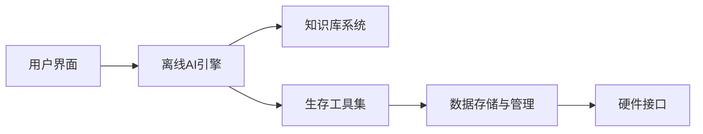

## 今日热点

AI工具与应用爆发式增长，特别是内容生成、编程辅助和质量提升工具获得大量关注，企业级AI原生解决方案和实用工具开源化成为明显趋势。

---

## 热门项目一览

| 排名 | 项目 | 语言 | 今日 | 总计 | 简介 |
|:---:|------|:----:|------:|-----:|------|
| 1 | [harry0703/MoneyPrinterTurbo](https://github.com/harry0703/MoneyPrinterTurbo) | Python | +3,567 | 69,783 | 利用AI大模型，一键生成高清短视频 Generate ... |
| 2 | [Leonxlnx/taste-skill](https://github.com/Leonxlnx/taste-skill) | Shell | +2,062 | 28,194 | Taste-Skill - gives your AI... |
| 3 | [microsoft/markitdown](https://github.com/microsoft/markitdown) | Python | +1,873 | 130,047 | Python tool for converting ... |
| 4 | [byoungd/English-level-up-tips](https://github.com/byoungd/English-level-up-tips) | Unknown | +1,566 | 49,666 | An advanced guide to learn ... |
| 5 | [affaan-m/ECC](https://github.com/affaan-m/ECC) | JavaScript | +1,406 | 198,610 | The agent harness performan... |
| 6 | [DigitalPlatDev/FreeDomain](https://github.com/DigitalPlatDev/FreeDomain) | HTML | +1,313 | 171,842 | DigitalPlat FreeDomain: Fre... |
| 7 | [codecrafters-io/build-your-own-x](https://github.com/codecrafters-io/build-your-own-x) | Markdown | +866 | 507,395 | Master programming by recre... |
| 8 | [run-llama/liteparse](https://github.com/run-llama/liteparse) | Rust | +701 | 7,357 | A fast, helpful, and open-s... |
| 9 | [hardikpandya/stop-slop](https://github.com/hardikpandya/stop-slop) | Unknown | +617 | 7,025 | A skill file for removing A... |
| 10 | [twentyhq/twenty](https://github.com/twentyhq/twenty) | TypeScript | +578 | 48,428 | The open alternative to Sal... |
| 11 | [anthropics/claude-code](https://github.com/anthropics/claude-code) | Python | +395 | 127,904 | Claude Code is an agentic c... |
| 12 | [galilai-group/stable-worldmodel](https://github.com/galilai-group/stable-worldmodel) | Python | +362 | 1,262 | A platform for reproducible... |

---

## 趋势洞察

```
┌─────────────────────────────────────────────────────────────────┐
│  AI/ML 工具         ████████████████████████  10 个项目        │
│  其他               ████████████              5 个项目        │
│  多媒体应用            ██                        1 个项目        │
│  开发工具             ██                        1 个项目        │
└─────────────────────────────────────────────────────────────────┘
```

---

## 项目深度解读

### 1. harry0703/MoneyPrinterTurbo — AI视频生成工具

> **一句话总结**：利用AI大模型一键生成高清短视频，大幅降低视频创作门槛。

#### 价值主张

| 维度 | 说明 |
|------|------|
| **解决痛点** | 解决短视频创作技术门槛高、耗时长的痛点 |
| **目标用户** | 内容创作者、自媒体运营者、营销人员 |
| **核心亮点** | 一键生成 + AI驱动 + 高清质量 + 操作简单 |

#### 技术架构


**技术特色**：
- 基于最新AI大模型，支持自然语言生成视频内容
- 多模态融合技术，结合文本、图像和视频生成
- 高效的渲染引擎，确保输出高清视频质量

#### 热度分析

- 项目短期内获得大量关注，单日增长超3500 stars，表明市场需求强烈
- 虽无开源许可证，但社区活跃度高，fork数量超过1万，显示开发者参与度高

#### 快速上手

```bash
# 安装依赖
pip install -r requirements.txt

# 运行项目
python money_printer_turbo.py --prompt "描述你想生成的视频内容"
```

#### 注意事项

- 需要注意AI生成内容的版权问题
- 可能需要高性能硬件支持以确保流畅运行
- AI生成的视频质量可能存在不稳定性


### 2. Leonxlnx/taste-skill — AI内容优化

> **一句话总结**：通过Shell脚本提升AI输出质量，过滤无聊、通用内容，增强AI生成内容的独特性和价值。

#### 价值主张

| 维度 | 说明 |
|------|------|
| **解决痛点** | 解决AI生成内容同质化、缺乏创意的问题 |
| **目标用户** | AI开发者、内容创作者、研究人员 |
| **核心亮点** | 内容过滤算法 + 价值评估 + 个性化定制 |

#### 技术架构


**技术特色**：
- 基于Shell的轻量级实现
- 高效的内容质量评估机制
- 可配置的过滤标准

#### 热度分析

- 项目近期Star激增，显示社区高度认可其解决AI内容质量问题的价值
- 在AI工具生态中占据独特位置，专注于内容质量而非功能扩展

#### 快速上手

```bash
# 克隆项目
git clone https://github.com/Leonxlnx/taste-skill.git
# 运行脚本
cd taste-skill && chmod +x taste.sh && ./taste.sh
```

#### 注意事项

- 项目许可证不明确，商业使用需谨慎
- 可能需要根据具体AI模型调整参数以获得最佳效果


### 3. microsoft/markitdown — 文档转换工具

> **一句话总结**：Python工具可将各类文件和Office文档转换为Markdown格式，简化文档处理流程。

#### 价值主张

| 维度 | 说明 |
|------|------|
| **解决痛点** | 解决不同格式文档统一转换为Markdown的需求，便于跨平台文档处理 |
| **目标用户** | 需要处理多种文档格式的开发者、研究人员和内容创作者 |
| **核心亮点** | 支持多种格式转换 + 保留原始格式信息 + 智能内容提取 |

#### 技术架构


**技术特色**：
- 支持多种文档格式解析
- 智能保留原始文档结构
- 高效的内容提取算法

#### 热度分析

- 项目获得13万+ stars，近期增长迅速，表明其在文档处理领域受到高度关注
- 作为微软开源项目，在开发者社区中具有重要影响力，成为文档处理标准工具之一

#### 快速上手

```bash
# 安装
pip install markitdown

# 使用
markitdown input.docx output.md
```

#### 注意事项

- 项目可能对某些复杂格式的支持有限
- 转换大型文档时可能需要较多内存资源
- 许可证信息不明确，使用前需确认授权条款


### 4. byoungd/English-level-up-tips — 英语学习指南

> **一句话总结**：一份系统化的英语学习进阶指南，提供实用技巧和方法，帮助学习者突破语言能力瓶颈。

#### 价值主张

| 维度 | 说明 |
|------|------|
| **解决痛点** | 英语学习方法零散，缺乏系统化指导和实用技巧 |
| **目标用户** | 中高级英语学习者，希望突破学习瓶颈的学习者 |
| **核心亮点** | 系统化学习路径 + 实用技巧整合 + 进阶方法论 + 多维资源 + 实践建议 |

#### 技术架构


**技术特色**：
- 结构化学习路径设计
- 多维度学习资源整合
- 实践与理论相结合的方法论

#### 热度分析

- 项目获得近5万星，近期单日增长超1500，表明内容质量高且需求旺盛
- Fork数与Star数比例约10.5%，说明用户不仅关注内容，也愿意贡献和二次创作

#### 快速上手

```bash
# 克隆项目
git clone https://github.com/byoungd/English-level-up-tips.git

# 查看README
cat English-level-up-tips/README.md
```

#### 注意事项

- 项目内容需要一定英语基础，不适合完全初学者
- 学习效果取决于个人实践程度，仅阅读指南无法提升实际能力
- 建议结合实际使用场景进行练习，而非单纯记忆知识点


### 5. affaan-m/ECC — AI代码优化系统

> **一句话总结**：专为AI代码助手设计的性能优化系统，提升开发效率与安全性。

#### 价值主张

| 维度 | 说明 |
|------|------|
| **解决痛点** | AI代码助手性能低下、安全性不足、缺乏系统化优化 |
| **目标用户** | AI辅助开发者、代码工具使用者、研究型开发者 |
| **核心亮点** | 技能优化 + 本能增强 + 记忆管理 + 安全保障 + 研究优先 |

#### 技术架构


**技术特色**：
- 基于JavaScript的轻量级优化引擎
- 多维度性能提升策略
- 安全性优先的设计理念

#### 热度分析

- 项目获得近20万星，近期增长迅猛，日均增长超过1400星
- 社区活跃度高，Fork数量庞大，表明开发者社区广泛认可

#### 快速上手

```bash
# 克隆仓库
git clone https://github.com/affaan-m/ECC.git

# 安装依赖
npm install
```

#### 注意事项

- 项目许可证信息不明确，使用前需确认授权条款
- 缺乏详细的文档和示例代码，可能需要自行探索
- 项目状态信息显示Open Issues为0，可能表示项目已成熟或问题管理方式特殊


### 6. DigitalPlatDev/FreeDomain — 免费域名服务

> **一句话总结**：为全球用户提供免费域名服务，降低互联网接入门槛，促进数字平等

#### 价值主张

| 维度 | 说明 |
|------|------|
| **解决痛点** | 解决用户获取域名的成本问题，提供免费互联网身份标识 |
| **目标用户** | 资源有限但需要网络身份的个人开发者和小型项目 |
| **核心亮点** | 完全免费 + 简单注册 + 即时生效 + 无广告干扰 |

#### 技术架构


**技术特色**：
- 基于HTML构建的轻量级前端界面
- 集成第三方域名注册API实现自动化服务
- 用户友好的域名管理系统与配置界面

#### 热度分析

- 项目获得17万+ Star，近期新增1,300+，显示强劲增长势头
- 无开放Issues，表明项目维护良好，用户问题得到及时解决

#### 快速上手

```bash
# 访问项目网站
# 注册账号并选择想要的域名
# 按照指引完成域名设置
```

#### 注意事项

- 项目许可证未知，使用前需确认授权条款
- 免费域名可能存在续费限制或使用条件
- 建议仔细阅读服务条款，了解域名所有权和使用政策


### 7. codecrafters-io/build-your-own-x — 技术重建指南

> **一句话总结**：通过亲手重建热门技术，提供理论与实践结合的深度编程学习体验。

#### 价值主张

| 维度 | 说明 |
|------|------|
| **解决痛点** | 解决编程学习只停留在表面，无法深入理解技术本质的问题 |
| **目标用户** | 有一定基础，渴望深入理解技术原理的中高级开发者 |
| **核心亮点** | + 实战导向 + 逆向思维 + 技术深度 + 资源丰富 + 渐进式难度 |

#### 技术架构


**技术特色**：
- 多技术领域覆盖，从基础工具到复杂系统
- 每个项目提供明确的里程碑和检查点
- 结合理论与实践，强调动手能力培养

#### 热度分析

- 超过50万Star且持续稳定增长，表明项目在开发者社区具有极高认可度和实用价值
- Fork数量接近5万，显示社区活跃度高，参与者众多，形成良性学习生态

#### 快速上手

```bash
# 克隆项目到本地
git clone https://github.com/codecrafters-io/build-your-own-x.git

# 浏览可用项目并选择一个开始
cd build-your-own-x && ls
```

#### 注意事项

- 项目本身不包含完整代码实现，而是提供重建思路和指南
- 需要用户具备一定的基础编程能力才能完成重建实践
- 不同技术项目的难度和复杂度差异较大，建议从简单项目开始


### 8. run-llama/liteparse — 高效文档解析

> **一句话总结**：基于 Rust 开发的高速开源文档解析工具，提供高效、可靠的文本内容提取能力。

#### 价值主张

| 维度 | 说明 |
|------|------|
| **解决痛点** | 解决文档解析效率低、速度慢的技术难题 |
| **目标用户** | 需要高效处理大量文本数据的开发者和研究人员 |
| **核心亮点** | 高性能解析引擎 + 多格式支持 + 低内存占用 + Rust安全保证 |

#### 技术架构


**技术特色**：
- 基于Rust的高性能内存安全实现
- 支持多种文档格式的统一解析接口
- 零拷贝设计提升处理效率

#### 热度分析

- 项目获得7357星，单日增长701星，表明社区认可度极高
- 作为文档解析领域的后起之秀，正快速获得开发者关注

#### 快速上手

```bash
# 安装liteparse
cargo install liteparse

# 使用liteparse解析文档
liteparse input.pdf --output output.json
```

#### 注意事项

- 项目可能仍在快速发展中，API可能会有变动
- 建议关注项目的官方文档获取最新使用指南


### 9. hardikpandya/stop-slop — AI文本净化工具

> **一句话总结**：智能识别并移除AI生成文本中的特征性表达，使文本更接近人类自然写作风格。

#### 价值主张

| 维度 | 说明 |
|------|------|
| **解决痛点** | 消除AI生成文本中的机械感和可识别特征，提高文本自然度 |
| **目标用户** | 内容创作者、AI辅助写作者、文本处理开发者 |
| **核心亮点** | 精准识别AI特征 + 保留原意 + 简单易用 |

#### 技术架构


**技术特色**：
- 基于模式识别的AI特征检测
- 保持原文语义的同时优化表达
- 轻量级实现，易于集成

#### 热度分析

- 项目近期获得大量关注，今日Star数增加617，显示用户需求旺盛
- 虽然没有公开Issues，但高Fork数表明开发者社区对其技术实现感兴趣

#### 快速上手

```bash
# 假设使用方式（需要验证）
pip install stop-slop
stop-slop input.txt output.txt
```

#### 注意事项

- 项目可能无法完全消除所有AI特征，效果取决于AI模型的生成特性
- 处理后的文本可能需要人工校对以确保语义准确
- 项目开源协议未知，商业使用前需确认授权情况


### 10. twentyhq/twenty — AI驱动的CRM平台

> **一句话总结**：开源AI驱动的CRM平台，提供Salesforce的开放替代方案，强调智能化客户管理。

#### 价值主张

| 维度 | 说明 |
|------|------|
| **解决痛点** | 企业对昂贵封闭CRM系统的依赖，提供开放、可定制的AI增强型客户关系管理 |
| **目标用户** | 中小型企业、寻求替代Salesforce的技术团队、开源CRM采用者 |
| **核心亮点** | 开源替代方案 + AI增强功能 + 模块化架构 + 自定义能力 + 云原生部署 |

#### 技术架构


**技术特色**：
- 基于TypeScript的全栈开发架构
- AI增强的客户数据处理与分析
- 开源可扩展的模块化设计
- 云原生部署支持多环境

#### 热度分析

- 项目Star数已达48,428，近期增长迅速(+578 today)，表明市场高度认可开源CRM替代方案的价值
- 作为Salesforce的开源竞品，在开源CRM领域占据重要生态位置，社区参与度持续攀升

#### 快速上手

```bash
# 克隆仓库
git clone https://github.com/twentyhq/twenty.git

# 安装依赖
npm install

# 启动开发服务器
npm run dev
```

#### 注意事项

- 项目许可证未知，商业使用前需确认授权条款
- 作为新兴项目，生产环境使用前应充分评估稳定性
- 可能需要考虑与现有系统的集成复杂度和迁移成本


### 11. anthropics/claude-code — AI编码助手

> **一句话总结**：终端内AI编码助手，理解代码库，通过自然语言执行编程任务并解释代码。

#### 价值主张

| 维度 | 说明 |
|------|------|
| **解决痛点** | 开发者日常编码中重复性任务多，代码理解成本高，缺乏智能辅助工具 |
| **目标用户** | 专业开发者、软件工程师、需要高效编码的程序员 |
| **核心亮点** | 自然语言编程命令 + 代码库理解与智能分析 + 自动化Git工作流 + 终端内集成体验 + 复杂代码解释功能 |

#### 技术架构


**技术特色**：
- 基于Anthropic Claude大语言模型的代码理解能力
- 终端直接集成的轻量级架构设计
- 代码库语义分析与智能索引机制

#### 热度分析

- 项目获得超过12万Star，日均增长近400，表明开发者社区对其高度认可
- Fork数量适中，显示项目活跃度良好，但可能处于早期阶段，社区贡献尚未大规模展开

#### 快速上手

```bash
# 安装Claude Code
pip install claude-code

# 初始化项目
claude-code init

# 启动交互式编码助手
claude-code
```

#### 注意事项

- 项目License未知，需注意商业使用限制
- 作为AI辅助工具，代码生成可能需要人工审核
- 终端工具可能需要一定的环境配置
- 项目可能需要Anthropic API密钥才能使用AI功能


### 12. galilai-group/stable-worldmodel — 世界模型研究平台

> **一句话总结**：提供可重现的世界模型研究平台，支持标准化评估和实验复现

#### 价值主张

| 维度 | 说明 |
|------|------|
| **解决痛点** | 解决世界模型研究难以复现、评估标准不一的问题 |
| **目标用户** | AI研究人员、世界模型研究者、强化学习科学家 |
| **核心亮点** | 可重现性实验框架 + 标准化评估指标 + 多模型比较平台 + 开源协作环境 |

#### 技术架构


**技术特色**：
- 基于配置驱动的可重现实验流程
- 支持多种世界模型架构的统一评估
- 提供标准化的基准测试和比较工具

#### 热度分析

- 项目近期热度显著增长，单日Star增加362，表明研究社区高度关注
- 作为新兴研究方向，项目尚未形成大规模社区，但已吸引专业领域关注

#### 快速上手

```bash
git clone https://github.com/galilai-group/stable-worldmodel.git
cd stable-worldmodel
pip install -r requirements.txt
```

#### 注意事项

- 项目目前缺少明确的许可证信息，使用时需注意版权问题
- 部分依赖可能需要特定环境配置，建议使用官方提供的Docker镜像


### 13. EveryInc/compound-engineering-plugin — AI编程助手

> **一句话总结**：官方工程化插件，为Claude Code、Codex、Cursor等AI编程工具提供增强功能。

#### 价值主张

| 维度 | 说明 |
|------|------|
| **解决痛点** | 整合AI编程工具与开发环境，提供无缝的智能编码体验 |
| **目标用户** | 使用Claude Code、Codex、Cursor等AI编程工具的开发者 |
| **核心亮点** | 官方支持 + 多平台兼容 + 工程化集成 + 智能代码辅助 |

#### 技术架构


**技术特色**：
- 基于TypeScript开发，确保类型安全
- 提供多平台兼容性，支持主流AI编程工具
- 工程化集成，提供完整的开发体验

#### 热度分析

- 项目获得超1.8万Star且持续增长，表明其获得开发者广泛认可
- 零OpenIssues反映项目维护良好，用户反馈及时处理

#### 快速上手

```bash
# 在Cursor中安装Compound插件
# 打开Cursor，进入扩展市场搜索"Compound"
# 点击安装并重启IDE即可使用
```

#### 注意事项

- 需要配合Claude Code、Codex或Cursor等AI编程工具使用
- 插件可能需要特定的API密钥或配置才能正常工作


### 14. Crosstalk-Solutions/project-nomad — 离线生存系统

> **一句话总结**：全功能离线生存计算机，集成AI与关键工具，为极端环境提供信息与生存支持。

#### 价值主张

| 维度 | 说明 |
|------|------|
| **解决痛点** | 在无网络极端环境中提供关键信息与生存工具支持 |
| **目标用户** | 户外探险者、应急响应人员、生存准备者 |
| **核心亮点** | 离线AI助手 + 生存工具集 + 知识库 + 应急通讯 + 能源管理 |

#### 技术架构



**技术特色**：
- 基于TypeScript的全栈开发，确保跨平台兼容性
- 轻量级AI模型，适合离线运行环境
- 模块化设计，便于功能扩展与维护

#### 热度分析

- 高关注度项目，近期增长稳定，表明离线生存工具需求旺盛
- 生存技术领域的重要项目，在应急准备社区有显著影响力

#### 快速上手

```bash
# 克隆仓库
git clone https://github.com/Crosstalk-Solutions/project-nomad.git

# 安装依赖
npm install

# 构建项目
npm run build
```

#### 注意事项

- 项目可能需要特定硬件环境才能完全发挥功能
- 离线AI模型的准确性与在线版本相比可能有限


### 15. DataTalksClub/data-engineering-zoomcamp — 数据工程训练营

> **一句话总结**：免费9周数据工程训练营，专注构建生产级数据管道，培养实用数据工程技能。

#### 价值主张

| 维度 | 说明 |
|------|------|
| **解决痛点** | 数据工程理论与实践脱节，缺乏系统化实战培训 |
| **目标用户** | 数据工程师、数据分析师、数据科学家初学者 |
| **核心亮点** | + 免费高质量课程 + 实战项目导向 + 社区支持 + 更新及时 |

#### 技术架构


**技术特色**：
- 基于Jupyter Notebook的交互式学习体验
- 涵盖从基础到高级的完整数据工程知识体系
- 结合实际案例和项目，强化实践能力

#### 热度分析

- 项目Star数超过4万，每日新增约160个Star，增长势头强劲
- 社区活跃度高，Fork数接近8.3千，表明学习者众多且积极参与

#### 快速上手

```bash
# 克隆项目仓库
git clone https://github.com/DataTalksClub/data-engineering-zoomcamp.git

# 进入项目目录
cd data-engineering-zoomcamp
```

#### 注意事项

- 课程内容基于2026年1月的新一期，可能需要关注更新
- 部分实践环节可能需要额外配置环境，建议仔细阅读README
- 课程为英文，需要一定的英语阅读能力


### 16. cursor/plugins — AI插件生态

> **一句话总结**：提供 Cursor 编辑器的插件规范和官方插件库，扩展 AI 编程辅助能力。

#### 价值主张

| 维度 | 说明 |
|------|------|
| **解决痛点** | 为 Cursor 编辑器提供标准化插件开发规范，扩展 AI 编程辅助能力 |
| **目标用户** | Cursor 编辑器用户和 AI 辅助编程开发者 |
| **核心亮点** | 标准化插件接口 + AI 功能扩展 + 官方插件支持 |

#### 技术架构


**技术特色**：
- 基于 TypeScript 的类型安全插件开发规范
- 模块化架构设计，便于功能扩展
- 深度集成 AI 编程辅助能力

#### 热度分析

- 项目 Star 数 1,309 且近期增长迅速（+134 today），表明 Cursor 编辑器及其插件生态备受关注
- 作为官方插件库，处于 Cursor 生态系统的核心位置，对编辑器功能扩展至关重要

#### 快速上手

```bash
# 克隆插件仓库
git clone https://github.com/cursor/plugins.git
# 安装依赖
npm install
# 参考 README 文档开发插件
```

#### 注意事项

- 项目许可证信息未知，使用前需确认授权条款
- 需要安装 Cursor 编辑器才能使用这些插件
- 插件开发可能需要 Cursor 特有的 AI 集成知识


### 17. Biohub/esm — 生物序列模型

> **一句话总结**：基于深度学习的蛋白质语言模型，用于蛋白质结构与功能预测。

#### 价值主张

| 维度 | 说明 |
|------|------|
| **解决痛点** | 解决蛋白质序列分析与结构预测的计算复杂性挑战 |
| **目标用户** | 生物信息学家、结构生物学家、药物研发人员 |
| **核心亮点** | 预训练蛋白质语言模型 + 高效序列表示 + 多任务学习能力 |

#### 技术架构


**技术特色**：
- 基于Transformer架构的蛋白质语言模型
- 预训练-微调范式，适应多种下游任务
- 高效的蛋白质序列表示学习方法

#### 热度分析

- 项目获得2571个Star，近期增长稳定，显示其在生物信息学领域的受欢迎程度
- 作为开源生物信息学工具，在蛋白质研究社区具有较高影响力

#### 快速上手

```bash
# 安装依赖
pip install esm

# 加载预训练模型
import esm
model, alphabet = esm.pretrained.esm2_t33_650M_UR50D()
batch_converter = alphabet.get_batch_converter()
```

#### 注意事项

- 模型体积较大，需要足够的计算资源
- 使用前需了解蛋白质序列处理的基本知识
- 模型结果需结合生物学专业知识进行验证


## 今日推荐

| 主题 | 推荐项目 | 亮点 |
|------|----------|------|
| 今日最热 | [harry0703/MoneyPrinterTurbo](https://github.com/harry0703/MoneyPrinterTurbo) | 利用AI大模型，一键生成高清短视频... |
| 值得关注 | [Leonxlnx/taste-skill](https://github.com/Leonxlnx/taste-skill) | Taste-Skill - giv... |
| 快速上手 | [microsoft/markitdown](https://github.com/microsoft/markitdown) | Python tool for c... |
| 长期潜力 | [byoungd/English-level-up-tips](https://github.com/byoungd/English-level-up-tips) | An advanced guide... |

---

<div align="center">

*Generated on 2026-05-30 | Powered by GitHub Trending Reporter*

</div>