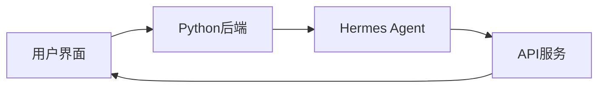
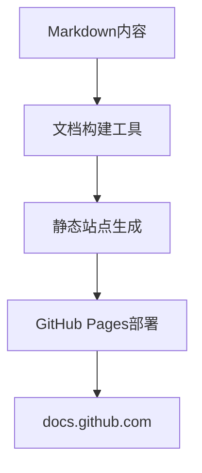

## 今日热点

AI工具与应用持续爆发，从视频生成到编程辅助，各类AI项目占据热榜；同时，从零构建技术的教程和教育内容备受关注，反映出开发者对底层原理的求知欲。

---

## 热门项目一览

| 排名 | 项目 | 语言 | 今日 | 总计 | 简介 |
|:---:|------|:----:|------:|-----:|------|
| 1 | [microsoft/markitdown](https://github.com/microsoft/markitdown) | Python | +2,798 | 135,266 | Python tool for converting ... |
| 2 | [harry0703/MoneyPrinterTurbo](https://github.com/harry0703/MoneyPrinterTurbo) | Python | +1,937 | 74,628 | 利用AI大模型，一键生成高清短视频 Generate ... |
| 3 | [codecrafters-io/build-your-own-x](https://github.com/codecrafters-io/build-your-own-x) | Markdown | +1,158 | 509,479 | Master programming by recre... |
| 4 | [OpenBMB/VoxCPM](https://github.com/OpenBMB/VoxCPM) | Python | +635 | 23,632 | VoxCPM2: Tokenizer-Free TTS... |
| 5 | [FareedKhan-dev/train-llm-from-scratch](https://github.com/FareedKhan-dev/train-llm-from-scratch) | Jupyter Notebook | +626 | 3,036 | A straightforward method fo... |
| 6 | [D4Vinci/Scrapling](https://github.com/D4Vinci/Scrapling) | Python | +606 | 56,772 | 🕷️ An adaptive Web Scraping... |
| 7 | [anthropics/claude-code](https://github.com/anthropics/claude-code) | Python | +489 | 128,976 | Claude Code is an agentic c... |
| 8 | [Crosstalk-Solutions/project-nomad](https://github.com/Crosstalk-Solutions/project-nomad) | TypeScript | +374 | 27,754 | Project N.O.M.A.D, is a sel... |
| 9 | [nesquena/hermes-webui](https://github.com/nesquena/hermes-webui) | Python | +357 | 10,080 | Hermes WebUI: The best way ... |
| 10 | [revfactory/harness](https://github.com/revfactory/harness) | HTML | +323 | 4,660 | A meta-skill that designs d... |
| 11 | [supermemoryai/supermemory](https://github.com/supermemoryai/supermemory) | TypeScript | +264 | 23,420 | Memory engine and app that ... |
| 12 | [EveryInc/compound-engineering-plugin](https://github.com/EveryInc/compound-engineering-plugin) | TypeScript | +251 | 18,753 | Official Compound Engineeri... |

---

## 趋势洞察

```
┌─────────────────────────────────────────────────────────────────┐
│  AI/ML 工具         ████████████████████████  9 个项目        │
│  其他               ██████████                4 个项目        │
│  开发框架             ██                        1 个项目        │
│  开发工具             ██                        1 个项目        │
└─────────────────────────────────────────────────────────────────┘
```

---

## 项目深度解读

### 1. microsoft/markitdown — 文档转换工具

> **一句话总结**：微软官方出品的通用文件转Markdown工具，支持多种格式一键高质量转换。

#### 价值主张

| 维度 | 说明 |
|------|------|
| **解决痛点** | 解决不同格式文档统一转换为Markdown的难题 |
| **目标用户** | 需要处理多种文档格式的开发者、技术文档工作者 |
| **核心亮点** | 支持多种格式 + 微软官方出品 + 高质量转换 + 保持原格式 + 易于集成 |

#### 技术架构


**技术特色**：
- 基于Python实现，跨平台兼容性强
- 支持Office文档、PDF等多种格式解析
- 智能识别文档结构，转换质量高

#### 热度分析

- Star数超13万且持续增长，表明项目获得广泛认可和活跃使用
- 微软官方出品，在文档处理领域具有权威性和生态位优势

#### 快速上手

```bash
# 安装工具
pip install markitdown

# 转换文件
markitdown input.docx -o output.md
```

#### 注意事项

- 需要确保Python环境正确配置
- 对于复杂格式文档，转换结果可能需要手动调整
- 某些特殊格式可能不被支持


### 2. harry0703/MoneyPrinterTurbo — AI视频生成器

> **一句话总结**：利用AI大模型一键生成高清短视频，简化视频创作流程。

#### 价值主张

| 维度 | 说明 |
|------|------|
| **解决痛点** | 降低视频创作门槛，无需专业技能即可生成高质量短视频 |
| **目标用户** | 内容创作者、营销人员、自媒体运营者、短视频爱好者 |
| **核心亮点** | 一键生成 + AI大模型支持 + 高清输出 + 多场景适配 |

#### 技术架构


**技术特色**：
- 集成AI大模型进行内容理解与生成
- 自动匹配与合成视频素材
- 支持多种分辨率的高清输出

#### 热度分析

- 项目获得74k+星标且持续增长，表明其在AI视频生成领域具有高关注度
- 高Fork数反映社区活跃度高，用户积极参与项目改进与二次开发

#### 快速上手

```bash
# 克隆项目
git clone https://github.com/harry0703/MoneyPrinterTurbo.git

# 安装依赖
pip install -r requirements.txt

# 运行主程序
python moneyprinter.py
```

#### 注意事项

- 需要确保有足够的计算资源，特别是GPU支持，以加速AI模型处理
- 注意遵守AI生成内容的版权法规，避免侵权问题
- 项目可能需要根据不同环境进行配置调整，建议仔细阅读项目文档


### 3. codecrafters-io/build-your-own-x — 技术重构学习

> **一句话总结**：通过亲手实现流行技术，从实践中深入理解系统架构与编程原理。

#### 价值主张

| 维度 | 说明 |
|------|------|
| **解决痛点** | 传统理论学习缺乏实践，难以掌握技术核心实现 |
| **目标用户** | 有一定编程基础想提升系统设计能力的开发者 |
| **核心亮点** | + 动手实践 + 渐进式学习 + 多技术覆盖 + 原理剖析 |

#### 技术架构


**技术特色**：
- 以重构为核心的学习方法论
- 结构化的渐进式教程设计
- 涵盖多种流行技术的实现细节

#### 热度分析

- 超50万星且持续增长，日均新增1000+星，表明在开发者社区中极受欢迎
- �开放问题，反映项目文档完善，问题处理机制高效

#### 快速上手

```bash
# 克隆项目
git clone https://github.com/codecrafters-io/build-your-own-x.git

# 浏览目录选择感兴趣的技术
cd build-your-own-x && ls
```

#### 注意事项

- 项目主要提供学习路径和文档，需要学习者自行实现代码
- 某些教程可能需要前置知识基础，建议根据自身能力选择适合的项目
- 不同教程的质量可能存在差异，可参考社区反馈选择


### 4. OpenBMB/VoxCPM — 多语言语音合成

> **一句话总结**：无分词器多语言语音合成系统，支持创意语音设计与逼真克隆。

#### 价值主张

| 维度 | 说明 |
|------|------|
| **解决痛点** | 传统TTS模型依赖分词器，限制多语言支持与语音真实性 |
| **目标用户** | 需要高质量多语言语音生成的开发者和研究人员 |
| **核心亮点** | 无分词器架构 + 多语言支持 + 逼真语音克隆 |

#### 技术架构


**技术特色**：
- 基于CPM架构的无分词器语音生成
- 多语言统一处理无需额外语言模型
- 支持零样本语音克隆与创意设计

#### 热度分析

- 项目增长迅猛，单日增长635 stars，显示社区高度关注
- 作为OpenBMB社区项目，在语音生成领域具有重要生态地位

#### 快速上手

```bash
# 安装依赖
pip install -e .

# 运行示例
python demo.py --input "你好，世界" --output output.wav
```

#### 注意事项

- 模型需要较大计算资源，建议使用GPU环境
- 语音克隆功能涉及伦理问题，需谨慎使用
- 许可证信息不明确，使用前需确认授权条款


### 5. FareedKhan-dev/train-llm-from-scratch — 零基础LLM训练

> **一句话总结**：提供从数据获取到模型生成的完整LLM训练流程，降低大语言模型入门门槛。

#### 价值主张

| 维度 | 说明 |
|------|------|
| **解决痛点** | 简化LLM训练复杂流程，提供可直接运行的端到端实现方案 |
| **目标用户** | 机器学习初学者、AI研究者、想了解LLM实现原理的开发者 |
| **核心亮点** | Jupyter交互式学习+完整训练流程+详细代码注释+实践导向 |

#### 技术架构


**技术特色**：
- 基于Notebook的交互式学习体验，便于逐步理解
- 包含完整的训练流程，无需额外整合多个工具
- 详细的代码注释和解释，降低理解门槛

#### 热度分析

- 项目短期内star激增(626新增)，表明社区对LLM训练需求强烈
- 较高的star/fork比例(6.7:1)，说明用户更倾向于收藏而非二次开发

#### 快速上手

```bash
# 安装依赖
pip install -r requirements.txt

# 运行notebook
jupyter notebook train_llm_from_scratch.ipynb
```

#### 注意事项

- 项目许可证未知，商业使用前需确认授权条款
- 训练LLM需要显著计算资源，普通用户可能需使用云服务或简化模型
- 建议按顺序学习每个步骤，跳过可能导致理解不完整


### 6. D4Vinci/Scrapling — 自适应爬虫框架

> **一句话总结**：自适应网页抓取框架，能处理从单个请求到大规模爬取的全流程任务，适应多种网页结构变化。

#### 价值主张

| 维度 | 说明 |
|------|------|
| **解决痛点** | 解决传统爬虫面对动态网页和反爬机制时的适应性问题 |
| **目标用户** | 数据分析师、研究人员、需要批量获取网络数据的开发者 |
| **核心亮点** | 自适应解析 + 全流程处理 + 反反爬能力 + 易用API |

#### 技术架构


**技术特色**：
- 自适应解析引擎，智能识别网页结构变化
- 内置多种反反爬策略，绕过常见防护机制
- 模块化设计，支持从简单请求到复杂爬虫的灵活配置
- 异步处理能力，提高大规模爬取效率

#### 热度分析

- 项目Star数超5.6万，近期每日增长600+，表明项目热度持续快速上升
- Fork数与Star数比例约为1:10，显示用户更倾向于直接使用而非二次开发
- 无开放问题，表明项目维护良好，问题解决及时

#### 快速上手

```bash
# 安装Scrapling
pip install scrapling

# 基本使用示例
from scrapling import Scrapling

# 创建爬虫实例并获取数据
crawler = Scrapling('https://example.com')
data = crawler.get()
print(data)
```

#### 注意事项

- 注意遵守目标网站的robots.txt和使用条款
- 大规模爬取时应有适当延迟，避免对目标服务器造成过大压力
- 对于需要登录的网站，可能需要额外配置认证信息
- 项目许可证未知，商业使用前应确认授权方式


### 7. anthropics/claude-code — AI编码助手

> **一句话总结**：Claude Code作为终端中的AI编程助手，能理解代码库并通过自然语言命令执行任务、解释代码和处理Git工作流。

#### 价值主张

| 维度 | 说明 |
|------|------|
| **解决痛点** | 开发者需要快速理解代码库、执行重复任务和解释复杂代码的效率问题 |
| **目标用户** | 终端重度用户、需要高效处理代码库的专业开发者 |
| **核心亮点** | 自然语言交互 + 代码理解能力 + 终端集成 + Git工作流自动化 + 任务执行 |

#### 技术架构


**技术特色**：
- 基于Claude AI的代码理解与生成能力
- 终端环境无缝集成
- 代码库上下文感知与智能分析

#### 热度分析

- 项目Star数超12.8万，日增长近500，显示开发者社区对该工具高度认可
- 高Star/Fork比例(约6.14:1)反映项目不仅流行而且用户粘性强，社区贡献活跃

#### 快速上手

```bash
# 安装Claude Code
pip install anthropics-claude-code

# 启动并使用
claude-code "解释这个函数的功能"
claude-code "重构这段代码以提高性能"
```

#### 注意事项

- 需要Anthropic API访问权限才能使用
- 可能需要配置项目上下文和代码库信息以获得最佳效果
- 隐私考虑：代码可能会发送到Anthropic的服务器进行处理


### 8. Crosstalk-Solutions/project-nomad — 离线生存工具集

> **一句话总结**：Project N.O.M.A.D 是一个自包含的离线生存计算机，集成关键工具、知识和AI，支持极端环境下信息获取与生存保障。

#### 价值主张

| 维度 | 说明 |
|------|------|
| **解决痛点** | 解决极端网络环境下信息孤岛与工具缺失问题 |
| **目标用户** | 户外探险者、应急响应人员、偏远地区工作者 |
| **核心亮点** | 离线可用 + AI辅助 + 工具集成 + 知识库 + 自包含设计 |

#### 技术架构

**技术特色**：
- 基于TypeScript构建，确保类型安全和跨平台兼容性
- 离线优先设计，确保无网络环境下的功能完整性
- 模块化工具集成，提供多种生存和应急工具

#### 热度分析

- 项目获27,754星标，单日增长374，显示社区高度关注与认可
- Fork数2,714表明项目有较高二次开发价值，适合定制化应用场景

#### 快速上手

```bash
# 克隆项目
git clone https://github.com/Crosstalk-Solutions/project-nomad.git

# 安装依赖
npm install

# 构建项目
npm run build
```

#### 注意事项

- 项目许可证未知，商业使用前需确认授权条款
- 作为离线工具，需要定期更新内容以保持信息时效性
- 项目依赖的AI功能可能需要额外的计算资源支持


### 9. nesquena/hermes-webui — AI代理Web界面

> **一句话总结**：为Hermes Agent提供响应式Web界面，实现跨设备智能交互体验。

#### 价值主张

| 维度 | 说明 |
|------|------|
| **解决痛点** | 将命令行工具转化为直观易用的Web界面，降低AI助手使用门槛 |
| **目标用户** | 需要便捷使用Hermes Agent的开发者和普通终端用户 |
| **核心亮点** | 响应式设计 + 跨平台支持 + 实时交互 + 移动端优化 |

#### 技术架构



**技术特色**：
- 采用Flask框架构建轻量级后端服务，确保高效响应
- 前端使用现代JavaScript技术栈，实现流畅的交互体验
- WebSocket连接保证实时通信，提供低延迟的对话体验

#### 热度分析

- 项目获得超1万星且日增350+，表明项目受广泛认可且持续增长
- 零未解决问题与稳定更新频率，显示项目维护良好，用户体验稳定

#### 快速上手

```bash
# 克隆项目
git clone https://github.com/nesquena/hermes-webui.git

# 安装依赖并运行
cd hermes-webui && pip install -r requirements.txt && python app.py
```

#### 注意事项

- 项目许可证信息不明确，商业使用前需确认授权条款
- 依赖Hermes Agent核心功能，确保后端服务正常运行


### 10. revfactory/harness — AI代理工厂

> **一句话总结**：一个用于设计领域特定代理团队、定义专业代理并生成其技能的元技能框架。

#### 价值主张

| 维度 | 说明 |
|------|------|
| **解决痛点** | 解决多AI代理系统设计复杂性和技能生成的标准化问题 |
| **目标用户** | AI系统开发者、研究人员和需要构建专业AI应用的组织 |
| **核心亮点** | 领域特定代理设计 + 技能自动生成 + 代理团队协作 |

#### 技术架构


**技术特色**：
- 基于Web的HTML界面，降低使用门槛
- 模块化代理设计，支持快速迭代
- 技能自动生成机制，减少人工编码

#### 热度分析

- 近期获得大量关注，单日增长323星，表明项目处于上升期
- 适中的Fork数量反映社区参与度良好，适合二次开发

#### 快速上手

```bash
# 克隆仓库
git clone https://github.com/revfactory/harness.git

# 使用简单服务器运行
cd harness && python -m http.server 8000
```

#### 注意事项
- 项目依赖可能不明确，需要自行探索环境配置
- 由于项目主要基于HTML，可能需要理解前端架构才能深入定制


### 11. supermemoryai/supermemory — AI记忆引擎

> **一句话总结**：为AI应用提供极速、可扩展的记忆引擎，构建AI时代的记忆API基础设施。

#### 价值主张

| 维度 | 说明 |
|------|------|
| **解决痛点** | 解决AI应用中高效记忆存储与检索的瓶颈问题 |
| **目标用户** | AI应用开发者和智能系统构建者 |
| **核心亮点** | 极速记忆检索+大规模可扩展+AI时代专用API+低延迟响应 |

#### 技术架构


**技术特色**：
- 基于TypeScript构建的类型安全记忆系统
- 专为AI应用优化的高性能存储引擎
- 支持大规模数据扩展的记忆架构

#### 热度分析

- Star数达2.3万，近期呈现稳定增长态势，日增264星
- 零未解决问题显示项目维护活跃，社区反馈良好

#### 快速上手

```bash
# 克隆项目
git clone https://github.com/supermemoryai/supermemory.git

# 安装依赖
npm install

# 启动服务
npm run start
```

#### 注意事项

- 项目License未知，商业使用前需确认授权条款
- 项目文档可能需要进一步补充以提供更完整的使用指南


### 12. EveryInc/compound-engineering-plugin — 多端工程插件

> **一句话总结**：官方工程插件，为Claude Code、Codex、Cursor等多编辑器提供统一AI编程体验。

#### 价值主张

| 维度 | 说明 |
|------|------|
| **解决痛点** | 统一多AI编程工具的工程化工作流 |
| **目标用户** | 使用AI辅助编程的开发者和工程师 |
| **核心亮点** | 跨平台支持 + 工程化集成 + 官方维护 + AI工具增强 |

#### 技术架构


**技术特色**：
- 基于TypeScript构建，提供类型安全开发体验
- 支持多个编辑器的统一接口设计
- 模块化架构便于功能扩展

#### 热度分析

- 项目获得高关注度，Star数近2万且持续增长，表明市场需求强烈
- Fork数相对较低但稳定，显示项目成熟度高，用户更倾向于直接使用

#### 快速上手

```bash
# 安装插件
npm install @compound/engineering-plugin

# 在编辑器中启用
# 根据具体编辑器配置启用插件
```

#### 注意事项

- 项目许可证未知，使用前需确认开源条款
- 作为官方插件，可能需要特定的API密钥或账户配置
- 插件功能可能依赖于Compound Engineering的服务，需确保网络连接稳定


### 13. emmabostian/developer-portfolios — 开发者作品集

> **一句话总结**：收集优秀开发者作品集，为求职者提供创意灵感与设计参考。

#### 价值主张

| 维度 | 说明 |
|------|------|
| **解决痛点** | 解决开发者求职时作品集设计缺乏灵感的问题 |
| **目标用户** | 寻找工作机会的开发者、设计师和求职者 |
| **核心亮点** | 精选优质案例 + 多样化设计风格 + 实用参考价值 |

#### 技术架构


**技术特色**：
- 使用Python脚本自动化收集和整理资源
- 采用结构化方式存储和展示作品集信息
- 定期更新维护，确保内容时效性

#### 热度分析

- 项目获得超过23k星，表明开发者社区对求职资源有强烈需求
- 73个新增星星显示项目仍在持续获得关注，社区活跃度高

#### 快速上手

```bash
# 克隆项目获取作品集列表
git clone https://github.com/emmabostian/developer-portfolios.git

# 浏览README文件查看精选作品集
cat README.md
```

#### 注意事项

- 项目收集的作品集链接可能会失效，需要定期检查更新
- 使用他人作品集作为参考时，应注重原创性，避免直接复制


### 14. nicobailon/pi-subagents — Pi子代理扩展

> **一句话总结**：为Pi网络提供异步子代理委派，支持截断、工件与会话共享功能。

#### 价值主张

| 维度 | 说明 |
|------|------|
| **解决痛点** | 解决Pi平台异步子代理处理效率低的问题 |
| **目标用户** | Pi网络开发者和高级用户 |
| **核心亮点** | 异步处理 + 子代理委派 + 截断功能 + 工件支持 + 会话共享 |

#### 技术架构


**技术特色**：
- 基于TypeScript开发，保证类型安全
- 异步子代理委派机制提高处理效率
- 支持截断功能优化资源使用

#### 热度分析

- 项目获得1874个Star，近期增长69个，表明社区关注度较高
- Fork数量257，说明有一定程度的二次开发和使用

#### 快速上手

```bash
npm install pi-subagents
# 初始化配置
pi-subagents init
# 启动服务
pi-subagents start
```

#### 注意事项

- 注意依赖的Pi平台版本兼容性
- 配置子代理时需考虑性能影响
- 会话共享可能涉及隐私和安全问题


### 15. github/docs — 官方文档仓库

> **一句话总结**：GitHub官方开源文档项目，为全球开发者提供权威的技术指南和API参考。

#### 价值主张

| 维度 | 说明 |
|------|------|
| **解决痛点** | 统一解决开发者在使用GitHub平台时的各类问题和知识需求 |
| **目标用户** | GitHub平台所有用户，包括开发者、项目管理者和贡献者 |
| **核心亮点** | 官方权威性 + 全面功能覆盖 + 社区协作更新 + 多语言支持 + 实时API文档 |

#### 技术架构



**技术特色**：
- 基于Markdown的轻量级内容管理系统
- 使用TypeScript确保代码示例准确性和类型安全
- 采用Jekyll静态站点生成器构建高性能文档网站

#### 热度分析

- 高Fork/Star比例(1:3.4)反映项目极高参考价值和社区参与度
- 作为GitHub生态核心文档项目，具有广泛影响力和权威性

#### 快速上手

```bash
# 克隆仓库
git clone https://github.com/github/docs.git

# 创建新分支并提交更改
git checkout -b update-docs
git add .
git commit -m "Update documentation"
```

#### 注意事项

- 文档内容必须准确反映GitHub平台的当前状态和功能
- 所有代码示例必须经过测试验证，确保与实际行为一致
- 遵循GitHub文档风格指南和贡献规范
- 对于API文档，需确保与实际API行为完全匹配


## 今日推荐

| 主题 | 推荐项目 | 亮点 |
|------|----------|------|
| 今日最热 | [microsoft/markitdown](https://github.com/microsoft/markitdown) | Python tool for c... |
| 值得关注 | [harry0703/MoneyPrinterTurbo](https://github.com/harry0703/MoneyPrinterTurbo) | 利用AI大模型，一键生成高清短视频... |
| 快速上手 | [codecrafters-io/build-your-own-x](https://github.com/codecrafters-io/build-your-own-x) | Master programmin... |
| 长期潜力 | [OpenBMB/VoxCPM](https://github.com/OpenBMB/VoxCPM) | VoxCPM2: Tokenize... |

---

<div align="center">

*Generated on 2026-06-01 | Powered by GitHub Trending Reporter*

</div>