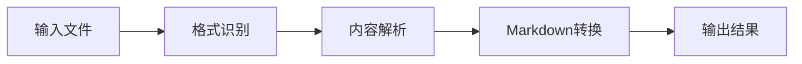
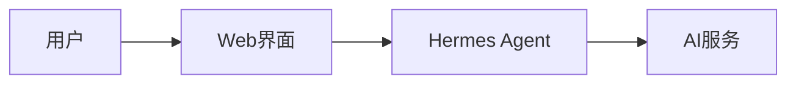
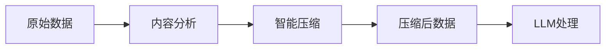
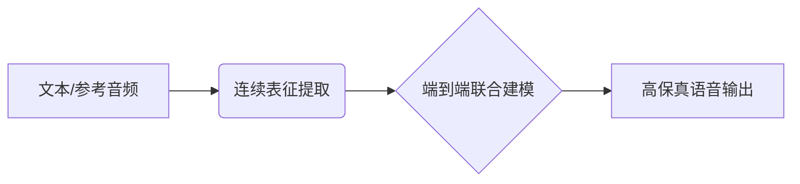
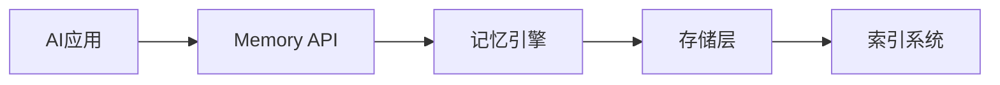
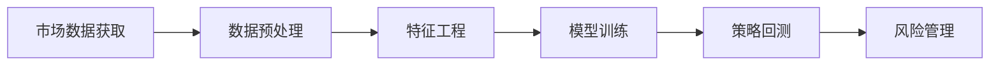
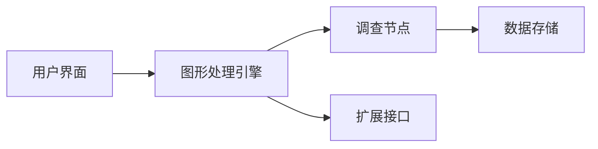
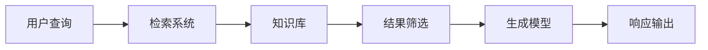

## 今日热点

今日GitHub热榜聚焦AI工具优化与数据处理，LLM压缩技术、文档转换和网页抓取工具备受关注，反映出开发者对提高AI效率和内容处理能力的迫切需求。

---

## 热门项目一览

| 排名 | 项目 | 语言 | 今日 | 总计 | 简介 |
|:---:|------|:----:|------:|-----:|------|
| 1 | [microsoft/markitdown](https://github.com/microsoft/markitdown) | Python | +3,618 | 141,351 | Python tool for converting ... |
| 2 | [nesquena/hermes-webui](https://github.com/nesquena/hermes-webui) | Python | +1,722 | 12,619 | Hermes WebUI: The best way ... |
| 3 | [affaan-m/ECC](https://github.com/affaan-m/ECC) | JavaScript | +1,533 | 204,144 | The agent harness performan... |
| 4 | [chopratejas/headroom](https://github.com/chopratejas/headroom) | Python | +1,265 | 6,772 | Compress tool outputs, logs... |
| 5 | [D4Vinci/Scrapling](https://github.com/D4Vinci/Scrapling) | Python | +1,182 | 59,279 | 🕷️ An adaptive Web Scraping... |
| 6 | [OpenBMB/VoxCPM](https://github.com/OpenBMB/VoxCPM) | Python | +783 | 25,206 | VoxCPM2: Tokenizer-Free TTS... |
| 7 | [supermemoryai/supermemory](https://github.com/supermemoryai/supermemory) | TypeScript | +680 | 24,712 | Memory engine and app that ... |
| 8 | [stefan-jansen/machine-learning-for-trading](https://github.com/stefan-jansen/machine-learning-for-trading) | Jupyter Notebook | +574 | 18,546 | Code for Machine Learning f... |
| 9 | [reconurge/flowsint](https://github.com/reconurge/flowsint) | TypeScript | +124 | 4,564 | A modern platform for visua... |
| 10 | [Open-LLM-VTuber/Open-LLM-VTuber](https://github.com/Open-LLM-VTuber/Open-LLM-VTuber) | Python | +66 | 8,443 | Talk to any LLM with hands-... |
| 11 | [jamwithai/production-agentic-rag-course](https://github.com/jamwithai/production-agentic-rag-course) | Python | +30 | 6,425 | No description |

---

## 趋势洞察

```
┌─────────────────────────────────────────────────────────────────┐
│  AI/ML 工具         ████████████████████████  7 个项目        │
│  开发框架             ███                       1 个项目        │
│  开发工具             ███                       1 个项目        │
│  安全工具             ███                       1 个项目        │
│  其他               ███                       1 个项目        │
└─────────────────────────────────────────────────────────────────┘
```

---

## 项目深度解读

### 1. microsoft/markitdown — 文档转换工具

> **一句话总结**：Python多格式文档转换工具，支持将Office文档转换为标准Markdown格式，保持内容结构完整性。

#### 价值主张

| 维度 | 说明 |
|------|------|
| **解决痛点** | 解决各类文档格式不兼容、内容提取困难的问题，统一转换为通用Markdown格式 |
| **目标用户** | 文档处理开发者、内容创作者、技术文档编写者、Office文档用户 |
| **核心亮点** | 支持多种Office文档格式转换 + 保持原文档结构和格式 + Python库和命令行工具双重支持 + 高精度转换 |

#### 技术架构



**技术特色**：
- 支持多种文档格式解析引擎
- 高级内容结构保留算法
- 可扩展的转换框架设计

#### 热度分析

- 项目Star数超过14万，近期每日增长3000+，表明文档转换需求旺盛
- 作为Microsoft官方项目，在文档处理领域具有重要生态地位，吸引大量开发者关注

#### 快速上手

```bash
# 安装
pip install markitdown

# 命令行使用
markitdown input.docx output.md

# Python API使用
import markitdown
markdown_content = markitdown.convert(input_file)
```

#### 注意事项

- 需要确保Python环境兼容性
- 对于复杂格式文档，可能需要额外依赖
- 转换结果可能需要人工微调，特别是对于复杂排版


### 2. nesquena/hermes-webui — 智能代理Web界面

> **一句话总结**：为Hermes Agent提供便捷的网页和移动端交互界面，简化AI代理使用体验。

#### 价值主张

| 维度 | 说明 |
|------|------|
| **解决痛点** | 解决Hermes Agent缺乏友好交互界面的问题 |
| **目标用户** | 需要通过图形界面使用AI代理的开发者和普通用户 |
| **核心亮点** | 响应式设计 + 移动端适配 + 简化交互流程 |

#### 技术架构



**技术特色**：
- 基于Python Web框架构建轻量级界面
- 响应式设计适配多种设备屏幕
- 简化AI代理交互流程，降低使用门槛

#### 热度分析

- 项目获得12,619个Star，单日增长1,722，表明关注度极高
- Open Issues为0，反映项目维护良好或问题解决效率高

#### 快速上手

```bash
git clone https://github.com/nesquena/hermes-webui.git
cd hermes-webui
pip install -r requirements.txt
python app.py
```

#### 注意事项

- 项目许可证未知，使用前需确认开源协议
- 可能需要先了解Hermes Agent的基本用法和配置
- 使用时可能需要配置相关API密钥或服务连接


### 3. affaan-m/ECC — AI代码助手优化系统

> **一句话总结**：提升AI编程助手性能的综合优化系统，强化技能、记忆与安全特性。

#### 价值主张

| 维度 | 说明 |
|------|------|
| **解决痛点** | AI编程助手响应速度慢、上下文记忆有限、安全性不足 |
| **目标用户** | 使用Claude、Codex、Cursor等AI辅助编程的开发者 |
| **核心亮点** | + 技能优化 + 记忆增强 + 安全强化 + 研究优先 |

#### 技术架构


**技术特色**：
- 模块化AI助手性能优化架构
- 智能上下文管理与记忆检索
- 多层次安全防护机制

#### 热度分析

- 高关注度项目，单日新增1500+星标，社区增长迅猛
- 在AI辅助编程领域具有显著影响力，开发者认可度高

#### 快速上手

```bash
# 克隆项目
git clone https://github.com/affaan-m/ECC.git

# 安装依赖
npm install

# 运行优化系统
npm start
```

#### 注意事项

- 项目许可证未知，使用前需确认授权条款
- 集成前需确认与目标AI代码助手的兼容性
- 注意数据隐私与安全，特别是涉及代码记忆功能时


### 4. chopratejas/headroom — [LLM内容压缩]

> **一句话总结**：在LLM处理前压缩各类内容，大幅减少token使用量而不影响回答质量。

#### 价值主张

| 维度 | 说明 |
|------|------|
| **解决痛点** | LLM处理大量内容时token消耗过高，增加成本和延迟 |
| **目标用户** | 使用LLM处理大量数据的开发者、研究人员和企业 |
| **核心亮点** | 高压缩率 + 保持回答质量 + 多种部署方式 + 支持多种数据类型 |

#### 技术架构



**技术特色**：
- 采用智能算法压缩各类内容，保留关键信息
- 支持60-95%的高压缩率而不影响回答质量
- 提供库、代理和MCP服务器三种部署方式

#### 热度分析

- 项目近期热度激增，单日新增1255个star，表明技术需求旺盛
- 作为LLM优化工具，处于AI生态系统中解决实际问题的关键位置

#### 快速上手

```bash
# 安装
pip install headroom

# 基本使用
from headroom import compress
compressed = compress(your_data)
```

#### 注意事项

- 压缩算法可能因数据类型不同而效果各异
- 需要根据实际应用场景调整压缩参数以平衡压缩率和信息保留


### 5. D4Vinci/Scrapling — 自适应爬虫框架

> **一句话总结**：Scrapling是一个自适应爬虫框架，能从简单请求到大规模抓取，智能应对各种网页反爬机制。

#### 价值主张

| 维度 | 说明 |
|------|------|
| **解决痛点** | 解决网页爬取中的反爬机制、动态加载和数据解析等复杂问题 |
| **目标用户** | 数据分析师、研究人员及需要网络数据提取的开发者 |
| **核心亮点** | 自适应处理+反爬应对+多源数据整合+可扩展架构+易用API |

#### 技术架构


**技术特色**：
- 自适应解析器能智能识别网页结构
- 内置多种反爬策略可动态切换
- 支持异步并发提高抓取效率

#### 热度分析

- 项目Star数近6万，近期增长迅速，日均增加约1200 stars
- 社区活跃度高，虽无开放问题但表明项目维护稳定

#### 快速上手

```bash
# 安装Scrapling
pip install scrapling

# 基本使用示例
from scrapling import Scrapling
scraper = Scrapling('https://example.com')
data = scraper.get()
print(data.extract())
```

#### 注意事项

- 使用时需遵守目标网站的robots.txt规则
- 注意反爬机制可能需要额外配置
- 大规模抓取建议设置适当的延迟避免被封禁


### 6. OpenBMB/VoxCPM — 多语言语音合成与克隆引擎

> **一句话总结**：基于无分词器架构的新一代端到端多语言语音生成与高保真声音克隆大模型。

#### 价值主张

| 维度 | 说明 |
|------|------|
| **解决痛点** | 传统TTS依赖复杂文本前端处理，跨语言泛化差，且声音克隆缺乏情感与真实感。 |
| **目标用户** | 语音合成算法开发者、AIGC音频创作者及智能客服服务商。 |
| **核心亮点** | 无Tokenizer设计 + 原生多语言支持 + 创意声音定制 + 极致逼真零样本克隆 |

#### 技术架构



**技术特色**：
- 无Tokenizer架构，直接处理原始音频特征，消除语言壁垒。
- 统一的多语言建模，实现无缝的跨语种零样本声音克隆。
- 深度韵律与声纹解耦，支持精细化的情感与创意声音设计。

#### 热度分析

- Star数突破2.5万且单日激增近800，显示市场对高质量TTS的强烈需求。
- OpenBMB团队背书，在大模型开源生态中占据重要的音频基建位置。

#### 快速上手

```bash
git clone https://github.com/OpenBMB/VoxCPM.git
cd VoxCPM
pip install -r requirements.txt
python generate.py --text "你好，世界" --speaker_audio reference.wav
```

#### 注意事项

- 许可证目前未知，企业在将其用于商业产品前需确认合规性与授权协议。
- 端到端大模型架构对计算资源要求较高，推理与微调需准备高端GPU。


### 7. supermemoryai/supermemory — AI记忆引擎

> **一句话总结**：为AI时代打造的高性能、可扩展的记忆引擎与API服务。

#### 价值主张

| 维度 | 说明 |
|------|------|
| **解决痛点** | 解决AI应用中高效记忆存储与检索的挑战，提供极速响应体验 |
| **目标用户** | AI开发者、应用构建者、需要高效记忆系统的企业 |
| **核心亮点** | 极速性能 + 高可扩展性 + 专为AI优化 + API驱动 + 记忆引擎 |

#### 技术架构



**技术特色**：
- 基于TypeScript构建，确保类型安全与高质量代码
- 极速记忆检索算法，优化AI应用响应速度
- 高度可扩展架构，支持大规模记忆数据

#### 热度分析

- 项目Star数高达24,712且近期单日增长680，显示社区高度关注与认可
- 作为AI基础设施项目，在AI应用生态中占据重要位置，有望成为行业标准解决方案

#### 快速上手

```bash
# 克隆项目
git clone https://github.com/supermemoryai/supermemory.git

# 安装依赖
cd supermemory && npm install

# 启动开发环境
npm run dev
```

#### 注意事项

- 项目许可证信息不明确，在使用前需要确认具体许可条款
- 作为高热度项目，可能需要关注API的稳定性与变更
- 项目没有开放Issues，可能需要通过其他渠道获取支持


### 8. stefan-jansen/machine-learning-for-trading — 金融ML实践指南

> **一句话总结**：提供完整机器学习算法交易代码实现，连接理论与实战，覆盖多种交易策略。

#### 价值主张

| 维度 | 说明 |
|------|------|
| **解决痛点** | 弥合金融交易理论与机器学习实践之间的鸿沟，提供可落地的解决方案 |
| **目标用户** | 量化交易开发者、金融分析师、机器学习工程师、金融科技研究者 |
| **核心亮点** | 完整代码示例 + 多种交易策略整合 + 实战导向 + 详细解释文档 + 最新技术融合 |

#### 技术架构



**技术特色**：
- 基于Python金融科技栈，整合pandas、numpy等核心库
- 结合传统统计模型与现代深度学习方法处理时序数据
- 提供完整的回测框架和性能评估指标体系
- 集成多种数据源和API，支持多市场交易策略
- 包含风险管理和资金分配模块，贴近实际交易场景

#### 热度分析
- 项目Star数超18.5k，近期日均增长574，表明金融科技领域对ML交易解决方案的强烈需求
- 高Fork数(5,232)显示社区活跃度高，用户不仅关注还积极参与实践和二次开发

#### 快速上手

```bash
# 克隆项目
git clone https://github.com/stefan-jansen/machine-learning-for-trading.git

# 安装依赖
cd machine-learning-for-trading
pip install -r requirements.txt

# 启动Jupyter环境
jupyter notebook
```

#### 注意事项
- 项目依赖较多，安装时可能需要较长时间，建议使用虚拟环境
- 代码中的交易策略需要根据实际市场情况调整，不可直接用于实盘交易
- 部分数据源可能需要付费订阅才能完整运行示例代码
- 需要一定的金融知识和机器学习基础才能充分利用项目内容


### 9. reconurge/flowsint — 可视化调查平台

> **一句话总结**：基于图形的现代化调查平台，为网络安全分析师提供直观灵活的调查流程构建能力。

#### 价值主张

| 维度 | 说明 |
|------|------|
| **解决痛点** | 将复杂调查流程可视化，提升网络安全分析效率与协作能力 |
| **目标用户** | 网络安全分析师、数字取证专家、调查人员 |
| **核心亮点** | 可视化调查流程 + 模块化架构 + 高度可扩展 + 跨平台支持 + 实时协作 |

#### 技术架构



**技术特色**：
- 基于 TypeScript 开发，提供类型安全与高质量代码
- 模块化架构设计，支持自定义调查组件开发
- 图形化调查流程构建，提升直观性与易用性

#### 热度分析

- 项目获得4564个Star，近期增长124个/天，表明正在快速获得专业认可
- Fork数达585，显示有较多开发者在进行二次开发与定制，社区活跃度高

#### 快速上手

```bash
# 克隆项目
git clone https://github.com/reconurge/flowsint.git

# 安装依赖
npm install

# 启动应用
npm start
```

#### 注意事项

- 项目许可证未知，使用前需确认授权条款
- 作为网络安全工具，需确保数据安全与隐私保护合规
- 建议先在测试环境中验证功能，再用于实际调查工作


### 10. Open-LLM-VTuber/Open-LLM-VTuber — AI虚拟助手平台

> **一句话总结**：支持语音交互的本地化AI虚拟助手，整合LLM与Live2D表情系统。

#### 价值主张

| 维度 | 说明 |
|------|------|
| **解决痛点** | 解决AI助手交互不自然、依赖文本输入、缺乏视觉反馈的问题 |
| **目标用户** | 内容创作者、开发者、AI爱好者、虚拟主播 |
| **核心亮点** | 语音交互 + 实时中断 + Live2D表情 + 本地部署 + 跨平台支持 |

#### 技术架构


**技术特色**：
- 端到端语音交互系统，支持实时中断
- 轻量级本地部署，保护隐私
- 多模态融合，整合语音与视觉反馈

#### 热度分析

- 项目获得8,443颗星且持续增长，表明在AI虚拟助手领域有显著吸引力
- 高Fork比例(约1:8)暗示社区积极参与二次开发和功能扩展

#### 快速上手

```bash
# 克隆仓库
git clone https://github.com/Open-LLM-VTuber/Open-LLM-VTuber.git

# 安装依赖
pip install -r requirements.txt

# 启动应用
python main.py
```

#### 注意事项

- 项目可能需要较好的硬件性能，特别是实时语音处理部分
- Live2D模型可能需要额外资源或购买授权
- 语音识别质量受环境噪音和麦克风质量影响较大
- 本地部署需要确保有足够的计算资源运行LLM模型


### 11. jamwithai/production-agentic-rag-course — 生产级智能RAG课程

> **一句话总结**：一套专注于生产环境部署的智能检索增强生成系统实践课程，结合AI代理与RAG技术。

#### 价值主张

| 维度 | 说明 |
|------|------|
| **解决痛点** | 解决RAG系统从原型到生产环境的部署难题 |
| **目标用户** | AI工程师、系统架构师、ML实践者 |
| **核心亮点** | 完整生产流程实现 + 实战案例 + 最佳实践指南 + 可扩展架构 + 工具链集成 |

#### 技术架构



**技术特色**：
- 采用模块化设计，支持不同组件独立扩展
- 集成多种向量数据库和嵌入模型
- 实现智能缓存机制提高系统响应速度
- 提供完整的监控和日志系统

#### 热度分析

- 项目获得6,425颗星星，近30天内增长30颗，显示稳定上升趋势
- Fork数达1,489，表明项目有较高的实践参考价值
- 无开放问题，说明项目维护良好，内容较为完善

#### 快速上手

```bash
# 克隆项目
git clone https://github.com/jamwithai/production-agentic-rag-course.git

# 安装依赖
cd production-agentic-rag-course
pip install -r requirements.txt
```

#### 注意事项

- 项目内容可能需要一定的AI和机器学习基础知识
- 建议在Linux或WSL环境下部署，以获得最佳兼容性
- 课程中的部分服务可能需要API密钥或付费订阅


## 今日推荐

| 主题 | 推荐项目 | 亮点 |
|------|----------|------|
| 今日最热 | [microsoft/markitdown](https://github.com/microsoft/markitdown) | Python tool for c... |
| 值得关注 | [nesquena/hermes-webui](https://github.com/nesquena/hermes-webui) | Hermes WebUI: The... |
| 快速上手 | [affaan-m/ECC](https://github.com/affaan-m/ECC) | The agent harness... |
| 长期潜力 | [chopratejas/headroom](https://github.com/chopratejas/headroom) | Compress tool out... |

---

<div align="center">

*Generated on 2026-06-03 | Powered by GitHub Trending Reporter*

</div>