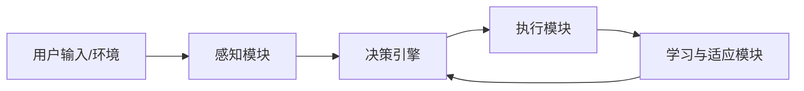
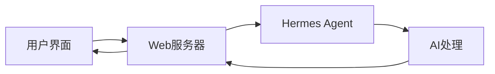
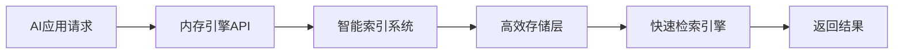
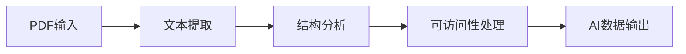
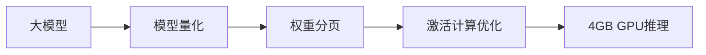
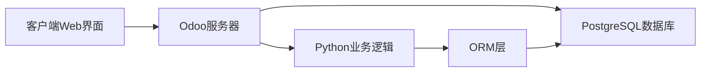
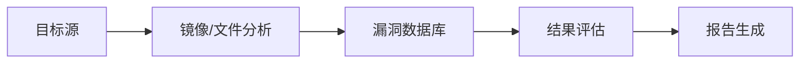

## 今日热点

AI工具优化与代理系统持续火热，LLM性能提升与开发者效率工具引领今日GitHub趋势，大型模型轻量化部署与多模态交互成为焦点。

---

## 热门项目一览

| 排名 | 项目 | 语言 | 今日 | 总计 | 简介 |
|:---:|------|:----:|------:|-----:|------|
| 1 | [chopratejas/headroom](https://github.com/chopratejas/headroom) | Python | +3,530 | 10,055 | Compress tool outputs, logs... |
| 2 | [affaan-m/ECC](https://github.com/affaan-m/ECC) | JavaScript | +2,141 | 205,885 | The agent harness performan... |
| 3 | [microsoft/markitdown](https://github.com/microsoft/markitdown) | Python | +1,984 | 143,002 | Python tool for converting ... |
| 4 | [NousResearch/hermes-agent](https://github.com/NousResearch/hermes-agent) | Python | +1,735 | 179,310 | The agent that grows with you |
| 5 | [D4Vinci/Scrapling](https://github.com/D4Vinci/Scrapling) | Python | +1,067 | 60,361 | 🕷️ An adaptive Web Scraping... |
| 6 | [nesquena/hermes-webui](https://github.com/nesquena/hermes-webui) | Python | +719 | 13,138 | Hermes WebUI: The best way ... |
| 7 | [Open-LLM-VTuber/Open-LLM-VTuber](https://github.com/Open-LLM-VTuber/Open-LLM-VTuber) | Python | +693 | 9,022 | Talk to any LLM with hands-... |
| 8 | [supermemoryai/supermemory](https://github.com/supermemoryai/supermemory) | TypeScript | +600 | 25,222 | Memory engine and app that ... |
| 9 | [opendataloader-project/opendataloader-pdf](https://github.com/opendataloader-project/opendataloader-pdf) | Java | +570 | 23,352 | PDF Parser for AI-ready dat... |
| 10 | [jwasham/coding-interview-university](https://github.com/jwasham/coding-interview-university) | Unknown | +330 | 349,097 | A complete computer science... |
| 11 | [lyogavin/airllm](https://github.com/lyogavin/airllm) | Jupyter Notebook | +208 | 18,961 | AirLLM 70B inference with s... |
| 12 | [HKUDS/Vibe-Trading](https://github.com/HKUDS/Vibe-Trading) | Python | +197 | 10,036 | "Vibe-Trading: Your Persona... |

---

## 趋势洞察

```
┌─────────────────────────────────────────────────────────────────┐
│  AI/ML 工具         ████████████████████████  10 个项目        │
│  其他               ████                      2 个项目        │
│  开发框架             ██                        1 个项目        │
│  开发工具             ██                        1 个项目        │
└─────────────────────────────────────────────────────────────────┘
```

---

## 项目深度解读

### 1. chopratejas/headroom — LLM输入压缩器

> **一句话总结**：在LLM处理前压缩输入数据，大幅减少token使用量而不影响回答质量。

#### 价值主张

| 维度 | 说明 |
|------|------|
| **解决痛点** | 降低LLM处理的token消耗，减少API调用成本 |
| **目标用户** | 使用LLM API的开发者和AI应用构建者 |
| **核心亮点** | + 60-95% token减少率 + 多种数据源支持 + 库/代理/MCP三种使用方式 |

#### 技术架构


**技术特色**：
- 高效压缩算法保持内容语义完整性
- 支持多种数据格式和来源的统一处理
- 提供多种集成方式适应不同应用场景

#### 热度分析

- 项目近期获得大量关注，单日新增3500+ stars，显示出极强的市场吸引力
- 0 open issues表明项目维护良好，社区反馈问题得到及时解决

#### 快速上手

```bash
# 安装
pip install headroom

# 使用示例
headroom --input "large_file.txt" --output "compressed_output.txt"
```

#### 注意事项

- 压缩率可能因内容类型而异，需测试验证
- 需要确认项目许可证信息，目前标记为Unknown
- 压缩后的数据质量应通过实际应用场景验证


### 2. affaan-m/ECC — [AI助手优化]

> **一句话总结**：AI编程助手性能优化系统，提升代码生成效率与安全性

#### 价值主张

| 维度 | 说明 |
|------|------|
| **解决痛点** | AI编程助手性能瓶颈与代码质量问题 |
| **目标用户** | 使用AI编程助手的开发者 |
| **核心亮点** | 技能增强 + 本能优化 + 记忆管理 + 安全强化 + 研究优先 |

#### 技术架构

**技术特色**：
- 基于JavaScript的轻量级性能优化框架
- 集成多种AI编程工具的通用接口
- 模块化设计支持插件扩展

#### 热度分析

- 项目Star数超过20万，增长率高，表明开发者社区对其认可度高
- Fork数与Star数比例合理，显示项目有较高实用价值

#### 快速上手

```bash
# 克隆项目
git clone https://github.com/affaan-m/ECC.git

# 安装依赖
npm install
```

#### 注意事项

- 项目许可证未知，商业使用需谨慎
- 项目缺乏详细的文档说明
- Open Issues为0可能表明项目维护方式特殊或问题处理渠道不同


### 3. microsoft/markitdown — 文档转换工具

> **一句话总结**：Microsoft开发的强大Python工具，能将各类文件和Office文档高效转换为Markdown格式。

#### 价值主张

| 维度 | 说明 |
|------|------|
| **解决痛点** | 将多种格式文档统一转换为Markdown，解决跨平台内容管理难题 |
| **目标用户** | 开发者、内容创作者、文档处理者、技术文档团队 |
| **核心亮点** | 支持多格式转换 + 智能格式保留 + 高性能处理 + 微软官方维护 |

#### 技术架构


**技术特色**：
- 支持Office文档、PDF、HTML等多种格式解析
- 智能识别并保留原始文档结构和格式元素
- 高性能转换引擎，适合大批量文档处理

#### 热度分析

- 项目获得14万+星标，近期增长迅速，表明文档转换需求旺盛
- 作为微软官方项目，在文档处理领域具有重要生态地位和影响力

#### 快速上手

```bash
# 安装markitdown
pip install markitdown

# 将文档转换为Markdown
markitdown input.docx -o output.md
```

#### 注意事项

- 项目许可证信息不明确，商业使用前需确认授权情况
- 可能依赖Python特定版本，使用前需检查环境兼容性
- 对于某些复杂格式，转换可能需要额外配置以获得最佳效果


### 4. NousResearch/hermes-agent — 自适应AI代理

> **一句话总结**：基于Hermes框架的智能代理系统，具备持续学习与任务扩展能力。

#### 价值主张

| 维度 | 说明 |
|------|------|
| **解决痛点** | 传统AI代理缺乏持续学习和环境适应能力 |
| **目标用户** | AI研究人员与需要智能代理功能的开发者 |
| **核心亮点** | 自适应学习 + 模块化架构 + 任务泛化能力 + 增量学习 |

#### 技术架构



**技术特色**：
- 基于Hermes框架的自适应学习机制
- 模块化设计支持功能扩展与定制
- 持续学习与任务泛化能力

#### 热度分析

- 项目获17万+星标，近期增长迅猛，社区关注度极高
- Fork数超3万，表明项目具有较强二次开发价值

#### 快速上手

```bash
git clone https://github.com/NousResearch/hermes-agent.git
cd hermes-agent
pip install -r requirements.txt
```

#### 注意事项

- 项目许可证信息未知，使用前需确认授权条款
- 缺少详细的文档和示例代码，可能需要参考源码实现


### 5. D4Vinci/Scrapling — 自适应爬虫框架

> **一句话总结**：Scrapling是一个功能强大的自适应网页爬取框架，能从简单请求到大规模爬取全面覆盖。

#### 价值主张

| 维度 | 说明 |
|------|------|
| **解决痛点** | 解决传统爬虫难以应对复杂网页结构和反爬机制的问题 |
| **目标用户** | 数据分析师、研究人员、自动化测试工程师和需要网页数据提取的开发者 |
| **核心亮点** | 自适应网页解析 + 智能反爬对策 + 多层级爬取能力 + 易用API设计 + 可扩展架构 |

#### 技术架构


**技术特色**：
- 自适应解析引擎，智能识别网页结构
- 内置反爬对策，处理动态加载和验证机制
- 分布式爬取支持，适合大规模数据采集

#### 热度分析

- 项目获得6万+星标，近期增长迅速，表明其在爬虫领域受到广泛认可
- 0开放Issues，可能表明项目维护良好或社区主要通过其他渠道交流

#### 快速上手

```bash
# 安装Scrapling
pip install scrapling

# 基本使用示例
from scrapling import Scrapling
scraper = Scrapling('https://example.com')
data = scraper.get()
```

#### 注意事项

- 使用时需遵守目标网站的robots.txt规则
- 大规模爬取可能需要考虑IP轮换和请求频率控制
- 项目许可证未知，商业使用前需确认授权


### 6. nesquena/hermes-webui — [智能代理Web界面]

> **一句话总结**：Hermes WebUI为Hermes智能代理提供便捷的Web和移动端访问界面，简化AI交互体验。

#### 价值主张

| 维度 | 说明 |
|------|------|
| **解决痛点** | 将复杂的Hermes Agent转化为直观易用的Web界面，降低使用门槛 |
| **目标用户** | 需要通过图形界面与AI代理交互的开发者和普通用户 |
| **核心亮点** | + Web和移动端双重支持 + 直观的用户界面 + 简化AI代理交互流程 |

#### 技术架构



**技术特色**：
- 基于Python构建的轻量级Web界面
- 提供跨平台访问能力和响应式设计
- 与Hermes Agent无缝集成，保持核心功能完整性

#### 热度分析

- 项目获得超13k星且近期增长迅速，表明具有很高的实用价值和社区认可度
- Fork数接近1.6k，显示社区积极参与项目改进和二次开发

#### 快速上手

```bash
# 克隆项目
git clone https://github.com/nesquena/hermes-webui.git

# 安装依赖
pip install -r requirements.txt

# 启动服务
python app.py
```

#### 注意事项

- 需要确保Hermes Agent已正确安装和配置
- 可能需要额外的API密钥或配置文件才能正常工作
- 建议查看项目文档了解详细的部署和使用指南


### 7. Open-LLM-VTuber/Open-LLM-VTuber — AI虚拟助手

> **一句话总结**：结合语音交互和LLM，创建本地运行的Live2D虚拟形象助手。

#### 价值主张

| 维度 | 说明 |
|------|------|
| **解决痛点** | 打破文本交互限制，实现自然语音对话与视觉化AI体验 |
| **目标用户** | AI爱好者、虚拟主播、内容创作者和交互体验追求者 |
| **核心亮点** | 全平台本地运行 + 语音交互 + 实时语音打断 + Live2D虚拟形象 |

#### 技术架构


**技术特色**：
- 本地部署保护隐私，无需云端服务
- 实时语音打断技术提升交互自然度
- 支持多种LLM模型灵活切换

#### 热度分析

- 项目Star数突破9000，单日增长近700，呈现爆发式增长趋势
- Fork数超1100，显示社区积极参与项目定制和功能扩展

#### 快速上手

```bash
# 克隆项目
git clone https://github.com/Open-LLM-VTuber/Open-LLM-VTuber.git

# 安装依赖
pip install -r requirements.txt

# 运行项目
python main.py
```

#### 注意事项

- 需确保系统有足够计算资源运行LLM模型
- Live2D模型需要额外获取和配置
- 不同平台可能需要特定依赖配置
- 语音识别质量受环境噪音影响较大


### 8. supermemoryai/supermemory — AI记忆引擎

> **一句话总结**：为AI应用提供极速、可扩展的记忆引擎与API，实现高效数据存储与检索。

#### 价值主张

| 维度 | 说明 |
|------|------|
| **解决痛点** | 传统AI应用在处理大量历史数据时面临性能瓶颈和可扩展性挑战 |
| **目标用户** | AI应用开发者、需要长期记忆能力的AI系统构建者 |
| **核心亮点** | 高性能内存引擎 + 可扩展架构 + AI时代专用API + 低延迟数据访问 |

#### 技术架构



**技术特色**：
- 基于TypeScript构建，提供类型安全的开发体验
- 专为AI时代优化的内存处理架构
- 高效的索引和检索机制，支持快速数据访问

#### 热度分析

- 项目Star数已达25,222，单日增长600+，显示社区高度关注和认可
- 作为AI基础设施项目，处于AI应用生态的关键位置，具有广阔的发展前景

#### 快速上手

```bash
# 安装依赖
npm install supermemory

# 初始化记忆引擎
npx supermemory init

# 启动服务
npx supermemory start
```

#### 注意事项

- 项目License未知，商业使用前需确认授权条款
- 作为新兴项目，API和功能可能仍在快速迭代中
- 需要关注项目的文档完善程度和社区支持情况


### 9. opendataloader-project/opendataloader-pdf — AI PDF解析器

> **一句话总结**：开源PDF解析工具，专为AI数据处理和自动化可访问性而设计。

#### 价值主张

| 维度 | 说明 |
|------|------|
| **解决痛点** | 解决PDF数据提取困难和可访问性低的问题 |
| **目标用户** | AI开发人员、数据科学家、文档处理团队 |
| **核心亮点** | AI数据提取 + 自动化可访问性 + 高性能处理 + 多格式输出 |

#### 技术架构



**技术特色**：
- 基于Java的高性能PDF解析引擎
- 支持复杂PDF布局的结构化提取
- 自动化PDF可访问性增强功能

#### 热度分析

- 项目获得23,352个Star，今日新增570个，表明项目正处于快速增长期
- 0个Open Issues显示项目维护良好，问题响应及时

#### 快速上手

```bash
# 克隆项目
git clone https://github.com/opendataloader-project/opendataloader-pdf.git
# 构建项目
./gradlew build
# 运行示例
java -jar build/libs/opendataloader-pdf.jar
```

#### 注意事项

- 需要Java环境支持
- 可能依赖其他PDF处理库
- 需要注意PDF版权和使用限制


### 10. jwasham/coding-interview-university — 计算机科学学习指南

> **一句话总结**：一份全面的计算机科学学习计划，帮助求职者系统掌握软件工程面试所需的核心知识。

#### 价值主张

| 维度 | 说明 |
|------|------|
| **解决痛点** | 计算机科学知识零散，缺乏系统学习路径和面试准备指导 |
| **目标用户** | 准备软件工程面试的学生、转行者及需要提升技能的开发者 |
| **核心亮点** | 全面覆盖计算机科学核心知识点 + 提供结构化学习路径 + 包含面试准备资源 + 持续更新的学习资料 |

#### 技术架构


**技术特色**：
- 基于GitHub的开放协作模式，社区贡献持续更新内容
- 结构化的学习路径设计，从基础到进阶循序渐进
- 丰富的外部资源整合，提供多角度学习材料

#### 热度分析

- 高Star数量表明其在求职者群体中具有极高的认可度和影响力
- 作为开源教育资源，已成为计算机科学学习领域的标杆项目

#### 快速上手

```bash
# 克隆项目到本地
git clone https://github.com/jwasham/coding-interview-university.git

# 查看学习计划
cat README.md
```

#### 注意事项

- 项目内容庞大，建议根据自己的实际需求和背景有选择地学习
- 需要结合实际编程练习，仅阅读不足以掌握相关知识
- 部分链接可能需要更新，建议结合最新技术趋势学习


### 11. lyogavin/airllm — 高效LLM推理

> **一句话总结**：突破硬件限制，在单张4GB GPU上实现70B大模型高效推理。

#### 价值主张

| 维度 | 说明 |
|------|------|
| **解决痛点** | 解决大模型推理资源门槛高、成本贵的问题 |
| **目标用户** | 研究人员、开发者和个人爱好者 |
| **核心亮点** | 模型量化 + 权重分页 + 低内存需求 |

#### 技术架构



**技术特色**：
- 模型量化技术降低内存占用
- 权重分页技术实现部分加载
- 计算优化减少显存需求

#### 热度分析

- 项目获得近19k星，日增208星，表明社区高度关注
- 无开放问题，显示项目成熟度高，或社区问题主要通过其他渠道解决

#### 快速上手

```bash
# 克隆仓库
git clone https://github.com/lyogavin/airllm.git
cd airllm

# 运行Jupyter Notebook
jupyter notebook
```

#### 注意事项

- 项目依赖的库可能需要特定版本
- 4GB GPU的推理性能可能受限，不适合生产环境高并发场景
- 可能需要调整某些参数以适应不同硬件环境


### 12. HKUDS/Vibe-Trading — 智能交易代理

> **一句话总结**：AI驱动的个人交易代理，提供自动化交易决策和市场分析支持。

#### 价值主张

| 维度 | 说明 |
|------|------|
| **解决痛点** | 降低专业交易门槛，提供实时决策支持和风险管理 |
| **目标用户** | 个人投资者、量化交易爱好者、自动化交易需求者 |
| **核心亮点** | AI决策引擎 + 自动化交易执行 + 多市场支持 + 风险控制 |

#### 技术架构


**技术特色**：
- 基于机器学习的市场预测和信号生成
- 模块化设计支持多种交易策略和资产类别
- 实时数据处理和低延迟执行机制

#### 热度分析

- 项目Star数过万且持续增长，在量化交易领域具有显著影响力
- Fork数适中，表明项目既有实用价值也具备一定技术深度，适合二次开发

#### 快速上手

```bash
# 克隆项目
git clone https://github.com/HKUDS/Vibe-Trading.git

# 安装依赖
pip install -r requirements.txt

# 运行示例
python example/run_basic_strategy.py
```

#### 注意事项

- 交易系统涉及实际资金风险，使用前需充分了解并谨慎评估
- 项目许可证未知，商业使用前需确认授权条款
- 建议在模拟环境中充分测试后再用于实际交易


### 13. odoo/odoo — 开源ERP系统

> **一句话总结**：Odoo是集成化的开源ERP套件，提供一站式企业业务管理解决方案。

#### 价值主张

| 维度 | 说明 |
|------|------|
| **解决痛点** | 中小企业缺乏高性价比的综合业务管理平台 |
| **目标用户** | 中小企业、创业公司及需要定制化ERP的企业 |
| **核心亮点** | 模块化设计 + 丰富的应用生态 + 低代码开发 |

#### 技术架构



**技术特色**：
- 基于Python的模块化架构，支持高度定制
- 采用PostgreSQL作为数据库，支持复杂业务逻辑
- 内置ORM框架，简化数据库操作

#### 热度分析

- 高关注度项目，近5万stars，持续稳定增长，表明企业级开源ERP市场活跃
- 拥有庞大开发者社区和丰富的第三方应用生态，形成完整商业生态

#### 快速上手

```bash
# 安装依赖
sudo apt install postgresql python3-pip build-essential

# 克隆Odoo仓库
git clone https://github.com/odoo/odoo.git --depth=1
cd odoo

# 安装依赖并启动
pip install -r requirements.txt
./odoo-bin
```

#### 注意事项

- Odoo安装和配置相对复杂，需要一定的技术背景
- 大规模部署需要考虑性能优化和集群配置
- 自定义开发需要遵循Odoo的模块开发规范


### 14. aquasecurity/trivy — 全能安全扫描器

> **一句话总结**：Trivy 是一款快速、全面的安全扫描工具，可检测容器、Kubernetes、代码仓库和云环境中的漏洞、错误配置和秘密。

#### 价值主张

| 维度 | 说明 |
|------|------|
| **解决痛点** | 提供一站式解决方案，解决多云环境下的安全漏洞检测难题 |
| **目标用户** | DevOps工程师、安全团队、容器和云平台管理员 |
| **核心亮点** | 跨平台支持 + 高性能扫描 + 全面漏洞检测 + 用户友好界面 |

#### 技术架构



**技术特色**：
- 基于 Go 语言开发，性能优异，可快速扫描大型容器镜像
- 集成多个漏洞数据库(NVD、GitHub Advisory 等)，确保漏洞信息全面
- 支持多种扫描模式，包括文件系统、Git 仓库、容器注册表等

#### 热度分析

- Star 数持续稳定增长，表明项目获得广泛认可和持续使用
- 作为安全领域的开源工具，已成为容器安全扫描的事实标准之一

#### 快速上手

```bash
# 安装 Trivy
wget https://github.com/aquasecurity/trivy/releases/latest/download/trivy_{{version}}_Linux-64bit.tar.gz
tar xzvf trivy_{{version}}_Linux-64bit.tar.gz
sudo mv trivy /usr/local/bin/

# 扫描容器镜像
trivy image my-image:latest
```

#### 注意事项

- Trivy 需要定期更新漏洞数据库以确保检测结果的准确性
- 扫描大型容器镜像可能需要较长时间和较多内存资源


## 今日推荐

| 主题 | 推荐项目 | 亮点 |
|------|----------|------|
| 今日最热 | [chopratejas/headroom](https://github.com/chopratejas/headroom) | Compress tool out... |
| 值得关注 | [affaan-m/ECC](https://github.com/affaan-m/ECC) | The agent harness... |
| 快速上手 | [microsoft/markitdown](https://github.com/microsoft/markitdown) | Python tool for c... |
| 长期潜力 | [NousResearch/hermes-agent](https://github.com/NousResearch/hermes-agent) | The agent that gr... |

---

<div align="center">

*Generated on 2026-06-04 | Powered by GitHub Trending Reporter*

</div>