## 今日热点

今日GitHub热榜项目精彩纷呈。

---

## 热门项目一览

| 排名 | 项目 | 语言 | 今日 | 总计 | 简介 |
|:---:|------|:----:|------:|-----:|------|
| 1 | [chopratejas/headroom](https://github.com/chopratejas/headroom) | Python | +3,142 | 12,715 | Compress tool outputs, logs... |
| 2 | [NousResearch/hermes-agent](https://github.com/NousResearch/hermes-agent) | Python | +1,913 | 181,146 | The agent that grows with you |
| 3 | [affaan-m/ECC](https://github.com/affaan-m/ECC) | JavaScript | +1,750 | 207,346 | The agent harness performan... |
| 4 | [jwasham/coding-interview-university](https://github.com/jwasham/coding-interview-university) | Unknown | +632 | 349,777 | A complete computer science... |
| 5 | [Open-LLM-VTuber/Open-LLM-VTuber](https://github.com/Open-LLM-VTuber/Open-LLM-VTuber) | Python | +581 | 9,657 | Talk to any LLM with hands-... |
| 6 | [openclaw/openclaw-windows-node](https://github.com/openclaw/openclaw-windows-node) | C# | +411 | 1,356 | Windows companion suite for... |
| 7 | [github/spec-kit](https://github.com/github/spec-kit) | Python | +321 | 108,624 | 💫 Toolkit to help you get s... |
| 8 | [reconurge/flowsint](https://github.com/reconurge/flowsint) | TypeScript | +308 | 5,334 | A modern platform for visua... |
| 9 | [aquasecurity/trivy](https://github.com/aquasecurity/trivy) | Go | +255 | 35,680 | Find vulnerabilities, misco... |
| 10 | [lfnovo/open-notebook](https://github.com/lfnovo/open-notebook) | TypeScript | +212 | 25,136 | An Open Source implementati... |
| 11 | [mvanhorn/last30days-skill](https://github.com/mvanhorn/last30days-skill) | Python | +199 | 27,643 | AI agent skill that researc... |
| 12 | [PaddlePaddle/PaddleOCR](https://github.com/PaddlePaddle/PaddleOCR) | Python | +141 | 79,943 | Turn any PDF or image docum... |

---

## 趋势洞察

```
┌─────────────────────────────────────────────────────────────────┐
│  AI/ML 工具         ████████████████████████  9 个项目        │
│  其他               ████████                  3 个项目        │
│  开发工具             ██                        1 个项目        │
│  安全工具             ██                        1 个项目        │
└─────────────────────────────────────────────────────────────────┘
```

---

## 项目深度解读

### 1. chopratejas/headroom — LLM输入压缩器

> **一句话总结**：通过智能压缩LLM输入内容，减少60-95%token使用量，同时保持相同回答质量。

#### 价值主张

| 维度 | 说明 |
|------|------|
| **解决痛点** | LLM输入内容冗余导致的高token成本和低效率问题 |
| **目标用户** | 使用LLM API的开发者、研究人员和企业用户 |
| **核心亮点** | 高压缩率+保持回答质量+多形式部署+兼容性广 |

#### 技术架构

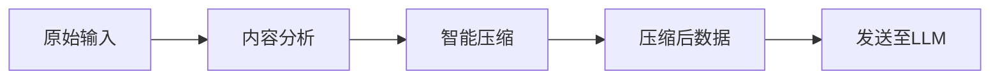

**技术特色**：
- 专有的压缩算法，针对LLM输入优化
- 支持工具输出、日志、文件和RAG块的压缩
- 提供库、代理和MCP服务器三种部署方式

#### 热度分析

- 项目获得12k+ stars，单日激增3000+，反映LLM成本优化需求迫切
- 零open issues表明项目维护完善，用户问题得到及时解决

#### 快速上手

```bash
# 安装
pip install headroom

# 作为库使用
from headroom import compress
compressed = compress(your_data)

# 作为代理运行
headroom --port 8080
```

#### 注意事项

- 压缩算法可能不适用于所有类型的内容，需要测试验证
- 压缩参数可能需要根据具体使用场景调整以获得最佳效果
- 项目许可证未知，商业使用前需确认授权条款


### 2. NousResearch/hermes-agent — 成长型智能代理

> **一句话总结**：Hermes-Agent是一个能够自主学习与成长的开源AI代理框架，提供可扩展的智能解决方案。

#### 价值主张

| 维度 | 说明 |
|------|------|
| **解决痛点** | AI代理缺乏持续学习和适应能力，无法随需求变化成长 |
| **目标用户** | AI研究人员、企业开发者、高级智能系统构建者 |
| **核心亮点** | 持续学习能力 + 模块化架构 + 记忆系统 + 高度可定制 + 开源生态 |

#### 技术架构

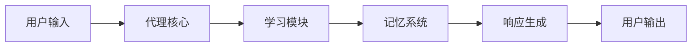

**技术特色**：
- 基于Python实现，易于扩展和集成
- 采用模块化设计，支持功能定制
- 实现了持续学习和长期记忆机制

#### 热度分析

- 项目Star数高达18万，近期增长迅速，表明社区高度关注
- Fork数超3万，显示项目有大量活跃的二次开发场景

#### 快速上手

```bash
# 克隆项目
git clone https://github.com/NousResearch/hermes-agent.git
cd hermes-agent

# 安装依赖
pip install -r requirements.txt

# 运行示例
python examples/basic_agent.py
```

#### 注意事项

- 项目License信息不明确，使用前需确认授权条款
- 可能需要一定的AI和机器学习基础知识才能充分利用项目功能
- 建议关注项目更新，因为AI代理技术迭代较快


### 3. affaan-m/ECC — AI编程性能优化

> **一句话总结**：为AI编程工具提供性能优化、技能增强和安全保障的代理系统。

#### 价值主张

| 维度 | 说明 |
|------|------|
| **解决痛点** | 提升AI编程工具性能与安全性，解决开发效率瓶颈 |
| **目标用户** | 使用Claude Code、Codex、Opencode、Cursor的开发者 |
| **核心亮点** | 性能优化 + 技能增强 + 记忆系统 + 安全保障 + 研究优先开发 |

#### 技术架构

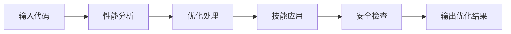

**技术特色**：
- 智能性能优化算法提升AI响应速度
- 多层次安全保障机制防止代码漏洞
- 记忆系统支持AI工具持续学习与进化

#### 热度分析

- 项目Star数超20万且每日稳定增长，表明其实用价值获广泛认可
- 作为AI编程工具生态的关键组件，处于技术前沿且社区参与度高

#### 快速上手

```bash
# 克隆项目
git clone https://github.com/affaan-m/ECC.git

# 安装依赖
npm install

# 运行项目
npm start
```

#### 注意事项

- 项目许可证未知，使用时需注意版权合规问题
- Open Issues为0，可能表示项目问题处理高效或维护状态良好


### 4. jwasham/coding-interview-university — 编程面试指南

> **一句话总结**：系统化的计算机科学学习路径，助力求职者掌握软件工程师面试核心技能。

#### 价值主张

| 维度 | 说明 |
|------|------|
| **解决痛点** | 提供全面计算机科学知识体系，解决面试准备无方向、知识零散问题 |
| **目标用户** | 求职软件工程师岗位的学生和转行者，需要系统提升编程能力者 |
| **核心亮点** | 完整学习路径 + 精选资源推荐 + 知识点分类 + 学习进度跟踪 + 社区支持 |

#### 技术架构

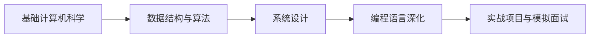

**技术特色**：
- 按难度和重要性分层的学习资源组织方式
- 覆盖从基础到高级的完整知识体系
- 结合理论与实践的学习方法设计

#### 热度分析

- 项目Star数超34万，日增600+，在编程学习领域保持极高关注度
- Fork/Star比例合理，表明用户不仅收藏项目，还积极参与内容使用和二次分发

#### 快速上手

```bash
# 克隆项目到本地
git clone https://github.com/jwasham/coding-interview-university.git

# 查看学习路线图
cat coding-interview-university/README.md
```

#### 注意事项

- 项目内容庞大，建议根据个人基础和时间制定阶段性学习计划
- 学习过程中应注重编程实践，而非仅阅读理论知识
- 部分资源链接可能需要更新，建议关注项目维护情况


### 5. Open-LLM-VTuber/Open-LLM-VTuber — AI虚拟助手

> **一句话总结**：支持语音交互与实时面部表情的本地化AI虚拟助手系统

#### 价值主张

| 维度 | 说明 |
|------|------|
| **解决痛点** | 将复杂LLM交互简化为自然语音对话，增强沉浸式体验 |
| **目标用户** | AI应用开发者、虚拟主播爱好者、智能交互研究者 |
| **核心亮点** | 实时语音交互 + 语音中断功能 + Live2D面部动画 + 跨平台本地运行 + 隐私保护 |

#### 技术架构

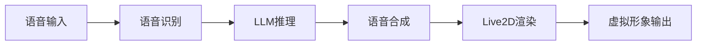

**技术特色**：
- 本地化运行的轻量级LLM语音交互系统
- 支持实时语音中断的对话流管理
- 跨平台Live2D面部表情动态渲染

#### 热度分析

- 项目近万Star且近期增长显著，表明AI虚拟交互领域需求旺盛
- 相比云端解决方案，本地化部署在隐私保护方面具有独特优势

#### 快速上手

```bash
# 克隆项目
git clone https://github.com/Open-LLM-VTuber/Open-LLM-VTuber.git

# 安装依赖
pip install -r requirements.txt

# 启动应用
python run.py
```

#### 注意事项

- 项目需要较好的硬件性能支持，尤其是LLM推理部分
- Live2D模型可能需要额外资源或授权
- 语音识别质量受环境影响，建议在安静环境下使用
- 部分功能可能需要根据具体LLM模型进行适配调整


### 6. openclaw/openclaw-windows-node — Windows扩展套件

> **一句话总结**：为OpenClaw提供Windows系统托盘应用、共享库、Node集成和PowerToys扩展的完整配套解决方案。

#### 价值主张

| 维度 | 说明 |
|------|------|
| **解决痛点** | OpenClaw在Windows平台上缺少完整的系统级支持和便捷访问方式 |
| **目标用户** | 使用OpenClaw的Windows用户，需要系统级集成和便捷访问功能 |
| **核心亮点** | 系统托盘应用 + PowerToys集成 + Node.js支持 + 共享库架构 |

#### 技术架构

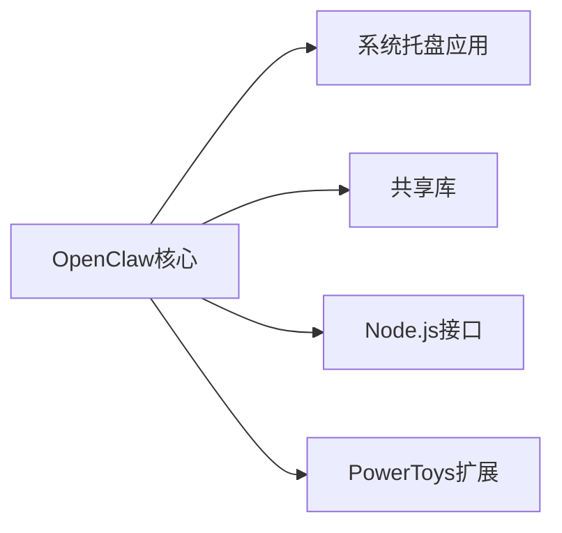

**技术特色**：
- C#开发的跨平台系统托盘应用
- 提供Node.js API实现跨语言调用
- 与Windows PowerToys深度集成
- 模块化设计便于扩展

#### 热度分析

- 项目获得1356个Star，单日增长411，表明项目近期获得高度关注
- Fork数相对较少，可能表明项目主要面向终端用户而非开发者二次开发

#### 快速上手

```bash
# 克隆项目
git clone https://github.com/openclaw/openclaw-windows-node.git

# 安装依赖
cd openclaw-windows-node
npm install

# 构建项目
dotnet build
```

#### 注意事项

- 项目需要Windows操作系统
- 可能需要先安装PowerToys才能使用完整功能
- 项目可能依赖OpenClaw核心功能


### 7. github/spec-kit — 规范驱动工具包

> **一句话总结**：规范驱动开发工具集，帮助开发者建立和实施API规范，提升协作效率。

#### 价值主张

| 维度 | 说明 |
|------|------|
| **解决痛点** | API开发过程中接口定义不统一、前后端协作效率低的问题 |
| **目标用户** | 需要建立API规范的团队、前后端开发人员、API设计者 |
| **核心亮点** + 支持多种API规范格式 + 自动化文档生成 + 实时验证功能 + 交互式API测试 + 与CI/CD无缝集成 |

#### 技术架构

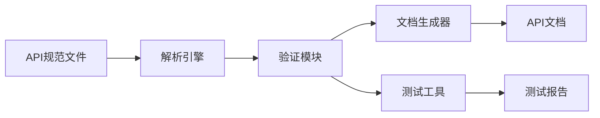

**技术特色**：
- 多格式规范解析支持，包括OpenAPI、Swagger等主流格式
- 实时验证机制，确保API规范的一致性和完整性
- 插件化架构，支持扩展和自定义功能

#### 热度分析

- 项目获得超过10万Stars且持续增长，表明规范驱动开发方法在业界受到高度认可
- 作为API开发基础工具，处于API经济生态的核心位置，连接前后端开发与测试

#### 快速上手

```bash
# 安装spec-kit
pip install spec-kit

# 初始化API规范项目
spec-kit init my-api-spec

# 验证API规范
spec-kit validate my-api-spec/openapi.yaml

# 生成API文档
spec-kit docs my-api-spec/openapi.yaml --output=docs
```

#### 注意事项

- 需要团队对API规范有基本共识，否则初期学习成本较高
- 在大型项目中建议与API网关和自动化测试框架配合使用
- 定期更新spec-kit以获取最新功能和安全补丁


### 8. reconurge/flowsint — 网络安全调查平台

> **一句话总结**：面向网络安全分析师的现代化可视化图形调查平台，提供灵活且可扩展的调查能力。

#### 价值主张

| 维度 | 说明 |
|------|------|
| **解决痛点** | 将复杂网络安全调查流程可视化，提高分析效率 |
| **目标用户** | 网络安全分析师、数字取证调查人员 |
| **核心亮点** | 可视化调查界面 + 图形化工作流 + 可扩展架构 |

#### 技术架构

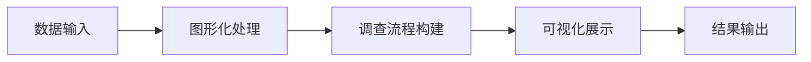

**技术特色**：
- 基于 TypeScript 开发，提供类型安全和良好的开发体验
- 图形化调查界面，支持拖拽操作构建调查流程
- 可扩展架构，允许自定义节点和调查流程

#### 热度分析

- 项目获得超过5300个Star，近期增长迅速（单日增长308），显示其在网络安全领域的高关注度
- 作为网络安全调查工具，填补了市场上可视化调查平台的空白，具有独特价值定位

#### 快速上手

```bash
git clone https://github.com/reconurge/flowsint.git
cd flowsint
npm install && npm start
```

#### 注意事项

- 项目许可证信息未知，在使用前需要确认其开源许可类型
- 作为网络安全工具，可能需要一定的专业知识才能充分利用其功能
- 零Open Issues表明项目维护良好，但也可能意味着社区参与度有限


### 9. aquasecurity/trivy — 全面漏洞检测工具

> **一句话总结**：Trivy是一款开源安全扫描工具，可快速检测容器镜像、Kubernetes、代码库和云环境中的漏洞、配置错误和敏感信息。

#### 价值主张

| 维度 | 说明 |
|------|------|
| **解决痛点** | 提供一站式解决方案，快速发现多环境中的安全漏洞和配置错误，降低安全风险 |
| **目标用户** | DevOps工程师、安全团队、云平台管理员和软件开发者 |
| **核心亮点** | 跨平台支持 + 快速扫描 + 漏洞数据库全面 + 检测多种问题类型 + 轻量级部署 |

#### 技术架构

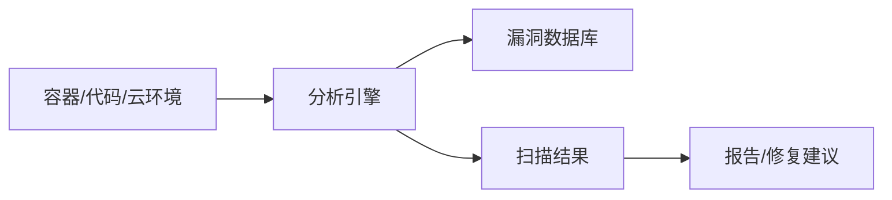

**技术特色**：
- 支持多种目标类型（容器镜像、文件系统、Git仓库、Kubernetes等）
- 使用轻量级扫描方法，无需部署额外组件
- 集成多个漏洞数据库（NVD、GitHub Advisory Database等）

#### 热度分析

- 项目Star数超过3.5万，近期每日增长约250，表明其在安全领域受到广泛关注和认可
- 作为容器安全领域的领先工具，Trivy已融入多个开源项目生态，并与主流CI/CD工具有良好集成

#### 快速上手

```bash
# 扫描容器镜像中的漏洞
trivy image your-image:tag

# 扫描文件系统中的漏洞
trivy fs /path/to/directory

# 生成HTML报告
trivy image --format html -o report.html your-image:tag
```

#### 注意事项

- 扫描大型镜像或仓库时可能需要较长时间和较多内存资源
- 定期更新漏洞数据库以确保检测结果的准确性
- 对于生产环境，建议结合其他安全工具形成多层次防护体系


### 10. lfnovo/open-notebook — 开源笔记本助手

> **一句话总结**：开源实现的 Notebook LM，提供更灵活的笔记管理和 AI 辅助功能。

#### 价值主张

| 维度 | 说明 |
|------|------|
| **解决痛点** | 打破封闭生态，提供可定制的 AI 笔记助手解决方案 |
| **目标用户** | 开发者、研究人员、知识工作者和笔记爱好者 |
| **核心亮点** | 开源可定制 + AI 辅助 + 多格式支持 + 隐私保护 |

#### 技术架构

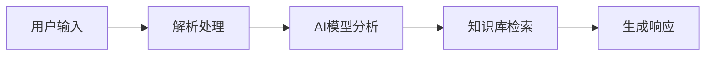

**技术特色**：
- 基于 TypeScript 开发，提供类型安全和良好的开发体验
- 采用模块化设计，便于扩展和定制
- 集成多种 AI 模型，支持本地和云端部署

#### 热度分析

- 项目获得 25k+ 星标，近期增长迅速，表明社区认可度高
- 0 个开放问题，说明项目维护良好，问题解决效率高

#### 快速上手

```bash
# 克隆仓库
git clone https://github.com/lfnovo/open-notebook.git

# 安装依赖
cd open-notebook
npm install

# 启动服务
npm run dev
```

#### 注意事项

- 项目许可证未知，使用前需确认许可条款
- 部分功能可能需要配置 API 密钥或本地 AI 模型
- 建议查阅项目文档了解完整部署和配置流程


### 11. mvanhorn/last30days-skill — AI跨平台研究工具

> **一句话总结**：AI代理技能，跨多平台研究主题并生成基于事实的综合摘要。

#### 价值主张

| 维度 | 说明 |
|------|------|
| **解决痛点** | 解决跨平台信息收集困难与信息过载问题 |
| **目标用户** | 研究人员、内容创作者、市场分析师 |
| **核心亮点** | 多平台整合 + AI驱动信息处理 + 自动生成摘要 |

#### 技术架构

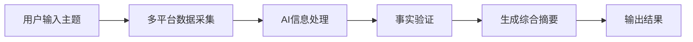

**技术特色**：
- 多平台API集成技术
- 大规模信息过滤与排序算法
- 事实核查与准确性验证机制

#### 热度分析

- 项目拥有超过27,600个星标，且每天都有新增，表明其受到广泛关注和持续增长
- 作为AI应用工具，处于AI代理生态的前沿位置，专注于信息聚合与分析领域

#### 快速上手

```bash
# 克隆项目
git clone https://github.com/mvanhorn/last30days-skill.git
# 安装依赖
pip install -r requirements.txt
```

#### 注意事项

- 需要API密钥访问各平台数据
- 可能受到各平台使用限制和速率约束


### 12. PaddlePaddle/PaddleOCR — 轻量级OCR引擎

> **一句话总结**：支持100+语言的轻量级OCR工具，将图像/PDF转化为结构化数据，便于AI应用。

#### 价值主张

| 维度 | 说明 |
|------|------|
| **解决痛点** | 将图像和PDF中的非结构化数据转换为结构化数据，便于AI系统处理和理解 |
| **目标用户** | AI开发者、数据科学家、文档处理系统开发者等需要从图像和PDF中提取文本的专业人士 |
| **核心亮点** | 多语言支持 + 轻量级设计 + 与LLM无缝集成 + 高精度识别 + 易于集成 |

#### 技术架构

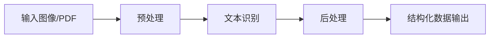

**技术特色**：
- 基于PaddlePaddle深度学习框架，提供高精度识别能力
- 支持100+语言，包括中英文、日文、韩文等多种语言
- 轻量级设计，易于集成到各种AI应用中

#### 热度分析

- 项目拥有近8万Star和1万Fork，且Star数持续增长(+141 today)，表明其在OCR领域受到广泛关注和认可
- 作为百度PaddlePaddle生态的重要组成部分，该项目在开源OCR领域具有重要地位，并与大型语言模型生态紧密结合

#### 快速上手

```bash
# 安装
pip install paddlepaddle paddleocr

# 使用
from paddleocr import PaddleOCR
ocr = PaddleOCR(use_angle_cls=True, lang='ch')
result = ocr.ocr('image.jpg', cls=True)
```

#### 注意事项

- 项目依赖PaddlePaddle深度学习框架，需要相应的GPU支持
- 对于大规模文档处理，可能需要考虑性能优化和批处理策略
- 项目支持100+语言，但某些小语种的识别精度可能不如主流语言


### 13. NVIDIA/cosmos — 物理AI平台

> **一句话总结**：提供世界模型、数据集和工具链，赋能开发者构建面向机器人和自动驾驶的物理AI系统。

#### 价值主张

| 维度 | 说明 |
|------|------|
| **解决痛点** | 物理AI开发缺乏统一平台和数据集，导致开发效率低下和模型泛化能力差 |
| **目标用户** | 机器人开发者、自动驾驶研究员、智能系统工程师和物理AI研究者 |
| **核心亮点** | 世界模型平台 + 多领域数据集 + 物理AI工具链 + NVIDIA技术支持 + 开源协作生态 |

#### 技术架构

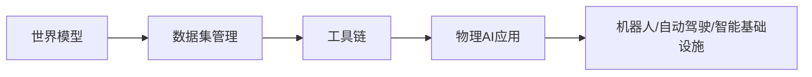

**技术特色**：
- 基于NVIDIA GPU加速的物理模拟引擎
- 多模态传感器数据融合处理能力
- 跨平台兼容的AI模型训练框架
- 可扩展的世界模型架构
- 大规模物理场景数据集支持

#### 热度分析

- 项目Star数达9060，近期每日增长约133，表明受到广泛关注和认可
- 作为NVIDIA官方项目，在物理AI领域具有生态引领作用，社区活跃度高

#### 快速上手

```bash
# 克隆仓库
git clone https://github.com/NVIDIA/cosmos.git
# 安装依赖
pip install -r requirements.txt
# 启动Jupyter环境
jupyter notebook
```

#### 注意事项

- 项目依赖NVIDIA GPU硬件进行最佳性能
- 需要一定的物理AI和深度学习基础
- 部分组件可能需要额外申请权限或许可
- 文档可能需要进一步补充完善


### 14. github/copilot-sdk — AI代码助手SDK

> **一句话总结**：GitHub官方发布的跨平台SDK，使开发者能轻松将Copilot AI代码助手功能集成到各类应用中。

#### 价值主张

| 维度 | 说明 |
|------|------|
| **解决痛点** | 解决Copilot AI能力难以集成到第三方应用和服务的壁垒 |
| **目标用户** | 需要集成AI代码辅助功能的IDE、编辑器及SaaS服务开发者 |
| **核心亮点** | 跨平台支持 + 简单集成API + 官方维护 + 灵活配置选项 |

#### 技术架构

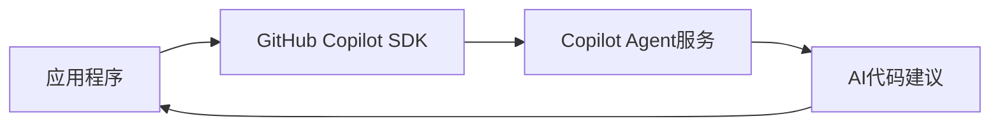

**技术特色**：
- 基于Java开发，支持跨平台部署
- 提供统一API接口，简化集成流程
- 采用模块化设计，支持功能定制

#### 热度分析

- 项目获近9k星且持续增长，日均新增约38星，显示开发者社区对AI辅助编程工具的强烈需求
- 作为GitHub官方推出的SDK，处于AI编程辅助领域的核心生态位置，有望成为行业标准解决方案

#### 快速上手

```bash
# 添加依赖到Maven项目
mvn com.github.copilot:copilot-sdk:1.0.0

# 初始化Copilot客户端
CopilotClient client = new CopilotClient("your-api-key");

# 获取代码建议
String suggestion = client.getSuggestion("function calculateSum(numbers) {");
```

#### 注意事项

- 需要有效的GitHub Copilot API密钥才能使用
- 需考虑数据隐私和代码安全问题，特别是处理敏感代码时
- 使用时需遵守GitHub Copilot的使用条款和限制


## 今日推荐

| 主题 | 推荐项目 | 亮点 |
|------|----------|------|
| 今日最热 | [chopratejas/headroom](https://github.com/chopratejas/headroom) | Compress tool out... |
| 值得关注 | [NousResearch/hermes-agent](https://github.com/NousResearch/hermes-agent) | The agent that gr... |
| 快速上手 | [affaan-m/ECC](https://github.com/affaan-m/ECC) | The agent harness... |
| 长期潜力 | [jwasham/coding-interview-university](https://github.com/jwasham/coding-interview-university) | A complete comput... |

---

<div align="center">

*Generated on 2026-06-05 | Powered by GitHub Trending Reporter*

</div>