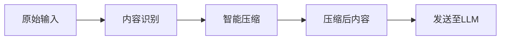
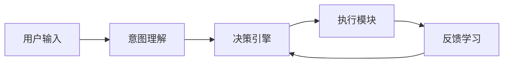
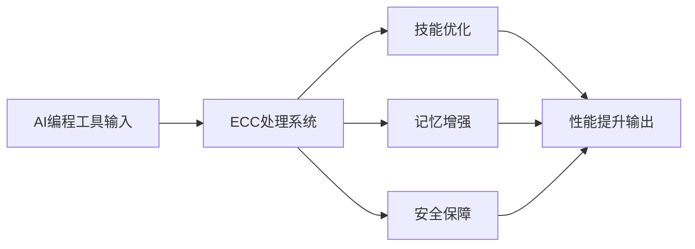
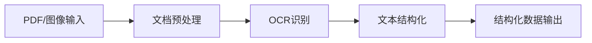
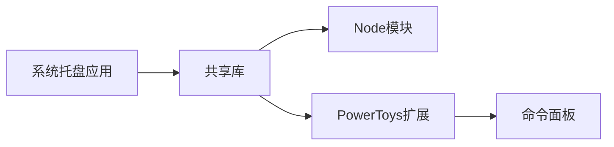
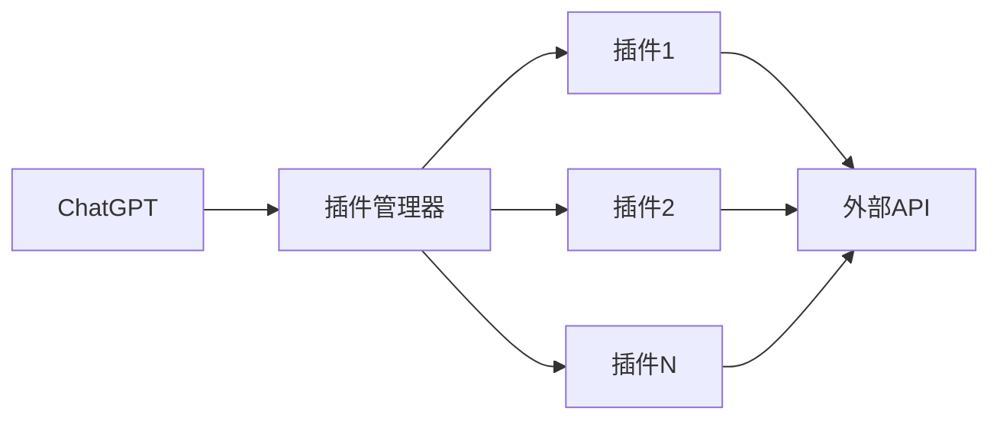

## 今日热点

AI代理技术呈现爆发式增长，从性能优化到多功能应用，同时AI工具与实际场景的融合加速，标志着智能系统进入实用化新阶段。

---

## 热门项目一览

| 排名 | 项目 | 语言 | 今日 | 总计 | 简介 |
|:---:|------|:----:|------:|-----:|------|
| 1 | [chopratejas/headroom](https://github.com/chopratejas/headroom) | Python | +2,473 | 14,573 | Compress tool outputs, logs... |
| 2 | [NousResearch/hermes-agent](https://github.com/NousResearch/hermes-agent) | Python | +1,845 | 183,227 | The agent that grows with you |
| 3 | [affaan-m/ECC](https://github.com/affaan-m/ECC) | JavaScript | +1,361 | 208,402 | The agent harness performan... |
| 4 | [lfnovo/open-notebook](https://github.com/lfnovo/open-notebook) | TypeScript | +1,152 | 26,046 | An Open Source implementati... |
| 5 | [PaddlePaddle/PaddleOCR](https://github.com/PaddlePaddle/PaddleOCR) | Python | +747 | 80,571 | Turn any PDF or image docum... |
| 6 | [jwasham/coding-interview-university](https://github.com/jwasham/coding-interview-university) | Unknown | +745 | 350,412 | A complete computer science... |
| 7 | [mvanhorn/last30days-skill](https://github.com/mvanhorn/last30days-skill) | Python | +731 | 28,240 | AI agent skill that researc... |
| 8 | [NVIDIA/cosmos](https://github.com/NVIDIA/cosmos) | Jupyter Notebook | +479 | 9,433 | NVIDIA Cosmos is an open pl... |
| 9 | [CopilotKit/CopilotKit](https://github.com/CopilotKit/CopilotKit) | TypeScript | +366 | 32,727 | The Frontend Stack for Agen... |
| 10 | [openclaw/openclaw-windows-node](https://github.com/openclaw/openclaw-windows-node) | C# | +326 | 1,615 | Windows companion suite for... |
| 11 | [666ghj/MiroFish](https://github.com/666ghj/MiroFish) | Python | +320 | 64,728 | A Simple and Universal Swar... |
| 12 | [github/copilot-sdk](https://github.com/github/copilot-sdk) | Java | +309 | 9,258 | Multi-platform SDK for inte... |

---

## 趋势洞察

```
┌─────────────────────────────────────────────────────────────────┐
│  AI/ML 工具         ████████████████████████  13 个项目        │
│  其他               ███████                   4 个项目        │
└─────────────────────────────────────────────────────────────────┘
```

---

## 项目深度解读

### 1. chopratejas/headroom — LLM输入压缩器

> **一句话总结**：智能压缩LLM输入内容，减少60-95%token用量，保持相同回答质量。

#### 价值主张

| 维度 | 说明 |
|------|------|
| **解决痛点** | LLM处理大量输入时token成本高、响应慢的问题 |
| **目标用户** | 使用LLM API的开发者、研究人员和企业应用构建者 |
| **核心亮点** | + 减少60-95%token使用量 + 保持LLM回答质量不变 + 支持多种压缩场景 + 提供三种使用方式 |

#### 技术架构



**技术特色**：
- 基于语义的智能压缩算法
- 支持多种内容类型的识别与处理
- 保持关键信息不丢失的压缩策略

#### 热度分析

- 项目单日增长2,400+ stars，显示社区高度关注和认可
- Fork数相对较少，表明项目可能处于早期阶段或主要是作为库使用

#### 快速上手

```bash
# 安装headroom
pip install headroom

# 作为库使用
from headroom import compress
compressed = compress(your_content)

# 作为代理运行
headroom --proxy
```

#### 注意事项

- 项目许可证未知，商业使用前需确认许可条款
- 压缩算法可能会影响某些特定场景下的回答质量，需进行充分测试
- 项目处于早期阶段，API可能会有较大变动


### 2. NousResearch/hermes-agent — 自适应智能代理

> **一句话总结**：具有自主学习能力的开源代理框架，随用户使用不断进化成长。

#### 价值主张

| 维度 | 说明 |
|------|------|
| **解决痛点** | 解决传统代理系统缺乏长期适应性和学习能力的问题 |
| **目标用户** | AI研究人员、开发者及需要智能代理解决方案的企业 |
| **核心亮点** | 自主学习 + 模块化架构 + 场景自适应 + 持续进化 + 开放生态 |

#### 技术架构



**技术特色**：
- 基于强化学习的自适应决策机制
- 模块化设计支持灵活扩展与定制
- 持续学习架构实现长期能力成长

#### 热度分析

- 项目获18万+星标，日增近2千，表明社区认可度极高且增长迅速
- 作为智能代理领域的领先项目，在AI工具生态中占据关键位置

#### 快速上手

```bash
# 克隆仓库
git clone https://github.com/NousResearch/hermes-agent.git
cd hermes-agent

# 安装依赖并初始化
pip install -r requirements.txt
python init_agent.py --config default_config.yaml
```

#### 注意事项

- 需要一定的机器学习和AI基础知识才能充分利用该框架
- 项目文档可能需要进一步完善，特别是对于新用户
- 使用时需注意开源许可证限制和合规性要求


### 3. affaan-m/ECC — AI编程优化

> **一句话总结**：提升AI编程助手性能的系统，优化技能、记忆与安全，支持多种主流AI开发工具。

#### 价值主张

| 维度 | 说明 |
|------|------|
| **解决痛点** | 提升AI编程助手的性能、记忆力和安全性，解决AI辅助开发效率问题 |
| **目标用户** | 使用Claude Code、Codex、Opencode、Cursor等AI编程工具的开发者 |
| **核心亮点** | 技能优化 + 记忆增强 + 安全保障 + 研发优先 + 多平台兼容 |

#### 技术架构



**技术特色**：
- 基于JavaScript开发的轻量级优化系统
- 多平台兼容的AI编程助手增强方案
- 研究优先的性能优化方法论

#### 热度分析

- 项目Star数超过20万，日增千余，显示极高的社区关注度和采用率
- 在AI编程工具优化领域处于领先地位，生态影响力显著

#### 快速上手

```bash
# 克隆项目
git clone https://github.com/affaan-m/ECC.git

# 安装依赖
npm install

# 根据文档配置与AI编程工具的集成
```

#### 注意事项

- 项目许可证未知，使用前需确认授权条款
- 集成前需确认与目标AI编程工具的兼容性
- 可能需要特定的配置才能发挥最佳性能


### 4. lfnovo/open-notebook — AI笔记本开源实现

> **一句话总结**：开源实现的AI笔记本系统，提供灵活性和增强功能，替代专有Notebook LM服务。

#### 价值主张

| 维度 | 说明 |
|------|------|
| **解决痛点** | 提供开源替代方案，摆脱专有Notebook LM的限制和成本 |
| **目标用户** | 需要AI辅助笔记和知识管理的开发者和研究人员 |
| **核心亮点** | 开源可定制 + 增强功能 + 灵活部署 + 隐私保护 + 成本效益 |

#### 技术架构


**技术特色**：
- 基于TypeScript构建，提供类型安全
- 开源实现，支持本地部署
- 集成先进LLM模型，增强笔记智能性
- 支持多种笔记格式和扩展

#### 热度分析

- 项目Star数超过26,000，近期增长迅速，日均新增约1,150个Star，表明社区高度认可
- Fork数近3,000，显示开发者积极参与二次开发和功能扩展

#### 快速上手

```bash
# 克隆项目
git clone https://github.com/lfnovo/open-notebook.git
# 安装依赖
npm install
# 启动开发服务器
npm run dev
```

#### 注意事项

- 需要Node.js环境运行
- 可能需要配置API密钥用于LLM服务
- 项目文档似乎不完整，可能需要查看源码了解详细配置


### 5. PaddlePaddle/PaddleOCR — AI文档解析工具

> **一句话总结**：强大轻量级的OCR工具包，连接图像/PDF与大语言模型，支持100+语言。

#### 价值主张

| 维度 | 说明 |
|------|------|
| **解决痛点** | 解决非结构化文档数据难以被AI理解利用的问题 |
| **目标用户** | AI开发者、数据科学家、企业文档处理团队 |
| **核心亮点** | 多语言支持 + 高精度识别 + 与LLM无缝集成 + 轻量级部署 |

#### 技术架构



**技术特色**：
- 基于PaddlePaddle深度学习框架，提供高精度识别能力
- 支持多种文档格式和100+语言，适应性强
- 与大语言模型无缝集成，便于AI应用开发

#### 热度分析

- Star数8万+且持续增长(+747/天)，表明项目备受关注且发展迅速
- 作为百度开源的OCR工具，在AI文档处理领域占据重要生态位置

#### 快速上手

```bash
# 安装PaddleOCR
pip install paddlepaddle paddleocr

# 基本使用示例
from paddleocr import PaddleOCR
ocr = PaddleOCR(use_angle_cls=True, lang='ch')
result = ocr.ocr('example.jpg', cls=True)
print(result)
```

#### 注意事项

- 项目依赖PaddlePaddle深度学习框架，需要相应的计算资源
- 对于生产环境使用，建议根据具体场景进行模型优化和参数调整


### 6. jwasham/coding-interview-university — 计算机科学学习指南

> **一句话总结**：全面的计算机科学学习计划，帮助求职者系统掌握软件工程师所需的核心知识与技能。

#### 价值主张

| 维度 | 说明 |
|------|------|
| **解决痛点** | 提供系统化计算机科学学习路径，解决求职者知识零散问题 |
| **目标用户** | 准备软件工程师职位的求职者，包括转行者和应届生 |
| **核心亮点** | 全面覆盖计算机科学核心领域 + 结构化学习路径 + 实用资源推荐 |

#### 技术架构


**技术特色**：
- 覆盖计算机科学全栈知识体系
- 提供结构化学习路径与时间规划
- 包含面试技巧与实战资源

#### 热度分析

- 高星高fork项目，日增星数稳定在700+，表明持续受求职者关注
- 作为开源学习资源，已成为计算机科学学习领域的标杆项目

#### 快速上手

```bash
# 克隆项目到本地
git clone https://github.com/jwasham/coding-interview-university.git

# 进入项目目录查看学习计划
cd coding-interview-university && ls
```

#### 注意事项

- 学习计划较全面，需要投入大量时间，建议根据个人情况调整进度
- 部分资源链接可能需要更新，建议结合最新资料学习
- 除了理论学习，务必加强编程实践，尤其是算法和数据结构


### 7. mvanhorn/last30days-skill — 跨平台AI研究

> **一句话总结**：AI代理技能，跨多平台收集信息并生成基于事实的总结报告

#### 价值主张

| 维度 | 说明 |
|------|------|
| **解决痛点** | 解决信息过载问题，快速整合多平台最新内容 |
| **目标用户** | 研究人员、内容创作者、市场分析师 |
| **核心亮点** | + 跨平台信息收集 + AI内容合成 + 时间窗口限制 + 事实基础总结 |

#### 技术架构


**技术特色**：
- 多平台API集成技术
- 大语言模型内容合成
- 信息验证与去重机制
- 时间窗口限制处理

#### 热度分析

- 项目获得28,240个Star，731日增，显示AI研究工具领域高度关注
- 高社区活跃度，在AI代理技能领域占据重要生态位置

#### 快速上手

```bash
# 安装项目
pip install last30days-skill

# 使用示例
last30days-skill "人工智能最新发展"
```

#### 注意事项

- 需要确保API密钥配置正确以访问各个平台
- 注意各平台的使用限制和数据获取政策
- 总结内容可能需要人工验证以确保准确性


### 8. NVIDIA/cosmos — 物理AI平台

> **一句话总结**：NVIDIA Cosmos提供世界模型、数据集和工具，助力开发者构建面向机器人、自动驾驶等领域的物理AI系统。

#### 价值主张

| 维度 | 说明 |
|------|------|
| **解决痛点** | 解决物理AI开发中模型构建、数据获取和工具集成的挑战 |
| **目标用户** | 机器人、自动驾驶和智能基础设施领域的AI开发者和研究人员 |
| **核心亮点** | 提供世界模型 + 物理AI工具集 + 开放数据平台 + 跨领域应用支持 + NVIDIA技术加持 |

#### 技术架构


**技术特色**：
- 基于物理规律的世界建模
- 跨领域的物理AI工具集成
- NVIDIA GPU加速的模拟与训练

#### 热度分析

- Star数9,433且近期增长迅速(+479 today)，表明项目受到高度关注
- 作为NVIDIA推出的物理AI平台，在机器人、自动驾驶等领域具有重要生态地位

#### 快速上手

```bash
# 克隆仓库
git clone https://github.com/NVIDIA/cosmos.git

# 运行示例notebook
cd cosmos && jupyter notebook examples/
```

#### 注意事项

- 由于项目信息有限，实际使用时需要参考官方文档
- 作为NVIDIA项目，可能需要NVIDIA硬件支持以获得最佳性能
- 物理AI开发需要相关领域的专业知识


### 9. CopilotKit/CopilotKit — AI前端框架

> **一句话总结**：提供构建AI代理和生成式UI的完整前端解决方案，支持React和Angular框架。

#### 价值主张

| 维度 | 说明 |
|------|------|
| **解决痛点** | 简化AI代理和生成式UI的开发流程，降低技术门槛 |
| **目标用户** | 前端开发者、AI应用构建者、UI/UX设计师 |
| **核心亮点** | AG-UI协议支持 + React/Angular双框架支持 + 生成式UI能力 + AI代理集成 |

#### 技术架构


**技术特色**：
- 基于TypeScript开发，提供类型安全
- AG-UI协议标准化AI代理与UI交互
- 模块化设计，支持灵活扩展
- 跨框架兼容，适配不同技术栈

#### 热度分析

- 项目Star数超32k，近期增长迅速(+366 today)，表明社区活跃度高，需求旺盛
- 作为AI前端工具，处于AI应用生态的关键位置，连接AI能力和用户界面

#### 快速上手

```bash
# 安装CopilotKit React版本
npm install @copilotkit/react

# 在应用中初始化
import { CopilotKit } from '@copilotkit/react';

function App() {
  return <CopilotKit>{/* 应用组件 */}</CopilotKit>;
}
```

#### 注意事项

- 项目License未知，使用前需确认授权条款
- 需要理解AG-UI协议才能充分利用项目功能
- 集成AI服务可能需要额外的API密钥和配置
- 项目仍在快速发展中，API可能会有变化


### 10. openclaw/openclaw-windows-node — Windows 系统增强

> **一句话总结**：为 Windows 系统提供托盘应用、共享库和命令面板扩展的全方位系统增强工具。

#### 价值主张

| 维度 | 说明 |
|------|------|
| **解决痛点** | 提升 Windows 系统操作效率，提供便捷的系统管理和访问入口 |
| **目标用户** | Windows 高级用户、系统管理员、效率工具爱好者 |
| **核心亮点** | 系统托盘集成 + Node.js 支持 + PowerToys 集成 + 命令面板扩展 |

#### 技术架构



**技术特色**：
- 基于 C# 开发的 Windows 原生应用，确保系统兼容性和性能
- 集成 Node.js 环境，扩展脚本能力和生态
- 与 PowerToys 深度整合，利用系统级扩展能力

#### 热度分析

- 项目近期 Star 增长迅速(+326 today)，显示社区关注度高，可能因新功能发布引发关注
- 作为 Windows 生态工具，在 PowerToys 用户群体中有良好定位，但生态规模相对较小

#### 快速上手

```bash
# 克隆项目
git clone https://github.com/openclaw/openclaw-windows-node.git
# 安装依赖
npm install
# 构建项目
npm run build
```

#### 注意事项

- 项目许可证未知，可能存在使用限制
- 作为系统级工具，需要管理员权限安装和运行
- 依赖 Windows 系统和 PowerToYS 环境，兼容性受限


### 11. 666ghj/MiroFish — 智能预测引擎

> **一句话总结**：基于群体智能的通用预测引擎，可应用于多种场景的预测任务。

#### 价值主张

| 维度 | 说明 |
|------|------|
| **解决痛点** | 简化复杂预测任务，提供通用智能解决方案 |
| **目标用户** | 数据科学家、研究人员、预测模型开发者 |
| **核心亮点** | 通用性强 + 简单易用 + 高效预测 + 可扩展架构 |

#### 技术架构


**技术特色**：
- 基于群体智能算法的预测引擎
- 通用性强，适应多种预测场景
- 简洁优雅的实现方式

#### 热度分析

- 项目获得超过6万星，近期每日新增320星，增长迅速
- Fork数量超过1万，表明社区参与度高，二次开发活跃

#### 快速上手

```bash
# 安装MiroFish
pip install MiroFish

# 基本使用示例
from MiroFish import Predictor
predictor = Predictor()
result = predictor.predict(input_data)
```

#### 注意事项

- 需要确认项目的具体许可证
- 建议查看项目文档了解详细使用方法
- 注意模型性能可能因应用场景而异


### 12. github/copilot-sdk — AI代码助手平台

> **一句话总结**：多平台SDK，让开发者轻松将GitHub Copilot AI代码助手能力集成到自己的应用和服务中。

#### 价值主张

| 维度 | 说明 |
|------|------|
| **解决痛点** | 为开发者提供将Copilot AI能力无缝集成到自定义应用的标准化方案 |
| **目标用户** | 需要集成AI代码助手功能的开发者、企业和应用平台 |
| **核心亮点** | 跨平台支持 + AI代码智能 + 无缝集成 + 开源开放 |

#### 技术架构


**技术特色**：
- 基于Java构建，支持多平台部署
- 提供标准API接口，简化Copilot功能集成
- 采用模块化设计，便于功能扩展和定制

#### 热度分析
- 项目Star数达9258，单日增长309，热度持续攀升
- 作为GitHub官方SDK，处于AI辅助编程生态的核心位置

#### 快速上手

```bash
# 添加依赖到项目中
mvn com.github.copilot:copilot-sdk:latest-version

# 初始化Copilot客户端
CopilotClient client = new CopilotClient("your-api-key");

# 使用Copilot获取代码建议
String suggestion = client.getCodeSuggestion("your-code-context");
```

#### 注意事项
- 需要GitHub Copilot API密钥才能使用
- 可能需要订阅Copilot服务以获得完整功能
- 集成前需了解Copilot的使用限制和条款


### 13. MemPalace/mempalace — AI记忆系统

> **一句话总结**：开源高性能AI记忆系统，经过充分基准测试，完全免费提供。

#### 价值主张

| 维度 | 说明 |
|------|------|
| **解决痛点** | AI应用中高效记忆存储与检索的瓶颈问题 |
| **目标用户** | AI开发者、研究人员和企业应用构建者 |
| **核心亮点** | 高性能记忆存储 + 全面基准测试 + 开源免费 + 跨平台支持 |

#### 技术架构


**技术特色**：
- 采用高效记忆索引算法，加速检索速度
- 支持多模态记忆存储与处理
- 内置性能基准测试工具套件
- 提供Python API和命令行双接口

#### 热度分析

- 项目获得5.3万stars且持续增长，表明在AI记忆系统领域具有重要影响力
- 零开放问题反映项目成熟度高，社区维护良好

#### 快速上手

```bash
# 安装 MemPalace
pip install mempalace

# 初始化记忆系统
mempalace init --model gpt-3.5-turbo

# 添加记忆并查询
mempalace add "用户偏好设置"
mempalace query "用户偏好"
```

#### 注意事项

- 项目许可证信息不明确，使用前需确认具体许可条款
- 记忆系统可能与特定AI模型深度集成，需注意兼容性
- 大规模部署时需考虑内存和计算资源消耗


### 14. aquasecurity/trivy — 安全漏洞扫描器

> **一句话总结**：全栈式安全扫描工具，可检测容器、Kubernetes、代码等多环境漏洞、配置错误和敏感信息。

#### 价值主张

| 维度 | 说明 |
|------|------|
| **解决痛点** | 提供一站式安全扫描解决方案，覆盖从开发到部署的全流程安全检测 |
| **目标用户** | DevOps工程师、安全团队、容器和云平台使用者 |
| **核心亮点** | 高效快速 + 全面检测 + 多环境支持 + 轻量级 + 易于集成 |

#### 技术架构


**技术特色**：
- 基于 Go 语言开发，性能高效，可编译为单一二进制文件
- 支持多种输入源和输出格式，适应不同使用场景
- 内置漏洞数据库，可离线扫描，支持定期更新

#### 热度分析

- 项目 Star 数持续稳定增长，近期单日增长超过 200，表明社区关注度持续提升
- 在容器安全领域处于领先地位，已成为许多安全工具链的重要组成部分

#### 快速上手

```bash
# 安装 Trivy
wget https://github.com/aquasecurity/trivy/releases/latest/download/trivy_0.39.0_Linux-64bit.tar.gz
tar xzvf trivy_0.39.0_Linux-64bit.tar.gz
sudo mv trivy /usr/local/bin/

# 扫描容器镜像
trivy image alpine:latest
```

#### 注意事项

- 扫描大型容器镜像可能需要较长时间和较多内存
- 定期更新漏洞数据库以获取最新的漏洞信息
- 对于生产环境，建议结合其他安全工具使用，形成多层次防护


### 15. Panniantong/Agent-Reach — AI全网访问工具

> **一句话总结**：单CLI命令免费访问多平台网络内容，为AI代理提供互联网视野。

#### 价值主张

| 维度 | 说明 |
|------|------|
| **解决痛点** | 解决AI代理无法直接访问和整合多平台网络内容的限制 |
| **目标用户** | AI开发者、研究人员、数据分析师、内容创作者 |
| **核心亮点** | + 多平台整合 + 零API费用 + CLI简单操作 + 实时数据获取 |

#### 技术架构


**技术特色**：
- 统一API接口整合多平台数据源
- 无需官方API密钥的替代访问方案
- 轻量级CLI设计便于集成到AI工作流

#### 热度分析

- 项目获得超2万星，增长迅速，表明AI开发者对网络数据访问工具有强烈需求
- Fork数量适中，说明项目被广泛采用但社区贡献相对有限

#### 快速上手

```bash
# 安装
pip install agent-reach

# 使用示例
agent-reach --platform twitter --query "AI trends" --output json
```

#### 注意事项

- 项目可能涉及平台使用条款合规性问题
- 长期稳定性依赖于各平台接口的变化
- 数据获取速度可能受平台限制影响


### 16. withastro/flue — 沙盒代理框架

> **一句话总结**：提供安全隔离的代码执行环境，支持多语言代理与资源限制的轻量级框架。

#### 价值主张

| 维度 | 说明 |
|------|------|
| **解决痛点** | 解决动态代码执行的安全隔离问题，防止恶意代码影响宿主环境 |
| **目标用户** | 需要安全执行不可信代码的开发者、安全研究人员和DevOps团队 |
| **核心亮点** | 沙盒隔离 + 多语言支持 + 资源限制 + 轻量级设计 + 可扩展架构 |

#### 技术架构


**技术特色**：
- 基于TypeScript构建，提供类型安全保证
- 实现资源隔离与限制，防止系统资源滥用
- 支持多种编程语言在隔离环境中执行

#### 热度分析

- 项目获得4542个星标，单日增长126个，显示社区关注度快速上升
- Issues数为0，表明项目处于早期阶段，社区互动尚未充分展开

#### 快速上手

```bash
# 安装Flue框架
npm install @withastro/flue

# 创建并运行沙盒环境
npx flue create --name my-sandbox
npx flue run my-sandbox --file ./script.js
```

#### 注意事项

- 项目许可证信息未知，商业使用前需确认授权条款
- 项目Issues数量为0，可能意味着稳定性尚未充分验证
- 沙盒环境虽提供隔离，但仍需注意潜在的逃逸风险和边界情况


### 17. openai/plugins — AI插件系统

> **一句话总结**：OpenAI官方插件系统，扩展ChatGPT功能边界，实现AI助手与外部服务的安全集成。

#### 价值主张

| 维度 | 说明 |
|------|------|
| **解决痛点** | 突破ChatGPT知识局限，实现与外部API和服务的安全连接 |
| **目标用户** | AI应用开发者、企业用户、需要定制化AI功能的开发者 |
| **核心亮点** | 安全插件架构 + 统一API接口 + 多领域扩展能力 + 官方审核机制 |

#### 技术架构



**技术特色**：
- 基于JavaScript/TypeScript的插件开发框架，提供类型安全
- 实现了插件沙箱环境，确保安全隔离
- 提供认证机制和API密钥管理，保障数据安全

#### 热度分析

- 项目获得1553颗星且持续增长(+49 today)，表明OpenAI插件生态正快速发展
- 作为OpenAI官方项目，处于AI应用开发生态的核心位置，社区活跃度高

#### 快速上手

```bash
# 克隆仓库
git clone https://github.com/openai/plugins.git

# 安装依赖
cd plugins && npm install

# 启动开发服务器
npm run dev
```

#### 注意事项

- 插件开发需要遵循OpenAI的安全准则和API规范
- 插件需要通过OpenAI的审核才能在ChatGPT中使用
- 注意API调用频率和成本控制，避免过度依赖外部API


## 今日推荐

| 主题 | 推荐项目 | 亮点 |
|------|----------|------|
| 今日最热 | [chopratejas/headroom](https://github.com/chopratejas/headroom) | Compress tool out... |
| 值得关注 | [NousResearch/hermes-agent](https://github.com/NousResearch/hermes-agent) | The agent that gr... |
| 快速上手 | [affaan-m/ECC](https://github.com/affaan-m/ECC) | The agent harness... |
| 长期潜力 | [lfnovo/open-notebook](https://github.com/lfnovo/open-notebook) | An Open Source im... |

---

<div align="center">

*Generated on 2026-06-06 | Powered by GitHub Trending Reporter*

</div>