## 今日热点

今日GitHub热榜项目精彩纷呈。

---

## 热门项目一览

| 排名 | 项目 | 语言 | 今日 | 总计 | 简介 |
|:---:|------|:----:|------:|-----:|------|
| 1 | [lfnovo/open-notebook](https://github.com/lfnovo/open-notebook) | TypeScript | +794 | 26,654 | An Open Source implementati... |
| 2 | [obra/superpowers](https://github.com/obra/superpowers) | Shell | +700 | 219,711 | An agentic skills framework... |
| 3 | [Panniantong/Agent-Reach](https://github.com/Panniantong/Agent-Reach) | Python | +683 | 22,395 | Give your AI agent eyes to ... |
| 4 | [CopilotKit/CopilotKit](https://github.com/CopilotKit/CopilotKit) | TypeScript | +631 | 33,248 | The Frontend Stack for Agen... |
| 5 | [MemPalace/mempalace](https://github.com/MemPalace/mempalace) | Python | +446 | 54,316 | The best-benchmarked open-s... |
| 6 | [mvanhorn/last30days-skill](https://github.com/mvanhorn/last30days-skill) | Python | +439 | 28,899 | AI agent skill that researc... |
| 7 | [PaddlePaddle/PaddleOCR](https://github.com/PaddlePaddle/PaddleOCR) | Python | +433 | 80,994 | Turn any PDF or image docum... |
| 8 | [microsoft/VibeVoice](https://github.com/microsoft/VibeVoice) | Python | +216 | 48,492 | Open-Source Frontier Voice AI |
| 9 | [openai/plugins](https://github.com/openai/plugins) | JavaScript | +213 | 1,796 | OpenAI Plugins |
| 10 | [santifer/career-ops](https://github.com/santifer/career-ops) | JavaScript | +193 | 49,413 | AI-powered job search syste... |
| 11 | [aquasecurity/trivy](https://github.com/aquasecurity/trivy) | Go | +159 | 36,015 | Find vulnerabilities, misco... |
| 12 | [openai/whisper](https://github.com/openai/whisper) | Python | +150 | 101,889 | Robust Speech Recognition v... |

---

## 趋势洞察

```
┌─────────────────────────────────────────────────────────────────┐
│  AI/ML 工具         ████████████████████████  13 个项目        │
│  其他               ███████                   4 个项目        │
│  开发工具             █                         1 个项目        │
└─────────────────────────────────────────────────────────────────┘
```

---

## 项目深度解读

### 1. lfnovo/open-notebook — 智能笔记本工具

> **一句话总结**：开源实现的 Notebook LM，提供更灵活的智能笔记体验。

#### 价值主张

| 维度 | 说明 |
|------|------|
| **解决痛点** | 打破封闭笔记工具限制，提供开源可定制的智能笔记方案 |
| **目标用户** | 开发者、研究人员、学生等需要高级笔记功能的用户 |
| **核心亮点** | 开源实现 + 高度可定制 + 智能功能增强 + 跨平台支持 |

#### 技术架构

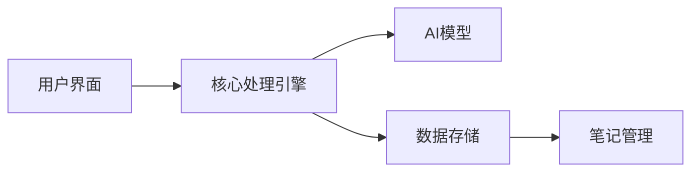

**技术特色**：
- 基于TypeScript开发，保证类型安全
- 模块化架构设计，便于扩展定制
- 智能语义分析，提升笔记处理能力

#### 热度分析

- 项目Star数26,654且日增794，呈现快速增长趋势，社区认可度高
- Fork数3,045表明活跃的开发社区，二次开发意愿强烈

#### 快速上手

```bash
# 克隆仓库
git clone https://github.com/lfnovo/open-notebook.git
# 安装依赖
npm install
# 启动项目
npm run dev
```

#### 注意事项

- 项目License未知，使用前需确认授权条款
- 可能需要Node.js环境及一定TypeScript基础才能完全理解和使用
- 由于是开源实现，功能可能需要自行配置和优化


### 2. obra/superpowers — 技能方法论框架

> **一句话总结**：提供一套完整的代理技能框架和软件开发方法论，帮助开发者提升效率和代码质量。

#### 价值主张

| 维度 | 说明 |
|------|------|
| **解决痛点** | 解决开发者技能体系零散、方法论不系统的问题 |
| **目标用户** | 软件开发者、技术团队和方法论实践者 |
| **核心亮点** | 基于代理的技能框架 + 实用的软件开发方法论 + Shell脚本实现 + 关注实际工作效果 |

#### 技术架构

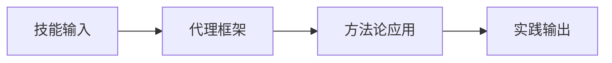

**技术特色**：
- 基于Shell的轻量级实现
- 模块化的技能框架设计
- 注重实用性和可操作性

#### 热度分析

- 项目拥有超21万星，每日增长700+，表明在开发者社区中非常受欢迎且持续增长。
- 作为方法论类项目，其高关注度反映了开发者对系统化技能提升的强烈需求。

#### 快速上手

```bash
# 克隆项目
git clone https://github.com/obra/superpowers.git
# 进入目录
cd superpowers
# 运行主脚本
./superpowers
```

#### 注意事项

- 由于许可证未知，使用时需注意合规性
- 作为方法论项目，实践效果可能因人而异
- Shell脚本在不同系统上可能需要适配


### 3. Panniantong/Agent-Reach — 全网内容获取器

> **一句话总结**：让AI代理通过单一CLI免费获取Twitter、Reddit、YouTube等多平台内容的多功能工具。

#### 价值主张

| 维度 | 说明 |
|------|------|
| **解决痛点** | 解决AI代理无法直接访问多平台内容的问题，无需API费用 |
| **目标用户** | AI开发者、研究人员、内容分析师等需要多平台数据的人群 |
| **核心亮点** | 多平台支持 + CLI界面 + 零API费用 + 一站式获取 |

#### 技术架构

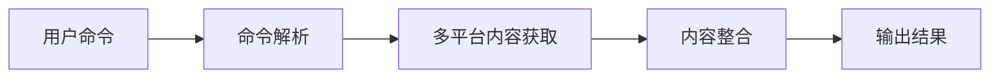

**技术特色**：
- 使用Python实现跨平台爬取
- 统一接口访问不同平台内容
- 零API依赖的设计方案
- CLI友好的交互体验

#### 热度分析

- 项目Star数达2.2万，日增600+，表明项目正快速获得社区认可
- 无Open Issues可能表示项目已成熟稳定或问题处理机制高效

#### 快速上手

```bash
# 安装
pip install agent-reach

# 使用
agent-reach --platform twitter --query "AI research"
```

#### 注意事项

- 项目使用未知许可证，需注意商业使用风险
- 免费获取内容可能涉及各平台的服务条款，需合规使用
- 部分平台可能有反爬虫机制，需注意使用频率限制


### 4. CopilotKit/CopilotKit — AI智能体前端框架

> **一句话总结**：构建AI智能体和生成式UI的全栈解决方案，支持多平台无缝集成。

#### 价值主张

| 维度 | 说明 |
|------|------|
| **解决痛点** | 解决AI能力在前端应用集成和交互体验构建的复杂性 |
| **目标用户** | 需要将AI功能集成到产品中的前端开发者和产品团队 |
| **核心亮点** | AG-UI协议标准化 + 多平台支持 + 前端AI交互优化 |

#### 技术架构

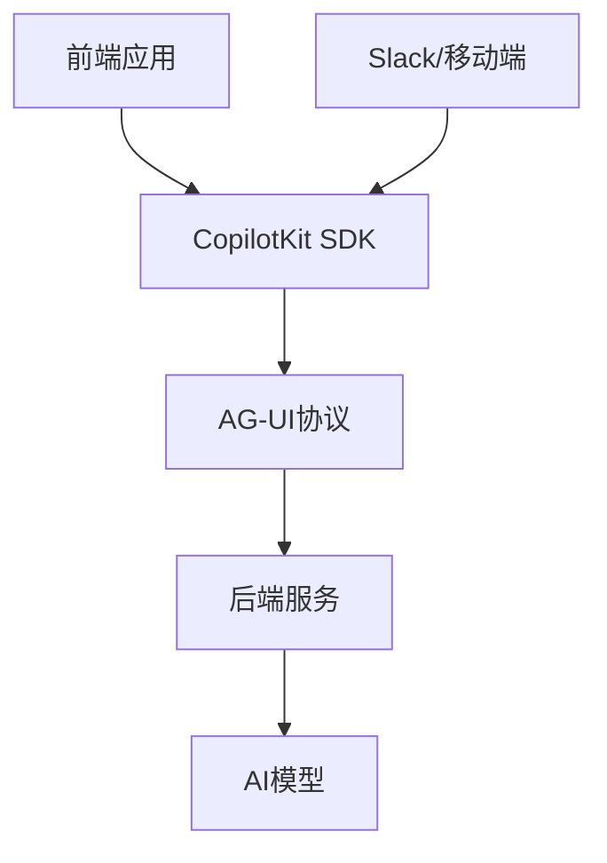

**技术特色**：
- 基于TypeScript的全栈解决方案，提供类型安全保障
- AG-UI协议标准化AI交互体验，降低集成门槛
- 支持React、Angular等多框架统一接入模式

#### 热度分析

- 项目Star数超3万，近期单日增长600+，社区关注度极高
- 作为AI前端工具领域领先项目，正快速构建开发者生态系统

#### 快速上手

```bash
# 安装CopilotKit React包
npm install @copilotkit/react

# 在React应用中初始化
import { CopilotKit } from '@copilotkit/react';
import { CopilotPopup } from '@copilotkit/react-ui';

function App() {
  return (
    <CopilotKit runtimeUrl="YOUR_RUNTIME_URL">
      <CopilotPopup />
    </CopilotKit>
  );
}
```

#### 注意事项

- 项目许可证信息未知，商业使用前需确认授权条款
- Open Issues数量为0，可能表明项目处于早期阶段或问题管理方式不同


### 5. MemPalace/mempalace — AI记忆系统

> **一句话总结**：开源高性能AI记忆系统，提供免费且经过基准测试的内存管理解决方案。

#### 价值主张

| 维度 | 说明 |
|------|------|
| **解决痛点** | 解决AI系统内存管理效率低下、资源占用高等问题 |
| **目标用户** | AI开发者、研究人员及需要高效内存管理的应用 |
| **核心亮点** | 开源免费 + 高性能 + 经过基准测试 + 内存优化 |

#### 技术架构

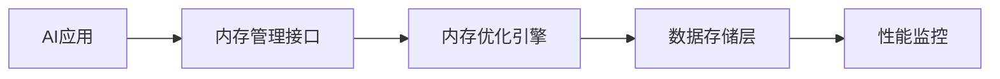

**技术特色**：
- 高效的内存管理与优化技术
- 经过严格基准测试的性能保证
- 开源免费的许可证模式
- 简洁易用的API接口

#### 热度分析

- 项目Star数超过5万，增长迅速，日增400+，表明社区高度认可
- Fork数与Star数比例合理，表明项目有良好的社区参与和二次开发价值

#### 快速上手

```bash
# 安装 MemPalace
pip install mempalace

# 基本使用示例
import mempalace
memory = mempalace.MemorySystem()
memory.initialize()
memory.store("key", "value")
retrieved = memory.retrieve("key")
```

#### 注意事项

- 需要确认项目的具体许可证类型
- 可能需要依赖特定的Python环境和AI框架
- 性能基准测试结果应在实际应用环境中验证
- 建议查看项目文档了解完整的使用方法和最佳实践


### 6. mvanhorn/last30days-skill — AI研究助手

> **一句话总结**：多平台AI研究助手，自动聚合Reddit、X、YouTube等多源信息生成主题摘要。

#### 价值主张

| 维度 | 说明 |
|------|------|
| **解决痛点** | 信息过载下快速获取多平台高质量研究摘要 |
| **目标用户** | 研究人员、分析师、内容创作者、决策者 |
| **核心亮点** | 多源数据聚合 + AI智能摘要 + 实时信息更新 |

#### 技术架构

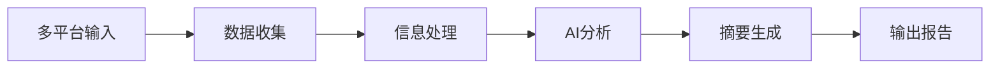

**技术特色**：
- 多平台API集成技术
- 大规模信息过滤与去重
- 基于LLM的智能摘要生成

#### 热度分析

- 超高人气项目，28K+ stars且持续快速增长，日均新增439 stars
- 社区活跃度高，零issues表明项目维护良好，用户满意度高

#### 快速上手

```bash
# 安装依赖
pip install -r requirements.txt

# 运行项目
python last30days.py --topic "AI发展趋势"
```

#### 注意事项

- 需要确保各平台的API访问权限合规
- 注意不同平台的数据质量和可靠性差异
- 可能需要根据具体需求调整AI摘要的详细程度和风格


### 7. PaddlePaddle/PaddleOCR — 智能OCR工具

> **一句话总结**：轻量级OCR工具包，支持100+语言，连接图像/PDF与LLMs。

#### 价值主张

| 维度 | 说明 |
|------|------|
| **解决痛点** | 解决图像和PDF文档中的非结构化数据难以被AI模型直接处理的问题 |
| **目标用户** | 需要从文档中提取结构化数据的AI开发者和研究人员 |
| **核心亮点** | 多语言支持 + 轻量级设计 + 与LLMs无缝集成 |

#### 技术架构

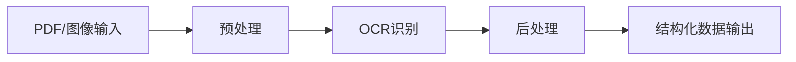

**技术特色**：
- 基于PaddlePaddle深度学习框架，提供高精度文字识别能力
- 支持多种文档格式和100+语言，覆盖全球主要语言区域
- 轻量级设计，易于与现有AI工作流和LLMs集成

#### 热度分析

- 项目Star数超8万且日增433，表明社区活跃度高且增长迅速
- 作为百度开源的OCR工具，在企业级AI应用领域具有重要地位

#### 快速上手

```bash
# 安装
pip install paddlepaddle paddleocr

# 使用
from paddleocr import PaddleOCR
ocr = PaddleOCR(use_angle_cls=True, lang='ch')
result = ocr.ocr('example.jpg', cls=True)
```

#### 注意事项
- 需要安装PaddlePaddle深度学习框架，对硬件有一定要求
- 对于中文识别效果最佳，其他语言可能需要额外配置
- 许可证信息不明确，商业使用前需确认具体条款


### 8. microsoft/VibeVoice — 前沿语音AI

> **一句话总结**：微软开源的先进语音AI技术，提供高质量语音合成与识别能力。

#### 价值主张

| 维度 | 说明 |
|------|------|
| **解决痛点** | 突破传统语音AI的局限，提供更自然流畅的语音交互体验 |
| **目标用户** | 开发者、语音应用构建者、AI研究人员 |
| **核心亮点** | 高质量语音合成+多语言支持+低资源需求+实时处理能力 |

#### 技术架构

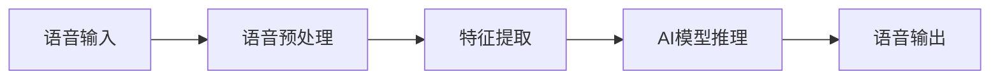

**技术特色**：
- 基于深度学习的端到端语音处理
- 自适应音频质量优化技术
- 轻量级模型设计，适合边缘设备部署

#### 热度分析

- 项目呈现快速增长趋势，日均新增星数超过200，表明社区认可度高
- 作为微软开源项目，在AI语音领域具有显著影响力，生态位稳固

#### 快速上手

```bash
# 克隆仓库
git clone https://github.com/microsoft/VibeVoice.git

# 安装依赖
pip install -r requirements.txt

# 运行示例
python examples/basic_demo.py
```

#### 注意事项

- 项目文档可能需要进一步补充，当前Open Issues为0可能影响问题反馈
- 许可证信息不明确，使用前需确认开源协议类型


### 9. openai/plugins — AI插件系统

> **一句话总结**：为ChatGPT提供可扩展功能，使AI能调用外部API获取实时数据并执行特定任务。

#### 价值主张

| 维度 | 说明 |
|------|------|
| **解决痛点** | 突破AI模型能力边界，实现实时数据访问与专业功能集成 |
| **目标用户** | 开发者、AI应用构建者及需要扩展ChatGPT功能的组织 |
| **核心亮点** | 可扩展架构 + 安全沙箱执行 + 插件市场集成 + 自然语言触发 |

#### 技术架构


**技术特色**：
- 基于OAuth 2.0的安全认证机制
- 插件描述与API规范标准化
- 异步执行与结果缓存优化

#### 热度分析

- 项目增长迅猛，单日新增213个star，表明开发者社区高度关注
- 作为OpenAI官方项目，在AI插件生态中具有标杆地位和先发优势

#### 快速上手

```bash
# 克隆仓库
git clone https://github.com/openai/plugins.git
cd plugins

# 安装依赖并启动开发服务器
npm install && npm run dev
```

#### 注意事项

- 插件开发需遵循OpenAI的安全准则和API规范
- 所有插件需通过OpenAI审核才能在ChatGPT中正式使用
- 注意API调用的速率限制和成本控制，避免过度消耗资源


### 10. santifer/career-ops — AI求职助手

> **一句话总结**：基于Claude Code构建的AI求职系统，提供多技能模式、仪表板和批量处理功能，提升求职效率。

#### 价值主张

| 维度 | 说明 |
|------|------|
| **解决痛点** | 传统求职流程繁琐，效率低下，缺乏个性化指导 |
| **目标用户** | 寻找工作机会的求职者，特别是技术岗位申请者 |
| **核心亮点** | AI驱动 + 14种技能模式 + Go仪表板 + PDF生成 + 批量处理 |

#### 技术架构

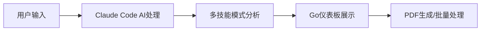

**技术特色**：
- 基于Claude Code的AI求职分析引擎
- Go语言构建的高效仪表板
- 多技能模式适配不同岗位需求

#### 热度分析

- 项目获得近5万星，日增190+，表明在AI求职领域具有显著影响力
- 高fork比例(1:5)显示社区活跃，用户二次开发意愿强

#### 快速上手

```bash
# 克隆项目
git clone https://github.com/santifer/career-ops.git

# 安装依赖
npm install

# 启动服务
npm start
```

#### 注意事项

- 项目许可证未知，商业使用前需确认授权
- 可能需要Claude API访问权限
- 依赖外部AI服务，可能存在隐私和数据安全问题


### 11. aquasecurity/trivy — 全面安全扫描器

> **一句话总结**：Trivy是开源的多功能安全扫描工具，可检测容器、Kubernetes、代码仓库和云环境中的漏洞、配置错误和敏感信息。

#### 价值主张

| 维度 | 说明 |
|------|------|
| **解决痛点** | 统一检测多平台安全风险，解决碎片化安全工具管理难题 |
| **目标用户** | DevOps团队、安全工程师、容器和云平台使用者 |
| **核心亮点** | 跨平台支持 + 深度漏洞检测 + 秘密扫描 + SBOM生成 + 简单易用 |

#### 技术架构

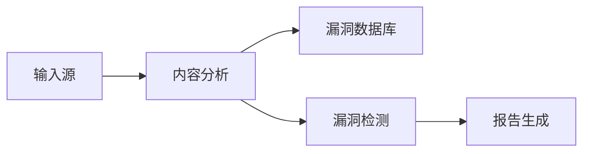

**技术特色**：
- 基于Go语言开发，跨平台性能优异
- 轻量级设计，无需预装依赖，开箱即用
- 支持多种漏洞数据库，包括NVD、GitHub Advisory等

#### 热度分析

- 项目获得36K+ Stars，日增159，增长速度稳定，表明社区认可度高
- 作为安全领域的重要工具，已形成完整生态，与主流CI/CD工具有良好集成

#### 快速上手

```bash
# 安装Trivy
curl -sfL https://raw.githubusercontent.com/aquasecurity/trivy/main/contrib/install.sh | sh -s -- -b /usr/local/bin

# 扫描容器镜像
trivy image your-image:tag

# 生成SBOM
trivy image --format sbom your-image:tag
```

#### 注意事项

- 扫描大型容器镜像时可能需要较长时间和较多内存
- 某些私有漏洞数据库可能需要额外配置和认证
- 对于复杂项目，建议结合其他安全工具使用，以获得更全面的安全评估


### 12. openai/whisper — [语音识别]

> **一句话总结**：基于大规模弱监督训练的强大多语言语音识别系统，实现高准确度的音频转文本。

#### 价值主张

| 维度 | 说明 |
|------|------|
| **解决痛点** | 克服传统语音识别在噪声、口音和语言切换方面的局限性 |
| **目标用户** | 开发者、研究人员、内容创作者、无障碍技术需求者 |
| **核心亮点** | 多语言支持 + 鲁棒性强 + 易于集成 + 开源免费 |

#### 技术架构

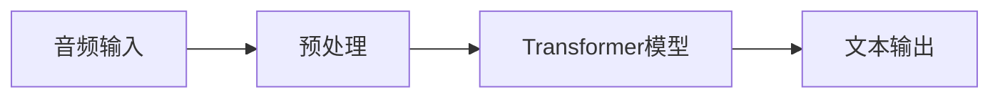

**技术特色**：
- 基于大规模弱监督训练的Transformer架构
- 支持多语言识别和翻译任务
- 鲁棒性强，对噪声和口音不敏感

#### 热度分析

- 项目获得超10万星，增长迅速，表明其在语音识别领域的重要性和实用性
- 作为OpenAI的开源项目，在AI社区具有较高影响力，推动语音识别技术普及

#### 快速上手

```bash
# 安装whisper
pip install -U openai-whisper

# 基本使用
import whisper
model = whisper.load_model("base")
result = model.transcribe("audio.mp3")
print(result["text"])
```

#### 注意事项

- 需要一定的计算资源，尤其是运行大型模型时
- 对于某些小语种或专业术语的识别可能不够准确
- 处理长音频文件可能需要分段处理


### 13. danielmiessler/Personal_AI_Infrastructure — AI增强基础设施

> **一句话总结**：构建个人AI代理基础设施，显著增强人类认知与生产力能力。

#### 价值主张

| 维度 | 说明 |
|------|------|
| **解决痛点** | 个人缺乏强大AI基础设施，难以整合AI能力提升工作效率 |
| **目标用户** | 研究人员、开发者、知识工作者及AI技术爱好者 |
| **核心亮点** | 模块化设计 + 可扩展架构 + 多代理协作 + 类型安全 + 人机协同 |

#### 技术架构

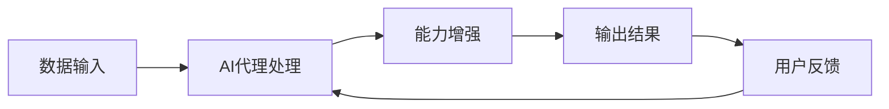

**技术特色**：
- 基于TypeScript构建的全类型安全系统
- 模块化代理架构，支持功能灵活组合
- 人机协同设计，强调AI作为人类能力增强工具

#### 热度分析

- 项目获近15k stars且持续增长(+70 today)，显示社区高度认可与需求旺盛
- 高star低issue比例表明项目成熟度高，已成为个人AI基础设施领域标杆

#### 快速上手

```bash
# 克隆项目
git clone https://github.com/danielmiessler/Personal_AI_Infrastructure.git

# 安装依赖
npm install

# 启动开发环境
npm run dev
```

#### 注意事项

- 项目许可证信息不明确，使用前需确认版权条款
- 需要一定的TypeScript和AI基础知识才能充分利用项目功能
- 可能需要OpenAI API密钥等外部服务才能完全运行


### 14. microsoft/mxc — 安全隔离容器

> **一句话总结**：基于策略的多层安全隔离系统，提供精细化资源控制与边界保护。

#### 价值主张

| 维度 | 说明 |
|------|------|
| **解决痛点** | 解决传统容器安全边界模糊、资源控制不精细的问题 |
| **目标用户** | 企业级云环境安全管理人员、系统架构师 |
| **核心亮点** | 策略驱动隔离 + 多层安全控制 + 微粒度资源管理 + 跨平台兼容性 |

#### 技术架构

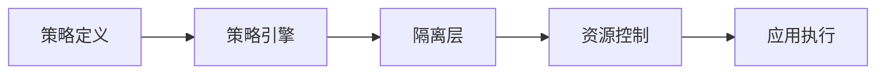

**技术特色**：
- 基于Rust构建，内存安全且性能高效
- 多层次安全隔离架构，提供细粒度控制
- 策略驱动模型，实现灵活的安全配置

#### 热度分析

- 项目近期Star增长迅速，日增64星，表明社区关注度快速提升
- Fork数量相对较少，说明项目处于早期阶段，尚未形成大规模分支

#### 快速上手

```bash
# 安装MXC
cargo install mxc

# 创建隔离环境
mxc create --policy security_policy.yml my_container

# 运行应用
mxc run my_container -- /path/to/application
```

#### 注意事项

- 项目处于早期阶段，API可能不稳定
- 需要一定的Rust和系统安全知识才能充分利用
- 文档可能不够完善，需要参考源码理解


### 15. golang/go — 系统编程语言

> **一句话总结**：Go语言以简洁高效的并发模型和快速编译特性，成为构建高性能分布式系统的首选语言。

#### 价值主张

| 维度 | 说明 |
|------|------|
| **解决痛点** | 解决系统编程中复杂性与性能的平衡问题，提供简洁强大的工具集 |
| **目标用户** | 后端开发者、系统程序员、云原生应用构建者、微服务架构师 |
| **核心亮点** | 静态类型+编译型语言 + 内置并发支持 + 简洁语法 + 强标准库 |

#### 技术架构


**技术特色**：
- 独特的goroutine轻量级并发模型，实现高效并行处理
- 基于接口的组合设计，支持灵活的代码复用和扩展
- 快速编译速度，平均编译时间仅需几秒
- 强类型系统与鸭子类型特性相结合，平衡安全性与灵活性
- 简化的错误处理机制，通过显式返回值提高代码健壮性

#### 热度分析

- Go语言持续稳定增长，在云原生和微服务领域应用广泛，Star数超13万，表明其在开发者社区中的极高认可度
- 作为系统编程语言，Go在容器、Kubernetes、Docker等基础设施项目中占据核心地位，形成了活跃的技术生态系统

#### 快速上手

```bash
# 安装Go
$ wget https://golang.org/dl/go1.19.linux-amd64.tar.gz
$ tar -xzf go1.19.linux-amd64.tar.gz
$ export PATH=$PATH:$(pwd)/go/bin

# 创建第一个程序
$ mkdir hello && cd hello
$ cat > main.go <<EOF
package main

import "fmt"

func main() {
    fmt.Println("Hello, Go!")
}
EOF

# 运行程序
$ go run main.go
```

#### 注意事项

- Go语言的错误处理机制要求显式处理可能的错误，与某些语言的异常处理机制不同
- Go的泛型支持相对较新（1.18版本引入），部分设计理念与其他语言有所不同
- 依赖管理方式经历了从GOPATH到Go Modules的转变，新项目推荐使用Go Modules


### 16. sveltejs/svelte — 高效编译UI框架

> **一句话总结**：编译时优化的现代前端框架，通过将组件转换为原生JavaScript实现高性能Web应用。

#### 价值主张

| 维度 | 说明 |
|------|------|
| **解决痛点** | 解决传统框架运行时开销大、包体积大的性能问题 |
| **目标用户** | 追求高性能和小体积的前端开发者和团队 |
| **核心亮点** | 编译时优化 + 无虚拟DOM + 响应式系统 + 组件化 + TypeScript支持 |

#### 技术架构

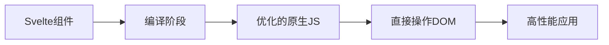

**技术特色**：
- 编译时将组件转换为高效原生JavaScript，无需虚拟DOM
- 响应式系统基于赋值操作，自动追踪依赖关系
- 极小的运行时开销，应用体积小
- 内置状态管理和过渡动画支持
- 支持服务端渲染和静态站点生成

#### 热度分析

- Svelte拥有87,000+星标，呈现稳定增长趋势，表明其在前端框架中具有竞争力
- 作为新兴框架，社区活跃度高，生态系统快速扩展，已有配套工具链SvelteKit

#### 快速上手

```bash
# 创建新项目
npm create svelte@latest my-app
cd my-app
npm install
npm run dev
```

#### 注意事项

- Svelte的编程模型与传统框架(如React)有显著差异，需要学习曲线
- 虽然API简洁，但高级特性如 stores 和 actions 需要额外学习
- 社区规模相对React/Vue较小，第三方库生态仍在发展中


### 17. vitejs/vite — 前端构建加速器

> **一句话总结**：基于原生 ES 模块和 Rollup 的极速前端开发与构建工具，显著提升开发体验。

#### 价值主张

| 维度 | 说明 |
|------|------|
| **解决痛点** | 解决传统构建工具启动慢、热更新延迟的前端开发效率问题 |
| **目标用户** | 前端开发者、Web 应用开发者、现代框架使用者 |
| **核心亮点** | 原生 ES 模块服务器 + 极速热更新 + Rollup 生产构建 + 丰富插件生态 |

#### 技术架构

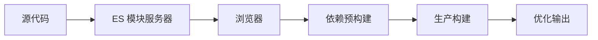

**技术特色**：
- 基于浏览器原生 ES 模块，无需预打包即可启动开发服务器
- 依赖按需编译，只对实际使用的代码进行转换
- 插件系统兼容 Rollup 生态，无缝集成现有工具链

#### 热度分析

- 项目 Star 数超 8.1 万，增长率高，已成为前端领域标杆构建工具
- 社区活跃度高，插件生态完善，正逐步取代传统 Webpack 成为行业标准

#### 快速上手

```bash
# 创建 Vite 项目
npm create vite@latest my-app --template react

# 进入目录并安装依赖
cd my-app && npm install

# 启动开发服务器
npm run dev
```

#### 注意事项

- 需要现代浏览器支持，依赖 ES 模块特性
- 生产环境构建需合理配置代码分割和优化策略
- 某些特殊场景可能需要自定义插件或额外配置


### 18. nginx/nginx — 高性能Web服务器

> **一句话总结**：轻量级、高性能HTTP服务器与反向代理，解决高并发场景下的网络服务需求。

#### 价值主张

| 维度 | 说明 |
|------|------|
| **解决痛点** | 高并发请求处理效率低，资源占用高，服务扩展性差 |
| **目标用户** | 需要高性能Web服务的企业级用户、云计算平台、CDN服务提供商 |
| **核心亮点** | 事件驱动架构 + 模块化设计 + 低资源消耗 + 高并发处理能力 + 反向代理支持 |

#### 技术架构

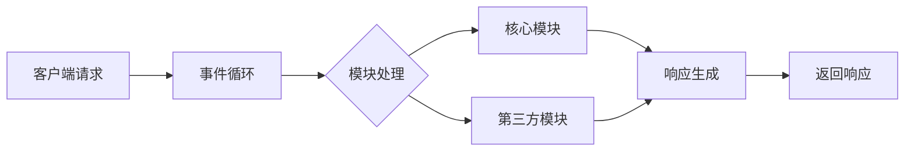

**技术特色**：
- 基于异步非阻塞模型的事件驱动架构，支持高并发连接
- 模块化设计，支持动态加载模块，功能可扩展
- 进程/混合进程模型，主进程管理worker进程，提高稳定性
- 高效的内存管理，减少内存碎片
- 支持多种负载均衡算法和健康检查机制

#### 热度分析

- 作为Web基础设施核心组件，持续稳定增长，企业级采用率高
- 拥有庞大且活跃的社区，丰富的第三方模块和扩展生态

#### 快速上手

```bash
# 安装NGINX
sudo apt-get install nginx  # Ubuntu/Debian
sudo yum install nginx      # CentOS/RHEL

# 启动NGINX服务
sudo systemctl start nginx

# 检查NGINX状态
sudo systemctl status nginx
```

#### 注意事项

- 配置语法严格，错误配置可能导致服务不可用，建议测试环境验证
- 处理静态文件效率高，但处理动态请求需要配合后端服务
- 大流量环境下需要适当调整worker进程数和连接数参数
- 安全配置需注意，默认配置可能存在安全隐患，应根据实际需求调整


## 今日推荐

| 主题 | 推荐项目 | 亮点 |
|------|----------|------|
| 今日最热 | [lfnovo/open-notebook](https://github.com/lfnovo/open-notebook) | An Open Source im... |
| 值得关注 | [obra/superpowers](https://github.com/obra/superpowers) | An agentic skills... |
| 快速上手 | [Panniantong/Agent-Reach](https://github.com/Panniantong/Agent-Reach) | Give your AI agen... |
| 长期潜力 | [CopilotKit/CopilotKit](https://github.com/CopilotKit/CopilotKit) | The Frontend Stac... |

---

<div align="center">

*Generated on 2026-06-07 | Powered by GitHub Trending Reporter*

</div>