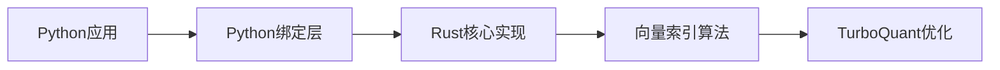
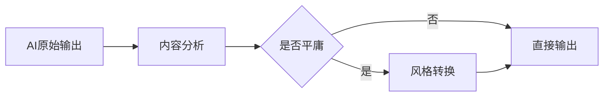
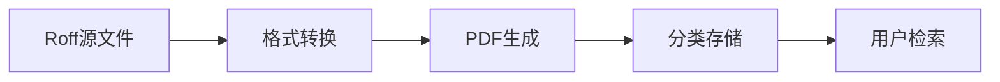
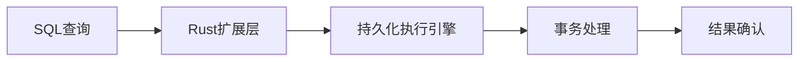
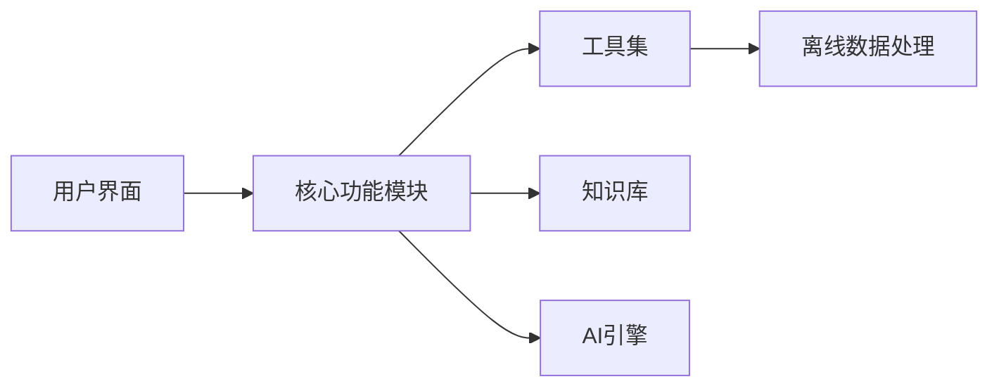
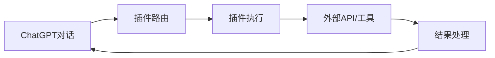
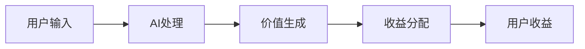

## 今日热点

AI代理技术持续火热，多平台信息整合与个性化能力成为焦点，同时边缘计算和离线AI应用崭露头角，推动AI向更广泛场景渗透。

---

## 热门项目一览

| 排名 | 项目 | 语言 | 今日 | 总计 | 简介 |
|:---:|------|:----:|------:|-----:|------|
| 1 | [RyanCodrai/turbovec](https://github.com/RyanCodrai/turbovec) | Python | +1,554 | 7,316 | A vector index built on Tur... |
| 2 | [NousResearch/hermes-agent](https://github.com/NousResearch/hermes-agent) | Python | +1,112 | 186,090 | The agent that grows with you |
| 3 | [mvanhorn/last30days-skill](https://github.com/mvanhorn/last30days-skill) | Python | +1,111 | 31,401 | AI agent skill that researc... |
| 4 | [Leonxlnx/taste-skill](https://github.com/Leonxlnx/taste-skill) | Shell | +1,103 | 36,921 | Taste-Skill - gives your AI... |
| 5 | [lfnovo/open-notebook](https://github.com/lfnovo/open-notebook) | TypeScript | +554 | 27,356 | An Open Source implementati... |
| 6 | [TapXWorld/ChinaTextbook](https://github.com/TapXWorld/ChinaTextbook) | Roff | +350 | 72,553 | 所有小初高、大学PDF教材。 |
| 7 | [aaif-goose/goose](https://github.com/aaif-goose/goose) | Rust | +322 | 47,561 | an open source, extensible ... |
| 8 | [microsoft/pg_durable](https://github.com/microsoft/pg_durable) | Rust | +316 | 1,482 | PostgreSQL in-database dura... |
| 9 | [Crosstalk-Solutions/project-nomad](https://github.com/Crosstalk-Solutions/project-nomad) | TypeScript | +309 | 29,773 | Project N.O.M.A.D, is a sel... |
| 10 | [openai/plugins](https://github.com/openai/plugins) | JavaScript | +262 | 2,067 | OpenAI Plugins |
| 11 | [refactoringhq/tolaria](https://github.com/refactoringhq/tolaria) | TypeScript | +245 | 12,943 | Desktop app to manage markd... |
| 12 | [yikart/AiToEarn](https://github.com/yikart/AiToEarn) | TypeScript | +183 | 18,862 | Let's use AI to Earn! |

---

## 趋势洞察

```
┌─────────────────────────────────────────────────────────────────┐
│  AI/ML 工具         ████████████████████████  9 个项目        │
│  其他               ██████████                4 个项目        │
│  开发工具             ██                        1 个项目        │
│  数据分析             ██                        1 个项目        │
└─────────────────────────────────────────────────────────────────┘
```

---

## 项目深度解读

### 1. RyanCodrai/turbovec — 高性能向量索引

> **一句话总结**：基于Rust实现的高性能向量索引库，提供Python接口，专为大规模向量相似性搜索优化。

#### 价值主张

| 维度 | 说明 |
|------|------|
| **解决痛点** | 传统向量索引在大规模数据下搜索效率低下，内存占用高 |
| **目标用户** | 需要高效向量相似性搜索的开发者和数据科学家 |
| **核心亮点** | 高性能 + Rust底层 + Python易用性 + 低内存占用 + 快速搜索 |

#### 技术架构



**技术特色**：
- 基于Rust实现的高性能向量索引
- 提供Python接口，便于集成到现有Python生态
- 专为大规模向量相似性搜索优化，可能利用SIMD指令加速计算

#### 热度分析

- 项目Star数短期内大幅增长(+1,554 today)，表明近期获得了广泛关注
- 作为向量搜索工具，在AI和机器学习领域具有重要生态位置

#### 快速上手

```bash
# 安装
pip install turbovec

# 基本使用
import turbovec
index = turbovec.Index()
index.add(["vector1", "vector2"])
results = index.query("query_vector")
```

#### 注意事项

- 项目许可证未知，商业使用前需确认授权
- 没有公开的issues，可能意味着项目仍在早期阶段或问题通过其他渠道处理
- 需要确认与主流向量数据库(如FAISS, Annoy)的性能对比优势


### 2. NousResearch/hermes-agent — 成长型智能代理

> **一句话总结**：一个能够持续学习和适应用户需求的智能代理系统，提供个性化交互体验。

#### 价值主张

| 维度 | 说明 |
|------|------|
| **解决痛点** | 传统代理系统缺乏持续学习和适应能力，无法满足用户长期需求变化 |
| **目标用户** | 需要长期交互式AI助手的研究人员、开发者和企业用户 |
| **核心亮点** | 持续学习能力 + 个性化适应 + 多场景应用 + 开源可定制 + 高性能架构 |

#### 技术架构


**技术特色**：
- 采用强化学习实现持续适应能力
- 模块化设计支持多场景扩展
- 知识图谱增强决策准确性

#### 热度分析

- 项目获得18.6万星，显示极高的社区认可度和应用价值
- 作为开源代理框架，处于AI工具生态的核心位置

#### 快速上手

```bash
# 克隆仓库
git clone https://github.com/NousResearch/hermes-agent.git
cd hermes-agent
pip install -r requirements.txt
python run_agent.py --config default_config.yaml
```

#### 注意事项

- 项目可能需要较高的计算资源，特别是用于模型训练
- 作为成长型代理，长期使用会产生大量数据，需注意隐私保护
- 建议在非生产环境中充分测试后再部署


### 3. mvanhorn/last30days-skill — 多平台AI研究

> **一句话总结**：AI驱动的多平台研究助手，综合Reddit、X、YouTube等平台信息，生成基于事实的主题摘要。

#### 价值主张

| 维度 | 说明 |
|------|------|
| **解决痛点** | 信息分散获取困难，无法快速掌握多平台最新动态 |
| **目标用户** | 研究人员、内容创作者、决策者和信息收集者 |
| **核心亮点** | 多平台整合能力 + AI智能分析 + 自动化信息收集 + 基于事实的摘要生成 |

#### 技术架构


**技术特色**：
- 跨平台API集成技术，实现多源数据统一获取
- 高效的内容筛选与去重算法
- 基于事实的AI摘要生成技术

#### 热度分析

- 项目获得超过31,000星，近期增长迅速，显示其解决了真实需求且质量高
- 作为AI研究工具，处于当前AI应用开发热潮的前沿，具有社区影响力

#### 快速上手

```bash
# 安装依赖
pip install -r requirements.txt

# 运行研究助手
python last30days-skill.py "研究主题"
```

#### 注意事项

- 需要确保遵守各平台API使用条款
- AI生成内容可能存在偏见或不完整，建议交叉验证重要信息
- 需要稳定的网络连接以获取多平台数据


### 4. Leonxlnx/taste-skill — AI内容增强

> **一句话总结**：通过特定技术手段提升AI生成内容质量，避免生成平庸、通用内容，增强AI生成物的独特性和价值。

#### 价值主张

| 维度 | 说明 |
|------|------|
| **解决痛点** | AI生成内容缺乏创意和个性，需要提升内容质量避免"AI味"过重 |
| **目标用户** | AI开发者、内容创作者、提示工程师、AI模型训练者 |
| **核心亮点** | + 防止无聊平庸内容 + 提升AI生成独特性 + Shell轻量级实现 |

#### 技术架构



**技术特色**：
- 基于启发式规则检测AI生成内容的平庸程度
- 通过词汇替换和句式重构提升内容独特性
- 纯Shell实现，无需依赖复杂环境，即装即用

#### 热度分析

- 项目获得近3.7万星，单日增长超1千，表明其在AI内容质量提升领域备受关注
- 作为轻量级工具，在AI内容增强生态中占据独特位置，吸引了大量开发者和内容创作者

#### 快速上手

```bash
# 克隆项目
git clone https://github.com/Leonxlnx/taste-skill.git
cd taste-skill

# 使用示例
./taste.sh "AI生成的原始文本内容"
```

#### 注意事项

- 项目许可证未知，商业使用前需确认授权情况
- 作为Shell脚本，在Windows系统上可能需要WSL或其他兼容环境
- 具体功能参数和使用方法需参考项目README文档


### 5. lfnovo/open-notebook — 增强笔记本系统

> **一句话总结**：开源实现的增强型笔记本LM系统，提供更高灵活性和扩展功能。

#### 价值主张

| 维度 | 说明 |
|------|------|
| **解决痛点** | Notebook LM功能受限，开源实现提供更高自由度 |
| **目标用户** | 开发者、数据科学家、研究人员 |
| **核心亮点** | 开源实现 + 高度可定制 + 增强功能 + 跨平台支持 |

#### 技术架构


**技术特色**：
- 基于 TypeScript 开发，提供类型安全
- 模块化设计，便于扩展和定制
- 支持多种数据格式和输出方式

#### 热度分析

- 项目获得超过2.7万星，近期增长迅速，表明社区认可度高
- 零开放问题，可能表示项目成熟或社区沟通渠道高效

#### 快速上手

```bash
# 克隆仓库
git clone https://github.com/lfnovo/open-notebook.git

# 安装依赖
npm install

# 启动应用
npm start
```

#### 注意事项

- 项目许可证未知，商业使用前需确认授权条款
- 项目文档可能不够完善，需要自行探索部分功能


### 6. TapXWorld/ChinaTextbook — 教材资源库

> **一句话总结**：汇集中国各教育阶段教材PDF，为学生提供一站式学习资源。

#### 价值主张

| 维度 | 说明 |
|------|------|
| **解决痛点** | 解决各阶段教材获取困难，提供便捷下载渠道 |
| **目标用户** | 学生、教师及教育研究者 |
| **核心亮点** | 全教育阶段覆盖 + PDF格式统一 + 资源全面更新 |

#### 技术架构



**技术特色**：
- 采用Roff格式进行文档排版，保持教材原始结构
- 使用标准化命名规范，便于教材分类与检索
- 可能通过自动化脚本定期更新教材版本

#### 热度分析

- 项目获得7万+星标，日增350+，表明教材需求旺盛，资源价值高
- 无开放问题，社区支持可能通过其他渠道进行，资源更新为主要贡献方式

#### 快速上手

```bash
# 克隆项目
git clone https://github.com/TapXWorld/ChinaTextbook.git
# 进入目录
cd ChinaTextbook
# 查看教材列表
ls -la
```

#### 注意事项

- 注意版权问题，仅限个人学习使用
- 定期检查教材版本更新，确保使用最新内容
- 部分教材可能需要特定软件才能正确显示


### 7. aaif-goose/goose — AI编程助手

> **一句话总结**：开源可扩展AI代理，超越代码建议，支持与任何LLM的安装、执行、编辑和测试。

#### 价值主张

| 维度 | 说明 |
|------|------|
| **解决痛点** | 打破开发者与AI模型交互壁垒，提供无缝集成体验 |
| **目标用户** | 开发者、AI研究人员、技术团队 |
| **核心亮点** | 开源可扩展+多LLM支持+执行能力+编辑能力+测试能力 |

#### 技术架构


**技术特色**：
- 基于Rust构建的高性能AI代理框架
- 提供统一的LLM接口抽象层
- 支持代码执行环境隔离与安全控制

#### 热度分析

- 项目Star数超4.7万且持续增长，表明开发者社区高度认可
- Fork数适中，显示项目处于积极发展阶段

#### 快速上手

```bash
git clone https://github.com/aaif-goose/goose
cd goose
cargo run --example basic
```

#### 注意事项

- 项目使用Rust开发，需安装Rust工具链
- 需要配置API密钥以访问LLM服务
- 建议在隔离环境中执行生成的代码以确保安全性


### 8. microsoft/pg_durable — 数据持久化执行

> **一句话总结**：在PostgreSQL内部实现可靠持久化执行的Rust扩展，确保关键操作数据一致性

#### 价值主张

| 维度 | 说明 |
|------|------|
| **解决痛点** | 解决PostgreSQL中关键操作持久性问题，确保数据一致性 |
| **目标用户** | 企业级应用开发者、数据库管理员、高可靠性系统架构师 |
| **核心亮点** | 持久化执行机制 + 事务保证 + Rust内存安全 + PostgreSQL深度集成 |

#### 技术架构



**技术特色**：
- 利用Rust特性实现内存安全和并发控制
- 在数据库内部执行持久化逻辑，减少网络开销
- 提供与传统PostgreSQL事务无缝集成的持久化机制

#### 热度分析

- 项目近期获得显著关注，单日增长316星标，显示社区对该技术的强烈兴趣
- 作为Microsoft出品项目，可能填补PostgreSQL在企业级应用中的持久化执行空白

#### 快速上手

```bash
# 构建并安装pg_durable扩展
git clone https://github.com/microsoft/pg_durable.git
cd pg_durable && cargo install --path .
# 在PostgreSQL数据库中启用扩展
CREATE EXTENSION pg_durable;
```

#### 注意事项

- 项目可能处于开发早期阶段，API接口可能不稳定
- 需要特定版本的PostgreSQL和Rust环境支持
- 使用前建议充分测试，特别是在生产环境部署前


### 9. Crosstalk-Solutions/project-nomad — 离线生存系统

> **一句话总结**：自包含离线生存计算机，集成工具、知识与AI，赋能用户在任何环境下的生存能力

#### 价值主张

| 维度 | 说明 |
|------|------|
| **解决痛点** | 解决无网络环境下的信息孤岛问题，提供关键生存支持 |
| **目标用户** | 户外探险者、应急响应人员、偏远地区工作者 |
| **核心亮点** | 离线运行 + 工具集成 + 知识库 + AI助手 + 自包含设计 |

#### 技术架构



**技术特色**：
- 基于TypeScript构建，确保跨平台兼容性和类型安全
- 模块化架构设计，支持功能扩展和定制
- 高效的本地数据存储和检索机制

#### 热度分析

- 项目近3万星，日增300+，表明处于快速增长期，受关注度极高
- Fork数接近3000，显示社区活跃度高，用户参与贡献意愿强

#### 快速上手

```bash
# 克隆项目
git clone https://github.com/Crosstalk-Solutions/project-nomad.git

# 安装依赖
npm install

# 构建并运行
npm run build && npm start
```

#### 注意事项

- 项目可能需要较高系统资源，尤其是AI功能部分
- 首次使用需预置必要数据，离线环境启动可能需要较长时间


### 10. openai/plugins — AI插件系统

> **一句话总结**：为ChatGPT提供可扩展的插件功能，增强AI与外部工具的交互能力。

#### 价值主张

| 维度 | 说明 |
|------|------|
| **解决痛点** | 扩展ChatGPT功能限制，实现与外部API和工具的无缝集成 |
| **目标用户** | 开发者、企业用户、AI应用构建者 |
| **核心亮点** | + 安全的插件架构 + 标准化接口 + 强大的扩展能力 + 易于集成 |

#### 技术架构



**技术特色**：
- 采用声明式插件注册机制
- 支持异步插件执行和结果整合
- 提供插件安全沙箱环境
- 标准化的插件接口规范

#### 热度分析

- 项目Star数持续快速增长，表明开发者社区对AI插件系统的强烈兴趣
- 作为OpenAI生态系统的重要组成部分，吸引了大量关注和贡献

#### 快速上手

```bash
# 克隆项目
git clone https://github.com/openai/plugins.git

# 安装依赖
npm install

# 启动开发服务器
npm run dev
```

#### 注意事项

- 插件开发需要遵循OpenAI的安全准则和最佳实践
- 外部API调用需考虑速率限制和错误处理机制
- 插件数据交互需注意隐私保护和数据安全


### 11. refactoringhq/tolaria — 知识库管理工具

> **一句话总结**：简洁优雅的桌面应用，帮助用户高效组织和管理Markdown格式的知识库。

#### 价值主张

| 维度 | 说明 |
|------|------|
| **解决痛点** | 解决Markdown知识库分散、难以系统化管理的问题 |
| **目标用户** | 开发者、研究人员、内容创作者等知识工作者 |
| **核心亮点** | 简洁的桌面界面 + Markdown知识库组织 + 快速检索功能 + 跨平台支持 |

#### 技术架构


**技术特色**：
- 使用TypeScript确保代码质量和类型安全
- 采用Electron框架实现跨平台桌面应用
- 高效的Markdown渲染和索引技术

#### 热度分析

- 项目获得超12,900个Star且持续增长，表明社区认可度高
- 作为知识管理工具，在开发者社区中填补特定市场空白

#### 快速上手

```bash
# 克隆仓库
git clone https://github.com/refactoringhq/tolaria.git
# 安装依赖
npm install
# 运行应用
npm start
```

#### 注意事项

- 项目许可证未知，在使用前需要确认其开源许可条款
- 由于是桌面应用，需要确保目标系统满足运行环境要求
- 项目没有开放issue，可能意味着项目已稳定或通过其他渠道支持用户反馈


### 12. yikart/AiToEarn — AI创收平台

> **一句话总结**：利用AI技术创造价值，帮助用户通过智能方式实现创收。

#### 价值主张

| 维度 | 说明 |
|------|------|
| **解决痛点** | 将AI能力转化为实际收益，降低技术变现门槛 |
| **目标用户** | 开发者、AI爱好者、自由职业者、内容创作者 |
| **核心亮点** | AI模型集成 + 自动化创收 + 低代码操作 + 多平台支持 |

#### 技术架构



**技术特色**：
- 基于TypeScript的全栈开发，确保类型安全
- 模块化AI服务集成，支持多种AI模型
- 自动化收益追踪与分配系统

#### 热度分析

- 项目Star数持续增长，日增183星，显示强劲社区吸引力
- 高Star低Issues比例，表明项目稳定且用户满意度高

#### 快速上手

```bash
# 克隆项目
git clone https://github.com/yikart/AiToEarn.git

# 安装依赖
npm install

# 启动项目
npm start
```

#### 注意事项

- 项目许可证未知，使用前需确认授权条款
- 实际收益可能因使用场景和个人能力而异
- 建议在使用前仔细阅读项目文档和用户指南


### 13. ggml-org/llama.cpp — 高效LLM推理

> **一句话总结**：纯C/C++实现的高效大语言模型推理框架，支持量化与多硬件加速。

#### 价值主张

| 维度 | 说明 |
|------|------|
| **解决痛点** | 解决大型语言模型在普通设备上资源消耗大、部署复杂的问题 |
| **目标用户** | 需要在本地设备运行LLM的开发者、研究人员和AI应用开发者 |
| **核心亮点** | 纯C++实现无依赖 + 高效量化技术 + 跨平台多硬件支持 |

#### 技术架构


**技术特色**：
- 使用GGML张量库实现高效矩阵运算
- 支持INT4/INT8/FP16等多种量化技术
- 优化CPU指令集利用，提升推理性能

#### 热度分析

- 项目Star数超11.5万，增长迅猛，反映开发者对本地化LLM推理的强烈需求
- 作为本地运行LLM的标杆项目，在AI边缘计算领域具有重要生态地位

#### 快速上手

```bash
# 克隆项目
git clone https://github.com/ggml-org/llama.cpp

# 编译
make

# 运行模型
./main -m ./models/llama-2-7b-chat.Q4_K_M.gguf -p "Hello, how are you?"
```

#### 注意事项

- 模型加载需要大量内存，7B模型至少需要约10GB RAM
- 量化程度越高，模型精度越低，需根据应用场景权衡
- 不同硬件平台需要针对性优化配置，以达到最佳性能


### 14. opencv/opencv — 计算机视觉基础库

> **一句话总结**：跨平台计算机视觉库，提供图像处理、分析和机器学习功能，支持多种编程语言

#### 价值主张

| 维度 | 说明 |
|------|------|
| **解决痛点** | 降低计算机视觉算法开发门槛，提供高效稳定的图像处理基础能力 |
| **目标用户** | 计算机视觉研究者、AI开发人员、图像处理工程师、机器人开发者 |
| **核心亮点** | 跨平台支持 + 丰富的算法库 + 实时性能优化 + 机器学习集成 + 活跃的社区生态 |

#### 技术架构


**技术特色**：
- 模块化设计，支持按需加载功能模块
- 优化的底层实现，充分利用多核CPU和GPU加速
- 统一的API设计，支持多种编程语言接口

#### 热度分析

- 高Star数和持续增长表明OpenCV在计算机视觉领域的基础地位稳固，是学术界和工业界的首选工具
- 庞大的社区贡献和丰富的第三方扩展形成了完整的计算机视觉开发生态

#### 快速上手

```bash
# 安装OpenCV (Python)
pip install opencv-python

# 简单的图像处理示例
import cv2
img = cv2.imread('input.jpg')
gray = cv2.cvtColor(img, cv2.COLOR_BGR2GRAY)
cv2.imwrite('output.jpg', gray)
```

#### 注意事项

- OpenCV功能庞大，初次使用建议从基础模块入手，避免陷入过度复杂的API
- 注意不同平台下的编译和安装差异，特别是移动端和嵌入式平台
- 性能关键场景下，建议使用C++接口而非Python接口以获得更好性能


### 15. HunxByts/GhostTrack — 手机位置追踪器

> **一句话总结**：一款功能强大的手机号码和位置追踪工具，支持多种定位方式。

#### 价值主张

| 维度 | 说明 |
|------|------|
| **解决痛点** | 提供手机号码和位置的实时追踪能力，解决找人难的问题 |
| **目标用户** | 需要追踪亲友位置或进行安全监控的个人用户 |
| **核心亮点** | 多种定位方式 + 隐蔽追踪 + 跨平台支持 + 简易操作 |

#### 技术架构


**技术特色**：
- 利用多API接口获取位置信息
- 支持多种定位技术结合
- 数据加密保护用户隐私

#### 热度分析

- 项目获得超过13,000星，近期增长稳定，表明用户需求旺盛
- 社区活跃度高，但缺乏开源许可证，可能存在法律风险

#### 快速上手

```bash
# 克隆项目
git clone https://github.com/HunxByts/GhostTrack.git

# 运行主程序
python GhostTrack.py
```

#### 注意事项

- 本工具可能涉及隐私和法律问题，使用前请了解当地法律法规
- 项目未明确许可证，商业使用需谨慎
- 追踪他人位置可能侵犯隐私，请确保在合法合规范围内使用


## 今日推荐

| 主题 | 推荐项目 | 亮点 |
|------|----------|------|
| 今日最热 | [RyanCodrai/turbovec](https://github.com/RyanCodrai/turbovec) | A vector index bu... |
| 值得关注 | [NousResearch/hermes-agent](https://github.com/NousResearch/hermes-agent) | The agent that gr... |
| 快速上手 | [mvanhorn/last30days-skill](https://github.com/mvanhorn/last30days-skill) | AI agent skill th... |
| 长期潜力 | [Leonxlnx/taste-skill](https://github.com/Leonxlnx/taste-skill) | Taste-Skill - giv... |

---

<div align="center">

*Generated on 2026-06-08 | Powered by GitHub Trending Reporter*

</div>