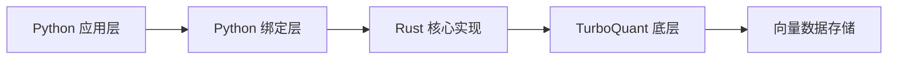
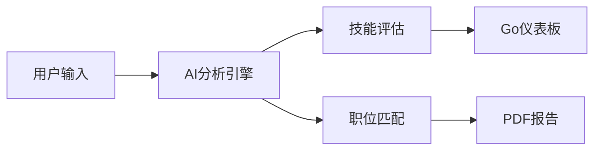

## 今日热点

今日GitHub热榜显示AI代理技能和基础设施项目爆发式增长，开发者正积极构建可扩展的AI系统，同时本地化AI工具和垂直领域应用成为新热点。

---

## 热门项目一览

| 排名 | 项目 | 语言 | 今日 | 总计 | 简介 |
|:---:|------|:----:|------:|-----:|------|
| 1 | [mvanhorn/last30days-skill](https://github.com/mvanhorn/last30days-skill) | Python | +3,558 | 34,726 | AI agent skill that researc... |
| 2 | [RyanCodrai/turbovec](https://github.com/RyanCodrai/turbovec) | Python | +1,729 | 8,975 | A vector index built on Tur... |
| 3 | [roboflow/supervision](https://github.com/roboflow/supervision) | Python | +1,288 | 42,380 | We write your reusable comp... |
| 4 | [aaif-goose/goose](https://github.com/aaif-goose/goose) | Rust | +699 | 48,134 | an open source, extensible ... |
| 5 | [Panniantong/Agent-Reach](https://github.com/Panniantong/Agent-Reach) | Python | +679 | 24,295 | Give your AI agent eyes to ... |
| 6 | [refactoringhq/tolaria](https://github.com/refactoringhq/tolaria) | TypeScript | +651 | 13,625 | Desktop app to manage markd... |
| 7 | [TapXWorld/ChinaTextbook](https://github.com/TapXWorld/ChinaTextbook) | Roff | +592 | 73,024 | 所有小初高、大学PDF教材。 |
| 8 | [google/skills](https://github.com/google/skills) | Python | +461 | 12,472 | Agent Skills for Google pro... |
| 9 | [CopilotKit/CopilotKit](https://github.com/CopilotKit/CopilotKit) | TypeScript | +378 | 34,175 | The Frontend Stack for Agen... |
| 10 | [luongnv89/claude-howto](https://github.com/luongnv89/claude-howto) | Python | +312 | 35,824 | A visual, example-driven gu... |
| 11 | [santifer/career-ops](https://github.com/santifer/career-ops) | JavaScript | +308 | 50,585 | AI-powered job search syste... |
| 12 | [openai/plugins](https://github.com/openai/plugins) | JavaScript | +296 | 2,337 | OpenAI Plugins |

---

## 趋势洞察

```
┌─────────────────────────────────────────────────────────────────┐
│  AI/ML 工具         ████████████████████████  13 个项目        │
│  其他               ███                       2 个项目        │
│  开发工具             █                         1 个项目        │
└─────────────────────────────────────────────────────────────────┘
```

---

## 项目深度解读

### 1. mvanhorn/last30days-skill — AI研究助手

> **一句话总结**：跨平台AI研究工具，整合Reddit、X、YouTube等多源信息生成智能摘要

#### 价值主张

| 维度 | 说明 |
|------|------|
| **解决痛点** | 解决信息过载问题，快速获取多平台最新研究摘要 |
| **目标用户** | 研究人员、投资者、内容创作者和决策者 |
| **核心亮点** | 多平台数据整合 + AI智能摘要 + 实时信息获取 + 基于事实的总结 |

#### 技术架构


**技术特色**：
- 多平台API集成技术
- 大型语言模型内容分析能力
- 信息验证与去重机制
- 结构化数据提取技术

#### 热度分析

- 项目单日增长3558星，显示AI研究助手领域的高需求与市场热度
- 高Fork数表明开发者社区积极参与二次开发与功能扩展

#### 快速上手

```bash
# 安装依赖
pip install -r requirements.txt

# 运行项目
python last30days-skill.py --query "AI发展趋势"
```

#### 注意事项

- 项目依赖多个外部API，可能需要相应的API密钥
- 由于处理大量数据，建议在高性能环境中运行
- 注意各平台的数据使用条款和隐私政策


### 2. RyanCodrai/turbovec — 高性能向量索引

> **一句话总结**：基于 Rust 的高性能向量索引库，提供 Python 接口，适用于大规模相似性搜索场景。

#### 价值主张

| 维度 | 说明 |
|------|------|
| **解决痛点** | 高效处理大规模向量数据的索引与相似性搜索问题 |
| **目标用户** | 需要高性能向量搜索的数据科学家和机器学习工程师 |
| **核心亮点** | Rust 高性能实现 + Python 易用性接口 + TurboQuant 底层支持 |

#### 技术架构



**技术特色**：
- 基于 Rust 的高性能向量索引实现
- 提供简洁的 Python API 接口
- 利用 TurboQuant 底层优化算法

#### 热度分析

- 项目获得近9K星，单日增长1700+，表明该项目近期受到极大关注，可能解决了某个热门需求
- Open Issues 为0，说明项目维护良好或问题处理高效，社区活跃度高

#### 快速上手

```bash
# 安装
pip install turbovec

# 基本使用
import turbovec
index = turbovec.Index()
index.add(vectors)
results = index.query(query_vector, k=10)
```

#### 注意事项

- 项目许可证未知，商业使用前需确认授权
- 作为高性能库，可能对硬件有一定要求
- 项目依赖 TurboQuant，需确保其兼容性


### 3. roboflow/supervision — 计算机视觉工具库

> **一句话总结**：提供可重用的计算机视觉工具集，简化模型集成与部署流程。

#### 价值主张

| 维度 | 说明 |
|------|------|
| **解决痛点** | 简化计算机视觉应用开发，降低技术门槛与集成成本 |
| **目标用户** | 计算机视觉开发者、数据科学家、机器学习工程师 |
| **核心亮点** | 模块化设计 + 统一API接口 + 多框架支持 + 可视化工具链 |

#### 技术架构


**技术特色**：
- 统一的检测与追踪API，降低学习成本
- 内置丰富的数据增强与预处理工具
- 支持多种主流计算机视觉模型与框架

#### 热度分析

- 项目星标数超42k，单日增长超1.2k，表明社区活跃度高且认可度强
- 作为Roboflow生态系统核心组件，在计算机视觉工具领域具有显著影响力

#### 快速上手

```bash
# 安装supervision
pip install supervision

# 基本使用示例
import supervision as sv
from ultralytics import YOLO

# 加载模型
model = YOLO('yolov8n.pt')

# 初始化检测器
detector = sv.DetectionModel(model)

# 处理图像
results = detector.predict('image.jpg')

# 可视化结果
annotated_image = sv.annotate_image(image, results)
```

#### 注意事项

- 需要安装依赖库如ultralytics等才能使用完整功能
- 不同模型可能需要特定的预处理步骤
- 在生产环境中使用前建议进行性能测试和优化


### 4. aaif-goose/goose — AI 智能代理

> **一句话总结**：开源可扩展的 AI 代理，支持与任意大语言模型集成，实现安装、执行、编辑和测试功能。

#### 价值主张

| 维度 | 说明 |
|------|------|
| **解决痛点** | 突破传统 AI 工具仅限代码建议的局限，提供完整任务执行能力 |
| **目标用户** | 软件开发者、AI 研究人员、LLM 集成应用开发者 |
| **核心亮点** | 开源可扩展架构 + 支持任意 LLM + 超越代码建议的全功能代理 + Rust 高性能实现 |

#### 技术架构


**技术特色**：
- 基于 Rust 的高性能实现，内存安全且并发性能优异
- 可扩展架构设计，支持多种 LLM 提供商和自定义模型
- 超越简单代码建议的复杂任务执行能力

#### 热度分析

- 项目获得 48k+ 星，近期增长迅猛，日均新增近 700 星，社区认可度高
- 在 AI 代理工具领域处于领先地位，拥有活跃的贡献者生态

#### 快速上手

```bash
# 克隆仓库
git clone https://github.com/aaif-goose/goose.git
# 构建项目
cd goose && cargo build
# 运行示例
cargo run --example basic
```

#### 注意事项

- 项目许可证未知，商业使用前需确认授权情况
- 需要具备 Rust 开发环境才能编译和运行项目
- 使用时可能需要配置相应 LLM 服务的 API 密钥


### 5. Panniantong/Agent-Reach — AI网络访问工具

> **一句话总结**：零API费用的命令行工具，让AI代理能访问并搜索多个主流网络平台内容。

#### 价值主张

| 维度 | 说明 |
|------|------|
| **解决痛点** | 解决AI代理无法直接获取多平台实时数据，且API费用高昂的问题 |
| **目标用户** | AI开发者、研究人员、需要整合多平台内容的数据分析师 |
| **核心亮点** | 多平台支持 + 零API费用 + 命令行操作 + 实时数据获取 + 开源免费 |

#### 技术架构


**技术特色**：
- 无需官方API即可访问各平台内容
- 统一的命令行接口支持多平台
- 实时数据获取与处理能力

#### 热度分析

- 项目获得24,295个星标，近期增长迅速，表明在AI开发领域备受关注
- 作为开源替代方案，为开发者提供了绕过API限制的经济实惠选择

#### 快速上手

```bash
# 安装
pip install agent-reach

# 使用
agent-reach --platform twitter --search "AI"
```

#### 注意事项

- 可能涉及各平台的使用条款，使用时需注意合规性
- 网站结构变化可能导致工具失效，需要定期维护更新
- 大量请求可能触发平台限制，建议合理使用频率


### 6. refactoringhq/tolaria — 知识库管理工具

> **一句话总结**：Tolaria 是一款优雅的桌面应用，专为高效管理和组织 Markdown 知识库而设计。

#### 价值主张

| 维度 | 说明 |
|------|------|
| **解决痛点** | 解决个人或团队知识碎片化、难以系统化管理和快速检索的问题 |
| **目标用户** | 需要系统化管理笔记、文档和知识的专业人士、研究者和开发者 |
| **核心亮点** | 全文搜索功能强大 + Markdown 编辑体验优化 + 知识库结构化管理 |

#### 技术架构


**技术特色**：
- 基于 TypeScript 开发，类型安全保证
- 采用 Electron 框架实现跨平台桌面应用
- 高效的全文索引和搜索算法

#### 热度分析

- 项目获得超过1.3万星，近期增长迅速，表明知识管理领域需求旺盛。
- 作为桌面知识库工具，在开发者社区中具有较高影响力，可能成为该领域标杆产品。

#### 快速上手

```bash
# 克隆项目
git clone https://github.com/refactoringhq/tolaria.git

# 安装依赖并运行
npm install && npm start
```

#### 注意事项

- 许可证信息不明确，使用前需确认授权条款
- 作为桌面应用，可能需要一定的系统资源
- Markdown 功能可能不支持所有扩展语法


### 7. TapXWorld/ChinaTextbook — 教材资源库

> **一句话总结**：系统收集中国各教育阶段PDF教材，为学生提供便捷的学习资源获取渠道。

#### 价值主张

| 维度 | 说明 |
|------|------|
| **解决痛点** | 解决学生获取教材困难问题，提供一站式教材资源 |
| **目标用户** | 中国各阶段学生、自学者及教育工作者 |
| **核心亮点** | 资源全面性 + 分类清晰 + 免费获取 + 版本完整 |

#### 技术架构


**技术特色**：
- 使用Roff进行文本格式化，确保跨平台兼容性
- 系统化分类存储，便于快速检索
- 轻量级实现，无需复杂依赖

#### 热度分析

- 项目获得超过7.3万星，近期增长迅速，表明教育资源需求旺盛
- 无开放问题，维护稳定，社区贡献可能通过其他渠道进行

#### 快速上手

```bash
# 克隆项目仓库
git clone https://github.com/TapXWorld/ChinaTextbook.git

# 浏览教材目录
cd ChinaTextbook && ls
```

#### 注意事项

- 注意版权问题，仅供个人学习使用
- 部分教材可能已过时，请结合最新版本使用
- 建议通过正规渠道获取教材，尊重知识产权


### 8. google/skills — Google技能库

> **一句话总结**：为Google产品和技术提供可复用的代理技能集合，简化AI应用开发流程。

#### 价值主张

| 维度 | 说明 |
|------|------|
| **解决痛点** | 为开发者提供标准化的Google产品技能接口，减少重复开发 |
| **目标用户** | Google产品开发者、AI应用构建者、自动化流程设计师 |
| **核心亮点** | 统一技能接口 + 跨产品兼容性 + 易于集成 + 模块化设计 |

#### 技术架构


**技术特色**：
- 采用Python实现，便于与Google生态系统集成
- 技能模块化设计，支持组合使用
- 统一接口规范，降低学习成本

#### 热度分析

- 项目获得12,472个Star，近期增长迅速(+461 today)，显示社区高度关注
- 作为Google官方技能库，在AI代理开发领域具有重要生态地位

#### 快速上手

```bash
# 安装技能库
pip install google-skills

# 初始化技能
google-skills init

# 使用示例技能
google-skills use gmail-auto-reply
```

#### 注意事项

- 需要有效的Google API凭证才能使用相关技能
- 部分技能可能需要特定Google Workspace权限
- 建议查看官方文档了解各技能的具体要求和限制


### 9. CopilotKit/CopilotKit — AI辅助开发框架

> **一句话总结**：为AI代理和生成式UI提供多平台前端支持的开源技术栈，简化AI功能集成。

#### 价值主张

| 维度 | 说明 |
|------|------|
| **解决痛点** | 简化AI代理和生成式UI在前端应用的集成复杂度 |
| **目标用户** | 前端开发者、AI应用构建者、需要AI功能的产品团队 |
| **核心亮点** | 多平台支持 + AG-UI协议 + 开源前端堆栈 + AI代理集成 + 生成式UI组件 |

#### 技术架构


**技术特色**：
- 基于TypeScript构建，提供完整类型支持
- AG-UI协议定义统一AI交互标准
- 支持React、Angular等多种前端框架的无缝集成

#### 热度分析

- 项目Star数超34k且日增378，处于AI辅助开发工具快速增长期
- 作为前端AI集成解决方案，处于开发者工具生态前沿位置

#### 快速上手

```bash
# 安装CopilotKit React包
npm install @copilotkit/react

# 在React应用中初始化
import { CopilotKit } from '@copilotkit/react';

<CopilotKit>
  <YourApp />
</CopilotKit>
```

#### 注意事项

- 项目许可证信息不明确，商业使用前需确认授权条款
- 与AI服务集成的API调用成本需单独考虑
- 作为新兴技术，部分高级功能可能仍处于开发阶段


### 10. luongnv89/claude-howto — Claude使用指南

> **一句话总结**：通过视觉化示例和即用模板，全面介绍Claude Code从基础到高级的应用技巧。

#### 价值主张

| 维度 | 说明 |
|------|------|
| **解决痛点** | 用户难以快速掌握Claude Code的全面应用和高级技巧 |
| **目标用户** | 开发者、AI工具使用者、Claude平台用户 |
| **核心亮点** | 视觉化示例驱动 + 即用模板 + 从基础到全面覆盖 |

#### 技术架构


**技术特色**：
- 基于Python的示例代码展示
- 结构化的视觉化指南
- 即插即用的代码模板库

#### 热度分析

- 项目获得高关注度，近期增长迅速，今日新增312个Star
- 作为Claude官方文档的补充，提供实用教程和模板，在AI工具学习领域具有重要参考价值

#### 快速上手

```bash
# 克隆项目到本地
git clone https://github.com/luongnv89/claude-howto.git

# 使用浏览器打开查看
cd claude-howto && index.html
```

#### 注意事项

- 项目内容可能随Claude API更新而需要同步更新
- 部分模板可能需要根据具体使用场景进行调整


### 11. santifer/career-ops — AI求职助手

> **一句话总结**：基于Claude Code构建的AI求职系统，提供多模式技能评估、Go仪表板和批量处理功能，提升求职效率。

#### 价值主张

| 维度 | 说明 |
|------|------|
| **解决痛点** | 传统求职效率低，缺乏个性化指导和系统性管理 |
| **目标用户** | 积极求职的技术人员、开发者及职场人士 |
| **核心亮点** | AI智能分析 + 14种技能模式 + Go仪表板 + PDF生成 + 批量处理 |

#### 技术架构



**技术特色**：
- 基于Claude Code的AI分析引擎
- JavaScript前端与Go后端结合架构
- 14种专业技能评估模式
- 批量处理与PDF生成功能

#### 热度分析

- 项目获得50,585个Star，今日新增308个，表明项目处于活跃增长期
- Fork数达10,336，说明开发者社区高度参与，可能被广泛用于二次开发

#### 快速上手

```bash
# 克隆项目
git clone https://github.com/santifer/career-ops.git

# 安装依赖
npm install

# 启动服务
npm start
```

#### 注意事项

- 项目使用了Claude Code，可能需要相应的API访问权限
- 由于是求职系统，用户需要注意数据隐私保护
- 项目可能有特定的依赖环境要求，需要查看README获取详细信息


### 12. openai/plugins — AI插件系统

> **一句话总结**：为OpenAI模型提供可扩展的插件架构，增强AI与外部工具的交互能力。

#### 价值主张

| 维度 | 说明 |
|------|------|
| **解决痛点** | 扩展AI能力边界，实现与外部系统的无缝集成 |
| **目标用户** | 开发者、AI应用构建者、企业解决方案提供商 |
| **核心亮点** | 模块化设计 + 安全沙箱 + 标准化接口 + 生态系统支持 |

#### 技术架构


**技术特色**：
- 提供标准化的插件开发接口，降低集成门槛
- 实现插件安全沙箱机制，确保执行环境隔离
- 支持异步插件调用，提高系统响应性能

#### 热度分析
- 项目近期增长迅速，Star数达2337，单日增长296，显示社区高度关注
- 作为OpenAI官方项目，在AI插件领域具有先发优势和生态主导地位

#### 快速上手

```bash
# 克隆项目仓库
git clone https://github.com/openai/plugins.git

# 安装依赖
npm install

# 启动开发服务器
npm run dev
```

#### 注意事项
- 插件开发需遵循OpenAI的安全规范和最佳实践
- 插件部署需要通过OpenAI的审核流程
- 注意API调用频率限制，避免过度消耗资源


### 13. MemPalace/mempalace — AI记忆系统

> **一句话总结**：开源AI记忆系统，结合记忆宫殿技术提升记忆效率，性能经过严格测试且完全免费。

#### 价值主张

| 维度 | 说明 |
|------|------|
| **解决痛点** | 解决信息过载时代人类记忆效率低下、知识难以长期保留的问题 |
| **目标用户** | 学生、研究人员、专业人士及需要大量记忆的人群 |
| **核心亮点** | 记忆宫殿技术 + AI辅助记忆 + 开源免费 + 性能优化 |

#### 技术架构


**技术特色**：
- 结合古老记忆宫殿技术与现代AI算法
- 自适应记忆路径生成，根据用户认知特点优化
- 多维度记忆效果评估系统
- 高效的记忆检索与复习机制

#### 热度分析

- 项目获得5.4万星且持续增长，表明AI记忆系统领域需求旺盛
- 高star与fork比例(7.6:1)反映项目高质量和社区高参与度
- 零开放问题体现项目成熟度与维护良好

#### 快速上手

```bash
# 安装MemPalace
pip install mempalace

# 初始化记忆系统
mempalace init

# 开始记忆训练
mempalace train --topic "生物学基础"
```

#### 注意事项
- 需要一定的学习成本掌握记忆宫殿技术
- 记忆效果因人而异，需持续使用才能获得最佳效果
- 隐私保护：确保敏感信息不用于系统训练


### 14. phuryn/pm-skills — 产品经理技能库

> **一句话总结**：提供100+产品经理代理技能和插件，覆盖从产品发现到增长的全流程工具集。

#### 价值主张

| 维度 | 说明 |
|------|------|
| **解决痛点** | 产品经理缺乏系统化工具集，难以高效处理产品全流程工作 |
| **目标用户** | 产品经理、产品负责人及产品团队相关人员 |
| **核心亮点** | 100+ agentic skills + 全流程覆盖 + 命令行工具 + 插件系统 + 开源可定制 |

#### 技术架构

**技术特色**：
- 模块化技能架构，支持灵活扩展与组合
- 命令行界面设计，便于快速调用各类技能
- 插件系统实现功能定制与集成

#### 热度分析

- 项目Star数超12k，近期增长迅速，显示产品经理群体对技能工具的强烈需求
- Fork数与Star数比例合理，表明社区不仅关注项目，还积极参与贡献

#### 快速上手

```bash
# 克隆项目
git clone https://github.com/phuryn/pm-skills.git

# 查看可用技能
./pm-skills list
```

#### 注意事项

- 项目具体编程语言和依赖关系不明确，可能需要进一步查看源码
- 许可证信息未明确，商业使用前需确认授权条款
- 由于Open Issues为0，可能问题反馈渠道不明确或问题管理方式特殊


### 15. Andyyyy64/whichllm — 本地LLM选择器

> **一句话总结**：一键检测硬件并推荐最适合运行的本地LLM模型，基于实际性能而非参数数量。

#### 价值主张

| 维度 | 说明 |
|------|------|
| **解决痛点** | 用户难以确定哪些LLM能在其硬件上高效运行且表现最佳 |
| **目标用户** | 需要运行本地LLM的开发者、研究人员和AI爱好者 |
| **核心亮点** | 硬件自适应检测 + 实时基准测试 + 性能排名更新 |

#### 技术架构


**技术特色**：
- 跨平台硬件检测和自动适配机制
- 实时基准测试评估体系
- 动态排名更新与性能优化建议

#### 热度分析

- 项目获得3517个Star且近期增长迅速（日增143），社区认可度高
- 204个Fork数显示开发者积极参与二次开发，生态活跃

#### 快速上手

```bash
pip install whichllm
whichllm
```

#### 注意事项

- 需确保硬件配置满足至少运行一个LLM模型的基本要求
- 下载和测试大型模型可能需要较长时间和较多存储空间
- 基准测试结果会因硬件配置不同而有显著差异


### 16. danielmiessler/Personal_AI_Infrastructure — 智能增强基础设施

> **一句话总结**：构建模块化AI代理基础设施，通过工作流编排增强人类智能与协作能力。

#### 价值主张

| 维度 | 说明 |
|------|------|
| **解决痛点** | 解决AI工具碎片化问题，提供统一框架整合多种AI能力 |
| **目标用户** | AI开发者、研究人员及需要整合AI能力的技术团队 |
| **核心亮点** | 模块化架构 + 多模型支持 + 工作流编排 + API集成 + 可扩展设计 |

#### 技术架构


**技术特色**：
- 基于TypeScript开发，提供类型安全和高性能
- 支持多种AI模型集成与动态切换
- 提供可视化工作流编辑器简化复杂任务编排

#### 热度分析

- 项目Star数超1.5万且持续增长，在个人AI基础设施项目中处于领先地位
- 作为开源项目吸引了大量技术贡献者，形成活跃的AI工具生态系统

#### 快速上手

```bash
# 克隆项目
git clone https://github.com/danielmiessler/Personal_AI_Infrastructure.git

# 安装依赖
npm install

# 启动开发服务器
npm run dev
```

#### 注意事项

- 项目依赖多种AI模型API，需配置相应的API密钥
- 文档中包含大量自定义配置选项，建议先阅读指南再进行深度定制
- 项目更新频繁，关注release notes以获取最新功能和安全更新


## 今日推荐

| 主题 | 推荐项目 | 亮点 |
|------|----------|------|
| 今日最热 | [mvanhorn/last30days-skill](https://github.com/mvanhorn/last30days-skill) | AI agent skill th... |
| 值得关注 | [RyanCodrai/turbovec](https://github.com/RyanCodrai/turbovec) | A vector index bu... |
| 快速上手 | [roboflow/supervision](https://github.com/roboflow/supervision) | We write your reu... |
| 长期潜力 | [aaif-goose/goose](https://github.com/aaif-goose/goose) | an open source, e... |

---

<div align="center">

*Generated on 2026-06-09 | Powered by GitHub Trending Reporter*

</div>