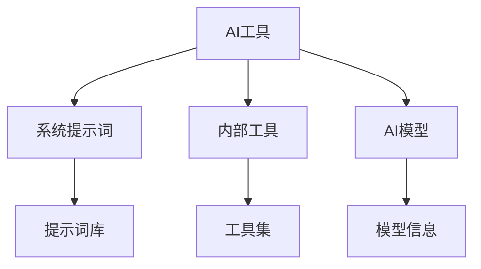

## 今日热点

今日GitHub热榜聚焦AI代理与技能生态爆发，本地LLM评估工具受追捧，显示AI正从云端向边缘设备迁移，同时专业化应用加速落地。

---

## 热门项目一览

| 排名 | 项目 | 语言 | 今日 | 总计 | 简介 |
|:---:|------|:----:|------:|-----:|------|
| 1 | [mvanhorn/last30days-skill](https://github.com/mvanhorn/last30days-skill) | Python | +3,191 | 37,533 | AI agent skill that researc... |
| 2 | [RyanCodrai/turbovec](https://github.com/RyanCodrai/turbovec) | Python | +1,801 | 10,264 | A vector index built on Tur... |
| 3 | [santifer/career-ops](https://github.com/santifer/career-ops) | JavaScript | +1,110 | 51,771 | AI-powered job search syste... |
| 4 | [refactoringhq/tolaria](https://github.com/refactoringhq/tolaria) | TypeScript | +829 | 14,390 | Desktop app to manage markd... |
| 5 | [phuryn/pm-skills](https://github.com/phuryn/pm-skills) | Unknown | +806 | 13,490 | PM Skills Marketplace: 100+... |
| 6 | [roboflow/supervision](https://github.com/roboflow/supervision) | Python | +733 | 43,061 | We write your reusable comp... |
| 7 | [Andyyyy64/whichllm](https://github.com/Andyyyy64/whichllm) | Python | +633 | 4,148 | Find the local LLM that act... |
| 8 | [TapXWorld/ChinaTextbook](https://github.com/TapXWorld/ChinaTextbook) | Roff | +519 | 73,546 | 所有小初高、大学PDF教材。 |
| 9 | [aaif-goose/goose](https://github.com/aaif-goose/goose) | Rust | +489 | 48,526 | an open source, extensible ... |
| 10 | [addyosmani/agent-skills](https://github.com/addyosmani/agent-skills) | Shell | +443 | 49,873 | Production-grade engineerin... |
| 11 | [yikart/AiToEarn](https://github.com/yikart/AiToEarn) | TypeScript | +402 | 20,003 | Let's use AI to Earn! |
| 12 | [openai/plugins](https://github.com/openai/plugins) | JavaScript | +284 | 2,627 | OpenAI Plugins |

---

## 趋势洞察

```
┌─────────────────────────────────────────────────────────────────┐
│  AI/ML 工具         ████████████████████████  11 个项目        │
│  其他               ██████                    3 个项目        │
│  智能家居             ██                        1 个项目        │
│  开发工具             ██                        1 个项目        │
└─────────────────────────────────────────────────────────────────┘
```

---

## 项目深度解读

### 1. mvanhorn/last30days-skill — AI研究聚合器

> **一句话总结**：跨平台AI研究助手，聚合社交媒体与网络信息生成权威摘要

#### 价值主张

| 维度 | 说明 |
|------|------|
| **解决痛点** | 信息过载时代，快速获取多平台权威信息与洞察 |
| **目标用户** | 研究人员、分析师、内容创作者、决策者 |
| **核心亮点** | 多平台聚合 + AI智能总结 + 实时数据获取 + 事实核查 |

#### 技术架构


**技术特色**：
- 跨平台API集成与数据获取
- 大型语言模型的信息处理与总结
- 多源信息交叉验证机制
- 实时数据流处理与分析

#### 热度分析

- 项目获得37k+ stars，单日增长3k+，显示AI研究工具市场需求强劲
- 社区活跃度高，fork数超过3k，表明开发者社区积极参与二次开发

#### 快速上手

```bash
# 安装项目
pip install last30days-skill

# 使用示例
last30days-skill "人工智能最新发展"
```

#### 注意事项

- 项目许可证未知，商业使用前需确认授权条款
- 可能需要API密钥访问各平台数据，需注意平台使用限制
- AI生成内容需验证准确性，特别是关键决策场景


### 2. RyanCodrai/turbovec — 高性能向量索引

> **一句话总结**：基于Rust实现的高性能向量索引库，提供Python绑定，适用于大规模向量检索场景。

#### 价值主张

| 维度 | 说明 |
|------|------|
| **解决痛点** | 解决大规模向量数据的高效检索问题，提升搜索性能和响应速度 |
| **目标用户** | 需要高性能向量检索的机器学习工程师和AI应用开发者 |
| **核心亮点** | Rust高性能实现 + Python易用绑定 + TurboQuant量化技术 |

#### 技术架构


**技术特色**：
- 采用Rust语言实现核心向量索引，提供内存安全和高性能
- 基于TurboQuant量化技术，优化内存使用和计算效率
- 提供简洁Python接口，降低使用门槛

#### 热度分析

- 项目近期增长迅猛，单日新增星标超1800，显示社区高度关注
- 高星标与低fork比例表明项目以用户采纳为主，社区贡献相对有限

#### 快速上手

```bash
# 安装
pip install turbovec

# 基本使用
import turbovec
index = turbovec.Index()
index.add([1.0, 2.0, 3.0])
results = index.query([1.0, 2.0, 3.0], k=5)
```

#### 注意事项

- 项目许可证未知，商业使用前需确认授权条款
- 虽然项目没有开放的issues，但建议关注项目更新和潜在问题
- 需要进一步确认项目API文档的完整性和稳定性


### 3. santifer/career-ops — AI求职助手

> **一句话总结**：基于Claude Code的AI求职助手，提供多技能模式、简历生成和批量处理功能。

#### 价值主张

| 维度 | 说明 |
|------|------|
| **解决痛点** | 简化求职流程，提高简历匹配度和申请效率 |
| **目标用户** | 积极求职的专业人士和批量申请岗位的求职者 |
| **核心亮点** | AI多技能模式 + Go仪表板 + PDF简历生成 + 批量处理功能 |

#### 技术架构


**技术特色**：
- 基于Claude Code的AI求职系统，提供专业的内容生成
- 采用Go语言开发的仪表板，保证高性能处理
- 支持多技能模式，针对不同职位定制化内容

#### 热度分析

- 高star增长率(日增1100+)，fork比例适中(约20%)，表明项目实用性强
- 在AI求职工具领域处于领先地位，社区活跃度高，生态位置显著

#### 快速上手

```bash
# 克隆项目
git clone https://github.com/santifer/career-ops.git
# 安装依赖
npm install
# 启动应用
npm start
```

#### 注意事项

- 项目依赖Claude Code，需要相应的API访问权限
- 项目涉及多种技术栈，建议具备JavaScript和Go基础知识


### 4. refactoringhq/tolaria — Markdown 知识库

> **一句话总结**：跨平台桌面应用，高效组织和管理 Markdown 格式的知识库

#### 价值主张

| 维度 | 说明 |
|------|------|
| **解决痛点** | 解决 Markdown 文档分散、难以统一管理和检索的问题 |
| **目标用户** | 知识工作者、开发者、研究人员和内容创作者 |
| **核心亮点** | 全文搜索 + 跨平台同步 + 可视化知识图谱 |

#### 技术架构


**技术特色**：
- 基于 TypeScript 构建，确保类型安全和高质量代码
- 采用 Electron 框架实现跨平台桌面应用
- 优化的 Markdown 渲染引擎，支持复杂格式和扩展语法

#### 热度分析

- 项目获得 14,390 个 Star，单日增长 829，表明社区活跃


### 5. phuryn/pm-skills — PM智能技能库

> **一句话总结**：集成100+产品经理全生命周期智能技能的插件市场，提供从发现到增长的全方位工具支持。

#### 价值主张

| 维度 | 说明 |
|------|------|
| **解决痛点** | 产品经理缺乏系统化工具支持，难以高效处理产品全生命周期任务 |
| **目标用户** | 产品经理、产品负责人、产品团队 |
| **核心亮点** | 100+智能技能 + 全流程覆盖 + 插件化架构 + AI驱动 + 开源可扩展 |

#### 技术架构


**技术特色**：
- 基于技能的模块化架构，便于扩展和维护
- 支持AI驱动的智能技能执行
- 插件化系统，允许第三方贡献技能

#### 热度分析

- 项目获得13,490星，单日增长800+，显示产品经理群体对工具需求强烈
- 零开放问题，表明项目维护良好，社区反馈可能通过其他渠道处理

#### 快速上手

```bash
# 安装项目
npm install pm-skills

# 列出可用技能
pm-skills list

# 执行特定技能
pm-skills execute [skill-name]
```

#### 注意事项

- 由于项目信息有限，实际使用前需要查阅项目文档
- 项目使用了未知许可证，使用前需确认合规性
- 虽然项目描述提到100+技能，但需要验证实际可用技能数量和质量


### 6. roboflow/supervision — 计算机视觉工具集

> **一句话总结**：提供模块化、可重用的计算机视觉工具，简化视觉任务开发流程。

#### 价值主张

| 维度 | 说明 |
|------|------|
| **解决痛点** | 简化计算机视觉开发流程，减少重复代码，提高开发效率 |
| **目标用户** | 计算机视觉开发者、数据科学家、AI研究员及ML工程师 |
| **核心亮点** | 统一API接口 + 多种预训练模型支持 + 可视化工具集成 + 数据集处理功能 |

#### 技术架构


**技术特色**：
- 基于PyTorch构建，与主流深度学习框架无缝集成
- 提供统一接口，支持多种计算机视觉任务
- 内置丰富的数据增强和预处理工具

#### 热度分析

- 项目star数持续高速增长，日均增长700+，社区活跃度极高
- 作为roboflow生态核心组件，在计算机视觉工具链中占据重要位置

#### 快速上手

```bash
# 安装supervision
pip install supervision

# 基本使用示例
import supervision as sv
import cv2

# 初始化检测器
detector = sv.YOLOv8("yolov8n.pt")
results = detector.predict("image.jpg")

# 可视化结果
annotated_image = sv.BoxAnnotator()(image, results)
```

#### 注意事项

- 项目依赖PyTorch环境，确保Python版本兼容性
- 部分高级功能需要额外安装模型权重，注意网络访问权限
- 对于生产环境使用，建议参考官方文档进行性能优化


### 7. Andyyyy64/whichllm — 硬件适配LLM选择器

> **一句话总结**：一键评估并推荐最适合您硬件的本地大语言模型，基于真实性能基准而非参数数量。

#### 价值主张

| 维度 | 说明 |
|------|------|
| **解决痛点** | 帮助用户在众多本地LLM中快速找到最适合自己硬件的高性能模型 |
| **目标用户** | 想要在本地运行LLM但不确定选择哪个模型的开发者和研究人员 |
| **核心亮点** | 真实性能基准测试 + 硬件适配性 + 一键运行 + 实时更新排名 |

#### 技术架构


**技术特色**：
- 基于真实性能而非参数数量的评估机制
- 硬件适配性分析和推荐算法
- 一键式测试和结果展示系统

#### 热度分析

- 项目近期Star增长迅猛，单日增加633个Star，显示社区高度认可其价值
- 虽无开放Issues，但Fork数量适中，表明项目处于稳定使用阶段

#### 快速上手

```bash
# 克隆仓库
git clone https://github.com/Andyyyy64/whichllm.git
cd whichllm
# 运行测试
python whichllm
```

#### 注意事项

- 由于项目未明确许可证，使用时需注意版权问题
- 测试过程可能会消耗较多计算资源，建议在合适硬件上运行
- 需要确保本地有足够的资源来运行测试的LLM模型


### 8. TapXWorld/ChinaTextbook — 教材资源库

> **一句话总结**：集中收集整理中国各教育阶段教材PDF，为学习者提供一站式教材资源获取平台。

#### 价值主张

| 维度 | 说明 |
|------|------|
| **解决痛点** | 解决中国学生获取教材资源困难问题，提供集中下载渠道 |
| **目标用户** | 中国学生、教师、自学者及教育研究者 |
| **核心亮点** | 教材全面性 + 分类清晰 + 持续更新 + 开源共享 + 免费获取 |

#### 技术架构


**技术特色**：
- 使用Roff格式规范构建文档结构
- 系统化分类组织教材资源体系
- 持续更新机制确保资源时效性

#### 热度分析

- 项目Star数超7万且持续增长，显示教育资源获取是长期社会痛点
- Fork与Star比例较高，表明社区积极参与资源贡献维护

#### 快速上手

```bash
# 克隆项目仓库
git clone https://github.com/TapXWorld/ChinaTextbook.git

# 进入项目目录
cd ChinaTextbook

# 查看教材目录
cat README.md
```

#### 注意事项

- 项目中的教材版权可能存在争议，仅建议用于个人学习参考
- 下载和使用教材时应遵守相关法律法规和版权规定
- 项目需定期更新以获取最新教材版本，建议关注项目动态


### 9. aaif-goose/goose — AI智能代理

> **一句话总结**：开源可扩展AI代理，能安装、执行、编辑和测试任意LLM，超越传统代码建议功能。

#### 价值主张

| 维度 | 说明 |
|------|------|
| **解决痛点** | 现有AI工具仅提供代码建议，缺乏完整执行和测试能力 |
| **目标用户** | 开发者、AI研究人员、需要与LLM深度交互的技术用户 |
| **核心亮点** | 可扩展架构 + 支持任意LLM + 超越代码建议的完整功能链 |

#### 技术架构


**技术特色**：
- 使用Rust语言实现，确保高性能和内存安全
- 提供可扩展的插件架构，支持多种LLM接入
- 实现了从输入到输出的完整AI代理工作流

#### 热度分析

- 项目Star数高达48,526且持续增长(+489 today)，表明其在AI工具领域具有重要地位和广泛认可
- Fork数5,095显示社区积极参与，表明项目具有良好的可扩展性和二次开发价值

#### 快速上手

```bash
# 安装goose
cargo install goose

# 配置LLM
goose config set --provider openai --api-key YOUR_API_KEY

# 执行命令
goose "帮我写一个Python函数，计算斐波那契数列"
```

#### 注意事项

- 项目需要配置相应的LLM API密钥才能正常工作
- 由于项目较新，可能存在一些API不稳定的情况
- 使用前建议查看官方文档，因为项目特性可能快速迭代


### 10. addyosmani/agent-skills — AI工程技能集

> **一句话总结**：为AI编码代理提供生产级工程技能的实践集与最佳指南。

#### 价值主张

| 维度 | 说明 |
|------|------|
| **解决痛点** | 提升AI编码代理的生产级工程能力 |
| **目标用户** | AI开发者、编码助手工具使用者 |
| **核心亮点** | 最佳实践指导 + 工程规范 + 质量标准 |

#### 技术架构


**技术特色**：
- 基于Shell脚本实现的轻量级工程技能
- 提供可复用的AI编码最佳实践
- 整合行业标准工程规范

#### 热度分析

- 项目Star数近5万，近期增长迅速，表明社区高度认可
- 作为AI辅助开发领域的标杆项目，具有显著影响力

#### 快速上手

```bash
# 克隆项目
git clone https://github.com/addyosmani/agent-skills.git
# 进入目录
cd agent-skills
# 查看可用技能
ls -la
```

#### 注意事项

- 需要基本的Shell脚本知识才能充分利用
- 部分技能可能需要根据具体开发环境调整
- 项目持续更新中，建议关注最新变化


### 11. yikart/AiToEarn — AI赚钱工具

> **一句话总结**：利用AI技术创造价值并实现盈利的创新平台。

#### 价值主张

| 维度 | 说明 |
|------|------|
| **解决痛点** | 将AI能力转化为实际收益的渠道缺乏 |
| **目标用户** | AI开发者、内容创作者、数字营销人员 |
| **核心亮点** | AI赋能创收 + 多元化变现模式 + 低门槛参与 |

#### 技术架构


**技术特色**：
- TypeScript构建的全栈应用架构
- 多种AI模型与API的集成能力
- 创新的收益分配与追踪系统

#### 热度分析

- 项目近期增长迅猛，单日新增402个Star，显示市场高度关注
- 3,000+的Fork数表明开发者社区积极参与和二次开发潜力巨大

#### 快速上手

```bash
# 克隆项目
git clone https://github.com/yikart/AiToEarn.git

# 安装依赖
npm install

# 启动项目
npm start
```

#### 注意事项

- 项目许可证未知，使用时需注意合规性
- Open Issues为0，可能表示项目处于初期阶段或问题处理渠道非公开
- 需进一步了解项目的具体盈利模式和风险提示


### 12. openai/plugins — AI插件扩展

> **一句话总结**：为OpenAI模型提供可扩展的插件能力，增强应用场景与功能边界。

#### 价值主张

| 维度 | 说明 |
|------|------|
| **解决痛点** | 为OpenAI模型提供外部工具调用能力，突破原生功能限制 |
| **目标用户** | AI应用开发者、企业集成团队、AI解决方案构建者 |
| **核心亮点** | 标准化插件接口 + 安全沙箱执行 + 多服务集成能力 |

#### 技术架构


**技术特色**：
- 基于RESTful API的标准化插件接口设计
- 提供严格的插件验证和沙箱安全机制
- 支持异步插件调用与结果缓存优化

#### 热度分析

- 项目Star数快速增长，单日新增284星，显示AI插件生态社区高度活跃
- 作为OpenAI官方项目，在AI插件生态中占据核心位置，具有行业标准引领潜力

#### 快速上手

```bash
# 克隆项目
git clone https://github.com/openai/plugins.git

# 安装依赖
cd plugins && npm install

# 启动开发服务器
npm run dev
```

#### 注意事项

- 插件开发需严格遵循OpenAI定义的接口规范和安全策略
- 插件执行在受控环境中，对网络访问和资源使用存在限制
- 需要有效的OpenAI API密钥才能启用插件功能


### 13. maziyarpanahi/openmed — 医疗AI平台

> **一句话总结**：开源医疗健康AI项目，提供医疗领域的智能诊断与辅助决策工具。

#### 价值主张

| 维度 | 说明 |
|------|------|
| **解决痛点** | 降低医疗AI应用门槛，提供开源医疗诊断解决方案 |
| **目标用户** | 医疗机构、AI研究人员、临床医生 |
| **核心亮点** | 开源可定制 + 医疗AI模型 + 隐私保护 + 跨平台支持 |

#### 技术架构


**技术特色**：
- 基于Python构建的医疗AI框架
- 支持多种医疗影像分析模型
- 采用联邦学习保护患者隐私
- 提供RESTful API便于集成

#### 热度分析

- 项目Star数增长迅猛，单日新增190+，显示医疗AI领域开源需求旺盛
- Fork数与Star数比例健康，表明项目不仅被关注也被实际使用和二次开发

#### 快速上手

```bash
# 克隆项目
git clone https://github.com/maziyarpanahi/openmed.git

# 安装依赖
pip install -r requirements.txt

# 启动服务
python app.py
```

#### 注意事项

- 项目许可证信息不明确，使用前需确认开源协议
- 医疗AI应用需谨慎验证，不建议直接用于临床诊断
- 需要专业知识进行模型训练和调优


### 14. francescopace/espectre — WiFi运动检测系统

> **一句话总结**：基于WiFi CSI数据的非视觉运动检测系统，实现无摄像头隐私保护的人体活动监测。

#### 价值主张

| 维度 | 说明 |
|------|------|
| **解决痛点** | 解决传统摄像头监控的隐私问题，利用现有WiFi信号实现无感知运动检测 |
| **目标用户** | 注重隐私的家庭用户、智能家居爱好者、安全系统开发者 |
| **核心亮点** | + 基于CSI数据分析 + 无需专用硬件 + Home Assistant集成 + 保护隐私 + 低成本实现 |

#### 技术架构


**技术特色**：
- 利用802.11n/ac设备的CSI数据实现高精度运动检测
- 采用机器学习算法分析CSI变化模式，区分不同类型运动
- 提供REST API接口，支持多种智能家居平台集成

#### 热度分析

- 项目获得8,240个Star且每日增长134个，显示在智能家居安全领域有显著关注度
- 零Open Issues表明项目成熟度高，社区可能通过其他渠道解决问题

#### 快速上手

```bash
git clone https://github.com/francescopace/espectre.git
cd espectre
pip install -r requirements.txt
```

#### 注意事项

- 需要支持CSI数据提取的WiFi网卡(如Intel 5300/6300/6200)
- 仅支持Linux系统，需配置特定驱动才能获取CSI数据
- 系统性能受WiFi环境和设备位置影响显著，需进行充分测试优化


### 15. opencv/opencv — 计算机视觉基础库

> **一句话总结**：跨平台计算机视觉库，提供图像处理、视频分析和机器学习算法。

#### 价值主张

| 维度 | 说明 |
|------|------|
| **解决痛点** | 解决计算机视觉算法开发和部署的复杂性问题，提供高效工具集 |
| **目标用户** | 计算机视觉研究人员、开发者、机器人工程师、图像处理专业人士 |
| **核心亮点** | 跨平台支持 + 丰富算法库 + 实时性能优化 + 深度学习集成 + Python接口 |

#### 技术架构


**技术特色**：
- 模块化设计，支持多种计算机视觉算法
- 优化的C++实现，提供高性能图像处理
- 跨平台兼容性，支持Windows/Linux/MacOS/移动设备

#### 热度分析

- 拥有8.8万+星标，持续稳定增长，表明其在计算机视觉领域的核心地位
- 活跃的社区贡献和广泛的工业应用，使其成为计算机视觉领域的标准工具

#### 快速上手

```bash
# 安装OpenCV (Python)
pip install opencv-python

# 简单示例代码
import cv2
img = cv2.imread('image.jpg')
gray = cv2.cvtColor(img, cv2.COLOR_BGR2GRAY)
cv2.imshow('Gray Image', gray)
cv2.waitKey(0)
```

#### 注意事项

- OpenCV的C++ API相对复杂，建议从Python接口开始学习
- 大部分功能需要计算机视觉基础知识，不适合完全的初学者
- 在移动设备上使用时需要考虑性能优化和内存限制


### 16. x1xhlol/system-prompts-and-models-of-ai-tools — AI资源宝库

> **一句话总结**：汇集各主流AI工具的系统提示词、内部工具及模型的开源资源库

#### 价值主张

| 维度 | 说明 |
|------|------|
| **解决痛点** | 集中整理分散的AI工具提示词与模型，便于研究与对比 |
| **目标用户** | AI开发者、提示词工程师、研究人员及AI工具爱好者 |
| **核心亮点** | 全面性 + 实用性 + 结构化 + 社区驱动 + 持续更新 |

#### 技术架构



**技术特色**：
- 系统化收集整理各类AI工具资源
- 结构化组织便于查找和对比分析
- 社区驱动保持内容实时更新

#### 热度分析

- 项目超13万星，增长迅速，表明AI工具资源需求旺盛
- 作为AI领域的"资源中心"，在AI开发社区具有重要参考价值

#### 快速上手

```bash
# 克隆项目到本地
git clone https://github.com/x1xhlol/system-prompts-and-models-of-ai-tools.git

# 进入项目目录
cd system-prompts-and-models-of-ai-tools

# 浏览各AI工具的资源
ls -la
```

#### 注意事项

- 项目内容来源于公开渠道，部分信息可能非官方最新版本
- 使用时请遵守各AI工具的使用条款和隐私政策
- 项目持续更新，建议关注最新版本以获取最新资源


## 今日推荐

| 主题 | 推荐项目 | 亮点 |
|------|----------|------|
| 今日最热 | [mvanhorn/last30days-skill](https://github.com/mvanhorn/last30days-skill) | AI agent skill th... |
| 值得关注 | [RyanCodrai/turbovec](https://github.com/RyanCodrai/turbovec) | A vector index bu... |
| 快速上手 | [santifer/career-ops](https://github.com/santifer/career-ops) | AI-powered job se... |
| 长期潜力 | [refactoringhq/tolaria](https://github.com/refactoringhq/tolaria) | Desktop app to ma... |

---

<div align="center">

*Generated on 2026-06-10 | Powered by GitHub Trending Reporter*

</div>