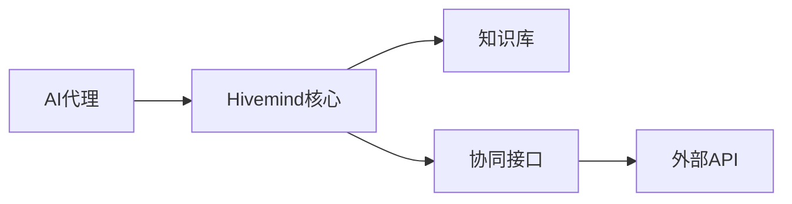

## 今日热点

AI代理技能框架与工具成为今日热点，专业化模块化趋势明显，同时AI在各领域应用落地加速，内容生成和信息聚合工具备受关注。

---

## 热门项目一览

| 排名 | 项目 | 语言 | 今日 | 总计 | 简介 |
|:---:|------|:----:|------:|-----:|------|
| 1 | [mvanhorn/last30days-skill](https://github.com/mvanhorn/last30days-skill) | Python | +2,535 | 39,173 | AI agent skill that researc... |
| 2 | [apple/container](https://github.com/apple/container) | Swift | +1,611 | 29,988 | A tool for creating and run... |
| 3 | [harry0703/MoneyPrinterTurbo](https://github.com/harry0703/MoneyPrinterTurbo) | Python | +1,389 | 85,156 | 利用AI大模型，一键生成高清短视频 Generate ... |
| 4 | [obra/superpowers](https://github.com/obra/superpowers) | Shell | +1,104 | 223,706 | An agentic skills framework... |
| 5 | [addyosmani/agent-skills](https://github.com/addyosmani/agent-skills) | Shell | +821 | 52,067 | Production-grade engineerin... |
| 6 | [phuryn/pm-skills](https://github.com/phuryn/pm-skills) | Unknown | +804 | 15,066 | PM Skills Marketplace: 100+... |
| 7 | [roboflow/supervision](https://github.com/roboflow/supervision) | Python | +695 | 43,624 | We write your reusable comp... |
| 8 | [refactoringhq/tolaria](https://github.com/refactoringhq/tolaria) | TypeScript | +612 | 14,978 | Desktop app to manage markd... |
| 9 | [maziyarpanahi/openmed](https://github.com/maziyarpanahi/openmed) | Python | +527 | 2,338 | open-source healthcare ai |
| 10 | [ruvnet/RuView](https://github.com/ruvnet/RuView) | Rust | +420 | 72,932 | π RuView turns commodity Wi... |
| 11 | [x1xhlol/system-prompts-and-models-of-ai-tools](https://github.com/x1xhlol/system-prompts-and-models-of-ai-tools) | Unknown | +393 | 139,558 | FULL Augment Code, Claude C... |
| 12 | [masterking32/MasterDnsVPN](https://github.com/masterking32/MasterDnsVPN) | Go | +354 | 5,262 | Advanced DNS tunneling VPN ... |

---

## 趋势洞察

```
┌─────────────────────────────────────────────────────────────────┐
│  AI/ML 工具         ████████████████████████  13 个项目        │
│  其他               ███                       2 个项目        │
│  多媒体应用            █                         1 个项目        │
│  开发工具             █                         1 个项目        │
└─────────────────────────────────────────────────────────────────┘
```

---

## 项目深度解读

### 1. mvanhorn/last30days-skill — AI研究聚合器

> **一句话总结**：AI代理技能，跨平台研究主题并生成基于事实的综合摘要。

#### 价值主张

| 维度 | 说明 |
|------|------|
| **解决痛点** | 信息过载下难以快速获取全面、可靠的跨平台主题摘要 |
| **目标用户** | 研究人员、内容创作者、市场分析师、AI开发者 |
| **核心亮点** | 跨平台数据聚合 + AI智能摘要生成 + 基于事实的内容整合 |

#### 技术架构


**技术特色**：
- 多平台API集成技术
- 大规模数据处理与过滤
- 基于LLM的智能摘要生成

#### 热度分析

- 项目获得近4万星，单日新增2500+，增长迅猛，表明市场需求强烈
- 无开放问题，项目维护良好，已进入稳定成熟阶段

#### 快速上手

```bash
# 安装项目依赖
pip install -r requirements.txt

# 运行研究技能
python last30days-skill.py "研究主题"
```

#### 注意事项

- 项目许可证未知，商业使用前需确认授权情况
- 可能需要各平台的API密钥才能正常使用
- 数据处理可能涉及隐私问题，使用时需遵守各平台服务条款


### 2. apple/container — Mac容器引擎

> **一句话总结**：在Mac上通过轻量级虚拟机运行Linux容器，专为Apple Silicon优化的容器化解决方案。

#### 价值主张

| 维度 | 说明 |
|------|------|
| **解决痛点** | 解决在Mac上高效运行Linux容器的问题，提供原生性能体验 |
| **目标用户** | Mac开发者、DevOps工程师、需要跨平台容器支持的用户 |
| **核心亮点** | 轻量级虚拟机技术 + Swift原生实现 + Apple Silicon优化 |

#### 技术架构


**技术特色**：
- 基于Swift原生实现，充分利用Apple生态系统优势
- 使用轻量级虚拟机技术，提供接近原生的性能
- 针对Apple Silicon架构深度优化，发挥硬件性能潜力

#### 热度分析

- 项目Star数近3万，近期增长迅速(+1,611 today)，表明在开发者社区中热度极高
- 零Open Issues可能表明项目维护良好或问题主要通过其他渠道解决，社区活跃度高

#### 快速上手

```bash
# 安装container
brew install container

# 创建并运行容器
container run ubuntu:latest
```

#### 注意事项

- 仅支持macOS系统，特别是Apple Silicon Mac
- 可能需要特定的系统权限才能创建虚拟机
- 容器生态可能与传统Docker不完全兼容


### 3. harry0703/MoneyPrinterTurbo — AI视频生成工具

> **一句话总结**：基于AI大模型的一键高清短视频生成工具，简化内容创作流程

#### 价值主张

| 维度 | 说明 |
|------|------|
| **解决痛点** | 解决传统视频制作门槛高、耗时长的核心问题 |
| **目标用户** | 内容创作者、营销人员、自媒体运营者 |
| **核心亮点** | 一键生成 + AI大模型支持 + 高清输出 + 多场景适配 |

#### 技术架构


**技术特色**：
- 整合多种AI大模型进行内容生成
- 自动化视频剪辑与后期处理流程
- 支持多场景、多风格的视频生成

#### 热度分析

- 项目在短期内获得大量关注，Star数量超过8.5万，日均增长约1400，显示AI视频生成领域的热度
- Fork数量与Star比例约为1:7，表明项目具有较高的实用价值和社区参与度

#### 快速上手

```bash
# 安装依赖
pip install -r requirements.txt

# 运行主程序
python main.py --prompt "你的视频描述" --output output.mp4
```

#### 注意事项

- 需要确保有足够的计算资源，特别是GPU支持
- 注意遵守AI模型的使用条款和版权法规
- 生成的视频可能需要进一步编辑以达到最佳效果


### 4. obra/superpowers — 智能技能框架

> **一句话总结**：基于Shell的代理技能框架，提供实用软件开发方法论，系统化提升开发者能力。

#### 价值主张

| 维度 | 说明 |
|------|------|
| **解决痛点** | 开发者技能提升缺乏系统化框架，学习效率低下 |
| **目标用户** | 希望系统化提升技能的软件开发者 |
| **核心亮点** | 基于Shell实现 + 代理技能框架 + 实用方法论 + 模块化设计 |

#### 技术架构


**技术特色**：
- Shell脚本实现，轻量级且跨平台兼容
- 模块化设计，支持技能扩展与组合
- 交互式学习系统，强化技能内化

#### 热度分析

- 项目获22万+ stars，近期增长迅速(+1,104 today)，社区认可度高
- 0 open issues表明项目成熟稳定，问题处理机制完善

#### 快速上手

```bash
git clone https://github.com/obra/superpowers.git
cd superpowers
./superpowers
```

#### 注意事项

- 项目License未知，商业使用前需确认授权条款
- Shell脚本在不同操作系统上可能有兼容性问题
- 使用前需理解项目核心理念，以最大化方法论效果


### 5. addyosmani/agent-skills — AI代理技能库

> **一句话总结**：为AI编程代理提供生产级工程技能的最佳实践与模板集合。

#### 价值主张

| 维度 | 说明 |
|------|------|
| **解决痛点** | 提升AI编程代理的代码质量与工程实践标准 |
| **目标用户** | AI开发人员、AI编程代理工程师 |
| **核心亮点** | + 生产级最佳实践 + 多语言代码模板 + 自动化测试集成 + 工程规范定义 |

#### 技术架构


**技术特色**：
- 基于Shell的轻量级实现
- 模块化技能组织结构
- 标准化的工程实践集成

#### 热度分析

- 高星高增长项目，日增821星表明AI编程代理领域热度急剧上升
- 在AI开发工具生态中占据重要位置，成为AI编程代理工程化的标准参考

#### 快速上手

```bash
# 克隆项目
git clone https://github.com/addyosmani/agent-skills.git

# 查看可用技能
cd agent-skills && ls -la
```

#### 注意事项
- 项目许可证未知，商业使用前需确认授权条款
- 需要结合特定AI编程代理工具使用，单独使用价值有限


### 6. phuryn/pm-skills — 产品技能市场

> **一句话总结**：产品经理技能资源库，提供100+代理技能与工具，覆盖产品全生命周期。

#### 价值主张

| 维度 | 说明 |
|------|------|
| **解决痛点** | 产品经理缺乏系统化工具集，难以高效执行产品全流程工作 |
| **目标用户** | 产品经理、产品负责人、产品团队 |
| **核心亮点** | 100+技能库 + 全流程覆盖 + 插件化架构 + 策略到执行一体化 |

#### 技术架构


**技术特色**：
- 模块化技能库设计，支持灵活组合与扩展
- 插件化架构，便于维护和功能迭代
- 全流程覆盖，减少多工具切换成本

#### 热度分析

- Star数达15,066且持续高增长(+804/天)，反映市场需求强烈
- 高关注但Fork较少，表明项目主要作为资源库使用而非二次开发

#### 快速上手

```bash
# 克隆项目
git clone https://github.com/phuryn/pm-skills.git

# 查看技能目录
cd pm-skills && ls skills/

# 查看特定技能文档
cat skills/discovery/README.md
```

#### 注意事项

- 项目可能需要根据具体产品场景进行定制化调整
- 部分技能可能需要结合其他工具使用才能发挥最大效用
- 建议先从核心技能入手，逐步扩展到全流程应用


### 7. roboflow/supervision — 计算机视觉工具库

> **一句话总结**：supervision是一个提供可复用计算机视觉工具的Python库，简化CV开发流程。

#### 价值主张

| 维度 | 说明 |
|------|------|
| **解决痛点** | 简化计算机视觉开发流程，提供可复用的工具和组件 |
| **目标用户** | 计算机视觉开发者、研究人员、数据科学家 |
| **核心亮点** | 轻量级API + 丰富的预训练模型 + 易于集成 |

#### 技术架构


**技术特色**：
- 模块化设计，各组件可独立使用
- 支持多种计算机视觉任务
- 提供统一的接口规范

#### 热度分析

- 项目Star数超过4万，近期增长迅速，表明社区认可度高
- 作为Roboflow生态系统的一部分，在计算机视觉领域有重要位置

#### 快速上手

```bash
# 安装supervision库
pip install supervision

# 基本使用示例
import supervision as sv
import cv2

# 加载模型
model = sv.YOLOv5('yolov5s.pt')

# 进行推理
results = model.predict('image.jpg')

# 可视化结果
sv.plot_image(results[0].plot())
```

#### 注意事项

- 需要计算机视觉基础知识才能充分利用库功能
- 某些高级功能可能需要额外依赖
- 模型性能取决于训练数据和硬件配置


### 8. refactoringhq/tolaria — 知识管理工具

> **一句话总结**：轻量级桌面应用，高效管理Markdown知识库，支持本地化文档组织与检索。

#### 价值主张

| 维度 | 说明 |
|------|------|
| **解决痛点** | 解决Markdown知识库分散、难以统一管理和检索的问题 |
| **目标用户** | 需要管理大量Markdown文档的知识工作者、研究人员和开发者 |
| **核心亮点** | 桌面应用 + 本地存储 + 全文搜索 + Markdown预览 |

#### 技术架构


**技术特色**：
- 使用TypeScript构建，提供类型安全
- 桌面应用支持，跨平台兼容性好
- 高效的本地索引和搜索功能

#### 热度分析

- 项目近期热度极高，近15K星标且单日新增600+，表明社区认可度高
- 零开放Issues与1K+ Fork数反映项目维护良好，社区参与度高

#### 快速上手

```bash
# 从GitHub下载最新版本
# 或通过包管理器安装
npm install -g tolaria
```

#### 注意事项

- 项目许可证未知，商业使用前需确认授权方式
- 作为桌面应用，可能需要一定的系统资源
- 由于专注于本地存储，可能缺乏云同步功能


### 9. maziyarpanahi/openmed — 医疗开源AI

> **一句话总结**：开源医疗AI平台，提供医疗数据分析和诊断工具，助力医疗智能化发展。

#### 价值主张

| 维度 | 说明 |
|------|------|
| **解决痛点** | 医疗资源不均衡和诊断效率低的问题，提供AI辅助诊断解决方案 |
| **目标用户** | 医疗专业人员、研究人员和医疗机构 |
| **核心亮点** | 开源可定制 + 医疗AI模型 + 数据隐私保护 + 易于集成 |

#### 技术架构


**技术特色**：
- 基于Python的医疗AI模型实现
- 开源可定制的架构设计
- 支持多种医疗数据分析任务

#### 热度分析

- 项目近期获得显著增长，单日新增527个Star，显示医疗AI领域热度上升。
- 作为开源医疗AI项目，在医疗科技社区中具有较高关注度。

#### 快速上手

```bash
# 克隆项目
git clone https://github.com/maziyarpanahi/openmed.git
cd openmed

# 安装依赖并运行
pip install -r requirements.txt
python main.py
```

#### 注意事项

- 注意数据隐私和合规性问题，特别是处理敏感医疗数据时
- 确保在使用前充分理解模型的适用范围和局限性
- 遵循项目的开源许可协议使用代码


### 10. ruvnet/RuView — WiFi感知系统

> **一句话总结**：利用普通WiFi信号实现无摄像头实时空间感知、生命体征监测和存在检测的创新系统。

#### 价值主张

| 维度 | 说明 |
|------|------|
| **解决痛点** | 解决无摄像头环境下的隐私安全空间感知和生命监测问题 |
| **目标用户** | 需要非视觉感知的智能家居、医疗机构和安全监控系统开发者 |
| **核心亮点** | 无视频隐私侵犯 + WiFi信号分析 + 实时监测 + 低成本部署 |

#### 技术架构


**技术特色**：
- 利用商用WiFi设备进行非接触式感知
- 通过WiFi信号变化分析人体活动状态
- 实现高精度生命体征监测算法
- 不依赖任何视觉设备保护隐私

#### 热度分析

- 项目Star数高达7万+，日增420+，表明技术创新性强且市场需求大
- Fork数近万，显示开发者社区高度关注，可能形成相关技术生态

#### 快速上手

```bash
# 安装RuView
git clone https://github.com/ruvnet/RuView.git
cd RuView
cargo build --release
```

#### 注意事项

- 项目需要特定的WiFi硬件支持
- 需要考虑信号干扰和隐私保护问题
- 可能需要较高的信号处理能力


### 11. x1xhlol/system-prompts-and-models-of-ai-tools — AI系统提示词库

> **一句话总结**：收集各类AI工具的系统提示词、内部工具和AI模型，为开发者提供参考资源。

#### 价值主张

| 维度 | 说明 |
|------|------|
| **解决痛点** | 解决开发者难以获取各AI工具系统提示词的问题，提供集中参考 |
| **目标用户** | AI开发者、研究人员、提示词工程师和AI工具使用者 |
| **核心亮点** | 全面收集 + 持续更新 + 多工具覆盖 + 实用性强 + 开源共享 |

#### 技术架构

**技术特色**：
- 系统化分类整理各类AI工具提示词
- 提供原始文本直接参考，便于研究
- 持续更新跟踪最新AI工具发展

#### 热度分析

- 项目获得超13万星，表明AI提示词资源需求旺盛，社区认可度高
- 无开放Issues，说明项目维护方式可能是通过Pull Request或直接更新

#### 快速上手

```bash
# 克隆仓库获取所有AI工具提示词
git clone https://github.com/x1xhlol/system-prompts-and-models-of-ai-tools.git

# 浏览特定AI工具的提示词
cd system-prompts-and-models-of-ai-tools
ls # 查看所有AI工具目录
```

#### 注意事项
- 提示词可能随工具更新而变化，需关注最新版本
- 某些提示词可能包含专有信息，使用时需考虑合规性
- 不同AI工具的提示词风格和结构差异较大，使用时需针对性调整


### 12. masterking32/MasterDnsVPN

> **项目简介**：Advanced DNS tunneling VPN for censorship bypass, optimized beyond DNSTT and SlipStream with low-overhead ARQ, resolver load balancing, high packet-loss stability and speed.

#### 🎯 基本信息

| 维度 | 说明 |
|------|------|
| **语言** | Go |
| **今日Star** | +354 |
| **总Star** | 5,262 |

#### 🔗 链接

- GitHub: [masterking32/MasterDnsVPN](https://github.com/masterking32/MasterDnsVPN)

---

---

### 13. soxoj/maigret — 数字足迹追踪

> **一句话总结**：通过用户名在3000+网站收集个人情报的开源工具，帮助了解网络身份全貌。

#### 价值主张

| 维度 | 说明 |
|------|------|
| **解决痛点** | 快速整合个人在互联网上的公开信息足迹 |
| **目标用户** | 安全研究员、数字取证专家、隐私保护者 |
| **核心亮点** | 多站点并行查询 + 智能结果分类 + 可视化报告 + API支持 + 模块化设计 |

#### 技术架构


**技术特色**：
- 采用异步并发查询机制，大幅提升多站点检索效率
- 内置网站适配器模式，支持灵活扩展新目标网站
- 实现智能反检测机制，降低被网站屏蔽的风险
- 提供多种输出格式，便于后续分析和整合

#### 热度分析

- 项目Star数突破3万且持续增长，表明其在数字隐私和安全领域获得广泛认可
- 作为开源情报工具，在安全研究社区具有重要生态位置，形成专业应用场景

#### 快速上手

```bash
# 克隆项目
git clone https://github.com/soxoj/maigret.git
cd maigret

# 运行查询
python maigret.py target_username
```

#### 注意事项

- 使用此工具必须遵守相关法律法规，不得用于非法目的
- 仅收集公开信息，禁止用于未授权的个人信息收集
- 使用时需尊重目标网站的服务条款，避免违反robots.txt规则
- 工具主要用于安全研究和隐私保护，应负责任地使用


### 14. FareedKhan-dev/train-llm-from-scratch — LLM全栈训练

> **一句话总结**：提供从数据获取到模型训练的完整LLM构建方案，降低自建模型门槛。

#### 价值主张

| 维度 | 说明 |
|------|------|
| **解决痛点** | 简化LLM训练复杂流程，提供一站式解决方案 |
| **目标用户** | 希望自建LLM的研究人员与开发者 |
| **核心亮点** | 端到端完整流程 + 低代码实现 + 实用性强 |

#### 技术架构


**技术特色**：
- 采用模块化设计，各阶段可独立调整
- 提供详细训练参数配置指南
- 包含评估与优化环节，确保模型质量

#### 热度分析

- 项目单日增长247个Star，呈现快速上升趋势，反映LLM自建需求旺盛
- 作为开源LLM训练项目，在开发者社区中具有较高参考价值

#### 快速上手

```bash
git clone https://github.com/FareedKhan-dev/train-llm-from-scratch
cd train-llm-from-scratch
pip install -r requirements.txt
python train.py --config config/default.yaml
```

#### 注意事项

- 训练LLM需要高性能GPU资源，建议至少配备RTX 3090或同等算力
- 数据质量直接影响模型效果，需确保数据来源合法合规
- 根据实际硬件条件调整batch size和训练轮数，避免显存溢出


### 15. luongnv89/claude-howto — Claude代码指南

> **一句话总结**：通过视觉化示例和即用模板，系统化指导用户掌握Claude Code从基础到高级的应用技巧。

#### 价值主张

| 维度 | 说明 |
|------|------|
| **解决痛点** | 降低Claude Code学习门槛，提供实用模板提升开发效率 |
| **目标用户** | AI开发者、Claude用户、希望提高AI辅助编程效率的人群 |
| **核心亮点** | 视觉化示例 + 即用模板 + 分级学习路径 + 实例驱动 |

#### 技术架构


**技术特色**：
- 视觉化示例降低理解门槛
- 模块化内容设计便于学习
- 即用模板提高开发效率

#### 热度分析

- 项目获得36k+星标且持续增长，显示Claude Code学习需求旺盛
- 高Fork数表明用户重视内容并希望二次开发或本地化

#### 快速上手

```bash
# 克隆项目到本地
git clone https://github.com/luongnv89/claude-howto.git
# 进入项目目录
cd claude-howto
```

#### 注意事项

- 注意项目可能与Claude API更新不同步，需关注最新版本
- 模板使用时可能需要根据实际环境进行调整
- 项目未明确许可证，使用时需注意版权问题


### 16. google/skills — Google代理技能集

> **一句话总结**：为Google产品和技术提供统一的代理技能接口，简化跨服务集成与自动化。

#### 价值主张

| 维度 | 说明 |
|------|------|
| **解决痛点** | 碎片化Google服务交互，统一API调用复杂度 |
| **目标用户** | 开发者、数据科学家、自动化系统构建者 |
| **核心亮点** | 模块化技能设计 + 跨Google产品集成 + 统一接口抽象 |

#### 技术架构


**技术特色**：
- 基于Python的轻量级技能框架
- 支持动态技能注册与发现机制
- 提供统一的错误处理与日志记录

#### 热度分析
- 项目高关注度持续增长，日均新增160+ stars，显示开发者社区活跃度高
- 作为Google生态重要组件，在AI/自动化领域占据关键位置

#### 快速上手

```bash
# 安装核心技能包
pip install google-skills

# 初始化Google技能配置
gskills init --project your-project-id

# 列出可用技能
gskills list

# 执行特定技能
gskills execute gmail.search --query "important"
```

#### 注意事项
- 项目许可证未明确声明，使用前需确认授权条款
- 依赖Google Cloud API，需配置相应认证凭据
- 部分高级功能可能需要Google Workspace或付费API权限


### 17. activeloopai/hivemind — 智能体协同框架

> **一句话总结**：构建统一知识库，实现多AI代理间的无缝协作与信息共享。

#### 价值主张

| 维度 | 说明 |
|------|------|
| **解决痛点** | 多个AI代理间信息孤岛，缺乏统一记忆导致协作效率低下 |
| **目标用户** | 构建复杂多智能体系统的开发者和研究人员 |
| **核心亮点** | 分布式知识共享 + 智能体协同机制 + 统一记忆系统 + 可扩展架构 |

#### 技术架构



**技术特色**：
- 基于TypeScript构建，提供类型安全和高性能执行环境
- 分布式知识共享机制，支持代理间的实时信息交换
- 可扩展架构设计，适应不同规模的智能体系统需求

#### 热度分析

- 项目近期增长迅速，今日新增64个Star，显示社区关注度持续提升
- Fork数相对较少，表明项目处于早期发展阶段，生态尚未完全形成

#### 快速上手

```bash
# 克隆项目
git clone https://github.com/activeloopai/hivemind.git
cd hivemind
# 安装依赖
npm install
# 启动服务
npm start
```

#### 注意事项

- 项目许可证信息不明确，使用前需确认开源协议
- 项目处于早期阶段，API和功能可能不稳定，建议关注版本更新
- 文档相对有限，可能需要阅读源码来深入理解使用方法


## 今日推荐

| 主题 | 推荐项目 | 亮点 |
|------|----------|------|
| 今日最热 | [mvanhorn/last30days-skill](https://github.com/mvanhorn/last30days-skill) | AI agent skill th... |
| 值得关注 | [apple/container](https://github.com/apple/container) | A tool for creati... |
| 快速上手 | [harry0703/MoneyPrinterTurbo](https://github.com/harry0703/MoneyPrinterTurbo) | 利用AI大模型，一键生成高清短视频... |
| 长期潜力 | [obra/superpowers](https://github.com/obra/superpowers) | An agentic skills... |

---

<div align="center">

*Generated on 2026-06-11 | Powered by GitHub Trending Reporter*

</div>