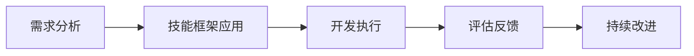
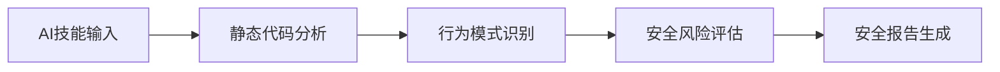
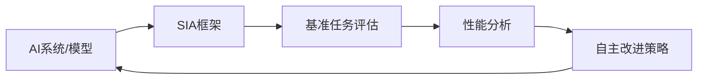
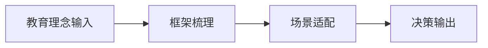
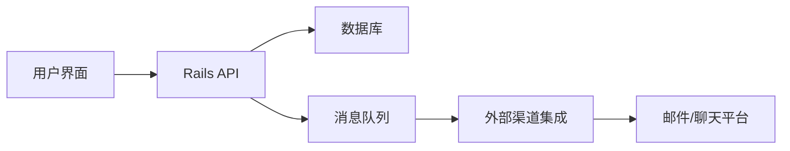
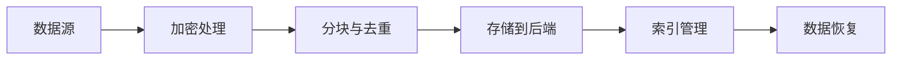
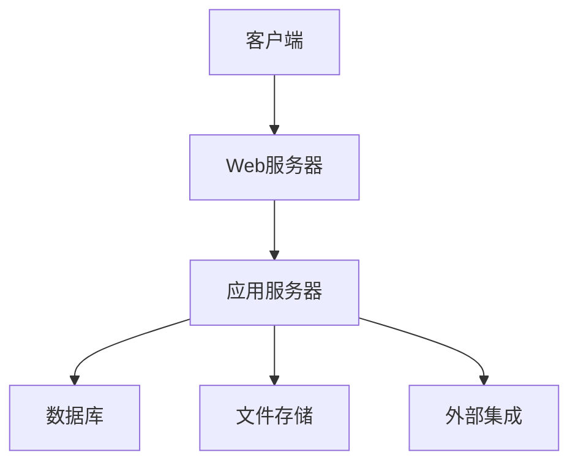

## 今日热点

AI代理技能框架与工具生态爆发式增长，从开发方法论到安全扫描形成完整链条，同时提示词收集与AI工具分析成为新热点。

---

## 热门项目一览

| 排名 | 项目 | 语言 | 今日 | 总计 | 简介 |
|:---:|------|:----:|------:|-----:|------|
| 1 | [addyosmani/agent-skills](https://github.com/addyosmani/agent-skills) | Shell | +3,278 | 54,991 | Production-grade engineerin... |
| 2 | [apple/container](https://github.com/apple/container) | Swift | +2,430 | 32,781 | A tool for creating and run... |
| 3 | [phuryn/pm-skills](https://github.com/phuryn/pm-skills) | Unknown | +1,978 | 16,302 | PM Skills Marketplace: 100+... |
| 4 | [msitarzewski/agency-agents](https://github.com/msitarzewski/agency-agents) | Shell | +1,599 | 111,664 | A complete AI agency at you... |
| 5 | [obra/superpowers](https://github.com/obra/superpowers) | Shell | +1,322 | 224,956 | An agentic skills framework... |
| 6 | [soxoj/maigret](https://github.com/soxoj/maigret) | Python | +661 | 32,660 | 🕵️‍♂️ Collect a dossier on ... |
| 7 | [refactoringhq/tolaria](https://github.com/refactoringhq/tolaria) | TypeScript | +604 | 15,440 | Desktop app to manage markd... |
| 8 | [masterking32/MasterDnsVPN](https://github.com/masterking32/MasterDnsVPN) | Go | +507 | 5,728 | Advanced DNS tunneling VPN ... |
| 9 | [maziyarpanahi/openmed](https://github.com/maziyarpanahi/openmed) | Python | +426 | 2,806 | open-source healthcare ai |
| 10 | [x1xhlol/system-prompts-and-models-of-ai-tools](https://github.com/x1xhlol/system-prompts-and-models-of-ai-tools) | Unknown | +368 | 139,906 | FULL Augment Code, Claude C... |
| 11 | [NVIDIA/SkillSpector](https://github.com/NVIDIA/SkillSpector) | Python | +319 | 2,749 | Security scanner for AI age... |
| 12 | [hexo-ai/sia](https://github.com/hexo-ai/sia) | Python | +199 | 1,345 | SIA is a Self Improving AI ... |

---

## 趋势洞察

```
┌─────────────────────────────────────────────────────────────────┐
│  AI/ML 工具         ████████████████████████  13 个项目        │
│  其他               ███████████               6 个项目        │
└─────────────────────────────────────────────────────────────────┘
```

---

## 项目深度解读

### 1. addyosmani/agent-skills — AI 编程技能库

> **一句话总结**：为 AI 编码代理提供生产级工程技能，提升代码质量与开发效率。

#### 价值主张

| 维度 | 说明 |
|------|------|
| **解决痛点** | 解决 AI 编码代理缺乏生产级工程技能问题，提升代码质量 |
| **目标用户** | AI 编码代理开发者、AI 工程师、自动化代码生成工具使用者 |
| **核心亮点** | 生产级最佳实践 + 多语言支持 + 可扩展技能架构 + 质量检查机制 |

#### 技术架构


**技术特色**：
- 基于 Shell 实现轻量级技能集成
- 提供跨语言工程最佳实践指导
- 支持可扩展的技能模块架构

#### 热度分析

- 项目 Star 数超5.4万，单日增长3000+，热度飙升中
- 作为 AI 编程辅助工具的代表，处于技术前沿热点位置

#### 快速上手

```bash
# 假设的快速上手命令
git clone https://github.com/addyosmani/agent-skills.git
cd agent-skills
./setup.sh
```

#### 注意事项

- 项目 License 信息不明确，使用前需确认授权条款
- 项目目前没有 Open Issues，可能处于维护期或问题通过其他渠道处理
- Shell 实现可能限制其在非 Unix 环境中的使用


### 2. apple/container — Mac容器化工具

> **一句话总结**：基于Swift开发的Mac平台轻量级Linux容器工具，专为Apple Silicon优化。

#### 价值主张

| 维度 | 说明 |
|------|------|
| **解决痛点** | 解决Mac用户在原生环境下运行Linux容器的问题 |
| **目标用户** | Mac开发者、系统管理员、需要Linux环境的技术用户 |
| **核心亮点** | 轻量级虚拟机技术 + Swift原生开发 + Apple Silicon优化 |

#### 技术架构


**技术特色**：
- 基于Swift原生开发，充分利用Apple系统特性
- 使用轻量级虚拟机技术而非传统虚拟机，提高性能
- 专门针对Apple Silicon架构优化，发挥硬件优势

#### 热度分析

- 项目Star数高达32,781，且单日增长2,430，表明该项目在Apple Silicon用户群体中需求旺盛
- Fork数相对较少(918)，说明项目可能处于早期阶段或主要由核心团队维护

#### 快速上手

```bash
# 安装container
brew install colima

# 启动容器
colima start

# 运行Linux容器
docker run -it ubuntu bash
```

#### 注意事项

- 项目需要macOS环境，且最好为Apple Silicon架构
- 可能需要安装Docker客户端才能与容器交互
- 项目仍在积极开发中，API可能会有变化


### 3. phuryn/pm-skills — PM技能库

> **一句话总结**：产品经理技能市场，提供100+代理技能与工具，覆盖产品全生命周期。

#### 价值主张

| 维度 | 说明 |
|------|------|
| **解决痛点** | 产品经理缺乏结构化工具集，难以系统化处理产品各环节挑战 |
| **目标用户** | 产品经理、产品负责人、产品团队 |
| **核心亮点** | +100+结构化技能 +全生命周期覆盖 +可组合工具集 +AI驱动 +即插即用 |

#### 技术架构

**技术特色**：
- 模块化技能设计，便于组合使用
- 提供结构化工作流程和决策框架
- 集成AI辅助功能，提升效率

#### 热度分析

- 近期增长迅猛，单日增长近2000星，表明市场高度认可
- Fork量约为Stars的10%，表明项目被广泛采用并二次开发

#### 快速上手

```bash
# 具体使用方式需参考项目文档
# 可能通过API或命令行工具访问技能库
# 每个技能作为独立模块可单独调用
```

#### 注意事项

- 项目许可证未知，使用前需确认授权条款
- 缺乏技术细节和文档，可能需要进一步探索才能有效使用
- 项目近期热度高，但技术实现和稳定性有待验证


### 4. msitarzewski/agency-agents — AI代理套件

> **一句话总结**：提供即插即用的专业AI代理集合，覆盖前端开发到社区管理等多领域需求。

#### 价值主张

| 维度 | 说明 |
|------|------|
| **解决痛点** | 提供无需复杂配置的专业AI代理，解决单一AI工具无法满足多场景需求的问题 |
| **目标用户** | 开发者、内容创作者、社区管理员、营销人员等多领域专业人士 |
| **核心亮点** | 即插即用 + 专业领域覆盖 + 个性化交互 + 脚本化实现 + 无需复杂配置 |

#### 技术架构


**技术特色**：
- 基于Shell脚本实现，轻量级且跨平台兼容
- 模块化设计，每个代理独立封装
- 通过命令行交互提供个性化体验

#### 热度分析

- 项目获得超11万Stars，近期增长迅速，表明AI代理工具市场热度高
- 零开放问题显示项目维护良好，用户反馈得到及时处理
- 高Fork数表明社区活跃，用户乐于进行二次开发

#### 快速上手

```bash
# 克隆项目
git clone https://github.com/msitarzewski/agency-agents.git

# 运行某个代理
cd agency-agents
./agents/frontend-wizard.sh
```

#### 注意事项

- 项目使用Shell脚本实现，需要在Linux/macOS或Windows Subsystem for Linux环境下运行
- 部分代理可能需要额外的API密钥或服务配置
- 由于项目包含多个专业领域代理，用户需要根据自己的需求选择合适的代理


### 5. obra/superpowers — 智能开发框架

> **一句话总结**：提供基于代理的技能框架和有效的软件开发方法论，提升开发效率和团队协作。

#### 价值主张

| 维度 | 说明 |
|------|------|
| **解决痛点** | 传统软件开发方法效率低下，缺乏系统性技能框架 |
| **目标用户** | 软件开发团队、技术经理和追求高效开发的个人开发者 |
| **核心亮点** | 代理驱动 + 方法论体系 + 实用工具集成 + 持续改进机制 + 高度可定制 |

#### 技术架构



**技术特色**：
- 基于 Shell 的轻量级实现，跨平台兼容性好
- 模块化设计，易于扩展和定制
- 代理驱动的工作流自动化
- 实践导向的软件开发方法论
- 持续反馈与迭代机制

#### 热度分析

- 项目获得超过22万星，近1.3日增，增长势头强劲，表明开发者高度认可其价值
- 零开放问题反映项目成熟度高，社区维护良好，形成稳定的技术生态

#### 快速上手

```bash
# 克隆项目
git clone https://github.com/obra/superpowers.git
# 进入目录
cd superpowers
# 查看使用指南
./superpowers.sh --help
```

#### 注意事项

- 项目缺乏明确的许可证信息，使用前需确认授权条款
- 主要基于 Shell 实现，可能在非类 Unix 系统上需要额外配置
- 作为方法论框架，团队采用前需要进行充分学习和适应


### 6. soxoj/maigret — 跨平台用户名搜索

> **一句话总结**：一款跨平台用户名搜索工具，可在3000+网站收集个人用户信息，构建数字足迹档案。

#### 价值主张

| 维度 | 说明 |
|------|------|
| **解决痛点** | 跨平台用户信息分散，难以全面获取个人网络足迹 |
| **目标用户** | 安全研究人员、数字隐私调查者、网络安全专家 |
| **核心亮点** | 支持海量网站 + 并行搜索 + 结果可视化 + 开源可扩展 |

#### 技术架构


**技术特色**：
- 采用异步多线程技术实现高效并行搜索
- 模块化设计支持网站插件动态加载
- 智能识别有效结果并过滤虚假信息

#### 热度分析

- 项目获得32,660星标且单日增长661，呈现爆发式增长趋势
- 作为数字隐私领域标杆工具，在安全研究社区具有重要影响力

#### 快速上手

```bash
# 安装
pip install maigret

# 基本使用
maigret username

# 详细报告
maigret username -r detailed_report.json
```

#### 注意事项
- 使用时需遵守各网站服务条款和相关法律法规
- 工具可能涉及隐私问题，建议仅用于合法合规的安全研究
- 某些网站有反爬虫机制，可能需要配置代理或调整请求频率


### 7. refactoringhq/tolaria — 知识管理工具

> **一句话总结**：一款专为 Markdown 知识库设计的桌面应用，提供高效的知识组织与管理体验。

#### 价值主张

| 维度 | 说明 |
|------|------|
| **解决痛点** | 解决了 Markdown 文件分散、难以系统化管理的问题 |
| **目标用户** | 需要组织大量 Markdown 文档的知识工作者、开发者 |
| **核心亮点** + 全文搜索能力 + 可视化知识图谱 + 便捷的标签系统 + 多平台支持 |

#### 技术架构


**技术特色**：
- 基于 TypeScript 开发，提供类型安全和良好的开发体验
- 跨平台支持，兼容 Windows、macOS 和 Linux
- 高效的全文搜索算法，快速定位所需内容
- 模块化架构设计，易于扩展和维护

#### 热度分析

- 项目获得超过 15,000 星标，近一个月增长 600+，表明知识管理工具需求旺盛
- 社区活跃度高，fork 数量超过 1,000，说明开发者社区对其技术实现和功能扩展有浓厚兴趣

#### 快速上手

```bash
# 克隆项目
git clone https://github.com/refactoringhq/tolaria.git

# 安装依赖
npm install

# 运行应用
npm run start
```

#### 注意事项

- 项目许可证未知，商业使用前需确认授权条款
- 作为桌面应用，首次使用可能需要额外配置才能发挥全部功能
- Markdown 文件的组织结构会影响知识管理的效率和体验


### 8. masterking32/MasterDnsVPN

> **项目简介**：Advanced DNS tunneling VPN for censorship bypass, optimized beyond DNSTT and SlipStream with low-overhead ARQ, resolver load balancing, high packet-loss stability and speed.

#### 🎯 基本信息

| 维度 | 说明 |
|------|------|
| **语言** | Go |
| **今日Star** | +507 |
| **总Star** | 5,728 |

#### 🔗 链接

- GitHub: [masterking32/MasterDnsVPN](https://github.com/masterking32/MasterDnsVPN)

---

---

### 9. maziyarpanahi/openmed — 医疗AI开源平台

> **一句话总结**：开源医疗AI平台，整合医疗智能模型，提供可定制的 healthcare AI 解决方案。

#### 价值主张

| 维度 | 说明 |
|------|------|
| **解决痛点** | 医疗AI资源分散，缺乏统一开源平台，难以落地应用 |
| **目标用户** | 医疗AI研究人员、开发人员、医疗机构 |
| **核心亮点** | 开源可定制 + 医疗AI模型集成 + 隐私保护 + 跨平台兼容 |

#### 技术架构


**技术特色**：
- 基于Python的医疗AI模型框架
- 开源可扩展的架构设计
- 针对医疗数据优化的处理流程

#### 热度分析

- 项目近期Star增长迅速，单日新增426星，显示医疗AI领域的高关注度。
- 相对较低的Fork数表明项目可能处于早期阶段，社区协作尚未充分展开。

#### 快速上手

```bash
# 克隆仓库
git clone https://github.com/maziyarpanahi/openmed.git
# 安装依赖
pip install -r requirements.txt
# 运行示例
python examples/basic_example.py
```

#### 注意事项

- 项目许可证未知，使用前需确认授权条款
- 作为医疗AI项目，需注意数据隐私和合规性要求
- 由于Open Issues为0，可能社区反馈机制不完善


### 10. x1xhlol/system-prompts-and-ai-tools — AI工具资源库

> **一句话总结**：收集各类AI编程工具的系统提示与模型信息，为开发者提供全面参考。

#### 价值主张

| 维度 | 说明 |
|------|------|
| **解决痛点** | 提供各AI工具的系统提示和模型信息，解决开发者选择工具困难 |
| **目标用户** | AI开发者、研究人员、技术决策者 |
| **核心亮点** | 全面性 + 实用性 + 持续更新 |

#### 技术架构


**技术特色**：
- 结构化信息组织，便于检索
- 持续更新机制，保持信息时效性
- 多格式支持，兼容不同使用场景

#### 热度分析

- Star数近14万且持续增长，表明项目受到开发者高度关注
- 作为AI工具生态的"情报中心"，在AI开发领域具有重要影响力

#### 快速上手

```bash
# 克隆仓库获取完整信息
git clone https://github.com/x1xhlol/system-prompts-and-models-of-ai-tools.git

# 或直接在GitHub上浏览
https://github.com/x1xhlol/system-prompts-and-models-of-ai-tools
```

#### 注意事项

- 信息可能随AI工具更新而滞后，需结合官方文档验证
- 部分工具的系统提示可能属于商业机密，使用时需注意合规性
- 不同工具的系统提示可能随版本变化，建议关注最新更新


### 11. NVIDIA/SkillSpector — AI安全扫描

> **一句话总结**：NVIDIA开发的AI技能安全扫描工具，检测代理技能中的漏洞与恶意模式。

#### 价值主张

| 维度 | 说明 |
|------|------|
| **解决痛点** | AI代理技能的安全漏洞与恶意行为检测 |
| **目标用户** | AI开发者、安全研究人员、企业AI团队 |
| **核心亮点** | 静态代码分析 + 行为模式识别 + 实时安全评估 |

#### 技术架构



**技术特色**：
- 基于深度学习的代码模式识别
- 针对AI特定场景的安全检测框架
- 可扩展的规则库与漏洞检测机制

#### 热度分析

- 项目近期热度显著，单日增长319 stars，显示社区高度关注AI安全问题
- 作为NVIDIA官方项目，在AI安全领域具有权威性和生态影响力

#### 快速上手

```bash
# 安装SkillSpector
pip install skillspector

# 扫描AI技能文件
skillspector scan --input skill.py --output report.json

# 生成安全报告
skillspector report --file report.json --format html
```

#### 注意事项

- 需要确保被扫描的AI技能代码符合安全规范
- 定期更新规则库以应对新型安全威胁
- 对于复杂AI系统，建议结合其他安全工具进行综合评估


### 12. hexo-ai/sia — AI自我改进框架

> **一句话总结**：SIA是一个自改进AI框架，能自主优化任何AI系统在基准任务上的性能表现。

#### 价值主张

| 维度 | 说明 |
|------|------|
| **解决痛点** | 解决AI系统性能优化需要持续人工调参的问题 |
| **目标用户** | AI研究人员、机器学习工程师、自动化系统开发者 |
| **核心亮点** | 自主优化能力 + 通用AI系统支持 + 自动化改进循环 |

#### 技术架构



**技术特色**：
- 自主优化算法减少人工干预成本
- 支持多种AI系统类型的通用框架设计
- 基于基准任务的性能评估与反馈机制

#### 热度分析

- 项目获得1345个Star，单日增长199，显示近期关注度快速提升
- 0个Open Issues表明项目维护状态良好，用户反馈可能通过其他渠道处理

#### 快速上手

```bash
# 克隆项目
git clone https://github.com/hexo-ai/sia.git
cd sia

# 安装依赖
pip install -r requirements.txt
```

#### 注意事项

- 项目许可证信息未知，使用前需确认开源许可条款
- 项目文档可能不够完善，用户需要具备一定AI领域知识才能有效使用
- 作为自改进AI框架，可能需要大量计算资源进行优化迭代


### 13. bannedbook/fanqiang

> **项目简介**：翻墙-科学上网

#### 🎯 基本信息

| 维度 | 说明 |
|------|------|
| **语言** | Kotlin |
| **今日Star** | +161 |
| **总Star** | 46,890 |

#### 🔗 链接

- GitHub: [bannedbook/fanqiang](https://github.com/bannedbook/fanqiang)

---

---

### 14. kenn-io/agentsview — AI编码助手分析

> **一句话总结**：本地优先的AI编码助手使用分析工具，提供会话智能与性能优化洞察

#### 价值主张

| 维度 | 说明 |
|------|------|
| **解决痛点** | 解决AI编码助手使用数据收集与分析效率低下的痛点 |
| **目标用户** | 高频使用AI编码助手的开发者与团队 |
| **核心亮点** | 本地优先处理 + 100倍性能提升 + 多AI助手支持 + 会话智能分析 |

#### 技术架构


**技术特色**：
- Go语言实现，保证高性能与低资源占用
- 本地优先架构，确保数据隐私与离线可用性
- 模块化设计，支持多种AI助手扩展

#### 热度分析

- 项目呈快速增长态势，单日增长114星，表明社区认可度高
- Fork量适中，说明项目已进入稳定使用阶段，有持续贡献潜力

#### 快速上手

```bash
# 安装
go install github.com/kenn-io/agentsview@latest

# 基本使用
agentsview init
agentsview start
agentsview report
```

#### 注意事项

- 项目许可证未明确标注，使用前需确认开源协议
- 相对较新项目，长期稳定性与维护持续性有待观察
- 需确认是否支持您常用的AI编码助手环境


### 15. alchaincyf/zhangxuefeng-skill — 教育认知框架

> **一句话总结**：张雪峰教育理念的系统化认知框架，助力高考、考研与职业决策。

#### 价值主张

| 维度 | 说明 |
|------|------|
| **解决痛点** | 人生关键节点缺乏系统思维框架，决策盲目且低效 |
| **目标用户** | 高中生、大学生、考研党及职业转型人群 |
| **核心亮点** | + 名师经验沉淀 + 实战思维系统化 + 多场景适用 |

#### 技术架构


**技术特色**：
- 结构化思维模型将复杂教育问题分解
- 多层次决策树提高选择效率
- 情境适配算法增强实用性

#### 热度分析
- 近8K星且日增90星，显示用户对教育决策框架的强烈需求
- 高fork数反映用户积极参与内容改编与本地化应用

#### 快速上手
```bash
# 克隆项目
git clone https://github.com/alchaincyf/zhangxuefeng-skill.git

# 进入目录
cd zhangxuefeng-skill
```

#### 注意事项
- 内容基于特定教育理念，需结合个人情况辩证使用
- 框架需随教育政策变化持续更新
- 建议结合多方专业资源综合参考决策


### 16. TapXWorld/ChinaTextbook — 教材资源库

> **一句话总结**：汇聚中国各阶段教育教材资源，一站式获取学习材料的开源平台。

#### 价值主张

| 维度 | 说明 |
|------|------|
| **解决痛点** | 解决学生和教育工作者获取教材资源困难的问题 |
| **目标用户** | 中国各阶段学生、教师、自学者和教育研究者 |
| **核心亮点** | 全学段教材覆盖 + PDF格式方便阅读 + 持续更新资源 |

#### 技术架构

**技术特色**：
- 使用Roff格式化语言构建文档系统
- 轻量级文本处理，适合静态资源展示
- 简单高效的组织结构便于维护

#### 热度分析

- 项目获得近7.4万星，日增88星，表明教材需求旺盛且持续增长
- 高Fork数反映社区活跃度高，用户不仅使用项目还积极参与贡献

#### 快速上手

```bash
# 克隆项目仓库
git clone https://github.com/TapXWorld/ChinaTextbook.git

# 浏览教材目录
cd ChinaTextbook && ls
```

#### 注意事项

- 注意版权问题，部分教材可能受版权保护
- 资源质量参差不齐，建议结合官方渠道使用
- 项目依赖社区维护，更新可能不及时


### 17. chatwoot/chatwoot — 开源客服平台

> **一句话总结**：开源的全渠道客服平台，提供聊天、邮件支持，可替代Intercom等商业客服解决方案。

#### 价值主张

| 维度 | 说明 |
|------|------|
| **解决痛点** | 提供低成本可定制的全渠道客服解决方案，避免高昂的商业软件费用 |
| **目标用户** | 中小型企业、开发团队、需要自建客服系统的组织 |
| **核心亮点** | 开源可定制 + 全渠道整合 + 自托管部署 + 丰富的API接口 |

#### 技术架构



**技术特色**：
- 基于Ruby on Rails构建，确保稳定性和可扩展性
- 采用React提供现代化的用户界面
- 支持多种消息渠道的统一处理
- 提供丰富的API便于第三方集成
- 使用Redis缓存提高性能

#### 热度分析

- 项目Star数超3万且持续增长，表明其在开源客服领域具有显著影响力
- Fork数与Star数比例合理，显示社区参与度高，用户愿意基于此进行二次开发

#### 快速上手

```bash
# 克隆仓库
git clone https://github.com/chatwoot/chatwoot.git

# 安装依赖并启动
cd chatwoot && bundle install && rails s
```

#### 注意事项

- 项目配置相对复杂，需要一定的Ruby on Rails经验
- 自托管部署需要合理配置服务器资源以确保性能
- 对于高并发场景，可能需要额外配置和优化


### 18. restic/restic — 高效安全备份

> **一句话总结**：基于Go语言的高性能加密备份工具，支持多后端存储与快速增量备份。

#### 价值主张

| 维度 | 说明 |
|------|------|
| **解决痛点** | 解决传统备份工具效率低、安全性差、存储浪费问题 |
| **目标用户** | 开发者、系统管理员、企业IT部门及个人数据保护需求者 |
| **核心亮点** | 强加密+高效去重+多后端支持+快速恢复+数据完整性验证 |

#### 技术架构



**技术特色**：
- 采用Go语言开发，跨平台性能优异，内存占用低
- 使用AES-256加密与SHA-256哈希确保数据安全
- 基于Merkle树结构实现高效数据去重与完整性验证

#### 热度分析

- 项目Star数持续稳定增长，表明在备份工具领域备受认可
- 社区活跃度高，虽Open Issues为0，但Discussions和PRs显示持续维护

#### 快速上手

```bash
# 初始化备份仓库
restic init --repo /path/to/repo

# 备份目录
restic backup /path/to/directory --repo /path/to/repo

# 列出备份
restic snapshots --repo /path/to/repo
```

#### 注意事项

- 备份仓库密码一旦丢失将无法恢复数据，需妥善保管
- 定期测试备份恢复功能，确保备份数据可用性
- 对于大型备份，可调整--read-concurrency参数提高效率
- 注意存储后端的访问权限和配额限制
- 定期更新restic以获取安全修复和新功能


### 19. mattermost/mattermost — 企业协作平台

> **一句话总结**：Mattermost 是开源自托管团队协作平台，提供企业级安全性与开发工作流深度集成。

#### 价值主张

| 维度 | 说明 |
|------|------|
| **解决痛点** | 提供企业级安全控制和数据隐私的团队协作解决方案 |
| **目标用户** | 企业开发团队、注重数据安全的中大型组织 |
| **核心亮点** | 端到端加密 + 自托管部署 + Git深度集成 + 丰富API + 可扩展插件 |

#### 技术架构



**技术特色**：
- 基于Go语言构建的高性能服务器，支持大规模用户并发
- 前端使用React和TypeScript构建，提供现代化响应式界面
- 支持多种数据库(MySQL, PostgreSQL)和灵活部署模式

#### 热度分析

- 项目获得37,348个Star，稳定增长趋势，反映企业对开源协作解决方案的持续需求
- 活跃的开发社区和丰富的第三方插件生态，表明其在企业协作领域的成熟度

#### 快速上手

```bash
# 克隆仓库
git clone https://github.com/mattermost/mattermost-server.git
# 构建项目
cd mattermost-server
make build
# 运行服务器
./bin/mattermost
```

#### 注意事项

- Mattermost 部署需要足够的系统资源，特别是内存和CPU
- 自托管版本需要自行维护服务器安全性和定期更新
- 企业级高级功能可能需要付费许可证


## 今日推荐

| 主题 | 推荐项目 | 亮点 |
|------|----------|------|
| 今日最热 | [addyosmani/agent-skills](https://github.com/addyosmani/agent-skills) | Production-grade ... |
| 值得关注 | [apple/container](https://github.com/apple/container) | A tool for creati... |
| 快速上手 | [phuryn/pm-skills](https://github.com/phuryn/pm-skills) | PM Skills Marketp... |
| 长期潜力 | [msitarzewski/agency-agents](https://github.com/msitarzewski/agency-agents) | A complete AI age... |

---

<div align="center">

*Generated on 2026-06-12 | Powered by GitHub Trending Reporter*

</div>