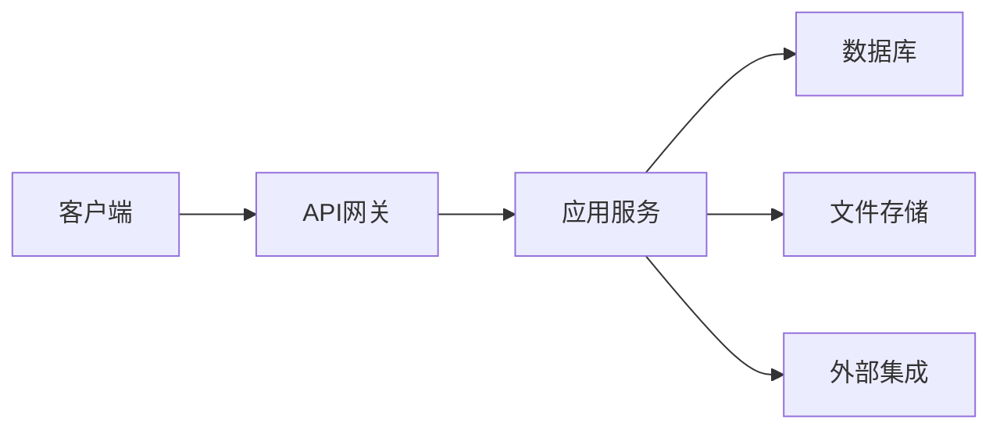
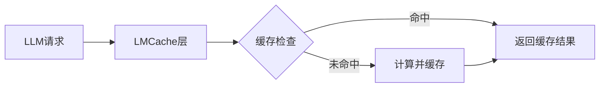
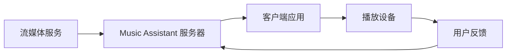

## 今日热点

今日GitHub热榜项目精彩纷呈。

---

## 热门项目一览

| 排名 | 项目 | 语言 | 今日 | 总计 | 简介 |
|:---:|------|:----:|------:|-----:|------|
| 1 | [apple/container](https://github.com/apple/container) | Swift | +3,504 | 35,191 | A tool for creating and run... |
| 2 | [addyosmani/agent-skills](https://github.com/addyosmani/agent-skills) | Shell | +2,656 | 56,894 | Production-grade engineerin... |
| 3 | [obra/superpowers](https://github.com/obra/superpowers) | Shell | +1,275 | 226,071 | An agentic skills framework... |
| 4 | [msitarzewski/agency-agents](https://github.com/msitarzewski/agency-agents) | Shell | +1,026 | 112,455 | A complete AI agency at you... |
| 5 | [phuryn/pm-skills](https://github.com/phuryn/pm-skills) | Unknown | +827 | 17,031 | PM Skills Marketplace: 100+... |
| 6 | [maziyarpanahi/openmed](https://github.com/maziyarpanahi/openmed) | Python | +515 | 3,209 | open-source healthcare ai |
| 7 | [masterking32/MasterDnsVPN](https://github.com/masterking32/MasterDnsVPN) | Go | +400 | 6,032 | Advanced DNS tunneling VPN ... |
| 8 | [mattermost/mattermost](https://github.com/mattermost/mattermost) | TypeScript | +388 | 37,646 | Mattermost is an open sourc... |
| 9 | [refactoringhq/tolaria](https://github.com/refactoringhq/tolaria) | TypeScript | +369 | 15,813 | Desktop app to manage markd... |
| 10 | [iptv-org/iptv](https://github.com/iptv-org/iptv) | TypeScript | +179 | 118,066 | Collection of publicly avai... |
| 11 | [microsoft/PowerToys](https://github.com/microsoft/PowerToys) | C | +103 | 134,360 | Microsoft PowerToys is a co... |
| 12 | [LMCache/LMCache](https://github.com/LMCache/LMCache) | Python | +28 | 8,650 | LMCache: Supercharge Your L... |

---

## 趋势洞察

```
┌─────────────────────────────────────────────────────────────────┐
│  AI/ML 工具         ████████████████████████  8 个项目        │
│  其他               ████████████              4 个项目        │
│  多媒体应用            ███                       1 个项目        │
└─────────────────────────────────────────────────────────────────┘
```

---

## 项目深度解读

### 1. apple/container — Mac容器化工具

> **一句话总结**：在Mac上创建和运行Linux容器的Swift工具，针对Apple Silicon优化。

#### 价值主张

| 维度 | 说明 |
|------|------|
| **解决痛点** | 解决Mac用户无法原生运行Linux容器的问题 |
| **目标用户** | Mac开发者、系统管理员、Apple Silicon用户 |
| **核心亮点** | Swift编写 + Apple Silicon优化 + 轻量级虚拟机 |

#### 技术架构


**技术特色**：
- 使用Swift原生编写，充分利用Apple生态系统
- 基于轻量级虚拟机技术，实现高效隔离
- 专门针对Apple Silicon架构优化，性能表现优异

#### 热度分析

- 项目获得35,191个Star，单日增长3,504，显示极高的社区关注度和增长速度
- 0个Open Issues表明项目维护良好，问题解决及时，社区活跃度高

#### 快速上手

```bash
# 安装container
brew install container

# 创建并启动一个容器
container create --name my-ubuntu ubuntu:latest
container start my-ubuntu

# 在容器中执行命令
container exec my-ubuntu bash
```

#### 注意事项

- 项目仅支持Mac平台，特别是Apple Silicon
- 可能需要较新的macOS版本才能正常运行
- 由于使用虚拟机技术，可能会有一定的性能开销


### 2. addyosmani/agent-skills — AI编码技能库

> **一句话总结**：为AI编码代理提供生产级工程技能，提升代码质量和开发效率。

#### 价值主张

| 维度 | 说明 |
|------|------|
| **解决痛点** | AI编码代理缺乏系统化工程技能指导 |
| **目标用户** | AI编码工具开发者和使用者 |
| **核心亮点** | 生产级标准 + 工程实践 + 质量保证 + 最佳实践 |

#### 技术架构


**技术特色**：
- 基于Shell实现，跨平台兼容性强
- 聚焦工程实践而非算法创新
- 提供可复用的技能组件

#### 热度分析

- 项目获得高关注度，Star数超过5.6万，近期增长迅速
- 在AI编码工具生态中具有重要参考价值，社区活跃度高

#### 快速上手

```bash
# 克隆项目
git clone https://github.com/addyosmani/agent-skills.git
cd agent-skills
# 运行示例或安装
./setup.sh
```

#### 注意事项

- 需要基本的Shell环境支持
- 可能需要根据具体需求调整配置
- 许可证信息不明确，使用前需确认授权条款


### 3. obra/superpowers — 智能开发框架

> **一句话总结**：基于Shell的轻量级智能技能框架，提供高效开发方法论与协作工具

#### 价值主张

| 维度 | 说明 |
|------|------|
| **解决痛点** | 解决软件开发方法论不统一、技能管理混乱问题 |
| **目标用户** | 软件开发团队、技术管理者和追求效率的个人开发者 |
| **核心亮点** | + 轻量级Shell实现 + 代理技能框架 + 零配置启动 + 高扩展性 + 实用方法论 |

#### 技术架构


**技术特色**：
- 基于Shell的跨平台轻量级实现，无需复杂依赖
- 模块化设计，支持自定义技能插件扩展
- 提供完整的开发工作流和最佳实践指南

#### 热度分析

- 项目获得22万+星标，近期每日新增1,200+星，表明社区高度认可且持续增长
- Fork数量约为Star的9%，显示项目不仅被关注，也被广泛实践和二次开发

#### 快速上手

```bash
# 克隆项目
git clone https://github.com/obra/superpowers.git
cd superpowers
# 初始化并应用框架
./superpowers init && ./superpowers apply
```

#### 注意事项

- 项目依赖Shell环境，需确保系统兼容性
- Open Issues为0，问题反馈可能通过其他渠道，建议关注社区讨论
- 方法论需要团队共同实践，个人使用效果可能有限


### 4. msitarzewski/agency-agents — AI代理工具集

> **一句话总结**：提供一系列专业AI代理，每个都有特定专长和个性，可完成从开发到社区管理的各类任务。

#### 价值主张

| 维度 | 说明 |
|------|------|
| **解决痛点** | 提供一站式AI解决方案，无需分别寻找各类专业AI工具 |
| **目标用户** | 开发者、内容创作者、社区管理者、企业团队 |
| **核心亮点** | 多样化专业代理 + 个性定制 + 即用型工作流 + 无需复杂配置 |

#### 技术架构


**技术特色**：
- 基于Shell脚本实现，跨平台兼容性强
- 模块化设计，每个代理独立可重用
- 通过命令行接口提供便捷调用方式

#### 热度分析

- 项目获得超11万星，日增千星，显示AI代理工具需求旺盛
- 零开放问题，表明项目成熟度高，社区维护良好

#### 快速上手

```bash
# 克隆项目
git clone https://github.com/msitarzewski/agency-agents.git
cd agency-agents
# 运行特定代理
./agent-name [参数]
```

#### 注意事项

- 需要配置相应的AI服务API密钥
- 不同代理可能需要额外的依赖和环境设置
- Shell脚本执行需注意安全性，特别是处理用户输入时


### 5. phuryn/pm-skills — 产品技能市场

> **一句话总结**：提供100+产品管理代理技能、命令和插件，覆盖从发现到增长的完整产品生命周期。

#### 价值主张

| 维度 | 说明 |
|------|------|
| **解决痛点** | 产品经理缺乏系统化工具和技能支持，影响决策效率 |
| **目标用户** | 产品经理、产品团队及相关从业人员 |
| **核心亮点** | + 100+专业技能 + 全生命周期覆盖 + 插件化架构 + AI驱动 + 实用性强 |

#### 技术架构

由于项目编程语言未知，且没有明确的技术流程描述，我无法生成mermaid图。

**技术特色**：
- 插件化架构设计，支持技能扩展
- AI驱动的智能决策支持系统
- 命令行界面，便于快速调用

#### 热度分析

- 项目Star数超过17k，日增800+，表明社区认可度高且增长迅速
- 高Fork/Star比例显示用户积极参与项目定制和扩展

#### 快速上手

```bash
# 假设通过npm安装（具体安装方式需查看官方文档）
npm install pm-skills

# 初始化技能市场
pm-skills init

# 查看可用技能
pm-skills list
```

#### 注意事项

- 项目License未知，使用时需注意授权条款
- 项目信息相对简略，使用前建议查看完整文档


### 6. maziyarpanahi/openmed — 医疗AI开源平台

> **一句话总结**：开源医疗AI平台，将先进AI技术应用于医疗健康领域

#### 价值主张

| 维度 | 说明 |
|------|------|
| **解决痛点** | 医疗资源分布不均，AI技术难以落地临床实践 |
| **目标用户** | 医疗机构、研究人员、AI开发者 |
| **核心亮点** | 开源透明 + 医疗AI模型 + 易于集成 + 隐私保护 |

#### 技术架构


**技术特色**：
- 基于Python构建，易于扩展和维护
- 采用模块化设计，支持多种医疗AI任务
- 注重数据隐私和安全合规

#### 热度分析

- 项目近期增长迅速，单日增加515 stars，表明医疗AI领域热度高
- 作为开源医疗AI项目，在医疗AI社区具有重要影响力

#### 快速上手

```bash
# 克隆项目
git clone https://github.com/maz


### 7. masterking32/MasterDnsVPN

> **项目简介**：Advanced DNS tunneling VPN for censorship bypass, optimized beyond DNSTT and SlipStream with low-overhead ARQ, resolver load balancing, high packet-loss stability and speed.

#### 🎯 基本信息

| 维度 | 说明 |
|------|------|
| **语言** | Go |
| **今日Star** | +400 |
| **总Star** | 6,032 |

#### 🔗 链接

- GitHub: [masterking32/MasterDnsVPN](https://github.com/masterking32/MasterDnsVPN)

---

---

### 8. mattermost/mattermost — 企业协作平台

> **一句话总结**：Mattermost是开源的企业级团队协作平台，提供安全可控的通信与开发协作环境。

#### 价值主张

| 维度 | 说明 |
|------|------|
| **解决痛点** | 企业级安全通信与协作需求，避免数据泄露风险 |
| **目标用户** | 中大型企业、开发团队、注重数据安全组织 |
| **核心亮点** | 自托管部署 + 端到端加密 + API集成能力 + 合规性支持 |

#### 技术架构



**技术特色**：
- 基于Go语言核心服务与TypeScript前端，全栈类型安全
- 支持自托管与云部署，满足不同企业需求
- 提供丰富的API和插件系统，高度可扩展
- 采用微服务架构，支持水平扩展

#### 热度分析

- 高Star增长率显示企业对开源协作平台持续需求旺盛
- 活跃的开发社区和丰富的第三方生态系统，形成完整协作解决方案

#### 快速上手

```bash
# 安装Docker和Docker Compose
# 克隆并启动Mattermost
git clone https://github.com/mattermost/mattermost-server.git
cd mattermost-server
docker-compose up -d
```

#### 注意事项

- 自托管部署需要一定的服务器资源和技术维护能力
- 大规模部署需要考虑数据库性能优化和负载均衡配置
- 与Microsoft Teams等商业产品相比，定制化程度高但开箱即用功能可能较少


### 9. refactoringhq/tolaria — 知识库管理工具

> **一句话总结**：简洁高效的桌面应用，帮助用户结构化地管理和检索Markdown知识库内容。

#### 价值主张

| 维度 | 说明 |
|------|------|
| **解决痛点** | Markdown文档分散难管理，知识检索效率低 |
| **目标用户** | 需要系统化管理技术文档、笔记和知识库的用户 |
| **核心亮点** | 全文检索 + 标签系统 + 本地存储 + 界面简洁 + 跨平台 |

#### 技术架构


**技术特色**：
- 使用TypeScript确保代码质量和类型安全
- 采用本地索引实现快速全文检索
- 跨平台支持，兼容Windows/macOS/Linux
- 轻量级设计，资源占用低

#### 热度分析

- 项目Star数增长迅速，今日新增369星，显示社区高度认可
- Fork数适中，表明项目已被广泛使用但定制需求不高
- 无Open Issues，说明项目维护良好，问题响应及时

#### 快速上手

```bash
# 克隆项目
git clone https://github.com/refactoringhq/tolaria.git
# 安装依赖
npm install
# 启动应用
npm start
```

#### 注意事项

- 项目许可证未知，商业使用前需确认授权方式
- 作为桌面应用，首次运行可能需要额外配置
- 项目依赖可能随时间变化，注意版本兼容性


### 10. iptv-org/iptv — 全球IPTV频道库

> **一句话总结**：汇聚全球公开可用IPTV频道，提供无电视机的多样化观看选择。

#### 价值主张

| 维度 | 说明 |
|------|------|
| **解决痛点** | 解决用户获取全球合法IPTV频道源困难的问题 |
| **目标用户** | 需要免费观看全球电视内容的普通用户和开发者 |
| **核心亮点** | 全球频道覆盖 + 持续更新 + 多格式支持 + 社区驱动 |

#### 技术架构


**技术特色**：
- 使用TypeScript确保频道数据结构的类型安全
- 采用社区协作模式维护频道列表
- 提供多格式输出以兼容不同播放器

#### 热度分析

- 项目获得11.8万星，日增179星，表明IPTV需求持续增长且项目维护活跃
- 零开放问题反映项目成熟度高，社区问题解决机制高效

#### 快速上手

```bash
# 克隆仓库获取频道列表
git clone https://github.com/iptv-org/iptv.git
# 使用支持m3u列表的播放器打开channels.m3u文件
```

#### 注意事项

- 频道内容可能受地域限制，某些频道可能无法在所有地区访问
- 频道链接可能失效，需要定期更新维护
- 使用前请确认频道来源的合法性，避免侵犯版权


### 11. microsoft/PowerToys — Windows增效工具

> **一句话总结**：微软官方出品的一套Windows系统增强工具集，提升系统性能与用户体验

#### 价值主张

| 维度 | 说明 |
|------|------|
| **解决痛点** | 解决Windows原生系统功能不足，提供高效便捷的系统增强功能 |
| **目标用户** | Windows高级用户、开发者、系统管理员和效率追求者 |
| **核心亮点** | + 多工具集合 + 官方支持 + 免费开源 + 高度可定制 + 轻量级 |

#### 技术架构


**技术特色**：
- 采用模块化设计，各工具独立运行减少资源占用
- 基于Windows API深度系统调用，实现底层功能增强
- 提供统一配置界面，简化多工具管理

#### 热度分析

- 高星项目持续增长，日均新增100+ stars，表明项目受热度和认可度持续攀升
- 微软官方维护的开源项目，在Windows生态系统中具有重要地位，社区活跃度高

#### 快速上手

```bash
# 克隆仓库
git clone https://github.com/microsoft/PowerToys.git

# 构建项目
cd PowerToys
build -configuration Release

# 安装并运行
.\PowerToys.Setup.exe
```

#### 注意事项
- 部分高级功能可能需要管理员权限
- 建议仅从官方渠道下载，确保安全性
- 某些工具可能与安全软件冲突，需适当配置


### 12. LMCache/LMCache — LLM缓存优化

> **一句话总结**：LMCache是大语言模型的高性能KV缓存加速器，显著提升LLM推理速度和效率。

#### 价值主张

| 维度 | 说明 |
|------|------|
| **解决痛点** | 大语言模型推理过程中KV缓存效率低、内存占用高的问题 |
| **目标用户** | 大语言模型开发者、研究人员和企业AI应用部署者 |
| **核心亮点** | 高性能KV缓存 + 内存优化 + 分布式支持 + 易于集成 |

#### 技术架构



**技术特色**：
- 智能KV缓存管理算法，减少内存占用
- 分布式缓存架构，支持大规模部署
- 高效的序列化/反序列化机制，降低开销

#### 热度分析

- 项目获得8,650 stars，近期增长迅速(+28 today)，表明社区对该项目高度关注
- 作为LLM基础设施项目，处于AI加速工具生态的关键位置，有望成为行业标准组件

#### 快速上手

```bash
# 安装LMCache
pip install lmcache

# 基本使用示例
from lmcache import LMCache
cache = LMCache()
result = cache.get("prompt")
if not result:
    result = compute_result("prompt")
    cache.set("prompt", result)
```

#### 注意事项

- 需要足够的内存资源来存储KV缓存
- 与特定LLM框架的集成可能需要额外配置
- 在分布式环境中使用时需考虑网络延迟因素


### 13. music-assistant/server — 音乐媒体中枢

> **一句话总结**：开源音乐媒体服务器，统一管理流媒体服务与多设备播放，打造家庭音乐中心

#### 价值主张

| 维度 | 说明 |
|------|------|
| **解决痛点** | 解决多平台音乐服务碎片化与设备控制分散问题，实现统一音乐管理体验 |
| **目标用户** | 音乐爱好者、多设备家庭音响系统用户、自托管技术爱好者 |
| **核心亮点** | 多流媒体服务集成 + 跨平台扬声器支持 + 开源免费 + 模块化架构 |

#### 技术架构



**技术特色**：
- Python开发，跨平台兼容性强，易于扩展
- 模块化设计，支持多种流媒体服务和播放设备插件
- 轻量级核心，适合树莓派等资源有限设备运行

#### 热度分析

- 项目Star数稳步增长，日均约20个新Star，表明社区认可度持续提升
- 0 open issues可能反映问题处理高效，但也需关注是否有活跃的社区讨论渠道

#### 快速上手

```bash
# 克隆仓库
git clone https://github.com/music-assistant/server.git

# 安装依赖
cd server && pip install -r requirements.txt

# 启动服务器
python -m music_assistant
```

#### 注意事项

- 需要始终在线的设备作为服务器，建议使用树莓派、NAS或小型PC
- 项目许可证信息不明确，使用前需确认开源许可条款
- 可能需要一定的技术背景进行配置和故障排除


## 今日推荐

| 主题 | 推荐项目 | 亮点 |
|------|----------|------|
| 今日最热 | [apple/container](https://github.com/apple/container) | A tool for creati... |
| 值得关注 | [addyosmani/agent-skills](https://github.com/addyosmani/agent-skills) | Production-grade ... |
| 快速上手 | [obra/superpowers](https://github.com/obra/superpowers) | An agentic skills... |
| 长期潜力 | [msitarzewski/agency-agents](https://github.com/msitarzewski/agency-agents) | A complete AI age... |

---

<div align="center">

*Generated on 2026-06-13 | Powered by GitHub Trending Reporter*

</div>