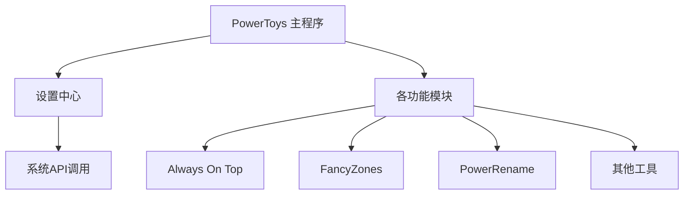
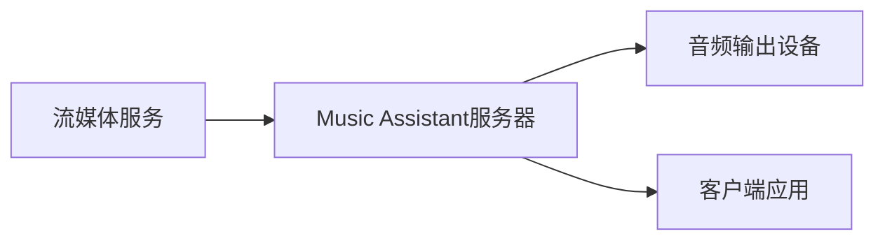
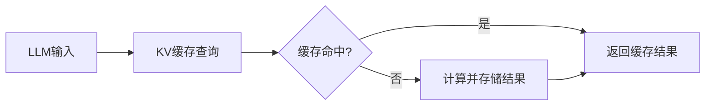
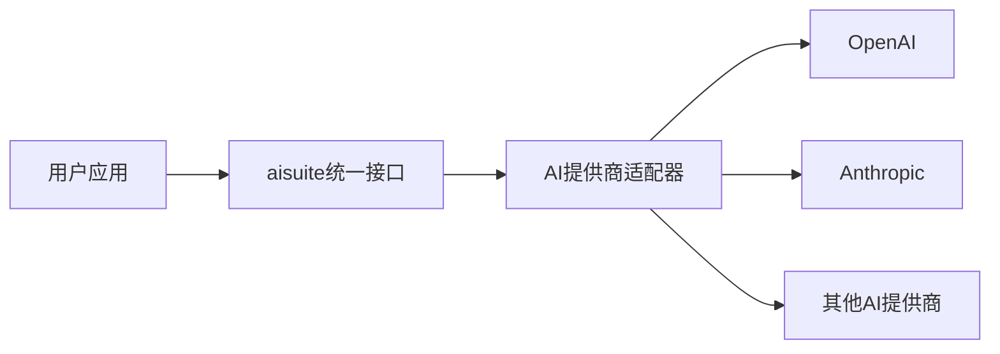
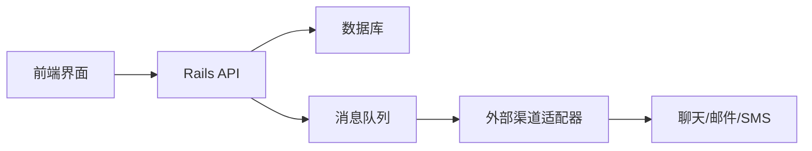

## 今日热点

今日GitHub热榜呈现AI开发工具爆发式增长趋势，多个AI编码代理和性能优化项目获得大量关注，同时Apple生态开发工具需求显著上升。

---

## 热门项目一览

| 排名 | 项目 | 语言 | 今日 | 总计 | 简介 |
|:---:|------|:----:|------:|-----:|------|
| 1 | [addyosmani/agent-skills](https://github.com/addyosmani/agent-skills) | Shell | +1,514 | 58,480 | Production-grade engineerin... |
| 2 | [apple/container](https://github.com/apple/container) | Swift | +1,487 | 36,363 | A tool for creating and run... |
| 3 | [obra/superpowers](https://github.com/obra/superpowers) | Shell | +924 | 226,999 | An agentic skills framework... |
| 4 | [NVIDIA/SkillSpector](https://github.com/NVIDIA/SkillSpector) | Python | +804 | 4,509 | Security scanner for AI age... |
| 5 | [iptv-org/iptv](https://github.com/iptv-org/iptv) | TypeScript | +530 | 119,221 | Collection of publicly avai... |
| 6 | [microsoft/PowerToys](https://github.com/microsoft/PowerToys) | C | +370 | 134,694 | Microsoft PowerToys is a co... |
| 7 | [music-assistant/server](https://github.com/music-assistant/server) | Python | +270 | 2,015 | Music Assistant is a free, ... |
| 8 | [LMCache/LMCache](https://github.com/LMCache/LMCache) | Python | +238 | 8,908 | LMCache: Supercharge Your L... |
| 9 | [kenn-io/agentsview](https://github.com/kenn-io/agentsview) | Go | +190 | 2,383 | Local-first session intelli... |
| 10 | [andrewyng/aisuite](https://github.com/andrewyng/aisuite) | Python | +127 | 14,138 | Simple, unified interface t... |
| 11 | [x1xhlol/system-prompts-and-models-of-ai-tools](https://github.com/x1xhlol/system-prompts-and-models-of-ai-tools) | Unknown | +109 | 140,314 | FULL Augment Code, Claude C... |
| 12 | [bannedbook/fanqiang](https://github.com/bannedbook/fanqiang) | Kotlin | +93 | 47,511 | 翻墙-科学上网 |

---

## 趋势洞察

```
┌─────────────────────────────────────────────────────────────────┐
│  AI/ML 工具         ████████████████████████  10 个项目        │
│  其他               ████                      2 个项目        │
│  多媒体应用            ██                        1 个项目        │
│  项目管理             ██                        1 个项目        │
└─────────────────────────────────────────────────────────────────┘
```

---

## 项目深度解读

### 1. addyosmani/agent-skills — AI代理工程技能

> **一句话总结**：提供AI编码代理所需的生产级工程技能，提升代码质量和开发效率。

#### 价值主张

| 维度 | 说明 |
|------|------|
| **解决痛点** | AI编码代理缺乏实际工程经验和最佳实践，导致代码质量参差不齐 |
| **目标用户** | AI开发工程师、编码工具开发者、AI代理构建者 |
| **核心亮点** | 提供工程最佳实践指导 + 代码质量评估标准 + 工作流程优化建议 + 错误处理模式 + 性能优化技巧 |

#### 技术架构


**技术特色**：
- 基于Shell脚本实现的轻量级解决方案
- 集成业界工程标准和最佳实践
- 提供可扩展的技能框架

#### 热度分析

- 项目获得超5.8万Star，近期增长迅速，表明AI辅助开发领域需求旺盛
- 作为AI工程化实践的重要参考，在AI编码工具生态中占据关键位置

#### 快速上手

```bash
# 克隆仓库
git clone https://github.com/addyosmani/agent-skills.git
cd agent-skills
# 运行主脚本
./agent-skills.sh
```

#### 注意事项

- 项目可能需要一定的AI开发背景知识
- 需要配合其他AI编码工具使用才能发挥最大效用
- 建议定期关注项目更新，获取最新的工程实践指导


### 2. apple/container — Mac容器工具

> **一句话总结**：在Mac上创建运行Linux容器的Swift工具，专为Apple Silicon优化。

#### 价值主张

| 维度 | 说明 |
|------|------|
| **解决痛点** | 解决Mac用户无法直接运行Linux容器的问题 |
| **目标用户** | Mac开发者、系统管理员、Apple Silicon用户 |
| **核心亮点** | Swift编写 + 轻量级虚拟机 + Apple Silicon优化 + Linux容器支持 |

#### 技术架构


**技术特色**：
- 基于Swift原生实现，区别于传统Go语言容器工具
- 利用Apple Silicon硬件加速的轻量级虚拟化技术
- 无需完整虚拟机即可运行Linux容器，资源占用低

#### 热度分析

- 高Star数(36k+)且近期增长迅速(+1.5k/day)，表明项目热度高且受关注
- 作为Apple生态中的容器解决方案，填补了macOS上的容器化空白

#### 快速上手

```bash
# 安装container
brew install container

# 创建新容器
container create my-container

# 运行容器
container run my-container
```

#### 注意事项

- 项目可能仅支持Apple Silicon Mac，Intel Mac可能不兼容
- 容器生态可能不如Docker完整，某些Linux应用可能无法运行
- 需要了解Swift和容器基本概念才能充分利用项目特性


### 3. obra/superpowers — 智能开发框架

> **一句话总结**：一套实用的代理技能框架与软件开发方法论，提升开发效率与质量。

#### 价值主张

| 维度 | 说明 |
|------|------|
| **解决痛点** | 解决软件开发方法论不明确、技能框架缺乏的问题 |
| **目标用户** | 软件开发者、技术团队和效率提升追求者 |
| **核心亮点** | 实用导向方法论 + 代理技能框架 + Shell工具集 + 高可执行性 |

#### 技术架构


**技术特色**：
- 基于Shell的轻量级实现方案
- 模块化的技能框架设计
- 实用导向的方法论体系

#### 热度分析

- 超过22万Star，表明在开发者社区中有极高认可度和影响力
- 0个Open Issues，暗示项目维护良好或问题解决机制高效

#### 快速上手

```bash
git clone https://github.com/obra/superpowers.git
cd superpowers
./install.sh
```

#### 注意事项

- 项目使用Shell语言，需要一定的Linux/Unix环境知识
- 项目涉及代理技术，需要了解相关网络和系统概念
- License不明确，使用时需注意版权问题


### 4. NVIDIA/SkillSpector — AI技能安全扫描

> **一句话总结**：NVIDIA开发的AI代理技能安全扫描工具，检测漏洞与恶意模式。

#### 价值主张

| 维度 | 说明 |
|------|------|
| **解决痛点** | AI代理技能中的安全漏洞与恶意代码检测 |
| **目标用户** | AI开发者、安全研究人员、企业AI团队 |
| **核心亮点** | 静态代码分析 + 漏洞检测 + 安全风险评估 |

#### 技术架构


**技术特色**：
- 专门针对AI代理技能的安全检测
- 支持多种AI技能框架的静态分析
- 提供详细的安全风险评级

#### 热度分析

- 项目近期增长迅速，单日增加804个Star，显示社区高度关注
- 作为NVIDIA官方项目，在AI安全领域具有权威性和影响力

#### 快速上手

```bash
# 安装SkillSpector
pip install skillspector

# 扫描AI技能文件
skillspector scan --input skill_file.py

# 生成详细安全报告
skillspector report --format json --output security_report.json
```

#### 注意事项

- 项目许可证信息不明确，使用前需确认授权条款
- 作为静态分析工具，可能无法检测所有运行时安全风险
- 需要定期更新以应对新型AI安全威胁


### 5. iptv-org/iptv — 全球IPTV库

> **一句话总结**：收集整理全球公开IPTV频道，为用户提供免费电视直播资源。

#### 价值主张

| 维度 | 说明 |
|------|------|
| **解决痛点** | 用户难以获取合法、免费且稳定的国际电视直播资源 |
| **目标用户** | 需要观看国际频道、缺乏传统电视订阅的用户 |
| **核心亮点** | 全球频道覆盖 + 社区维护 + 多格式支持 + 持续更新 + 免费资源 |

#### 技术架构


**技术特色**：
- TypeScript开发确保代码质量和可维护性
- 自动化验证机制保障频道可用性
- 多格式播放列表兼容各类播放器

#### 热度分析
- 高Star数(11万+)且持续增长(+530/天)，项目受关注度极高
- 零开放Issues反映社区高效维护，问题解决能力强

#### 快速上手

```bash
# 克隆仓库获取完整频道列表
git clone https://github.com/iptv-org/iptv.git
# 或直接下载m3u播放列表
wget https://iptv-org.github.io/iptv/index.m3u
```

#### 注意事项
- 频道链接可能随时失效，需定期更新播放列表
- 部分频道可能受地区限制，访问前需确认可用性
- 使用时请遵守当地法律法规和版权规定


### 6. microsoft/PowerToys — Windows效率工具集

> **一句话总结**：微软官方出品的Windows系统效率工具集，提供多种系统增强功能，提升用户生产力。

#### 价值主张

| 维度 | 说明 |
|------|------|
| **解决痛点** | Windows系统原生功能有限，提供高效定制化和生产力增强工具 |
| **目标用户** | Windows高级用户、开发者、系统管理员和效率追求者 |
| **核心亮点** | 系统级增强 + 自定义设置 + 多样化实用工具 |

#### 技术架构



**技术特色**：
- 基于.NET框架和C#开发，充分利用Windows平台特性
- 采用模块化设计，各功能组件相对独立，便于维护和扩展
- 系统级钩子和API调用，实现深度的系统功能增强

#### 热度分析

- 项目Star数超过13万，是开源社区中极具影响力的Windows系统工具集
- 微软官方维护，社区活跃度高，定期更新迭代，成为Windows生态中不可或缺的工具

#### 快速上手

```bash
# 下载安装
winget install Microsoft.PowerToys

# 或从GitHub Releases下载
# https://github.com/microsoft/PowerToys/releases

# 启动后可通过系统托盘图标访问所有工具
```

#### 注意事项

- 主要适用于Windows 10和Windows 11系统
- 某些高级功能可能需要管理员权限
- 建议从官方渠道下载，确保安全性和完整性


### 7. music-assistant/server — 音乐媒体服务器

> **一句话总结**：开源音乐媒体服务器，整合多平台流媒体服务，统一管理家庭音频设备。

#### 价值主张

| 维度 | 说明 |
|------|------|
| **解决痛点** | 分散的音乐服务与设备统一管理，提供无缝音乐体验 |
| **目标用户** | 拥有多音乐源和播放设备的家庭音乐爱好者 |
| **核心亮点** | 多流媒体服务集成 + 多设备音频输出 + 集中式音乐库管理 |

#### 技术架构



**技术特色**：
- 基于 Python 开发，易于扩展和定制
- 采用客户端-服务器架构，适合家庭环境部署
- 支持多种流媒体服务和音频输出设备

#### 热度分析

- 项目近期热度显著增长，单日增长270星，显示音乐媒体服务器领域需求旺盛
- Fork 数量适中，表明项目处于积极发展阶段，社区参与度良好

#### 快速上手

```bash
# 克隆仓库
git clone https://github.com/music-assistant/server.git

# 安装依赖
pip install -r requirements.txt

# 启动服务器
python -m music_assistant.server
```

#### 注意事项

- 需要始终运行的设备，建议在树莓派、NAS或小型PC上部署
- 需要配置多个流媒体服务的API密钥才能使用全部功能
- 可能需要一定的网络配置以实现多设备连接和远程访问


### 8. LMCache/LMCache — LLM缓存加速

> **一句话总结**：LMCache提供高性能KV缓存层，显著提升大语言模型推理速度。

#### 价值主张

| 维度 | 说明 |
|------|------|
| **解决痛点** | 大语言模型推理速度慢，计算资源消耗大 |
| **目标用户** | LLM开发者、研究人员、AI服务提供商 |
| **核心亮点** | 高性能KV缓存 + 多级存储优化 + 无缝集成 |

#### 技术架构



**技术特色**：
- 多级缓存架构，平衡速度与内存使用
- 智能预取机制，减少计算等待时间
- 与主流LLM框架无缝集成

#### 热度分析

- 项目Star数近9k，日增238，增长迅猛，社区关注度极高
- Fork数超1.3k，表明有大量开发者尝试使用和二次开发

#### 快速上手

```bash
# 安装LMCache
pip install lmcache

# 基本使用示例
from lmcache import LMCache
cache = LMCache()
result = cache.query(prompt, model_params)
```

#### 注意事项

- 需要充足的内存资源以获得最佳性能
- 与特定LLM框架的集成可能需要额外配置


### 9. kenn-io/agentsview — 代码代理分析器

> **一句话总结**：本地优先的编码代理会话智能分析工具，支持多种AI代码助手，性能远超ccusage。

#### 价值主张

| 维度 | 说明 |
|------|------|
| **解决痛点** | 提供编码代理使用情况的本地化、高性能分析，替代低效的ccusage工具 |
| **目标用户** | 使用AI编码助手(如Claude Code、Codex等)的开发者和团队 |
| **核心亮点** | 本地优先 + 100倍性能提升 + 支持20+种代码代理 + 会话智能分析 |

#### 技术架构


**技术特色**：
- 基于Go语言开发的高性能本地处理引擎
- 支持20+种编码代理的统一数据接口
- 本地优先的隐私保护架构设计

#### 热度分析

- 项目获得2383颗星星且近期增长迅速(+190/天)，表明开发者社区对其性能提升高度认可
- 零开放问题反映项目成熟度高，维护良好，已在开发者社区建立稳固地位

#### 快速上手

```bash
# 安装
go install github.com/kenn-io/agentsview@latest

# 基本使用
agentsview --agent claude --output report.html
```

#### 注意事项

- 项目许可证未知，商业使用前需确认授权方式
- 虽然支持多种代码代理，但可能需要针对特定代理进行额外配置


### 10. andrewyng/aisuite — AI接口统一

> **一句话总结**：为多种生成式AI提供统一接口，简化多模型集成与调用流程。

#### 价值主张

| 维度 | 说明 |
|------|------|
| **解决痛点** | 解决不同AI API接口不统一，开发者需要适配多个SDK的问题 |
| **目标用户** | 需要集成多种AI模型的应用开发者与研究人员 |
| **核心亮点** | 统一接口设计 + 多模型支持 + 简化集成流程 + 无需修改现有代码 |

#### 技术架构



**技术特色**：
- 采用适配器模式统一不同AI接口
- 支持热插拔式AI提供商切换
- 保持与原生API兼容的同时提供统一调用方式
- 轻量级设计，最小化依赖与性能开销

#### 热度分析

- 项目星数持续增长，近期单日增长127星，表明社区认可度高
- Fork数与Star数比例约为1:9.5，说明项目以使用为主，二次开发较少

#### 快速上手

```bash
# 安装aisuite
pip install aisuite

# 基本使用示例
import aisuite as ai

# 初始化客户端
client = ai.Client()

# 调用AI模型
response = client.chat.completions.create(
    model="gpt-4",
    messages=[{"role": "user", "content": "Hello, AI!"}]
)
print(response.choices[0].message.content)
```

#### 注意事项

- 需要为不同AI提供商配置相应的API密钥
- 统一接口可能无法完全暴露所有原始API的高级特性
- 部分AI提供商的特有功能可能需要额外处理


### 11. x1xhlol/system-prompts-and-models-of-ai-tools — AI工具集

> **一句话总结**：汇聚各大AI工具的系统提示词和模型配置，为开发者和研究人员提供宝贵的AI工程参考。

#### 价值主张

| 维度 | 说明 |
|------|------|
| **解决痛点** | 解决AI工具黑盒问题，提供透明化系统提示词和模型配置参考 |
| **目标用户** | AI开发者、研究人员、提示词工程师和AI工具使用者 |
| **核心亮点** | 全面性 + 实用性 + 持续更新 + 分类清晰 + 来源多样 |

#### 技术架构


**技术特色**：
- 结构化整理各类AI工具的系统提示词
- 提供清晰的分类和检索方式
- 持续更新以反映AI工具的最新变化

#### 热度分析

- 项目获得14万+星标，日增百余星，表明AI工具提示词收集需求旺盛
- 作为AI领域的"情报中心"，在AI工具爆发式增长背景下具有重要参考价值

#### 快速上手

```bash
# 克隆项目到本地
git clone https://github.com/x1xhlol/system-prompts-and-models-of-ai-tools.git

# 浏览文档目录
cd system-prompts-and-models-of-ai-tools && ls
```

#### 注意事项

- 注意系统提示词可能随AI工具更新而变化，建议定期查看最新版本
- 使用他人系统提示词时，请遵守相关AI工具的使用条款和许可协议
- 不同AI工具的系统提示词可能有不同的风格和侧重点，需根据实际需求选择参考


### 12. bannedbook/fanqiang

> **项目简介**：翻墙-科学上网

#### 🎯 基本信息

| 维度 | 说明 |
|------|------|
| **语言** | Kotlin |
| **今日Star** | +93 |
| **总Star** | 47,511 |

#### 🔗 链接

- GitHub: [bannedbook/fanqiang](https://github.com/bannedbook/fanqiang)

---

---

### 13. chatwoot/chatwoot — 开源客服平台

> **一句话总结**：开源的多渠道客服系统，提供实时聊天、邮件支持和工单管理功能，是企业级客服解决方案的替代选择。

#### 价值主张

| 维度 | 说明 |
|------|------|
| **解决痛点** | 解决企业多渠道客户沟通分散、成本高昂、数据孤岛问题 |
| **目标用户** | 中小企业、开发团队、客服部门，需要全渠道客户支持的组织 |
| **核心亮点** | 多渠道整合 + 开源可定制 + 实时协作 + 自动化工作流 + 数据分析 |

#### 技术架构



**技术特色**：
- 基于 Ruby on Rails 构建，遵循 MVC 架构模式
- 采用事件驱动架构处理多渠道消息流
- 支持插件扩展，提供丰富的 API 接口
- 使用 Redis 作为缓存和消息队列中间件
- 前端可能采用 React 或 Vue.js 实现交互界面

#### 热度分析

- 项目获得3万+星标，持续稳定增长，表明在开源客服领域具有显著影响力
- 作为商业客服系统的开源替代品，在成本敏感型市场中占据优势位置

#### 快速上手

```bash
# 克隆仓库并安装依赖
git clone https://github.com/chatwoot/chatwoot.git
cd chatwoot && bundle install
# 配置环境变量并启动
rails db:create db:migrate && rails s
```

#### 注意事项

- 项目需要 Ruby 2.7+ 和相关依赖环境，建议使用 Docker 简化部署
- 生产环境部署需要配置数据库、Redis、消息队列等组件，参考官方部署文档
- 作为开源项目，用户需要自行负责数据安全和系统维护，社区支持依赖官方文档和社区资源


### 14. swc-project/swc — Web编译加速平台

> **一句话总结**：基于 Rust 的高性能 JavaScript/TypeScript 编译平台，提供比 Babel 更快的编译速度。

#### 价值主张

| 维度 | 说明 |
|------|------|
| **解决痛点** | 解决 JavaScript 编译工具性能瓶颈，提供极速编译体验 |
| **目标用户** | 前端开发者、构建工具使用者、Web 应用开发者 |
| **核心亮点** | 高性能 + Rust 编写 + 插件系统 + 兼容性 + 多平台支持 |

#### 技术架构


**技术特色**：
- 基于 Rust 编写，性能远超传统 JavaScript 实现的编译工具
- 插件系统支持，允许自定义转换逻辑
- 提供完整的 TypeScript 支持，无需额外依赖

#### 热度分析

- 项目 Star 数超过 3.3 万，持续稳定增长，表明其在开发社区中广受认可
- 作为 Rust 生态中少有的大型前端工具，已形成活跃的开发者社区和生态系统

#### 快速上手

```bash
# 安装 SWC CLI
npm install -g @swc/cli

# 基本编译命令
swc src --out-dir dist
```

#### 注意事项

- SWC 的某些高级功能可能需要商业许可
- 插件系统与 Babel 存在差异，部分插件可能需要适配
- 对于某些边缘语法支持可能不如 Babel 全面


## 今日推荐

| 主题 | 推荐项目 | 亮点 |
|------|----------|------|
| 今日最热 | [addyosmani/agent-skills](https://github.com/addyosmani/agent-skills) | Production-grade ... |
| 值得关注 | [apple/container](https://github.com/apple/container) | A tool for creati... |
| 快速上手 | [obra/superpowers](https://github.com/obra/superpowers) | An agentic skills... |
| 长期潜力 | [NVIDIA/SkillSpector](https://github.com/NVIDIA/SkillSpector) | Security scanner ... |

---

<div align="center">

*Generated on 2026-06-14 | Powered by GitHub Trending Reporter*

</div>