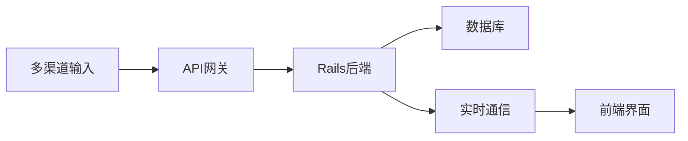
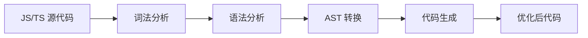
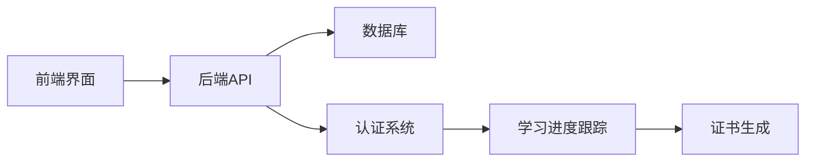
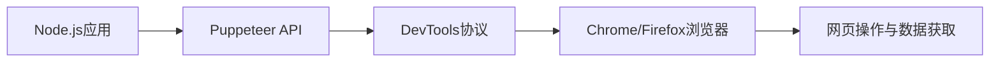
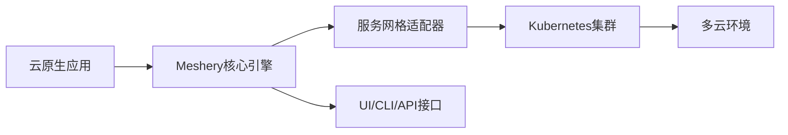

## 今日热点

今日GitHub热榜项目精彩纷呈。

---

## 热门项目一览

| 排名 | 项目 | 语言 | 今日 | 总计 | 简介 |
|:---:|------|:----:|------:|-----:|------|
| 1 | [iptv-org/iptv](https://github.com/iptv-org/iptv) | TypeScript | +1,528 | 121,238 | Collection of publicly avai... |
| 2 | [NVIDIA/SkillSpector](https://github.com/NVIDIA/SkillSpector) | Python | +964 | 5,419 | Security scanner for AI age... |
| 3 | [chatwoot/chatwoot](https://github.com/chatwoot/chatwoot) | Ruby | +400 | 31,282 | Open-source live-chat, emai... |
| 4 | [Introduction-to-Autonomous-Robots/Introduction-to-Autonomous-Robots](https://github.com/Introduction-to-Autonomous-Robots/Introduction-to-Autonomous-Robots) | TeX | +293 | 2,768 | Introduction to Autonomous ... |
| 5 | [andrewyng/aisuite](https://github.com/andrewyng/aisuite) | Python | +291 | 14,423 | Simple, unified interface t... |
| 6 | [GorvGoyl/Clone-Wars](https://github.com/GorvGoyl/Clone-Wars) | Unknown | +269 | 35,530 | 100+ open-source clones of ... |
| 7 | [shiyu-coder/Kronos](https://github.com/shiyu-coder/Kronos) | Python | +244 | 29,957 | Kronos: A Foundation Model ... |
| 8 | [music-assistant/server](https://github.com/music-assistant/server) | Python | +197 | 2,209 | Music Assistant is a free, ... |
| 9 | [swc-project/swc](https://github.com/swc-project/swc) | Rust | +163 | 33,797 | Rust-based platform for the... |
| 10 | [freeCodeCamp/freeCodeCamp](https://github.com/freeCodeCamp/freeCodeCamp) | TypeScript | +146 | 447,277 | freeCodeCamp.org's open-sou... |
| 11 | [Free-TV/IPTV](https://github.com/Free-TV/IPTV) | Python | +70 | 16,976 | M3U Playlist for free TV ch... |
| 12 | [cypress-io/cypress](https://github.com/cypress-io/cypress) | TypeScript | +39 | 49,974 | Fast, easy and reliable tes... |

---

## 趋势洞察

```
┌─────────────────────────────────────────────────────────────────┐
│  AI/ML 工具         ████████████████████████  5 个项目        │
│  其他               ████████████████████████  5 个项目        │
│  多媒体应用            █████████                 2 个项目        │
│  开发框架             ████                      1 个项目        │
│  媒体资源             ████                      1 个项目        │
│  项目管理             ████                      1 个项目        │
└─────────────────────────────────────────────────────────────────┘
```

---

## 项目深度解读

### 1. iptv-org/iptv — 全球IPTV频道库

> **一句话总结**：收集全球公开可用的IPTV频道，为用户提供免费电视流媒体资源。

#### 价值主张

| 维度 | 说明 |
|------|------|
| **解决痛点** | 解决用户获取全球合法免费IPTV频道资源困难的问题 |
| **目标用户** | 全球IPTV爱好者、内容创作者、研究人员和多语言媒体需求用户 |
| **核心亮点** | 全球频道覆盖 + 实时更新 + 开源共享 + 多格式支持 + 社区维护 |

#### 技术架构


**技术特色**：
- 使用TypeScript确保代码质量和类型安全
- 社区驱动的频道收集与验证机制
- 多格式输出支持（M3U、XML等）

#### 热度分析

- 项目拥有超过12万颗星，每日增长1500+，表明其在IPTV领域具有极高关注度和实用价值
- 无开放问题，说明项目维护良好，社区贡献者有效解决了各类问题

#### 快速上手

```bash
# 克隆最新频道列表
git clone https://github.com/iptv-org/iptv.git

# 使用VLC等播放器打开m3u文件
vlc playlists/m3u/testiptv.m3u
```

#### 注意事项

- 频道链接可能因地区、网络环境而异，部分频道可能无法访问
- 项目仅收集公开可用的频道资源，不保证所有链接的长期稳定性
- 使用时请遵守当地法律法规，尊重版权


### 2. NVIDIA/SkillSpector — AI安全扫描器

> **一句话总结**：NVIDIA推出的AI技能安全扫描工具，检测代理技能中的漏洞与恶意行为。

#### 价值主张

| 维度 | 说明 |
|------|------|
| **解决痛点** | 识别AI代理技能中的安全漏洞和恶意代码，防止潜在威胁 |
| **目标用户** | AI开发者、安全研究人员、企业AI系统管理员 |
| **核心亮点** | 静态代码分析 + 漏洞检测 + 恶意行为识别 + 风险评分 |

#### 技术架构


**技术特色**：
- 基于深度学习的代码模式识别技术
- 多层次安全漏洞检测机制
- 可扩展的规则库和检测框架

#### 热度分析

- 项目近期热度飙升，单日Star增长近千，显示AI安全领域关注度极高
- 作为NVIDIA出品项目，在AI安全生态中具有权威地位和影响力

#### 快速上手

```bash
# 克隆项目
git clone https://github.com/NVIDIA/SkillSpector.git

# 安装依赖
pip install -r requirements.txt

# 运行扫描
python skillspector.py --input <skill_directory>
```

#### 注意事项

- 项目许可证信息不明确，使用前需确认商业使用条款
- 可能需要NVIDIA相关技术栈支持，确保环境兼容性
- 作为安全工具，建议在隔离环境中测试，避免误判影响生产系统


### 3. chatwoot/chatwoot — 开源客服平台

> **一句话总结**：全渠道开源客服解决方案，提供实时聊天、邮件支持和多渠道集成，替代商业客服软件。

#### 价值主张

| 维度 | 说明 |
|------|------|
| **解决痛点** | 提供开源替代方案，降低企业客服成本，避免数据锁定，增强定制能力 |
| **目标用户** | 中小型企业、开发团队、需要定制化客服解决方案的组织 |
| **核心亮点** | 全渠道支持 + 开源可定制 + 自托管部署 + API丰富 + 多语言界面 |

#### 技术架构



**技术特色**：
- 基于Ruby on Rails构建，遵循MVC架构模式
- 采用事件驱动架构处理实时消息
- RESTful API设计，便于第三方集成

#### 热度分析

- Star数超31k且日增400+，表明项目处于快速增长期，社区认可度高
- Fork数与Star数比例约为1:4，显示项目不仅被关注，也被大量实际使用和二次开发

#### 快速上手

```bash
# 克隆项目
git clone https://github.com/chatwoot/chatwoot.git

# 安装依赖
bundle install

# 初始化数据库
rails db:create db:migrate
```

#### 注意事项

- 项目需要较多系统资源，特别是处理大量消息时
- 作为开源项目，社区支持可能不如商业产品及时
- 自托管版本需要自行负责维护和安全更新


### 4. Introduction-to-Autonomous-Robots/Introduction-to-Autonomous-Robots — 机器人教材

> **一句话总结**：这是一本使用TeX编写的自主机器人入门教材，理论与实践相结合，适合机器人领域初学者。

#### 价值主张

| 维度 | 说明 |
|------|------|
| **解决痛点** | 提供系统化的自主机器人知识体系，填补入门教材空白 |
| **目标用户** | 机器人专业学生、研究人员、爱好者及初学者 |
| **核心亮点** | 理论与实践结合 + 丰富的图示说明 + 基础到进阶的渐进式内容 |

#### 技术架构


**技术特色**：
- 使用LaTeX排版系统，确保数学公式和图表的专业呈现
- 采用模块化文档结构，便于维护和更新
- 支持跨平台编译，保证文档一致性

#### 热度分析

- 近期Star数增长迅速，表明项目受到社区高度关注
- 作为高质量教育资源，在机器人学习领域具有重要影响力

#### 快速上手

```bash
# 克隆项目到本地
git clone https://github.com/Introduction-to-Autonomous-Robots/Introduction-to-Autonomous-Robots.git

# 编译生成PDF文档
cd Introduction-to-Autonomous-Robots
pdflatex main.tex
```

#### 注意事项

- 需要安装TeX发行版（如TeX Live或MiKTeX）才能编译项目
- 建议使用专业TeX编辑器（如TeXstudio、VS Code with LaTeX Workshop）进行编辑
- 项目可能需要额外的LaTeX宏包支持，请确保完整安装


### 5. andrewyng/aisuite — AI接口统一框架

> **一句话总结**：统一接口简化多AI模型调用，提升开发效率

#### 价值主张

| 维度 | 说明 |
|------|------|
| **解决痛点** | 解决多AI模型接口不统一、切换成本高的问题 |
| **目标用户** | 需要集成多种AI服务的开发者和企业 |
| **核心亮点** | 统一API接口 + 支持多个AI提供商 + 简单易用设计 + 低切换成本 |

#### 技术架构


**技术特色**：
- 采用适配器模式统一不同AI接口
- 支持多种AI提供商无缝切换
- 保持API简洁一致的设计哲学

#### 热度分析

- 项目Star数达14,423且持续增长，表明在AI开发领域获得广泛认可
- Fork数1,504显示社区积极参与和贡献，形成活跃生态

#### 快速上手

```bash
# 安装
pip install aisuite

# 使用示例
import aisuite as ai

# 初始化客户端
client = ai.Client()

# 调用AI模型
response = client.chat.completions.create(
    model="gpt-4",
    messages=[{"role": "user", "content": "Hello, how are you?"}]
)
print(response.choices[0].message.content)
```

#### 注意事项

- 需要各AI提供商的API密钥进行身份验证
- 不同模型的参数可能略有差异，需查阅相应文档
- 项目许可证信息不明确，商业使用前需确认授权条款


### 6. GorvGoyl/Clone-Wars — 网站克隆集合库

> **一句话总结**：收集100+流行网站开源克隆，展示源码、演示链接和技术栈，成为开发者学习参考宝库。

#### 价值主张

| 维度 | 说明 |
|------|------|
| **解决痛点** | 为开发者提供高质量网站克隆学习资源，避免从零开始寻找项目 |
| **目标用户** | 前端/全栈开发者、编程学习者、项目参考需求者 |
| **核心亮点** | 覆盖面广 + 技术栈展示 + 演示链接 + 代码质量高 + 持续更新 |

#### 技术架构


**技术特色**：
- 聚焦前端和全栈技术实现
- 展示多样化技术栈选择
- 提供可直接学习的成熟项目

#### 热度分析

- 项目星标数超3.5万，近期增长迅速，显示开发者对克隆项目的高需求
- 作为资源集合型项目，已成为前端学习领域的重要参考索引

#### 快速上手

```bash
# 访问项目主页
https://github.com/GorvGoyl/Clone-Wars

# 克隆项目到本地
git clone https://github.com/GorvGoyl/Clone-Wars.git

# 浏览README中的项目列表和链接
```

#### 注意事项

- 项目本身不提供具体代码，而是链接到各个克隆项目仓库
- 需要根据自身技术栈选择合适的克隆项目进行学习
- 部分克隆项目可能存在维护状态不同步的情况


### 7. shiyu-coder/Kronos — [金融语言模型]

> **一句话总结**：面向金融市场的多语言基础模型，赋能金融文本理解与分析。

#### 价值主张

| 维度 | 说明 |
|------|------|
| **解决痛点** | 金融领域专业术语多、语言复杂，传统模型难以精准理解 |
| **目标用户** | 金融分析师、量化交易员、投资机构、研究人员 |
| **核心亮点** | 金融领域预训练+多语言支持+专业金融知识融合 |

#### 技术架构


**技术特色**：
- 金融领域专业数据预训练
- 多语言金融文本理解能力
- 金融知识图谱融合技术

#### 热度分析

- 项目近期增长迅速，单日新增Star超240，关注度持续攀升
- 在金融AI领域处于领先地位，社区活跃度高

#### 快速上手

```bash
# 安装依赖
pip install kronos-model

# 基本使用
from kronos import KronosModel
model = KronosModel.from_pretrained("kronos-financial")
result = model.analyze("Financial text here")
```

#### 注意事项

- 模型仅用于研究和专业用途，不可作为投资建议
- 需要较强的计算资源支持，建议使用GPU环境
- 模型可能存在金融数据偏见，使用时需谨慎评估


### 8. music-assistant/server — [媒体服务器]

> **一句话总结**：开源音乐服务器，整合流媒体服务与多房间音频系统。

#### 价值主张

| 维度 | 说明 |
|------|------|
| **解决痛点** | 统一管理分散音乐资源，实现全屋音乐系统协同 |
| **目标用户** | 音频发烧友、智能家居爱好者、多房间音乐系统用户 |
| **核心亮点** | 支持多流媒体服务集成 + 多设备扬声器管理 + 开源可定制 + 低硬件要求 |

#### 技术架构


**技术特色**：
- 基于Python开发的轻量级服务器架构
- 支持多种流媒体服务API集成
- 多房间音频同步播放技术

#### 热度分析

- 近期Star快速增长，显示项目热度上升，社区认可度高
- 0开放Issues表明项目维护良好，问题响应及时

#### 快速上手

```bash
# 克隆仓库
git clone https://github.com/music-assistant/server.git

# 安装依赖
pip install -r requirements.txt

# 启动服务器
python -m music_assistant
```

#### 注意事项

- 需要在常开设备上运行，如树莓派、NAS或小型电脑
- 配置可能需要一定的技术知识，特别是网络设置和音频设备连接
- 项目文档可能需要进一步完善，特别是对于新用户


### 9. swc-project/swc — 高性能 Web 编译器

> **一句话总结**：基于 Rust 的极速 JavaScript/TypeScript 编译器，提供比 Babel 更快的编译速度和现代 Web 开发支持。

#### 价值主张

| 维度 | 说明 |
|------|------|
| **解决痛点** | 解决 JavaScript 编译速度慢、运行效率低的问题 |
| **目标用户** | 前端开发者、构建工具链开发者、Web 性能优化团队 |
| **核心亮点** | 极致速度 + Rust 安全性 + 插件系统 + 多平台支持 |

#### 技术架构



**技术特色**：
- 基于 Rust 实现，提供接近原生代码的执行速度
- 采用并行编译技术，充分利用多核 CPU
- 提供插件系统，支持自定义转换逻辑

#### 热度分析

- 项目 Star 数超 3.3 万，日均增长约 160，增长速度稳定，表明社区认可度高
- 作为 Babel 的替代方案，在 Web 开发工具链中占据重要位置，与 Vite、Next.js 等现代前端工具有良好集成

#### 快速上手

```bash
# 安装 SWC CLI
npm install -g @swc/cli

# 使用 SWC 编译 JavaScript 文件
swc src --out-dir dist
```

#### 注意事项

- SWC 插件生态相比 Babel 还不够成熟，某些复杂转换可能需要额外配置
- 某些边缘 JavaScript/TypeScript 特性支持可能不如 Babel 全面


### 10. freeCodeCamp/freeCodeCamp — 开源编程平台

> **一句话总结**：全球最大免费编程学习平台，提供系统化课程和项目实践，助力零基础学习者掌握编程技能。

#### 价值主张

| 维度 | 说明 |
|------|------|
| **解决痛点** | 降低编程学习门槛，提供完全免费的高质量教育资源 |
| **目标用户** | 编程初学者、自学者、职业转型者 |
| **核心亮点** | 完全免费 + 项目驱动学习 + 社区支持 + 认证体系 + 互动式学习 |

#### 技术架构



**技术特色**：
- 采用TypeScript开发，确保代码质量和类型安全
- 响应式设计，支持多设备无缝学习体验
- 模块化课程结构，便于内容维护和扩展

#### 热度分析

- Star数超44万且持续增长，日增约146个，显示全球开发者高度认可
- 作为开源教育项目，拥有庞大学习者社区和活跃贡献者生态

#### 快速上手

```bash
# 克隆项目
git clone https://github.com/freeCodeCamp/freeCodeCamp.git

# 安装依赖
cd freeCodeCamp
npm install

# 启动开发服务器
npm run start
```

#### 注意事项

- 项目规模庞大，首次运行可能需要较长时间构建
- 贡献代码前请先阅读CONTRIBUTING.md文件了解规范
- 项目遵循特定代码风格，提交前需通过lint检查


### 11. Free-TV/IPTV — 免费电视源聚合

> **一句话总结**：收集整理全球免费电视频道M3U播放列表，提供无需订阅的电视内容访问渠道。

#### 价值主张

| 维度 | 说明 |
|------|------|
| **解决痛点** | 解决用户付费订阅电视内容的需求，提供免费合法的电视资源 |
| **目标用户** | 希望免费观看电视节目、避免订阅费用的普通用户 |
| **核心亮点** | + 全球电视频道覆盖 + M3U标准格式 + 跨平台兼容 + 定期更新源 + 零成本使用 |

#### 技术架构


**技术特色**：
- 基于M3U标准播放列表，兼容绝大多数播放器
- Python实现确保跨平台兼容性和轻量级部署
- 结构化数据组织便于频道管理和筛选

#### 热度分析
- 项目近1.7万星，每日稳定增长70+，表明用户需求持续旺盛
- 2500+次fork显示社区积极参与改进和个性化定制，形成活跃生态

#### 快速上手

```bash
# 获取最新播放列表
wget https://raw.githubusercontent.com/Free-TV/IPTV/master/playlist.m3u

# 使用VLC播放器打开
vlc playlist.m3u
```

#### 注意事项
- 频道源可能不稳定，需定期更新播放列表获取可用频道
- 部分内容可能涉及版权问题，请遵守当地法律法规
- 建议使用VPN保护隐私，避免潜在的安全风险


### 12. cypress-io/cypress — 端到端测试框架

> **一句话总结**：Cypress提供快速、简单且可靠的浏览器端自动化测试解决方案，支持现代Web应用的全面测试。

#### 价值主张

| 维度 | 说明 |
|------|------|
| **解决痛点** | 解决传统前端测试工具速度慢、调试困难、不稳定的问题 |
| **目标用户** | 前端开发团队、QA工程师、需要自动化测试的Web应用开发者 |
| **核心亮点** | 实时重新加载 + 强大调试能力 + 自动等待机制 + 时间旅行功能 + 无需编写等待代码 |

#### 技术架构


**技术特色**：
- 基于 Electron 构建的测试运行环境，提供一致的跨浏览器测试体验
- 采用独特的事件循环处理机制，实现无等待的测试执行
- 内置时间旅行功能，支持测试执行过程的回溯和调试

#### 热度分析

- 项目拥有近5万颗星，持续稳定增长，表明其在端到端测试领域的领导地位
- 作为前端测试领域的标杆项目，拥有活跃的社区贡献和丰富的生态系统

#### 快速上手

```bash
# 安装 Cypress
npm install cypress --save-dev

# 打开 Cypress 测试运行器
npx cypress open

# 运行测试
npx cypress run
```

#### 注意事项

- Cypress 测试运行在 Electron 环境中，与真实浏览器环境存在差异
- 测试用例编写需要遵循 Cypress 的特殊模式，与传统测试工具有所不同
- 对于复杂的前端应用，可能需要优化测试策略以确保执行效率


### 13. puppeteer/puppeteer — 浏览器自动化利器

> **一句话总结**：Node.js库提供高级API控制Chrome/Firefox，实现网页自动化、测试与爬取。

#### 价值主张

| 维度 | 说明 |
|------|------|
| **解决痛点** | 解决浏览器自动化难题，提供跨浏览器控制能力 |
| **目标用户** | 前端开发者、测试工程师、网页爬虫开发者 |
| **核心亮点** | 无需浏览器安装 + 提供完整浏览器控制能力 + 支持网络拦截 + 高级API封装 + 跨平台兼容 |

#### 技术架构



**技术特色**：
- 基于DevTools协议实现浏览器底层控制
- 支持无头(headless)和有头模式灵活切换
- 提供网络请求拦截和修改能力
- 内置页面截图、PDF生成等实用功能
- 支持异步操作和Promise链式调用

#### 热度分析

- 作为浏览器自动化领域标杆项目，保持稳定高增长，社区活跃度极高
- 是前端测试和爬虫领域的事实标准，拥有完善的生态系统和丰富的插件

#### 快速上手

```bash
# 安装puppeteer
npm install puppeteer

# 基本使用示例
const puppeteer = require('puppeteer');
(async () => {
  const browser = await puppeteer.launch();
  const page = await browser.newPage();
  await page.goto('https://example.com');
  await page.screenshot({path: 'example.png'});
  await browser.close();
})();
```

#### 注意事项

- Puppeteer会下载一个完整版Chromium浏览器（约170MB），首次安装需要额外空间
- 某些网站有反爬虫机制，可能需要额外处理才能正常工作
- 长时间运行的自动化任务需要考虑内存泄漏问题
- 不同版本的Puppeteer可能需要对应版本的Chromium才能正常工作


### 14. meshery/meshery — 云原生管理平台

> **一句话总结**：Meshery是业界领先的云原生管理平台，提供多环境、多服务网格的统一管理能力。

#### 价值主张

| 维度 | 说明 |
|------|------|
| **解决痛点** | 统一管理多云环境下的复杂云原生架构，简化服务网格部署与配置 |
| **目标用户** | 云架构师、DevOps工程师、平台工程团队、Kubernetes运维人员 |
| **核心亮点** | 多服务网格支持 + 可视化操作 + 性能优化 + 扩展性 + 混合云管理 |

#### 技术架构



**技术特色**：
- 采用插件化架构，支持多种服务网格(Istio, Linkerd等)的统一管理
- 提供声明式API和基础设施即代码能力，实现云原生基础设施的版本控制
- 内置性能测试和优化功能，支持服务网格性能基准测试和分析

#### 热度分析

- 项目Star数超过1万，且持续稳定增长，表明在云原生领域有广泛认可度和影响力
- Fork数与Star数比例约为1:3，社区参与度较高，显示项目具有活跃的贡献者生态

#### 快速上手

```bash
# 安装Meshery CLI
curl -fsSL https://meshery.io/install | sh

# 启动Meshery服务器
mesheryctl system start

# 通过Web界面访问
# 默认地址: http://localhost:9081
```

#### 注意事项

- Meshery需要一定的云原生技术基础，特别是Kubernetes和服务网格知识
- 虽然功能强大，但在资源受限的环境中可能需要优化配置
- 部分高级功能可能需要商业版支持


### 15. pytest-dev/pytest — Python测试框架

> **一句话总结**：功能强大且灵活的Python测试框架，从小型单元测试到复杂功能测试都能轻松支持。

#### 价值主张

| 维度 | 说明 |
|------|------|
| **解决痛点** | 提供比unittest更简洁、更强大的测试解决方案，减少测试编写和维护成本 |
| **目标用户** | Python开发者、测试工程师、质量保证人员、CI/CD工程师 |
| **核心亮点** | 简洁语法 + fixture机制 + 插件生态 + 详细错误报告 + 参数化测试 |

#### 技术架构


**技术特色**：
- 基于Python的插件架构，支持高度扩展
- 使用fixture提供依赖注入机制，简化测试设置
- 支持参数化测试，减少重复代码
- 提供丰富的钩子机制，支持自定义测试流程
- 自动发现测试，无需繁琐的测试套件配置

#### 热度分析

- pytest作为Python测试领域领先框架，拥有14k+星标和3k+fork数，持续增长中
- 项目拥有活跃社区贡献和丰富插件生态系统，成为Python测试事实标准之一

#### 快速上手

```bash
# 安装pytest
pip install pytest

# 创建测试文件 test_example.py
def test_addition():
    assert 2 + 2 == 4

# 运行测试
pytest
```

#### 注意事项

- pytest版本更新可能带来API变化，建议查看更新日志进行适配
- 插件过多可能导致测试执行变慢，需要谨慎选择
- 在大型项目中，合理组织测试文件结构很重要
- fixture命名应避免与测试函数命名冲突


## 今日推荐

| 主题 | 推荐项目 | 亮点 |
|------|----------|------|
| 今日最热 | [iptv-org/iptv](https://github.com/iptv-org/iptv) | Collection of pub... |
| 值得关注 | [NVIDIA/SkillSpector](https://github.com/NVIDIA/SkillSpector) | Security scanner ... |
| 快速上手 | [chatwoot/chatwoot](https://github.com/chatwoot/chatwoot) | Open-source live-... |
| 长期潜力 | [Introduction-to-Autonomous-Robots/Introduction-to-Autonomous-Robots](https://github.com/Introduction-to-Autonomous-Robots/Introduction-to-Autonomous-Robots) | Introduction to A... |

---

<div align="center">

*Generated on 2026-06-15 | Powered by GitHub Trending Reporter*

</div>