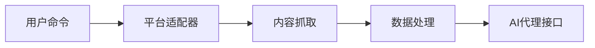
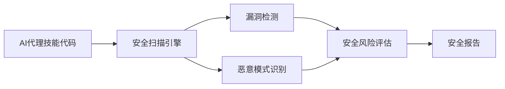
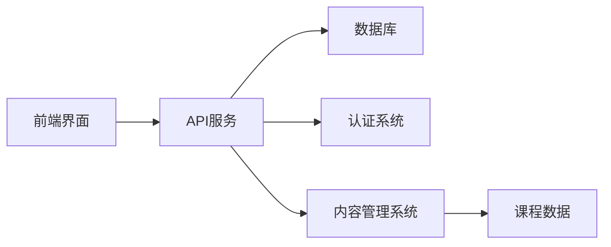
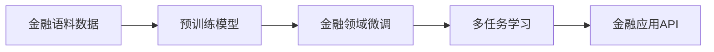
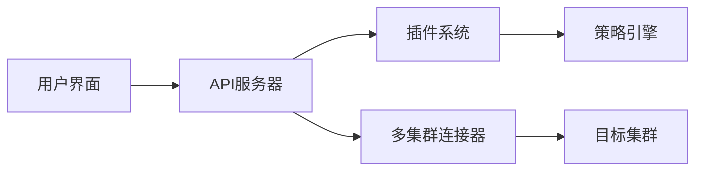
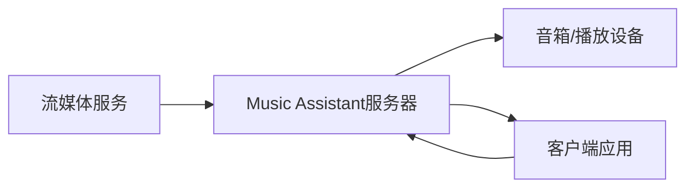
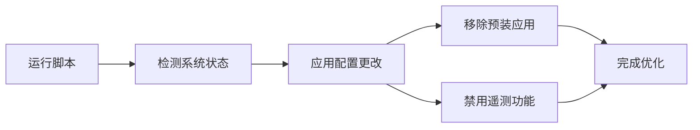
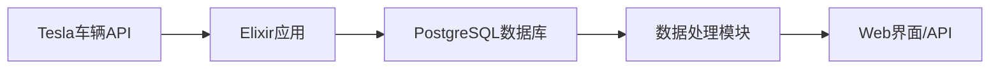

## 今日热点

今日GitHub热榜项目精彩纷呈。

---

## 热门项目一览

| 排名 | 项目 | 语言 | 今日 | 总计 | 简介 |
|:---:|------|:----:|------:|-----:|------|
| 1 | [iptv-org/iptv](https://github.com/iptv-org/iptv) | TypeScript | +2,657 | 123,012 | Collection of publicly avai... |
| 2 | [Panniantong/Agent-Reach](https://github.com/Panniantong/Agent-Reach) | Python | +1,100 | 30,450 | Give your AI agent eyes to ... |
| 3 | [NVIDIA/SkillSpector](https://github.com/NVIDIA/SkillSpector) | Python | +1,079 | 6,456 | Security scanner for AI age... |
| 4 | [freeCodeCamp/freeCodeCamp](https://github.com/freeCodeCamp/freeCodeCamp) | TypeScript | +736 | 447,960 | freeCodeCamp.org's open-sou... |
| 5 | [rohitg00/ai-engineering-from-scratch](https://github.com/rohitg00/ai-engineering-from-scratch) | Python | +562 | 33,163 | Learn it. Build it. Ship it... |
| 6 | [Introduction-to-Autonomous-Robots/Introduction-to-Autonomous-Robots](https://github.com/Introduction-to-Autonomous-Robots/Introduction-to-Autonomous-Robots) | TeX | +489 | 3,091 | Introduction to Autonomous ... |
| 7 | [chatwoot/chatwoot](https://github.com/chatwoot/chatwoot) | Ruby | +431 | 31,732 | Open-source live-chat, emai... |
| 8 | [shiyu-coder/Kronos](https://github.com/shiyu-coder/Kronos) | Python | +396 | 30,318 | Kronos: A Foundation Model ... |
| 9 | [jwasham/coding-interview-university](https://github.com/jwasham/coding-interview-university) | Unknown | +364 | 352,360 | A complete computer science... |
| 10 | [Free-TV/IPTV](https://github.com/Free-TV/IPTV) | Python | +361 | 17,324 | M3U Playlist for free TV ch... |
| 11 | [itsfatduck/optimizerDuck](https://github.com/itsfatduck/optimizerDuck) | C# | +340 | 3,739 | Free, open-source Windows o... |
| 12 | [meshery/meshery](https://github.com/meshery/meshery) | TypeScript | +228 | 10,656 | Meshery, the cloud native m... |

---

## 趋势洞察

```
┌─────────────────────────────────────────────────────────────────┐
│  AI/ML 工具         ████████████████████████  8 个项目        │
│  其他               ███████████████           5 个项目        │
│  多媒体应用            ██████                    2 个项目        │
│  开发工具             ██████                    2 个项目        │
│  媒体资源             ███                       1 个项目        │
└─────────────────────────────────────────────────────────────────┘
```

---

## 项目深度解读

### 1. iptv-org/iptv — 全球IPTV频道库

> **一句话总结**：开源项目收集整理全球公开IPTV频道资源，提供统一的电视频道访问入口。

#### 价值主张

| 维度 | 说明 |
|------|------|
| **解决痛点** | 用户无需从多个来源寻找IPTV频道，项目已整合全球公开频道资源 |
| **目标用户** | 需要访问全球电视频道的个人用户、开发者及内容服务提供商 |
| **核心亮点** | 全球频道覆盖广泛 + 持续更新维护 + 多格式兼容支持 + 开源可自由使用 + 社区共同维护 |

#### 技术架构


**技术特色**：
- 基于TypeScript开发，保证代码质量
- 采用开源协作模式，持续扩充频道资源
- 支持多种播放器和格式兼容

#### 热度分析

- 项目Star数超12万，单日增长2,657，表明热度持续攀升，是全球最受欢迎的IPTV资源项目
- 无开放Issues，问题解决效率高，社区运行良好，形成稳定的资源维护生态

#### 快速上手

```bash
# 克隆项目到本地
git clone https://github.com/iptv-org/iptv.git

# 进入项目目录查看频道列表
cd iptv && cat playlist.m3u
```

#### 注意事项

- 项目收集的频道均为公开资源，使用时需遵守当地法律法规
- 频道地址可能失效，需要定期更新维护
- 部分频道可能有地区限制，并非所有频道都能访问


### 2. Panniantong/Agent-Reach — AI互联网接入工具

> **一句话总结**：一站式命令行工具，让AI代理无API费用访问全球多平台内容。

#### 价值主张

| 维度 | 说明 |
|------|------|
| **解决痛点** | AI代理无法直接访问互联网内容获取实时信息 |
| **目标用户** | AI开发者、研究人员、需要跨平台内容分析的用户 |
| **核心亮点** | 多平台支持 + 无API费用 + 命令行界面 + 零配置使用 |

#### 技术架构



**技术特色**：
- 统一的多平台内容获取接口
- 无需官方API密钥的访问机制
- 轻量级命令行实现

#### 热度分析

- 项目Star数高达3万+，近期增长迅速，表明市场需求强烈
- Fork数较高，说明社区活跃且有二次开发需求

#### 快速上手

```bash
# 安装
pip install agent-reach

# 使用
agent-reach --platform twitter --query "AI趋势"
```

#### 注意事项

- 由于使用非官方API访问，可能存在合规风险
- 需要遵守各平台的使用条款
- 可能需要定期更新以应对平台变化


### 3. NVIDIA/SkillSpector — AI安全扫描

> **一句话总结**：NVIDIA开发的AI代理技能安全扫描工具，检测漏洞、恶意模式和安全风险。

#### 价值主张

| 维度 | 说明 |
|------|------|
| **解决痛点** | 解决AI代理技能中的安全漏洞和恶意代码检测问题 |
| **目标用户** | AI开发者、安全研究人员、企业AI系统管理员 |
| **核心亮点** | 专门针对AI代理技能的安全检测 + 深度代码分析 + 多种安全模式识别 |

#### 技术架构



**技术特色**：
- 基于深度学习的代码模式识别
- 专门针对AI代理技能的定制化检测规则
- 多层次安全风险评估机制

#### 热度分析

- 项目近期获得大量关注，单日增长超过1000 stars，表明AI安全领域需求旺盛
- 作为NVIDIA出品的项目，在AI安全领域具有权威性和影响力

#### 快速上手

```bash
# 安装SkillSpector
pip install skillspector

# 扫描AI代理技能文件
skillspector scan --input /path/to/ai_skill --output security_report.json

# 查看详细报告
cat security_report.json
```

#### 注意事项

- 需要明确项目的许可证信息以确保合规使用
- 建议在使用前了解AI代理技能的安全最佳实践
- 扫描结果需要人工验证，避免误报


### 4. freeCodeCamp/freeCodeCamp — 开源编程学习平台

> **一句话总结**：免费提供编程、数学和计算机科学课程的开源教育平台，通过实践项目帮助学习者掌握技术技能。

#### 价值主张

| 维度 | 说明 |
|------|------|
| **解决痛点** | 提供免费、结构化的编程学习资源，解决教育资源不平等问题 |
| **目标用户** | 初学者、转行者、希望提升技能的开发者 |
| **核心亮点** | 完全免费的开源课程 + 项目驱动的学习方式 + 全面的计算机科学知识体系 |

#### 技术架构



**技术特色**：
- 基于React和TypeScript构建的前端应用
- RESTful API架构支持前后端分离
- 模块化的课程管理系统便于内容更新

#### 热度分析

- Star数超过44万且持续稳定增长，表明其在编程教育领域具有极高认可度
- 作为开源教育项目，社区参与度极高，贡献者遍布全球，形成了独特的教育生态

#### 快速上手

```bash
# 克隆项目
git clone https://github.com/freeCodeCamp/freeCodeCamp.git

# 安装依赖
cd freeCodeCamp
npm install

# 启动开发服务器
npm run develop
```

#### 注意事项

- 这是一个大型项目，参与贡献前需要熟悉项目的代码结构和贡献指南
- 项目内容更新频繁，关注最新版本以获取最新课程
- 需要一定的前端开发基础才能有效参与贡献


### 5. rohitg00/ai-engineering-from-scratch — AI工程学习路径

> **一句话总结**：从零开始学习AI工程的完整指南，涵盖构建、训练到部署全流程。

#### 价值主张

| 维度 | 说明 |
|------|------|
| **解决痛点** | 提供AI工程全栈学习路径，解决理论与实践脱节问题 |
| **目标用户** | AI初学者、希望转向AI的软件工程师 |
| **核心亮点** | 项目导向学习 + 完整工程流程 + 实用工具链 |

#### 技术架构


**技术特色**：
- 以项目为导向的AI工程学习
- 涵盖从理论到实践的全流程
- 提供可复现的代码示例和最佳实践

#### 热度分析

- 高关注度项目，近期增长迅速，日均新增Star超500
- 在AI学习领域具有显著影响力，社区活跃度高

#### 快速上手

```bash
# 克隆项目
git clone https://github.com/rohitg00/ai-engineering-from-scratch.git

# 安装依赖
cd ai-engineering-from-scratch
pip install -r requirements.txt
```

#### 注意事项

- 项目内容可能需要一定的编程基础和数学基础
- 建议按照项目顺序逐步学习，不要跳过基础部分
- 部分内容可能需要GPU资源才能完整运行


### 6. Introduction-to-Autonomous-Robots/Introduction-to-Autonomous-Robots — 自主机器人教材

> **一句话总结**：这是一本使用TeX编写的自主机器人入门教材，理论与实践并重，适合初学者系统学习。

#### 价值主张

| 维度 | 说明 |
|------|------|
| **解决痛点** | 为自主机器人领域提供系统化学习资源，填补理论与实践间的鸿沟 |
| **目标用户** | 机器人学学生、研究人员、工程师及爱好者 |
| **核心亮点** | 系统性强 + 实践导向 + 数学基础扎实 + 涵盖全面 + 示例丰富 |

#### 技术架构


**技术特色**：
- 采用TeX排版系统，确保数学公式和图表的精确呈现
- 结构化的文档组织，便于读者循序渐进学习
- 包含大量算法和伪代码，强化理论与实践结合

#### 热度分析

- 项目近期热度显著增长，今日新增489个Star，表明该教材受到广泛关注
- 相比Fork数，Star数较高，说明更多用户将其作为学习资源而非二次开发
- 零开放Issues反映项目成熟度高，维护良好

#### 快速上手

```bash
# 克隆项目
git clone https://github.com/Introduction-to-Autonomous-Robots/Introduction-to-Autonomous-Robots.git

# 编译PDF文档
cd Introduction-to-Autonomous-Robots
pdflatex main.tex
```

#### 注意事项

- 需要安装TeX发行版（如TeX Live或MiKTeX）才能编译文档
- 项目可能需要特定版本的LaTeX宏包，请确保环境兼容性
- 建议配合实际机器人实践，加深对理论内容的理解


### 7. chatwoot/chatwoot — 开源客服平台

> **一句话总结**：开源全渠道客服系统，提供实时聊天、邮件支持和多渠道集成功能。

#### 价值主张

| 维度 | 说明 |
|------|------|
| **解决痛点** | 提供经济实惠的全渠道客服解决方案，替代昂贵的商业软件 |
| **目标用户** | 中小型企业、创业公司和需要定制化客服系统的组织 |
| **核心亮点** | 开源可定制 + 多渠道整合 + 自托管选项 + 丰富API + 可扩展架构 |

#### 技术架构


**技术特色**：
- 基于Ruby on Rails构建，采用MVC架构
- 使用PostgreSQL作为主数据库，支持高并发数据存储
- 提供RESTful API，便于集成第三方服务
- 支持WebSocket实现实时通信功能
- 采用事件驱动架构处理消息流转

#### 热度分析

- 项目Star数超过31k，日增431+，表明社区活跃度高，增长趋势强劲
- 作为Intercom等商业软件的开源替代品，在追求成本效益和隐私安全的市场中占据重要位置

#### 快速上手

```bash
# 克隆仓库
git clone https://github.com/chatwoot/chatwoot.git

# 安装依赖
cd chatwoot && bundle install

# 启动开发服务器
rails s
```

#### 注意事项

- 需要Ruby环境和PostgreSQL数据库支持
- 生产环境部署需要配置Redis、Sidekiq等后台任务处理
- 部署前需仔细阅读文档，确保正确配置所有依赖项
- 由于是开源项目，企业级使用可能需要自行负责维护和安全更新


### 8. shiyu-coder/Kronos — 金融语言大模型

> **一句话总结**：专为金融市场语言训练的大模型，提供专业金融文本理解和分析能力。

#### 价值主张

| 维度 | 说明 |
|------|------|
| **解决痛点** | 金融市场专业性强，通用模型难以准确理解金融术语和复杂关系 |
| **目标用户** | 金融分析师、量化交易员、投资研究机构和金融科技开发者 |
| **核心亮点** | + 金融市场专业语料训练 + 金融术语精准理解 + 多模态金融数据处理能力 |

#### 技术架构



**技术特色**：
- 专为金融领域优化的Transformer架构
- 多源金融数据融合训练策略
- 金融知识图谱增强理解能力

#### 热度分析

- 项目Star数突破3万，近期增长迅速，日均增加约400 stars，显示市场高度关注
- 无Open Issues表明项目维护稳定，Fork数适中，说明用户以使用为主而非二次开发

#### 快速上手

```bash
# 安装依赖
pip install kronos-ai

# 基本使用
from kronos import KronosModel
model = KronosModel()
result = model.analyze("AAPL Q3财报分析")
print(result)
```

#### 注意事项

- 需要金融领域专业知识才能充分利用模型能力
- 模型输出应作为辅助决策参考，不构成投资建议
- 可能需要高性能GPU才能运行完整模型


### 9. jwasham/coding-interview-university — 编程面试指南

> **一句话总结**：全面的计算机科学学习计划，帮助求职者系统掌握算法、数据结构和编程面试所需知识。

#### 价值主张

| 维度 | 说明 |
|------|------|
| **解决痛点** | 帮助求职者系统学习计算机科学知识，应对技术面试挑战 |
| **目标用户** | 准备技术面试的软件工程师求职者 |
| **核心亮点** | 完整学习路径 + 资源整合 + 实践项目 + 算法训练 + 社区支持 |

#### 技术架构


**技术特色**：
- 覆盖全面的计算机科学知识体系
- 提供结构化的学习路径和精选资源
- 结合理论与实践的学习方法

#### 热度分析

- 项目获得超35万star，持续稳定增长，表明其在技术求职社区中具有极高价值
- 作为学习资源项目，社区活跃度体现在内容更新和经验分享上

#### 快速上手

```bash
# 克隆项目到本地
git clone https://github.com/jwasham/coding-interview-university.git

# 导航到项目目录
cd coding-interview-university

# 查看README开始学习计划
cat README.md
```

#### 注意事项

- 本项目是一个学习指南，需要结合实际编程练习才能达到最佳效果
- 学习计划较为密集，建议根据个人基础调整学习进度
- 应定期关注项目更新，获取最新的面试准备资源


### 10. Free-TV/IPTV — 免费电视源

> **一句话总结**：提供全球免费电视频道的M3U播放列表，无需订阅即可观看各类电视节目。

#### 价值主张

| 维度 | 说明 |
|------|------|
| **解决痛点** | 解决付费电视订阅昂贵、内容受限的问题 |
| **目标用户** | 希望免费观看各类电视节目的用户 |
| **核心亮点** | 全球频道覆盖 + 更及时 + 无需注册 |

#### 技术架构


**技术特色**：
- 基于Python开发，易于维护和扩展
- M3U格式兼容性高，支持多种播放器
- 频道源多样化，覆盖全球各地区

#### 热度分析

- 项目获得17k+星标且持续增长，表明需求旺盛
- 0开放问题，维护良好，用户满意度高

#### 快速上手

```bash
# 克隆项目
git clone https://github.com/Free-TV/IPTV.git
# 使用M3U文件
vlc channels.m3u
```

#### 注意事项

- 免费频道源可能不稳定，需要定期更新
- 部分频道可能受地区限制，需配合使用VPN
- 请遵守当地法律法规，尊重内容版权


### 11. itsfatduck/optimizerDuck — 系统优化工具

> **一句话总结**：免费开源的Windows系统优化工具，专注性能提升与隐私保护。

#### 价值主张

| 维度 | 说明 |
|------|------|
| **解决痛点** | 解决Windows系统臃肿、运行缓慢、隐私泄露问题 |
| **目标用户** | 注重系统性能与隐私保护的Windows普通用户 |
| **核心亮点** | 轻量化设计 + 开源透明 + 多功能集成 + 操作简单 |

#### 技术架构


**技术特色**：
- 基于C#/.NET框架开发，充分利用Windows API
- 模块化架构设计，各功能组件独立运行
- 非侵入式优化，不修改系统核心文件

#### 热度分析

- 项目短期内增长迅速，今日新增340个Star，受关注度持续攀升
- 作为开源优化工具，在同类工具中表现突出，社区参与度较高

#### 快速上手

```bash
# 克隆项目源代码
git clone https://github.com/itsfatduck/optimizerDuck.git

# 使用Visual Studio打开解决方案并运行
# 或使用.NET CLI编译运行
dotnet build && dotnet run
```

#### 注意事项

- 项目许可证信息不明确，商业使用前需确认授权条款
- 系统优化前建议创建系统还原点，以防意外情况
- 仅支持Windows操作系统，其他平台无法使用


### 12. meshery/meshery — 云原生管理平台

> **一句话总结**：Meshery 是统一的云原生管理平台，简化多集群应用生命周期管理。

#### 价值主张

| 维度 | 说明 |
|------|------|
| **解决痛点** | 统一管理多云环境中的复杂应用部署与运维 |
| **目标用户** | 云原生架构师、DevOps工程师和平台工程团队 |
| **核心亮点** | 多集群管理 + 可视化操作 + 插件扩展能力 + 标准化适配 |

#### 技术架构



**技术特色**：
- 基于 TypeScript 开发，提供类型安全和良好的开发体验
- 采用插件化架构，支持多种云原生技术和工具集成
- 提供可视化界面，简化复杂云原生操作流程

#### 热度分析

- 项目 Star 数超过 1 万，近期稳定增长，表明社区认可度高
- 作为云原生生态重要管理工具，处于同类项目领先地位

#### 快速上手

```bash
# 安装 Meshery
curl -L https://meshery.io/install | sh

# 启动 Meshery 服务
mesheryctl system start

# 通过 UI 访问 Meshery
open http://localhost:9081
```

#### 注意事项

- Meshery 作为云原生管理工具，需要一定的云原生技术基础
- 项目依赖多个云原生组件，需要确保环境兼容性
- 需关注项目的许可证信息，目前显示为 Unknown


### 13. music-assistant/server — 媒体服务器

> **一句话总结**：开源媒体库管理服务器，整合流媒体服务与多设备音箱系统。

#### 价值主张

| 维度 | 说明 |
|------|------|
| **解决痛点** | 统一管理多平台音乐资源，实现跨设备无缝音频体验 |
| **目标用户** | 音乐爱好者、智能家居用户、媒体收藏家 |
| **核心亮点** | 支持多种流媒体服务集成 + 多设备音箱管理 + 开源可定制 |

#### 技术架构



**技术特色**：
- 基于Python开发，跨平台兼容性强
- 模块化设计，易于扩展新服务和设备
- 开源架构，社区驱动功能迭代

#### 热度分析

- 项目Star数达2399，单日增长225，显示强劲增长势头
- Fork数445表明开发者社区积极参与功能定制与二次开发
- 0个Open Issues可能表示问题处理高效或项目成熟度高

#### 快速上手

```bash
# 克隆仓库
git clone https://github.com/music-assistant/server.git
# 安装依赖
pip install -r requirements.txt
# 启动服务器
python -m music_assistant
```

#### 注意事项

- 需要始终运行的设备，如树莓派、NAS或Intel NUC
- 可能需要配置多个流媒体服务的API密钥
- 网络连接稳定性对多设备同步播放至关重要


### 14. mikeroyal/Self-Hosting-Guide — 自托管指南

> **一句话总结**：全面的本地化托管与软件管理知识库，涵盖云服务、LLMs、自动化等多个技术领域。

#### 价值主张

| 维度 | 说明 |
|------|------|
| **解决痛点** | 为个人和组织提供一站式自托管解决方案，解决软件部署与管理难题 |
| **目标用户** | 希望自行托管服务的开发者、系统管理员和技术爱好者 |
| **核心亮点** | 全面性 + 实用性 + 多领域覆盖 + 持续更新 |

#### 技术架构

由于这是一个指南/文档项目，没有明确的技术流程图。

**技术特色**：
- 基于Docker容器化部署
- 涵盖现代技术栈(LLMs、云服务、自动化)
- 提供端到端解决方案指南

#### 热度分析

- 高受欢迎度，21K+ stars且持续增长(+188/天)，显示自托管领域需求旺盛
- 社区参与度较高，1K+ forks表明用户积极实践和二次开发

#### 快速上手

```bash
# 克隆项目获取完整指南
git clone https://github.com/mikeroyal/Self-Hosting-Guide.git
cd Self-Hosting-Guide
```

#### 注意事项

- 项目内容可能需要一定技术基础才能理解
- 某些服务可能需要硬件资源支持
- 自托管服务需自行负责安全维护与更新


### 15. Raphire/Win11Debloat — Win系统优化工具

> **一句话总结**：一键清理Windows预装应用，禁用遥测功能，提升系统性能与隐私保护。

#### 价值主张

| 维度 | 说明 |
|------|------|
| **解决痛点** | 解决Windows系统臃肿、预装应用过多、隐私泄露等问题 |
| **目标用户** | Windows 10/11用户，注重系统性能和隐私保护的群体 |
| **核心亮点** | 轻量级PowerShell脚本 + 一键清理预装应用 + 禁用系统遥测 |

#### 技术架构



**技术特色**：
- 纯PowerShell实现，无需额外依赖
- 模块化设计，可选择性执行功能
- 支持Windows 10和Windows 11双系统兼容

#### 热度分析
- 项目获得近5万星，日均增长约100星，表明Windows用户对系统优化工具需求旺盛
- 社区活跃度低（0个开放问题），说明项目成熟稳定，用户反馈主要通过其他渠道

#### 快速上手

```bash
# 下载脚本
Invoke-WebRequest -Uri "https://github.com/Raphire/Win11Debloat/archive/main.zip" -OutFile "Win11Debloat.zip"
# 解压并运行
Expand-Archive -Path "Win11Debloat.zip" -DestinationPath "."
cd Win11Debloat-main
.\Win11Debloat.ps1
```

#### 注意事项
- 执行脚本前建议备份系统或创建还原点
- 某些系统更改可能需要管理员权限
- 部分应用移除后可能无法通过Microsoft Store重新获取
- 脚本执行后可能需要重启系统才能完全生效


### 16. krahets/hello-algo — 算法可视化教程

> **一句话总结**：多语言实现、动画图解的交互式算法教程，让学习数据结构与算法变得直观易懂。

#### 价值主张

| 维度 | 说明 |
|------|------|
| **解决痛点** | 算法学习抽象难懂，缺乏直观演示与实践环境 |
| **目标用户** | 初学者、计算机专业学生、准备面试的开发者 |
| **核心亮点** | 多语言实现 + 动画图解 + 交互式学习 + 代码可运行 + 多语言支持 |

#### 技术架构


**技术特色**：
- 多语言实现：支持12种主流编程语言版本
- 动画可视化：提供直观的算法执行过程演示
- 结构化内容：从基础到进阶的渐进式学习路径

#### 热度分析

- 项目星数超12万，日增70+，表明其受欢迎程度持续上升
- 无开放问题，暗示文档完善或社区通过其他渠道交流

#### 快速上手

```bash
# 克隆项目
git clone https://github.com/krahets/hello-algo.git
# 进入项目目录
cd hello-algo
# 查看README
cat README.md
```

#### 注意事项

- 项目需要一定的编程基础，建议至少掌握一门编程语言
- 不同语言版本的实现可能存在细微差异，需根据个人需求选择
- 算法实现与动画演示可能需要额外依赖环境，请参考各语言目录下的说明文档


### 17. trycua/cua — AI桌面代理框架

> **一句话总结**：开源AI代理基础设施，提供跨平台桌面控制能力，助力AI系统掌握复杂人机交互。

#### 价值主张

| 维度 | 说明 |
|------|------|
| **解决痛点** | 解决AI代理无法有效控制完整桌面环境的挑战，提供统一训练评估框架 |
| **目标用户** | AI研究人员、桌面自动化开发者、人机交互系统构建者 |
| **核心亮点** | 跨平台支持 + 沙箱环境 + 标准化SDK + 性能基准测试 |

#### 技术架构


**技术特色**：
- 跨平台兼容性实现技术
- 安全隔离的沙箱环境
- 标准化的API接口设计

#### 热度分析

- 项目获得超1.8万星，近期增长迅速（日增70星），社区高度关注
- 零开放问题反映项目成熟度高，维护良好，已形成稳定生态

#### 快速上手

```bash
# 克隆项目
git clone https://github.com/trycua/cua.git

# 安装依赖
cd cua && npm install

# 启动沙箱环境
npm run sandbox
```

#### 注意事项

- 项目需要考虑跨平台兼容性问题
- 沙箱环境的安全性需要特别关注
- 性能基准测试需要标准化流程


### 18. teslamate-org/teslamate — 特斯拉数据管家

> **一句话总结**：自托管的特斯拉车辆数据记录系统，全方位收集并可视化车辆运行数据。

#### 价值主张

| 维度 | 说明 |
|------|------|
| **解决痛点** | 特斯拉车主缺乏全面数据记录与分析工具，无法追踪车辆历史性能 |
| **目标用户** | 特斯拉车主，尤其是关注电池健康、驾驶数据的技术爱好者 |
| **核心亮点** | 自托管数据存储 + 实时车辆数据采集 + 详细历史数据分析 + 直观Web界面 |

#### 技术架构



**技术特色**：
- 基于Elixir/OTP构建，高并发处理车辆数据流
- 自托管架构，确保数据隐私与完全控制权
- 利用Phoenix框架提供响应式Web界面

#### 热度分析

- 项目Star数持续稳定增长，日均新增30+，表明用户需求旺盛
- 社区活跃度高，近千Fork显示开发者二次贡献意愿强烈

#### 快速上手

```bash
# 克隆项目
git clone https://github.com/teslamate-org/teslamate.git
# 安装依赖并配置
cd teslamate && mix deps.get && mix ecto.setup
# 启动服务
mix phx.server
```

#### 注意事项

- 需要特斯拉开发者账户获取API访问权限
- 自托管环境需要一定的服务器配置与维护知识
- 数据收集频率受Tesla API限制，需合理配置避免触发限制


## 今日推荐

| 主题 | 推荐项目 | 亮点 |
|------|----------|------|
| 今日最热 | [iptv-org/iptv](https://github.com/iptv-org/iptv) | Collection of pub... |
| 值得关注 | [Panniantong/Agent-Reach](https://github.com/Panniantong/Agent-Reach) | Give your AI agen... |
| 快速上手 | [NVIDIA/SkillSpector](https://github.com/NVIDIA/SkillSpector) | Security scanner ... |
| 长期潜力 | [freeCodeCamp/freeCodeCamp](https://github.com/freeCodeCamp/freeCodeCamp) | freeCodeCamp.org'... |

---

<div align="center">

*Generated on 2026-06-16 | Powered by GitHub Trending Reporter*

</div>