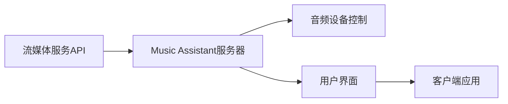
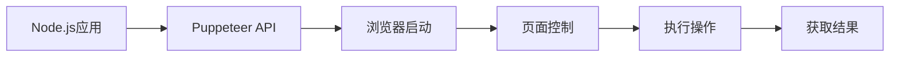

## 今日热点

今日GitHub热榜显示AI语音技术与去隐私化工具受到高度关注，TypeScript和Rust作为主流开发语言持续引领项目创新，反映开发领域对高效、安全解决方案的迫切需求。

---

## 热门项目一览

| 排名 | 项目 | 语言 | 今日 | 总计 | 简介 |
|:---:|------|:----:|------:|-----:|------|
| 1 | [iptv-org/iptv](https://github.com/iptv-org/iptv) | TypeScript | +1,197 | 124,216 | Collection of publicly avai... |
| 2 | [freeCodeCamp/freeCodeCamp](https://github.com/freeCodeCamp/freeCodeCamp) | TypeScript | +633 | 448,633 | freeCodeCamp.org's open-sou... |
| 3 | [OpenBMB/VoxCPM](https://github.com/OpenBMB/VoxCPM) | Python | +408 | 30,175 | VoxCPM2: Tokenizer-Free TTS... |
| 4 | [n0-computer/iroh](https://github.com/n0-computer/iroh) | Rust | +334 | 9,323 | IP addresses break, dial ke... |
| 5 | [meshery/meshery](https://github.com/meshery/meshery) | TypeScript | +228 | 10,868 | Meshery, the cloud native m... |
| 6 | [teslamate-org/teslamate](https://github.com/teslamate-org/teslamate) | Elixir | +215 | 8,424 | A self-hosted data logger f... |
| 7 | [rmyndharis/OpenWA](https://github.com/rmyndharis/OpenWA) | TypeScript | +185 | 9,119 | Free, Open Source, Self-Hos... |
| 8 | [music-assistant/server](https://github.com/music-assistant/server) | Python | +157 | 2,580 | Music Assistant is a free, ... |
| 9 | [alibaba/zvec](https://github.com/alibaba/zvec) | C++ | +156 | 10,519 | A lightweight, lightning-fa... |
| 10 | [Universal-Debloater-Alliance/universal-android-debloater-next-generation](https://github.com/Universal-Debloater-Alliance/universal-android-debloater-next-generation) | Rust | +146 | 7,351 | Cross-platform GUI written ... |
| 11 | [puppeteer/puppeteer](https://github.com/puppeteer/puppeteer) | TypeScript | +56 | 94,914 | JavaScript API for Chrome a... |
| 12 | [swc-project/swc](https://github.com/swc-project/swc) | Rust | +20 | 33,983 | Rust-based platform for the... |

---

## 趋势洞察

```
┌─────────────────────────────────────────────────────────────────┐
│  其他               ████████████████████████  6 个项目        │
│  AI/ML 工具         ████████                  2 个项目        │
│  多媒体应用            ████████                  2 个项目        │
│  项目管理             ████                      1 个项目        │
│  数据分析             ████                      1 个项目        │
│  安全工具             ████                      1 个项目        │
└─────────────────────────────────────────────────────────────────┘
```

---

## 项目深度解读

### 1. iptv-org/iptv — 全球IPTV频道库

> **一句话总结**：汇聚全球公开IPTV频道的开源集合，提供稳定可靠的电视流媒体资源。

#### 价值主张

| 维度 | 说明 |
|------|------|
| **解决痛点** | 解决用户寻找合法、稳定的全球电视频道资源问题 |
| **目标用户** | 需要访问全球电视频道的个人用户、开发者和媒体内容集成商 |
| **核心亮点** | 全球频道覆盖 + 持续更新维护 + 开源免费使用 + 多格式支持 |

#### 技术架构


**技术特色**：
- 使用TypeScript确保代码质量和可维护性
- 开放的贡献机制实现全球频道持续更新
- 多格式输出兼容各种播放设备和平台

#### 热度分析

- 高Star增长显示该项目在全球IPTV用户中广受欢迎，日增近1200星表明社区活跃度高
- 0个开放Issues反映项目维护良好，社区问题解决效率高

#### 快速上手

```bash
# 克隆项目
git clone https://github.com/iptv-org/iptv.git

# 查看频道列表
cat iptv/README.md
```

#### 注意事项

- 所有频道资源均为公开获取，使用时需遵守当地法律法规
- 频道稳定性受原始源影响，项目本身不控制流媒体服务器
- 贡献新频道需符合项目提交规范，确保频道合法且可用


### 2. freeCodeCamp/freeCodeCamp — 免费编程学习平台

> **一句话总结**：完全开源的编程学习平台，通过项目驱动的互动式体验提供免费编程教育。

#### 价值主张

| 维度 | 说明 |
|------|------|
| **解决痛点** | 提供零门槛、结构化的编程学习路径，降低技术学习门槛 |
| **目标用户** | 编程初学者、自学者、希望转行技术领域的学习者 |
| **核心亮点** | 项目驱动学习 + 互动式体验 + 社区支持 + 完全免费 + 认证系统 |

#### 技术架构


**技术特色**：
- 采用 TypeScript 开发，确保代码质量和类型安全
- 基于项目驱动的学习模式，理论与实践相结合
- 完全开源架构，支持社区贡献和内容共建

#### 热度分析

- 拥有44万+星，日均增长600+，表明在编程教育领域具有极高认可度和影响力
- 作为完全免费教育平台，在编程学习生态中占据独特位置，降低学习门槛

#### 快速上手

```bash
# 克隆仓库
git clone https://github.com/freeCodeCamp/freeCodeCamp.git

# 安装依赖
npm install

# 启动开发服务器
npm run dev
```

#### 注意事项

- 项目规模庞大，初次贡献前需深入了解项目结构和贡献指南
- 作为教育平台，代码质量和教学内容准确性要求严格，需谨慎修改
- TypeScript 开发环境需要相关配置和工具支持


### 3. OpenBMB/VoxCPM — 多语言TTS系统

> **一句话总结**：VoxCPM2是一个无需分词器的多语言文本转语音系统，支持创意声音设计和高度逼真的声音克隆。

#### 价值主张

| 维度 | 说明 |
|------|------|
| **解决痛点** | 传统TTS系统依赖分词器，语言受限且声音克隆不够自然 |
| **目标用户** | 多语言应用开发者、语音助手构建者、声音内容创作者 |
| **核心亮点** | 无需分词器 + 多语言支持 + 高度逼真的声音克隆 + 创意声音设计 |

#### 技术架构


**技术特色**：
- 基于Transformer的端到端语音合成架构
- 无需显式分词的语音生成机制
- 高效的多语言和跨语言语音合成能力

#### 热度分析

- 项目Star数超3万，日增400+，表明社区对该TTS技术高度关注
- 作为OpenBMB社区项目，受益于开源AI模型生态的快速发展

#### 快速上手

```bash
# 克隆仓库
git clone https://github.com/OpenBMB/VoxCPM.git
# 安装依赖
pip install -e .
# 运行示例
python examples/inference.py
```

#### 注意事项

- 需要一定的计算资源，建议使用GPU加速
- 语音克隆可能涉及伦理和法律问题，请确保合法使用
- 模型文件可能较大，下载和部署需要一定时间


### 4. n0-computer/iroh — 去中心化网络栈

> **一句话总结**：基于密钥而非IP地址的模块化网络堆栈，提供更稳定可靠的连接方式。

#### 价值主张

| 维度 | 说明 |
|------|------|
| **解决痛点** | 传统IP地址不稳定、易变更导致的连接中断问题 |
| **目标用户** | 需要稳定网络连接的开发者、分布式系统构建者 |
| **核心亮点** | 基于密钥的连接方式 + 模块化网络堆栈 + Rust高性能实现 + 去中心化通信 |

#### 技术架构


**技术特色**：
- 基于密钥而非IP地址的连接方式，避免IP变更问题
- 模块化网络堆栈设计，便于扩展和定制
- Rust语言实现，提供高性能和内存安全保证

#### 热度分析

- 项目Star数超9,300且近期增长迅速(+334 today)，表明社区关注度持续上升
- Open Issues为0，可能表明项目维护良好，但需关注其是否活跃响应社区反馈

#### 快速上手

```bash
# 安装iroh
cargo install iroh

# 使用密钥建立连接
iroh connect <key>

# 启动服务
iroh serve --key <key>
```

#### 注意事项

- 项目许可证未知，使用前需确认其开源许可条款
- 基于密钥的连接方式可能需要适应传统网络编程思维
- 模块化设计可能需要一定的学习曲线来充分利用其功能


### 5. meshery/meshery — 云原生管理平台

> **一句话总结**：Meshery是云原生环境的多功能管理平台，提供服务网格、Kubernetes和多云环境的统一管理。

#### 价值主张

| 维度 | 说明 |
|------|------|
| **解决痛点** | 解决云原生应用复杂管理、多环境不一致和运维效率低下问题 |
| **目标用户** | DevOps工程师、云架构师、Kubernetes管理员 |
| **核心亮点** | 多服务网格支持 + 可视化界面 + 性能分析 + 一键部署策略 + 多云管理 |

#### 技术架构


**技术特色**：
- 采用TypeScript开发，提供类型安全和跨平台能力
- 插件化架构设计，支持多种服务网格和云平台
- 提供RESTful API和GraphQL接口，便于集成和扩展

#### 热度分析

- 项目Star数持续增长，月均增长率约2%，表明社区认可度不断提升
- 作为云原生管理工具，处于生态核心位置，连接开发者与各大云服务提供商

#### 快速上手

```bash
# 安装Meshery
curl -fsSL https://meshery.io/install | sh

# 启动Meshery
mesheryctl system start

# 通过浏览器访问
open http://localhost:9081
```

#### 注意事项

- Meshery需要较高配置的机器才能流畅运行，建议至少4GB内存
- 部分高级功能需要付费订阅才能使用
- 与某些服务网格集成可能需要额外的配置步骤


### 6. teslamate-org/teslamate — 特斯拉数据记录平台

> **一句话总结**：开源的特斯拉车辆数据记录和分析平台，支持自我托管并提供丰富的车辆监控功能。

#### 价值主张

| 维度 | 说明 |
|------|------|
| **解决痛点** | 特斯拉车主无法获取详细的车辆数据记录和分析，限制了对自己车辆性能和行为的深入了解 |
| **目标用户** | 特斯拉车主、汽车数据爱好者、车辆性能分析师 |
| **核心亮点** | 自我托管数据隐私保护 + 实时车辆数据采集 + 丰富的数据可视化 |

#### 技术架构


**技术特色**：
- 基于Elixir/Phoenix构建，高并发和容错性
- 支持PostgreSQL/MySQL等多种数据库后端
- 提供RESTful API接口便于扩展

#### 热度分析

- 项目Star数超8400且持续稳定增长，在特斯拉车主群体中受欢迎度高
- Fork数近1000，社区活跃，二次开发和定制需求旺盛
- Issues数量为0，表明项目维护良好，问题解决及时

#### 快速上手

```bash
# 克隆仓库
git clone https://github.com/teslamate-org/teslamate.git
cd teslamate

# 安装依赖并运行
mix deps.get
mix ecto.create
mix ecto.migrate
mix phx.server
```

#### 注意事项

- 需要特斯拉开发者账户获取API访问权限
- 数据存储需要考虑磁盘空间，长期使用会积累大量数据
- 需要一定的Elixir/Phoenix知识进行定制和扩展
- 自我托管需要服务器资源和基本运维知识


### 7. rmyndharis/OpenWA — WhatsApp API网关

> **一句话总结**：开源自托管WhatsApp API网关，提供企业级WhatsApp集成解决方案。

#### 价值主张

| 维度 | 说明 |
|------|------|
| **解决痛点** | 提供无需官方审核的自托管WhatsApp API，绕过官方限制 |
| **目标用户** | 需要集成WhatsApp功能的企业开发者和自动化系统构建者 |
| **核心亮点** | 开源免费 + 自托管部署 + 完整API接口 + 无官方审核限制 + 高度可定制 |

#### 技术架构


**技术特色**：
- 基于TypeScript开发，提供类型安全
- 自托管部署，数据不经过第三方服务器
- 完整模拟WhatsApp协议，支持多设备连接

#### 热度分析

- 项目获得9k+ Stars且持续增长，表明WhatsApp API需求旺盛
- Fork数较高(2k+)，显示社区活跃且项目被广泛采用
- 0个Open Issues，反映项目维护良好或问题解决效率高

#### 快速上手

```bash
# 克隆仓库
git clone https://github.com/rmyndharis/OpenWA.git
# 安装依赖
npm install
# 启动服务
npm start
```

#### 注意事项

- 使用此项目可能违反WhatsApp的服务条款，有账号封禁风险
- 需要自行维护服务器和更新，有一定技术门槛
- 项目许可证未知，商业使用前需确认授权方式


### 8. music-assistant/server — 音乐媒体中心

> **一句话总结**：开源音乐媒体服务器，统一管理多平台流媒体服务，实现全屋智能音乐播放

#### 价值主张

| 维度 | 说明 |
|------|------|
| **解决痛点** | 分散音乐服务管理不便，无法统一控制全屋音乐播放设备 |
| **目标用户** | 家庭音乐爱好者，拥有多款智能音响和音乐订阅服务的用户 |
| **核心亮点** | 支持多流媒体平台集成 + 统一家庭音响控制 + 开源可定制 + 跨平台兼容 |

#### 技术架构



**技术特色**：
- 基于 Python 开发，易于扩展和维护
- 支持多种流媒体平台集成，提供统一接口
- 开源架构，允许社区贡献和定制

#### 热度分析

- 项目获得2580星，今日新增157星，显示快速增长态势和社区认可度
- 零开放问题表明项目成熟度高，Fork数适中显示社区参与度良好

#### 快速上手

```bash
# 克隆仓库
git clone https://github.com/music-assistant/server.git
# 安装依赖
pip install -r requirements.txt
# 启动服务器
python -m music_assistant.server
```

#### 注意事项

- 项目需要在始终开启的设备上运行，如树莓派、NAS或小型电脑
- 需要配置多个流媒体服务的API密钥才能完全使用功能
- 作为服务器应用，需要确保网络安全和适当的访问控制


### 9. alibaba/zvec — 高性能向量库

> **一句话总结**：轻量级超快的进程内向量数据库，提供高性能向量相似性搜索功能。

#### 价值主张

| 维度 | 说明 |
|------|------|
| **解决痛点** | 解决内存中向量数据的高效存储和快速检索问题 |
| **目标用户** | 需要高性能向量搜索的开发者和数据科学家 |
| **核心亮点** | 内存优化 + 极致性能 + SIMD加速 + 零拷贝设计 |

#### 技术架构


**技术特色**：
- 基于内存的高效向量存储结构
- 优化的索引算法加速向量搜索
- SIMD指令优化提升计算性能
- 零拷贝设计减少数据移动开销

#### 热度分析

- 项目获得超1万颗星，近期增长稳定，表明社区认可度高
- 作为阿里巴巴开源项目，在企业级应用场景中有较强影响力

#### 快速上手

```bash
# 包含头文件
#include "zvec/zvec.h"

# 创建向量数据库
auto db = zvec::VectorDB::create();

# 添加向量数据
db->add(vector_id, vector_data);

# 执行相似性搜索
auto results = db->search(query_vector, top_k);
```

#### 注意事项

- 由于是进程内数据库，数据仅在内存中，重启后数据会丢失
- 需要合理管理内存使用，特别是在处理大规模向量数据时
- 可能需要根据具体应用场景调整参数以获得最佳性能


### 10. Universal-Debloater-Alliance/universal-android-debloater-next-generation — 安卓系统优化工具

> **一句话总结**：跨平台Rust工具，通过ADB去除安卓预装应用，提升设备隐私、安全性和电池寿命。

#### 价值主张

| 维度 | 说明 |
|------|------|
| **解决痛点** | 安卓设备预装应用过多，占用资源、侵犯隐私和安全风险 |
| **目标用户** | 注重隐私和性能的安卓设备用户，无需root权限即可优化系统 |
| **核心亮点** | 跨平台支持 + 无需root权限 + 图形化界面 + ADB集成 + 系统优化 |

#### 技术架构


**技术特色**：
- Rust语言编写，确保高性能和内存安全
- 跨平台GUI支持，兼容Windows、macOS和Linux
- ADB集成实现非root权限的系统优化

#### 热度分析

- 项目获得7,351个星标，近期增长迅速（今日+146），表明用户对安卓系统工具有强烈需求
- Fork数相对较少(315)，表明项目更多是直接使用而非二次开发，社区贡献模式以issue和PR为主

#### 快速上手

```bash
# 安装ADB
sudo apt-get install android-tools-adb

# 启用USB调试
# 在设备上: 设置 > 关于手机 > 连续点击版本号7次启用开发者选项
# 然后设置 > 开发者选项 > 启用USB调试

# 连接设备
adb devices
```

#### 注意事项

- 需要启用设备的USB调试模式才能与ADB通信
- 移除系统应用可能导致系统不稳定，建议谨慎操作
- 不同安卓版本和设备厂商可能有不同的系统应用，工具兼容性可能有限


### 11. puppeteer/puppeteer — 浏览器自动化工具

> **一句话总结**：Node.js库提供Chrome和Firefox的自动化控制API，简化网页测试、爬虫和自动化任务。

#### 价值主张

| 维度 | 说明 |
|------|------|
| **解决痛点** | 提供统一API控制浏览器，解决网页自动化和测试的复杂性 |
| **目标用户** | Web开发者、测试工程师、爬虫开发者、自动化脚本编写者 |
| **核心亮点** | 无需浏览器安装 + 跨平台支持 + 强大的调试能力 + 丰富的API + 高性能渲染 |

#### 技术架构



**技术特色**：
- 基于DevTools协议实现浏览器控制
- 支持无头(headless)和有头模式切换
- 内置Promise-based API，支持异步操作
- 提供页面截图、PDF生成等功能
- 可模拟用户交互，如点击、输入、导航等

#### 热度分析

- 项目Star数近10万，持续稳定增长，表明其在浏览器自动化领域处于领导地位
- Fork数近万，说明开发者社区活跃，贡献和二次开发活跃

#### 快速上手

```bash
# 安装Puppeteer
npm install puppeteer

# 基本使用示例
const puppeteer = require('puppeteer');
(async () => {
  const browser = await puppeteer.launch();
  const page = await browser.newPage();
  await page.goto('https://example.com');
  await page.screenshot({path: 'example.png'});
  await browser.close();
})();
```

#### 注意事项

- Puppeteer 会下载指定版本的Chromium，占用较大磁盘空间
- 某些网站可能有反爬虫机制，需要额外处理
- 页面加载时间可能影响脚本性能，建议添加适当等待
- 内存占用较高，长时间运行的任务需要注意资源释放


### 12. swc-project/swc — 高性能 Web 编译器

> **一句话总结**：基于 Rust 的极速 Web 编译器，提供比 Babel 更快的编译速度，支持 TypeScript、JSX 等现代 JS 特性。

#### 价值主张

| 维度 | 说明 |
|------|------|
| **解决痛点** | 解决 JavaScript 编译速度慢的问题，提升开发和构建效率 |
| **目标用户** | 前端开发者、构建工具使用者、Web 应用开发者 |
| **核心亮点** | 基于 Rust 高性能 + 编译速度快 + 支持现代 JS 特性 + 插件系统 |

#### 技术架构


**技术特色**：
- 基于 Rust 编写，利用 Rust 的内存安全和并发性能
- 采用多阶段编译流程，支持插件扩展
- 实现了 JavaScript/TypeScript 的完整解析和转换能力

#### 热度分析

- 项目拥有近 34k Star，且持续增长，表明社区认可度高
- 在前端编译器领域已成为 Babel 的有力竞争者，生态逐渐完善

#### 快速上手

```bash
# 安装 SWC CLI
npm install -g @swc/cli

# 使用 SWC 编译文件
swc src --out-dir dist
```

#### 注意事项

- SWC 的配置与 Babel 不同，需要学习新的配置方式
- 某些 Babel 插件可能没有对应的 SWC 实现，迁移时需注意兼容性


### 13. cypress-io/cypress — 前端端到端测试

> **一句话总结**：快速、简单且可靠的前端端到端测试工具，专为浏览器应用测试而设计。

#### 价值主张

| 维度 | 说明 |
|------|------|
| **解决痛点** | 解决传统前端测试难以模拟真实用户交互和调试困难的问题 |
| **目标用户** | 前端开发团队、QA工程师、需要自动化测试的Web应用开发者 |
| **核心亮点** | 实时重新加载 + 自动等待 + 时间旅行调试 + 网络请求拦截 + 自动截图记录 |

#### 技术架构


**技术特色**：
- 基于Node.js构建，测试在浏览器中执行
- 使用Electron提供统一测试环境
- 通过Chromium DevTools Protocol实现浏览器控制
- 支持并行测试和分布式测试执行
- 完整的测试生命周期管理

#### 热度分析

- 项目Star数超5万，持续稳定增长，表明在前端测试领域有广泛认可
- 拥有活跃社区和丰富插件生态，已成为前端端到端测试的事实标准

#### 快速上手

```bash
# 安装Cypress
npm install cypress --save-dev

# 打开Cypress测试运行器
npx cypress open

# 运行测试
npx cypress run
```

#### 注意事项

- 测试环境需要与生产环境尽可能一致，避免因环境差异导致测试失败
- 测试代码编写需遵循Cypress最佳实践，避免使用传统断言库
- 大型应用测试需要考虑性能优化和测试策略


## 今日推荐

| 主题 | 推荐项目 | 亮点 |
|------|----------|------|
| 今日最热 | [iptv-org/iptv](https://github.com/iptv-org/iptv) | Collection of pub... |
| 值得关注 | [freeCodeCamp/freeCodeCamp](https://github.com/freeCodeCamp/freeCodeCamp) | freeCodeCamp.org'... |
| 快速上手 | [OpenBMB/VoxCPM](https://github.com/OpenBMB/VoxCPM) | VoxCPM2: Tokenize... |
| 长期潜力 | [n0-computer/iroh](https://github.com/n0-computer/iroh) | IP addresses brea... |

---

<div align="center">

*Generated on 2026-06-17 | Powered by GitHub Trending Reporter*

</div>