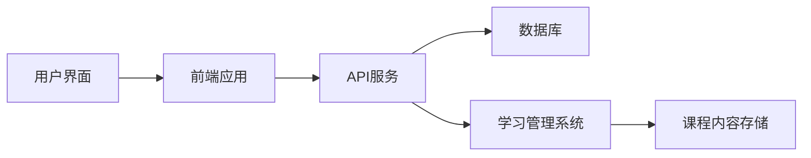
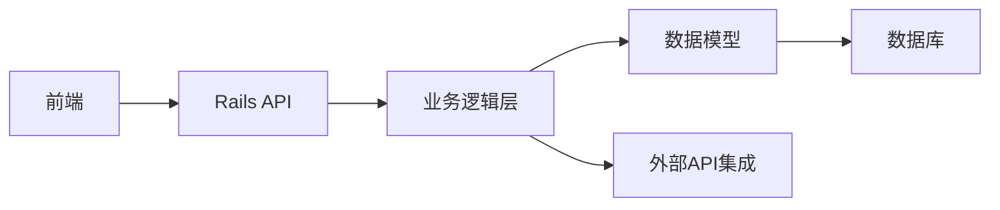
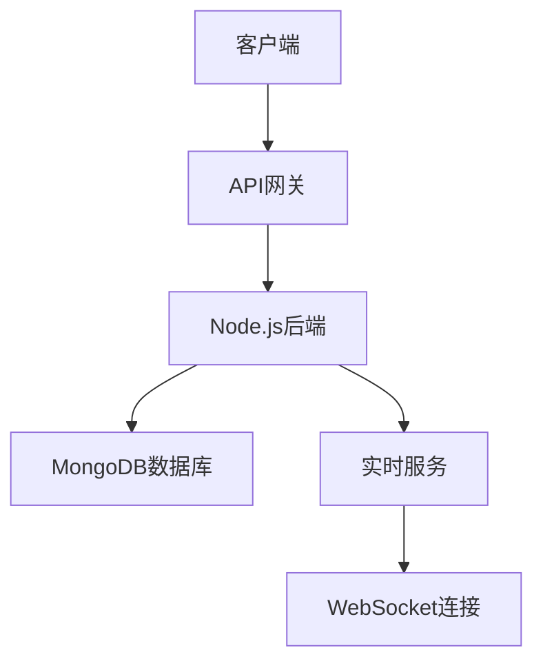

## 今日热点

今日GitHub热榜项目精彩纷呈。

---

## 热门项目一览

| 排名 | 项目 | 语言 | 今日 | 总计 | 简介 |
|:---:|------|:----:|------:|-----:|------|
| 1 | [mattpocock/skills](https://github.com/mattpocock/skills) | Shell | +1,523 | 133,771 | Skills for Real Engineers. ... |
| 2 | [Panniantong/Agent-Reach](https://github.com/Panniantong/Agent-Reach) | Python | +1,161 | 33,332 | Give your AI agent eyes to ... |
| 3 | [obra/superpowers](https://github.com/obra/superpowers) | Shell | +1,129 | 231,199 | An agentic skills framework... |
| 4 | [freeCodeCamp/freeCodeCamp](https://github.com/freeCodeCamp/freeCodeCamp) | TypeScript | +757 | 449,171 | freeCodeCamp.org's open-sou... |
| 5 | [google-research/timesfm](https://github.com/google-research/timesfm) | Python | +606 | 21,958 | TimesFM (Time Series Founda... |
| 6 | [Universal-Debloater-Alliance/universal-android-debloater-next-generation](https://github.com/Universal-Debloater-Alliance/universal-android-debloater-next-generation) | Rust | +457 | 7,666 | Cross-platform GUI written ... |
| 7 | [n0-computer/iroh](https://github.com/n0-computer/iroh) | Rust | +421 | 9,690 | IP addresses break, dial ke... |
| 8 | [DeusData/codebase-memory-mcp](https://github.com/DeusData/codebase-memory-mcp) | C | +371 | 5,490 | High-performance code intel... |
| 9 | [chatwoot/chatwoot](https://github.com/chatwoot/chatwoot) | Ruby | +264 | 32,403 | Open-source live-chat, emai... |
| 10 | [meshery/meshery](https://github.com/meshery/meshery) | TypeScript | +196 | 11,040 | Meshery, the cloud native m... |
| 11 | [bytedance/UI-TARS-desktop](https://github.com/bytedance/UI-TARS-desktop) | TypeScript | +150 | 36,719 | The Open-Source Multimodal ... |
| 12 | [nautechsystems/nautilus_trader](https://github.com/nautechsystems/nautilus_trader) | Rust | +98 | 23,832 | Production-grade Rust-nativ... |

---

## 趋势洞察

```
┌─────────────────────────────────────────────────────────────────┐
│  AI/ML 工具         ████████████████████████  9 个项目        │
│  其他               ████████████████          6 个项目        │
│  多媒体应用            ██                        1 个项目        │
│  项目管理             ██                        1 个项目        │
│  开发工具             ██                        1 个项目        │
│  数据分析             ██                        1 个项目        │
│  安全工具             ██                        1 个项目        │
└─────────────────────────────────────────────────────────────────┘
```

---

## 项目深度解读

### 1. mattpocock/skills — AI开发技能库

> **一句话总结**：分享工程师使用Claude AI提升开发效率的实用技能和配置。

#### 价值主张

| 维度 | 说明 |
|------|------|
| **解决痛点** | 帮助工程师掌握如何有效利用Claude AI提高开发效率和代码质量 |
| **目标用户** | 希望提升AI辅助开发能力的软件工程师和技术团队 |
| **核心亮点** | 实用Claude使用技巧 + 开发效率提升方案 + 工程师经验分享 + 直接可用的配置文件 |

#### 技术架构


**技术特色**：
- 基于Shell脚本实现的自动化工作流
- 直接从实际开发经验提炼的实用技能
- 针对Claude AI优化的提示工程方法

#### 热度分析

- 项目获得超13万星，近期单日增长1500+，显示AI辅助开发领域热度高涨
- 零开放Issues表明项目维护良好，用户反馈及时处理，社区信任度高

#### 快速上手

```bash
# 克隆项目到本地
git clone https://github.com/mattpocock/skills.git

# 查看项目中的技能文档
cat README.md
```

#### 注意事项

- 需要基本了解Claude AI的使用方法才能最大化项目价值
- 技能可能需要根据个人开发环境进行适当调整
- 建议定期更新以获取最新的AI辅助开发技巧


### 2. Panniantong/Agent-Reach — AI互联网接入工具

> **一句话总结**：统一命令行接口让AI代理无API费用访问多平台网络内容。

#### 价值主张

| 维度 | 说明 |
|------|------|
| **解决痛点** | 突破AI代理无法直接获取互联网公开内容的限制 |
| **目标用户** | AI开发者、研究人员及需要广泛网络数据的应用构建者 |
| **核心亮点** | 多平台统一接入 + 零API费用 + 命令行操作简单 + 支持中文平台 |

#### 技术架构


**技术特色**：
- 模拟浏览器行为绕过平台访问限制
- 多平台API统一封装与适配
- 无需官方API密钥即可获取内容

#### 热度分析

- 项目Star数快速增长，日均新增超千星，反映AI领域对网络接入的迫切需求
- Fork数相对较低，表明项目处于早期阶段，社区贡献尚未大规模展开

#### 快速上手

```bash
# 安装
pip install agent-reach

# 使用示例
agent-reach --platform twitter --search "AI development"
```

#### 注意事项

- 项目使用可能涉及各平台服务条款的合规性问题
- 网络访问功能可能受到地区限制
- 项目稳定性依赖于各平台接口变化，需关注维护状态


### 3. obra/superpowers — 技能开发框架

> **一句话总结**：一个实用的代理技能框架和软件开发方法论，帮助开发者提升工作效率和能力。

#### 价值主张

| 维度 | 说明 |
|------|------|
| **解决痛点** | 解决开发者技能提升和高效开发方法缺乏的问题 |
| **目标用户** | 软件开发者和需要提升技能的专业人士 |
| **核心亮点** | 实用方法论 + 技能框架 + 效率提升 + 可操作性 |

#### 技术架构


**技术特色**：
- 基于Shell的轻量级实现
- 模块化技能框架设计
- 实用方法论集成

#### 热度分析

- 项目获得23万+星，近期增长迅速，表明其价值得到广泛认可
- Fork数适中，说明项目可能更注重使用而非二次开发

#### 快速上手

```bash
# 克隆项目
git clone https://github.com/obra/superpowers.git
# 进入目录
cd superpowers
# 执行项目
./superpowers
```

#### 注意事项

- 注意查看项目文档以了解具体使用方法
- 由于项目没有明确许可证，使用时需注意版权问题


### 4. freeCodeCamp/freeCodeCamp — 编程学习开源平台

> **一句话总结**：开源编程学习平台，提供免费数学、编程和计算机科学课程，帮助全球学习者获取技术技能。

#### 价值主张

| 维度 | 说明 |
|------|------|
| **解决痛点** | 解决教育资源获取不平等问题，提供免费高质量的编程学习资源 |
| **目标用户** | 编程初学者、希望提升技能的开发者、教育资源工作者 |
| **核心亮点** | 完全免费开放课程 + 项目式学习体验 + 全球社区支持 + 系统化课程设计 |

#### 技术架构



**技术特色**：
- 基于 TypeScript 的全栈开发，提高代码质量和可维护性
- 开源课程管理系统，支持多人协作更新内容
- 响应式设计，适配多种设备学习需求

#### 热度分析

- 项目拥有44万+星标，每日新增700+星，表明持续受到全球开发者和学习者的认可
- 作为开源教育平台，在技术学习领域具有显著影响力，社区贡献活跃

#### 快速上手

```bash
# 克隆仓库
git clone https://github.com/freeCodeCamp/freeCodeCamp.git

# 安装依赖
npm install

# 启动开发服务器
npm run start
```

#### 注意事项

- 这是一个大型项目，初次贡献者可能需要时间了解项目结构
- 课程内容更新频繁，建议关注最新文档和贡献指南
- 项目使用TypeScript，需要相关开发经验


### 5. google-research/timesfm — 时间序列基础模型

> **一句话总结**：Google Research 开发的预训练时间序列基础模型，提供高精度零样本预测能力。

#### 价值主张

| 维度 | 说明 |
|------|------|
| **解决痛点** | 解决传统时间序列模型需要大量标注数据和领域知识的问题 |
| **目标用户** | 数据科学家、时间序列分析师、研究人员和企业决策者 |
| **核心亮点** | 预训练基础模型 + 零样本预测能力 + 高精度预测 + 跨领域适应性 |

#### 技术架构


**技术特色**：
- 基于大规模时间序列数据预训练的基础模型
- 支持零样本预测，无需针对特定任务重新训练
- 采用先进的深度学习架构处理时间序列数据

#### 热度分析

- 项目短时间内获超2万星，每日增长约600星，关注度极高
- 作为Google Research的开源项目，在时间序列领域占据领先地位

#### 快速上手

```bash
# 安装
pip install timesfm

# 基本使用
import timesfm
model = timesfm.TimesFM()
predictions = model.predict(time_series_data)
```

#### 注意事项

- 需要了解基础的深度学习概念才能有效使用模型
- 模型性能可能因具体应用场景和数据特性而有所不同
- 需要适当的计算资源来运行模型，特别是处理大规模数据时


### 6. Universal-Debloater-Alliance/universal-android-debloater-next-generation — Android精简工具

> **一句话总结**：跨平台Rust工具，无需root即可移除Android预装应用，提升设备性能与隐私保护。

#### 价值主张

| 维度 | 说明 |
|------|------|
| **解决痛点** | 解决Android设备预装应用过多、消耗资源、侵犯隐私的问题 |
| **目标用户** | 注重隐私、性能和电池寿命的Android设备用户 |
| **核心亮点** | 无需root + 跨平台支持 + 安全移除 + 可定制化 + 隐私保护 |

#### 技术架构


**技术特色**：
- 使用Rust语言开发，提供跨平台支持
- 通过ADB实现非root环境下的应用移除
- 提供安全的移除机制，避免系统关键组件被误删
- 图形化界面操作简便，适合普通用户

#### 热度分析

- 项目获得7666个Star，单日增长457，表明社区对该工具需求旺盛
- 开放Issue为0，可能表明项目维护良好或用户通过其他渠道反馈问题

#### 快速上手

```bash
# 克隆仓库
git clone https://github.com/Universal-Debloater-Alliance/universal-android-debloater-next-generation.git

# 构建项目
cd universal-android-debloater-next-generation
cargo build --release
```

#### 注意事项

- 使用前需要开启Android设备的开发者选项并启用USB调试
- 确保已安装ADB工具
- 移除系统应用前建议先备份重要数据
- 不是所有设备都支持所有应用的安全移除


### 7. n0-computer/iroh — 密钥导向网络

> **一句话总结**：基于密钥而非IP地址的模块化网络堆栈，提供更可靠的网络通信方式。

#### 价值主张

| 维度 | 说明 |
|------|------|
| **解决痛点** | 传统IP地址不稳定且难以管理，导致网络连接不可靠 |
| **目标用户** | 分布式系统开发者、P2P网络应用构建者 |
| **核心亮点** | 基于密钥的连接 + 模块化设计 + 高可靠性 + 隐私保护 |

#### 技术架构


**技术特色**：
- 基于密钥而非IP地址的寻址机制
- 模块化网络堆栈设计，易于扩展
- 高度可靠的网络连接，避免传统IP地址问题
- 内置安全通信机制

#### 热度分析

- 项目Star数近万，近期增长迅速，单日增长421，表明社区关注度持续上升
- 零开放Issues，表明项目维护良好，问题解决及时

#### 快速上手

```bash
# 安装iroh
cargo install iroh

# 初始化节点
iroh init

# 使用密钥连接节点
iroh connect <key>
```

#### 注意事项

- 项目License未知，可能存在使用限制
- 作为新兴技术，生态系统可能尚不完善
- 需要一定的Rust编程基础才能充分利用项目特性


### 8. DeusData/codebase-memory-mcp — 代码智能索引

> **一句话总结**：高性能代码智能MCP服务器，毫秒级索引代码库，支持158种语言，查询速度快且token消耗减少99%。

#### 价值主张

| 维度 | 说明 |
|------|------|
| **解决痛点** | 解决代码库分析效率低、资源消耗大的问题，提供快速智能的代码搜索体验。 |
| **目标用户** | 开发团队、代码审查人员、软件开发研究人员。 |
| **核心亮点** | 单静态二进制 + 零依赖 + 158种语言支持 + 毫秒级索引 + 99%更少token消耗 |

#### 技术架构


**技术特色**：
- 单静态二进制，零依赖设计，简化部署
- 毫秒级索引能力，支持大型代码库快速处理
- 158种语言支持，覆盖绝大多数编程场景

#### 热度分析

- 项目获得5490个Star，近期增长迅速，今日新增371个，表明社区高度认可。
- 零开放Issues反映项目成熟度高，作为MCP服务器在代码智能领域占据重要位置。

#### 快速上手

```bash
# 下载二进制文件
./codebase-memory-mcp --help
# 初始化索引
./codebase-memory-mcp init /path/to/codebase
# 启动服务器
./codebase-memory-mcp serve
```

#### 注意事项

- 项目为纯C语言编写，可能需要考虑不同平台的兼容性问题。
- 项目依赖MCP协议，使用前需要确保环境支持该协议。


### 9. chatwoot/chatwoot — 开源客服系统

> **一句话总结**：开源全渠道客服平台，提供聊天、邮件支持，替代Intercom、Zendesk等商业解决方案。

#### 价值主张

| 维度 | 说明 |
|------|------|
| **解决痛点** | 提供低成本、可定制的全渠道客服解决方案，降低企业客户支持成本 |
| **目标用户** | 中小型企业、开发团队、需要自托管客服系统的组织 |
| **核心亮点** | 开源可定制 + 全渠道整合 + 数据可视化 + API丰富 + 自托管可控 |

#### 技术架构



**技术特色**：
- 基于Ruby on Rails构建的全栈Web应用
- 支持多渠道通信整合（聊天、邮件、社交媒体等）
- 采用事件驱动架构处理客户交互
- 提供丰富的REST API便于集成

#### 热度分析

- Star数超过3.2万，近期日增264星，表明项目处于高速增长阶段，社区认可度高
- 作为开源客服系统替代商业方案，在特定领域具有显著影响力，形成活跃的开发者生态

#### 快速上手

```bash
# 克隆仓库
git clone https://github.com/chatwoot/chatwoot.git

# 安装依赖并启动
cd chatwoot && bundle install && rails s
```

#### 注意事项

- 项目License未知，可能存在商业使用限制
- 部署可能需要一定的Ruby on Rails经验
- 集成外部渠道可能需要额外配置和API密钥


### 10. meshery/meshery — 云原生管理平台

> **一句话总结**：多云环境下的服务网格管理和应用交付统一平台，简化复杂云原生架构操作。

#### 价值主张

| 维度 | 说明 |
|------|------|
| **解决痛点** | 统一管理多云环境下的服务网格和应用部署，消除碎片化管理工具 |
| **目标用户** | DevOps工程师、平台架构师、云原生应用开发团队 |
| **核心亮点** | 多云服务网格管理 + 可视化配置 + 性能优化 + 持续集成 |

#### 技术架构


**技术特色**：
- 基于 TypeScript 构建的高性能云原生管理平台
- 提供多种服务网格的统一管理接口
- 内置性能分析和优化建议系统

#### 热度分析

- 项目 Star 数超过 11,000，近期增长稳定，表明在云原生管理领域有较强影响力
- Fork 数与 Star 数比例合理，表明项目有良好的社区参与度和二次开发价值

#### 快速上手

```bash
# 安装 Meshery
docker run -d --name meshery -p 9081:9081 meshery/meshery

# 访问 Meshery UI
open http://localhost:9081
```

#### 注意事项

- 需要一定的云原生技术背景才能充分利用其功能
- 在大规模生产环境中部署前建议充分测试与现有系统的兼容性


### 11. bytedance/UI-TARS-desktop — 多模态AI代理栈

> **一句话总结**：开源多模态AI代理栈，连接前沿AI模型与代理基础设施，提供一站式AI解决方案。

#### 价值主张

| 维度 | 说明 |
|------|------|
| **解决痛点** | 多模态AI模型分散、集成困难，缺乏统一的代理管理平台 |
| **目标用户** | AI开发者、研究人员和企业技术团队 |
| **核心亮点** | 模块化架构设计 + 多模态模型支持 + 企业级部署能力 |

#### 技术架构


**技术特色**：
- 基于TypeScript开发，提供类型安全
- 支持多种前沿AI模型的集成
- 企业级可扩展架构设计
- 开源社区驱动持续迭代

#### 热度分析

- Star数超过3.6万，近期增长稳定，日均增长约150，表明项目受广泛关注
- Fork数3700+，反映社区积极参与和二次开发热情

#### 快速上手

```bash
# 克隆项目
git clone https://github.com/bytedance/UI-TARS-desktop.git

# 安装依赖
npm install

# 启动开发环境
npm run dev
```

#### 注意事项

- 项目许可证信息不明确，使用前需确认具体开源协议
- 作为AI代理栈，可能需要较高的计算资源进行部署
- 项目可能需要AI模型API密钥或自备模型才能正常运行


### 12. nautechsystems/nautilus_trader — 高性能交易引擎

> **一句话总结**：生产级Rust原生交易引擎，具备确定性事件驱动架构，专为高频量化设计。

#### 价值主张

| 维度 | 说明 |
|------|------|
| **解决痛点** | 传统交易系统在高频场景下的性能瓶颈和确定性保证不足 |
| **目标用户** | 高频交易机构、量化交易团队、金融科技开发者 |
| **核心亮点** | 高性能 + 确定性事件驱动 + 模块化设计 + 完整交易生命周期 + 多资产支持 |

#### 技术架构


**技术特色**：
- 基于Rust的高性能实现，零成本抽象
- 确定性事件驱动架构，保证交易逻辑可重现
- 模块化设计，支持多种资产类别和交易场景

#### 热度分析

- Star数高且持续增长，日均新增近百星，表明项目受关注度高
- Fork数较多，社区活跃度高，项目已被多个交易机构采用

#### 快速上手

```bash
cargo add nautilus_trader
cargo build --release
```

#### 注意事项

- 需要Rust编程基础，学习曲线较陡
- 交易系统涉及资金安全，需充分测试
- 项目文档可能需要补充，因为Issues为0可能表示问题在其他渠道


### 13. calesthio/OpenMontage — AI视频制作平台

> **一句话总结**：开源AI代理视频制作系统，将AI助手转变为全功能视频创作工作室。

#### 价值主张

| 维度 | 说明 |
|------|------|
| **解决痛点** | 传统视频制作流程复杂、专业门槛高，AI创作工具分散且不协同 |
| **目标用户** | 内容创作者、视频制作人、AI开发者、独立创作者 |
| **核心亮点** | 12个专业视频流水线 + 52种创作工具 + 500+AI代理技能 + 全流程自动化 |

#### 技术架构


**技术特色**：
- 基于AI代理的自动化视频制作流水线
- 集成52种专业视频制作工具
- 500+专业技能支持多场景视频创作
- 开源可扩展的架构设计

#### 热度分析

- 项目Star数达5,401，近期增长迅速，日均约98个Star，显示社区高度关注
- Fork数1,010，表明用户不仅关注项目，还积极参与二次开发和贡献

#### 快速上手

```bash
# 克隆项目
git clone https://github.com/calesthio/OpenMontage.git
cd OpenMontage
# 安装依赖
pip install -r requirements.txt
# 运行系统
python main.py --help
```

#### 注意事项

- 项目许可证未知，商业使用前需确认授权条款
- 项目描述中提到"AI编码助手"，可能需要配置AI API密钥
- 由于是视频制作系统，可能需要较高的计算资源
- 项目无开放Issues，可能通过其他渠道提供技术支持


### 14. krahets/hello-algo — 算法可视化教程

> **一句话总结**：多语言实现、动画图解的交互式算法学习平台，让复杂算法直观易懂。

#### 价值主张

| 维度 | 说明 |
|------|------|
| **解决痛点** | 解决传统算法学习抽象难懂的问题，通过可视化降低学习门槛 |
| **目标用户** | 算法初学者、计算机专业学生、求职面试准备者 |
| **核心亮点** | 多语言实现支持 + 动画可视化 + 交互式学习 + 一键运行代码 + 多语言教程 |

#### 技术架构


**技术特色**：
- 跨语言实现支持，覆盖主流编程语言
- 动画可视化技术，使抽象算法具体化
- 交互式学习设计，提升学习体验
- 代码一键运行功能，便于实践验证

#### 热度分析

- 基于Star/Fork数据的高增长率，表明项目在算法学习领域广受欢迎且持续增长
- 社区活跃度高，多语言支持体现国际化特性，形成多元化学习生态

#### 快速上手

```bash
# 克隆项目
git clone https://github.com/krahets/hello-algo.git

# 进入项目目录
cd hello-algo

# 查看README获取详细使用指南
cat README.md
```

#### 注意事项

- 项目需要一定的编程基础才能理解算法内容
- 不同语言版本的实现可能存在差异，需注意选择适合的语言版本
- 可视化效果可能需要在特定环境中运行才能完全体验


### 15. makeplane/plane — 开源项目管理平台

> **一句话总结**：Plane 是一个现代化的开源项目管理平台，提供任务、冲刺和文档管理功能，作为商业工具的替代方案。

#### 价值主张

| 维度 | 说明 |
|------|------|
| **解决痛点** | 提供开源、可自托管的项目管理解决方案，摆脱商业工具依赖 |
| **目标用户** | 中小型团队、开发团队、需要灵活项目管理工具的组织 |
| **核心亮点** | 现代UI界面 + 开源可定制 + 多功能集成 + 自托管选项 |

#### 技术架构

**技术特色**：
- 基于 TypeScript 开发，提供类型安全
- 采用现代化前端框架，确保流畅的用户体验
- 开源架构，支持本地部署和定制化

#### 热度分析

- Star 数超过 51,000，增长势头强劲，显示社区对其替代商业项目管理工具的认可
- Fork 数量适中，表明有活跃的开发社区参与贡献和定制

#### 快速上手

```bash
# 克隆项目
git clone https://github.com/makeplane/plane.git

# 安装依赖
cd plane && npm install

# 启动开发服务器
npm run dev
```

#### 注意事项

- 项目 License 信息不明确，使用前需确认授权条款
- 作为新兴项目，生态系统和插件可能不如成熟的商业工具丰富
- 需要自行负责部署和维护，与 SaaS 解决方案相比有额外运维负担


### 16. penpot/penpot — 开源设计协作

> **一句话总结**：开源设计工具，打通设计与开发协作壁垒，支持开放格式与实时协作。

#### 价值主张

| 维度 | 说明 |
|------|------|
| **解决痛点** | 解决设计工具与代码实现之间的脱节问题，促进设计开发协作 |
| **目标用户** | 设计师、前端开发团队、需要协作完成UI/UX项目的团队 |
| **核心亮点** | 开源 + 协作设计 + 代码导出 + 跨平台 + 开放格式 |

#### 技术架构


**技术特色**：
- 采用 Clojure/ClojureScript 全栈函数式编程范式
- 基于开放格式设计文件，避免供应商锁定
- 实现设计系统与代码的直接映射与导出

#### 热度分析

- Star 数量达 5 万+，日增约 70，表明项目有稳定且活跃的增长趋势
- 作为开源设计工具，在商业工具主导的市场中展现出强劲的社区吸引力

#### 快速上手

```bash
# 克隆仓库
git clone https://github.com/penpot/penpot.git
# 安装依赖
make deps
# 启动开发环境
make dev
```

#### 注意事项

- 需要了解 Clojure 生态系统和函数式编程概念
- 首次启动可能需要较长时间编译依赖
- 某些高级功能可能需要额外配置或插件支持


### 17. continuedev/continue — AI编程助手

> **一句话总结**：Continue是一个开源的AI编程助手，能够智能理解上下文并提供代码生成与补全。

#### 价值主张

| 维度 | 说明 |
|------|------|
| **解决痛点** | 提升编码效率，减少重复工作，智能理解上下文生成高质量代码 |
| **目标用户** | 软件开发者、程序员、编码学习者 |
| **核心亮点** | AI智能代码生成 + 跨IDE支持 + 开源可定制 + 上下文理解 + 自动化测试生成 |

#### 技术架构


**技术特色**：
- 基于大语言模型的代码理解与生成
- 支持多IDE集成(VS Code, JetBrains等)
- 开源可扩展的插件架构

#### 热度分析

- 项目拥有33,930个星标，持续增长(+49/天)，在AI编程工具领域处于领先地位
- 作为开源AI编程助手，在开发者社区中具有重要影响力，推动AI辅助编程生态发展

#### 快速上手

```bash
# 克隆项目
git clone https://github.com/continuedev/continue.git

# 安装依赖
npm install

# 构建项目
npm run build
```

#### 注意事项

- 需要配置AI服务API密钥才能使用核心功能
- 代码生成质量依赖于所使用的AI模型能力
- 可能需要较新的Node.js版本支持


### 18. alexzhang13/rlm — 递归语言模型库

> **一句话总结**：通用即插即用递归语言模型推理库，支持多种沙箱环境，简化RLM部署流程。

#### 价值主张

| 维度 | 说明 |
|------|------|
| **解决痛点** | 递归语言模型部署复杂、集成困难的问题 |
| **目标用户** | NLP研究人员、语言模型开发者、AI应用集成者 |
| **核心亮点** | 即插即用接口 + 多沙箱支持 + 模块化设计 + 统一API |

#### 技术架构


**技术特色**：
- 统一抽象接口，兼容多种递归语言模型
- 沙箱隔离机制，确保运行安全与资源隔离
- 轻量级设计，最小化部署开销

#### 热度分析
- 近5K stars，近期稳定增长，表明社区认可度高
- Fork比例较低，暗示项目处于早期发展阶段，社区贡献潜力大

#### 快速上手

```bash
# 安装rlm库
pip install rlm

# 基本使用示例
from rlm import RecursiveLM
model = RecursiveLM("gpt2")
response = model.generate("Recursive Language Models are")
```

#### 注意事项
- 需确保安装了对应模型所需的依赖项
- 沙箱环境可能需要额外配置和权限
- 不同模型可能需要调整特定参数以获得最佳效果


### 19. yairm210/Unciv — 文明5开源重制

> **一句话总结**：开源跨平台文明5重制，完整还原核心玩法，支持Android和桌面双平台。

#### 价值主张

| 维度 | 说明 |
|------|------|
| **解决痛点** | 移动端文明5体验缺失，缺乏开源可定制版本 |
| **目标用户** | 策略游戏爱好者、文明系列粉丝、开源社区成员 |
| **核心亮点** | 完整还原文明5核心玩法 + 跨平台支持 + 开源可定制 + 活跃社区更新 |

#### 技术架构


**技术特色**：
- 使用Kotlin开发，跨平台兼容性强
- 完整实现文明5的核心游戏机制
- 支持Android和桌面双平台部署

#### 热度分析

- 项目Star数过万且持续增长，表明文明5开源重制有稳定需求
- Fork数近两千，社区参与度高，项目维护活跃

#### 快速上手

```bash
# 克隆项目
git clone https://github.com/yairm210/Unciv.git
# 构建项目
./gradlew build
# 安装应用
adb install app/build/outputs/apk/debug/app-debug.apk
```

#### 注意事项

- 项目需要较高的Android版本或特定桌面环境支持
- 游戏可能需要较长时间加载，特别是首次运行时
- 作为开源项目，用户可自行修改和扩展功能


### 20. RocketChat/Rocket.Chat — 企业通信平台

> **一句话总结**：开源的企业级团队协作与即时通讯平台，提供安全可靠的通信解决方案。

#### 价值主张

| 维度 | 说明 |
|------|------|
| **解决痛点** | 企业缺乏安全可控、功能丰富的内部通信协作平台 |
| **目标用户** | 中大型企业、政府机构、专业团队组织 |
| **核心亮点** | 端到端加密 + 自托管部署 + 丰富集成能力 + 多端同步 + 可定制化 |

#### 技术架构



**技术特色**：
- 采用全栈TypeScript开发，类型安全性强
- 基于Meteor框架实现实时数据同步
- 支持LDAP/OAuth等身份认证集成

#### 热度分析

- Star数超4.5万且持续稳定增长，表明项目获得广泛认可
- 作为开源通信领域的重要项目，拥有活跃的社区和丰富的插件生态

#### 快速上手

```bash
# 使用Docker快速部署Rocket.Chat
docker run --name rocketchat -p 3000:3000 rocketchat/rocket.chat:latest
```

#### 注意事项

- 生产环境部署需配置反向代理和SSL证书
- 建议定期备份数据库，确保数据安全
- 需要足够的系统资源，特别是内存分配
- 企业使用前应评估安全配置是否符合合规要求


## 今日推荐

| 主题 | 推荐项目 | 亮点 |
|------|----------|------|
| 今日最热 | [mattpocock/skills](https://github.com/mattpocock/skills) | Skills for Real E... |
| 值得关注 | [Panniantong/Agent-Reach](https://github.com/Panniantong/Agent-Reach) | Give your AI agen... |
| 快速上手 | [obra/superpowers](https://github.com/obra/superpowers) | An agentic skills... |
| 长期潜力 | [freeCodeCamp/freeCodeCamp](https://github.com/freeCodeCamp/freeCodeCamp) | freeCodeCamp.org'... |

---

<div align="center">

*Generated on 2026-06-18 | Powered by GitHub Trending Reporter*

</div>