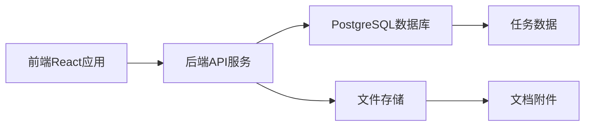

## 今日热点

今日GitHub热榜显示AI代理工程与时间序列分析成为焦点，Google的TimesFM和多个代理工程平台获得大量关注，反映AI技术向专业化工具和自动化系统演进的趋势。

---

## 热门项目一览

| 排名 | 项目 | 语言 | 今日 | 总计 | 简介 |
|:---:|------|:----:|------:|-----:|------|
| 1 | [DeusData/codebase-memory-mcp](https://github.com/DeusData/codebase-memory-mcp) | C | +2,322 | 7,167 | High-performance code intel... |
| 2 | [obra/superpowers](https://github.com/obra/superpowers) | Shell | +1,429 | 232,516 | An agentic skills framework... |
| 3 | [Kilo-Org/kilocode](https://github.com/Kilo-Org/kilocode) | TypeScript | +1,345 | 22,227 | Kilo is the all-in-one agen... |
| 4 | [google-research/timesfm](https://github.com/google-research/timesfm) | Python | +844 | 23,301 | TimesFM (Time Series Founda... |
| 5 | [makeplane/plane](https://github.com/makeplane/plane) | TypeScript | +613 | 51,870 | 🔥🔥🔥 Open-source Jira, Linea... |
| 6 | [freeCodeCamp/freeCodeCamp](https://github.com/freeCodeCamp/freeCodeCamp) | TypeScript | +417 | 449,581 | freeCodeCamp.org's open-sou... |
| 7 | [n0-computer/iroh](https://github.com/n0-computer/iroh) | Rust | +369 | 10,032 | IP addresses break, dial ke... |
| 8 | [alibaba/zvec](https://github.com/alibaba/zvec) | C++ | +259 | 11,262 | A lightweight, lightning-fa... |
| 9 | [Universal-Debloater-Alliance/universal-android-debloater-next-generation](https://github.com/Universal-Debloater-Alliance/universal-android-debloater-next-generation) | Rust | +244 | 7,943 | Cross-platform GUI written ... |
| 10 | [zai-org/GLM-5](https://github.com/zai-org/GLM-5) | Unknown | +202 | 4,173 | GLM-5: From Vibe Coding to ... |
| 11 | [withastro/flue](https://github.com/withastro/flue) | TypeScript | +162 | 5,537 | The sandbox agent framework. |
| 12 | [yifanfeng97/Hyper-Extract](https://github.com/yifanfeng97/Hyper-Extract) | Python | +124 | 1,828 | Transform unstructured text... |

---

## 趋势洞察

```
┌─────────────────────────────────────────────────────────────────┐
│  AI/ML 工具         ████████████████████████  8 个项目        │
│  数据分析             ██████                    2 个项目        │
│  其他               ██████                    2 个项目        │
│  开发框架             ███                       1 个项目        │
│  多媒体应用            ███                       1 个项目        │
│  项目管理             ███                       1 个项目        │
│  开发工具             ███                       1 个项目        │
│  安全工具             ███                       1 个项目        │
└─────────────────────────────────────────────────────────────────┘
```

---

## 项目深度解读

### 1. DeusData/codebase-memory-mcp — 代码智能服务器

> **一句话总结**：高性能代码智能MCP服务器，毫秒级索引代码库，支持158种语言。

#### 价值主张

| 维度 | 说明 |
|------|------|
| **解决痛点** | 传统代码分析工具性能低、资源消耗大、语言支持有限 |
| **目标用户** | 开发者、代码分析工具使用者、大型代码库维护者 |
| **核心亮点** | 高性能索引 + 多语言支持 + 极低token消耗 + 单二进制零依赖 + 持久化知识图 |

#### 技术架构


**技术特色**：
- 使用C语言编写，确保高性能和低资源消耗
- 将代码转换为持久化知识图，支持快速查询
- 支持多达158种编程语言，覆盖面广
- 单二进制文件设计，部署简单，无依赖
- 查询时间低于毫秒级，比传统方法减少99%的token消耗

#### 热度分析

- 项目获得7,167个Star，单日增长2,322，表明近期热度极高
- Open Issues为0，可能表明项目管理严格或社区通过其他渠道交流
- Fork数571，相对Star比例较低，说明项目主要用于直接使用而非二次开发

#### 快速上手

```bash
# 下载二进制文件
wget [下载链接]

# 赋予执行权限
chmod +x codebase-memory-mcp

# 运行服务器
./codebase-memory-mcp
```

#### 注意事项

- 项目许可证未知，商业使用前需要确认许可证信息
- 虽然支持158种语言，但对某些小众语言的支持可能不够完善
- 作为MCP服务器，可能需要特定的MCP客户端才能充分发挥其功能
- 项目是C语言编写，可能在某些平台上编译或运行存在兼容性问题


### 2. obra/superpowers — 技能框架

> **一句话总结**：一套高效的代理技能框架与软件开发方法论，通过Shell脚本实现自动化工作流。

#### 价值主张

| 维度 | 说明 |
|------|------|
| **解决痛点** | 传统软件开发流程低效，缺乏系统化技能框架 |
| **目标用户** | 开发者、技术团队和项目管理实践者 |
| **核心亮点** | 代理技能框架 + 实用方法论 + Shell实现 + 高效工作流 + 实战验证 |

#### 技术架构


**技术特色**：
- 基于Shell的轻量级实现
- 模块化技能组合系统
- 可扩展的代理框架设计

#### 热度分析

- 项目Star数突破23万，日均增长1400+，呈现爆发式增长态势
- 零开放问题表明项目成熟度高，社区维护完善

#### 快速上手

```bash
# 克隆项目
git clone https://github.com/obra/superpowers.git
# 进入目录
cd superpowers
# 运行示例
./superpowers init
```

#### 注意事项

- 项目采用未知许可证，商业使用前需确认授权条款
- Shell实现依赖于Linux/Unix环境，Windows用户需额外配置


### 3. Kilo-Org/kilocode — 智能编码平台

> **一句话总结**：集成式AI工程平台，提供全流程智能编码辅助，加速软件开发周期。

#### 价值主张

| 维度 | 说明 |
|------|------|
| **解决痛点** | 传统开发效率低下，AI辅助编码缺乏全流程整合 |
| **目标用户** | 软件开发者、工程团队、企业研发部门 |
| **核心亮点** | AI代码生成 + 自动化测试 + 部署集成 + 多语言支持 + 实时协作 |

#### 技术架构


**技术特色**：
- 基于大语言模型的上下文感知代码生成
- 支持TypeScript为主的多语言智能编码
- 自动化测试与质量保障机制集成
- 版本控制系统无缝对接

#### 热度分析

- 项目Star数突破22,000且单日增长超1,300，社区热度呈指数级上升
- 在AI辅助开发领域处于领先地位，有望成为行业标准工具

#### 快速上手

```bash
# 安装Kilo
npm install -g kilo-cli

# 初始化项目
kilo init my-project --template typescript

# 启动智能编码助手
kilo assist --model gpt-4
```

#### 注意事项

- 需要配置OpenAI API或其他兼容的LLM服务才能使用核心功能
- AI生成代码需要人工审核，不可完全依赖自动生成
- 企业使用时需注意代码安全与隐私保护措施


### 4. google-research/timesfm — 时间序列基础模型

> **一句话总结**：Google研发的时间序列预训练模型，提供高精度、通用化的时间序列预测能力。

#### 价值主张

| 维度 | 说明 |
|------|------|
| **解决痛点** | 解决传统时间序列模型泛化能力差、需大量特定领域数据的问题 |
| **目标用户** | 数据科学家、时间序列分析师、预测系统开发者 |
| **核心亮点** | 预训练基础模型 + 零样本预测能力 + 多领域适用性 + 高精度预测 + 易于微调 |

#### 技术架构


**技术特色**：
- 基于Transformer架构的时间序列预训练模型
- 支持零样本预测，无需针对特定任务进行训练
- 可处理不同长度和频率的时间序列数据
- 提供预测不确定性估计

#### 热度分析

- 项目Star数超过2.3万，单日增长800+，处于快速增长期
- 作为Google Research出品的时间序列基础模型，在学术界和工业界都有重要影响力

#### 快速上手

```bash
# 安装TimesFM
pip install timesfm

# 基本使用示例
import timesfm
model = timesfm.TimesFM()
model.fit(train_data)
forecast = model.predict(test_data)
```

#### 注意事项

- 模型对计算资源要求较高，需要GPU加速以获得最佳性能
- 对于超长序列或极高维度的数据可能需要特殊处理
- 预测结果可能因数据特性不同而有差异，建议针对特定领域进行微调


### 5. makeplane/plane — 开源项目管理平台

> **一句话总结**：Plane 是一个现代化的开源项目管理平台，提供任务、冲刺、文档和优先级排序功能，作为主流商业工具的替代选择。

#### 价值主张

| 维度 | 说明 |
|------|------|
| **解决痛点** | 提供开源替代方案，降低项目管理成本，避免供应商锁定 |
| **目标用户** | 中小型团队、开发团队、需要灵活项目管理解决方案的组织 |
| **核心亮点** | 开源可自部署 + 现代化UI + 多项目管理功能 + 敏捷支持 + 文档集成 |

#### 技术架构



**技术特色**：
- 基于React和TypeScript构建的现代化前端界面
- RESTful API设计，支持灵活的扩展和集成
- 使用PostgreSQL作为主数据库，确保数据可靠性
- 支持自托管和云部署两种模式

#### 热度分析

- 项目Star数超过5万，近期增长迅速，表明市场需求强烈
- 作为开源项目管理工具，在替代商业解决方案领域具有显著影响力

#### 快速上手

```bash
# 克隆项目
git clone https://github.com/makeplane/plane.git

# 安装依赖并启动
cd plane && npm install && npm run dev
```

#### 注意事项

- 项目文档可能不够完善，新用户可能需要一定时间上手
- 作为较新的项目，生态系统和插件支持可能不如成熟商业工具丰富


### 6. freeCodeCamp/freeCodeCamp — 开源编程教育

> **一句话总结**：全球最大的免费编程学习平台，通过开源课程和实践项目帮助任何人学习编程技能。

#### 价值主张

| 维度 | 说明 |
|------|------|
| **解决痛点** | 提供免费、高质量的编程教育资源，降低学习门槛，实现教育普惠 |
| **目标用户** | 编程初学者、自学者、职业转型者、希望提升技能的学生和专业人士 |
| **核心亮点** | 开源课程体系 + 实践项目驱动 + 社区支持 + 认证系统 + 全球影响力 |

#### 技术架构


**技术特色**：
- 基于 TypeScript 开发，确保代码质量和类型安全
- 采用开源模式，社区共同维护和更新课程内容
- 完整的学习路径设计，从基础到高级循序渐进

#### 热度分析

- 项目拥有44万+星标，每日新增400+星标，表明持续受到全球开发者关注
- 作为最大的免费编程学习平台之一，在教育领域具有显著影响力和社区活跃度

#### 快速上手

```bash
# 克隆项目
git clone https://github.com/freeCodeCamp/freeCodeCamp.git

# 安装依赖
npm install

# 运行开发服务器
npm run dev
```

#### 注意事项

- 项目内容主要面向英语学习者，虽然有部分翻译但主要资源是英文
- 参与贡献需要遵循项目的贡献指南，确保内容质量和教育价值
- 课程内容会定期更新，需要关注最新版本以获取最新信息


### 7. n0-computer/iroh — [新型网络堆栈]

> **一句话总结**：基于密钥标识的模块化 Rust 网络堆栈，替代传统 IP 地址连接。

#### 价值主张

| 维度 | 说明 |
|------|------|
| **解决痛点** | 传统 IP 地址不稳定且难以管理的问题 |
| **目标用户** | 分布式系统开发者和网络基础设施构建者 |
| **核心亮点** | 基于密钥寻址 + 模块化设计 + Rust 安全性保证 |

#### 技术架构


**技术特色**：
- 使用密钥替代IP地址进行节点标识
- 完全模块化的网络堆栈架构
- Rust语言实现确保内存安全与高性能

#### 热度分析

- 项目获得10k+星标且增长迅速，表明社区高度关注替代性网络方案
- 零未解决问题，可能反映项目成熟度高或社区问题解决效率高

#### 快速上手

```bash
# 克隆项目
git clone https://github.com/n0-computer/iroh.git
cd iroh

# 构建运行
cargo build --release
cargo run --example basic
```

#### 注意事项

- 项目可能仍处于早期阶段，API 可能不稳定
- 需要了解密钥标识概念，与传统网络模型不同
- 可能依赖特定的 Rust 版本和工具链


### 8. alibaba/zvec — 轻量向量数据库

> **一句话总结**：zvec是阿里巴巴开源的超轻量级、极速进程内向量数据库，专为高性能向量检索设计。

#### 价值主张

| 维度 | 说明 |
|------|------|
| **解决痛点** | 解决传统向量数据库高延迟、高资源消耗问题，提供亚毫秒级检索 |
| **目标用户** | 需要高性能向量检索的AI应用、推荐系统和实时分析系统开发者 |
| **核心亮点** | 内存计算 + 极低延迟 + 零依赖 + 高并发 + 简洁API |

#### 技术架构


**技术特色**：
- 基于SIMD指令优化的向量计算引擎
- 创新的内存索引结构，支持毫秒级向量检索
- 无锁设计，实现高并发访问和低延迟响应

#### 热度分析
- 项目Star数突破11,000，日增250+，显示企业级应用场景的强劲需求
- 作为阿里巴巴开源项目，在AI和大数据领域具有技术引领作用

#### 快速上手

```bash
# 克隆项目
git clone https://github.com/alibaba/zvec.git
cd zvec && mkdir build && cd build

# 编译安装
cmake .. && make && sudo make install

# 基本使用示例
#include <zvec.h>

int main() {
    ZvecDB db;
    db.open("vector_store");
    db.add_vector("doc1", {0.1, 0.2, 0.3});
    auto results = db.search({0.2, 0.3, 0.4}, 5);
    return 0;
}
```

#### 注意事项
- 需关注项目许可证信息，当前显示为Unknown
- 适合中小规模向量数据集，大规模数据需考虑分片策略
- 作为进程内数据库，重启后数据需重新加载


### 9. Universal-Debloater-Alliance/universal-android-debloater-next-generation — 安卓精简工具

> **一句话总结**：跨平台Rust GUI工具，通过ADB精简非root安卓设备，提升隐私、安全性和电池寿命。

#### 价值主张

| 维度 | 说明 |
|------|------|
| **解决痛点** | 解决安卓设备预装应用过多、资源占用高、隐私风险大的问题 |
| **目标用户** | 注重隐私和性能的安卓设备用户，无需root权限 |
| **核心亮点** | 跨平台支持+非root设备操作+可视化界面+精准移除预装应用+提升设备性能 |

#### 技术架构


**技术特色**：
- 使用Rust语言编写，提供跨平台支持（Windows/Mac/Linux）
- 通过ADB实现非root设备应用移除，无需获取root权限
- 图形化界面操作，简化了传统命令行操作流程

#### 热度分析

- 项目获得近8K星标，单日增长244星，表明用户关注度持续上升
- 0开放问题显示项目维护状态良好，社区参与度可能集中在PR和讨论中

#### 快速上手

```bash
# 安装ADB
sudo apt-get install android-tools-adb

# 启用USB调试模式
adb devices

# 运行Universal Android Debloater
./uad-ng
```

#### 注意事项

- 需要在安卓设备上启用USB调试模式
- 移除某些系统应用可能导致设备不稳定，需谨慎选择
- 建议在操作前备份重要数据
- 不同安卓版本和设备厂商可能存在兼容性问题


### 10. zai-org/GLM-5 — 大模型智能体

> **一句话总结**：GLM-5是一个从vibe编程范式向智能体工程转变的大模型项目，提供先进的AI交互能力。

#### 价值主张

| 维度 | 说明 |
|------|------|
| **解决痛点** | 解决传统编程到智能体工程的转型挑战 |
| **目标用户** | AI研究人员、开发者、智能体构建者 |
| **核心亮点** | 大模型能力 + 智能体工程 + 编程范式转变 |

#### 技术架构


**技术特色**：
- 基于大模型的智能体框架架构
- 支持从vibe编程到智能体工程的平滑过渡
- 提供高级AI交互与任务执行能力

#### 热度分析

- 项目获得4173个星标且每日稳定增长202个，显示高关注度
- 零开放问题表明项目成熟度高或社区支持良好

#### 快速上手

```bash
# 克隆仓库
git clone https://github.com/zai-org/GLM-5.git

# 安装依赖
pip install -r requirements.txt
```

#### 注意事项

- 项目许可证信息不明确，使用前需确认
- 项目文档可能不够完善，需要自行探索
- 由于项目信息有限，建议进一步查看项目README获取更多细节


### 11. withastro/flue — 沙箱代理系统

> **一句话总结**：为开发者提供安全隔离的沙箱环境，支持多代理协作的执行框架。

#### 价值主张

| 维度 | 说明 |
|------|------|
| **解决痛点** | 提供安全隔离的代码执行环境，解决多代理协作的安全性和效率问题 |
| **目标用户** | 需要安全执行代码的开发者与自动化测试团队 |
| **核心亮点** | 安全隔离 + 多代理协作 + 类型安全 + 高性能执行 |

#### 技术架构


**技术特色**：
- 基于TypeScript构建，提供类型安全的执行环境
- 采用沙箱技术实现代码隔离，防止恶意代码影响主环境
- 支持多代理并行执行，提高复杂任务的处理效率

#### 热度分析

- 项目近期Star增长较快(+162 today)，表明社区关注度持续上升
- 作为Astro生态项目，填补了安全执行环境的空白，具有独特生态价值

#### 快速上手

```bash
# 安装flue
npm install withastro/flue

# 初始化项目
npx flue init

# 运行沙箱环境
npx flue run
```

#### 注意事项

- 项目许可证未知，使用前需确认开源许可条款
- 作为沙箱框架，可能存在安全边界限制，需测试特定场景兼容性


### 12. yifanfeng97/Hyper-Extract — 知识抽取工具

> **一句话总结**：使用LLMs将非结构化文本一键转换为图、超图和时空结构化知识。

#### 价值主张

| 维度 | 说明 |
|------|------|
| **解决痛点** | 将非结构化文本高效转化为结构化知识，降低信息处理门槛 |
| **目标用户** | 数据科学家、研究人员、知识工程师、NLP从业者 |
| **核心亮点** | 支持多种知识表示形式 + 一键式操作 + LLM驱动 + 时空信息提取 |

#### 技术架构


**技术特色**：
- 基于大型语言模型的知识抽取
- 支持多种知识表示形式转换
- 简化复杂的信息处理流程

#### 热度分析

- 项目Star数增长迅速，今日增加124星，表明社区关注度高
- Fork数适中，表明项目可能处于初期发展阶段，社区贡献正在积累

#### 快速上手

```bash
# 安装依赖
pip install hyper-extract

# 使用命令提取知识
hyper-extract input.txt -o output.json --format graph
```

#### 注意事项

- 需要配置大型语言模型API密钥
- 输出格式可能需要根据具体需求调整
- 项目许可证信息不明确，使用前需确认开源协议


### 13. Lightricks/LTX-2 — 多模态生成工具

> **一句话总结**：官方LTX-2音视频生成模型的推理与LoRA训练工具，简化多模态AI应用开发。

#### 价值主张

| 维度 | 说明 |
|------|------|
| **解决痛点** | 降低多模态音视频生成模型的使用门槛，提供完整工具链 |
| **目标用户** | AI研究人员、内容创作者、多媒体开发者 |
| **核心亮点** | 音视频联合生成 + LoRA高效微调 + Python生态集成 + 官方支持 |

#### 技术架构


**技术特色**：
- 支持音视频同步生成与处理
- 提供LoRA参数高效微调方法
- 基于Python的完整工具链集成

#### 热度分析

- 项目Star数7.5K且持续增长，显示社区高度关注多模态生成技术
- Fork数1.2K，表明开发者积极参与二次开发和功能扩展

#### 快速上手

```bash
# 安装依赖
pip install ltx2

# 基本推理
python -m ltx2.inference --input video.mp4 --output generated.mp4

# LoRA训练
python -m ltx2.train --data-dir training_data --lora-out lora_model
```

#### 注意事项

- 项目License信息不明确，使用前需确认授权条款
- 多模态模型推理需要较高计算资源，建议使用GPU加速


### 14. LibreTranslate/LibreTranslate — 开源翻译API

> **一句话总结**：LibreTranslate 是免费开源的机器翻译 API，支持自托管和离线使用，提供多语言互译能力。

#### 价值主张

| 维度 | 说明 |
|------|------|
| **解决痛点** | 提供免费、无限制的翻译API，避免商业翻译服务的高成本和隐私问题 |
| **目标用户** | 需要集成翻译功能的应用开发者、注重隐私的企业和个人用户 |
| **核心亮点** | 完全开源 + 自托管部署 + 离线可用 + 多语言支持 + 易于集成 |

#### 技术架构


**技术特色**：
- 使用开源翻译模型，不依赖商业API
- 支持离线模式，保护用户数据隐私
- 提供简单的REST API接口，易于集成

#### 热度分析

- 项目 Star 数持续增长，今日新增51个，表明社区活跃度较高
- 作为开源翻译工具，在替代商业翻译服务领域具有独特生态位置

#### 快速上手

```bash
# 安装并运行 LibreTranslate
docker run -d -p 5000:5000 libretranslate/libretranslate
```

#### 注意事项

- 需要注意翻译模型的语言支持范围，某些小语种可能支持有限
- 自托管版本需要用户自行维护和更新翻译模型
- 免费使用但需遵守项目的开源许可证条款


### 15. owainlewis/awesome-artificial-intelligence — AI资源精选

> **一句话总结**：精选AI学习资源集合，涵盖课程、书籍、视频和论文，为学习者提供全面学习路径。

#### 价值主张

| 维度 | 说明 |
|------|------|
| **解决痛点** | 解决AI学习资源分散、难以系统获取的问题 |
| **目标用户** | AI初学者、研究人员、从业者 |
| **核心亮点** | 资源精选 + 分类明确 + 持续更新 + 内容全面 + 实用性强 |

#### 技术架构

该项目主要使用Markdown格式组织内容，技术架构简单直接：


**技术特色**：
- 采用Markdown轻量级标记语言，易于维护和贡献
- 结构化组织AI领域资源，便于快速检索
- 社区驱动的内容更新机制，保持资源时效性

#### 热度分析

- 项目获得14,437个Star，日均增长约40个，表明在AI学习社区中有极高认可度
- 作为AI领域经典awesome资源列表，已成为该领域学习者的必看参考，在AI教育生态中占据核心位置

#### 快速上手

```bash
# 克隆项目到本地
git clone https://github.com/owainlewis/awesome-artificial-intelligence.git

# 浏览README.md获取AI资源概览
cat awesome-artificial-intelligence/README.md
```

#### 注意事项

- 项目内容众多，建议根据个人需求和学习目标筛选相关资源
- 部分链接可能随时间失效，需要自行验证资源可用性
- 不同资源难度差异较大，建议根据自身知识水平循序渐进学习


### 16. Kong/insomnia — 全能API测试工具

> **一句话总结**：跨平台API客户端，支持REST、GraphQL、WebSocket等多种协议，提供云端、本地和Git存储选项。

#### 价值主张

| 维度 | 说明 |
|------|------|
| **解决痛点** | 解决API测试工具碎片化问题，提供一站式API测试与文档解决方案 |
| **目标用户** | API开发者、后端工程师、全栈开发者、技术文档编写者 |
| **核心亮点** | 跨平台支持 + 多协议统一处理 + 团队协作功能 + 丰富的插件生态 + 多种存储选项 |

#### 技术架构


**技术特色**：
- 基于Electron的跨平台架构，实现Windows/macOS/Linux全覆盖
- TypeScript编写，保证类型安全和代码质量
- 插件系统支持功能扩展，满足个性化需求

#### 热度分析

- 项目Star数近4万，近期保持稳定增长，表明在API测试工具领域有较高认可度
- Fork数适中，社区参与度良好，但项目可能已进入稳定维护阶段

#### 快速上手

```bash
# 通过npm安装（开发环境）
npm install -g insomnia

# 克隆仓库
git clone https://github.com/Kong/insomnia.git

# 安装依赖并运行
cd insomnia && npm install && npm run build
```

#### 注意事项

- 许可证信息未知，商业使用前需确认授权条款
- 虽然支持多种协议，但对于某些特定协议的支持可能不如专业工具深入


### 17. dotnet/aspnetcore — 跨平台Web框架

> **一句话总结**：微软推出的高性能跨平台.NET Web框架，支持构建现代云应用程序。

#### 价值主张

| 维度 | 说明 |
|------|------|
| **解决痛点** | 解决.NET开发者跨平台开发Web应用的限制，提供高性能轻量级解决方案 |
| **目标用户** | .NET开发者、企业应用开发团队、Web API构建者 |
| **核心亮点** | 跨平台支持 + 高性能 + 模块化设计 + 依赖注入 + 开箱即用工具链 |

#### 技术架构


**技术特色**：
- Kestrel服务器提供高性能HTTP请求处理
- 中间件管道支持灵活请求处理流程
- 依赖注入容器支持松耦合设计
- Razor Pages和MVC双重开发模式
- 内置配置系统和日志记录

#### 热度分析

- 项目拥有38K+星标，每天新增14个星，表明持续受到开发者关注
- 作为.NET生态系统核心组件，拥有庞大用户基础和活跃贡献者社区

#### 快速上手

```bash
# 安装.NET SDK
dotnet new webapi -n MyWebApi
cd MyWebApi
dotnet run
```

#### 注意事项

- 注意ASP.NET Core的版本兼容性，不同版本可能有API变更
- 在生产环境中应考虑配置适当的HTTPS和安全性设置
- 性能优化需要注意内存管理和异步编程模式


## 今日推荐

| 主题 | 推荐项目 | 亮点 |
|------|----------|------|
| 今日最热 | [DeusData/codebase-memory-mcp](https://github.com/DeusData/codebase-memory-mcp) | High-performance ... |
| 值得关注 | [obra/superpowers](https://github.com/obra/superpowers) | An agentic skills... |
| 快速上手 | [Kilo-Org/kilocode](https://github.com/Kilo-Org/kilocode) | Kilo is the all-i... |
| 长期潜力 | [google-research/timesfm](https://github.com/google-research/timesfm) | TimesFM (Time Ser... |

---

<div align="center">

*Generated on 2026-06-19 | Powered by GitHub Trending Reporter*

</div>